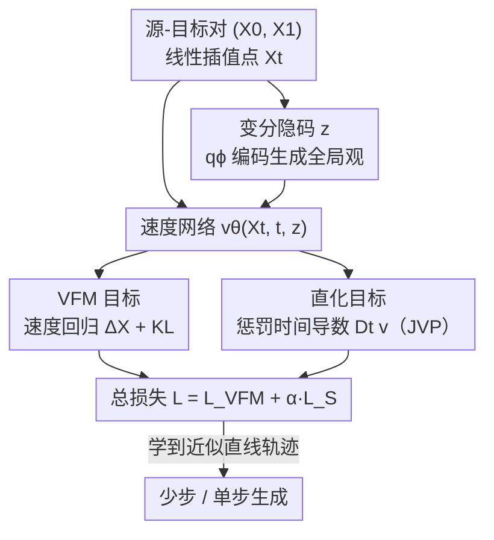

# Learning Straight Flows: Variational Flow Matching for Efficient Generation

**会议**: CVPR 2026  
**论文**: [CVF Open Access](https://openaccess.thecvf.com/content/CVPR2026/html/Ma_Learning_Straight_Flows_Variational_Flow_Matching_for_Efficient_Generation_CVPR_2026_paper.html)  
**代码**: 无  
**领域**: 图像生成 / 扩散与流匹配  
**关键词**: Flow Matching、直线轨迹、变分隐码、少步生成、ODE 采样

## 一句话总结
针对 Flow Matching 因独立耦合导致插值线交叉、学到的生成轨迹弯曲、需要多步 ODE 积分的问题，本文提出 **Straight Variational Flow Matching (S-VFM)**：给速度场注入一个 VAE 编码的变分隐码 $z$（"生成全局观"）来消解交叉处的方向歧义，再用一个"直化目标"惩罚速度场沿轨迹的时间导数，从而端到端学出近似直线的轨迹，在 CIFAR-10 / ImageNet 256 上以更少 NFE 拿到有竞争力甚至更优的 FID。

## 研究背景与动机

**领域现状**：Flow Matching（FM）通过学一个速度场 $v^X(x,t)$，让 ODE $\dot X_t = v^X(X_t,t)$ 把简单先验（高斯噪声）搬运到复杂数据分布。训练时用线性插值 $X_t=(1-t)X_0+tX_1$ 作为目标轨迹，损失就是把网络速度回归到条件速度 $\Delta^X=X_1-X_0$。

**现有痛点**：虽然训练用的是直线插值，FM **学到的生成轨迹却是弯的**。一旦轨迹弯曲，单步欧拉积分误差大，必须用很多 ODE 步才能保住生成质量，效率低。围绕"把轨迹掰直"已有三条路线——改耦合策略减少交叉、Rectified Flow 多轮蒸馏迭代逼近最优传输、Consistency/Mean-Velocity 模型强制时间一致性——但它们普遍受困于离散近似误差、训练不稳定、收敛困难，而且蒸馏类还要多轮训练、存在误差累积、最终模型往往难以超过初始直训模型。

**核心矛盾**：本文点出一个被忽视的**根本性矛盾**——FM 用的**独立耦合** $\rho(x_0,x_1)=\rho_0(x_0)\rho_1(x_1)$ 天然会让大量线性插值在某个 $X_t$ 处**相交**。交叉点上，边缘速度 $v^X(x,t)=\mathbb{E}[\Delta^X\mid X_t=x]$ 是若干互相冲突方向的平均，于是非交叉泛函 $V\big((X_0,X_1)\big)>0$。论文进一步证明：轨迹"直" $\Leftrightarrow V=0 \Leftrightarrow$ 速度场沿轨迹的时间导数 $D_t v^X=0$。也就是说，**只要还在独立耦合这个结构里，任何想直接学直线轨迹的方法都在和自己打架**——这正是上述方法不稳定、难收敛的病根。

**本文目标 / 切入角度**：与其在"独立耦合必然交叉"的结构下硬掰直线，不如**给模型一种在交叉处也能分辨该往哪走的能力**。作者的观察是：FM 是个马尔可夫过程，每步只看当前 $X_{t_i}$ 预测速度，缺少对整条轨迹的"全局观"，这正是交叉、弯曲的来源。

**核心 idea**：用一个变分隐码 $z$ 给速度场提供每个源-目标对的"生成全局观"，让它在插值线相交时也能选对方向；同时用一个直化目标把速度的时间导数压到零。两者结合，让 $Z$（理想直线插值）与 $X$（FM 轨迹）在独立耦合下变得相容，端到端学出近似直线的轨迹。

## 方法详解

### 整体框架
S-VFM 把 Variational Flow Matching 与一个直化目标拼成一个端到端可训的生成框架。输入是源-目标对 $(X_0,X_1)$ 及其线性插值点 $X_t$；一个后验编码器 $q_\phi$ 把 $(X_0,X_1,X_t,t)$ 压成变分隐码 $z$，这个 $z$ 携带"这条轨迹整体要从哪到哪"的全局信息；速度网络改为 $v_\theta(X_t,t,z)$，同时吃当前点、时间和隐码。训练时两个目标并行：VFM 目标让速度回归 $\Delta^X$ 并用 KL 约束 $z$ 的后验靠近先验；直化目标用 JVP 计算速度沿轨迹的时间导数 $D_t v$ 并把它压向零。推理时只需从先验 $p(z)$ 采一个 $z$，整条生成路径自始至终复用它，因为轨迹近乎直线，几步甚至一步就能出图。

### 关键设计

**1. 变分隐码 z：给速度场一个"生成全局观"去消解交叉处的方向歧义**

FM 弯曲的根在于它每步只看当前样本、对整条轨迹"该往哪去"一无所知，于是在多条插值线相交处只能取冲突方向的平均。S-VFM 沿用 Variational Flow Matching 的思路，引入一个由 VAE 编码的隐码

$$q_\phi(z\mid X_0,X_1,X_t,t)=\mathcal{N}\big(z;\,\mu_\phi(\cdot),\,\sigma_\phi(\cdot)\big),$$

它显式吃进了源、目标 $(X_0,X_1)$ 这份"生成全局观"。速度场升级为 $v_\theta(X_t,t,z)$，训练目标是

$$\mathcal{L}_{\mathrm{VFM}}(\theta,\phi)=\mathbb{E}\big[\|v_\theta(X_t,t,z)-\Delta^X\|^2\big]+\beta\,D_{\mathrm{KL}}\big(q_\phi(z\mid\cdot)\,\|\,p(z)\big),$$

其中 KL 项把后验拉向先验 $p(z)=\mathcal{N}(0,I)$，强度由 $\beta$ 控制。关键不在于直接消掉 $X$ 的交叉（那在独立耦合下根本做不到），而是有了 $z$ 这份全局信息后，即便两条插值线在 $X_t$ 相交，模型也能凭"我这次要去哪个目标"分辨出"往哪走"。正因为隐码能处理交叉，理想直线插值 $Z$ 与 FM 轨迹 $X$ 在独立耦合下才**变得相容**——这是它区别于普通 FM 的根本点。

**2. 直化目标：把速度场沿轨迹的时间导数压到零**

论文先在理论上把"直"翻译成可优化的量：定义沿特征线的时间全导数

$$\frac{d}{dt}v(x,t)=\frac{\partial v}{\partial t}+\big(\nabla_x v(x,t)\big)\,v(x,t),$$

并证明（Theorem 5）轨迹直（$V\big((X_0,X_1)\big)=0$）当且仅当 $D_t v^X(X_t,t)=0$。直接对 FM 的速度做这件事会和 FM 目标冲突（独立耦合的交叉让边缘速度天生不兼容直线），但一旦速度场带上隐码 $z$，时间导数就要把 $z$ 随时间的变化也算进来：

$$D_t v(X_t,t,z)=\partial_{X_t}v\cdot v^X+\partial_t v+\partial_z v\cdot \tfrac{dz}{dt},$$

其中 $\tfrac{dz}{dt}=\partial_{X_t}z\cdot v^X+\partial_t z$（因为 $X_0,X_1$ 端点固定、对 $t$ 导数为零）。把边缘速度按惯例替换成条件速度 $\Delta^X$ 后，直化损失落地为

$$\mathcal{L}_{\mathrm{S}}(\theta,\phi)=\mathbb{E}\Big[\big\|\partial_{X_t}v\cdot\Delta^X+\partial_t v+\partial_z v\cdot(\partial_{X_t}z\cdot\Delta^X+\partial_t z)\big\|^2\Big].$$

这些时间导数本质是各函数 Jacobian 与对应切向量的 **Jacobian-vector product (JVP)**。实现上作者特意指出要用 `torch.autograd.functional.jvp`（保留计算图以支持反传），而不是像部分前作那样用前向模式的 `torch.func.jvp`（不留图、无法反传），这是个容易踩的工程坑。

**3. 两目标加权合并 + 推理单 z 贯穿**

总损失把"会生成"和"走直线"两件事按权重拼起来：

$$\mathcal{L}(\theta,\phi)=\mathcal{L}_{\mathrm{VFM}}(\theta,\phi)+\alpha\,\mathcal{L}_{\mathrm{S}}(\theta,\phi),$$

$\alpha$ 调直化强度、$\beta$ 调 KL 强度（实验取 $\alpha=10,\ \beta=10^{-2}$）。这种端到端写法相对蒸馏/多阶段路线的好处是：不需要决定"何时停训、何时开始蒸馏"，也没有把误差从前一模型传给后一模型的累积问题，可以一直训下去持续变好。推理阶段更简单——从先验 $p(z)$ 采**一个**隐码 $z$，整条 $t=0\to1$ 的积分都复用它：

$$X_{t_{i+1}}=X_{t_i}+(t_{i+1}-t_i)\,v_\theta(X_{t_i},t_i,z).$$

由于轨迹已近乎直线，所需积分步数远少于普通 FM。

### 损失函数 / 训练策略
后验网络 $q_\phi$ 与速度网络 $v_\theta$ 共享结构：CIFAR-10 上 $v_\theta$ 用 UNet（含 16×16 与瓶颈层的自注意力），$q_\phi$ 用相似编码器把 $[X_0,X_1,X_t]$ 沿通道拼接、$t$ 经自适应组归一化条件化，输出 768 维的 $\mu_\phi,\sigma_\phi$；ImageNet 256 上换成 SiT-XL transformer，$q_\phi$ 用半数 block 的 SiT、末层平均池化后接 MLP 预测 $\mu_\phi,\sigma_\phi$。训练从后验 $q_\phi$ 采 $z$、测试从先验 $p(z)$ 采 $z$。隐码注入有两种条件化机制：**adaptive normalization**（$z$ 加到时间嵌入后再算 scale/shift）与 **bottleneck sum**（在最低分辨率把 $z$ 加权融进中间激活），实验中前者整体更优。

## 实验关键数据

### 主实验
CIFAR-10（32×32）上以 FID 衡量不同 NFE（function evaluation 次数）下的生成质量，对比 FM、Rectified Flow、Consistency/Mean-Velocity 系列：

| 方法 | #Params | NFE=1 | NFE=2 | NFE=5 | NFE=10 | Adaptive |
|------|---------|-------|-------|-------|--------|----------|
| Flow Matching | 36.5M | — | 166.65 | 36.19 | 14.4 | 3.66 |
| VFM | 60.6M | — | 97.83 | 13.12 | 5.34 | 2.49 |
| 2-Rectified Flow | 36.5M | 12.21 | 4.85 | — | — | 3.36 |
| MeanFlow | 55M | 2.92 | 2.23 | 2.84 | 2.27 | — |
| IMM | 55M | 3.20 | 1.98 | — | — | — |
| **S-VFM (bottleneck sum)** | 60.6M | 2.94 | 2.28 | 2.09 | 2.06 | 2.01 |
| **S-VFM (adaptive norm)** | 60.6M | **2.81** | 2.16 | 2.02 | **1.97** | **1.95** |

ImageNet 256×256 上用 SiT-XL/2 backbone，统一训练配方、生成 50K 图算 FID：

| 方法 | #Params | NFE | FID |
|------|---------|-----|-----|
| Shortcut-XL/2 | 675M | 1 | 10.60 |
| MeanFlow-XL/2 | 676M | 1 | 3.43 |
| **S-VFM-XL/2** | 677M | 1 | **3.31** |
| MeanFlow-XL/2 | 676M | 2 | 2.93 |
| **S-VFM-XL/2** | 677M | 2 | **2.86** |

### 消融 / 分析

| 配置 | 关键现象 | 说明 |
|------|---------|------|
| 隐码条件化：adaptive norm vs bottleneck sum | adaptive norm 全 NFE 段更优（如 NFE=1：2.81 vs 2.94） | 自适应归一化是更好的隐码注入方式 |
| 去掉直化目标（= VFM） | NFE=2 FID 从 ~2.16 退化到 97.83、需 NFE≈250 才可用 | 直化目标是少步生成的关键 |
| 去掉隐码（= 普通 FM） | NFE=2 FID 166.65，轨迹严重弯曲 | "生成全局观"对消解交叉不可或缺 |
| 超参 $\alpha=10,\ \beta=10^{-2}$ | 该组合下 S-VFM 取得最优 | $\alpha$ 控直化强度、$\beta$ 控 KL |

### 关键发现
- **少步是真本事**：S-VFM 的 FID 随 NFE 增大**单调下降**（CIFAR-10 NFE=1→10：2.81→1.97，Dopri5 自适应步 1.95），而 Consistency/Mean-Velocity 模型在高 NFE 反而退化（如 CT 在 NFE=5/10 升到 11.4/23.9）——说明 S-VFM 学的是真正一致的直线轨迹，而非只在某个步数上拟合好。
- **隐码控制语义、噪声控制布局**：固定初始噪声、改变 $z$，生成图保持相近色彩与空间布局，但物体类别/实例会随 $z$ 变化；$z$ 提供的"全局观"确实编码了"这条轨迹去哪个目标"。
- **训练也更省**：在 ImageNet 上对比训练迭代曲线，S-VFM（NFE=10）相对 SiT、VFM（NFE=250）在同等迭代下持续更低 FID，训练、推理双双更高效。

## 亮点与洞察
- **把"直不直"还原成一个可优化量**：用非交叉泛函 $V$ 串起"直线 ⟺ $V=0$ ⟺ 速度时间导数为零"三者等价，这条理论链把直觉变成了一个可直接最小化的损失，是方法的骨架。
- **不消交叉、而是消歧义**：以往路线都想把 $X$ 的交叉本身去掉（改耦合/蒸馏/一致性），S-VFM 反其道——承认独立耦合下交叉不可避免，转而给模型"全局观"让它在交叉处分辨方向，从而绕开"独立耦合必然交叉"这个死结，思路很巧。
- **JVP 实现细节是可复用的工程经验**：要用 `torch.autograd.functional.jvp`（保留计算图）而非前向模式 `torch.func.jvp`，凡是要对"速度沿轨迹时间导数"这类量做反传的工作都用得上。
- **端到端 vs 蒸馏**：把直化做成一个 loss 项而非多阶段流程，省掉了"何时停训/开蒸馏"的调度难题，也避免了蒸馏的误差累积，可持续训练。

## 局限与展望
- **理论保证 vs 实际可达**：论文证的是"带 $z$ 后 $Z$ 与 $X$ 相容"，但隐码究竟在多大程度上真把时间导数压到零、对复杂高分辨率数据是否仍成立，正文主要靠 FID 与可视化间接佐证，缺少对 $V$ 或 $D_t v$ 残差的直接量化。
- **参数与算力开销**：引入后验网络 $q_\phi$ 让参数从 36.5M 升到 60.6M（CIFAR-10），JVP 还要额外的导数计算，单步更省但单次训练前向更重，论文未给出训练 wall-clock 的细账。
- **超参敏感**：$\alpha,\beta$ 的取值（10 / 1e-2）对结果影响明显，正文称有分析但缓存全文未含完整消融表，跨数据集的迁移性需谨慎（⚠️ 详细 $\alpha,\beta$ 扫描以原文 Ablation 一节为准）。
- **改进方向**：把直化残差作为显式监控/早停信号、或将隐码扩展为时变 $z_t$ 以处理更长更弯的轨迹，可能进一步压少步生成的 FID。

## 相关工作与启发
- **vs Rectified Flow / 蒸馏**：它们靠多轮迭代重训把训练对的轨迹逐步掰直、逼近最优传输，代价是多轮训练、误差累积、最终常难超初始模型；S-VFM 单阶段端到端，无蒸馏调度与误差传递。
- **vs Consistency / Mean-Velocity 模型（CT、iCT、MeanFlow、IMM、Shortcut）**：它们强制不同时间步输出一致来逼近直线，但依赖 bootstrap、需精心调度，且常受离散近似误差、训练不稳定困扰；S-VFM 用变分隐码 + 直化目标，是与之不同的方向，且在高 NFE 不退化。
- **vs 原始 VFM**：S-VFM 在 VFM 的隐码框架上加了直化目标（penalize $D_t v$），把 VFM 从"会生成但轨迹弯、需高 NFE"推进到"轨迹直、少步可用"——表中 VFM 在 NFE=2 时 FID 97.83，S-VFM 降到 2.16。

## 评分
- 新颖性: ⭐⭐⭐⭐⭐ 把"直线轨迹"还原为可优化的时间导数，并用变分隐码消歧义而非消交叉，理论与方法都有清晰的新意
- 实验充分度: ⭐⭐⭐⭐ 合成 + CIFAR-10 + ImageNet 256 三档验证、NFE 全段对比，但完整 $\alpha,\beta$ 消融表未在正文展开
- 写作质量: ⭐⭐⭐⭐ 理论铺陈（定义/引理/定理）严谨、动机链条清楚，公式偶有 OCR 噪声
- 价值: ⭐⭐⭐⭐ 为少步/单步生成提供了一条端到端、可持续训练且不退化的新路径，对高效扩散/流生成有实用价值

<!-- RELATED:START -->

## 相关论文

- [\[ICML 2026\] The Coupling Within: Flow Matching via Distilled Normalizing Flows](../../ICML2026/image_generation/the_coupling_within_flow_matching_via_distilled_normalizing_flows.md)
- [\[ICLR 2026\] Purrception: Variational Flow Matching for Vector-Quantized Image Generation](../../ICLR2026/image_generation/purrception_variational_flow_matching_for_vector-quantized_image_generation.md)
- [\[CVPR 2026\] BiFM: Bidirectional Flow Matching for Few-Step Image Editing and Generation](bifm_bidirectional_flow_matching_for_few-step_image_editing_and_generation.md)
- [\[CVPR 2026\] EgoFlow: Gradient-Guided Flow Matching for Egocentric 6DoF Object Motion Generation](egoflow_gradient-guided_flow_matching_for_egocentric_6dof_object_motion_generati.md)
- [\[CVPR 2026\] MPDiT: Multi-Patch Global-to-Local Transformer Architecture for Efficient Flow Matching](mpdit_multi-patch_global-to-local_transformer_architecture_for_efficient_flow_ma.md)

<!-- RELATED:END -->
