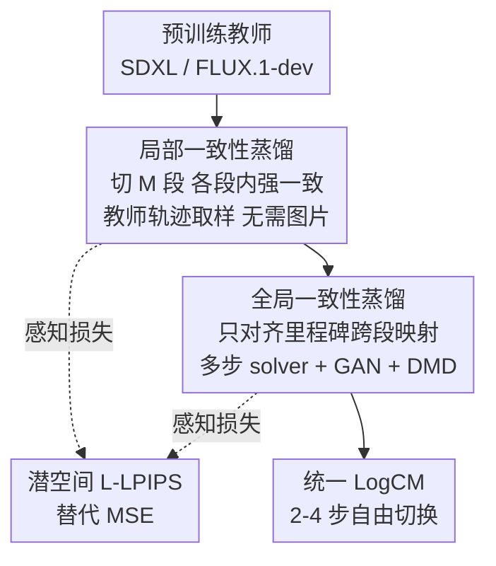

# LogCD: Local-to-global Consistency Distillation for Few-step Image Generation

**会议**: CVPR 2026  
**论文**: [CVF Open Access](https://openaccess.thecvf.com/content/CVPR2026/html/Xie_LogCD_Local-to-global_Consistency_Distillation_for_Few-step_Image_Generation_CVPR_2026_paper.html)  
**代码**: 无  
**领域**: 扩散模型 / 图像生成  
**关键词**: 扩散加速, 一致性蒸馏, 少步采样, 无图蒸馏, SDXL/FLUX  

## 一句话总结
LogCD 用"先局部、后全局"两阶段一致性蒸馏，把 SDXL / FLUX.1-dev 这类大扩散/整流流模型压成统一的 2–4 步采样模型，全程不需要任何训练图片，仅 70 A100 小时就让 SDXL 在 3 步采样下达到 33.5 的 CLIP score，逼近 25 步教师模型。

## 研究背景与动机
**领域现状**：潜空间扩散模型（LDM，如 SDXL）和整流流模型（RFM，如 FLUX.1-dev）能生成高质量图像，但采样要几十上百次模型前向，推理慢、成本高。把它们蒸馏成一步/少步采样的快速模型是当前热点，代表方法有 LCM、SDXL-Lightning、PCM、DMD2、HyperSD、Flash SDXL 等。

**现有痛点**：这些方法普遍二选一地踩坑——要么需要大量高质量图文训练数据 + 长训练时间（DMD2 要 3840 A100 小时），要么在压到 4 步以内时画质和**文图对齐**严重退化（LCM/PCM 四步出图发糊）。HyperSD 虽然用多阶段蒸馏改善了一致性模型，但引入了冗余的子轨迹一致性蒸馏和复杂训练流程，导致文图对齐大幅下降且训练开销巨大（800 A100 小时）。

**核心矛盾**：在"整个时间区间 $[0,T]$ 上一次性学全局一致性"这件事本身就很难——单阶段蒸馏（LCM/PCM）学不动，多阶段蒸馏（HyperSD）又要烧很多资源。质量、文图对齐、训练成本三者拉扯。

**本文目标**：作者先抛出一个务实判断——**一步生成在实际应用里未必最优**，很多场景能接受 2–4 步以换取画质。于是目标变成：做一个**统一模型**，能在 2/3/4 步之间自由切换、步数越多质量越好，且训练成本极低。

**切入角度**：用分治思想（divide-and-conquer）。与其硬啃整段轨迹的一致性，不如先把 $[0,T]$ 切成若干小段、在每段内分别学局部一致性（简单任务），再补一个全局阶段把跨段的映射对齐。

**核心 idea**：用"局部一致性蒸馏 + 全局一致性蒸馏"两阶段流程，配上潜空间感知损失（L-LPIPS）和**无图（image-free）**训练策略，低成本地把大模型蒸成少步统一采样器。

## 方法详解

### 整体框架
LogCD 输入是一个预训练教师扩散/整流流模型（SDXL 或 FLUX.1-dev），输出是一个只训练 LoRA（rank=64）的学生模型 LogCM，能在 2–4 步采样。整条流水线分两阶段串行：**第一阶段局部 CD** 把时间轴 $[0,T]$ 切成 $M$ 个小区间（默认 $M=8$），在每个区间内强制一致性，让模型先学会用 $M$ 步采样出高质量图；**第二阶段全局 CD** 只在预定义的里程碑时间点 $\{t^s_{step}\}$ 之间强制一致性，把跨区间的大跳步映射学好，从而支持把步数压到 2–4。两阶段都用**无图策略**：局部阶段从教师采样轨迹取训练样本，全局阶段用学生自己生成的合成图。感知层面再叠一个在潜空间训练的 L-LPIPS 损失替代 MSE。

### 关键设计

**1. 局部一致性蒸馏：把"整段轨迹一致"拆成"每小段内一致"的简单子任务**

直接在 $[0,T]$ 全程学一致性太难（LCM/PCM 的通病），LogCD 先做分治：把时间轴切成 $M$ 个小区间，里程碑为 $0=t^0_{step}<t^1_{step}<\cdots<t^M_{step}=T$，**只在每个区间 $[t^s_{step},t^{s+1}_{step}]$ 内**强制一致性，即把区间内任意点都映射到该区间的固定终点 $t^s_{step}$。损失为 MSE 形式：

$$L^{MSE}_{LoCD}=\big\|g_\theta(z_{t_m},t_m,t^s_{step},c)-\mathrm{sg}(g_\theta(z_{t_n},t_n,t^s_{step},c))\big\|_2^2$$

其中 $t_n=t_m-skip$，$g_\theta(z_{t_m},t_m,t^s_{step},c)=\Psi(z_{t_m},f_\theta(z_{t_m},c,t_m),t_m,t^s_{step})$。几个关键工程取舍：① **固定区间终点**为 $t^s_{step}$，而不像 CTM/HyperSD 那样随机采样终点，避免冗余目标、收敛更快；② skip 设为 20 加速收敛；③ 用 **stop-gradient（sg）替代 EMA 模型**省显存；④ 把 CFG 显式融进目标，$\hat\epsilon_{\theta_0}(z_t,c,w,t):=\epsilon_{\theta_0}(z_t,\varnothing,t)+w(\epsilon_{\theta_0}(z_t,c,t)-\epsilon_{\theta_0}(z_t,\varnothing,t))$，因为高质量文图对齐离不开 CFG。这一阶段让模型先获得 $M$ 步采样出好图的能力，是后续压步数的基础。

**2. 全局一致性蒸馏：只对齐"会被真正用到"的里程碑跨段映射，让模型能压到 2–4 步**

局部 CD 只保证 $M$ 步内一致，步数一旦减少（采样步长变大）离散化误差骤增、画质下滑。全局 CD 显式教模型学**跨区间**的状态映射：与原始 CD 强制"轨迹上任意点都映射到真实数据"不同，全局 CD **只在预定义里程碑 $\{t^s_{step}\}$ 之间**强制一致性，丢掉那些推理时永远用不到的轨迹，从而简化映射学习、对齐训练与推理。此时 skip 直接变成大跳步 $T/M$，进一步加速收敛。但大跳步会放大单步 solver 的离散化误差，作者改用**多步 solver**：把区间 $T/M$ 均匀分成 $p$ 份、用带 CFG 的 $p$ 步 solver 估计 $\hat z_{t_n}$（默认 $p=3$）。MSE 形式损失：

$$L^{MSE}_{GoCD}=\big\|f_\theta(\hat z_{t_m},c,t_m)-\mathrm{sg}(f_\theta(\hat z_{t_n},c,t_n))\big\|_2^2,\quad t_n=t_m-T/M$$

高分辨率生成下单纯 MSE 抓不准分布差异，于是再叠两路分布层面的约束：一个 **GAN 损失** $L^{GAN}_{GoCD}$，但它对齐的不是"学生输出 vs 真实数据"，而是学生在相邻里程碑两点的输出 $\tilde z^0_{t_m}$ 与 $\tilde z^0_{t_n}$ 之间的分布一致性；一个**无图版 DMD 损失** $L^{DMD}_{GoCD}$，用预训练 score 模型与 fake score 模型把生成分布拉近真实分布。总损失 $L_{GoCD}=L^{MSE}_{GoCD}+\lambda_1 L^{GAN}_{GoCD}+\lambda_2 L^{DMD}_{GoCD}$（SDXL 上 $\lambda_1=0.1,\lambda_2=1$）。靠这套设计，SDXL 的全局 CD 只需 3K 次迭代就能出好结果。

**3. 潜空间 L-LPIPS：在不解码回像素空间的前提下补上感知一致性**

MSE 只在潜空间约束数值一致，抓不到感知特征；而 LPIPS 虽贴合人类感知，却是为**像素空间**设计的——把潜码解码回像素再算 LPIPS 会大幅增加显存和训练时间。作者直接**从零训练一个潜空间版 LPIPS（L-LPIPS）**：基于 VGG，在 BAPPS 数据集上训练，把输入通道改成潜表示 $z_0$ 的通道数，并去掉 3 个 max-pooling 层（因为 LDM/RFM 潜空间已经 8× 下采样）。训练成本极低（1 A100、10 epoch）。训练好后，用 L-LPIPS 算的一致性损失 $L^{LLP}_{LoCD}$、$L^{LLP}_{GoCD}$ 分别替换两阶段里的 MSE 项，在不解码、几乎不加成本的情况下注入感知一致性。

**4. 无图蒸馏策略：两阶段都不依赖任何真实图文数据**

为彻底摆脱高质量图文数据集，两阶段的训练样本都"自给自足"。局部 CD 阶段：从纯高斯噪声 $z_T$ 出发，用现成 ODE solver（LDM 用 DDIM、RFM 用 Euler）跑教师的去噪迭代得到 $z_{t_m}$ 作为训练数据——注意对较小的 $t_m$ 要多跑几步迭代以获得更干净的 $z_{t_m}$（单步直接得到的噪声样本质量太差）；这与 BOOT/Imagine Flash 用学生生成数据不同，因为局部 CD 要沿**教师** ODE 轨迹强一致，必须用教师生成。全局 CD 阶段：用当前学生跑 $q$ 步（默认 $q=4$）生成合成图 $\hat z_0$，再加噪得到 $\hat z_{t_m}$。整套无图策略是其训练成本只有竞品零头的关键之一。

### 损失函数 / 训练策略
两阶段统一只训练 LoRA（rank=64），教师初始化学生。SDXL：局部 CD 12K 迭代 + 全局 CD 3K 迭代；FLUX.1-dev：局部 6K + 全局 6K。局部 CD 学习率 $10^{-4}$、全局 CD $10^{-5}$，AdamW，4×A100。判别器以教师 U-Net 为骨干（冻结）+ 若干轻量残差卷积头（只训练头部）。超参 $M=8$、CFG 尺度 $w=7.0$、教师 solver 步 $p=3$、学生去噪步 $q=4$。FLUX.1-dev 因 DMD 损失显存超限，将 $\lambda_2$ 置 0。

## 实验关键数据

### 主实验
SDXL 教师上，在 MSCOCO-2017 5K 与 MJHQ-5K 上对比 SOTA 加速方法（CS=CLIP Score↑、FID↓、IR=ImageReward↑、TH=训练 A100 小时）：

| 方法 | 步数 | CS (MSCOCO)↑ | FID↓ | IR↑ | CS (MJHQ)↑ | FID↓ | 训练时长 TH↓ |
|------|------|------|------|------|------|------|------|
| DDIM 教师 | 25 | 34.1 | 23.8 | 0.84 | 36.0 | 16.7 | 0 |
| LCM | 4 | 32.5 | 27.8 | 0.51 | 34.1 | 21.8 | 32 |
| SDXL-Lightning | 4 | 33.0 | 29.6 | 0.72 | 33.9 | 20.7 | - |
| PCM | 4 | 32.5 | 33.6 | 0.63 | 33.5 | 27.8 | - |
| DMD2 | 4 | 33.3 | **25.3** | 0.91 | 35.2 | 18.3 | 3840 |
| HyperSD | 4 | 32.8 | 35.2 | 1.15* | 34.1 | 23.8 | 800 |
| Flash SDXL | 4 | 32.6 | 26.9 | 0.40 | 33.5 | 24.2 | 176(H100) |
| **LogCM** | 3 | **33.5** | 26.0 | 0.94 | **35.1** | 17.9 | **70** |
| **LogCM** | 4 | **33.5** | 25.9 | 0.95 | **35.2** | 17.8 | **70** |

*HyperSD 的 IR 用 ImageReward 直接优化过，对其不公平；其原论文未做 IR 优化的 4 步版本仅 0.78 IR，低于 3 步 LogCM。

要点：3 步 LogCM 在 CS/IR 上全面领先 4 步竞品，且训练成本仅为 DMD2 的 1.8%、HyperSD 的 9%；CS 已逼近 25 步教师，IR 甚至超过教师（得益于 DMD 损失拉近真实分布）。FLUX.1-dev 上 4 步 LogCM（仅训练 662M LoRA）逼近 25 步教师，实现约 4× 推理提速。

### 消融实验
SDXL、4 步采样下逐项加组件（Table 3）：

| 配置 | CS↑ | FID↓ | IR↑ | 说明 |
|------|------|------|------|------|
| 仅 $L^{MSE}_{LoCD}$ | 32.4 | 27.9 | 0.52 | 仅局部 CD（MSE） |
| 仅 $L^{LLP}_{LoCD}$ | 32.5 | 26.7 | 0.62 | L-LPIPS 替 MSE，全指标涨 |
| + 全局 $L^{LLP}_{GoCD}$ | 33.1 | 26.4 | 0.76 | 跨段一致性，CS/IR 显著提升 |
| + $L^{GAN}_{GoCD}$ | 33.4 | 26.2 | 0.82 | GAN 分布一致性 |
| + $L^{DMD}_{GoCD}$ (Full) | **33.5** | **25.9** | **0.95** | 全损失，全指标最佳 |

区间数 $M$（Table 4）：$M$ 从 4→8 提升明显，超过 8 后饱和（$M=4$ 时单区间太长难优化）。教师 solver 步 $p$（Table 5）：$p$ 从 1→4 持续提升，证明大跳步下多步 solver 能降离散化误差。学生去噪步 $q$（Table 6）：$q\ge 3$ 后基本饱和（3 步采样已足够生成高质量合成图）。

### 关键发现
- **两阶段缺一不可**：只做局部 CD（32.4 CS）压步会掉点，加全局 CD 后 CS 升到 33.1，是支撑 2–4 步统一采样的核心。
- **DMD 损失贡献最大的"质感"提升**：把 IR 从 0.82 推到 0.95，让生成分布最贴近真实数据。
- **统一模型可变步数**：单一模型支持 2/3/4 步，步数越多 IR 越好；而 Lightning/PCM/DMD2 每个步数要单独 checkpoint。

## 亮点与洞察
- **"局部→全局"分治蒸馏**：把难学的全程一致性拆成易学的分段一致性、再补跨段对齐，思路清晰且直接转化为收敛速度（SDXL 全局 CD 仅 3K 迭代），是可迁移到其它一致性/轨迹蒸馏任务的范式。
- **L-LPIPS 把感知损失搬进潜空间**：去掉 3 个 pooling、改通道数就能在 8× 下采样的潜空间算 LPIPS，省掉昂贵的解码回像素，几乎零成本注入感知一致性——这个 trick 对任何潜空间生成模型的感知约束都通用。
- **彻底无图 + 只训 LoRA**：训练样本全靠教师/学生自产，参数只动 662M LoRA，70 A100 小时打平上千小时的 DMD2，工程性价比极高。
- **全局 CD 的 GAN 对齐的是"学生相邻里程碑两点"而非"学生 vs 真实"**：把分布一致性约束嵌进一致性框架内部，是个不太常见但自洽的设计。

## 局限与展望
- **不追求一步生成**：作者主动放弃 1 步，定位在 2–4 步；对极端低延迟（单步）场景不是最优解。
- **DMD 损失显存开销大**：FLUX.1-dev 上因显存超限被迫关掉 DMD（$\lambda_2=0$），意味着该分支在更大模型上难以照搬，FLUX 版本的分布对齐被削弱。
- **指标天花板受教师约束**：本质是蒸馏，CS/FID 上限大体由教师决定，逼近但难超越全步教师（IR 例外）。
- **多超参需调**：$M$、$p$、$q$、$skip$、$\lambda_1$、$\lambda_2$ 等都需经验设定，换底模可能要重新调。

## 相关工作与启发
- **vs LCM/PCM**：它们做单阶段、整段或分段一致性蒸馏，少步出图发糊；LogCD 用两阶段局部→全局，4 步内画质和文图对齐显著更好（CS 32.5→33.5）。
- **vs HyperSD**：同为多阶段，但 HyperSD 引入冗余子轨迹一致性 + 复杂流程、训练 800 小时且文图对齐退化；LogCD 只对齐里程碑跨段映射、丢掉无用轨迹，9% 训练成本反超其 CS/FID。
- **vs DMD2**：DMD2 靠改进分布匹配蒸馏 + 海量训练（3840 小时）；LogCD 把 DMD 当全局 CD 的一个分量，用 1.8% 训练时间拿到更好 CS/IR（FID 略逊）。
- **vs BOOT / Imagine Flash**：同走无图/合成数据路线，但它们用学生生成数据；LogCD 局部阶段坚持用教师生成，因为要沿教师 ODE 轨迹强一致。

## 评分
- 新颖性: ⭐⭐⭐⭐ 局部→全局分治蒸馏 + 潜空间 LPIPS + 无图策略组合扎实，单点创新中等但工程整合度高
- 实验充分度: ⭐⭐⭐⭐⭐ SDXL/FLUX 双底模、三数据集、5 张消融表覆盖 $M/p/q$ 与各损失项
- 写作质量: ⭐⭐⭐⭐ 方法层次清晰、公式完整，部分符号略密
- 价值: ⭐⭐⭐⭐⭐ 70 A100 小时打平上千小时方法，统一可变步数模型，落地价值高

<!-- RELATED:START -->

## 相关论文

- [\[CVPR 2026\] Uni-DAD: Unified Distillation and Adaptation of Diffusion Models for Few-step Few-shot Image Generation](uni-dad_unified_distillation_and_adaptation_of_diffusion_models_for_few-step_few.md)
- [\[CVPR 2026\] Flash-DMD: Towards High-Fidelity Few-Step Image Generation with Efficient Distillation and Joint Reinforcement Learning](flash-dmd_towards_high-fidelity_few-step_image_generation_with_efficient_distill.md)
- [\[CVPR 2026\] Beyond Patches: Global-aware Autoregressive Model for Multimodal Few-Shot Font Generation](beyond_patches_global-aware_autoregressive_model_for_multimodal_few-shot_font_ge.md)
- [\[CVPR 2026\] Few-Step Diffusion Sampling Through Instance-Aware Discretizations](few-step_diffusion_sampling_through_instance-aware_discretizations.md)
- [\[CVPR 2026\] MPDiT: Multi-Patch Global-to-Local Transformer Architecture for Efficient Flow Matching](mpdit_multi-patch_global-to-local_transformer_architecture_for_efficient_flow_ma.md)

<!-- RELATED:END -->
