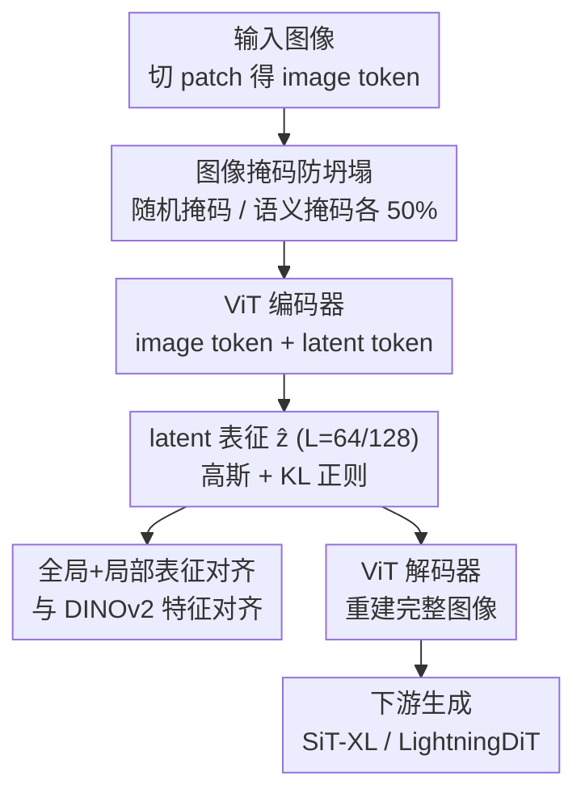

# MacTok: Robust Continuous Tokenization for Image Generation

**会议**: CVPR 2026  
**论文**: [CVF Open Access](https://openaccess.thecvf.com/content/CVPR2026/html/Zeng_MacTok_Robust_Continuous_Tokenization_for_Image_Generation_CVPR_2026_paper.html)  
**代码**: 无  
**领域**: 图像生成 / 视觉 tokenizer  
**关键词**: 连续 tokenizer, 后验坍塌, 图像掩码, 表征对齐, KL-VAE

## 一句话总结
MacTok 用「在图像 token 上做掩码 + DINOv2 引导的语义掩码 + 全局/局部表征对齐」三招，治住了强压缩下 KL-VAE 连续 tokenizer 的后验坍塌问题，在 ImageNet 上只用 64/128 个 1D token 就拿到了 256→256 gFID 1.44、512→512 gFID 1.52 的（接近）SOTA 生成质量。

## 研究背景与动机

**领域现状**：现代视觉生成（扩散、流匹配、自回归）都先把图像压进一个紧凑的 latent 空间再建模，这一步靠 image tokenizer 完成。tokenizer 分两派：离散派（VQ-VAE / VQ-GAN / TiTok）用有限码本量化，稳定但有量化误差；连续派（KL-VAE / SD-VAE / MAR-VAE）用高斯先验 + KL 散度正则出一个平滑的连续 latent 空间，表征更光滑。

**现有痛点**：连续派在「token 数压得越少」时越容易**后验坍塌（posterior collapse）**——KL 正则太强会把后验硬推向各向同性高斯先验，编码器干脆放弃往 latent 里写有用信息，解码器只能靠先验"瞎猜"，重建和生成质量都崩。作者自己复现 KL-VAE 时在强压缩下频繁观察到这种坍塌。

**核心矛盾**：压缩效率（token 越少越好）和生成质量（信息要保住）之间存在 trade-off。已有解法主要靠**调 KL 权重**（KL annealing / 手调系数），但这要精细调参，而且只是延缓坍塌、没从根上解决 latent 退化。

**本文目标**：在不靠脆弱调参的前提下，让连续 tokenizer 在 64/128 这种极少 token 下仍然保住语义信息、不坍塌。

**切入角度**：坍塌的本质是「输入 ↔ latent 之间的互信息被 KL 压没了」。要保住互信息，就得逼模型**必须用 latent 才能完成任务**。作者从掩码表征学习（MAE 式）借灵感——让 tokenizer 从**残缺的图像**里重建完整图像，那 latent 就不得不扛起信息传递的责任。关键发现是：掩码要打在**图像 token** 上而不是 latent token 上（后者只能短暂续命、最终还是坍）。

**核心 idea**：用「图像掩码（随机 + DINO 语义引导）强制信息流过 latent」+「与 DINOv2 的全局/局部表征对齐结构化 latent 空间」来取代调 KL 权重，从根上防坍塌。

## 方法详解

### 整体框架
MacTok 是一个 1D 连续 tokenizer：编码器把图像切成 patch 得到 image token，再拼上一组可学习的 latent token，一起过 ViT 编码器，取 latent token 位置的输出当 latent 表征 $\hat z\in\mathbb{R}^{L\times Z}$（$L$=64 或 128），并按高斯变量 + KL 正则建模成连续空间；解码器把采样后的 $\hat z$ 和重建 token 拼起来过 ViT 解码器还原图像。在这条主干上，MacTok 加了两件防坍塌的事：**编码前对 image token 做掩码**（随机掩码 / DINO 语义掩码各 50% 概率），逼 latent 从残缺输入里推全图；以及把 latent 表征**与 DINOv2 特征做全局+局部对齐**当辅助正则。训练目标是重建 + 感知 + 对抗 + KL + 表征对齐的复合损失。

### 关键设计

**1. 把掩码打在图像 token 上，而不是 latent token 上**

这是全文最关键的观察。后验坍塌的根因是 latent 没扛住信息、解码器靠先验补全，所以要逼模型「必须用 latent」。一个自然想法是像 dropout 那样随机丢掉部分 latent token（前人做法），作者实验发现这只能**短暂延缓**坍塌，训练继续下去模型照样崩。真正有效的是在**编码前对 image patch token** 做掩码：把一部分 patch 替成 mask token 再进编码器，强迫编码器和解码器都从残缺输入里**推断缺失区域**——这条信息只能经由 latent 传过去，于是 latent 被逼着编码全局结构语义，互信息得以维持。掩码比例 $m$ 从 $[-0.1, M]$ 均匀采样再裁到 $[0, M]$（默认 $M{=}0.7$），负下界让模型偶尔能看到完整图（$m{=}0$），避免持续高掩码把重建质量拖垮。消融里随机掩码一项就把 gFID 从坍塌状态拉到 6.01（Tab.5），是防坍塌的主力。

**2. DINOv2 引导的语义掩码：专挑"最该看"的区域遮住**

纯随机掩码对语义结构是盲的——遮掉的可能全是背景，重建任务太简单、学不到判别性语义。MacTok 再加一路**语义掩码**：用预训练 DINOv2 算 class token $c$ 和每个 patch token $p_i$ 的余弦相似度

$$s_i = \frac{c^\top p_i}{\lVert c\rVert\,\lVert p_i\rVert},\qquad \mathcal{M}_p = \mathrm{TopK}\big(\{s_i\},\ \lceil m\cdot N\rceil\big)$$

把相似度最高（即最语义相关）的 $\lceil m N\rceil$ 个 patch 挑出来遮掉。这样重建任务被刻意变难——模型被迫从残缺观测里恢复**物体级结构和全局上下文**，等于把 DINOv2 学到的语义先验**隐式搬进** latent 空间。训练时随机掩码和语义掩码各 50% 概率交替（消融里 "dino 50%" 比 "dino 100%" 更好：gFID 13.95 vs 14.84，Tab.4），两者互补：随机掩码保鲁棒性，语义掩码保判别性。

**3. 全局 + 局部表征对齐：让 latent 空间结构化**

光防坍塌还不够，作者还想让 latent 空间**有结构**（相似语义聚到一起）。已有的表征对齐要么固定 token 数、要么只做粗粒度全局对齐、要么堆一堆辅助目标。MacTok 提出轻量的全局+局部双重对齐：先把 $L$ 个 latent token 各复制 $r{=}N/L$ 份扩展成 $\tilde z_{loc}\in\mathbb{R}^{N\times Z}$ 去匹配 DINOv2 的 patch 粒度，同时对 latent 平均池化得全局表征 $\tilde z_{glob}$，两者各过一个轻量 MLP 投到 DINOv2 特征空间，用余弦相似度对齐：

$$\mathcal{L}_{RA} = -\frac{1}{N+1}\Big[\sum_{i=1}^{N}\mathrm{sim}(o_{loc,i}, p_i) + \mathrm{sim}(o_{glob}, c)\Big]$$

局部对齐（$o_{loc}$ vs patch token $p_i$）保细节和空间一致性，全局对齐（$o_{glob}$ vs class token $c$）保高层语义一致性。这套对齐能在不同 token 长度下都给出一致的语义引导，消融里 local alignment 把 gFID 从 6.01 拉到 3.53、global alignment 再到 3.15（Tab.5）。

### 损失函数 / 训练策略
总损失是复合目标：

$$\mathcal{L} = \mathcal{L}_{recon} + \lambda_1\mathcal{L}_{percep} + \lambda_2\mathcal{L}_{adv} + \lambda_3\mathcal{L}_{KL} + \lambda_4\mathcal{L}_{RA}$$

权重 $\lambda_1{=}1.0,\ \lambda_2{=}0.2,\ \lambda_3{=}10^{-6},\ \lambda_4{=}0.1$。骨干为 ViT-Base 编码/解码器（共 176M 参数），编码器用 DINOv2 权重初始化注入语义先验；判别器用冻结的 DINO-S，配 DiffAug、一致性正则、LeCAM。ImageNet 256→256 训 250K 步、512→512 训 500K 步。一个工程细节：**解码器微调**——训完主模型后冻结编码器、不带掩码地把解码器再训 10 个 epoch，恢复因高掩码略损的重建保真度同时保住学到的语义结构（Tab.4 里它把 rFID 0.57→0.43）。

## 实验关键数据

### 主实验
ImageNet 条件生成，1D token，所有数字越低越好（rFID/gFID）/越高越好（IS）：

| 设置 | tokenizer | #Tokens | rFID↓ | gFID↓ (w/ CFG) | IS↑ |
|------|-----------|---------|-------|----------------|-----|
| 256→256 | SoftVQ-VAE | 64 | 0.88 | 1.78 | 279.0 |
| 256→256 | MAETok | 128 | 0.48 | 1.67 | 311.2 |
| 256→256 | LightningDiT | 256 | 0.28 | 1.35 | 295.3 |
| 256→256 | **MacTok+SiT-XL** | **64** | 0.75 | 1.58 | 310.4 |
| 256→256 | **MacTok+SiT-XL** | **128** | 0.43 | **1.44** | 302.5 |
| 512→512 | SoftVQ-VAE | 64 | 0.71 | 2.21 | 290.5 |
| 512→512 | MAETok | 128 | 0.62 | 1.69 | 304.2 |
| 512→512 | **MacTok+SiT-XL** | **64**† | 0.89 | **1.52** | 306.0 |
| 512→512 | **MacTok+SiT-XL** | **128** | 0.79 | **1.52** | 316.0 |

（†：为与 SoftVQ-VAE 公平比较用了大解码器。）核心卖点：在 256 上 128 token 拿到 gFID 1.44（接近 LightningDiT 用 256 token 的 1.35），在 512 上 64/128 token 双双 1.52 刷新 SOTA，比 SoftVQ-VAE 同 token 数高 0.69 gFID，且 token 数比许多需 256+ token 的方法少最多 64 倍。

### 消融实验
模块逐项叠加（MacTok-128 + SiT-B，带解码器微调，最优 CFG，Tab.5）：

| 配置 | rFID↓ | gFID↓ | IS↑ | 说明 |
|------|-------|-------|-----|------|
| + 随机掩码 | 0.58 | 6.01 | 234.8 | 防坍塌主力，gFID 直接可用 |
| + 局部对齐 | 0.44 | 3.53 | 241.9 | 结构化 latent，重建生成双升 |
| + 语义掩码 | 0.43 | 3.32 | 249.2 | 注入语义鲁棒性 |
| + 全局对齐 | 0.43 | **3.15** | 258.3 | 高层语义一致性，最优 |

掩码比例 $M$ 消融（无解码器微调，无 CFG，Tab.4）：$M$ 从 0.4→0.7 gFID 逐步降到 14.59，0.8 反升到 14.92，**$M{=}0.7$ 最优**；随机+语义各 50%（dino 50%）比全语义（dino 100%）更好（13.95 vs 14.84）。

### 关键发现
- **随机掩码贡献最大**：单它一项就把坍塌的 KL-VAE 拉到 gFID 6.01 可用区间，是防坍塌的根本开关。
- **掩码强度有甜点**：$M{=}0.7$ 最佳，太弱（0.4）逼不出信息保留、太强（0.8）重建被拖垮；随机与语义掩码 1:1 混合优于纯语义。
- **latent 空间可视化**（Fig.5）佐证机制：坍塌 KL-VAE 的 latent 各向同性、毫无结构；加掩码后变紧凑；再加表征对齐后语义概念明显聚类，且线性探测精度与生成质量正相关、收敛快约 6.25×。

## 亮点与洞察
- **"掩码打在哪"是胜负手**：同样是掩码，打 latent token 只能延缓坍塌、打 image token 才能根治——因为只有后者逼信息**必须流经 latent** 才能完成重建。这个区分很反直觉也很有迁移价值。
- **用现成 DINOv2 当"出题老师"**：语义掩码用 DINOv2 的 cls-patch 相似度挑最该遮的区域，把判别式自监督模型的语义先验"免费"蒸进生成式 tokenizer 的 latent，零额外可训练参数。
- **极致 token 效率**：64/128 个 1D token 打平甚至超过 256~1024 token 的方法，对下游扩散/自回归生成的训练推理成本是实打实的省。
- **可迁移的配方**：「掩码逼信息流 + 与基础模型表征对齐」这套思路不限于图像，对任何强压缩自编码（视频/音频 tokenizer、VAE 隐空间）都可能有效。

## 局限与展望
- **强依赖 DINOv2**：语义掩码、表征对齐、编码器初始化、判别器全都建立在 DINOv2 上，换个弱一点的视觉基础模型或无合适预训练特征的模态时，方法收益可能大打折扣，论文未做这方面的鲁棒性分析。
- **多损失多超参**：复合损失 5 项 + 掩码比例 + 随机/语义混合比 + 解码器微调，整体管线不算简洁，$M$ 这类超参仍需在新数据集上重调（虽比纯调 KL 权重稳）。
- **仅 ImageNet 类条件生成**：未验证文生图、高分辨率（>512）或视频等更复杂场景；语义掩码依赖能算出干净 cls-patch 相似度的图，对杂乱多物体场景的语义"最该遮"判断是否准确未深入讨论。
- **无开源代码**：复现需自行实现掩码 + 对齐 + 训练细节。

## 相关工作与启发
- **vs SoftVQ-VAE**: 都做强压缩 1D 连续 tokenizer，SoftVQ 用软码字聚合在离散/连续间架桥，MacTok 直接守住 KL-VAE 框架、用图像掩码防坍塌；同 64 token 下 MacTok gFID 全面更优（256 上 1.58 vs 1.78）。
- **vs MAETok**: 都借掩码自编码思想且都用 DINOv2 等语义目标，但 MAETok 是纯 AE + 多辅助语义目标，MacTok 是 KL-VAE + 图像掩码 + 全局/局部对齐，128 token 下生成更好（256 上 1.44 vs 1.67）。
- **vs l-DeTok / MAR-VAE**: 都属 KL 连续派，前者靠去噪式训练，MacTok 强调"掩码要打在图像 token + 表征对齐结构化 latent"，在更少 token 下达到更优生成。
- **vs VA-VAE / REPA**: 同样做表征对齐，但它们多为粗粒度全局对齐或固定 token 数，MacTok 的全局+局部双粒度对齐能适配可变 token 长度。

## 评分
- 新颖性: ⭐⭐⭐⭐ 「图像 token 掩码 vs latent token 掩码」的区分有真洞察，DINO 语义掩码 + 双粒度对齐组合扎实，但单项技术多为已有思路的巧妙组合
- 实验充分度: ⭐⭐⭐⭐ 256/512 双分辨率系统对比 + 模块/掩码比例消融 + latent 可视化 + 线性探测，覆盖到位；但限于 ImageNet 类条件生成
- 写作质量: ⭐⭐⭐⭐ 动机—观察—方法链条清晰，图 1/4/5 直观，公式完整
- 价值: ⭐⭐⭐⭐ 极致 token 效率 + 稳定训练对生成式建模实用性强，配方可迁移到其他模态 tokenizer

<!-- RELATED:START -->

## 相关论文

- [\[CVPR 2026\] Spherical Leech Quantization for Visual Tokenization and Generation](spherical_leech_quantization_for_visual_tokenization_and_generation.md)
- [\[CVPR 2026\] CaTok: Taming Mean Flows for One-Dimensional Causal Image Tokenization](catok_taming_mean_flows_for_one-dimensional_causal_image_tokenization.md)
- [\[CVPR 2026\] Towards Robust Sequential Decomposition for Complex Image Editing](towards_robust_sequential_decomposition_for_complex_image_editing.md)
- [\[CVPR 2026\] Kontinuous Kontext: Continuous Strength Control for Instruction-based Image Editing](kontinuous_kontext_continuous_strength_control_for_instruction-based_image_editi.md)
- [\[CVPR 2026\] SliderEdit: Continuous Image Editing with Fine-Grained Instruction Control](slideredit_continuous_image_editing_with_fine-grained_instruction_control.md)

<!-- RELATED:END -->
