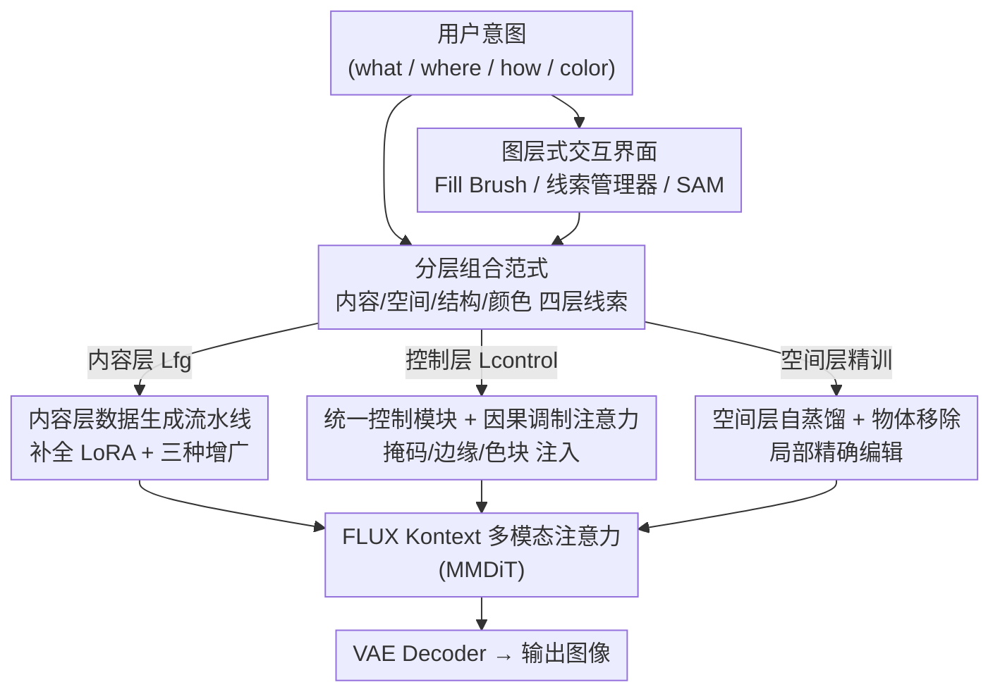

# MagicQuill V2: Precise and Interactive Image Editing with Layered Visual Cues

**会议**: CVPR 2026  
**论文**: [CVF Open Access](https://openaccess.thecvf.com/content/CVPR2026/html/Liu_MagicQuill_V2_Precise_and_Interactive_Image_Editing_with_Layered_Visual_CVPR_2026_paper.html)  
**代码**: 待确认（仅有项目页 demo）  
**领域**: 图像生成 / 交互式图像编辑  
**关键词**: 分层编辑, 扩散 Transformer, 可控生成, FLUX Kontext, 交互式系统

## 一句话总结
MagicQuill V2 把"用一句话提示编辑整张图"的范式拆成**内容层 / 空间层 / 结构层 / 颜色层**四类可独立叠加的视觉线索，在 FLUX Kontext 基础上用一套统一控制模块 + 因果调制注意力把这些线索精确注入扩散过程，配上一套像 Photoshop 一样的图层式交互界面，让用户对"画什么、放哪里、长什么样、什么颜色"做到逐项精确控制。

## 研究背景与动机
**领域现状**：FLUX、Qwen-Image、GPT-4o、Nano Banana（Gemini 2.5 Flash Image）这一代扩散 Transformer 编辑系统极其擅长根据自然语言或参考图做"整体性"编辑，给一句话就能生成相当复杂的结果。ControlNet / T2I-Adapter 以及后来的 OminiControl、EasyControl 等也尝试把 Canny 边、深度、姿态这类空间条件接进来。

**现有痛点**：可问题在于这些系统都依赖**单一、整体的提示**。用户的创作意图其实很少是"铁板一块"的——以论文 Fig. 1 为例，用户先组合出"老爷车 + 人 + 狗"的场景，接着想把狗头转过来面对镜头、把衬衫改成绿色、再塞进一顶礼帽和一只苹果。这些诉求纠缠在一条提示里，模型很难拆开；即便给了参考图，参考图的作用也仍然要靠文字提示来调度，于是又继承了语言的天然不精确性，"到底改哪里、改成什么、怎么个形状"说不清楚。结果是生成模型的语义便利和传统图形软件（Photoshop / GIMP）的空间精确，二者中间隔着一道鸿沟。

**核心矛盾**：**整体性提示**和**细粒度控制**之间存在根本张力。一句话提示天然无法解耦"内容(what) / 位置(where) / 结构(how) / 颜色(color)"这四个本来正交的意图维度，强行塞进一个 prompt 就会互相干扰。

**本文目标**：把"创作意图"显式拆解成四个独立、可控的图层，让用户像在专业绘图软件里堆叠图层那样表达意图，并且这些图层不是静态输入，而是可以独立组合、移动、精修的动态元素。

**切入角度**：作者借鉴专业图形软件成熟而直观的"图层"工作流，把视觉创作的每个基本维度映射到一个专属图层——内容层用前景参考图说"画什么"，空间层用掩码说"画在哪"，结构层用边缘图说"什么形状"，颜色层用色块/笔触说"什么颜色"。

**核心 idea**：用"一摞精确视觉线索"取代"一条模糊文字提示"——把编辑意图解构成内容/空间/结构/颜色四层，再用统一控制模块把它们注入扩散 Transformer，从而在生成模型的语义能力之上叠加图形软件级别的颗粒度控制。

## 方法详解

### 整体框架
MagicQuill V2 构建在图像编辑模型 **FLUX Kontext** 之上，目标是在给定上下文图像 $y$、自然语言指令 $c$ 和一摞分层视觉线索 $L$ 的条件下生成目标图像 $x$，即近似条件分布

$$p(x \mid y, c, \{L_{fg}, L_{control}\}).$$

这里线索被显式分成两组：**内容层** $L_{fg}$（"画什么"）由一个或多个前景碎片 $F_i$ 指定；**控制层** $L_{control}$（"画在哪/什么形状/什么颜色"）则由空间层掩码 $M$、结构层边缘图 $E$、颜色层色块图 $C$ 组成。

整套系统由三块拼成：① 一条**数据生成流水线**专门训练内容层，让模型学会"语境感知地融合前景"而不是简单复制粘贴；② 一个**统一控制模块**把空间/结构/颜色三类控制线索一并处理，靠因果调制注意力精确约束几何与配色；③ 一个**图层式交互界面**把上述图层串成一个像绘图软件一样直观的实时编辑工具。推理时，分层视觉线索被各自编码成 latent，与文字 latent、噪声图 latent 一起送进统一控制模块做多模态注意力，最后经 VAE 解码出结果。

### 关键设计

**1. 分层组合范式：把一条提示拆成四类正交的视觉线索**

这是全文的纲。作者针对"单一整体提示无法解耦内容/位置/结构/颜色"这个痛点，把编辑意图映射成四个专属图层：**内容层**（前景参考图 $F_i$，控制"画什么"）、**空间层**（掩码 $M$，控制"在哪编辑"）、**结构层**（边缘图 $E$，控制"什么形状"）、**颜色层**（色块图 $C$，控制"什么调色板"）。这四层在交互系统里不是一次性静态输入，而是可独立叠放、重定位、精修的动态元素。它和以往可控编辑的根本区别在于：ControlNet 这类方法虽能给空间条件，Paint-by-Example / AnyDoor / Insert-Anything 这类组合方法虽能给掩码和参考图，但最终外观仍由"整体参考图 + 文字"推断；而这里每一层都是一条**直接、显式**的通道，绕开了语言的推断鸿沟，让"想改的那一项"被单独、精确地表达。

**2. 内容层数据生成流水线：用补全 LoRA + 三种增广教模型"语境融合"而非"贴图"**

内容层最大的坑是：从真实图里抠出来的前景常常被遮挡而不完整（比如手挡住了苹果的一部分），如果直接拿这种残缺前景训练，模型只会学成"原样贴回去"的复制粘贴，而不会去理解语境、生成合理的交互与周边内容。作者用一条专门的数据流水线绕开它。首先合成 5000 张描绘"物体—场景交互"的基础图：用 Qwen3-8B 生成带交互动作列表的物体描述与 caption $c$，用 Flux.1 Krea 渲染高清写实源图，再用 Grounding SAM 抠出主物体掩码得到初始前景碎片。针对残缺问题，作者专门训了一个**物体补全 LoRA**（在 FLUX Kontext 上、用 3000 个完整物体学习从随机笔刷掩码中复原物体），把抠出的残缺前景补成完整物体。随后对前景做三种**增广**逼真化：用 ICLight 打随机光照图做**重打光增广**（学光照协调）、随机降采样缩放做**分辨率增广**（适配不同清晰度的用户输入）、随机透视变换做**透视增广**（学几何畸变纠正）。最后组装训练三元组——目标 $x$ 是未改动源图、$c$ 是其描述，输入 $y$ 则是把增广后的前景合成回原位、再对周边背景做随机掩码增广，逼模型学会语境协调。训练时在 FLUX Kontext 的注意力层上加 LoRA，优化 rectified-flow 目标

$$\mathcal{L}_\theta = \mathbb{E}_{t\sim p(t),x,y,c}\big[\,\lVert v_\theta(z_t,t,y,c) - (\epsilon - x)\rVert_2^2\,\big],$$

其中 $\epsilon\sim\mathcal{N}(0,1)$、$z_t=(1-t)x+t\epsilon$。消融显示去掉任一增广都会退化（详见实验），证明这套流水线是"非贴图"能力的来源。

**3. 统一控制模块与因果调制注意力：一套机制注入掩码/边缘/色块并可调强度**

空间/结构/颜色三类控制线索形态各异，作者用一个**极简统一**的控制模块一并处理。为省算力，所有视觉控制线索从原尺寸 $(H,W)$ 缩到固定低分辨率 $(h,w)$，但位置编码仍按 $P_i = i\cdot\frac{H}{h},\ P_j = j\cdot\frac{W}{w}$ 映射回原高分坐标以保持空间对齐。控制线索 latent $Z_c$ 通过一个 LoRA 适配的**条件分支**注入：在 MMDiT 共享投影 $W_Q,W_K,W_V$ 基础上加低秩更新，$Q_c = W_Q Z_c + B_Q A_Q Z_c$（$K,V$ 同理，秩 $r\ll d$），再与文本 $Z_t$、噪声图 $Z_x$、上下文图 $Z_y$ 的 QKV 拼成完整序列做多模态注意力。

真正的巧思在**因果调制注意力（Causal Modulated Attention）**：直接给注意力 logits 加一个偏置矩阵 $B$，

$$\text{Attention}(\mathbf{Q},\mathbf{K},\mathbf{V}) = \text{Softmax}\!\Big(\tfrac{\mathbf{Q}\mathbf{K}^T}{\sqrt{d_k}} + \mathbf{B}\Big)\mathbf{V},$$

其中令 $I_x,I_{c_k}$ 分别为噪声图与第 $k$ 个线索的 token 索引集，则

$$B_{ij} = \begin{cases} \log(\sigma_k) & i\in I_x,\ j\in I_{c_k} \\ -\infty & i\in I_{c_k},\ j\notin I_{c_k} \\ 0 & \text{otherwise} \end{cases}$$

第一项 $\log(\sigma_k)$ 是一个**用户可调的引导强度**：$\sigma_k=1$ 时偏置为 0、退化成标准注意力；$\sigma_k$ 越大正偏置越强、越严格地遵循该线索；$\sigma_k=0$ 时偏置为 $-\infty$、相当于关掉这条线索。第二项把不同控制信号之间的注意力强行设成 $-\infty$，**隔离**各线索互不串扰。这样一个 $\sigma$ 参数就让用户能在"信任自己画的线索"和"信任模型生成先验"之间连续滑动（实验中 $\sigma$ 从 0→2.0 越来越贴合用户笔触）。训练上，结构层与颜色层 $(E,C)$ 以**无上下文图**（$y=\varnothing$）的条件生成方式训练、近似 $p(x|c)$，作者发现这种条件生成里学到的控制能力能稳健泛化到推理时的条件编辑。

**4. 空间层自蒸馏与物体移除：把"局部精确编辑"单独训出来**

空间层（掩码 $M$）的定位和前两者不同——它的目的是把改动**约束在指定区域**做局部编辑，而不是凭线索从噪声重画。这需要 (源图, 目标图, 提示, 掩码) 四元组，作者用**自蒸馏**造数据：先用 VLM（Qwen2.5-VL-72B）为源图生成若干合理的局部编辑提示，再用基础 FLUX Kontext 执行这些编辑；掩码 $M$ 则由源图与编辑图的逐像素差经阈值化、取改动区域凸包得到，并过滤掉掩码过大（全局编辑）或过小（无显著变化）的样本。为强化常见的**物体移除**能力，作者额外按 SmartEraser 的思路构造数据——随机抠出前景物体再贴回同图任意位置，训练模型把多出来的内容无缝抹掉。正因为空间层是显式针对"带掩码的局部编辑/移除"精调，它在局部修改和物体擦除上都明显强过通用 inpainting 模型。

### 一个完整示例
以论文 Fig. 1 的连续工作流为例，用户可以在一条工作流里逐层叠加意图：(A) 先在内容层拖入"老爷车""女士""狗"三个前景碎片组出底图；(B) 想让狗换姿势，就在空间层画掩码 + 指令"turn the dog's head to face the camera"做局部重构；(C) 在结构层用笔刷勾出一个铃铛项圈（边缘图 $E$）、在颜色层把衬衫涂成绿色（色块图 $C$）；(D) 最后再无缝塞进一顶礼帽和一只苹果。每一步只动对应那一层、互不干扰，且每个线索都可随时调 $\sigma$ 强度或用 SAM 重新分割精修。

## 实验关键数据

### 主实验

**内容层组合**（自建 200 样本测试集，100 交互 + 100 摆放，Table 1）：

| 模型 | L1 ↓ | L2 ↓ | CLIP-I ↑ | DINO ↑ | CLIP-T ↑ | LPIPS ↓ |
|------|------|------|----------|--------|----------|---------|
| Insert Anything | 0.105 | 0.039 | 0.910 | 0.825 | 0.327 | 0.354 |
| Nano Banana | 0.105 | 0.038 | 0.934 | 0.891 | 0.335 | 0.321 |
| Qwen-Image | 0.114 | 0.042 | 0.929 | 0.881 | 0.334 | 0.357 |
| FLUX Kontext | 0.117 | 0.045 | 0.930 | 0.872 | 0.337 | 0.359 |
| Put it Here | 0.136 | 0.054 | 0.925 | 0.854 | 0.335 | 0.438 |
| **Ours** | **0.061** | **0.019** | **0.962** | **0.930** | 0.335 | **0.202** |

本文几乎在所有指标上大幅领先：L1 从次优 0.105 降到 0.061、LPIPS 从 0.321 降到 0.202，DINO 从 0.891 升到 0.930，只有 CLIP-T 与 FLUX Kontext 的 0.337 基本持平（0.335）。

**结构层 + 颜色层控制**（Pico-Banana-400K 抽 1000 例，从目标图直接抽边缘/色块作线索，Table 2）：

| 模型 | L1 ↓ | L2 ↓ | CLIP-I ↑ | DINO ↑ | LPIPS ↓ |
|------|------|------|----------|--------|---------|
| Qwen-Image | 0.132 | 0.043 | 0.923 | 0.871 | 0.395 |
| Qwen-Image (Edge) | 0.131 | 0.042 | 0.924 | 0.875 | 0.387 |
| FLUX Kontext | 0.152 | 0.054 | 0.908 | 0.853 | 0.434 |
| Ours (Edge) | 0.107 | 0.030 | 0.938 | 0.909 | 0.317 |
| Ours (Color) | 0.080 | 0.020 | 0.943 | 0.915 | 0.327 |
| **Ours (Edge+Color)** | **0.080** | **0.018** | **0.949** | **0.930** | **0.283** |

边缘层单用能修好几何但跑偏颜色，颜色层单用能对齐颜色但丢结构细节，二者组合后逐项最优（L1 0.080、LPIPS 0.283），印证两类线索互补且都不可少。

**物体移除**（RORD 基准 5000 样本，Table 3）：

| 模型 | L1 ↓ | L2 ↓ | LPIPS ↓ | SSIM ↑ | PSNR ↑ | FID ↓ |
|------|------|------|---------|--------|--------|-------|
| SmartEraser | 0.069 | 0.098 | 0.196 | 0.630 | 21.14 | 17.03 |
| OmniEraser (Base) | 0.058 | 0.084 | 0.243 | 0.660 | 22.16 | 19.76 |
| OmniEraser (CN) | 0.048 | 0.084 | 0.182 | 0.817 | 22.96 | 25.92 |
| **Ours** | **0.042** | **0.071** | **0.154** | **0.840** | **24.45** | **16.42** |

本文在 L1/L2/LPIPS/SSIM/PSNR/FID 上全面领先（PSNR 24.45 vs 次优 22.96，FID 16.42 最低）。

### 消融实验

数据构造流水线消融（Fig. 7，定性为主，逐项去掉一种增广重训）：

| 配置 | 现象 | 结论 |
|------|------|------|
| Full（完整流水线） | 几何/光照/分辨率/交互均正确 | 各增广协同有效 |
| w/o 透视增广 | 柜子保留原始倾斜，物理不合理 | 负责几何纠正 |
| w/o 重打光增广 | 主体光照扁平、像"贴上去"的 | 负责光照协调 |
| w/o 分辨率增广 | 低清/低质线索下出模糊或噪点 | 负责输入鲁棒性 |
| w/o 补全 LoRA | 在残缺前景上训练，退化成复制粘贴、不与场景交互 | 负责"语境融合非贴图" |

### 关键发现
- **补全 LoRA 是"非贴图"的关键**：不补全残缺前景，模型就只会原样贴回去、不与场景交互——这正是本文区别于一般组合方法的核心。
- **边缘 vs 颜色互补**：边缘层管几何、颜色层管配色，单用各有短板，组合才达到逐项最优，说明把意图拆层是有实证收益的而非概念噱头。
- **$\sigma$ 提供连续可调强度**：$\sigma=0$ 退化成基础 FLUX Kontext、$\sigma=1.0$ 平衡且忠实、更高值更严格但会放大线索本身的瑕疵进而产生伪影——给了用户一个"信任线索 vs 信任先验"的旋钮。
- **空间层独立精调收益明显**：通用 inpainting（FLUX Fill、MagicQuill V1）会忽略掩码内原有内容、做不了"内容感知的局部编辑"，而专训的空间层能在保持身份的同时做局部调色/风格迁移，并在物体移除上刷新 SOTA。

## 亮点与洞察
- **把"图层"这个被验证了几十年的专业绘图交互范式正式引入生成式编辑**：不是发明新指令语言，而是把内容/空间/结构/颜色映射成可堆叠图层，直觉上极顺手——这是最让人"啊哈"的产品级洞察。
- **因果调制注意力一石二鸟**：同一个偏置矩阵既用 $\log(\sigma_k)$ 给每条线索一个连续强度旋钮，又用 $-\infty$ 隔离不同线索互不干扰，机制极简却同时解决了"强度可调"和"多线索不串扰"两个问题，这个 trick 可迁移到任何需要多条件可调注入的扩散控制场景。
- **用"训练物体补全 LoRA"绕开残缺前景这个数据脏点**：很多组合方法之所以学成贴图，根因就在训练前景不完整；作者直击根因而非堆数据，思路干净。
- **结构/颜色层用无上下文图的条件生成训练却能泛化到条件编辑**：这条经验（生成时学到的控制能力迁移到编辑）对低成本造可控编辑数据很有参考价值。

## 局限与展望
- **强依赖 FLUX Kontext 底座**：全系统建立在 FLUX Kontext 上，控制能力和上限受底座约束，换底座是否仍成立未验证。
- **高 $\sigma$ 放大线索瑕疵**：作者自承当 $\sigma$ 调大以追求更严格遵循时，会把用户线索里本身的不完美一并放大，导致伪影——精确与鲁棒之间仍有 trade-off。
- **内容层数据流水线偏重合成数据**：基础图由 Flux.1 Krea 合成、提示由 Qwen3-8B 生成、补全靠自训 LoRA，整条链路是"模型造数据训模型"，真实世界复杂遮挡/光照分布是否完全覆盖存疑（⚠️ 以原文为准，论文未报告真实数据上的额外评测）。
- **未给量化的交互效率/用户研究**：图层式界面的"直观、精确"主要靠定性界面图与案例支撑，缺少用户实验量化对比传统提示式工作流的效率收益。

## 相关工作与启发
- **vs ControlNet / T2I-Adapter**：它们给 UNet 接入 Canny/深度/姿态等空间条件，是细粒度控制的早期里程碑；本文把控制扩展到 DiT 架构并统一成可叠加、可调强度、互不干扰的多图层，颗粒度和可组合性更高。
- **vs OminiControl / EasyControl**：OminiControl 把文本/噪声/条件 token 拼成单序列联合处理，EasyControl 用隔离分支增强即插即用；本文同样用统一序列 + LoRA 条件分支，但额外引入因果调制注意力做强度调节与线索隔离，并把控制语义化成"内容/空间/结构/颜色"四层。
- **vs Paint-by-Example / AnyDoor / Insert-Anything 等组合方法**：它们允许指定布局/掩码控制"物体放哪"，但最终外观仍从整体参考图推断、细粒度受限；本文让用户提供"前景碎片"作直接线索，是一条更精确的引导通道。
- **vs MagicQuill V1**：V1 提出"Idea Collector"交互雏形与笔刷工具；V2 在其上扩出 Fill Brush（空间层）、视觉线索管理器（内容层拖拽）与 SAM 分割面板，把交互正式形式化成图层式编辑框架。

## 评分
- 新颖性: ⭐⭐⭐⭐⭐ 把专业绘图的图层范式系统性引入生成式编辑，并配套因果调制注意力，范式级创新。
- 实验充分度: ⭐⭐⭐⭐ 内容/控制/移除三类任务各有定量表 + 数据流水线消融，但缺用户研究与真实数据评测。
- 写作质量: ⭐⭐⭐⭐⭐ 动机—框架—四层设计—实验逻辑清晰，公式与图示完整。
- 价值: ⭐⭐⭐⭐⭐ 直接面向创作者的精确可控编辑，产品落地价值高且 trick 可迁移。

<!-- RELATED:START -->

## 相关论文

- [\[CVPR 2026\] Cinematic Audio Source Separation Using Visual Cues](cinematic_audio_source_separation_using_visual_cues.md)
- [\[CVPR 2025\] MagicQuill: An Intelligent Interactive Image Editing System](../../CVPR2025/image_generation/magicquill_an_intelligent_interactive_image_editing_system.md)
- [\[CVPR 2026\] OneHOI: Unifying Human-Object Interaction Generation and Editing](onehoi_unifying_human-object_interaction_generation_and_editing.md)
- [\[CVPR 2026\] MRT: Masked Region Transformer for Layered Image Generation and Editing at Scale](mrt_masked_region_transformer_for_layered_image_generation_and_editing_at_scale.md)
- [\[CVPR 2026\] Inter-Edit: First Benchmark for Interactive Instruction-Based Image Editing](inter-edit_first_benchmark_for_interactive_instruction-based_image_editing.md)

<!-- RELATED:END -->
