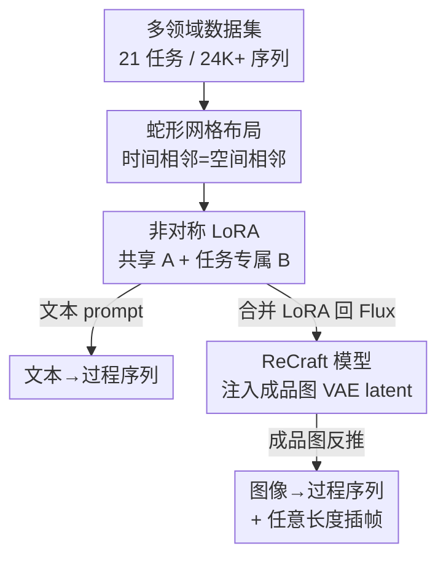

# MakeAnything: Harnessing Diffusion Transformers for Multi-Domain Procedural Sequence Generation

**会议**: CVPR 2026  
**论文**: [CVF Open Access](https://openaccess.thecvf.com/content/CVPR2026/html/Song_MakeAnything_Harnessing_Diffusion_Transformers_for_Multi-Domain_Procedural_Sequence_Generation_CVPR_2026_paper.html)  
**代码**: https://github.com/showlab/MakeAnything  
**领域**: 扩散模型 / 图像生成  
**关键词**: 程序序列生成, Diffusion Transformer, 非对称 LoRA, 图像条件生成, 多任务

## 一句话总结
MakeAnything 用 Flux（DiT）的 in-context 能力，通过把"绘画/手工/烹饪"等创作过程的多帧排成网格、再用非对称 LoRA 微调，第一次实现了跨 21 个领域的"分步教程"生成，既支持文本→过程，也支持上传成品图反推制作步骤（ReCraft）。

## 研究背景与动机
**领域现状**：让机器生成"怎么一步步画出这幅画 / 做出这个手工"的过程序列，一直是个被向往但难落地的方向。早期靠 stroke-based rendering（SBR）+ 强化学习逐笔逼近目标图；近期 ProcessPainter、PaintsUndo、Inverse Painting 等用时序扩散模型在合成数据上学画家的作画分布。

**现有痛点**：这些方法几乎都被锁死在"绘画"单一任务上，跨域泛化极差。ProcessPainter 基于 AnimateDiff，只能做幅度很小的运动变化，根本无法表达"乐高从零件到成品""菜从食材到成菜"这种**带结构性突变**的过程；而通用 DiT 视频模型虽然能出长序列，但训练数据分布和复杂程序工作流差太远，效果被分布偏移拖垮。

**核心矛盾**：复刻人类创造力需要两样东西同时到位——**高质量多任务过程数据** + **能在数据极稀缺下仍学得动的方法**。但程序数据天生稀缺且不均衡（有些类别只有 50 条样本），单 LoRA 全量训练学不动多样知识、单任务训练又会在小数据上严重过拟合。

**本文目标**：(1) 造一个覆盖多领域、规模够大的程序序列数据集；(2) 设计一个能跨域、能在低数据下工作、还能反向重建过程的统一框架。

**切入角度**：作者发现 DiT 的注意力天然偏好**空间相邻** token（来自预训练时邻近像素强相关）。如果把一段时序帧排成网格、让时间相邻 = 空间相邻，就能直接借 DiT 的 in-context 注意力把"帧间一致 + 逻辑连贯"学出来，而不必另造时序模块。

**核心 idea**：把"过程生成"转化为"网格内 in-context 图像生成"——用蛇形网格布局喂给 Flux，用非对称 LoRA 平衡通用知识与单任务适配，再用一个轻量图像条件插件 ReCraft 做反向重建与任意长度插帧。

## 方法详解

### 整体框架
MakeAnything 建立在预训练 Flux 1.0 之上，训练分两个阶段串行进行。**第一阶段**：把每条创作序列（9 帧或 4 帧）按蛇形布局排成 3×3 / 2×2 网格当成一张大图，用非对称 LoRA 在 24K+ 多任务数据上微调，激活 DiT 的 in-context 能力，得到"文本→过程序列"的生成器。**第二阶段**：把第一阶段学到的 LoRA 权重合并回 Flux 基座，形成 ReCraft 的底座，再通过把"干净的成品图 VAE latent"拼进多模态注意力、做轻量 LoRA 微调，得到"图像→过程序列"的反向重建器，并顺带学会任意两帧之间的插帧能力。

### 关键设计

**1. 蛇形网格布局：把时序一致性问题转译成 DiT 的空间邻接偏好**

直接把 9 帧顺序排成 3×3 网格会有个隐患：第 3 帧（第一行末）和第 4 帧（第二行首）时间上相邻，但在网格里上下不挨着、左右更不挨着，DiT 的注意力抓不到它们的强关联，帧间过渡就容易断。作者的蛇形（serpentine）布局让序列像贪吃蛇一样走位——第一行从左到右、第二行从右到左、第三行再从左到右，从而保证**任意时间相邻的两帧在网格里要么水平相邻、要么垂直相邻**。这样做的本质是：DiT 预训练时学到"邻近像素强相关"，把时序连续性"伪装"成空间连续性后，模型用现成的注意力先验就能维持帧间视觉一致与逻辑递进，无需引入额外时序模块。9 帧排 3×3、4 帧排 2×2。

**2. 非对称 LoRA：共享一个 A 矩阵学通用程序知识，每任务一个 B 矩阵防过拟合**

程序数据极度稀缺且不均衡（50～10000 条不等）。单 LoRA 在混合数据上训练学不动这么多样的知识，单任务 LoRA 又会在小数据上严重过拟合。受 HydraLoRA 启发，作者首次把非对称 LoRA 引入图像生成：**所有任务共享同一个下投影矩阵 $A$**（捕获跨任务通用的程序知识），**每个任务各自一个上投影矩阵 $B_i$**（适配该任务的专属特性）。权重更新写作

$$W = W_0 + \Delta W = W_0 + \sum_{i=1}^{N} \omega_i \cdot B_i A,$$

其中 $B_i \in \mathbb{R}^{d\times r}$、共享 $A \in \mathbb{R}^{r\times k}$、$\omega_i$ 是第 $i$ 个模块的权重。共享 $A$ 从大规模程序数据里学到"分步创作"的广义规律，缓解了小样本类别的过拟合；专属 $B_i$ 又保住了单任务的细节表现，从而在"泛化 vs 专精"之间取得平衡。推理时把领域专属 $B$ 和领域无关 $A$ 组合使用；更妙的是它还能和 Civitai 上**不含程序数据**的风格化 LoRA 叠加，把方法迁移到未见域（水彩、浮雕、冰雕、纸艺等）。

**3. ReCraft 模型：把成品图 VAE latent 注入多模态注意力，低数据下反推创作过程**

实际场景里用户常想"上传一张成品，看看它是怎么一步步做出来的"。从头训一个 ControlNet / IP-Adapter 这种大控制模块在每任务只有几十条数据时根本不现实。ReCraft 的做法是复用合并后的 Flux 底座、只加极小的条件模块：把成品图（序列最后一帧）经 VAE 编码成**干净（不加噪）的图像条件 token** $c_I$，和加噪的过程 token $z$、文本 token $c_T$ 一起拼进多模态注意力

$$\text{MMA}([z; c_I; c_T]) = \text{softmax}\!\left(\frac{QK^\top}{\sqrt{d}}\right)V,$$

训练时只对前面各步加噪/去噪，最后一帧的 $c_I$ 全程保持干净，于是它能"锚定"整条去噪轨迹。推理时给一张成品图，模型自回归地反推出前 8 步，得到逻辑连贯的逆向制作过程。整个过程仍用条件流匹配损失（见下）优化，只对 Flux 做最小改动就拿到强可控性。

**4. 任意长度插帧：用 2×2 对角帧训练，递归细分生成任意细粒度过程**

固定 8 步有时不够细。作者让 ReCraft 顺带学一个插帧能力：训练时用连续 4 帧构成 2×2 网格 $\{x_1,x_2,x_3,x_4\}$，取**对角的 $x_1$、$x_4$ 当输入**、预测中间缺失的 $x_2,x_3 = F(x_1,x_4)$，从而学会"给定两端关键帧、补出中间合理过渡"。推理时对任意相邻帧对 $(x_n, x_{n+1})$ 反复套用这个插帧模块，通过递归细分就能把序列任意加密——既能给反推出的序列加细节，也能给文本生成的过程延长，同时保持风格与时序一致。

### 损失函数 / 训练策略
两个阶段都用 SD3 的条件流匹配损失。第一阶段（非对称 LoRA）只对文本条件：

$$\mathcal{L}_{CFM} = \mathbb{E}_{t,\,p_t(z|\epsilon),\,p(\epsilon)}\big[\,\|v_\Theta(z, t, c_T) - u_t(z|\epsilon)\|^2\,\big],$$

其中 $v_\Theta$ 是网络参数化的速度场、$u_t(z|\epsilon)$ 是把噪声到真实分布之间概率路径连起来的条件向量场。ReCraft 阶段把图像条件 $c_I$ 也加进去，目标变为 $\|v_\Theta(z,t,c_I,c_T)-u_t(z|\epsilon)\|^2$。训练细节：基座 Flux 1.0 dev；用 CAME 替换 Adam（明显提升生成质量）；分辨率 1024、LoRA rank 64、学习率 1e-4、batch size 2；非对称 LoRA 训 40K 步，ReCraft 的重建与插帧各训 15K 步。数据用 GPT-4o 自动给每帧打标注/描述。

## 实验关键数据

### 主实验
评测程序序列没有现成的好指标（连贯性、逻辑性、实用性都难量化），作者用 GPT-4o + 人工的混合评分，从三个维度打分——**Alignment**（文图对齐）、**Coherence**（帧间逻辑连贯）、**Usability**（教程实用性），并额外报 CLIP Score 量化文图对齐。下表节选 21 个任务中几个代表（G=GPT 分，H=人工，C=CLIP）：

| 任务 | Alignment (G\|H\|C) | Coherence (G\|H) | Usability (G\|H) |
|------|------|------|------|
| Oil Painting | 4.90\|4.30\|37.30 | 4.95\|4.17 | 4.85\|4.20 |
| Chinese Painting | 4.80\|4.37\|33.46 | 4.90\|4.22 | 4.70\|4.33 |
| LEGO | 4.60\|4.32\|34.40 | 4.90\|4.15 | 4.75\|4.00 |
| Transformer | 4.75\|4.30\|33.03 | 4.90\|4.23 | 4.75\|4.15 |
| Cook | 3.20\|4.21\|34.41 | 4.25\|4.03 | 3.65\|3.90 |
| Illustration | 3.12\|4.17\|31.68 | 3.40\|4.07 | 2.45\|4.07 |

文本→序列对比 ProcessPainter / Flux / 商用 API Ideogram，图像→序列对比 Inverse Painting / PaintsUndo。在 50 组序列上的人工盲评（41 份有效问卷，方法名随机打乱、全盲）显示 MakeAnything 在 Alignment / Coherence / Usability / Consistency 四项偏好度全部第一（Fig. 7）。

### 消融实验
在全部 21 个任务上做非对称 LoRA 的消融（G=GPT，C=CLIP）：

| 配置 | Alignment (G\|C) | Coherence | Usability | 说明 |
|------|------|------|------|------|
| Full Asymmetric LoRA | 4.35\|32.70 | 3.97 | 4.09 | 完整设计：共享 A + 任务专属 B |
| w/o Asymmetric LoRA | 3.68\|29.42 | 3.83 | 3.76 | 退化为单任务标准 LoRA，无共享参数 |
| Mixed-data Training | 3.72\|30.94 | 3.50 | 3.50 | 标准 LoRA 在混合多任务数据上训练 |

### 关键发现
- **非对称 LoRA 是核心增益来源**：完整设计在 Alignment 上 4.35，去掉非对称结构（单任务标准 LoRA）掉到 3.68、混合数据训练 3.72；CLIP 也从 32.70 掉到 29.42 / 30.94。
- **定性可见过拟合 vs 欠拟合的两难**：在仅 50 条肖像、300 条素描的小数据上，基座 Flux 能写对文本却出不了有意义的分步视觉；标准 LoRA 步骤过渡看着合理但文图对齐急剧崩坏（过拟合）；非对称 LoRA 同时拿到"过程合理 + 强对齐"，作者归因于共享 A 从大规模数据吸收的广义程序知识有效缓解了低数据过拟合。
- **未见域泛化**：把程序 LoRA 叠加 Civitai 上的水彩 / 浮雕 / 冰雕 / 纸艺风格 LoRA，即便没在这些过程上训练过，也能生成像样的创作序列。

## 亮点与洞察
- **把时序问题"伪装"成空间问题**：蛇形网格布局直接复用 DiT 的空间邻接注意力先验来维持帧间一致，省掉了专门的时序模块——一个很轻但很对路的转译。
- **非对称 LoRA 的"共享 A + 专属 B"是低数据多任务的优雅解法**：共享矩阵当"通用程序知识库"、专属矩阵保单任务细节，这个分解思路可迁移到任何"任务多、每任务数据少、又彼此共享底层规律"的生成场景。
- **ReCraft 用"干净条件 token 锚定去噪轨迹"做控制**：把成品图当不加噪的 anchor 注入 MMA，比从头训 ControlNet 省数据得多，是低资源可控生成的实用范式。
- **插帧用对角帧自监督**：2×2 取对角预测中间，零额外标注就学会递归细分，把"固定步数"升级成"任意细粒度"。

## 局限与展望
- **评测高度依赖 GPT-4o + 人工主观打分**：程序序列缺客观指标，CLIP 只能测文图对齐，连贯性/实用性的分数天然带主观噪声，跨任务比大小要谨慎（Cook、Illustration 的 GPT 分明显偏低）。
- **数据极不均衡仍是隐患**：类别样本从 50 到 10000 跨两个数量级，小类别即使有共享 A 兜底，质量上限仍受限。
- **固定帧数布局**：训练以 9 帧 / 4 帧网格为主，更长或更不规则的过程要靠 ReCraft 递归插帧拼，误差可能逐步累积。
- **反推过程的"真实性"难验证**：ReCraft 给的是"看起来合理"的逆向步骤，未必是物体真实的制作流程，用于教学/逆向工程时需注意。

## 相关工作与启发
- **vs ProcessPainter / PaintsUndo**：它们用 AnimateDiff/时序扩散在单一绘画域学画家分布，只能做小幅运动变化、跨域差；本文用 DiT in-context + 网格布局 + 非对称 LoRA，覆盖 21 个含结构性突变的领域（乐高、烹饪、雕刻等），并支持文本和图像两种条件。
- **vs Inverse Painting**：它靠预测作画顺序 + 图像分割模拟绘画过程，仅限绘画；ReCraft 用图像条件 token 注入做反推，可跨域且数据需求低。
- **vs OminiControl / IP-Adapter / ControlNet**：这些是通用可控生成方案，但要么依赖空间对齐、要么需从头训控制模块；ReCraft 只在 Flux 上加最小条件模块、复用合并后的程序 LoRA，专为低数据程序重建设计。
- **vs HydraLoRA**：本文把其非对称 LoRA（共享 A + 多 B）的思想首次搬到图像生成，用来解决多任务程序数据稀缺/不均衡问题。

## 评分
- 新颖性: ⭐⭐⭐⭐⭐ 蛇形网格 + 非对称 LoRA + ReCraft 三个组件都针对"程序序列生成"这一欠探索问题量身设计
- 实验充分度: ⭐⭐⭐⭐ 覆盖 21 任务 + 多 baseline + 盲评 + 消融，但客观指标少、主观评分占比高
- 写作质量: ⭐⭐⭐⭐ 动机清晰、方法递进，部分表格/图注信息密集
- 价值: ⭐⭐⭐⭐⭐ 开源 24K+ 多域程序数据集 + 统一框架，为"分步创作生成"这一方向立了基准

<!-- RELATED:START -->

## 相关论文

- [\[CVPR 2026\] ProcessMaker: A Generalized Process Visualization Framework with Adaptive Sequence Steps on Diffusion Transformers](processmaker_a_generalized_process_visualization_framework_with_adaptive_sequenc.md)
- [\[CVPR 2026\] PixelDiT: Pixel Diffusion Transformers for Image Generation](pixeldit_pixel_diffusion_transformers_for_image_generation.md)
- [\[CVPR 2026\] Circuit Mechanisms for Spatial Relation Generation in Diffusion Transformers](circuit_mechanisms_for_spatial_relation_generation_in_diffusion_models.md)
- [\[CVPR 2026\] MERIT: Multi-domain Efficient RAW Image Translation](merit_multi-domain_efficient_raw_image_translation.md)
- [\[CVPR 2026\] Region-Adaptive Sampling for Diffusion Transformers](region-adaptive_sampling_for_diffusion_transformers.md)

<!-- RELATED:END -->
