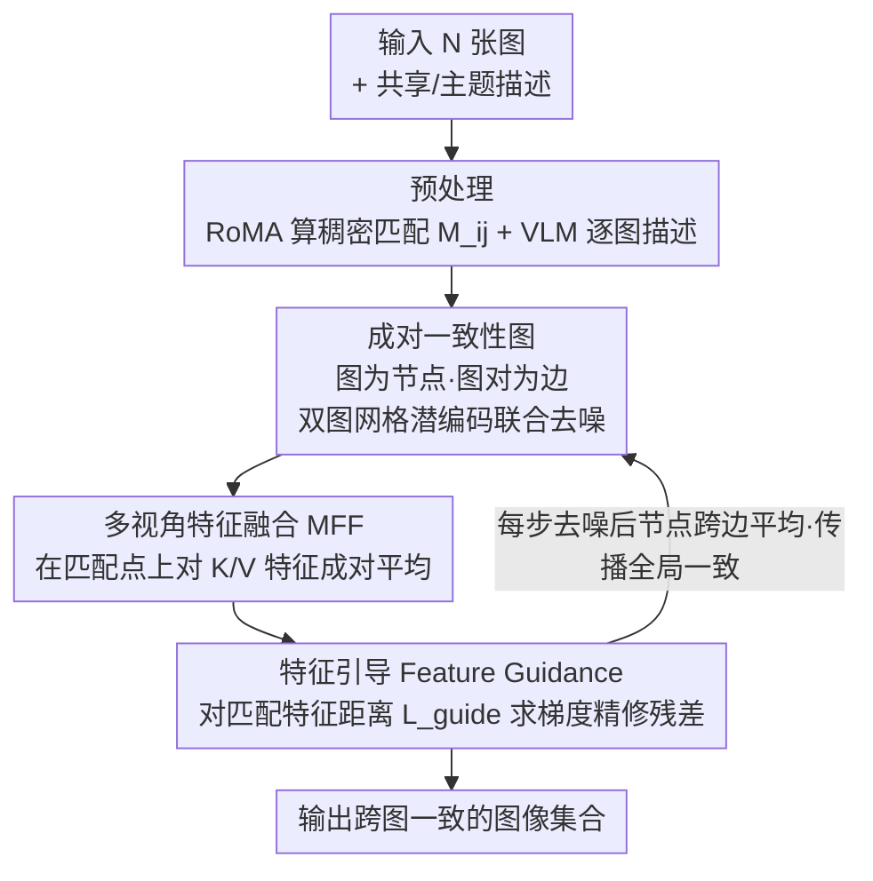

# Match-and-Fuse: Consistent Generation from Unstructured Image Sets

**会议**: CVPR 2026  
**arXiv**: [2511.22287](https://arxiv.org/abs/2511.22287)  
**领域**: 图像生成 / 一致性生成  
**关键词**: 集合到集合生成, 跨图一致性, 扩散模型, 特征融合, 对应关系, 训练无关, 零样本

## 一句话总结
提出 Match-and-Fuse，首个面向非结构化图像集合的训练无关一致性生成方法。以图为节点、图对为边建立成对一致性图，通过多视角特征融合（MFF）和特征引导在扩散推理中操控内部特征，实现集合级跨图一致性，DINO-MatchSim 达 0.80 远超所有基线。

## 研究背景与动机

**领域现状**：日常视觉体验以图像集合（相册、产品目录、房产列表）为单位，但生成 AI 主要关注单图或视频，集合级一致性生成几乎未探索。

**核心挑战**：(a) 图像集合不像视频有时序连续性，缺乏运动线索；(b) 共享内容可能有大幅度形变；(c) 需在保持共享元素一致的同时允许非共享区域自由变化。

**现有方案不足**：Edicho 仅限成对编辑从单一参考传播；IC-LoRA 需微调 LoRA；FLUX Kontext 缺显式一致性机制；3D/视频编辑假设过强。

**关键发现**：T2I 扩散模型有**网格先验**——多图拼在画布上联合生成时自发产生一致性，但不完整且随图像数增加快速退化。

**核心idea**：建模图像集合为完全图，利用成对网格先验 + 稠密 2D 对应关系做特征层面的多视角融合和引导。

## 方法详解

### 整体框架

Match-and-Fuse 要解决的是「一组非结构化图像（相册、产品目录）联合生成时如何保持共享内容一致」，且不做任何训练。它把图像集合建模成一张完全图：每张图是节点、每对图是边。输入 N 张图加共享内容描述 $\mathcal{P}^{shared}$ 和主题描述 $\mathcal{P}^{theme}$，预处理阶段用 RoMA 算出所有图对的稠密 2D 匹配 $M_{ij}$（靠置信度过滤自动识别共享区域、无需手工 mask）、VLM 生成逐图描述。推理时在这张成对一致性图上联合去噪，靠特征层面的融合与引导让匹配位置的内容彼此对齐。

### 关键设计

**1. 成对一致性图：用网格先验做局部成对操作 + 全局信息传播**

集合一致性的难点在于既要每对图自洽、又要全局协调，朴素地把所有图塞一起算成本爆炸。作者发现 T2I 扩散模型有「网格先验」——把两张图拼在一块画布上联合生成会自发产生一致性。于是图 $G=(V,E)$ 的每条边对应一份双图网格潜编码 $z_{ij}^t = \text{concat}(z_i^t, z_j^t)$，配上拼接的深度图和网格 prompt 联合去噪；每步去噪后，每个节点再从它所有相邻边里提取并平均「自己那一半」的潜编码，把成对一致性逐步传播成全局一致。为控成本，节点度数限制为 4（随机选邻居），N≤5 时全连接、之后退化为线性复杂度。

**2. 多视角特征融合（MFF）：在匹配点上直接对齐特征**

光靠网格先验产生的一致性不完整、还随图数增加快速退化。MFF 的依据是一个观察：匹配位置处的特征余弦相似度与视觉一致性强相关。所以它直接在 DiT 选定层的 K、V 特征图上做融合——对每个匹配坐标成对平均 $\mathbf{f}_i[\mathbf{c}] \leftarrow \frac{1}{2}(\mathbf{f}_i[\mathbf{c}] + \mathbf{f}_j[M_{ij}(\mathbf{c})])$；推广到 N 图时先跨相邻边平均 $\bar{\mathbf{f}}_i = \frac{1}{|\delta(i)|}\sum_{e \in \delta(i)} \mathbf{f}_i^e$、再跨所有图融合。等于把「该一致的地方」的特征强行拉到一起，且只动匹配点、不碰非共享区域。

**3. 特征引导（Feature Guidance）：用梯度补 MFF 没覆盖的残余不一致**

MFF 是一步到位的平均，对稀疏匹配区域力度不够。Guidance 额外定义一个匹配特征距离目标 $L_{guide} = \frac{1}{|E|}\sum_{\{i,j\}\in E}\frac{1}{|M_{ij}|}\sum_{\mathbf{c}\in M_{ij}}\|\mathbf{f}_i[\mathbf{c}] - \mathbf{f}_j[M_{ij}(\mathbf{c})]\|_2$，对 $z_i^{t-1}$ 求梯度在潜空间做轻量精修。可以把 MFF 看成这个目标的解析解、Guidance 负责修残差；而且梯度经整个模型回传、感受野更宽，对稀疏匹配也鲁棒。

## 实验关键数据

### 主实验：一致性与 Prompt 遵循度

| 方法 | CLIP Score↑ | DreamSim↑ | DINO-MatchSim↑ |
|------|------------|-----------|----------------|
| FLUX Kontext | 0.65 | 0.78 | 0.57 |
| IC-LoRA | 0.65 | 0.71 | 0.65 |
| FLUX | 0.67 | 0.76 | 0.66 |
| Edicho | 0.65 | 0.81 | 0.72 |
| **Match-and-Fuse** | **0.66** | **0.85** | **0.80** |
| w/o Guidance | 0.66 | 0.82 | 0.76 |
| w/o MFF | 0.66 | 0.83 | 0.78 |
| w/o Pairwise Graph | 0.66 | 0.82 | 0.75 |

### 用户研究 & VLM 评估（2AFC，Ours 胜出比例）

| 对比基线 | 用户偏好↑ | VLM偏好↑ |
|---------|----------|---------|
| vs Kontext | 88% | 82% |
| vs IC-LoRA | 90% | 92% |
| vs FLUX | 92% | 94% |
| vs Edicho | 83% | 78% |

### 指标与人类判断对齐度

| 指标 | 与人类一致率↑ |
|------|-------------|
| DreamSim | 84.3% |
| VLM | 84.9% |
| **DINO-MatchSim** | **91.4%** |

### 关键发现
- DINO-MatchSim 0.80 大幅超越最优基线 Edicho 的 0.72（+11.1%）
- 三个组件（Graph、MFF、Guidance）均不可或缺
- 9 张图时 Match-and-Fuse 的一致性仍优于基线在 2 张图时
- 匹配稀疏到仅 10% 时 DINO-MatchSim 仍 0.76+，鲁棒性强
- DINO-MatchSim 与人类判断对齐度 91.4%，远超 DreamSim 的 84.3%

## 亮点与洞察
- **首个集合到集合生成方法**：将生成 AI 拓展到图像集合这一基本视觉单元
- **图建模思路优雅**：成对一致性图允许局部成对操作 + 全局信息传播，O(N²) 可稀疏化到 O(N)
- **发现并利用网格先验**：T2I 模型在网格布局下自发产生的一致性是关键 insight
- **DINO-MatchSim 指标**：用源图匹配点定位输出图对应位置做 patch 级相似度，比全局指标更准
- 完全训练无关、零样本、无需 mask

## 局限性
- 依赖稠密对应关系质量，大面积无匹配区域可能不一致
- 依赖基础模型对深度条件图的遵循度
- FlowEdit 集成需逐编辑微调超参数
- O(N²) 边数在大集合下仍有开销（虽已稀疏化）

## 评分
- 新颖性: ⭐⭐⭐⭐⭐ 首定义并解决集合到集合一致性生成问题
- 实验充分度: ⭐⭐⭐⭐⭐ 定量+用户研究+VLM评估+新指标+消融+扩展应用
- 写作质量: ⭐⭐⭐⭐⭐ 图精美公式优雅问题定义清晰
- 实用价值: ⭐⭐⭐⭐ 产品广告/角色设计/故事板等创意工作流

<!-- RELATED:START -->

## 相关论文

- [\[CVPR 2026\] Cycle-Consistent Tuning for Layered Image Decomposition](cycle-consistent_tuning_for_layered_image_decomposition.md)
- [\[ICCV 2025\] MatchDiffusion: Training-free Generation of Match-Cuts](../../ICCV2025/image_generation/matchdiffusion_training-free_generation_of_match-cuts.md)
- [\[CVPR 2026\] PaCo-RL: Advancing Reinforcement Learning for Consistent Image Generation with Pairwise Reward Modeling](paco-rl_advancing_reinforcement_learning_for_consistent_image_generation_with_pa.md)
- [\[ICLR 2026\] Consistent Text-to-Image Generation via Scene De-Contextualization](../../ICLR2026/image_generation/consistent_text-to-image_generation_via_scene_de-contextualization.md)
- [\[CVPR 2026\] High-Fidelity Virtual Try-On beyond Paired Data Scarcity via Diffusion-based Cycle-Consistent Learning](high-fidelity_virtual_try-on_beyond_paired_data_scarcity_via_diffusion-based_cyc.md)

<!-- RELATED:END -->
