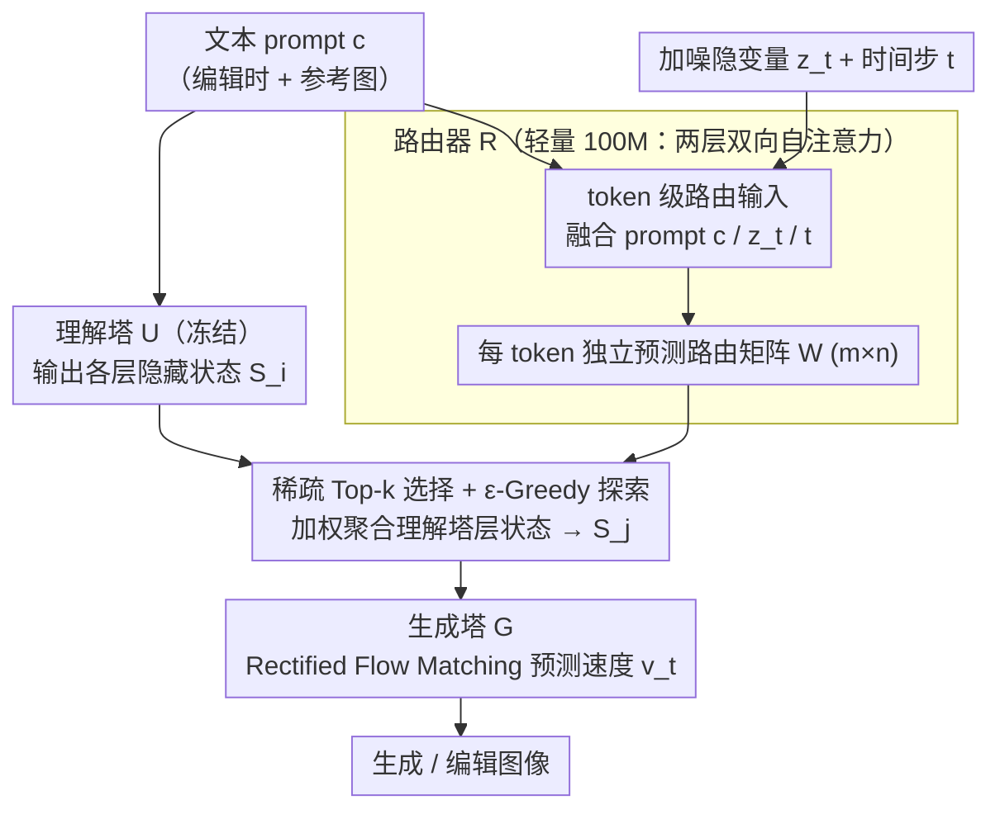

# Mixture of States: Routing Token-Level Dynamics for Multimodal Generation

**会议**: CVPR2026  
**arXiv**: [2511.12207](https://arxiv.org/abs/2511.12207)  
**代码**: 待确认  
**领域**: 图像生成  
**关键词**: 多模态扩散模型, 动态路由, Mixture of States, 文本到图像生成, 图像编辑, 稀疏交互

## 一句话总结

提出 Mixture of States (MoS)——一种基于可学习 token 级稀疏路由的多模态融合范式，使视觉 token 能在每个去噪步骤自适应地从文本编码器任意层选取隐藏状态，仅用 3-5B 参数即可匹敌或超越 20B 级模型。

## 研究背景与动机

**模态表征鸿沟**：文本模型（对比学习/掩码预测/下一 token 预测）与视觉模型（扩散/流匹配）的训练目标截然不同，对齐两者的异构表征是核心难题。

**现有融合方式的固有局限**：Cross-Attention 仅使用文本编码器最后一层特征，信息量有限；Self-Attention 将文本与视觉 token 拼接处理，计算复杂度随序列长度平方增长，开销过大。

**MoT 的刚性约束**：Mixture-of-Transformers 要求文本与视觉分支具有相同深度和隐藏维度，进行严格的层对层对应，无法支持非对称架构。

**静态条件与动态去噪的失配**：现有方法将文本嵌入编码一次后保持不变，但扩散过程的噪声水平和视觉特征在不同时间步动态变化，形成"信息失配"。

**单一层表征不够精细**：实验表明，使用单一固定层的全局嵌入表示所有 token 并非最优，不同 token 应从不同层自适应地获取表征。

**参数效率需求**：现有 SOTA 模型（如 Qwen-Image 20B）虽然性能强大，但参数量巨大，需要更小规模即可达到同等性能的高效方案。

## 方法详解

### 整体框架

MoS 要解决的是文本编码器和视觉生成器表征异构、又彼此架构不对称时该怎么融合的问题。它用**双塔架构**：理解塔 $\mathcal{U}$ 处理多模态上下文（文本，或文本+图像），生成塔 $\mathcal{G}$ 负责视觉合成，中间用一个可学习路由器 $\mathcal{R}$ 连接。训练时冻结理解塔、只训生成塔和路由器，整体用 Rectified Flow Matching 端到端优化：

$$\mathbb{E}_{c,t,z_0,z_1}\Big[\big\|\mathcal{G}(z_t, t, \mathcal{R}(t, c, z_t, \mathcal{U}(c))) - v_t\big\|_2^2\Big]$$

同一框架既能做文生图（MoS-Image：路由聚合的特征投影后与视觉特征拼成 in-context token），也能做图像编辑（MoS-Edit：理解塔同时吃参考图和指令，生成塔从高斯噪声和干净参考图迭代精炼）。整个设计的核心就一件事——让每个视觉 token 在每个去噪步自适应地从理解塔的任意层取它当下最需要的表征。

### 关键设计

**1. token 级路由输入：把 prompt、噪声隐变量、时间步一起喂给路由器**

以往方法把文本嵌入编码一次就固定不变，但扩散过程的噪声水平和视觉特征逐步在变，静态条件和动态去噪天然失配。MoS 的路由器同时接收三种信号——文本 prompt 嵌入 $c$（共享投影层+线性层对齐维度）、加噪图像隐变量 $z_t$（共享 patchify+投影）、去噪时间步 $t$（正弦嵌入+投影）——统一到相同隐藏维度后拼接。有了 $z_t$ 和 $t$，路由决策才能随去噪阶段变化。

**2. 每个 token 独立预测路由矩阵：用层对层亲和权重代替单层全局条件**

Cross-Attention 只用文本编码器最后一层、信息量有限，而实验显示用单一固定层表示所有 token 并非最优。MoS 让路由器对每个 context token 预测一个 logit 矩阵 $\mathcal{W} \in \mathbb{R}^{m \times n}$（$m$ 为理解塔深度、$n$ 为生成塔深度），条目 $w_{ij}$ 表示把理解塔第 $i$ 层状态路由到生成塔第 $j$ 层的亲和权重。**每个 token 独立预测自己的路由矩阵**、而非共享一套全局策略，从而天然产生多样化的层选择模式。

**3. 轻量级路由器架构：100M 参数、延迟可忽略**

要「每 token、每步、动态」地路由，路由器本身必须便宜。所有输入嵌入 tokenize、归一化后拼成序列，过两层双向自注意力 Transformer 块捕获上下文语义，再用投影层输出 logit 矩阵。整个路由器只有 100M 参数，每次迭代仅 0.008s，几乎不增加推理开销。

**4. 稀疏 Top-k 选择与 ε-Greedy 探索：只取最相关的几层、又不过早收敛**

为避免聚合所有层带来的冗余和开销，对生成塔每一层 $j$，把 logits 列 $w_{:,j}$ 做 softmax 后只选权重最高的 top-$k$ 个理解塔层、加权聚合 $\mathbf{S}_j^c = \sum_{i \in I_j} \bar{w}_{ij} \cdot \mathcal{S}_i^c$。训练时再加 ε-Greedy 探索：以概率 $\epsilon$ 随机选 $k$ 层（探索）、以 $1-\epsilon$ 用 top-$k$（利用），防止路由器过早锁死在次优解；推理时 $\epsilon=0$。

### 损失函数 / 训练策略

训练目标是标准 Rectified Flow Matching：目标速度 $v_t = z_1 - z_0$，其中 $z_t = (1-t)z_0 + tz_1$，$z_0$ 为 VAE 编码后的图像隐变量、$z_1 \sim \mathcal{N}(0, I)$。训练分四阶段渐进式推进：Stage 1 在 512² 低分辨率（1400 A100-days）→ Stage 2 升到 1024² 高分辨率 → Stage 3 美学微调（10M 高质量数据，100 A100-days）→ Stage 4 在 2048² 做超分辨率微调（1M 数据，80 A100-days）；MoS-Edit 额外 50 A100-days。总计约 3000 A100-days，远低于 SD v1.5 的 6250 A100-days。

## 实验

### 主要结果

| 模型 | 交互类型 | 参数量 | GenEval↑ | DPG↑ | GEdit↑ | ImgEdit↑ |
|------|---------|--------|----------|------|--------|----------|
| Qwen-Image | Self-Attn | 20B | 0.87 | 88.32 | 7.56 | 4.27 |
| SANA-1.5 | Cross-Attn | 4.8B | 0.81 | 84.70 | - | - |
| FLUX.1[Dev] | Self-Attn | 12B | 0.66 | 83.84 | - | - |
| Bagel | MoT | 14B | 0.88 | - | 6.52 | 3.20 |
| **MoS-S** | **MoS** | **3B** | **0.89** | **86.33** | **7.41** | **4.17** |
| **MoS-L** | **MoS** | **5B** | **0.90** | **87.01** | **7.86** | **4.33** |

MoS-L (5B) 在 GenEval、GEdit、ImgEdit 上均超越 Qwen-Image (20B)，参数量仅为其 1/4。

### 消融实验

| 消融维度 | 关键发现 |
|---------|---------|
| 路由器输入 | Prompt+Latent+Timestep 全动态条件最优（FID 20.15 vs 仅 Prompt 的 21.12） |
| 预测粒度 | Token 级预测优于 Sample 级（FID 20.17 vs 21.66） |
| 层选择 | 自适应路由显著优于手工固定路由（FID 17.77 vs 21.51） |
| MoS vs MoT | 在相同参数/数据/计算下，MoS 在所有训练阶段一致优于 MoT |
| MoS vs Cross-Attn | GenEval 0.79 vs 0.74，DPG 85.61 vs 83.40 |

### 关键发现

- 路由器的时间步感知能力至关重要——去噪过程的不同阶段需要不同的条件引导。
- Token 级路由模式天然产生多样化策略，无需显式正则化。
- MoS 的路由器延迟开销极小（0.008s/iter），整体推理速度优于 Qwen-Image 和 Bagel。
- 结合 Self-CoT 推理，MoS-L 在 WISE 基准上从 0.54 提升到 0.65。

## 亮点

- **核心创新突出**：MoS 路由器将"稀疏、动态、token 级"三个设计原则统一，突破了 MoT 对称架构的刚性约束，实现非对称双塔的灵活融合。
- **极高参数效率**：5B 模型匹敌或超越 20B 模型，3000 A100-days 训练成本远低于前代方法。
- **消融设计严谨**：逐一验证了动态条件、token 级预测、自适应层选择三个核心假设，说服力强。
- **任务统一**：同一框架支持图像生成和图像编辑，理解塔冻结设计保留原有理解能力。

## 局限性

- MoS 目前仅支持单向（理解→生成）交互，双向融合（如联合训练）尚未验证。
- 仅使用 SFT 作为后训练策略，未探索 GRPO/RLHF 等人类偏好对齐方法。
- 生成小物体时仍存在视觉伪影问题。
- 理解塔冻结虽高效，但可能限制了生成塔利用理解表征的上限。

## 相关工作

- **Cross-Attention 系列**（SD, PixArt-α, SANA-1.5）：仅用最终层特征，信息有限。
- **Self-Attention 系列**（FLUX, Qwen-Image）：全序列交互性能强但计算昂贵。
- **MoT 系列**（LMFusion, Bagel, Mogao）：层级共享 KV，但要求对称架构。
- **动态网络**（MoE, MoD, MoR）：稀疏自适应计算的思想，但主要用于模型内部路由，MoS 将其扩展到模型间协作。

## 评分

- 新颖性: ⭐⭐⭐⭐⭐ — MoS 路由器是全新的跨模态融合范式，token 级动态稀疏路由的设计理念独到
- 实验充分度: ⭐⭐⭐⭐⭐ — 消融覆盖全面（输入/输出/层选择/效率），多基准多任务评测，与 MoT/Cross-Attn/Self-Attn 均有公平对比
- 写作质量: ⭐⭐⭐⭐⭐ — 三条设计原则层层递进，图示清晰，逻辑严密
- 价值: ⭐⭐⭐⭐⭐ — 4× 参数效率提升具有显著实用意义，为非对称多模态架构提供了通用融合方案

<!-- RELATED:START -->

## 相关论文

- [\[CVPR 2026\] CARE-Edit: Condition-Aware Routing of Experts for Contextual Image Editing](care-edit_condition-aware_routing_of_experts_for_contextual_image_editing.md)
- [\[CVPR 2026\] BiGain: Unified Token Compression for Joint Generation and Classification](bigain_unified_token_compression_for_joint_generation_and_classification.md)
- [\[AAAI 2026\] Mixture of Ranks with Degradation-Aware Routing for One-Step Real-World Image Super-Resolution](../../AAAI2026/image_generation/mixture_of_ranks_with_degradation-aware_routing_for_one-step_real-world_image_su.md)
- [\[ICML 2025\] Discriminative Policy Optimization for Token-Level Reward Models](../../ICML2025/image_generation/discriminative_policy_optimization_for_token-level_reward_models.md)
- [\[ICLR 2026\] Routing Matters in MoE: Scaling Diffusion Transformers with Explicit Routing Guidance](../../ICLR2026/image_generation/routing_matters_in_moe_scaling_diffusion_transformers_with_explicit_routing_guid.md)

<!-- RELATED:END -->
