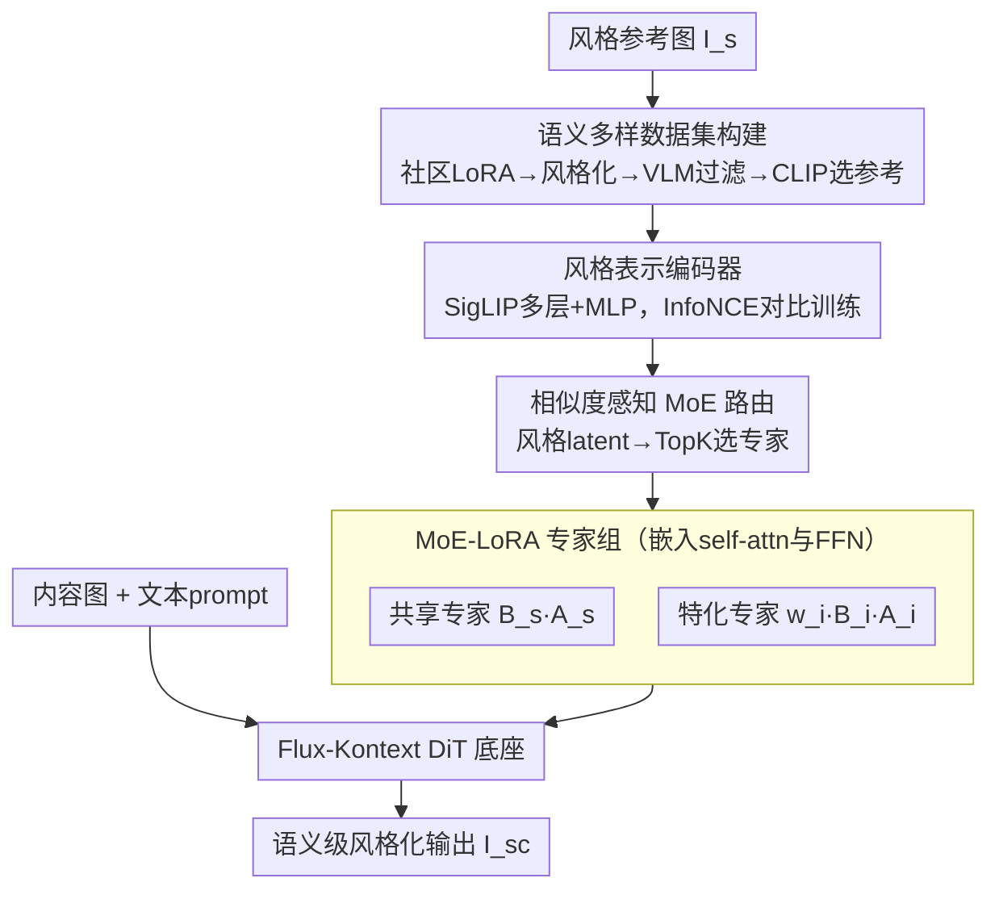

# Mixture of Style Experts for Diverse Image Stylization

**会议**: CVPR 2026  
**论文**: [CVF Open Access](https://openaccess.thecvf.com/content/CVPR2026/html/Zhu_Mixture_of_Style_Experts_for_Diverse_Image_Stylization_CVPR_2026_paper.html)  
**代码**: https://hh-lg.github.io/StyleExpert-Page/ (项目页)  
**领域**: 图像生成 / 风格迁移  
**关键词**: 风格迁移, 混合专家(MoE), 风格编码器, 扩散Transformer, LoRA

## 一句话总结
StyleExpert 用「对比学习预训练的风格编码器 + 相似度感知路由的 MoE-LoRA 适配器」改造扩散 Transformer，让风格迁移不再退化成简单的颜色搬运，而能真正迁移纹理、笔触、材质等语义级风格；并配套构建了一个 50 万级语义-颜色更均衡的 content-style-stylized 三元组数据集，在 Qwen 语义分等指标上大幅领先现有方法。

## 研究背景与动机
**领域现状**：基于扩散 Transformer（DiT，如 FLUX、Flux-Kontext）的风格迁移近年质量飞涨。任务上通常分两类：**颜色迁移**（把参考图的色彩分布搬到内容图、保住空间结构）和**语义迁移**（迁移纹理、线条、材质，甚至允许轻微的空间调整以贴合风格）。理想的风格迁移应当兼顾这两层。

**现有痛点**：作者观察到 OmniStyle、USO、CSGO、OmniGen2、DreamO 等当红方法**普遍退化成"只搬主色调"**——参考图是绿的就给内容图刷上绿、是黄的就刷黄，却抓不住笔触、线条、材质这些真正定义"风格"的语义元素（见原文 Fig.1）。

**核心矛盾**：这背后是两个根因。其一是**数据失衡**——现有风格数据集（OmniStyle-150K 等）严重偏向颜色风格，语义/材质风格样本稀缺；即使有纹理丰富的风格库（Style30K），用免训练方法生成的样本又往往被无关纹理、噪声、伪影污染，质量差。其二是**风格信息注入方式太粗**——OmniStyle/DreamO 把风格图的 VAE latent 直接拼接进去，而 VAE latent 语义信息有限，抓不住高层语义；CSGO/USO 用 cross-attention 或 prompt 注入，却对所有风格"一视同仁"，忽视了不同风格的语义特性差异。

**本文目标**：(1) 造一个颜色/语义更均衡、质量更高的风格数据集；(2) 设计一种能"按风格区别对待"的注入机制，让模型对不同风格走不同的处理路径。

**切入角度**：不同语义层级的风格（浅层纹理 vs 深层语义）本就需要不同的处理能力——一个 LoRA 包打天下注定顾此失彼。那不如**为不同风格准备不同的"专家"，再用一个懂风格的路由器把风格分派给对的专家**，这正是 Mixture of Experts (MoE) 的天然场景。

**核心 idea**：用 InfoNCE 预训练一个判别性强的风格编码器，把它接进 MoE 路由器当"风格先验"，从而把"为不同风格选不同 LoRA 专家"这件事变成一个稳定、可泛化、能规模化训练的 MoE 微调问题。

## 方法详解

### 整体框架
StyleExpert 以 Flux-Kontext 图像编辑模型为底座（它支持 `Z' = [c, z_t, z_c]` 三路输入：文本 token、噪声图像 token、图像控制 token，天然适合塞进风格控制）。整个方法分**两个训练阶段**：

- **阶段一：训练风格编码器**。从 SigLIP 多层特征 + MLP 提取风格表示，用 InfoNCE 对比损失训练，使同风格图像在隐空间靠拢、不同风格拉开。它给阶段二提供"风格先验"。
- **阶段二：训练 MoE 适配器**。在 DiT 的 self-attention 层和 FFN 线性层里嵌入若干 LoRA 专家；用阶段一编码器从风格图抽出的 latent 作为路由器的条件输入，路由器据此为每个风格、每一层动态挑选 top-k 专家加权组合，注入到原始前向里。

为支撑训练，作者还**离线构建了一个数据集 curation pipeline**（不参与推理）：用社区风格 LoRA + OmniConsistency LoRA 把内容图风格化，VLM 过滤劣质样本，再用 CLIP 相似度挑风格参考，凑成 (内容图, 风格图, 风格化图) 三元组。

### 关键设计

**1. InfoNCE 风格表示编码器：给路由器一个"懂风格"的先验**

MoE 训练在早期天然不稳定——路由器一开始毫无头绪，容易把风格分派给错误或次优的专家，导致收敛慢、甚至选错专家（原文 Fig.6）。作者的解法是先单独训一个判别性强的风格编码器，把"识别风格"这件难事从 MoE 训练里解耦出来。具体地，给定风格图 $I_i$（带风格标签 $s_i$），目标是学到表示 $e_i$ 使同标签图像距离最小。距离用温度缩放的余弦相似度 $d(e_i, e_j) = \frac{e_i \cdot e_j^T}{\tau \|e_i\|\|e_j\|}$。表示由 SigLIP 的 $L$ 个不同层 hidden state 拼接后过 MLP $\Phi$ 得到：$e_i = \Phi(\text{concat}(h_i^{(1)}, \dots, h_i^{(L)}))$，多层拼接是为了同时抓住浅层纹理和深层语义。

训练用 InfoNCE 对比损失（类 CLIP）：在两个独立采样的 batch $B$、$B'$ 之间算损失，得到 $B\times B$ 的 log 概率矩阵 $\ell_{ij} = \log\frac{\exp(d(e_i, e'_j))}{\sum_k \exp(d(e_i, e'_k))}$；再用一个正样本掩码 $M_{ij}=\mathbb{1}[s_i = s'_j]$ 来加权——只有同风格标签的对才算正样本。单样本损失对所有 $j$ 按掩码加权求和：$L_i = -\frac{1}{\sum_j M_{ij}}\sum_{j=1}^{B} M_{ij}\cdot\ell_{ij}$，整体损失对 batch 取平均 $L_{\text{InfoNCE}} = \frac{1}{B}\sum_i L_i$。训练好后，这个编码器把视觉相似的风格映到隐空间邻近位置（原文 Fig.8 的 t-SNE 验证），从而能泛化到没见过的风格——这正是稳定路由的关键信号来源。

**2. 相似度感知的 MoE-LoRA 适配器：让不同风格走不同专家**

单个 LoRA 无法同时驾驭不同粒度的多样风格，于是作者在 DiT 的 self-attention 层和 FFN 线性层里嵌入 $N_e$ 个 LoRA 专家，用路由器为每层、每个风格选最合适的若干专家。注意路由器的条件**不是 hidden state**（ICEdit、MultiCrafter 那样），而是**阶段一风格编码器从风格图抽的 latent $e_s$**——这正是"相似度感知"的来历：风格编码器已经把相似风格聚在一起，路由器据此就能把相似风格分给相似专家。第 $i$ 个专家的权重为 $w_i = \text{softmax}(\text{TopK}(g(e_s), k))_i$，其中 $g(e_s)$ 是路由函数输出，TopK 选出前 $k$ 个、其余置 $-\infty$（稀疏激活省算力）。

某一层的输出在原始变换之上叠加专家贡献：

$$h' = l(h) + \frac{\alpha}{r}\Big(B_s \cdot A_s + \sum_{i=1}^{N_e} w_i \cdot B_i \cdot A_i\Big)\cdot h$$

其中 $l(h)$ 是原始输出，$B_s, A_s$ 是**共享专家**的 LoRA 权重（所有风格共用、学通用风格化能力），$B_i, A_i$ 是第 $i$ 个**特化专家**的权重（负责某类风格），$\alpha$ 是缩放系数、$r$ 是 LoRA rank。"共享专家 + 加权特化专家"的组合既保住了通用底座能力，又靠特化专家覆盖风格多样性。实现上用 16 个专家、每个 rank=8、每层选 top-2。

**3. 语义均衡的数据集 StyleExpert-500K/40K：从源头解决"只会搬颜色"**

模型学不会语义风格，很大程度是因为数据里就没有足够的语义风格。作者先用自定义的 **Qwen Semantic Score**（VLM 判断风格化是否偏重纹理/材质等语义、而非表层颜色）量化现有数据，发现 OmniStyle-150K 里 889 个风格有 841 个都压倒性地只做颜色迁移。于是重建数据：从社区收集约 650 个风格 LoRA，人工去重过滤到 209 个高质量 LoRA（覆盖像素级到语义级）；备约 2700 张多类别内容照片，用 Qwen 把 caption 重写成"只描述客观内容、剔除色彩/氛围"的干净 prompt（防止 caption 里的风格信息干扰 LoRA）；再用 OmniConsistency LoRA 把内容图风格化，得到约 50 万张 StyleExpert-500K。随后用 Qwen-VL 二次过滤掉风格化差、布局崩坏、人物属性错误（年龄/性别）、物体不一致的样本，精炼出约 4 万张高保真的 StyleExpert-40K。最后组三元组时，对某风格的每张风格化图 $I_{sc}^{(i)}$，从同风格集合里挑 CLIP 相似度最高的另一张作为风格参考：$I_s^* = \arg\max_{I_{sc}^{(k)}\neq I_{sc}^{(i)}} \text{CLIPSim}(I_{sc}^{(i)}, I_{sc}^{(k)})$——即风格参考本身也是该风格的一个生成样例，保证三元组风格内聚。

### 损失函数 / 训练策略
- **阶段一（风格编码器）**：AdaBelief 优化器，学习率 1e-5，batch size 128，训练 3500 步，目标即上面的 $L_{\text{InfoNCE}}$。
- **阶段二（MoE-LoRA 适配器）**：底座 Flux-Kontext，16 个专家、每个 LoRA rank=8、每层 top-2，batch size 每卡 1（4 卡共 4），学习率 1e-4，训练 10,000 步。

## 实验关键数据

### 主实验
测试协议：188 个风格训练 / 21 个风格测试，每风格随机 50 对内容-风格图、每对两种 seed，共 2100 张/方法。评测三维度：内容保真（CLIP、DINO）、风格相似（CSD、DreamSim↓）、美学（LAION Aesthetic），外加语义级的 Qwen Semantic Score。

| 方法 | CLIP↑ | DINO↑ | CSD↑ | Aesthetic↑ | Qwen语义↑ | DreamSim↓ |
|------|-------|-------|------|-----------|----------|-----------|
| CSGO | 63.41 | 65.50 | 61.07 | 6.28 | 28.93 | 42.39 |
| DreamO | 64.14 | 62.68 | 47.91 | 6.20 | 19.29 | 44.95 |
| OmniGen2 | 67.07 | 63.06 | 55.61 | 6.13 | 23.69 | 41.55 |
| OmniStyle | 65.39 | 72.27 | 59.65 | 6.07 | 40.00 | 41.83 |
| Qwen-Image-Edit | 67.47 | 55.86 | 56.74 | 6.20 | 42.74 | 34.47 |
| USO | 69.39 | **84.03** | 53.60 | 6.30 | 19.88 | 48.62 |
| **StyleExpert(Ours)** | **70.19** | 64.72 | **73.18** | **6.48** | **75.12** | **28.18** |

本文在 CLIP、CSD、Aesthetic、Qwen 语义、DreamSim 五项取得 SOTA，尤其 Qwen Semantic Score（75.12）大幅甩开第二名（Qwen-Image-Edit 42.74）。DINO 偏低是因为它惩罚了"改变材质的语义风格化"——竞品退化成颜色迁移、保留了原材质，反而骗到更高 DINO，作者把这解释为指标的副作用而非真实劣势。

### 消融实验

| 配置 | CLIP↑ | CSD↑ | Qwen语义↑ | DreamSim↓ | 说明 |
|------|-------|------|----------|-----------|------|
| LoRA Training | 67.33 | 70.88 | 70.71 | 36.77 | 单 LoRA，复杂风格抓不住语义 |
| MoE Training（无风格编码器） | 67.83 | 66.70 | 71.43 | 38.54 | MoE 但路由无先验，训练不稳、CSD/DreamSim 甚至不如单 LoRA |
| **StyleExpert（Full）** | **70.19** | **73.18** | **75.12** | **28.18** | 全套，内容保真与风格相似全面最优 |

| 项目 | 计算量(G) | 可训练参数(M) |
|------|-----------|---------------|
| Base Model | 10.92 | - |
| + LoRA | +0.67 | 751.48 |
| + MoE Experts | +0.12 | 818.71 |

### 关键发现
- **风格编码器是 MoE 稳定收敛的命门**：去掉它后 MoE 在 CSD、DreamSim 上明显退化、甚至不如单 LoRA（原文归因于 MoE 早期训练本身不稳）；加上它则优化更稳、收敛更快（Fig.6）。
- **路由确实做到了"相似风格→相似专家"**：固定参考图内容、用风格 latent 条件化路由，相似风格间的专家选择重叠（IoU）约 33.18%，是不相似风格（10.60%）的约 3 倍，直接验证了风格编码器的结构化隐空间在引导路由。
- **效率反直觉地不亏**：MoE 相比单 LoRA 在底座上的额外计算更少（+0.12G vs +0.67G），但可训练参数更多（818.71M vs 751.48M），意味着更大的知识存储容量却没带来推理负担。

## 亮点与洞察
- **把"识别风格"和"应用风格"解耦**：先用对比学习专门训一个风格编码器解决"认风格"，再让它当 MoE 路由的先验解决"用风格"——避免了端到端 MoE 路由从零摸索导致的不稳定，是一个干净且可迁移到其他条件化 MoE 场景的范式。
- **用"路由条件来源"区分自己和前人**：ICEdit/MultiCrafter 把 hidden state 喂给路由器，本文喂的是预训练风格 latent；同样是 MoE-LoRA，换一个更对口的条件就把路由质量和泛化拉起来了。
- **指标批判性解读**：作者主动指出 DINO 偏低恰恰是因为真的改了材质，提醒读者风格迁移里"内容相似度指标"和"语义风格化目标"存在内在冲突，不能唯 DINO 论。
- **数据 pipeline 的"自洽三元组"trick**：风格参考图取自同风格的另一张生成样例（CLIP 最相似），既保证风格内聚，又规避了"参考图与目标风格不匹配"的噪声。

## 局限与展望
- **强依赖社区风格 LoRA**：209 个风格全来自 Hugging Face 社区 LoRA，风格覆盖面和质量被社区资源上限卡住；罕见/小众艺术风格仍可能缺位。
- **数据由生成模型自产**：StyleExpert-500K 是用 OmniConsistency LoRA 风格化产出的，存在"用生成数据训生成模型"的潜在分布偏置，真实艺术作品的复杂性可能未被完全覆盖。
- **Qwen Semantic Score 是自定义指标**：本文很多结论建立在它之上，但其具体定义在正文未给（仅说见补充材料），跨论文可比性有限——⚠️ 具体计算以原文补充材料为准。
- **专家数/topk 等是固定超参**：16 专家、top-2、rank 8 等未做充分敏感性分析，换底座或换风格规模时是否最优未知。

## 相关工作与启发
- **vs OmniStyle / DreamO**：它们靠拼接 VAE latent 注入风格，受限于 VAE 语义信息有限、抓不住高层语义；本文用 SigLIP 多层特征 + 专门训练的风格编码器，语义表达力更强。
- **vs CSGO / USO**：它们用 cross-attention / prompt 注入风格但对所有风格一视同仁；本文用 MoE 为不同风格走不同专家路径，实现"按风格区别对待"。
- **vs ICEdit / MultiCrafter（MoE-LoRA 图像生成）**：同样 LoRA-as-expert，但它们用 hidden state 当路由条件；本文用预训练风格 latent 当条件，路由更稳、泛化更好。
- **vs 免训练风格迁移（B-LoRA / K-LoRA / Attention Distillation）**：免训练法推理开销大或需多张风格图、且性能不稳；本文是训练型方法，单张风格图即可、推理稳定。

## 评分
- 新颖性: ⭐⭐⭐⭐ 「风格编码器作 MoE 路由先验」组合巧妙且解决了 MoE 训练不稳的真问题，但 MoE-LoRA、对比学习风格编码各自非首创。
- 实验充分度: ⭐⭐⭐⭐ 6 个 baseline、6 项指标、消融+路由重叠+t-SNE+收敛曲线证据链完整；扣分在核心指标 Qwen Semantic Score 定义未在正文给出。
- 写作质量: ⭐⭐⭐⭐ 动机清晰、两阶段框架和公式交代到位，对 DINO 偏低的批判性解读尤其加分。
- 价值: ⭐⭐⭐⭐ 语义级风格迁移 + 50 万级均衡数据集都有实用价值，可直接推动后续语义风格化与定制化研究。

<!-- RELATED:START -->

## 相关论文

- [\[CVPR 2026\] TAG-MoE: Task-Aware Gating for Unified Generative Mixture-of-Experts](tag-moe_task-aware_gating_for_unified_generative_mixture-of-experts.md)
- [\[AAAI 2026\] Aggregating Diverse Cue Experts for AI-Generated Image Detection](../../AAAI2026/image_generation/aggregating_diverse_cue_experts_for_ai-generated_image_detec.md)
- [\[ICCV 2025\] Balanced Image Stylization with Style Matching Score](../../ICCV2025/image_generation/balanced_image_stylization_with_style_matching_score.md)
- [\[CVPR 2026\] EmoStyle: Emotion-Driven Image Stylization](emostyle_emotion-driven_image_stylization.md)
- [\[CVPR 2026\] Style-GRPO: Semantic-Aware Preference Optimization for Image Style Transfer Guided by Reward Modeling](style-grpo_semantic-aware_preference_optimization_for_image_style_transfer_guide.md)

<!-- RELATED:END -->
