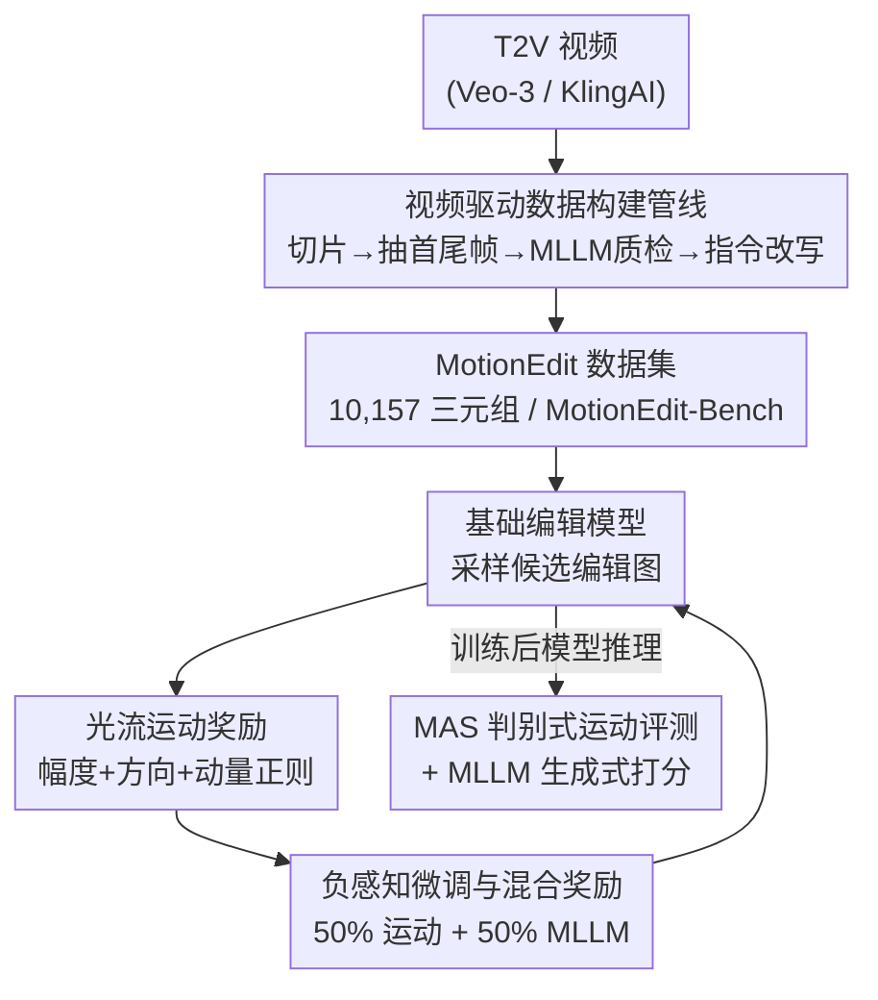

# MotionEdit: Benchmarking and Learning Motion-Centric Image Editing

**会议**: CVPR 2026  
**论文**: [CVF Open Access](https://openaccess.thecvf.com/content/CVPR2026/html/Wan_MotionEdit_Benchmarking_and_Learning_Motion-Centric_Image_Editing_CVPR_2026_paper.html)  
**代码**: https://github.com/elainew728/motion-edit  
**领域**: 图像生成 / 指令图像编辑  
**关键词**: 运动编辑, 图像编辑基准, 光流奖励, 负感知微调, 扩散模型后训练

## 一句话总结
这篇论文把"改主体动作/姿态/交互而不改外观"的**运动图像编辑**正式立成一个独立任务，从真实视频里挖出 10,157 对高质量"前后帧"三元组构建了 MotionEdit 数据集与基准，并提出 MotionNFT——一种用**光流运动对齐分**当奖励、扩展 DiffusionNFT 的后训练框架，让 FLUX.1 Kontext 和 Qwen-Image-Edit 在不损失通用编辑能力的前提下显著提升运动编辑保真度。

## 研究背景与动机

**领域现状**：指令图像编辑（InstructPix2Pix、MagicBrush、UltraEdit、OmniEdit、FLUX.1 Kontext、Qwen-Image-Edit 等）这几年进步很快，对"改颜色、换纹理、加/删物体"这类**静态外观编辑**已经做得相当好。

**现有痛点**：但一旦指令是"让这头牛抬起一条腿""让女人低头喝咖啡""让两个角色转身面对面"这类**运动/姿态/交互编辑**，现有模型经常失败——要么完全不动只改了点颜色，要么动作做错，要么把人脸、身体搞出严重 artifact 和身份漂移。作者把根因归到数据上，指出两个瓶颈：① 主流编辑数据集几乎只覆盖静态编辑，**根本没有运动编辑数据**；② 少数含运动编辑的数据集（InstructP2P、MagicBrush）数据量小、质量差，target 图常常不忠实——指令说抬腿但 ground-truth 腿没抬、说拿步枪但手里没枪，还伴随外观漂移和视角偏移。训练监督和评测都被这种脏数据带偏。

**核心矛盾**：高质量运动编辑 ground-truth 极难获得。如果像前人那样用生成模型**合成** target 图，就会引入幻觉和不一致；而运动编辑本身又要求"动作变了、身份/背景/视角全不变"，这种成对监督几乎不可能靠人工或合成稳定拿到。

**本文目标**：(1) 给运动图像编辑一个清晰的任务定义和分类；(2) 造一个真正干净、运动幅度大的数据集和评测基准；(3) 设计一种能直接监督"动得对不对"的训练方法。

**切入角度**：真实视频天然包含连贯、物理合理的运动转换——同一段视频的两帧之间，主体动了，但身份、背景、风格自然保持一致。所以与其合成 target，不如**从视频里挖前后帧**。再加上"运动 = 光流"这一经典认知：光流能逐像素刻画运动的大小和方向，那它既能当**评测指标**，也能当**训练奖励**。

**核心 idea**：用"视频挖帧 + MLLM 质检"造高质量运动编辑三元组，再用"光流对齐奖励"驱动负感知微调（DiffusionNFT），把模型推向"动作幅度和方向都对齐 ground-truth"的输出。

## 方法详解

### 整体框架

整篇工作由两大块拼成：**前半是数据与基准**（怎么造出可信的运动编辑监督），**后半是学习方法**（怎么把这种监督喂进模型）。数据侧，作者从 T2V 模型（Veo-3、KlingAI）生成的高清视频里切片、抽首尾帧，用 MLLM 当质检员筛掉相机晃动/主体消失/有 artifact 的对，再用 MLLM 把"运动变化摘要"改写成用户口吻的编辑指令，最终得到 (输入图 $I_{orig}$, 编辑指令, target 图 $I_{gt}$) 三元组。学习侧，给定一张待编辑图，基础编辑模型（FLUX.1 Kontext / Qwen-Image-Edit）采样候选编辑图 $I_{edited}$，用预训练光流网络（UniMatch）分别算"输入→编辑图"和"输入→ground-truth"两条光流，对比它们的**幅度、方向、是否真的动了**，聚合成一个 MotionNFT 奖励，再按 DiffusionNFT 的正/负速度目标更新模型。评测侧另起一个确定性指标 MAS，配合 MLLM 生成式打分一起衡量。

### 关键设计

**1. 视频驱动的数据构建管线：用真实视频帧替代合成 target，再用 MLLM 把关质量**

针对"合成 target 图必然幻觉、运动编辑成对监督拿不到"这个痛点，作者不去合成，而是**从动态视频里挖天然存在的运动转换**。流程是：先从 ShareVeo3、KlingAI 两个公开 T2V 视频集取候选视频（之所以不用 HAA500、K400 等人体动作数据集，是因为它们分辨率低、运动模糊、视角跳变，抽不出身份/背景一致的前后帧）；把每段视频切成 3 秒窗口，取每窗的首帧和尾帧作为候选运动对；然后用 Gemini 当**自动质检员**，沿三个维度逐对打分——**Setting Consistency**（背景/视角/光照是否稳定）、**Motion and Interaction Change**（是否有显著且有意义的动作/交互变化，并归纳出"未拿杯子→正在喝"这类转换摘要）、**Subject Integrity and Quality**（主体是否完整、可辨识、无遮挡/缩放/幻觉/畸变）。只有四条都满足（场景稳、变化非平凡、主体一致、画质高）的对才被保留，其余直接丢弃。保留的对再经过一个 **MLLM 改写模块**，把质检阶段产生的运动摘要清洗成祈使句的用户口吻指令（如"Make the woman turn her head toward the dog."），保证指令和图里真实发生的运动严格对齐。这条管线最大的价值是**可扩展**：换更大的视频语料就能持续扩数据，而不依赖人工标注。最终数据集含 10,157 对（Veo-3 6,006 + KlingAI 4,151），90/10 划分为 9,142 训练 / 1,015 测试（即 MotionEdit-Bench），并归类为六种运动类型：姿态/体态、移动/距离、物体状态/形变、朝向/视角、主体–物体交互、主体间交互。

**2. 光流运动奖励：把"动得对不对"量化成可微的标量奖励**

针对"现有 RL 后训练都是运动无关的、只管语义对不对和细节好不好，没人监督主体该怎么动"这个痛点，作者设计了一个**以光流为核心的运动奖励**。给定三元组 $X=(I_{orig}, I_{edited}, I_{gt})$，用预训练 UniMatch 估计两条光流：预测运动 $V_{pred}=F(I_{orig}, I_{edited})$ 和真值运动 $V_{gt}=F(I_{orig}, I_{gt})$，每条 $\in \mathbb{R}^{H\times W\times 2}$，并按图像对角线归一化以消除分辨率尺度差异。奖励由三项构成：**运动幅度一致性**用鲁棒 $\ell_1$ 距离 $D_{mag}=\frac{1}{HW}\sum_{i,j}(\|\tilde V_{pred}(i,j)-\tilde V_{gt}(i,j)\|_1+\varepsilon)^q$（$q\in(0,1)$ 抑制离群点）；**运动方向一致性**用逐像素余弦误差 $e_{dir}(i,j)=\frac{1}{2}(1-\hat v_{pred}(i,j)^\top \hat v_{gt}(i,j))$，并按真值运动幅度加权 $D_{dir}=\frac{\sum_{i,j} w(i,j)e_{dir}(i,j)}{\sum_{i,j} w(i,j)+\varepsilon}$，让运动大的区域更重要；**动量正则**用来惩罚那种几乎不动的偷懒编辑 $M_{move}=\max\{0,\ \tau+\frac{1}{2}\bar m_{gt}-\bar m_{pred}\}$，当预测平均运动远小于真值时给惩罚。三项聚合成复合距离

$$D_{comb}=\alpha D_{mag}+\beta D_{dir}+\lambda_{move}M_{move}$$

再归一化裁剪 $\tilde D=\text{clip}((D_{comb}-D^*_{min})/(D_{max}-D^*_{min}),0,1)$，转成连续奖励 $r_{cont}=1-\tilde D$，最后量化成 6 个离散档位 $r_{motion}=\frac{1}{5}\text{round}(5\,r_{cont})\in\{0.0,0.2,0.4,0.6,0.8,1.0\}$。和"只用 MLLM 打分"的奖励相比，这个奖励**确定性、可解释、直接对准运动几何**——它明确告诉模型"方向偏了""幅度不够"，而不是笼统说"这张更好"。

**3. 负感知微调与混合奖励：把运动奖励注入 DiffusionNFT，并兼顾通用编辑能力**

得到标量运动奖励后，需要一个后训练框架把它变成参数更新方向。作者建立在 **DiffusionNFT** 上：它针对流匹配模型（FMM）同时学一个该靠近的正速度 $v^+_\theta$ 和一个该远离的负速度 $v^-_\theta$，目标为

$$L(\theta)=\mathbb{E}_{c,\pi_{old},t}\big[r\,\|v^+_\theta(x_t,c,t)-v\|_2^2+(1-r)\,\|v^-_\theta(x_t,c,t)-v\|_2^2\big]$$

其中 $v^+_\theta=(1-\beta)v_{old}+\beta v_\theta$、$v^-_\theta=(1+\beta)v_{old}-\beta v_\theta$，而 $r$ 是把原始奖励经过 per-prompt 归一化得到的"最优性奖励"（$r=\frac{1}{2}+\frac{1}{2}\text{clip}(\frac{r_{raw}-\mathbb{E}_{\pi_{old}}[r_{raw}]}{Z_c},-1,1)$），用来稳定正/负样本的判定。MotionNFT 的关键就是把上面第 2 点的 $r_{motion}$ 作为这里的奖励信号喂进去。但只用运动奖励会有副作用——模型可能为了"动得多"而牺牲通用编辑质量，所以作者采用**混合奖励**：50% 光流运动奖励 $r_{motion}$ + 50% 来自 UniWorld-V2 的 MLLM 在线打分（用一个 vLLM 部署的 Qwen2.5-VL-32B-Instruct 在训练中实时评 prompt 遵循、风格保真等）。光流部分用轻量 UniMatch（335.6M 参数）直接在训练节点上跑，开销小。这种"运动奖励管动作、MLLM 奖励管语义和外观"的分工，让模型在学会运动编辑的同时不丢掉原有的通用编辑能力。

**4. MAS 判别式运动评测：给基准配一个不依赖 MLLM 的确定性运动指标**

针对"MLLM 生成式打分主观、有方差"的问题，作者在评测侧另配一个确定性的 **Motion Alignment Score (MAS)**。它复用第 2 点里的运动幅度项 $D_{mag}$ 和方向项 $D_{dir}$，合成 $D_{ovl}=\alpha D_{mag}+(1-\alpha)D_{dir}$，再归一化转成 0–100 分：$\text{MAS}=100\cdot(1-\text{clip}((D_{ovl}-d_{min})/(d_{max}-d_{min}),0,1))$，分越高表示模型运动越接近真值。还有一个关键护栏：如果预测运动相对真值几乎是静止的（$\mathbb{E}[m_{pred}]/\mathbb{E}[m_{gt}]<\rho_{min}$），直接判 MAS = 0，专门惩罚"看起来没改"的退化解。配合 MAS，基准还用 Gemini 当 MLLM 评测器给 Fidelity / Preservation / Coherence / Overall 四项生成式打分（0–5 分），并计算 head-to-head 的 **Pairwise Win Rate**（$(wins+0.5\cdot draws)/total$）。生成式（看整体观感）、判别式（看运动几何）、偏好式（看相对优劣）三类指标互补，让评测更全面可信。

### 损失函数 / 训练策略
训练目标即 DiffusionNFT 的正/负速度回归损失（上式 $L(\theta)$），奖励 $r$ 由混合奖励（50% $r_{motion}$ + 50% MLLM 分）归一化而来。基础模型为 FLUX.1 Kontext [Dev] 和 Qwen-Image-Edit；用 FSDP 切分文本编码器、梯度检查点节省显存；MLLM 评分用 vLLM 单独部署 Qwen2.5-VL-32B-Instruct 在线打分，光流用 UniMatch 在训练节点本地推理。

## 实验关键数据

### 主实验

在 MotionEdit-Bench 上评测 9 个开源编辑模型（生成式四项 0–5 分，MAS 0–100，Win Rate 为百分比）。给两个强基座套上 MotionNFT 后，所有指标一致提升：

| 模型 | Overall↑ | Fidelity↑ | Preservation↑ | Coherence↑ | MAS↑ | Win Rate↑ |
|------|---------|----------|--------------|-----------|------|----------|
| Instruct-P2P | 1.30 | 1.32 | 1.29 | 1.29 | 34.15 | 16.09 |
| AnyEdit | 1.31 | 1.32 | 1.32 | 1.30 | 35.11 | 16.88 |
| MagicBrush | 1.50 | 1.58 | 1.47 | 1.44 | 44.24 | 19.51 |
| UltraEdit | 2.42 | 1.88 | 2.09 | 2.13 | 47.18 | 28.33 |
| UniWorld-V1 | 2.87 | 2.96 | 2.76 | 2.88 | 55.37 | 41.14 |
| Step1X-Edit | 4.02 | 4.04 | 3.99 | 4.02 | 52.98 | 61.14 |
| BAGEL | 4.10 | 4.24 | 4.01 | 4.06 | 51.83 | 61.46 |
| FLUX.1 Kontext [Dev] | 3.84 | 3.89 | 3.79 | 3.83 | 53.73 | 57.71 |
| **+MotionNFT (Ours)** | **4.25** | **4.33** | **4.16** | **4.25** | **55.45** | **64.95** |
| Qwen-Image-Edit | 4.65 | 4.70 | 4.59 | 4.66 | 56.46 | 72.80 |
| **+MotionNFT (Ours)** | **4.72** | **4.79** | **4.63** | **4.74** | **57.23** | **73.67** |

对 FLUX.1 Kontext，Overall 从 3.84→4.25（+10.68%），Fidelity +0.44、Coherence +0.42，MAS 53.73→55.45，Win Rate 提升约 +12.40%（正文按 57.97%→65.16% 口径计；表中 base 57.71、本文 64.95 ⚠️ 以原文为准，正文与表略有口径差异）。对更强的 Qwen-Image-Edit，提升幅度较小但仍全面为正（Overall 4.65→4.72，MAS 56.46→57.23）。另一个值得注意的现象：Instruct-P2P、AnyEdit、MagicBrush 这类老模型在生成式和判别式指标上都很差（Overall ~1.3），说明运动编辑对大多数开源模型仍是难题。

### 消融实验

**通用编辑能力（ImgEdit-Bench，8 类子任务，0–5 分）**——验证 MotionNFT 不牺牲原有编辑能力，反而常常顺带提升：

| 模型 | Add | Adj. | Rpl. | Rem. | Bck. | Stl. | Hyb. | Act. | Ovl.↑ |
|------|-----|------|------|------|------|------|------|------|-------|
| FLUX.1 Kontext | 3.54 | 2.90 | 3.73 | 2.89 | 3.59 | 3.96 | 2.90 | 2.56 | 3.26 |
| + MotionNFT | 3.71 | 3.28 | 3.93 | 3.05 | 3.72 | 4.41 | 2.99 | 2.85 | **3.50** |
| Qwen-Image-Edit | 4.20 | 3.70 | 4.22 | 4.20 | 4.17 | 4.60 | 3.55 | 4.03 | 4.08 |
| + MotionNFT | 4.31 | 3.72 | 4.46 | 4.30 | 4.21 | 4.67 | 3.96 | 3.87 | **4.20** |

**对比纯 MLLM 奖励（UniWorld-V2）**——证明光流运动奖励比"只用 MLLM 打分"更有针对性：

| 模型 | Overall↑ | MAS↑ | Win Rate↑ |
|------|---------|------|----------|
| FLUX.1 Kontext | 3.84 | 53.73 | 57.97 |
| + UniWorld-V2 (MLLM-only) | 4.20 | 54.58 | 64.02 |
| **+MotionNFT (Ours)** | **4.25** | **55.45** | **65.16** |
| Qwen-Image-Edit | 4.65 | 56.46 | 73.01 |
| + UniWorld-V2 (MLLM-only) | 4.70 | 56.46 | 72.77 |
| **+MotionNFT (Ours)** | **4.72** | **57.23** | **73.87** |

### 关键发现
- **混合奖励里的光流分量是关键贡献**：Table 3 显示纯 MLLM 奖励（UniWorld-V2）也能小幅提升，但加入光流运动奖励后 MAS 和 Win Rate 更高——尤其在 Qwen-Image-Edit 上，纯 MLLM 奖励的 MAS 甚至没涨（56.46→56.46），而 MotionNFT 涨到 57.23，说明只有针对运动几何的监督才真正改善"动得对不对"。
- **数据集运动幅度远超前人**：MotionEdit 的平均输入–目标运动差为 0.19，而 MagicBrush/OmniEdit 约 0.03、UltraEdit 约 0.07，即本文是 MagicBrush/OmniEdit 的约 5.8×、UltraEdit 的约 3×，证明它是更有挑战性的运动编辑数据。
- **不牺牲通用能力**：ImgEdit-Bench 上两个基座套 MotionNFT 后 Overall 反而从 3.26→3.50、4.08→4.20，说明运动专项后训练没有破坏原有编辑分布（个别子类如 Qwen 的 Act. 从 4.03→3.87 略降 ⚠️ 以原文为准）。
- **强基座增益递减**：Qwen-Image-Edit 本身已很强，MotionNFT 带来的提升明显小于 FLUX.1 Kontext，符合"基线越高、可提升空间越小"的直觉。

## 亮点与洞察
- **"光流既当评测又当奖励"是最巧的一笔**：同一套光流对齐既支撑确定性指标 MAS，又作为可微奖励驱动训练，评测和优化用同一种"运动几何"语言，避免了评测和训练目标错位。
- **用视频挖帧绕开 target 合成难题**：运动编辑最难的就是"动了但其他都不变"的成对监督，作者直接借真实视频的时间连续性拿到天然一致的前后帧，思路可迁移到任何"难以合成 target"的成对监督任务（如表情编辑、相机移动编辑）。
- **动量正则 + MAS 静止判零是防偷懒的硬护栏**：模型最容易学会的退化解就是"几乎不改"，这两处设计专门把这种解的奖励/分数压到底，是做运动类任务时值得复用的 trick。
- **混合奖励的分工很清晰**：把"动作对不对"交给确定性光流、把"语义和外观好不好"交给 MLLM，各管一摊，既学到新能力又不退化旧能力。

## 局限与展望
- **数据来源全是 T2V 生成视频**：Veo-3/KlingAI 的视频虽然清晰稳定，但和真实世界视频在物理合理性、长尾动作分布上可能有差异，数据集的"真实性"实质是"高质量生成视频的真实感"。
- **依赖 MLLM 当质检和评测**：Gemini 的 keep/discard 判定和 Fidelity/Coherence 打分都继承了 MLLM 的偏置与方差，正文也出现 Win Rate 口径在表与文之间不完全一致的情况（⚠️ 以原文为准）。
- **光流对大形变/遮挡的可靠性存疑**：运动编辑常涉及大位移、自遮挡，UniMatch 估计误差会直接污染奖励，论文未深入讨论这种失败模式。
- **增益对强基座有限**：Qwen-Image-Edit 上的提升已经很小，方法天花板可能受限于基座本身的运动理解能力。
- **可改进方向**：把奖励从 2D 光流升级到 3D/深度感知运动表示，或引入物理/关节约束，可能在大幅度、强遮挡的运动编辑上更稳。

## 相关工作与启发
- **vs 静态外观编辑数据集（OmniEdit / UltraEdit / AnyEdit）**：它们聚焦颜色/纹理/物体替换，几乎不含运动编辑；本文专门补上运动维度，且运动幅度是它们的 3–5.8×。
- **vs 含运动的旧数据集（InstructP2P / MagicBrush）**：它们的运动 target 多为合成、常不忠实且有 artifact；本文用视频真帧 + MLLM 质检保证忠实一致。
- **vs DiffusionNFT / UniWorld-V2**：DiffusionNFT 提供负感知微调骨架但奖励运动无关；UniWorld-V2 把它扩成 MLLM 在线打分，仍只管语义/外观。MotionNFT 在其上注入光流运动奖励，第一次让后训练显式监督"主体该怎么动"。
- **vs 光流方法（UniMatch 等）**：本文不改进光流本身，而是借其成熟的运动估计能力，把光流从"分析工具"用成"奖励信号"。

## 评分
- 新颖性: ⭐⭐⭐⭐⭐ 把运动编辑立成独立任务，并首创"光流运动奖励驱动后训练"，问题和方法都新。
- 实验充分度: ⭐⭐⭐⭐ 覆盖 9 个基线、两个强基座、通用能力与纯 MLLM 奖励两组消融，较扎实；但缺奖励三分量的逐项消融。
- 写作质量: ⭐⭐⭐⭐ 动机—数据—方法—评测脉络清晰，公式完整；个别指标口径在表与文间略有出入。
- 价值: ⭐⭐⭐⭐⭐ 数据集/基准 + 即插即用后训练框架双交付，对帧控视频生成、角色动画等下游有直接价值。

<!-- RELATED:START -->

## 相关论文

- [\[CVPR 2026\] WiseEdit: Benchmarking Cognition- and Creativity-Informed Image Editing](wiseedit_benchmarking_cognition-_and_creativity-informed_image_editing.md)
- [\[CVPR 2026\] CompBench: Benchmarking Complex Instruction-guided Image Editing](compbench_benchmarking_complex_instruction-guided_image_editing.md)
- [\[CVPR 2026\] Omni IIE Bench: Benchmarking the Practical Capabilities of Image Editing Models](omni_iie_bench_benchmarking_the_practical_capabilities_of_image_editing_models.md)
- [\[CVPR 2026\] Leveraging Verifier-Based Reinforcement Learning in Image Editing](leveraging_verifier-based_reinforcement_learning_in_image_editing.md)
- [\[CVPR 2025\] GRADE: Benchmarking Discipline-Informed Reasoning in Image Editing](../../CVPR2025/image_generation/grade_benchmarking_discipline-informed_reasoning_in_image_editing.md)

<!-- RELATED:END -->
