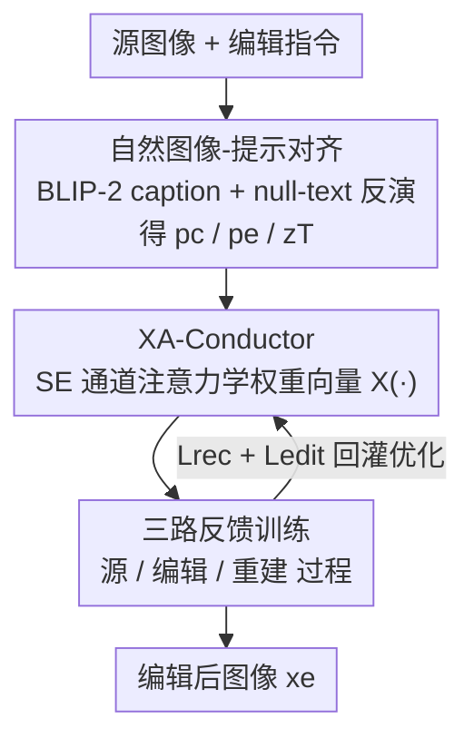

# NEAF: Natural Image Editing with Attention Fusion for Generalizable Test-time Optimization in Text-Guided Image Editing

**会议**: CVPR 2026  
**论文**: [CVF Open Access](https://openaccess.thecvf.com/content/CVPR2026/html/Kim_NEAF_Natural_Image_Editing_with_Attention_Fusion_for_Generalizable_Test-time_CVPR_2026_paper.html)  
**代码**: 待确认（论文称推理代码在补充材料）  
**领域**: 扩散模型 / 图像编辑  
**关键词**: 文本引导图像编辑、测试时优化、交叉注意力融合、零样本、非刚性编辑

## 一句话总结
NEAF 提出一个**零样本、免微调**的测试时优化框架，给任意预训练 T2I 扩散模型加一个仅 0.08M 参数的可学习 XA-Conductor 模块，通过"源/编辑/重建"三路反馈循环动态融合交叉注意力图，从而在不重训、不构建数据集的前提下完成高保真文本编辑，尤其擅长其它方法做不好的非刚性（动作/姿态）编辑。

## 研究背景与动机
**领域现状**：基于扩散的文本到图像（T2I）模型已经能生成高保真图像，由此衍生出"按文本指令修改已有图像"的文本引导编辑任务。现有路线大致三类：(a) 在大规模成对编辑数据集上**重训**整个模型；(b) 只**微调**扩散模型的特定层或 latent embedding；(c) **免微调（tuning-free）**地直接复用预训练模型，多采用"重建分支 + 编辑分支"的双分支结构，在两分支间注入/替换注意力与特征。

**现有痛点**：重训路线编辑能力强但代价高昂——既要构建大规模配对数据集，又要重训，且训完只绑定某个 base model，**牺牲了对其它（尤其是轻量）模型的通用性**。微调路线省掉了配对数据，但仍有额外训练开销，且在**非刚性、高度结构化**的复杂编辑上明显退化。免微调路线虽轻，但直接搬运 self-/cross-attention、不引入任何"注意力图之间的学习关系"，能力天然受限，遇到用户任意 prompt 还容易出现**文本-图像错位（misalignment）与身份漂移（identity drift）**。

**核心矛盾**：编辑任务的根本张力是 **editability（要反映文本改动）↔ fidelity（要保住未编辑区域）**。双分支方法为保 fidelity 而硬注入源注意力，却因此压制了语义变化的表达，尤其是动词类（如"smiling""跳跃"）需要结构形变的非刚性编辑。作者把这归因于两点具体技术障碍：(1) 任意指令施加到自然图像上时的**图文错位**；(2) 双分支里 DDIM 反演 + 大 classifier-free guidance 带来的**过强文本偏置**，反而破坏了多分支方法本想守住的高保真。

**本文目标**：做一个"通用框架"——把任意 T2I 模型零成本变成编辑器，**不要大数据集、不要重训、不要微调**，同时在常规与非刚性编辑上都稳。

**切入角度**：作者假设双分支方法之所以在非刚性编辑上失灵，是因为它们"tuning-free 到底"——只是原样注入注意力，没有任何**基于学习**的优化。而**交叉注意力恰好承载了动词的语义特征**，如果对它做轻量学习，就能解锁动词驱动的高层编辑。

**核心 idea**：在编辑分支里塞一个轻量可学习模块（XA-Conductor），让它在"源→编辑→重建"三路反馈循环里**学一个权重向量**，自适应地决定每张交叉注意力图该保留还是该改写，从而把 editability 与 fidelity 在注意力层面解耦控制。

## 方法详解

### 整体框架
NEAF 的输入是一张自然图像 $x_o$ 加一条编辑指令，输出是编辑后的图像 $x_e$；整条管线不碰 base diffusion model 的权重，只在推理时优化一个微型模块。它分两步走：先做**图文对齐**把"任意自然图像 + 任意指令"规整到扩散模型擅长的对齐子空间，再用 **XA-Conductor + 三路反馈**在采样过程中学会如何融合注意力。

具体地：源图像先经 BLIP-2 生成一条与图像内容对齐的源 caption $p_c$，用它优化 null-text embedding $\varnothing$ 并通过反演得到初始噪声 latent $z_T$；编辑时只对 $p_c$ 做最小改动得到对齐目标 prompt $p_e$。然后框架并行跑三个反向扩散过程：**源过程**（用 $p_c$，记录每步交叉注意力 $A^{(c)}_t$）、**编辑过程**（用 $p_e$，但注意力被换成插值后的 $\hat{A}_t$）、**重建过程**（重新用 $p_c$，注意力换成 $\tilde{A}_t$）。XA-Conductor 就是那个产出插值权重的模块，三路过程的输出回灌成训练信号（重建损失 + 编辑损失），循环优化这个权重向量直到收敛，最后由编辑过程解码出 $x_e$。

### 关键设计

**1. 自然图像-提示对齐：先把任意图文拉回扩散模型的对齐子空间**

这一步针对的是第一个障碍——把任意指令套到自然图像上会产生图文错位，导致编辑结果很差（论文 Fig.2(a)）。错位的本质是 prompt 与图像之间残留的语义鸿沟，源于训练时图文对齐本就不完美。作者的做法是用视觉语言模型 BLIP-2 给源图像生成一条**与图像内容高度对齐的 caption** $p_c$，再用它去优化 null-text embedding $\varnothing$，并同时通过反演求出噪声 latent $z_T$；采样时 $p_c$ 与优化后的 $\varnothing$ 一起作为约束，**隐式限定了可编辑空间**。编辑指令不是另起炉灶，而是对 $p_c$ 做最小修改得到对齐目标 prompt $p_e$——这样 $p_e$ 与 $p_c$ 高度相似、只在被改元素处不同。由于 caption 本身对齐，优化后的 null embedding 能把源图像的重建轨迹编码进去，保证以 $p_e$ 为条件的生成与源图一致、不会大幅跑偏（论文 Fig.2(b) 显示对齐 prompt 的编辑明显更好）。这一步是后续注意力融合能稳的前提：先把"输入"摆正，再谈"怎么改"。

**2. XA-Conductor：一个学权重向量的交叉注意力指挥家**

这是论文的核心模块，针对第二个障碍——双分支方法原样搬注意力、缺少学习关系，于是在动词类非刚性编辑上失灵。作者假设交叉注意力承载了动词的语义特征，因此引入一个轻量可学习模块 $\mathcal{X}(\cdot)$，输入是各过程分支生成的交叉注意力图，输出是一个向量 $\mathcal{X}(A)\in\mathbb{R}^N$，每个元素代表序列反向过程中第 N 张注意力图被赋予的权重。模块内部采用**通道维注意力结构**，由 squeeze-excitation（SE）块构成，因此能对每个交叉注意力通道做足够细粒度的调制，捕捉跨步累积的细微、滞后的变化。

它在采样时这样工作：源过程记录每步交叉注意力 $A^{(c)}_t=\mathcal{A}(z^{(c)}_t,[\varnothing;p_c])$，并按 DDIM 一步更新 $z^{(c)}_{t-1}=\mathcal{S}_t(z^{(c)}_t,\epsilon^{(c)}_t)$ 推进。编辑过程则把源注意力 $A^{(c)}_t$ 与编辑注意力 $A^{(e)}_t$ 用 XA-Conductor 给出的权重做**线性插值**：

$$\hat{A}_t=\mathcal{X}(A^{(c)}_t)\cdot A^{(c)}_t+\bigl(1-\mathcal{X}(A^{(c)}_t)\bigr)\cdot A^{(e)}_t$$

插值后的 $\hat{A}_t$ 在每一步替换掉 $A^{(e)}_t$，迫使去噪器把预测推向"混合后的图文交互"方向，既漂向源图的方向（保 identity），又落实 $p_e$ 的编辑意图，最终解码出 $x_e$。换句话说，权重 $\mathcal{X}(\cdot)$ 学会了"哪些注意力图该保留源、哪些该让位给编辑"，把保真与可编辑的取舍变成一个可学习的、逐通道的连续旋钮——这正是免微调方法欠缺的"学习关系"。

**3. 三路反馈训练：用重建回路给权重向量上"保真约束"**

XA-Conductor 要学得准，必须有一个监督信号告诉它"改过头了没有"。为此作者设计三路反馈（triadic-feedback）训练：在源、编辑两路之外，再加一条**重建过程**——重新引入源 prompt $p_c$，但注意力换成另一次插值 $\tilde{A}_t=(1-\mathcal{X}(\hat{A}_t))\cdot A^{(c)}_t+\mathcal{X}(\hat{A}_t)\cdot\hat{A}_t$，同样在每步替换 $A^{(c)}_t$ 并解码出重建图 $x_r$。其意义是：让 XA-Conductor 学会识别哪些交叉注意力图对编辑是关键的，并在源 prompt 被重新引入时**衰减或恢复**它们的影响——如果编辑权重设置合理，重建过程就应能把内容还原回源图。

由此自然导出训练目标，结合两项互补的损失：

$$\mathcal{L}=\sum_{t=0}^{T}\bigl\lVert z^{(r)}_t-z^{(o)}_t\bigr\rVert_2-\lambda\cdot\text{sim}_\text{CLIP}(x_e,p_e)$$

第一项重建损失 $\mathcal{L}_{rec}=\sum_t\lVert z^{(r)}_t-z^{(o)}_t\rVert_2$ 让重建轨迹逼近源图 latent，强制内容保持；第二项编辑损失 $\mathcal{L}_{edit}=-\text{sim}_\text{CLIP}(x_e,p_e)$ 用 CLIP 图文相似度约束编辑结果忠实于 $p_e$。标量 $\lambda$ 调节"保内容 vs 守编辑"的权衡。值得一提的是，作者经验上发现 **$\mathcal{L}_{edit}$ 的贡献很小**——也就是说真正撑起编辑质量的是这条带重建约束的三路反馈结构本身，而非 CLIP 项。整个优化只针对 0.08M 的 XA-Conductor，base 扩散模型全程冻结，这正是"零样本测试时优化"的含义。

### 损失函数 / 训练策略
NEAF 构建在 Stable Diffusion v1.4 上，XA-Conductor 在 50 个推理步内、学习率 1e-2 完成测试时优化，单张 RTX 3090 即可。损失即上文 $\mathcal{L}=\mathcal{L}_{rec}-\lambda\cdot\text{sim}_\text{CLIP}(x_e,p_e)$，其中 $\mathcal{L}_{edit}$ 实测贡献微弱，保真主要由三路反馈的重建项保证。

## 实验关键数据

### 主实验
评测在 TEdBench 的 25 张图像（外加部分肖像图扩展适用性）上进行，对比 6 个代表性基线（Text2Live、InstructPix2Pix、Imagic、SDEdit、PnP、LEDITs++，外加 Swiftedit）。量化指标沿用 OmniEdit 的 VIE Score（由 GPT-4o / Gemini 打分），含语义一致性 SC、感知质量 PQ 与综合分 O。

| 方法（类别） | PQ (GPT4o) | SC (GPT4o) | O (GPT4o) | PQ (Gemini) | SC (Gemini) | O (Gemini) |
|--------|------|------|------|------|------|------|
| InstructPix2Pix（大规模重训） | 6.28 | 6.14 | 6.07 | 7.00 | 5.85 | 6.23 |
| Text2Live（微调） | 5.14 | 3.14 | 3.74 | 7.71 | 6.28 | 6.79 |
| Imagic (SD)（微调） | 7.00 | 5.42 | 5.95 | 8.00 | 7.14 | 7.26 |
| SDEdit（免微调） | 7.14 | 7.14 | 7.09 | 7.57 | 7.42 | 7.26 |
| PnP（免微调） | 7.00 | 6.14 | 6.36 | 8.00 | 5.57 | 6.39 |
| LEDITs++（免微调） | 7.71 | 7.00 | 7.26 | 7.85 | 6.42 | 6.85 |
| Swiftedit（网络训练） | 8.14 | 6.42 | 7.15 | 7.28 | 6.42 | 5.92 |
| **NEAF (SD)（测试时优化）** | 7.00 | **8.00** | **7.36** | 7.42 | **9.42** | **8.34** |

NEAF 在两个评测器下的综合分 O 与语义一致性 SC 均为最高，SC 优势尤为突出（GPT4o 8.00 / Gemini 9.42），说明它"把编辑改对"的能力显著领先，而感知质量 PQ 保持在可比水平。论文强调：非刚性改动只有 Imagic 和 NEAF 能成功完成，且 NEAF 对源图保真更好；对"把门牌号改成 17"这类细粒度修改也表现强劲。

### 计算开销对比
与同样支持非刚性编辑、同基于 SD1 系列的 Imagic 在相同设置下对比（重训类与免微调类因不可比/不公平而排除）：

| 方法 | 参数量 | GPU 显存 | GFLOPs | 总训练时间 |
|------|--------|----------|--------|-----------|
| Imagic | 859.46M | 13.78 GB | 338.75 | 571.95±2.03 s |
| **NEAF** | **0.08M** | **8.63 GB** | **10.58** | **47.99±0.89 s** |

NEAF 的可学习参数仅为 Imagic 的约万分之一（0.08M vs 859.46M），GFLOPs 低一个数量级以上，单步训练时间约为其 1/12。整体上 NEAF 每张图约 3 分钟（单张 RTX 3090，含 null-text 反演与测试时优化），而 Imagic 约 7 分钟（单张 A100），效率优势明显。

### 关键发现
- **XA-Conductor 是成败关键**：消融（Fig.8）显示去掉 XA-Conductor 后生成图常无法准确跟随 $p_e$——例如"cookie and milk"案例会生成过量的饼干；有它才能既抓住源图特征又准确反映文本驱动的改动。
- **编辑损失贡献很小**：作者经验发现 $\mathcal{L}_{edit}$（CLIP 项）作用微弱，真正撑起保真+编辑的是三路反馈的重建约束结构。
- **交叉注意力可视化验证机制**（Fig.7）：编辑过程中插值注意力被有效激活，对 "smiling""three people" 等 token 出现更强的权重集中，意味着源图身份区域被分配最小权重、编辑区域获得更大强调，印证了"保真 + 可控"的设计意图。
- **人类评测压倒性偏好**：50 名参与者 600 次 2AFC 投票中，NEAF 相对 Imagic 偏好率超 70%、相对 LEDITs++ 超 90%（Fig.6），因为现有单一全局 CLIP embedding 类指标无法捕捉非刚性编辑的局部形变与结构一致性，作者才补做主观评测。

## 亮点与洞察
- **把"保真 vs 可编辑"做成一个可学习的注意力旋钮**：XA-Conductor 学的就是逐通道的插值权重 $\mathcal{X}(A)$，把双分支硬注入的二元选择换成连续可调，这是它能做非刚性编辑的根本——动词语义恰好藏在交叉注意力里。
- **三路反馈用"重建可还原"当自监督信号**：没有配对编辑数据，作者用"源 prompt 重新引入后能否还原源图"来约束权重向量，巧妙地把保真度变成一个无需标注的损失项，这个思路可迁移到其它无配对的可控生成任务。
- **0.08M 参数撬动任意 T2I 模型**：把"通用化"落到极致——不动 base model、不要数据集，只优化一个 SE 风格的微型模块，几乎是即插即用的编辑器适配层。

## 局限与展望
- 作者承认失败案例与局限放在补充材料中讨论，正文未充分展开；表明在某些场景仍会失效（⚠️ 具体失败模式以补充材料/原文为准）。
- 评测规模偏小：主要在 TEdBench 25 张图 + 少量肖像上评估，非刚性编辑缺乏标准 benchmark，量化依赖 VLM 打分（VIE Score）与人类主观研究，可比性与统计稳健性有限。
- 仍需每张图做测试时优化（约 3 分钟/图），相比真正的前馈方法（如 Swiftedit）在推理速度上不占优；属于"省训练、花推理"的权衡。
- 作者展望：探索更鲁棒的保真保持策略，并研发能**自主识别关键特征**的学习模块，以进一步提升复杂编辑下的效率与性能。

## 相关工作与启发
- **vs 大规模重训类（如 InstructPix2Pix）**：它们靠配对数据集重训出强编辑力，但绑定特定 base model、构建+训练成本高、通用性差；NEAF 不重训、不要数据集，通用到任意 T2I 模型，SC/O 更高且开销低。
- **vs 微调类（如 Imagic）**：Imagic 同样能做非刚性编辑，但需微调、859.46M 参数、约 7 分钟/图；NEAF 仅 0.08M 参数、约 3 分钟/图，且源图保真更好、综合分更高。
- **vs 免微调双分支类（如 PnP / LEDITs++）**：它们直接注入/替换注意力以保结构，源保真高但缺学习关系，在非刚性、动词驱动编辑上退化、易图文错位；NEAF 在编辑分支引入可学习的注意力融合，补上了"基于学习的注意力关系"这一缺口。

## 评分
- 新颖性: ⭐⭐⭐⭐ 用可学习的交叉注意力插值 + 三路反馈把"保真↔可编辑"做成测试时优化，角度新颖且切中双分支痛点。
- 实验充分度: ⭐⭐⭐ VLM 打分 + 人类研究 + 计算开销 + 注意力可视化较全面，但 benchmark 仅 25 张图、缺标准基准，规模偏小。
- 写作质量: ⭐⭐⭐⭐ 动机-挑战-方法逻辑清晰，公式完整；个别 OCR/排版处需对照原文。
- 价值: ⭐⭐⭐⭐ 0.08M 参数即插即用地把任意 T2I 变编辑器，对非刚性编辑与低成本部署有实用价值。

<!-- RELATED:START -->

## 相关论文

- [\[CVPR 2026\] From Scale to Speed: Adaptive Test-Time Scaling for Image Editing](from_scale_to_speed_adaptive_test-time_scaling_for_image_editing.md)
- [\[CVPR 2026\] Test-Time Alignment of Text-to-Image Diffusion Models via Null-Text Embedding Optimisation](test-time_alignment_of_text-to-image_diffusion_models_via_null-text_embedding_op.md)
- [\[CVPR 2026\] FlashIn: Fast and Accurate Image Inversion for Real-time Image Editing](flashin_fast_and_accurate_image_inversion_for_real-time_image_editing.md)
- [\[CVPR 2026\] Vinedresser3D: Agentic Text-guided 3D Editing](vinedresser3d_agentic_text-guided_3d_editing.md)
- [\[CVPR 2026\] Pico-Banana-400K: A Large-Scale Dataset for Text-Guided Image Editing](pico-banana-400k_a_large-scale_dataset_for_text-guided_image_editing.md)

<!-- RELATED:END -->
