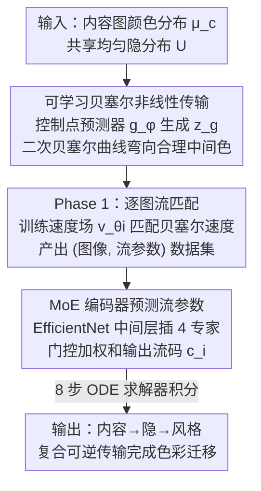

# Nonlinear Color Transfer via Learnable Bezier Flows

**会议**: CVPR 2026  
**论文**: [CVF Open Access](https://openaccess.thecvf.com/content/CVPR2026/html/Lee_Nonlinear_Color_Transfer_via_Learnable_Bezier_Flows_CVPR_2026_paper.html)  
**代码**: 无  
**领域**: 图像生成 / 色彩迁移  
**关键词**: 色彩迁移, 流匹配, 贝塞尔曲线, 最优传输, 混合专家

## 一句话总结
NCT 把基于流的色彩迁移中默认的「直线传输路径」换成可学习控制点的二次贝塞尔曲线，让 RGB 空间里源色到目标色的传输沿着平滑非线性轨迹走，再用 MoE 编码器预测这些贝塞尔流参数，在保持内容结构的同时显著降低伪影、提升重建精度（重建误差 71.9→30.6）。

## 研究背景与动机
**领域现状**：色彩迁移（color transfer）要把内容图（source）的色彩分布对齐到风格图（target）的分布，同时保住场景结构和观感真实——用于影视调色、3D 渲染内容重着色、媒体艺术换季换主题色等。早期统计匹配/直方图均衡（在 LAB/HSV 等手工色空间里对齐全局统计）假设色彩分布近似高斯，容易压扁对比度、过饱和、跨通道串色。近年主流把色彩迁移重述为 RGB 空间的**最优传输（OT）**问题：学一个双射映射，在内容分布和风格分布之间最小化传输代价，不依赖手工先验。ModFlows 在此基础上引入 rectified flow（修正流），用连续可逆的传输近似 OT 映射，并让编码器预测每对图像的流参数，从而泛化到未见过的图像对。

**现有痛点**：rectified flow 的根本约束在于**路径几何是直线**——它强行让传输沿源样本和目标样本之间的线性插值演化。直线只是简化了优化，并不是 OT 的要求：OT 只规定最优的端点映射，并不规定中间轨迹长什么样。近期工作已经指出 rectified flow 真正起作用的是 reflow（配对重训）过程，而非直线轨迹本身。

**核心矛盾**：在 RGB 空间用直线传输去逼近复杂色彩区间会导致「过度抽象」——大量本该有不同目标速度的样本，在直线路径下被挤进相似的中间邻域，造成很高的局部歧义（local ambiguity），重建和信息恢复变得困难，最终表现为伪影、串色、人脸等区域被风格色硬覆盖。

**本文目标**：在保留 OT/flow 框架可逆、可泛化优点的前提下，把传输路径从直线解放成**逐图自适应的非线性曲线**，并让一个编码器能稳定地为未见图像预测这种更复杂的流。

**切入角度**：既然 OT 只约束端点不约束中间路径，那就显式地为每对内容–风格学习一条「弯向合理中间色区」的轨迹。作者用二次贝塞尔曲线参数化这条路径，中间控制点 $z_g$ 由网络预测，让轨迹能朝感知上更连贯的中间色弯曲。

**核心 idea**：用「可学习控制点的贝塞尔曲线传输」代替「直线传输」来解决色彩迁移中的轨迹错位与伪影，并配一个 MoE 编码器来吃下贝塞尔流带来的更高表达复杂度。

## 方法详解

### 整体框架
NCT 把单张图像的颜色分布 $\mu_i$（RGB 上的经验分布）映射到一个共享的隐空间均匀分布 $U\subset[0,1]^3$，然后通过这个共享隐空间做内容→隐空间→风格的复合映射完成迁移：$T_{c\to s}(x)=T_s^{-1}(T_c(x))$。整套训练分两个阶段：**Phase 1** 为数据集里每张图独立学一条贝塞尔流——用控制点预测器 $g_\phi$ 生成中间控制点 $z_g$，得到一条弯曲的传输轨迹，并训练一个逐图速度场 $v_{\theta_i}$ 去匹配贝塞尔曲线诱导的速度，产出一批 (图像, 流参数) 配对数据；**Phase 2** 训练一个带 MoE 的编码器 $\mathrm{Enc}_\psi$，让它直接从图像预测出能复现 Phase 1 贝塞尔流的流码 $c_i$，从而泛化到未见图像。推理时用 8 步 ODE 求解器沿学到的可逆贝塞尔流积分完成色彩迁移。

### 关键设计

**1. 可学习控制点的贝塞尔非线性传输：把直线路径弯成逐图自适应的曲线**

这一设计直接针对「直线传输导致局部歧义和伪影」的痛点。NCT 不再让颜色从输入 $z_0$ 到隐空间 $z_1$ 走直线，而是走一条二次贝塞尔曲线：

$$z_t = (1-t)^2 z_0 + 2t(1-t) z_g + t^2 z_1,\quad t\in[0,1]$$

其中关键的中间控制点 $z_g = g_\phi(z_0,z_1)$ 由一个轻量 MLP（两层、1024 隐单元、tanh、仅 8195 个参数）逐图预测出来，而不是人工设定。对应的贝塞尔诱导速度为：

$$v_t = 2(1-t)(z_g - z_0) + 2t(z_1 - z_g)$$

逐图速度场 $v_{\theta_i}$ 通过最小化 $\int_0^1 \mathbb{E}_{z_0\sim\mu_i, z_1\sim U}\|v_t - v_{\theta_i}(z_t,t)\|_2^2\,dt$ 去拟合这条曲线速度。为什么有效：曲线能朝「合理的中间色区」弯曲，避免直线路径把大量需要不同目标速度的样本挤进相似邻域，从而更好地保留感知一致的色彩过渡；而且控制点是**逐图自适应**的——消融里把它换成手工规则 $z_{\text{fix}}=\tfrac12(z_0+z_1)+\lambda d_\perp$（沿垂线方向偏移固定 $\lambda$）后效果明显变差，说明「让网络学这条弯」才是收益来源。

**2. 两阶段 MoE 编码器：吃下贝塞尔流更高的表达复杂度**

可学习贝塞尔流能实现的非线性色彩轨迹比直线 rectified flow 丰富得多，单个共享编码器去拟合这种多样性会欠拟合。为此 NCT 在编码器中间层插一个混合专家（MoE）模块——选在还保留空间细节和颜色/上下文线索的层。设第 $l$ 层特征图 $f=\mathrm{Enc}^{(l)}_\psi(I)\in\mathbb{R}^{H\times W\times C}$，在其上接 $K$ 个专家 $h_k=E_k(f)$，门控网络由同一特征经全局平均池化产生混合权重：

$$\alpha = \mathrm{softmax}(W_g\,\mathrm{GAP}(f)),\quad y=\sum_{k=1}^K \alpha_k h_k$$

聚合表示 $y$ 再喂给后续层去参数化贝塞尔流（控制点/流系数）。Phase 2 的训练目标是流匹配损失 $\mathcal{L}_{\text{flow}}=\int_0^1\mathbb{E}\|v_{\theta_i}(z_{i,t},t)-v_{c_i}(z_{i,t},t)\|_2^2\,dt$，让编码器预测的流速度对齐 Phase 1 存下的贝塞尔速度。实现上用 EfficientNet-B6 作编码器，把 MoE 嵌进第 4 个 MBBlock 的第 1 个 MBConv 层（该阶段以倒置瓶颈+深度卷积著称，被认为编码感知/风格相关特征），专家数为 4、用加权和门控。为什么放这一层：它能对颜色相关特征做选择性调制，同时保住语义结构，从而在异质色彩区间（不同光照、材质）上稳定学习。

## 实验关键数据

### 主实验
在 ModFlows 数据集（DIV2K + CLIC2020 自然图 + LAION-Art 艺术图共 5034 张训练，Unsplash Lite 采 2000 对测试，8 步 ODE）上对比经典法（CT、MKL）、深度法（WCT2、PhotoNAS、DAST、PhotoWCT2）与流方法 ModFlows。评估用聚合分数（aggregated score，到理想点 $p$ 的平方欧氏距离，联合内容分与风格分：$\text{aggr.}=\sqrt{(p-\text{content})^2+(p-\text{style})^2}$），内容分用 Grayscale/Depth(DepthFM)/Edge(HED) 表示经 DISTS 度量，风格分用 Wasserstein 距离，另报 LPIPS/PSNR/SSIM 与 Lipschitz 常数（越低越平滑稳定）。

| 数据集 | 内容分 Grayscale↓ | 内容分 Depth↓ | 内容分 Edge↓ | LPIPS↓ | PSNR↑ | SSIM↑ | Lipschitz↓ | 风格分↓ |
|--------|------|------|------|------|------|------|------|------|
| ModFlows 基线 [14] | 0.3069 | 0.3175 | 0.3110 | 0.3927 | 12.79 | 0.5073 | 47.84 | 0.2214 |
| CT [5] | 0.3028 | 0.3084 | 0.3067 | 0.3408 | 13.56 | 0.6001 | 33.73 | 0.2365 |
| NCT w/o MoE | 0.3123 | 0.3079 | 0.3047 | **0.2911** | **14.79** | **0.6229** | **34.28** | 0.2507 |
| **NCT (ours)** | **0.3032** | **0.3003** | **0.2954** | 0.3067 | 14.04 | 0.5718 | 36.25 | 0.2371 |

NCT 在内容保持（Depth/Edge 三项最优）和稳定性（Lipschitz 远低于 ModFlows 的 47.84）上领先，虽然风格分略低，但靠强内容表现拿到最高的整体聚合分数。在更难的 Media art 数据集（480 张 3D 渲染裁剪图、高纹理）上也保持最优内容保持与平滑无伪影迁移。

### 消融实验

| 配置 | 关键指标 | 说明 |
|------|---------|------|
| Rectified Flow | 重建误差 71.91 ± 54.87 | 直线轨迹 |
| ModFlows | 重建误差 52.33 ± 38.81 | 直线 + reflow |
| Bezier Flow（固定 λ=0.2） | 重建误差 34.00 ± 25.60 | 曲线但控制点手工 |
| **NCT（可学习控制点）** | **重建误差 30.60 ± 22.62** | 完整模型 |
| NCT w/o MoE | 聚合/风格分均次优 | 去掉 MoE 后风格距离与聚合分变差 |

### 关键发现
- **曲线 vs 直线是收益主因**：非线性方法（Bezier Flow、NCT）重建误差远低于线性方法（Rectified Flow、ModFlows），说明弯曲轨迹在双向传输中更好地保住了色彩结构。
- **控制点必须学**：可学习控制点（30.60）优于固定 $\lambda$ 的贝塞尔（34.00），且 Phase 1 的流匹配损失随训练持续下降，证明它在为每张图找到更合适的中间色路径。
- **MoE 主要提观感偏好**：用户研究中 33 位媒体艺术专家在 30 组对比里 72% 偏好 NCT 优于 ModFlows，其中 MoE 贡献了大头（占总偏好的 46%），说明 MoE 主要改善的是感知连贯性与结构保真度。

## 亮点与洞察
- **「OT 不约束中间轨迹」这个观察用得很巧**：很多流方法默认直线，作者抓住「直线只是优化方便、不是 OT 要求」这一点，把贝塞尔曲线塞进传输路径，是个低成本但切中要害的改动——控制点预测器只有 8195 个参数。
- **把表达复杂度的问题甩给 MoE**：曲线流更复杂→单编码器欠拟合→用 MoE 增表达，这条因果链很清晰，且 MoE 插在「编码颜色/风格特征」的具体层（EfficientNet 第 4 MBBlock）而非随便一层，定位有据。
- **可迁移思路**：「把生成/传输模型里的固定直线插值换成可学习曲线插值」可以迁移到扩散/流匹配的其他任务（如图像编辑、风格化），凡是 reflow 类直线假设造成歧义的地方都值得一试。

## 局限与展望
- **风格分偏弱**：NCT 的 Wasserstein 风格分常略低于一些基线，是靠内容分强才拿下整体最优——在「就是要强烈换色」的场景下未必占优。
- **只做静态图**：作者承认未扩展到视频，跨帧时间一致性是明确的未来工作。
- **二次贝塞尔表达有限**：只用了带单个中间控制点的二次曲线，更复杂的多模态色彩分布可能需要更高阶曲线或分段曲线，论文未探讨。
- **评测多为感知/用户研究**：聚合分数与用户偏好主导，缺少对失败案例（极端光照、强材质反射）的系统分析。

## 相关工作与启发
- **vs ModFlows [14]**：两者都用流近似 OT、编码器预测逐图流参数，区别在 ModFlows 用 rectified flow 的直线路径，NCT 换成可学习控制点的贝塞尔曲线并加 MoE；NCT 优势是重建误差更低（30.6 vs 52.3）、伪影更少，劣势是风格距离有时略逊。
- **vs 经典 CT/MKL [5,21]**：经典法在感知均匀色空间做低阶统计匹配，全局调性对齐但丢局部语义/纹理；NCT 在 RGB 空间学非线性传输，内容保持显著更好。
- **vs WCT2/PhotoWCT2/DAST [22,25,24]**：这些深度法做多尺度特征对齐，但易串色、需配对数据；NCT 走 OT/flow 路线，泛化到未见图像对且无需配对监督。

## 评分
- 新颖性: ⭐⭐⭐⭐ 「OT 不限制中间轨迹→用可学习贝塞尔曲线替直线」的切入点干净且切中 rectified flow 的真实弱点。
- 实验充分度: ⭐⭐⭐⭐ 两数据集 + 重建误差 + MoE 消融 + 33 人用户研究，较完整；但缺失败案例分析、风格弱的场景未深究。
- 写作质量: ⭐⭐⭐ 动机和公式清晰，但原文 OCR 公式较乱、个别表述粗糙。
- 价值: ⭐⭐⭐⭐ 对流/扩散类传输模型「直线插值假设」给出一个低成本可学习曲线的实用替代，思路可迁移。

<!-- RELATED:START -->

## 相关论文

- [\[CVPR 2026\] GenColorBench: A Color Evaluation Benchmark for Text-to-Image Generation](gencolorbench_a_color_evaluation_benchmark_for_text-to-image_generation.md)
- [\[CVPR 2026\] Leveraging Multispectral Sensors for Color Correction in Mobile Cameras](leveraging_multispectral_sensors_for_color_correction_in_mobile_cameras.md)
- [\[CVPR 2026\] LESA: Learnable Stage-Aware Predictors for Diffusion Model Acceleration](lesa_learnable_stage-aware_predictors_for_diffusion_model_acceleration.md)
- [\[CVPR 2026\] RegionRoute: Regional Style Transfer with Diffusion Model](regionroute_regional_style_transfer_with_diffusion_model.md)
- [\[CVPR 2026\] Too Vivid to Be Real? Benchmarking and Calibrating Generative Color Fidelity](too_vivid_to_be_real_benchmarking_and_calibrating_generative_color_fidelity.md)

<!-- RELATED:END -->
