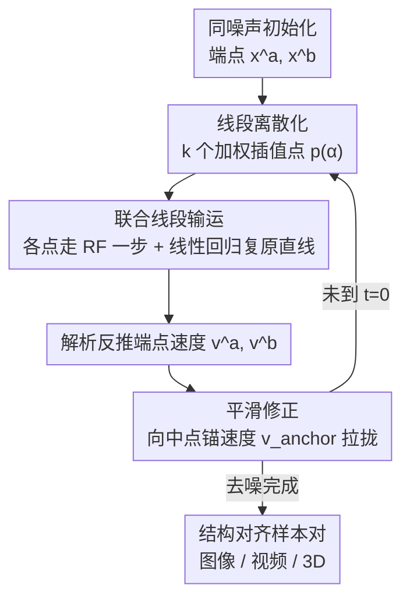

# One Algorithm to Align Them All

**会议**: CVPR 2026  
**论文**: [CVF Open Access](https://openaccess.thecvf.com/content/CVPR2026/html/Pang_One_Algorithm_to_Align_Them_All_CVPR_2026_paper.html)  
**代码**: [voyleg.github.io/atata](https://voyleg.github.io/atata/)（项目页）  
**领域**: 图像生成 / 扩散与流模型  
**关键词**: 结构对齐生成, Rectified Flow, 联合推理, 线段输运, 跨模态生成

## 一句话总结
提出一个只改采样循环、不改任何模型权重的通用算法，让任意在结构化隐空间上工作的 Rectified Flow 模型都能"成对联合生成"两个结构对齐的样本（同一姿态的不同物体），并在图像、视频、3D 三个模态上同时奏效，比基于 SDS 的 A3D 快一个数量级。

## 研究背景与动机

**领域现状**：很多应用需要"成对/成组且结构对齐"的生成结果——同一只动物和它的骨架、同一座建筑的哥特版和印度版、视频里同一动作下不同主体。这种"结构对齐生成"（structurally aligned generation）要求两个样本主体不同，但语义对应的部位在空间/时间维度上严格对齐，可用于虚拟世界搭建、CAD 可替换零件、matchcut 转场、以及为训练编辑模型造配对合成数据。

**现有痛点**：当前做法分三类，各有硬伤。① **编辑式**（RF-Inversion、VACE、Qwen-Image-Edit）：先按第一个 prompt 生成一个样本，再强迫第二个样本套用它的结构——这会让生成偏向"更贴合其中一个描述"，另一个被牺牲。② **大模型零样本**（Nanobanana、FLUX、Qwen）：能拼出半一致的网格图，但对齐不可控。③ **原生联合生成**：MatchDiffusion 在某个时间步之前合并两条轨迹、之后分叉，作者实测发现这种"硬切"不足以保证可靠的结构对齐；A3D 用 Score Distillation Sampling 把多个生成约束到平滑过渡上，但 SDS 慢、易模式坍塌、结果偏卡通。

**核心矛盾**：要"对齐"就得让两个样本的生成过程互相牵制，但现有牵制手段要么破坏单样本的真实性/多样性（SDS），要么牵制得太粗糙（硬切轨迹）。问题根本在于：没有人从"**两个样本之间的过渡轨迹应该长什么样**"这个结构视角去设计联合推理。

**切入角度**：作者沿用 A3D 的洞察——好的对齐等价于两个要求：(1) 两样本之间的过渡（线性插值得到的中间样本）应当是**真实可信**的；(2) 过渡应当**平滑**（Lipschitz 有界）。但 A3D 用 SDS 优化去满足它，太慢。作者改问：能不能**不优化、直接在 Rectified Flow 的推理循环里**满足这两个要求？

**核心 idea**：把"联合生成一对样本"重新表述为"**在隐空间里联合输运一整条线段**"——线段两端是两个样本 $x^a,x^b$，中间是它们的线性插值。每步推理时让整条线段沿流模型的速度场前进，并强制保持其线性结构、再加一个平滑修正，即可让两端样本结构对齐。整个改动只发生在 inference loop，与模态无关。

## 方法详解

### 整体框架
方法建立在 Rectified Flow 之上。普通 RF 推理是把一个噪声样本 $x$ 沿网络预测的速度场 $v_\Theta(x_t,t,c)$ 逐步去噪。本文要同时生成一对样本 $a,b$（文本条件 $c^a,c^b$），并让它们结构对齐。做法是：把两端样本 $x^a,x^b$ 用**同一个噪声**初始化，然后不是各自独立去噪，而是把"端点 + 中间插值点"组成的整条线段当成一个对象一起输运。每一步分两动作：先让线段上的采样点各自走一步普通 RF 更新，再用线性回归把走偏的点拉回一条直线（保持线性结构），从而解析地反推出两个端点的"联合输运速度"；之后再叠一个平滑修正，把两端速度往"线段中点的预测速度"这个锚拉拢，避免线段范数早期暴涨导致错位。整套流程不碰模型权重，只换推理循环，因此同一算法能直接套到图像（FLUX）、3D（Trellis）、视频（WAN）三种结构化隐空间模型上。

### 关键设计

**1. 线段联合输运：把"生成一对样本"变成"输运一条概率分布线段"**

痛点是独立去噪的两个样本毫无结构关联，而硬切轨迹又太粗。作者的做法是把注意力从"两个端点"上移到"端点之间的整条线段" $[x^a,x^b]=\{(1-\alpha)x^a+\alpha x^b\mid\alpha\in[0,1]\}$，并赋予一个密度 $p(\alpha)$，等价于在输运一个分布而非两个点。实现上用 $k$ 个均匀分布的加权采样点 $x_{t,i}=(1-\alpha_i)x^a_t+\alpha_i x^b_t$、权重 $p(\alpha_i)$ 来表示这条线段。每一步先让每个点用插值后的文本条件 $c_i=(1-\alpha_i)c^a+\alpha_i c^b$ 各自走一步标准 RF 更新得到 $\hat{x}_{t_2,i}=x_{t_1,i}+(t_2-t_1)v_\Theta(x_{t_1,i},t_1,c_i)$。关键问题是：原本共线的点走完一步后不再共线，线段结构被破坏。

为此作者**强制复原线性结构**——解一个加权线性回归，求新端点 $x^a_{t_2},x^b_{t_2}$ 使得重建的共线点 $x_{t_2,i}=(1-\alpha_i)x^a_{t_2}+\alpha_i x^b_{t_2}$ 尽量贴近各点单独更新后的位置：

$$\mathcal{L}(x^a_{t_2},x^b_{t_2})=\sum_{i=1}^{k}p(\alpha_i)\,\lVert x_{t_2,i}-\hat{x}_{t_2,i}\rVert_2$$

这个回归有**闭式解**（论文给出 $x^a_{t_2},x^b_{t_2}$ 关于权重统计量 $c_{00},c_{01},c_{11},d_0,d_1$ 的解析表达式），因此不需要任何梯度优化，速度快得多——这正是它比 A3D 的 SDS 快一个数量级的根源。解出新端点后，端点速度直接由 $v^a_{t_1}=\frac{x^a_{t_2}-x^a_{t_1}}{t_2-t_1}$、$v^b_{t_1}=\frac{x^b_{t_2}-x^b_{t_1}}{t_2-t_1}$ 给出。实践中作者发现：早期迭代让 $p(\alpha)$ 集中在中点附近、再逐步过渡到均匀分布，效果最好。

**2. 平滑性正则：约束"线段范数增长速度"换取过渡平滑**

第二个要求是过渡要平滑。作者观察到：对线性线段，过渡"速度"与位置无关，恒等于 $\frac{dx_t}{d\alpha}=x^b_t-x^a_t$，所以**正则化过渡速度 = 正则化线段范数** $\lVert x^b_t-x^a_t\rVert_2$。由于两端用同噪声初始化，线段范数从 0 出发、随时间发散成两个不同但对齐的样本。范数对时间的导数为

$$\frac{d\lVert x^b(t)-x^a(t)\rVert_2}{dt}=\frac{\langle v^b(t)-v^a(t),\,x^b(t)-x^a(t)\rangle}{\lVert x^b(t)-x^a(t)\rVert_2}$$

作者发现严重错位往往伴随**早期迭代线段范数暴涨**，而该导数取决于两端速度之差 $v^b-v^a$。因此抑制错位 = 让两端速度彼此靠近。

**3. 中点锚速度：让两端速度往"线段中点的真实去噪方向"收敛**

承接上一点，怎么让 $v^a,v^b$ 靠近又不破坏去噪？作者用一个锚速度 $v^{anchor}_t$ 做凸组合修正：$\hat{v}^a_t=w_t v^{anchor}_t+(1-w_t)v^a_t$，$\hat{v}^b_t$ 同理。锚速度的选择很关键——它必须对线段上所有点都指向"去噪"方向，否则会破坏样本的噪声调度。一个朴素选择是两端速度均值 $\frac{v^a_t+v^b_t}{2}$，但实验显示它次优，因为两端速度方向常常冲突。作者的最终方案是把**线段中点直接喂回流模型**预测速度作为锚：

$$v^{anchor}_t=v_\Theta\!\left(\frac{x^a_t+x^b_t}{2},\,t,\,\frac{c^a+c^b}{2}\right)$$

这个选择与设计 1 天然耦合：正确推理下 $\frac{x^a_t+x^b_t}{2}$ 本身就应是该时间步噪声分布里的一个可信样本，所以用它的预测速度当锚等于给"线段输运速度场"打了一个自洽的修正。权重 $w_t$ 取早期偏强的温和调度，既压住早期范数暴涨，又不让最终样本相比基础 RF 退化。

### 一个完整示例
以"狗→机器人"配对为例：两个隐变量 $x^a,x^b$ 用同一份高斯噪声初始化，线段范数为 0。第一步把线段离散成 $k$ 个加权点（早期权重压在中点），每点用插值文本"半狗半机器人"各走一步 RF；这些点走偏后用闭式线性回归拉回直线，反解出新的狗端点和机器人端点速度；再把两端速度往"中点喂回 FLUX 得到的锚速度"拉一点。随着去噪推进，线段范数从 0 缓慢、平滑地增长，两端逐渐分化成一只狗和一个机器人——但它们的姿态、四肢朝向、轮廓骨架保持对齐。把混合系数 $\alpha$ 从 0 扫到 1，还能得到一串平滑过渡的中间帧（论文 Figure 3 的 blending 可视化）。

## 实验关键数据

三个模态各换一个 SOTA 的结构化隐空间 RF 模型：图像用 FLUX.1-dev、3D 用 Trellis/Trellis.2、视频用 WAN 2.1，仅改推理循环。评测同时看**结构对齐**（DIFT Score、深度图 MAE/Depth Structural Score、视频帧间 DINO 相似度）和**文本一致性/质量**（CLIP Score、MLLM/VLM Score、3D 用 GPTEval）。对手分两类：联合生成（A3D、MatchDiffusion）与编辑式（RF-Inversion、VACE、Qwen-Image-Edit、MVEdit、LucyEdit、LucidDreamer）。

### 主实验

| 模态 | 关键对手 | 本文表现 |
|------|---------|---------|
| 图像 (FLUX) | RF-Inversion / Qwen-Image-Edit | 结构对齐指标显著超 RF-Inversion；Qwen 虽更懂指令但对齐分大幅落后，不适合该问题 |
| 3D (Trellis/Trellis.2) | A3D / MVEdit / LucidDreamer | text-to-3D 的 CLIP 分最佳；Trellis.2 版结构对齐最强、GPTEval 稳超对手；比 A3D 快一个数量级、远快于 MVEdit |
| 视频 (WAN 2.1) | VACE / LucyEdit / MatchDiffusion | DINO 自一致性最高；MatchDiffusion 深度对齐落后、前景边界误差明显（姿态错位） |

> 注：Trellis.1 版 DIFT 略逊于"异常强"的 A3D 和 MVEdit，作者归因于骨干模型泛化能力受限；换到 Trellis.2 后对齐最强。LucyEdit 的深度 MAE 形式上更低，但那是因为它**根本没做出必要的编辑**（输入几乎原样保留），其极低的 VLM 分暴露了这一点——结构对齐分不能脱离文本一致性单看。

### 消融实验
通过逐步移除组件，方法最终退化为 MatchDiffusion，构成一串受控对比（A→D）：

| 配置 | 改动 | 含义 |
|------|------|------|
| A (Full) | 完整方法 | 中点锚 + 线段中间点 + 平滑调度 |
| B | 锚速度由 $v_\Theta(\text{中点})$ 换成两端均值 $\frac{v^a+v^b}{2}$ | 验证中点锚的价值 |
| C | 进一步去掉中间点 $x_{t,i}$ 采样 | 不再强制过渡可信，丢掉方法核心 |
| D | 平滑调度改成硬切阈值 | 退化≈ MatchDiffusion 基线 |

视频模态用深度 MAE 评 B、C，图像模态用 DIFT 距离评 D（因 D≈已在正文报告过的 MatchDiffusion）。定量+定性（Figure 6）均显示**逐步移除组件结果逐步退化**。

### 关键发现
- **线段中间点（设计 1）是核心**：去掉后（C）方法不再保证过渡真实可信，掉点明显——这是"对齐"的来源。
- **中点锚优于均值锚**：两端速度方向常冲突，用 $\frac{v^a+v^b}{2}$ 当锚次优；喂回中点让流模型自己预测锚速度更自洽。
- **速度是大卖点**：相比 SDS 式 A3D 提速约一个数量级，因为闭式线性回归替代了梯度优化。
- 视频上优势最大，能对齐复杂动态场景；3D 上"质量持平、速度碾压"。

## 亮点与洞察
- **把"成对生成"重述为"输运一条线段"**：从输运两个点升级到输运一个分布，既给出了结构对齐的几何刻画，又让线性回归闭式解成为可能——优雅地把昂贵的 SDS 优化换成了一步代数。
- **改动极小、模态无关**：只动 inference loop、不碰权重，同一算法直接套图像/视频/3D 三种 RF 模型，是真正"one algorithm to align them all"。这种"插件式推理修改"思路可迁移到任何结构化隐空间的流模型。
- **中点锚的自洽性**：锚速度不是外加约束，而是"中点本应是可信样本"这一性质的自然推论，把平滑修正和联合输运在数学上缝在一起，避免了破坏噪声调度。

## 局限与展望
- **依赖骨干泛化能力**：Trellis.1 版对齐落后于 A3D/MVEdit，作者明说是骨干模型泛化受限——方法上限被所选 RF 模型卡住。
- **仅限结构化隐空间 + Rectified Flow**：对非结构化隐空间或非 RF（如纯 DDPM）模型不直接适用。
- **只做"成对"**：理论虽提到分布输运，但实验都是两端样本对，扩展到三个及以上对齐样本未验证。
- **评测含大量 VLM/GPT 类指标**（MLLM、VLMScore、GPTEval、GPT-5 改写 prompt），可复现性与稳定性存疑；部分表（Table 1–6）正文只给定性结论、数值需查原文。
- 作者展望：可推广到 4D 视频、关键点运动等更多模态。

## 相关工作与启发
- **vs A3D**：A3D 也追求样本间平滑过渡，但用 SDS 迭代优化——慢、易模式坍塌、偏卡通。本文是**纯推理式**：闭式线段输运替代梯度优化，快一个数量级、无伪影、样本更多样。
- **vs MatchDiffusion**：MatchDiffusion 在某阈值前合并两条扩散轨迹、之后分叉（硬切）。本文显式优化"线性过渡的可信度+平滑度"，对齐显著更好；消融里把本文退化到硬切就还原成了 MatchDiffusion。
- **vs 编辑式方法（RF-Inversion / VACE / Qwen-Image-Edit / MVEdit / LucyEdit）**：它们先生成一个再编辑出另一个，结构对齐天生偏向源样本、且常出现"要么改不动要么改乱"的两极。本文对称地联合生成两端，不偏袒任何一个 prompt。

## 评分
- 新颖性: ⭐⭐⭐⭐⭐ 把成对对齐生成重述为"隐空间线段输运 + 闭式线性回归"，视角和手段都很新
- 实验充分度: ⭐⭐⭐⭐ 三模态多对手覆盖广、消融设计巧妙（逐步退化到 MatchDiffusion），但重度依赖 VLM/GPT 指标、部分数值未在文本给全
- 写作质量: ⭐⭐⭐⭐ 动机清晰、公式推导完整；表格只给定性结论略影响速读
- 价值: ⭐⭐⭐⭐⭐ 插件式、模态无关、提速一个数量级，对配对合成数据生成等下游很实用

<!-- RELATED:START -->

## 相关论文

- [\[CVPR 2026\] All-in-One Slider for Attribute Manipulation in Diffusion Models](all_in_one_slider_attribute_manipulation.md)
- [\[ICLR 2026\] When One Modality Rules Them All: Backdoor Modality Collapse in Multimodal Diffusion Models](../../ICLR2026/image_generation/when_one_modality_rules_them_all_backdoor_modality_collapse_in_multimodal_diffus.md)
- [\[CVPR 2026\] Align Images Before You Generate](align_images_before_you_generate.md)
- [\[CVPR 2026\] Re-Align: Structured Reasoning-guided Alignment for In-Context Image Generation and Editing](re-align_structured_reasoning-guided_alignment_for_in-context_image_generation_a.md)
- [\[CVPR 2026\] Low-Resolution Editing is All You Need for High-Resolution Editing](low-resolution_editing_is_all_you_need_for_high-resolution_editing.md)

<!-- RELATED:END -->
