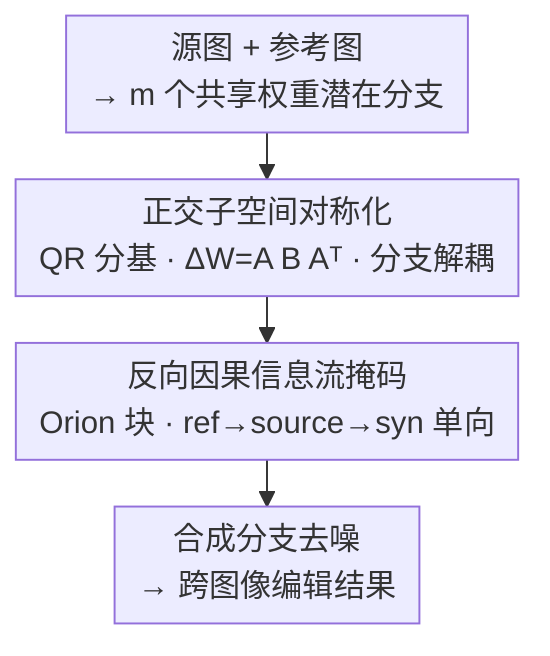

# OrionEdit: Bridging Reference and Source Images for Generalized Cross-Image Editing

**会议**: CVPR 2026  
**论文**: [CVF Open Access](https://openaccess.thecvf.com/content/CVPR2026/html/Jiang_OrionEdit_Bridging_Reference_and_Source_Images_for_Generalized_Cross-Image_Editing_CVPR_2026_paper.html)  
**代码**: https://github.com/cityuhkai/OrionEdit  
**领域**: 图像生成 / 扩散模型 / 跨图像编辑  
**关键词**: 跨图像编辑, 正交子空间解耦, 反向因果注意力, 多参考图编辑, 零样本

## 一句话总结
OrionEdit 把"用一张图编辑另一张图"统一成**跨图像编辑（Cross-Image Editing）**范式——给定一张源图和一张或多张参考图，把参考的视觉属性（身份、纹理、风格）有选择地迁移到源图上，同时保住源图的结构与构图；它用**对称正交子空间解耦**让不同分支（源/参考/合成）各占互不干扰的低秩"房间"，再用**反向因果信息流掩码**强制信息只能沿 参考→源→合成 单向流动，从而在标准扩散骨干上实现零样本多参考编辑，开源指标接近 GPT-4o 这类闭源模型。

## 研究背景与动机

**领域现状**：图像合成这两年在文生图（T2I）和文本引导编辑（TI2I）上进步很快，但绝大多数编辑方法仍然靠**文字指令**驱动。要把"换成那件衣服的质感""对齐成这种画风"用语言精确描述出来，往往比直接拿一张参考图给模型看要费劲得多。于是"用一张图来编辑另一张图"——以视觉范例（exemplar）作引导——成为一个更直观的新范式。

**现有痛点**：早期的参考引导生成/编辑大多局限在**单图设定**，只能用文字或空间 mask 在一张输入图上操作，信息天然受限于这一张图。后来出现的多参考生成/编辑虽然能对齐多张参考图的外观，但它们做的是把多张参考特征**自由融合**进一张输出，并没有显式解决"从参考图向源图**有选择地迁移**属性"这件事。结果就是这条线的研究**碎成一地**：局部外观迁移、主体替换、风格对齐各做各的，缺一个统一框架。

**核心矛盾**：跨图像编辑比多图生成更难，因为不同输入强调的是**不同的语义/属性**——源图要保结构、参考图只贡献被迁移的属性、合成分支负责生成。如果像多图生成那样让所有分支在注意力里**均等贡献**，分支之间会互相串扰：源图结构被破坏、参考属性彼此污染（cross-concept interference）。所以需要一个机制既能**区分分支的功能角色**，又能**控制信息流的方向**。

**本文目标**：把分散的子任务（主体替换、参考引导风格化、多主体组合等）收进一个统一的"一源多参考（one source, multiple references）"框架，做到稳定、可控、零样本的属性迁移。

**切入角度**：作者从两个观察出发——(1) 正交性是机器学习里促进特征解耦的老办法，把不同分支的增量更新约束到**互相正交的子空间**，就能让它们各管各的高层语义、互不干扰；(2) 跨图像编辑本质上有一条天然的依赖链（参考提供属性 → 源提供结构 → 合成产出），可以用注意力 mask 把这条链**单向锁死**。

**核心 idea**：用"对称正交子空间解耦 + 反向因果信息流掩码"两件套，把多分支扩散编辑里的**串扰**问题，拆成"谁占哪块子空间"和"信息往哪个方向流"两个可控的旋钮。

## 方法详解

### 整体框架

OrionEdit 建立在标准扩散编辑骨干（Qwen-Image-Edit-2509、Flux-Kontext）之上。输入是一张源图 $z_{\text{src}}$ 和一张或多张参考图 $z_{\text{ref}}^{(1)},\dots,z_{\text{ref}}^{(m-2)}$，外加一个用于去噪生成的合成分支 $z_{\text{syn}}$；目标是

$$z_{\text{syn}} = \mathcal{F}\!\left(z_{\text{src}}, \{z_{\text{ref}}^{(i)}\}_{i=1}^{m-2}\right),$$

即在参考图的视觉引导下编辑源图。这些视觉输入在特征空间里天然形成 $m$ 个共享权重 $W\in\mathbb{R}^{d\times k}$ 的**潜在分支**。理想情况下各分支均等参与注意力即可融合，但跨图像编辑要求它们**功能分化**。OrionEdit 的整条 pipeline 就两步关键改造：先给每个分支分配一块**互相正交的低秩子空间**做解耦更新，再把所有分支 token 拼在一起送进 **Orion Transformer 块**，用一个**反向因果（上三角）注意力掩码**强制信息单向流动，最后由合成分支去噪得到编辑结果。

### 关键设计

**1. 正交子空间对称化：给每个分支分配互不干扰的"房间"**

这一设计针对的是"多分支共享权重时彼此串扰、梯度互相干扰"的痛点。作者把原本用于多概念定制的正交机制，从"针对具体概念调权重"升级成"针对具体分支学子空间"的**任务无关**框架，从而支持零样本。具体做法：先采样一个高斯矩阵 $M\in\mathbb{R}^{d\times mr},\ M\sim\mathcal{N}(0,1)$，对它做 QR 分解 $M=QR$，得到一组互相正交的基 $Q=\{A^{(1)},\dots,A^{(m)}\}$，满足

$$(A^{(i)})^\top A^{(j)} = 0,\quad \forall\, i\neq j.$$

然后给每个分支 $z^{(i)}$ 分配一对 $A^{(i)}$ 与其转置 $(A^{(i)})^\top$，再配一个**零初始化**的低秩矩阵 $B^{(i)}\in\mathbb{R}^{r\times r}$。该分支的增量权重更新写成一个**对称映射**：

$$\Delta W^{(i)} = A^{(i)} B^{(i)} (A^{(i)})^\top,\quad A^{(i)}\in\mathbb{R}^{d\times r},\ B^{(i)}\in\mathbb{R}^{r\times r}.$$

其中 $A^{(i)}$ 和 $(A^{(i)})^\top$ 分别是把特征投到低维、再重建回原空间的投影/重建矩阵，**全程冻结、不训练**；真正可训练的只有中间那块 $B^{(i)}$。作者用一个很形象的比喻：$A^{(i)},(A^{(i)})^\top$ 是每个分支独有的一把**锁**，决定能不能进入对应的**房间** $B^{(i)}$；每个分支在自己房间里捕获本分支的增量 $\Delta W^{(i)}$，而共享权重 $W$ 是大家共用的公共空间，负责纹理、构图、结构这类低层信息的跨分支交互。

为什么这样有效：因为正交性能在理论上保证不同分支的更新**两两正交**。对任意两个子空间增量 $\Delta W_u,\Delta W_v$ 取 Frobenius 内积，展开后落到 $A_u^\top A_v$ 这一项，而式 (2) 已经保证 $A_u^\top A_v=0$，于是

$$\langle \Delta W_u, \Delta W_v\rangle_F = \mathrm{Tr}\!\left(A_u B_u^\top (A_u^\top A_v) B_v A_v^\top\right) = 0.$$

这意味着 $z_{\text{syn}}$、$z_{\text{src}}$、$z_{\text{ref}}$ 各分支的高层编辑语义被**独立处理**、互不干扰，从根上缓解了跨分支的梯度干扰和概念污染；而共享权重 $W$ 则继续承担低层信息的协同。消融里这一约束单独就把 DPG 拉高 +22.54、Aesthetic +0.58，是涨点主力之一。

**2. 反向因果信息流掩码：让信息只能沿 参考→源→合成 单向流动**

光解耦分支还不够——跨图像编辑还要**控制信息流的方向**，确保参考和源的属性以"无污染、有秩序"的方式汇入合成流。如果用标准自注意力，所有 token 双向互相看，源图结构容易被合成分支反向写脏、参考之间也会互相串。为此 OrionEdit 把所有分支 token 拼接后送进 Orion 块，施加一个**严格上块三角**的反向因果掩码（reverse-causal mask）。作者把分支分成三组并排序：$\mathcal{G}_1=\{\text{text \& syn}\}$、$\mathcal{G}_2=\{\text{source}\}$、$\mathcal{G}_{3:m}=\{\text{reference}^{(1:m-2)}\}$，掩码定义为

$$\mathcal{M}(p,q)=\begin{cases}-\infty, & g(q)<g(p),\\ 0, & \text{otherwise},\end{cases}$$

其中 $g(\cdot)$ 是组索引。它允许**靠前组的 query 只能注意到同组或更靠后组的 key**，形成依赖链 $\mathcal{G}_1\!\to\!\mathcal{G}_2\!\to\!\mathcal{G}_{3:m}$，对应的**信息流方向正好相反**：reference → source → synthesis。落到 token 行为上就是：合成 token 可以**读取**（但不能回写）源和参考；源 token 可以读参考，但读不到合成与文本；每个参考分支对其他分支保持**只读**。

实现上还有个分层细节：在浅层 Transformer 用**完全硬阻断**的信息流 mask，在深层改用一个软约束 soft-beta（默认 6）来调节注意力计算——浅层先把方向规矩立住，深层再放松一点保留表达力。为什么这样有效：消融显示，把 mask 换成**随机**版本反而全面掉点（DPG −4.44、DINO −0.045），说明乱加约束有害；而反向因果版本带来 +18.93 DPG、+0.63 Aesthetic 的显著提升。注意力可视化（Fig. 7/8）也佐证了这点：随扩散推进，合成分支会聚焦在源图的**未编辑区域**、同时只对参考图里**可替换/可迁移的区域**分配注意力，方向性明显，结构完整性得以保住。

### 损失函数 / 训练策略

模型在 8 张 A100（80GB）上训练 2 个 epoch，梯度累积 4 步、每卡 batch 4、总 batch 128。Orion Transformer 含两部分：标准 LoRA 块（rank 256）+ Orion 块（式 (3) 里的 $B\in\mathbb{R}^{r\times r}$ 取 rank 256）。采用**单阶段**训练，联合优化单主体与多主体的生成/编辑任务。训练数据是自建的 50K "参考–源–合成"三元组（来自部分公开数据 + Nano-banana/GPT-4o 合成对），并额外掺入 ShareGPT-4o-Image（100K 单图对）以保住单图生成能力。

## 实验关键数据

### 主实验

评测在自建基准 **OrionEditBench** 上进行，覆盖三大任务族：跨图像属性迁移、风格对齐、融合。指标包括 Aesthetic（APv2.5 美学）、DPG（语义/指令一致性）、DINOv3（结构/主体自相似）、SigLip-I（图–图对齐）、CLIP-T（图–文对齐），以及 Content-Pre = 0.5×(DINO+CLIP) 与 Style-Pre（CSD-score）。下表为三任务**平均**结果（节选代表性模型）：

| 模型 | Aesthetic↑ | DPG↑ | DINOv3↑ | SigLip-I↑ | CLIP-T↑ |
|------|-----------|------|---------|-----------|---------|
| UNO | 4.83 | 39.58 | 0.596 | 0.590 | 0.199 |
| OmniGen2 | 5.59 | 59.73 | 0.770 | 0.712 | 0.216 |
| Qwen-Image-Edit（基线骨干） | 5.39 | 66.08 | 0.746 | 0.699 | **0.294** |
| DreamOmni2 | 5.79 | 78.61 | 0.782 | 0.723 | 0.277 |
| GPT-4o（闭源） | 5.95 | 87.32 | 0.773 | 0.752 | 0.274 |
| **OrionEdit-qwen** | **5.97** | 87.02 | **0.775** | **0.757** | 0.293 |
| OrionEdit-flux | 5.85 | 81.27 | 0.756 | 0.732 | 0.282 |

OrionEdit-qwen 在 Aesthetic（5.97）、DINOv3（0.775）、SigLip-I（0.757）上拿到平均最优，DPG（87.02）几乎追平 GPT-4o（87.32），整体显著超过同骨干基线 Qwen-Image-Edit（如 DPG 66.08→87.02），验证"在开源骨干上接近闭源模型"的说法。分任务看，属性迁移子任务里 OrionEdit-qwen 的 SigLip-I=0.791、CLIP-T=0.285 居前列；融合任务里 DPG=90.60、SigLip-I=0.791 与 SOTA 持平。质性对比（Fig. 5 主体替换）显示 OrionEdit 在身份保持和结构一致上更稳，而 Qwen-Edit 常出现特征纠缠/身份泄漏、GPT-4o 虽然真实感强但容易改动空间构图。

### 消融实验

下表逐一拆解两大组件与秩的贡献（基于 OrionEdit-qwen，$\Delta$ 相对 Baseline）：

| 配置 | 正交约束 $\Delta W_u^\top\Delta W_v=0$ | Attn Mask | rank(B) | Aesthetic | DPG | DINO |
|------|:---:|:---:|:---:|------|------|------|
| Baseline | ✗ | ✗ | – | 5.14 | 53.81 | 0.738 |
| + 正交约束 | ✓ | ✗ | 128 | 5.72 (+0.58) | 76.35 (+22.54) | 0.752 (+0.014) |
| + 随机 mask | ✗ | ✓(random) | – | 5.27 (+0.13) | 49.37 (−4.44) | 0.693 (−0.045) |
| + 反向因果 mask | ✗ | ✓(rev.-causal) | – | 5.77 (+0.63) | 72.74 (+18.93) | 0.768 (+0.030) |
| Full（rank 128） | ✓ | ✓(rev.-causal) | 128 | 5.95 (+0.81) | 83.83 (+30.02) | 0.775 (+0.037) |
| Full（rank 256） | ✓ | ✓(rev.-causal) | 256 | **6.00 (+0.86)** | **85.24 (+31.43)** | **0.781 (+0.043)** |

### 关键发现

- **两大组件各自有效、且叠加增益**：单加正交约束 DPG +22.54、单加反向因果 mask DPG +18.93，二者合起来（Full rank256）把 DPG 拉到 85.24（+31.43），说明"解耦分支"和"控制流向"解决的是两个正交的问题。
- **mask 的方向性是关键、不是有 mask 就行**：随机 mask 反而全面掉点（DPG −4.44、DINO −0.045），只有**反向因果**这种符合"参考→源→合成"逻辑的方向约束才涨点——这正是论文的核心论点。
- **更高的秩带来稳定增益**：rank(B) 从 128 提到 256，三项指标都微涨（Aesthetic 5.95→6.00、DPG 83.83→85.24、DINO 0.775→0.781），最终默认用 256。
- **结构保持靠注意力分布实现**：可视化显示随扩散推进，合成分支聚焦源图未编辑区、只对参考图可迁移区分配注意力，从机制上解释了为什么 DINO（结构自相似）能涨。

## 亮点与洞察

- **把"多分支串扰"拆成两个正交旋钮**：一个管"谁占哪块子空间"（正交解耦），一个管"信息往哪流"（反向因果 mask）。这种把纠缠问题分解成两个独立可控维度的思路很干净，消融也证明二者贡献几乎不重叠。
- **对称正交低秩更新 $\Delta W=A B A^\top$ 的设计很巧**：冻结正交基、只训中间小矩阵 $B$，既保证了分支间 Frobenius 正交（有理论证明），又把可训练参数压到极小，天然适配零样本/任务无关的多参考设定，可迁移到任何需要"多路输入互不干扰"的 LoRA-style 微调场景。
- **"锁与房间"的比喻**让一个抽象的子空间机制变得直观：每个分支有独一无二的锁（$A^{(i)}$）才能进自己的房间（$B^{(i)}$），共享权重 $W$ 是公共空间——这个心智模型对理解"解耦"非常有帮助。
- **统一范式 + 配套 benchmark**：把零散的主体替换/风格对齐/多主体组合收进"一源多参考"统一表述，并建了 OrionEditBench 三任务评测，对后续跨图像编辑研究是可复用的基础设施。

## 局限与展望

- **依赖合成数据构建三元组**：50K "参考–源–合成"三元组里有相当一部分来自 Nano-banana/GPT-4o 合成，合成对的质量与分布偏差可能影响真实场景泛化（论文未量化这部分影响，⚠️ 以原文为准）。
- **评测仍以自建 benchmark 为主**：OrionEditBench 是作者自建，跨工作横向比较时需注意基准/指标的自洽性；且部分对比模型为闭源（GPT-4o），复现条件不完全可控。
- **分层 mask 的软约束是经验设定**：浅层硬阻断、深层 soft-beta=6 是默认超参，论文未充分给出对 soft-beta 取值与"硬/软分层位置"的敏感性分析。
- **改进方向**：可探索把正交子空间机制扩展到视频/3D 跨域编辑；或让信息流方向**可学习**而非固定上三角，以适配更复杂的多参考依赖关系。

## 相关工作与启发

- **vs 多图生成（UNO / OmniGen2 / Xverse）**：它们让多个参考分支在共享权重注意力里**均等贡献**、自由融合特征，适合"凭空合成一张新图"；OrionEdit 强调**有方向的属性迁移**（参考→源→合成）+ 结构保持，因此在 DINO/结构一致性上更稳，本质区别是"融合" vs "条件迁移"。
- **vs 文本引导编辑 / 范例编辑（Paint-by-Example / Cross-Image Attention / MimicBrush）**：早期工作多局限单图、或针对单一子任务（局部外观迁移、主体替换、风格对齐各做各的）；OrionEdit 用一个框架统一了这三族任务，且无需 per-concept 调权重即可零样本。
- **vs 正交性 / LoRA 类方法**：正交约束此前多用于多概念定制或 PEFT 里防遗忘；本文把它从"concept-specific 调权重"升级为"branch-specific 学子空间"，并配上对称低秩结构 $A B A^\top$ 与 Frobenius 正交证明，是把老工具用到新场景（多分支扩散编辑）的一次有效迁移。

## 评分
- 新颖性: ⭐⭐⭐⭐ 把跨图像编辑统一成"一源多参考"范式，正交子空间×反向因果 mask 的组合干净且有理论支撑，但每个组件单看都是已有工具的迁移。
- 实验充分度: ⭐⭐⭐⭐ 三任务 + 平均 + 双骨干 + 逐组件消融较完整；但 benchmark 自建、部分对比为闭源，横向比较有 caveat。
- 写作质量: ⭐⭐⭐⭐ 问题分析（Fig.3）和"锁/房间"比喻把抽象机制讲清楚了，公式与图配合到位。
- 价值: ⭐⭐⭐⭐ 统一范式 + OrionEditBench 对跨图像编辑方向有基础设施价值，且方法在开源骨干上接近闭源效果，落地友好。

<!-- RELATED:START -->

## 相关论文

- [\[CVPR 2026\] Refaçade: Editing Object with Given Reference Texture](refacade_editing_object_with_given_reference_texture.md)
- [\[CVPR 2026\] The Consistency Critic: Correcting Inconsistencies in Generated Images via Reference-Guided Attentive Alignment](the_consistency_critic_correcting_inconsistencies_in_generated_images_via_refere.md)
- [\[CVPR 2026\] HiFi-Inpaint: Towards High-Fidelity Reference-Based Inpainting for Generating Detail-Preserving Human-Product Images](hifi-inpaint_towards_high-fidelity_reference-based_inpainting_for_generating_det.md)
- [\[CVPR 2026\] Group Editing: Edit Multiple Images in One Go](group_editing_edit_multiple_images_in_one_go.md)
- [\[CVPR 2026\] Cross-Modal Emotion Transfer for Emotion Editing in Talking Face Video](cross-modal_emotion_transfer_for_emotion_editing_in_talking_face_video.md)

<!-- RELATED:END -->
