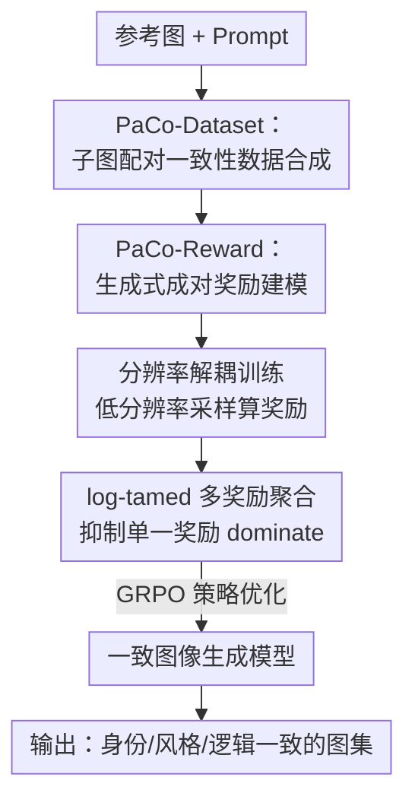

# PaCo-RL: Advancing Reinforcement Learning for Consistent Image Generation with Pairwise Reward Modeling

**会议**: CVPR 2026  
**论文**: [CVF Open Access](https://openaccess.thecvf.com/content/CVPR2026/html/Ping_PaCo-RL_Advancing_Reinforcement_Learning_for_Consistent_Image_Generation_with_Pairwise_CVPR_2026_paper.html)  
**代码**: 待确认（论文提供 Project page）  
**领域**: 图像生成 / 一致性生成 / 强化学习 / 奖励建模  
**关键词**: 一致图像生成, 成对奖励模型, GRPO, 分辨率解耦, 多奖励聚合

## 一句话总结
PaCo-RL 把一致图像生成（图像编辑 + 文生图集）当成一个 RL 问题来做：先用自动子图配对造一个大规模一致性排序数据集训出专门评判"两张图是否一致"的成对奖励模型 PaCo-Reward，再用一个低分辨率训练 + log 抑制多奖励的高效 RL 算法 PaCo-GRPO 去优化生成模型，在两类任务上把一致性指标提升 10.3%–11.7%、训练效率近乎翻倍且更稳定。

## 研究背景与动机
**领域现状**：文生图模型在"单张图质量/多样性"上已经很强，但很多真实应用——讲故事、角色设计、广告、连环画——要的是**一致性**：多张图里同一个人物的身份、整体风格、逻辑关系要前后对得上。论文把这个需求收敛成两个代表任务：图像编辑（改某个属性、保住其余外观）和文生图集 Text-to-ImageSet（一句话生成一组互相协调的图）。

**现有痛点**：监督训练在一致性上很吃力，原因有二——一是缺大规模、能刻画"视觉一致性"的标注数据；二是人对"一致"的感知很主观、很难用显式标签建模。于是大家自然想到用 RL：不靠精心策划的数据，而靠奖励模型给反馈，让模型在 data-free 的方式下学这些复杂主观的视觉标准。

**核心矛盾**：但把 RL 套到一致性生成上，两块都缺。**奖励侧**：现有奖励模型几乎都在评"美学"和"文本对齐"，没有显式的一致性评估，而一致性本质上要**成对比较多张图**，不是单图打分或图文对齐能覆盖的——连 CLIP、DreamSim 这类相似度模型也抓不住人对一致性的多维感知。**优化侧**：一致性生成要同时处理多张高分辨率图，算力开销远大于单图合成，采样是主要瓶颈；而且要同时优化"一致性"和"文本保真"多个奖励，朴素加权很容易让某个奖励 dominate，训练不稳。

**本文目标**：分别补上这两个缺口——造一个 state-of-the-art 的一致性奖励模型，再配一个高效稳定的在线 RL 算法。

**切入角度 / 核心 idea**：奖励侧用**成对、生成式**的方式建模一致性（把"两张图一致吗"转成预测下一个 token 是 "Yes" 的概率，天然契合 VLM 的自回归本性，不用额外回归头）；优化侧用**分辨率解耦**砍采样成本、用 **log 抑制**让多奖励别互相压制。

## 方法详解

### 整体框架
PaCo-RL 是一个两段式框架：**PaCo-Reward**（奖励模型）+ **PaCo-GRPO**（RL 算法）。前半段先用自动子图配对从 FLUX 生成的图网格里造出大规模一致性排序数据集 PaCo-Dataset，再在 Qwen2.5-VL-7B 上训出成对一致性评判器 PaCo-Reward；后半段把 PaCo-Reward 当奖励信号插进 GRPO 在线优化流程，但用两个工程化策略让训练既快又稳——训练时只在低分辨率上采样（推理仍出全分辨率），并对多个奖励做 log 抑制聚合。整体输入是"参考图 + prompt"（或一句集合描述），输出是一组身份/风格/逻辑互相一致的图。

### 关键设计

**1. PaCo-Dataset：用子图组合配对把"一致性"廉价地造成大规模排序数据**

一致性生成数据天生难收集——多张图要"共享一部分元素、又在另一部分变化"，人工拍/标成本极高。作者的做法是先用 Deepseek-V3.1 生成 2000 条文生图集 prompt，再在文本 embedding 上做图结构多样化筛出 708 条；对每条 prompt 用 FLUX.1-dev 生成内部强一致的 $m\times n$ 图网格（实测 $2\times2$ 在质量/效率上最优），每条 prompt 换 4 个种子生 4 个网格，然后做**子图组合配对**：把每个网格切成 $m\times n$ 个子图，在同一 prompt 的多个网格间穷举两两配对。这样从 708 条 prompt、2832 张图里"放大"出 33,984 个排序实例（每条 = 1 张参考 + 4 张候选，按一致性排名）。6 名标注员各标约 5664 条，留 3136 条作 ConsistencyRank 评测基准。为便于训练，把排名转成**成对比较**（清晰的正/负对），再补 5695 条 ShareGPT4o-Image 的人工验证一致对，最终得到 54,624 个标注对（27,599 一致 + 27,025 不一致），每对再用 GPT-5 生成 CoT 推理标注以增可解释性、缓解过拟合。这个"先合成网格、再组合配对"的思路是整套数据规模的关键，几乎零额外成本就把多样性和量级撑起来。

**2. PaCo-Reward：把一致性评估重写成"VLM 预测 Yes 的概率"，并用加权似然损失平衡决策与推理**

奖励侧的痛点是：要么给 VLM 加额外回归头输出标量奖励——这和 VLM 的 next-token 预测本性不匹配；要么靠长 CoT 推理出分数——RL 训练时算力开销太大。PaCo-Reward 的做法是把"两张图 $I_A, I_B$ 在共享 prompt $P$ 下一致吗"直接转成**生成式判断**：让模型生成 "Yes"/"No"，推理时取 **"Yes" token 的概率**作为两图的一致性分数；人类排名也能由各候选图相对参考图的分数推回来。这样既契合自回归范式、又能选配 CoT 增强可解释性与鲁棒性。训练目标是一个**加权似然**：给定 $I=(I_A,I_B,P)$，模型先出二值答案再出 $n-1$ 个 CoT token，

$$\mathcal{L}_{\text{PaCo}} = -\left[\alpha \log p(y_0\mid I) + \frac{1-\alpha}{n-1}\sum_{i=1}^{n-1}\log p(y_i\mid I)\right]$$

其中 $y_0$ 是首个决策 token（Yes/No），$y_i$ 是第 $i$ 个推理 token，$\alpha\in[0,1]$ 调"决策监督"与"推理监督"的权重。当 $\alpha=\frac{1}{n}$ 时退化为标准 MLE；超参搜索发现 $\alpha=0.1$ 泛化最好。直观上这个设计避免了两个极端：只学二值答案会过拟合、泛化差，硬学整条 CoT 又会稀释主监督信号，加权让决策信号占主导、推理信号当辅助。

**3. 分辨率解耦训练：训练用低分辨率采样、推理出全分辨率，砍掉 RL 主要算力瓶颈**

一致性生成（尤其文生图集）的输出常是含多个子图的高分辨率大图，每个子图都达到标准文生图分辨率，而 Transformer 架构算力随分辨率**平方级**增长，使 RL 极其昂贵。作者借用 FlowGRPO 的观察——即便少步去噪的低质量图也能提供有效奖励信号——提出训练时只生成 $\frac{h}{2}\times\frac{w}{2}$ 的低分辨率图来算奖励和优化，推理/评测时仍生成全分辨率 $h\times w$。这一招同时砍了采样和训练两端的开销，且能和 MixGRPO、FlowGRPO-Fast 等现有优化无缝叠加。实验上 $512\times512$ 训练起点奖励低，但约 50 epoch 后追平 $1024\times1024$，训练耗时从 12.0h 降到 6.0h；低分辨率还带来更高奖励方差、促进探索产生更多样样本；但 $256\times256$ 因细节不足、奖励评估不可靠而失败——所以是"适度"降分辨率而非越低越好。

**4. log-tamed 多奖励聚合：用变异系数判断哪个奖励爱"爆"，对它做 log 压缩防止 dominate**

多奖励（一致性 + 文本对齐）朴素加权 $\hat r_i^j=\sum_k w_k R^k$ 容易出现 reward domination——某个奖励数值波动大就主导优化，结果次优甚至训练崩，手调权重又费力且不通用。作者的自适应做法是先算每个奖励的**变异系数** $h^k=\frac{\text{std}_{i,j}(R^k)}{\text{mean}_{i,j}(R^k)}$，$h^k$ 大说明该奖励波动剧烈、易在聚合里产生大绝对值而压制其它；于是对它做对数变换：

$$\overline{R}^k(\bm{x}_i^j,\bm{c}_i)=\begin{cases}\log(1+R^k), & h^k>\delta,\\ R^k, & \text{otherwise},\end{cases}$$

阈值 $\delta$ 可动态取所有 $h^k$ 的均值、或按先验设固定值（如 0.2）。log 压缩在压住大奖励数值的同时**保持样本相对排序不变**，因此既抑制了 domination、又没扭曲底层偏好。实验里它把"一致性/文本对齐"奖励比值压在 1.8 以下，而朴素聚合 50 epoch 后该比值冲过 2.5。

### 损失函数 / 训练策略
奖励模型用上面的加权似然 $\mathcal{L}_{\text{PaCo}}$（$\alpha=0.1$）训练；RL 用 GRPO，对 flow-matching 模型把 ODE 转成 SDE 引入随机性以促探索，SDE 更新

$$\bm{x}_{t+\Delta t}=\bm{x}_t+\left[\bm{v}_\theta+\frac{\sigma_t^2}{2t}(\bm{x}_t+(1-t)\bm{v}_\theta)\right]\Delta t+\sigma_t\sqrt{\Delta t}\,\epsilon$$

目标 $J_\theta=J_{\text{clip}}-\beta D_{\text{KL}}(\pi_\theta\|\pi_{\text{ref}})$，奖励则换成 log-tamed 聚合后的多奖励。两个变体：PaCo-Reward-7B-Fast（仅二值标签、快速收敛）与 PaCo-Reward-7B（全数据 + 推理增强标签）。

## 实验关键数据

### 主实验

奖励模型在两个基准上对比 SOTA。EditReward-Bench（指标 PF / Consistency / Overall，越高越好）：

| 方法 | Prompt Following | Consistency | Overall |
|------|------|------|------|
| GPT-5 | 0.777 | 0.669 | 0.755 |
| Gemini2.5-Pro | 0.703 | 0.560 | 0.722 |
| EditScore-72B | 0.635 | 0.586 | 0.703 |
| Qwen2.5-VL-7B | 0.458 | 0.325 | 0.432 |
| PaCo-Reward-7B-Fast | 0.748 | 0.697 | 0.728 |
| **PaCo-Reward-7B** | **0.777** | **0.709** | **0.751** |

ConsistencyRank（Accuracy / Kendall $\tau$ / Spearman $\rho$ / Top1-Bottom1，越高越好）：

| 方法 | Accuracy ↑ | $\tau$ ↑ | $\rho$ ↑ | T1-B1 ↑ |
|------|------|------|------|------|
| CLIP-I | 0.394 | 0.178 | 0.206 | 0.475 |
| DreamSim | 0.403 | 0.184 | 0.214 | 0.493 |
| Qwen2.5-VL-7B | 0.344 | 0.118 | 0.138 | 0.401 |
| PaCo-Reward-7B-Fast | 0.441 | 0.240 | 0.278 | 0.544 |
| **PaCo-Reward-7B** | **0.449** | **0.250** | **0.288** | **0.557** |

值得注意的是：在 ConsistencyRank 上 InternVL3.5-8B（0.359）、Qwen2.5-VL-7B（0.344）这类先进 MLLM 反而不如传统相似度方法 CLIP-I（0.394）/ DreamSim（0.403），说明通用 MLLM 与人类一致性感知是错位的、确实需要专门奖励建模。PaCo-Reward-7B 相对原始 Qwen2.5-VL-7B：Accuracy 提升 10.5%（0.449−0.344=0.105）、Spearman $\rho$ 提升 0.150（0.288−0.138）；在 EditReward-Bench 上超过所有开源基线、逼近 GPT-5（Overall 0.751 vs 0.755）。论文整体宣称在与人类偏好相关性上较现有奖励模型领先 8.2%–15.0%。

接入 RL 后的生成效果。T2IS-Bench 文生图集（Visual Consistency 由 Qwen2.5-VL-7B / Gemma-3-4B 双评测器打分，斜杠前后）：

| 方法 | Aesthetics | Avg. (Qwen / Gemma) |
|------|------|------|
| AutoT2IS（最强开源基线） | 0.520 | 0.515 / 0.686 |
| Seedream 4.0（闭源） | 0.551 | 0.589 / 0.758 |
| **FLUX.1-dev + PaCo-Reward-7B** | **0.555** | **0.576 / 0.757** |

相对最强开源基线 AutoT2IS，平均绝对增益 0.117（Qwen 评测）/ 0.103（Gemma 评测），并逼近闭源模型水平。图像编辑 GEdit-Bench（SC/PQ/Overall，EN 指英文指令）：

| 方法 | EN Overall |
|------|------|
| FLUX.1-Kontext | 5.956 |
| FLUX.1-Kontext + PaCo-Reward-7B | 6.469 |
| Qwen-Image-Edit | 7.223 |
| Qwen-Image-Edit + PaCo-Reward-7B | 7.325 |

与 EditReward 在 Step1X-Edit 上"提一致性却掉感知质量"不同，PaCo-Reward 在 SC 和 PQ 上都同步提升，做到了平衡改进。

### 消融实验

PaCo-GRPO 两个核心策略的消融（基于较难的 Text-to-ImageSet 任务）：

| 配置 | 关键现象 | 说明 |
|------|---------|------|
| 训练 1024×1024 | 训练耗时 12.0h | 全分辨率，基线 |
| 训练 512×512（分辨率解耦） | 6.0h，≈50 epoch 追平 1024 | 效率近乎翻倍，最终性能不降 |
| 训练 256×256 | 训练失败 | 细节不足、奖励评估不可靠 |
| 朴素加权聚合 | 奖励比值 50 epoch 后 >2.5 | 一致性奖励 dominate，需手调权重 |
| log-tamed 聚合 | 奖励比值全程 <1.8 | 自适应抑制 domination，多目标均衡 |

### 关键发现
- **分辨率解耦贡献最直接**：512×512 把训练时间从 12h 砍到 6h（近乎翻倍效率）却不掉最终性能，且低分辨率更高的奖励方差反而促进探索；但 256×256 会因细节不足崩掉——说明降分辨率有甜区，不是越低越好。
- **log-tamed 聚合管住稳定性**：把一致性/文本对齐奖励比值压在 1.8 以下（朴素聚合冲到 2.5+），靠的是按变异系数判断"谁爱爆"再对它 log 压缩，且保持样本排序不变。
- **通用 MLLM 抓不住一致性**：先进 MLLM 在 ConsistencyRank 上还不如 CLIP-I/DreamSim，反向论证了专门成对奖励建模的必要性。
- **case study**：固定种子下随训练推进，牙医的脸/发型逐步收敛一致（身份）、咖啡馆菜单的粉笔字体趋于统一（风格）、铅笔素描序列学会"逐帧延展而非重画"（逻辑），三个维度同步增强。

## 亮点与洞察
- **把奖励建模"还原"成 next-token 概率**：用 P("Yes") 当一致性分数，避免了额外回归头与 VLM 自回归本性的错配，也比长 CoT 打分省算力——这个"让奖励对齐生成范式"的思路可迁移到任何 VLM-as-reward 场景。
- **子图组合配对是数据放大神器**：708 prompt × 4 网格 × 切子图穷举配对 → 33,984 排序实例，几乎零额外成本撑起规模与多样性，对一切"需要成对/排序监督但难采集"的任务都有借鉴价值。
- **分辨率解耦点破一个常识误区**：RL 训练阶段的奖励信号对图像质量没那么挑，低分辨率即可，省下的是平方级算力——这是把昂贵 RL 落地的实用 trick。
- **log-tamed 聚合用变异系数自适应选谁压**：不靠手调权重、只压"爱爆"的奖励且不改排序，是处理多奖励 domination 的轻量通用方案。

## 局限与展望
- 奖励模型基于 Qwen2.5-VL-7B 微调，T2IS-Bench 评测时不得不额外引入 Gemma-3-4B 做交叉评测以避免"自评偏袒"——说明用同源模型既当奖励又当评测器存在循环验证风险，跨模型可靠性仍是隐忧。
- 一致性数据合成依赖 FLUX.1-dev 生成的网格，"强内部一致"是模型给的而非真实世界采集，可能把生成模型自身的偏置带进奖励模型；ConsistencyRank 的绝对数值（Accuracy 0.449、$\tau$ 0.250）也表明一致性排序本身仍远未饱和。
- 仅验证了图像编辑与文生图集两类任务、$2\times2$ 网格设定；更多子图数量、视频/3D 一致性、更长序列逻辑一致是否还成立未知。
- 256×256 训练失败提示分辨率解耦有任务相关的下限，不同 backbone/任务的甜区需重新标定，缺乏自动选分辨率的机制。

## 相关工作与启发
- **vs CLIP-I / DreamSim**: 它们做单维图像相似度，本文做多维成对一致性偏好；区别在于 PaCo-Reward 用 VLM 生成式判断捕捉身份/风格/逻辑等多面感知，实验中也反超这两者（ConsistencyRank Accuracy 0.449 vs 0.394/0.403）。
- **vs EditScore / EditReward [40,77]**: 同为 MLLM 奖励模型，但它们偏图文对齐/美学、或在 Step1X-Edit 上提一致性却掉质量；本文专做一致性且 SC/PQ 同步提升，并在 EditReward-Bench 上超所有开源基线。
- **vs FlowGRPO / DanceGRPO / MixGRPO [37,84,31]**: 它们把 ODE 转 SDE 提多样性、或混合采样降成本，但采样开销仍在；本文的分辨率解耦正交补充，可与之叠加获额外效率，并额外加了 log-tamed 解决多奖励 domination。

## 评分
- 新颖性: ⭐⭐⭐⭐ 把奖励重写成 next-token 概率 + 子图配对造数据 + 分辨率解耦/log 抑制，组合务实但单点偏工程
- 实验充分度: ⭐⭐⭐⭐⭐ 奖励基准 + 两类生成任务 + 双评测器 + 两策略消融 + case study，覆盖完整
- 写作质量: ⭐⭐⭐⭐ 问题拆解清晰、RQ 驱动，公式与图表自洽
- 价值: ⭐⭐⭐⭐ 给"一致图像生成 + RL"补齐奖励与高效优化两块缺口，trick 可复用、可落地

<!-- RELATED:START -->

## 相关论文

- [\[CVPR 2026\] The Image as Its Own Reward: Reinforcement Learning with Adversarial Reward for Image Generation](the_image_as_its_own_reward_reinforcement_learning_with_adversarial_reward_for_i.md)
- [\[CVPR 2026\] UniGen-1.5: Enhancing Image Generation and Editing through Reward Unification in RL](unigen-15_enhancing_image_generation_and_editing_through_reward_unification_in_r.md)
- [\[CVPR 2026\] Enhancing Spatial Understanding in Image Generation via Reward Modeling](enhancing_spatial_understanding_in_image_generation_via_reward_modeling.md)
- [\[CVPR 2026\] Leveraging Verifier-Based Reinforcement Learning in Image Editing](leveraging_verifier-based_reinforcement_learning_in_image_editing.md)
- [\[CVPR 2026\] HiCoGen: Hierarchical Compositional Text-to-Image Generation in Diffusion Models via Reinforcement Learning](hicogen_hierarchical_compositional_text-to-image_generation_in_diffusion_models_.md)

<!-- RELATED:END -->
