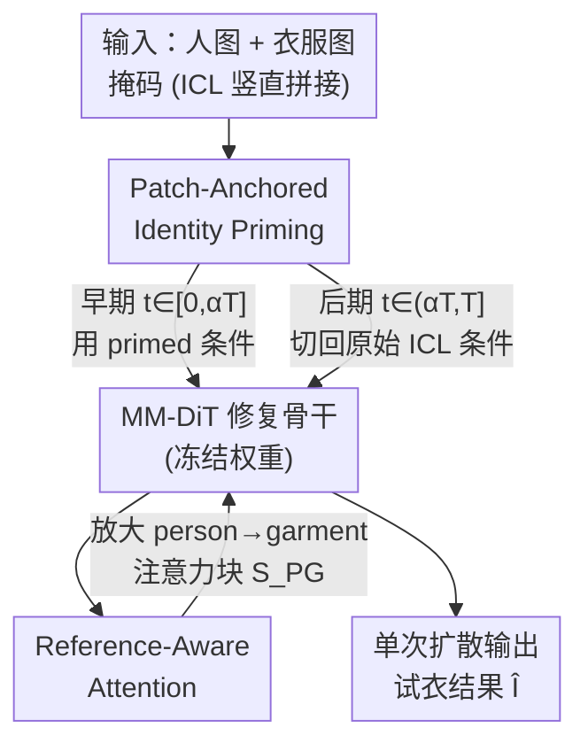

# PG-VTON: Single-Pass Training-Free Virtual Try-On via Patch-Guided Reference Alignment

**会议**: CVPR 2026  
**论文**: [CVF Open Access](https://openaccess.thecvf.com/content/CVPR2026/html/Zhao_PG-VTON_Single-Pass_Training-Free_Virtual_Try-On_via_Patch-Guided_Reference_Alignment_CVPR_2026_paper.html)  
**代码**: https://github.com/PKU-ICST-MIPL/PG-VTON  
**领域**: 扩散模型 / 图像生成 / 虚拟试衣  
**关键词**: 虚拟试衣、免训练、单次推理、扩散修复模型、注意力调制

## 一句话总结
PG-VTON 不训练、不做姿态估计、不做显式 warping，只靠在冻结的 MM-DiT 修复模型推理时插两个轻量控制器（早期注入小块衣服 patch 锚定身份 + 放大「人→衣」注意力），就在**单次扩散**里完成高保真虚拟试衣，在 DressCode / VITON-HD 上拿到免训练方法的 SOTA，还能直接迁移到主体插入任务。

## 研究背景与动机

**领域现状**：虚拟试衣（VTON）要把一件目标衣服「穿」到目标人身上，同时保住人的身份、姿态，并忠实还原衣服的颜色、纹理、logo。主流方法分两派：一派是 appearance-flow 的 warp-and-fuse 流程（VITON、CP-VTON、GP-VTON、D4-VTON），先估计形变把衣服 warp 到人身上再融合；另一派是单阶段生成模型（IDM-VTON、CatVTON、Leffa），直接用扩散模型合成穿好的人。两派都重度依赖配对监督数据。

**现有痛点**：配对数据集（VITON-HD、DressCode）几乎都是室内目录图——视角受限、人和衣服多样性低、棚拍风格单一，模型很容易过拟合。一旦面对真实世界照片（复杂姿态、多变光照、没见过的衣服），就会产生过度平滑的纹理、色偏、形变扭曲，跨域泛化很差。为了摆脱配对监督，OmniVTON 等近期工作走免训练路线，把人体解析、语义匹配、多阶段扩散/合成拼起来去隐式构造 appearance flow，确实更鲁棒；但代价是要跑多次扩散 + 一堆辅助阶段，延迟高、工程复杂，而且一旦姿态或对应估计不准就会崩。

**核心矛盾**：现有免训练流程证明了「强监督不是必须的」，但鲁棒性是用「多阶段、多次扩散」换来的——还缺一个**简单、高效、单次推理**的方案。鲁棒性和部署效率之间被绑死了。

**切入角度**：作者抓住一个关于 MM-DiT 修复扩散模型的经验观察——这些在大规模异构图像上预训练的修复模型，本身就有很强的**上下文补全能力**：给它一块抠掉的衣服区域 + 一个合适的视觉线索，它能合成出语义一致、结构合理、和周围上下文对齐的内容，**完全不需要 VTON 专门微调**。更具体地：如果从衣服图里裁一小块 patch 贴到人身上的待替换区域，冻结的修复模型常常会把剩下的区域补成和这块 patch、和人体姿态都一致的衣服外观（论文 Fig. 3b）。

**核心 idea**：与其在窄域试衣数据上微调（冒过拟合风险），不如设计**推理时**的控制机制去解锁并引导预训练修复模型自带的能力——但要把「硬贴 patch」这个朴素 trick 变成一个有原则的软引导，因为硬贴会带来位置错位（贴的位置和衣服在身上的真实形变对不上）和光度不匹配（pose/阴影/相机统计和人不一致），留下明显的接缝和不真实几何。这就是 PG-VTON：Patch-Guided Reference Alignment。

## 方法详解

### 整体框架

PG-VTON 建立在一个**冻结的、基于 MM-DiT 的潜空间修复模型**（具体用 FLUX.1-fill）之上，全程不更新任何权重，也不引入姿态估计器或对应模块。它沿用 CatVTON 的「in-context learning（ICL）」输入构造：把抠掉衣服区域的人图 $I_m=(1-M_p)\odot I_p$ 和衣服参考图 $I_g$ 沿竖直方向拼接成 $I_{in}=\text{Concat}_{vert}(I_m, I_g)$，对应的掩码也拼成 $M_{in}=\text{Concat}_{vert}(M_p, M_{blank})$（$M_{blank}$ 是和 $I_g$ 同尺寸的全零掩码）。修复模型 $f_\theta$ 接收 $(I_{in}, M_{in})$ 和一句固定文本提示，在人体分支的掩码区域里预测补全结果，整个生成过程在 VAE 潜空间进行。

但只给这个 ICL 输入是不够的：直接喂 $(I_{in}, M_{in})$ 经常无法可靠复现目标衣服，模型可能部分忽略 $I_g$ 或幻觉出貌似合理但错误的衣服（Fig. 3a）。PG-VTON 在这个冻结骨干上插两个**纯推理时**的轻量控制器来「驾驭」它，且二者刚好作用在生成轨迹的不同阶段：**PIP（Patch-Anchored Identity Priming）**在去噪早期注入几块衣服 patch，把生成轨迹「锚」向正确的衣服身份（颜色、图案、局部结构）；**RAA（Reference-Aware Attention）**则在自注意力里放大「人体 token 看向衣服 token」的强度，把纹理、logo、边缘这些细节忠实搬运过来。两者协同，让模型在**单次扩散**里就完成试衣。

### 关键设计

**1. Patch-Anchored Identity Priming (PIP)：早期注入 patch 锚定衣服身份，再交还控制权**

这个设计针对的痛点是：朴素地直接把衣服 patch「硬贴」到人身上，虽然能让冻结模型复现衣服身份，却会留下两个硬伤——贴的位置和衣服在身上的未知形变对不上、patch 的光度统计（姿态/阴影/相机）和人图不匹配，于是出现可见接缝和不真实几何（Fig. 3b 底部）。PIP 把这个硬贴 trick 改造成一个**短暂的、潜空间的软引导**：它只在生成轨迹**最开始的一小段**提供 patch 级身份先验，把轨迹推向正确外观，然后平滑地把控制权交还给原始的掩码输入，让后期去步骤去贴合人体几何。

具体地，先对人体掩码 $M_p$ 和衣服掩码 $M_g$ 算紧致外接框 $Rec_p$、$Rec_g$，假设两矩形近似一一对应。在 $Rec_g$ 内随机采 $K$ 个方形 patch，对每个中心归一化坐标为 $(P_x, P_y)$ 的衣服 patch $P_g^k$，把坐标映射到 $Rec_p$ 内的目标位置 $(p_x, p_y)$ 决定它贴到人身上的位置，得到复合 patch 掩码 $M_c=\bigcup_{k=1}^K M_p^k \subseteq M_p$。把这 $K$ 块 patch 贴进掩码人图，得到 primed 掩码图：

$$I_c = (1-M_c)\odot I_m + \sum_{k=1}^{K}(M_p^k \odot P_g^k)$$

再按 ICL 范式拼成 primed 输入 $\tilde I_{in}=\text{Concat}_{vert}(I_c, I_g)$，经 VAE 编码成 primed 潜条件 $c_{prime}$（与之相对的是用原始掩码图构造的 $c_{orig}$）。关键在于一个**分段条件调度**：在早期步 $t\in[0,\alpha T]$ 用 $c_{prime}$ 与当前潜变量 $z_t$ 沿特征维拼接喂进 MM-DiT 预测速度 $\hat v_t$；在后期步 $t\in(\alpha T, T]$ 切回 $c_{orig}$。即

$$\hat v_t = f_\theta(z_t, t, c_t),\quad c_t=\begin{cases} c_{prime} & t\in[0,\alpha T] \\ c_{orig} & t\in(\alpha T, T] \end{cases}$$

这样模型先从 patch 建立正确的衣服身份（颜色、纹理、logo），身份锚定后再精修几何、阴影、褶皱去自然贴合姿态——既拿到 patch 的身份信息，又躲开硬贴的位置错位和接缝，而且全程保持单次推理延迟、不动模型权重。论文默认 $\alpha=0.1$，即只用前 10% 的步做 priming。

**2. Reference-Aware Attention (RAA)：放大「人→衣」注意力块，强制细节搬运**

PIP 在轨迹早期偏置了全局身份，但如果人体 token 主要只「看自己」，细粒度纹理仍可能被低估。RAA 针对这个痛点，对 DiT 的自注意力做一个**免训练**的改造，把细节证据从衣服图显式地路由到生成的衣服区域。在 ICL 形式下，token 序列天然分成三段 $Z_{full}=[\mathcal{T}, Z_g, Z_p]$（文本 token、衣服分支视觉 token、人体分支视觉 token）。于是注意力得分矩阵 $S=\frac{QK^\top}{\sqrt{d_k}}$ 可看成一个 $3\times3$ 分块矩阵，其中 $S_{PG}$ 就是「人体 query → 衣服 key」这一块 logits。

RAA 的做法极简：定义一个 $3\times3$ 分块缩放矩阵 $M_\gamma$，只把 $S_{PG}$ 对应的块乘上缩放因子 $\gamma>1$（其余块乘 1），通过 Hadamard 逐元素积得到 $\tilde S = S\odot M_\gamma$，再 $\tilde A=\text{Softmax}(\tilde S)$、$\tilde Z=\tilde A V$。这一步在 softmax 之前**选择性放大整个 $S_{PG}$ 块**，强迫掩码人体 token 更频繁地「盯着」衣服分支看，从而：(i) 加强生成衣服和参考外观的对齐；(ii) 提升 logo、印花、边缘结构搬运的鲁棒性；(iii) 完全不需要显式对应估计或辅助网络。论文默认 $\gamma=3$。值得注意的是消融显示 RAA 单独用的增益始终小于 PIP——它更像是「身份建立之后」的局部精修补充，而非主驱动。

### 损失函数 / 训练策略
没有任何训练。PG-VTON 全程冻结 FLUX.1-fill 的所有权重，PIP 和 RAA 都是纯推理时操作，无参数更新。超参数固定：$\alpha=0.1$（priming 步比例）、$\gamma=3$（注意力缩放）、文本提示固定为 "a model wearing clothes"。VITON-HD / DressCode 用 1024×768 分辨率，StreetTryOn 按其原协议用 512×320。

## 实验关键数据

### 主实验

在 VITON-HD 和 DressCode 上做跨域评测（测 VITON-HD 时用训于 DressCode 的官方权重，反之亦然），指标为 FID（paired/unpaired）、SSIM、LPIPS。PG-VTON 在两个数据集、两种设置下都取得最佳总体表现，且只需**单次扩散**而非多阶段流程。

| 数据集 | 指标 | PG-VTON (本文) | OmniVTON (免训练) | Any2AnyTryon | CatVTON |
|--------|------|------|------|------|------|
| VITON-HD | FIDu ↓ | **9.873** | 13.167 | 10.971 | 15.228 |
| VITON-HD | FIDp ↓ | **6.749** | 10.168 | 8.188 | 12.754 |
| VITON-HD | SSIMp ↑ | **0.877** | 0.874 | 0.867 | 0.816 |
| VITON-HD | LPIPSp ↓ | 0.086 | 0.112 | **0.085** | 0.154 |
| DressCode | FIDu ↓ | **6.693** | 13.415 | 8.182 | 10.161 |
| DressCode | FIDp ↓ | **4.195** | 12.394 | 5.478 | 8.775 |
| DressCode | SSIMp ↑ | **0.907** | 0.896 | 0.891 | 0.875 |
| DressCode | LPIPSp ↓ | **0.055** | 0.086 | 0.060 | 0.081 |

值得强调的是 PG-VTON 还超过了 Any2AnyTryon——后者用的是**同一个 DiT 修复骨干**，但训练数据更广（VITON-HD + DressCode + DeepFashion2 + LRVS-Fashion + 额外采集/合成的试衣数据，论文用灰底标注其训练 regime 更优）。在同骨干、更弱（零）监督的条件下还能反超，说明精心设计的免训练单次控制器可以匹敌甚至超过重度训练的流程。

StreetTryOn 上测真实世界跨域鲁棒性（四个设置：Shop-to-Street、Model-to-Model、Model-to-Street、Street-to-Street）。由于 FID 普遍 >30 难以区分，额外报 CMMD：

| 指标 | 设置 | PG-VTON | OmniVTON |
|------|------|------|------|
| FID ↓ | Street-to-Street | **21.028** | 23.470 |
| FID ↓ | Shop-to-Street | 34.158 | **33.919** |
| CMMD ↓ | Shop-to-Street | **0.263** | 0.599 |
| CMMD ↓ | Model-to-Model | **0.358** | 1.215 |
| CMMD ↓ | Model-to-Street | **0.459** | 0.764 |
| CMMD ↓ | Street-to-Street | **0.301** | 0.688 |

在最难的 Street-to-Street 上 FID 明显领先所有 baseline；CMMD 上则在全部四个设置都大幅超过 OmniVTON，说明在真实世界条件下生成分布与真实分布对齐得更好。FID 上个别设置（如 S2S/M2S）略逊于 OmniVTON，作者用更具判别力的 CMMD 补充论证整体优势。

### 消融实验

在 VITON-HD 上拆 PIP 和 RAA 两个组件：

| 配置 | FIDu ↓ | FIDp ↓ | SSIMp ↑ | LPIPSp ↓ | 说明 |
|------|--------|--------|---------|----------|------|
| ICL only（都去掉） | 13.393 | 8.954 | 0.842 | 0.112 | 纯修复骨干，单次跟不住衣服 |
| + PIP only | 10.829 | 7.382 | 0.852 | 0.100 | 主增益来源 |
| + RAA only | 11.543 | 8.099 | 0.849 | 0.106 | 增益始终小于 PIP |
| Full（PIP+RAA） | **9.873** | **6.749** | **0.877** | **0.086** | 每项指标最佳 |

### 关键发现
- **PIP 是主驱动**：单加 PIP 就吃掉了大部分增益（FIDu 13.393→10.829，FIDp 8.954→7.382），说明早期 patch 级身份先验能稳定去噪、即使不改注意力也能锚住衣服身份。
- **RAA 是身份建立后的局部精修**：单加 RAA 也优于基线，但每项指标增益都小于 PIP；只有在身份已锚定后，注意力重加权才最有效——PIP+RAA 协同才拿到全面最优。
- **ICL-only 最差**：印证了「裸的修复骨干单次跟不住衣服参考」这一动机，正是 PIP/RAA 要解决的问题。
- $\alpha$ 和 $\gamma$ 的更多消融在补充材料中（正文未给具体数值，⚠️ 以原文为准）。

## 亮点与洞察
- **把「硬贴 patch」的朴素 trick 提炼成有原则的软引导**：作者诚实地展示了硬贴的失败（位置错位 + 光度不匹配 → 接缝），再用「早期注入 + 分段调度 + 后期交还控制权」把它转成短暂的身份先验，这个「先锚身份、再精修几何」的两阶段思路很值得借鉴。
- **RAA 用一个 3×3 分块缩放矩阵就实现了跨图细节路由**：不需要显式对应估计、不需要辅助网络，只在 softmax 前对「人→衣」logits 块乘个 $\gamma$，工程上极轻、即插即用。
- **单次推理 + 零训练 + 反超同骨干的重训方法**：这是最「啊哈」的点——证明大规模预训练修复模型的上下文补全先验被严重低估，正确的推理时引导比窄域微调更划算。
- **可迁移性强**：同一套 patch-guided + attention-enhanced 机制无需额外训练就能做主体插入（subject insertion），把通用修复模型变成「示例驱动」的编辑器，思路可推广到其他 reference-conditioned 生成任务。

## 局限与展望
- 作者承认：研究只聚焦单个 FLUX 骨干、只做了虚拟试衣 / 主体插入，patch-guided 控制器对其他编辑任务或其他架构的泛化能力仍不清楚。
- 自己观察的局限：PIP 依赖人体框与衣服框「近似一一对应」的假设来映射 patch 粘贴位置，遇到极端姿态、严重遮挡或人/衣框对应明显失配时，patch 锚定可能不准（虽然后期步会精修，但早期先验若放偏可能引偏轨迹）。
- $\alpha=0.1$、$\gamma=3$ 是固定超参，对不同衣服类型/分辨率是否需要自适应、敏感性如何，正文未充分展开（细节在补充材料）。
- 改进思路：让 patch 采样/映射用更可靠的粗对应（而非随机采 + 框比例映射）、让 $\alpha/\gamma$ 随去噪步或衣服复杂度自适应、在更多扩散骨干上验证通用性。

## 相关工作与启发
- **vs warp-based（GP-VTON / D4-VTON / OmniVTON 的 flow 部分）**：他们靠显式 warping + 解析/姿态估计（如 OpenPose）把衣服形变到人身上，几何先验一旦出错就在极端姿态/杂乱背景下崩；本文绕过显式 warping，让预训练修复骨干隐式编码人体与场景结构，更鲁棒。
- **vs 监督扩散 VTON（IDM-VTON / CatVTON / Leffa / Any2AnyTryon）**：他们把衣服当强条件去微调/训练 text-to-image 或修复骨干，域内质量高但依赖大量配对/精选数据、对域移敏感；本文不做任何 VTON 微调，纯推理时引导，保住广义生成先验和跨域泛化——并在同骨干（Any2AnyTryon）下用零训练反超。
- **vs OmniVTON（免训练多阶段）**：同为免训练，但 OmniVTON 要人体解析 + 语义匹配 + 多次扩散/合成，延迟高、易因对应估计不准而崩；本文用 PIP+RAA 把它压成单次扩散，在保持/超过其鲁棒性的同时大幅降低系统复杂度。

## 评分
- 新颖性: ⭐⭐⭐⭐⭐ 把硬贴 patch 提炼成软引导 + 注意力分块缩放，单次免训练反超重训方法，角度新颖且优雅
- 实验充分度: ⭐⭐⭐⭐ 三个 benchmark + 跨域协议 + 消融清晰，但 α/γ 敏感性、用户研究放在补充材料
- 写作质量: ⭐⭐⭐⭐⭐ 动机推导扎实，方法公式完整，失败案例诚实展示
- 价值: ⭐⭐⭐⭐⭐ 免训练 + 单次推理 + 可迁移，部署友好，对「预训练修复先验被低估」是有力佐证

<!-- RELATED:START -->

## 相关论文

- [\[CVPR 2026\] Garments2Look: A Multi-Reference Dataset for High-Fidelity Outfit-Level Virtual Try-On with Clothing and Accessories](garments2look_a_multi-reference_dataset_for_high-fidelity_outfit-level_virtual_t.md)
- [\[CVPR 2025\] BooW-VTON: Boosting In-the-Wild Virtual Try-On via Mask-Free Pseudo Data Training](../../CVPR2025/image_generation/boow-vton_boosting_in-the-wild_virtual_try-on_via_mask-free_pseudo_data_training.md)
- [\[CVPR 2026\] Efficient and Training-Free Single-Image Diffusion Models](efficient_and_training-free_single-image_diffusion_models.md)
- [\[CVPR 2026\] PROMO: Promptable Outfitting for Efficient High-Fidelity Virtual Try-On](promo_promptable_virtual_tryon_efficient.md)
- [\[CVPR 2026\] The Consistency Critic: Correcting Inconsistencies in Generated Images via Reference-Guided Attentive Alignment](the_consistency_critic_correcting_inconsistencies_in_generated_images_via_refere.md)

<!-- RELATED:END -->
