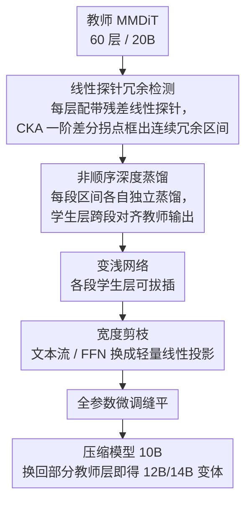

# Pluggable Pruning with Contiguous Layer Distillation for Diffusion Transformers

**会议**: CVPR 2026  
**arXiv**: [2511.16156](https://arxiv.org/abs/2511.16156)  
**代码**: [https://github.com/OPPO-Mente-Lab/Qwen-Image-Pruning](https://github.com/OPPO-Mente-Lab/Qwen-Image-Pruning)  
**领域**: 扩散模型 / 模型压缩  
**关键词**: Diffusion Transformer 剪枝, MMDiT 压缩, 连续层蒸馏, 即插即用推理, 结构化剪枝

## 一句话总结

提出 PPCL 框架，通过线性探针检测 MMDiT 中连续冗余层区间，结合非顺序蒸馏实现深度剪枝（即插即用）和宽度剪枝（用线性投影替换文本流/FFN），将 Qwen-Image 从 20B 压缩到 10B 时性能仅下降 3.29%。

## 研究背景与动机

**领域现状**：Diffusion Transformer（DiT）已成为文生图主流架构，SD3.5、FLUX.1、Qwen-Image 等模型在图像质量和文本对齐上远超上一代 U-Net 方法。但参数量从 SDXL 的 2.6B 飙升至 Qwen-Image 的 20B，推理成本高昂。

**现有痛点**：已有的结构化剪枝方法存在三个关键局限：(a) 不适用于 MMDiT（多模态 DiT）架构；(b) 层剪枝灵活性差，不支持即插即用配置；(c) 对深层扩散模型的层间依赖理解不足。

**核心矛盾**：作者在 Qwen-Image（60 层 MMDiT）上做了大量实验，发现两个关键现象——随机删除 1-3 层对生成质量影响极小（层冗余度高），且**连续删除**始终优于**非连续删除**。这说明冗余性具有深度方向的连续性特征，但如何高效检测这些连续冗余区间仍是开放问题。

**本文目标**：(a) 如何最大化识别连续冗余层子集？(b) 如何在剪枝后的蒸馏中避免误差逐层传播？(c) 如何实现不同压缩率下即插即用、无需重训练？

**切入角度**：教师模型的表征演化并非均匀推进，而是分阶段进行——同一阶段内层激活平滑过渡，可以被线性函数近似。当某层的输入输出映射可被线性探针拟合时，该层对相邻层是功能冗余的。

**核心 idea**：用线性探针 + CKA 一阶差分的凹凸变化检测连续冗余层区间，非顺序蒸馏打断误差传播链，再用轻量线性投影做宽度剪枝，实现即插即用的 DiT 压缩。

## 方法详解

### 整体框架

PPCL 想解决的是：把一个几十层、动辄 20B 参数的 MMDiT（如 60 层的 Qwen-Image）压小，但既不想伤生成质量，又希望同一套权重能按算力预算灵活伸缩。它把这件事拆成正交的两步——先沿**深度**砍掉成片的冗余层，再沿**宽度**把文本流和 FFN 里过参数化的部分换成轻量线性投影。

深度这一步内部又是「先看清、再下刀、最后缝合」三个动作：给教师每一层配一个线性探针、看哪几段连续层可以被线性映射顶替（检测连续冗余区间集合 $\mathcal{I}$），然后对每段区间各自做一次独立的蒸馏，让一个学生层去复现这一整段的功能。宽度这一步在已变浅的网络上继续压，最后用很短的全参数微调把整体缝平。整条链路里最关键的两个判断是「冗余是成片连续出现的」和「每段区间应该独立蒸馏、不让误差顺着深度方向滚雪球」——下面三个设计都围绕这两点展开。

### 关键设计

**1. 线性探针冗余检测：找出能被一条线性映射整段顶替的连续层区间**

直接逐层删再看质量掉多少，既慢又只能判断单层、看不出「成片」的冗余。PPCL 的做法是给教师的每一层 $T_i$ 配一个带残差结构的线性探针 $l_i$：先用最小二乘求出闭式初值 $W_i^*$，再训练它去拟合该层真实的输入输出映射，目标是

$$\mathcal{L}_{fit}(i) = \|l_i(T_{i-1}^D) + T_{i-1}^D - T_i(T_{i-1}^D)\|_2^2 .$$

关键细节是探针训练时喂的输入 $T_{i-1}^D$ 就是该层在原网络里真实拿到的输入，所以每个探针都是独立建模、互不污染。训练完后在校准集上推理，把第 $u{+}1$ 到第 $k$ 层一次性换成对应探针得到替代模型 $T^{[u\to k]}$，再看它和原网络表征的 CKA 相似度随区间加长怎么变。判断边界看的是 CKA 的一阶差分

$$\Delta(u,k) = -\big(\text{cka}(u,k) - \text{cka}(u,k-1)\big),$$

当 $\Delta$ 先降后升、出现拐点时，就说明这一段连续层「可线性替代」的红利用完了，区间到此为止。之所以盯连续区间而非孤立层，是因为有限个线性变换叠起来仍是线性的——只要逐层都能被线性探针拟合，整段的可替代性就能沿深度传递下去。相比简单卡一个 CKA 阈值或按层敏感度排序，这个一阶差分趋势能更准地框住冗余段的两端。

**2. 非顺序深度蒸馏：每段冗余区间各练各的，掐断误差顺着深度滚雪球**

检测出每个冗余区间 $[u,v]$ 后，传统做法是顺着深度一层层蒸馏，但前面层学歪了，误差会一路放大到后面。PPCL 反其道而行：用教师第 $u$ 层的权重初始化学生层 $S^u_{init}$，直接把教师**第 $u{-}1$ 层的真实输出**当作学生输入，要求学生一步跨过整段、对齐教师第 $v$ 层的输出，

$$\mathcal{L}_{depth}^{[u,v]} = \|\text{Norm}(S^u_{init}(T_{u-1}^D)) - \text{Norm}(T_v^D)\|_2^2 ,$$

其中 Norm 是 L2 归一化、强调方向对齐而非数值绝对量级；总损失是所有区间各自这项的加和。因为每段都从教师的真实激活起步、互不依赖，误差传播链被天然切断。这还带来一个意外好处：推理时各段学生层是可拔插的，从同一个 10B 模型里把某些区间换回教师层，就能直接拿到 12B、14B 变体，全程不用再训练。

**3. 宽度剪枝：在变浅的网络上，把文本流和 FFN 这两块宽度冗余换成线性投影**

深度剪完了，但每层内部仍然过参数化，尤其 MMDiT 的双流结构里文本流冗余最重。CKA 热力图显示文本流跨层表征高度相似、变化很小，于是 PPCL 把冗余层的文本流（QKV 投影保留）整体换成两个轻量线性投影 $l_p^z$、$l_p^h$；对 FFN 冗余层，则把图像流和文本流的 FFN 分别换成线性投影 $l_q^{img}$、$l_q^{txt}$。这一步的蒸馏同时约束两件事——层级最终输出要对齐（$\mathcal{L}_{width}^j$），被替换模块本身的输出也要对齐（$\mathcal{L}_{linear}^j$）。选文本流和 FFN 下手，是因为前者 token 间相似度高、跨层几乎不变，后者本身就严重过参数化、线性映射足以近似其功能。深度、宽度双轴一起压，既进一步缩小体积，也让蒸馏目标的偏移更小。

### 损失函数 / 训练策略

- **训练分三阶段**：深度蒸馏 6k 步（8×H20 GPU, micro-batch=2）→ 宽度蒸馏 2k 步 → 全参数微调 1k 步（micro-batch=4）
- 训练数据：从 LAION-2B-en 采样 10 万张图，用 Qwen2.5-VL 生成描述，Qwen-Image 生成训练对
- 优化器 AdamW（$\beta_1$=0.9, $\beta_2$=0.95, weight decay=0.02），BF16 混合精度 + 梯度检查点

## 实验关键数据

### 主实验

在 FLUX.1-dev 和 Qwen-Image 上与多种压缩方法对比（DPG、GenEval、LongText-Bench、OneIG-Bench、T2I-CompBench）：

| 模型 | 方法 | 参数量(B) | 延迟(ms) | 平均性能下降(%) |
|------|------|-----------|----------|----------------|
| FLUX.1-dev | 原始模型 | 12 | 715 | 0 |
| FLUX.1-dev | TinyFusion | 8 | 534 | 13.80 |
| FLUX.1-dev | HierarchicalPrune | 8 | 543 | 13.38 |
| FLUX.1-dev | **PPCL(8B)** | 8 | 535 | **4.03** |
| FLUX.1 Lite | **PPCL(6.5B)** | 6.5 | 428 | **0.07** |
| Qwen-Image | 原始模型 | 20 | 2625 | 0 |
| Qwen-Image | TinyFusion | 14 | 1789 | 8.75 |
| Qwen-Image | HierarchicalPrune | 14 | 1786 | 6.49 |
| Qwen-Image | **PPCL(14B)** | 14 | 1792 | **0.42** |
| Qwen-Image | **PPCL(10B+FT)** | 10 | 1462 | **3.29** |

### 消融实验

在 Qwen-Image 上逐步添加各组件（剪掉 25 层，用 LongText/DPG/GenEval 平均分评估）：

| 配置 | LongText | DPG | GenEval | 平均 | 参数(B) | 下降(%) |
|------|----------|-----|---------|------|---------|---------|
| 原始模型 | 0.942 | 0.885 | 0.854 | 0.894 | 20 | 0 |
| Baseline（CKA敏感度+顺序蒸馏） | 0.625 | 0.763 | 0.728 | 0.706 | 12 | 18.2 |
| +LP（线性探针检测） | 0.712 | 0.795 | 0.776 | 0.761 | 12 | 14.5 |
| +DP（非顺序蒸馏） | 0.905 | 0.836 | 0.801 | 0.848 | 12 | 5.22 |
| +WP-text（文本流→线性） | 0.915 | 0.846 | 0.819 | 0.860 | 11 | 3.79 |
| +WP-ffn（FFN→线性） | 0.906 | 0.835 | 0.809 | 0.850 | 10 | 4.91 |
| +Fine-tuning | 0.916 | 0.867 | 0.828 | 0.870 | 10 | **2.61** |

### 关键发现

- **连续 vs 非连续删除**：在 Qwen-Image 上删除 1-3 层的实验表明，连续删除始终优于非连续删除，验证了冗余的深度连续性假设
- **非顺序蒸馏是最大贡献**：从 baseline 到 +DP，平均分从 0.706 跳到 0.848（+14.2 个百分点），说明打断误差传播链是核心
- **即插即用灵活性**：从训练好的 10B 模型直接替换部分学生层为教师层，无需额外训练即可得到 12B（下降 3.03%）和 14B（下降 0.42%）变体
- **对已压缩模型仍有效**：在 FLUX.1 Lite（8B）上再剪 1.5B 到 6.5B，性能仅下降 0.07%
- **50% 压缩率**：Qwen-Image 20B→10B，推理速度近 2 倍提升，GPU 显存降低约 33%

## 亮点与洞察

- **连续冗余的发现**是关键观察——不是随机分布的层冗余，而是若干连续层构成功能耦合单元，可以被整体替代。这比逐层敏感度分析更高效
- **线性探针 + CKA 一阶差分**的检测策略非常轻量：探针只有一个线性层，训练独立且可并行，检测只需一次校准集推理
- **非顺序蒸馏**的设计巧妙——每个区间独立优化，天然支持即插即用和多压缩率部署，这对实际产品落地非常实用
- **双轴压缩**利用了 MMDiT 双流架构的特点（文本流冗余远大于图像流），是架构感知的压缩策略
- 整个训练成本很低：6k+2k+1k 步，8 张 H20 GPU，相比重训练代价极小

## 局限与展望

- **CKA 一阶差分拐点检测缺乏理论保证**：作者自己承认这是一个成功的工程启发式方法，缺乏严格的理论基础
- **与 INT4 量化不兼容**：剪枝后网络冗余降低，量化容错空间变窄，INT4 量化效果不佳。剪枝+量化的联合优化值得探索
- 实验仅在 T2I 任务上验证，未扩展到视频生成（如 DiT-based 视频模型）
- 线性探针检测依赖校准集，不同校准集可能导致不同的区间划分，鲁棒性有待验证

## 相关工作与启发

- **TinyFusion**（CVPR 2025）：用可微分门控参数选层删除+标准蒸馏，但压缩比有限
- **HierarchicalPrune**：层级位置剪枝+位置权重保留，但层重要性判断偏粗糙
- **Dense2MoE**：将 FFN 替换为 MoE 降低激活成本，但总参数量不变
- FLUX.1 Lite / Chroma1-HD：开源压缩变体，前者 20%加速但有质量损失，后者质量好但推理反而变慢
- 核心启发：**结构化剪枝要跟架构特点结合**——MMDiT 的双流设计、残差连接、层间相似性模式都提供了压缩线索

## 评分

| 维度 | 分数 (1-10) | 说明 |
|------|-------------|------|
| 创新性 | 7 | 连续冗余层检测策略新颖，即插即用蒸馏设计实用 |
| 技术深度 | 7 | 线性探针+CKA分析有深度，但部分设计缺乏理论保证 |
| 实验充分性 | 8 | 多模型(FLUX.1/Qwen-Image)多基准评测，消融完整 |
| 实用价值 | 9 | 训练成本低、压缩比高、即插即用，工业落地价值大 |
| 写作质量 | 7 | 结构清晰，但公式符号较多，部分描述可以更简洁 |
| **总分** | **7.6** | 面向 MMDiT 的高效压缩方案，工程实用性突出 |

<!-- RELATED:START -->

## 相关论文

- [\[CVPR 2026\] Layer-wise Instance Binding for Regional and Occlusion Control in Text-to-Image Diffusion Transformers](layer-wise_instance_binding_for_regional_and_occlusion_control_in_text-to-image_.md)
- [\[CVPR 2026\] Region-Adaptive Sampling for Diffusion Transformers](region-adaptive_sampling_for_diffusion_transformers.md)
- [\[CVPR 2026\] ResCa: Residual Caching for Diffusion Transformers Acceleration](resca_residual_caching_for_diffusion_transformers_acceleration.md)
- [\[CVPR 2026\] SpotEdit: Selective Region Editing in Diffusion Transformers](spotedit_selective_region_editing_in_diffusion_transformers.md)
- [\[CVPR 2026\] PixelDiT: Pixel Diffusion Transformers for Image Generation](pixeldit_pixel_diffusion_transformers_for_image_generation.md)

<!-- RELATED:END -->
