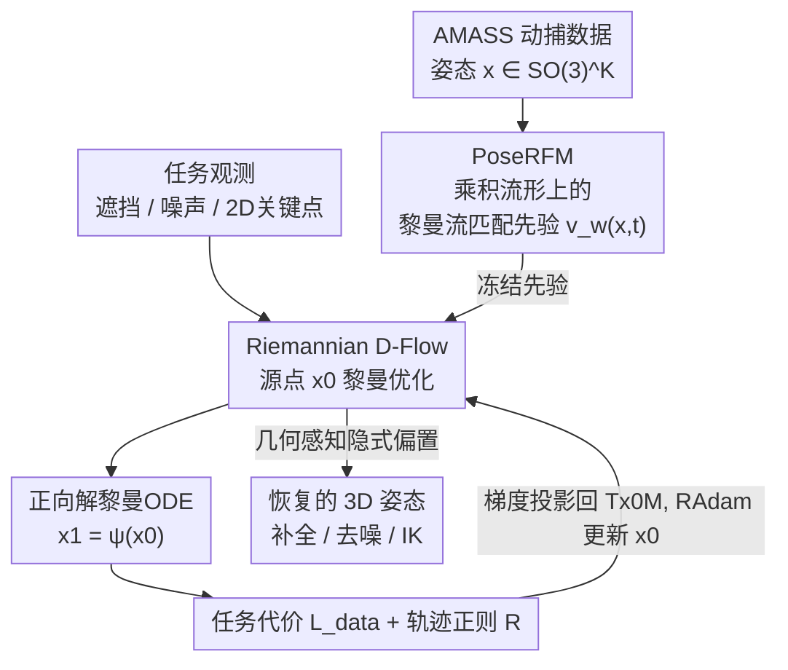

# PoseD-Flow: Versatile and Guided Flow Matching Model of Human Pose

**会议**: CVPR 2026  
**论文**: [CVF Open Access](https://openaccess.thecvf.com/content/CVPR2026/html/Nadar_PoseD-Flow_Versatile_and_Guided_Flow_Matching_Model_of_Human_Pose_CVPR_2026_paper.html)  
**代码**: https://github.com/circle-group/PoseDFlow  
**领域**: 3D人体姿态 / 生成式先验 / 流匹配  
**关键词**: 黎曼流匹配, 人体姿态先验, training-free guidance, 逆问题, SO(3)流形

## 一句话总结
本文提出 PoseD-Flow，第一个把**黎曼流匹配（RFM）**搬到人体姿态上的生成式先验 PoseRFM（直接定义在关节旋转的乘积流形 $SO(3)^K$ 上），再配上一个**无需任务训练的引导机制 Riemannian D-Flow**（对黎曼 ODE 采样过程反传梯度、只优化源点），在姿态补全、去噪、逆运动学三类逆问题上、尤其在遮挡与噪声下达到新 SOTA。

## 研究背景与动机
**领域现状**：从不完整、带噪、被遮挡的 2D/3D 观测里恢复可信的 3D 人体姿态，关键在于有一个"知道什么样的姿态才合理"的生成式先验。近年扩散模型（DPoser）、神经距离场（PoseNDF、NRDF）、VAE（VPoser、HuMoR）都被用作姿态先验，再在推理时做条件反演来解逆问题。

**现有痛点**：当今最强、最易处理的生成范式——**流匹配（flow matching）**——却从未被用于人体姿态。原因有两个硬门槛：(1) 没有任何**预训练的 flow 先验**可用；(2) 关节姿态本质是**非欧几里得**的（每个关节是 $SO(3)$ 上的旋转），把它当成无约束欧氏向量去建模会破坏几何结构。而要把一个为无条件生成训练的生成过程"反过来"用作推理引擎，又必须依赖出了名难调的 **training-free guidance**，对人体姿态这种带几何约束的对象更是悬而未决。

**核心矛盾**：现有姿态先验要么不是流匹配（错过了最具表达力的范式），要么把姿态硬塞进欧氏空间（违背了它真实的配置空间——旋转乘积流形）。两者都没法既享受 flow matching 的建模能力、又尊重姿态的几何。

**本文目标**：(1) 造出第一个直接定义在 $SO(3)^K$ 上的 RFM 姿态先验；(2) 给出一个尊重几何、无需为每个任务重训的引导方法，把这个先验当成逆问题求解器。

**切入角度**：作者继承 Euclidean 的 **D-Flow**（把可控生成看成"优化冻结生成模型的初始噪声/源点，使终点代价最小"）的思路，并把它整体提升到黎曼流形上——既然 flow 是在流形上积分 ODE，那就对这条流形 ODE 反传梯度、在源点上做黎曼优化。

**核心 idea**：用"流形上的 RFM 先验 + 对黎曼 ODE 采样反传的源点优化"取代"欧氏扩散先验 + 启发式引导"，并从理论上证明这种源点优化天然带有一个由**数据协方差 + 流形曲率**塑造的隐式偏置，使解偏向真实、稳定的姿态。

## 方法详解

### 整体框架
PoseD-Flow 分两步、两个贡献组件。**第一步（离线训练）**：PoseRFM 在大规模动捕数据 AMASS 上、直接在关节旋转的乘积流形 $\mathcal{M}:=SO(3)^K$ 上学一个黎曼流匹配先验——一个时间条件向量场 $v_w(x,t)$，把噪声分布 $p_0$ 流形上地搬运到真实姿态分布 $p_1$。**第二步（推理时引导）**：面对一个具体逆问题（补全/去噪/IK），冻结 PoseRFM，用 Riemannian D-Flow 求解一个**源点优化问题**：在流形上找一个源点 $x_0$，使其沿 ODE 积分得到的终点 $x_1=\psi(x_0)$ 既满足任务代价 $L_{\text{data}}$、又落在 PoseRFM 的高密度区。每次迭代正向解 ODE 得 $x_1$、评估代价、把梯度投影回 $x_0$ 的切空间、用 Riemannian Adam 更新 $x_0$。整个推理阶段**不训练任何任务专属参数**。

### 关键设计

**1. PoseRFM：直接定义在 $SO(3)^K$ 乘积流形上的黎曼流匹配先验**

痛点是：人体姿态先验要么不用 flow matching，要么把 $K$ 个关节旋转拍平成欧氏向量、破坏几何。作者把姿态定义为 $x=\{R_k\in SO(3)\}_{k=1}^{K}$（SMPL 取 $K=21$ 个关节旋转），整个配置空间就是乘积流形 $\mathcal{M}=SO(3)^K$，并继承其上的距离 $d_\mathcal{M}$、指数映射 $\mathrm{Exp}$、对数映射 $\mathrm{Log}$ 和黎曼梯度。RFM 不直接回归难处理的边际向量场，而是回归一个**可闭式计算的条件向量场**：对测地线插值的概率路径，取最小范数条件场

$$u_t(x\mid x_1)=\frac{1}{1-t}\,\mathrm{Log}_x(x_1),$$

训练时采样 $x_1\sim p_1$、$t\sim U(0,1)$，沿测地线得 $x_t=\mathrm{Exp}_{x_0}(t\,\mathrm{Log}_{x_0}(x_1))$，最小化 $\|v_w(x_t,t)-u_t(x_t\mid x_1)\|_g^2$（切空间度量下）。网络只是一个 4 层、隐藏维 512 的 MLP，输入 189 维（$21\times3\times3$）的姿态加时间 $t$，输出切空间向量。采样时在流形上做 Riemannian-Euler 积分 $x_{t+\delta}=\mathrm{Exp}_{x_t}(\delta\,\Pi_{T_{x_t}\mathcal{M}}(v_w(x_t,t)))$。这样得到的是**第一个**人体姿态的（大规模、几何版）流匹配先验，无条件生成的 FID/最近邻距离都优于扩散基线 DPoser。

**2. Riemannian D-Flow：对黎曼 ODE 采样反传、只优化源点的 training-free 引导**

有了冻结先验 $v_w\equiv u_t$，怎么用它解一个它没被训练过的条件任务？作者把可控生成写成一个**黎曼源点优化**问题：

$$\min_{x_0\in\mathcal{M}}\Big[\,L(x^{(1)}):=L_{\text{data}}(x^{(1)})+R(x_0,u)\,\Big],\quad x^{(1)}=\psi(x_0),$$

其中 $x^{(1)}$ 是以 $x_0$ 为初值正向积分黎曼 ODE 得到的终点。每次迭代：用 Euler 积分前向解出 $x_1$，评估代价 $L(x_1)$，对源点求梯度 $\nabla_{x_0}L(\psi(x_0))$，**投影到 $x_0$ 的切空间**得到黎曼梯度，再用 **Riemannian Adam** 更新源点（动量做平行移动、流形上 $\mathrm{Exp}$ 步进）。这是把 Euclidean D-Flow"优化冻结模型初始噪声"的思想整体提升到流形：不需要 classifier-free 训练、不需要为每个任务重训，对任何 RFM 先验都通用，是**第一个面向 RFM 的通用 training-free guidance**。所有任务还共享一个轨迹正则 $R=L_{\text{traj}}=\sum_{i}\sum_{k}(3-\mathrm{tr}(x_{ik}))$，它把旋转角压小，抑制轨迹乱跑、惩罚物理上不合理的大旋转。

**3. 几何感知的隐式偏置：源点优化为什么天然偏向真实姿态**

为什么"优化源点"比直接在终点上调更稳？作者给了理论解释。先定义切空间去噪器 $\mu(x)=\mathbb{E}[\mathrm{Log}_x(x_1)\mid x(t)=x]$，证明它的协变导数可分解为 $(\nabla\mu)_v=A_x[C(x)v]+R_x[v]$，其中 $C(x)$ 是条件分布下的（半正定）**协方差算子**、$R_x$ 是曲率导出的余项；当 $t\to1$ 时 $C(x)$ 趋于局部数据协方差。再证黎曼伴随：起点与终点的黎曼梯度由拉回映射 $D\psi(x_0)^\ast$ 相连。最终（定理 4）一步源点更新引起的终点变化为

$$\delta x^{(1)}=-\eta\underbrace{\big[D_{x_0}\psi\,(D_{x_0}\psi)^\ast\big]}_{K:\ \text{半正定、像局部协方差}}\,\mathrm{grad}_{x^{(1)}}L(x^{(1)}),$$

即终点梯度被算子 $K$ **过滤/投影到数据流形的可达子空间**——当 flow 生成的就是数据分布时，$K$ 正是数据的局部协方差。直白说：源点优化让更新自动偏向高密度方向，并被流形曲率修正，于是解被"拉"向真实、稳定的姿态。这解释了 PoseD-Flow 为何在噪声、遮挡、歧义下格外鲁棒。欧氏 D-Flow 是它的特例（曲率余项 $R_x$ 与 score 导数项相消、$K$ 退化为标量协方差）。

### 损失函数 / 训练策略
PoseRFM 训练 50k 步、AdamW（lr 1e-3、weight decay 1e-4、EMA 0.99、batch 4096、ReduceLROnPlateau）。推理阶段三类任务只换 $L_{\text{data}}$、先验和正则不变：
- **姿态补全**：$L_{\text{data}}=\sum_{k\in\Omega}\cos^{-1}\!\big(\frac{\mathrm{tr}(x_k^\top x_k^{\text{obs}})-1}{2}\big)$，即可见关节集 $\Omega$ 上的测地距离，最小化生成姿态与观测的旋转差。
- **运动去噪**：$L_{\text{data}}=L_{\text{joints}}+\lambda L_{\text{smooth}}$，前者是 SMPL 前向得到的关节与含噪关节的 $\ell_2$ 差，后者用相邻帧测地距离促时间平滑。
- **逆运动学/HMR**：$L_{\text{data}}=L_{\text{2D}}+L_\theta+L_\beta$，含透视投影后 2D 关键点的 Geman-McClure 鲁棒重投影误差、关节角先验和形状正则，走 SMPLify 优化管线。

## 实验关键数据

### 主实验
评测覆盖无条件生成、姿态补全、运动去噪、人体网格恢复（HMR/IK），训练于 AMASS，零微调泛化到 HPS/EHF/3DPW。

无条件生成（越低越好的 FID/dNN，越高越好的 APD 多样性）：

| 方法 | FID ↓ | APD (cm) ↑ | dNN (rad) ↓ |
|------|-------|-----------|-------------|
| VPoser | 0.048 | 14.68 | 0.074 |
| DPoser（扩散 SOTA） | 0.019 | 14.99 | 0.073 |
| PoseFM（欧氏 FM 基线） | 0.016 | 14.76 | 0.079 |
| **PoseRFM (N=100)** | **0.014** | 15.48 | **0.069** |
| **PoseRFM (N=1000)** | **0.013** | 15.54 | 0.070 |

FID 与 dNN 均为最低（真实度最高），多样性有竞争力；少数 APD 更高的方法（Pose-NDF、NRDF）以牺牲真实度为代价。

人体网格恢复 EHF（PA-MPJPE，mm）：

| 方法 | from scratch | CLIFF 初始化 |
|------|-------------|-------------|
| DPoser | 56.05 | 49.05 |
| **PoseRFM** | **54.85** | **47.24** |

运动去噪 AMASS（MPJPE，mm，$\sigma=40/100$mm）：DPoser 19.87 / 33.18，**PoseRFM 18.88 / 34.68**；HPS 上 PoseRFM 19.79 / **32.95** 全面更优。HMR 详细指标（CLIFF 初始化）：PCK@50 从 DPoser 的 66.62 提到 **71.40**。

### 消融实验
在姿态补全上拆解几何成分（模型类型 FM vs RFM、数据损失 MSE vs 测地、轨迹损失），MPVPE(mm)/APD(cm)：

| 配置 | Geo Loss | Traj Loss | Occ. left leg MPVPE ↓ | Occ. legs MPVPE ↓ |
|------|:-:|:-:|------|------|
| PoseFM（欧氏） | ✗ | ✗ | 102.60 | 129.04 |
| PoseFM + 几何损失 | ✓ | ✗ | 91.00 | 115.58 |
| PoseFM + geometry（全） | ✓ | ✓ | 90.46 | 115.67 |
| **PoseRFM（全）** | ✓ | ✓ | **83.81** | **95.00** |

### 关键发现
- **几何建模是胜负手**：欧氏 PoseFM 加上测地/轨迹损失反而**退化**（它没建模流形，几何损失与欧氏假设打架）；而 PoseRFM 初始结果相近、一旦加入测地+轨迹损失精度大幅提升且仍保持多样性——说明"流形先验"和"几何损失"必须配套。
- **去噪/遮挡下优势最大**：噪声越大、遮挡越多，PoseD-Flow 相对扩散基线的领先越明显，与理论上的几何隐式偏置一致。
- **MPVPE 指标本身的局限**：补全任务里 MPVPE 假设 GT 是唯一正确解、会惩罚其他同样合理的补全，作者指出需要类似 FID 的、考虑"可信补全分布"的度量。

## 亮点与洞察
- **把 D-Flow 整条搬上黎曼流形**：不是简单换个距离，而是从条件向量场、源点优化、Riemannian Adam 到伴随梯度全部几何化，并给出闭式条件场 $\frac{1}{1-t}\mathrm{Log}_x(x_1)$，工程上落地为一个小 MLP——可复用到任何 $SO(3)$/乘积流形上的逆问题（蛋白、分子、机器人抓取位姿）。
- **"优化源点"自带正则的理论很漂亮**：定理 4 把源点更新对终点的影响刻画成一个半正定算子 $K\approx$ 局部数据协方差的过滤，给"为什么 D-Flow 类方法稳"提供了几何解释，而非仅靠经验。
- **一套先验、三类任务、零任务训练**：推理时只换 $L_{\text{data}}$ 就能做补全/去噪/IK，这种"冻结先验 + 换损失"的范式对实际部署非常友好。

## 局限与展望
- 推理是**逐样本迭代优化**（每次都要正向解 ODE + 反传），相比前馈回归慢；论文主打精度与鲁棒性，未强调速度。
- 评测主要在 AMASS 体系内，**手/脚等末端朝向**两种方法都偶有不自然，细粒度关节仍是难点。
- 作者自己点出 MPVPE 对"多合理解"不公平，但**未给出替代度量**，补全任务的多样性优势难以被现有指标充分体现。
- 只建模**单帧姿态**（scope 明确排除运动建模），时间一致性靠 $L_{\text{smooth}}$ 外挂而非先验内生，可探索把 RFM 直接定义在运动序列流形上。

## 相关工作与启发
- **vs DPoser（扩散先验 + 通过扩散优化）**：DPoser 用欧氏扩散，PoseD-Flow 用流形上的流匹配；同样是 training-free 反演，但 PoseRFM 在 FID/PA-MPJPE/PCK 上更优，且理论上解释了几何带来的鲁棒性。
- **vs PoseNDF / NRDF（神经距离场，迭代投影）**：它们靠投影到神经距离场，多样性高但真实度低（FID/dNN 差）；PoseD-Flow 用生成式 flow 先验，真实度显著更好。
- **vs Euclidean D-Flow [4] / OC-Flow / TFG-Flow**：本文是**第一个面向 RFM 的通用 training-free guidance**；欧氏 D-Flow 被证明是其特例（曲率余项相消），TFG-Flow/OC-Flow 虽触及 $SO(3)$ 但不针对人体姿态这种乘积流形逆问题。

## 评分
- 新颖性: ⭐⭐⭐⭐⭐ 第一个人体姿态的黎曼流匹配先验 + 第一个 RFM 通用 training-free 引导，且有扎实理论
- 实验充分度: ⭐⭐⭐⭐ 覆盖生成/补全/去噪/IK 四任务多数据集，消融清晰；速度与更优指标讨论略少
- 写作质量: ⭐⭐⭐⭐ 理论与方法层次分明；几何记号密集，需一定背景
- 价值: ⭐⭐⭐⭐⭐ "冻结流形先验 + 换损失"范式对 3D 姿态及更广几何逆问题都有迁移价值

<!-- RELATED:START -->

## 相关论文

- [\[CVPR 2026\] Flow Matching for Multimodal Distributions](flow_matching_for_multimodal_distributions.md)
- [\[CVPR 2026\] EgoFlow: Gradient-Guided Flow Matching for Egocentric 6DoF Object Motion Generation](egoflow_gradient-guided_flow_matching_for_egocentric_6dof_object_motion_generati.md)
- [\[CVPR 2026\] Stable Mean Flow: Lyapunov-Inspired One-Step Flow Matching](stable_mean_flow_lyapunov-inspired_one-step_flow_matching.md)
- [\[CVPR 2026\] Spatiotemporal Pyramid Flow Matching for Climate Emulation](spatiotemporal_pyramid_flow_matching_for_climate_emulation.md)
- [\[CVPR 2026\] RenderFlow: Single-Step Neural Rendering via Flow Matching](renderflow_single-step_neural_rendering_via_flow_matching.md)

<!-- RELATED:END -->
