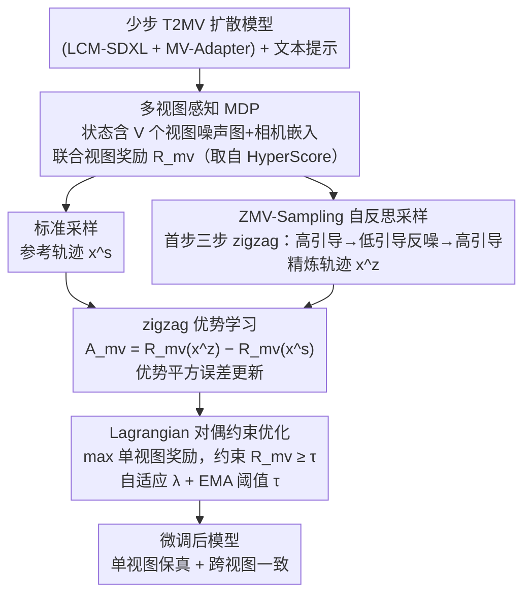

# Refining Few-Step Text-to-Multiview Diffusion via Reinforcement Learning

**会议**: CVPR2026  
**arXiv**: [2505.20107](https://arxiv.org/abs/2505.20107)  
**代码**: [ZiyiZhang27/MVC-ZigAL](https://github.com/ZiyiZhang27/MVC-ZigAL)  
**领域**: 图像生成  
**关键词**: 多视图生成, 扩散模型, 强化学习微调, 少步推理, 跨视图一致性

## 一句话总结

提出 MVC-ZigAL 框架，通过多视图感知 MDP 建模、zigzag 自反思优势学习和 Lagrangian 对偶约束优化，有效提升少步文本到多视图扩散模型的单视图保真度和跨视图一致性。

## 背景与动机

1. **文本到多视图生成需求增长**：T2MV 扩散模型需从单一文本提示联合生成同一场景的多个视角图像，在 3D 内容创建等场景中有重要价值。
2. **少步模型牺牲质量换速度**：LCM 等少步骨干网络将推理步数降至 8 步以下，但显著损失了图像保真度和跨视图一致性。
3. **现有 RL 方法无法直接迁移**：已有 RL 微调方法（DPOK、REBEL 等）面向单图生成设计，忽略了多视图间的协调优化。
4. **少步模型学习信号弱**：少步模型生成的样本质量普遍低且奖励值紧密聚集，导致标准 RL 方法的学习梯度不充分。
5. **单视图/联合视图奖励各有缺陷**：单视图奖励（PickScore）细粒度但忽视跨视图一致性，联合视图奖励（HyperScore）评估整体但缺乏逐视图反馈。
6. **权重加和方式依赖调参**：简单将两类奖励加权混合极度依赖权重选择，难以稳定平衡两个优化目标。

## 方法详解

### 整体框架

MVC-ZigAL 要解决的是：少步（≤8 步）T2MV 扩散模型为了快牺牲了单视图保真度和跨视图一致性，而现有 RL 微调（DPOK、REBEL 等）都是为单图设计、既不建模多视图协调，又在少步模型奖励紧密聚集时拿不到足够的学习梯度。它的方案是三件事串起来：先把 T2MV 去噪重构成一个能同时看到所有视图的多视图感知 MDP；再用 ZMV-Sampling 的“自反思”采样造出一条更优参考轨迹、据此做 zigzag 优势学习，给少步模型补上强学习信号；最后用 Lagrangian 对偶把“单视图保真”和“跨视图一致”这对目标转成带约束的优化，免去手动调权重。

### 关键设计

**1. 多视图感知 MDP：让奖励和动作都覆盖全部视图，而非逐图独立**

单图 RL 把每张图当独立 episode，无法表达多视图之间的协调。MVC-ZigAL 把 T2MV 去噪重建成多视图 MDP：每步状态 $s_t$ 同时包含全部 $V$ 个视图的噪声图与相机嵌入，动作 $a_t$ 是所有视图的去噪结果，并引入联合视图奖励 $\mathcal{R}_{\text{mv}}$（取自 HyperScore 的 overall 维度）评估整体质量。这个统一的 MDP 之上可以直接适配 MV-PG、MV-DPO、MV-RDL 三种基线，成为后续所有改进的公共底座。

**2. ZMV-Sampling + zigzag 优势学习：用结构化自精炼造出强学习信号**

少步模型生成的样本质量低、奖励值挤在一起，标准 RL 梯度太弱。ZMV-Sampling 只在去噪首步（$t=T$）做三步 zigzag：高引导去噪 → 低引导反向加噪 → 高引导再去噪——靠引导尺度差（$\omega_{\text{high}}$ vs $\omega_{\text{low}}$）形成“自反思”，条件对齐的特征在低引导反转后存活、不对齐的被抑制；之所以只放首步，是因为扩散早期决定全局几何，全步 zigzag 反而会过度平滑纹理。然后对同一 prompt 用标准采样和 ZMV-Sampling 各生成一条轨迹，定义 zigzag 优势 $\mathcal{A}_{\text{mv}} = \mathcal{R}_{\text{mv}}(\mathbf{x}^z) - \mathcal{R}_{\text{mv}}(\mathbf{x}^s)$，目标函数最小化“对数似然比差与优势值”的平方误差。相比 MV-RDL 用两条普通轨迹，这里的参考轨迹是结构化自精炼出来的，优势信号更强——reward gap 随训练逐步收敛，说明基模型本就内化了自精炼能力。

**3. Lagrangian 对偶约束优化：把“保真 vs 一致”从调参难题变成自适应约束**

简单把单视图奖励和联合视图奖励加权混合，极度依赖权重选择、难以稳定。MVC-ZigAL 改成带约束的形式：主目标最大化单视图奖励之和 $\sum_v R(\mathbf{x}_0^v, \mathbf{c})$，约束是联合视图奖励 $\geq \tau$，再用 Lagrangian 对偶引入乘子 $\lambda$ 得到统一奖励 $\mathcal{R}_{\text{mvc}} = \frac{R(\mathbf{x}_0^v, \mathbf{c}) + \lambda \cdot \mathcal{R}_{\text{mv}}}{1 + \lambda}$。更新时还配了两个自适应机制：约束被违反时用大步长 $\alpha^+$ 快速收紧、满足时用小步长 $\alpha^-$ 平稳放松，避免 $\lambda$ 振荡；阈值 $\tau$ 则用 EMA 跟踪当前策略的联合奖励水平自适应调整，早期鼓励探索、后期逐步收紧。这样既不用手调权重，也不用手设固定阈值。

### 损失函数 / 训练策略

- 主学习目标为 MV-ZigAL 的优势平方误差（对数似然比差对齐 zigzag 优势 $\mathcal{A}_{\text{mv}}$）
- 约束优化用 Lagrangian 对偶 + 自适应原始-对偶更新，乘子 $\lambda$ 按约束违反情况自适应步长，阈值 $\tau$ 用 EMA 自步调
- 基础设置：MV-Adapter + LCM-SDXL，8 步 6 视图；ZMV-Sampling 在训练时使单样本推理成本增加约 3 倍

## 实验关键数据

### 主实验（训练集 prompt，8 步 6 视图）

| 方法 | HyperScore Overall | PickScore |
|---|---|---|
| Baseline | 7.23 | 0.196 |
| MV-PG | 8.39 | 0.203 |
| MV-DPO | 8.00 | 0.200 |
| MV-RDL | 9.03 | 0.203 |
| **MV-ZigAL** | **9.17** | **0.205** |

### 泛化实验（MATE-3D unseen prompts，第 70 epoch）

| 方法 | HyperScore Overall | PickScore | HPSv2 | ImageReward |
|---|---|---|---|---|
| Baseline | 6.67 | 0.204 | 0.252 | -0.846 |
| MV-ZigAL | 6.95 | 0.205 | 0.254 | -0.770 |
| WS-ZigAL (w=0.5) | 6.83 | 0.217 | 0.270 | 0.183 |
| **MVC-ZigAL (First-Step)** | **7.04** | **0.217** | 0.268 | 0.180 |

### 消融分析

- **优势学习 vs 策略梯度**：MVC-ZigAL 在所有指标上优于 MVC-ZigPG（保留 zigzag 采样但用策略梯度），验证优势学习的贡献。
- **首步 vs 全步 zigzag**：首步 zigzag 在 HyperScore 上更优（7.04 vs 6.91），且无需额外推理开销。
- **约束优化 vs 加权和**：WS-ZigAL 需精细调参，wmv=0.1 时 HyperScore 仅 6.25；MVC-ZigAL 无需手动权重即稳定优于所有加权配置。
- **自适应 vs 固定阈值**：固定阈值 7.5 过松导致约束失效，9.0 过紧抑制单视图优化；EMA 自适应最优。
- **自适应 vs 固定步长**：小固定步长 (0.01) 对违反反应太慢，大固定步长 (0.1) 导致 $\lambda$ 振荡；自适应策略兼顾响应速度和稳定性。

## 亮点

- 首次将 RL 微调系统化扩展到少步 T2MV 扩散模型，提出完整的多视图感知 MDP 框架。
- Zigzag 自反思 + 优势学习的组合巧妙解决少步模型学习信号弱的问题，reward gap 随训练逐步收敛，说明基础模型已内化了自精炼能力。
- Lagrangian 对偶 + 自步调课程消除了手动调权重/阈值的需求，工程友好度高。
- 消融实验系统完善，每个设计决策都有量化验证。

## 局限与展望

- 仅在 MV-Adapter + LCM-SDXL 上验证，是否适用于其他多视图架构（如 Zero123++、Era3D）待考察。
- 联合视图奖励依赖 HyperScore，该评估器本身对 T2MV 生成的评估是否足够鲁棒值得探讨。
- 训练 prompt 集仅 45 个动物名，多样性有限；MATE-3D 评估也仅 160 条 prompt。
- ZMV-Sampling 在训练时将每个样本的推理成本增加约 3 倍（3 步 zigzag pass），训练效率有较大开销。
- 未探索与视频生成、3D 重建等下游任务的直接集成。

## 与相关工作的对比

- **T2I RL 微调**（DPOK、REBEL、PRDP）：面向单图设计，不建模跨视图协调；MVC-ZigAL 的多视图 MDP 是关键区别。
- **Zigzag Diffusion**：原始方法针对单图全步采样；本文将其适配到多视图首步调度并作为优势参考，而非直接改善推理。
- **MV-Adapter / SPAD**：多视图生成基础架构；MVC-ZigAL 作为正交的 RL 微调层可叠加使用。
- **DreamAlign 等 T2-3D RL**：使用 SDS 渲染回路优化 3D 对象；本方法直接在多视图图像层面优化，效率更高。

## 评分

- 新颖性: ⭐⭐⭐⭐ — 多视图 RL 微调是新颖且有意义的 setting，zigzag 优势学习和 Lagrangian 约束的组合原创性强
- 实验充分度: ⭐⭐⭐⭐ — 消融全面，但训练/评估 prompt 规模偏小
- 写作质量: ⭐⭐⭐⭐ — 公式推导清晰，层次分明，图表配合良好
- 价值: ⭐⭐⭐⭐ — 为少步多视图生成的 RL 对齐提供了实用且完整的框架

<!-- RELATED:START -->

## 相关论文

- [\[CVPR 2026\] Flash-DMD: Towards High-Fidelity Few-Step Image Generation with Efficient Distillation and Joint Reinforcement Learning](flash-dmd_towards_high-fidelity_few-step_image_generation_with_efficient_distill.md)
- [\[CVPR 2026\] InverFill: One-Step Inversion for Enhanced Few-Step Diffusion Inpainting](inverfill_one-step_inversion_for_enhanced_few-step_diffusion_inpainting.md)
- [\[ICLR 2026\] RIDER: 3D RNA Inverse Design with Reinforcement Learning-Guided Diffusion](../../ICLR2026/image_generation/rider_3d_rna_inverse_design_with_reinforcement_learning-guided_diffusion.md)
- [\[CVPR 2026\] Few-Step Diffusion Sampling Through Instance-Aware Discretizations](few-step_diffusion_sampling_through_instance-aware_discretizations.md)
- [\[CVPR 2026\] HiCoGen: Hierarchical Compositional Text-to-Image Generation in Diffusion Models via Reinforcement Learning](hicogen_hierarchical_compositional_text-to-image_generation_in_diffusion_models_.md)

<!-- RELATED:END -->
