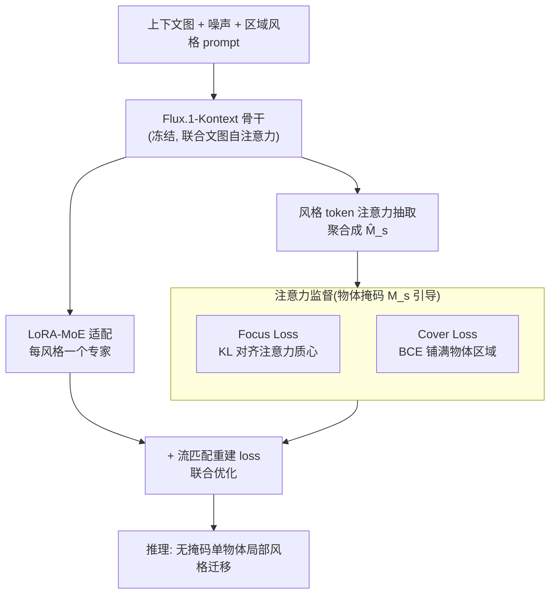

# RegionRoute: Regional Style Transfer with Diffusion Model

**会议**: CVPR 2026  
**论文**: [CVF Open Access](https://openaccess.thecvf.com/content/CVPR2026/html/Chen_RegionRoute_Regional_Style_Transfer_with_Diffusion_Model_CVPR_2026_paper.html)  
**代码**: 无  
**领域**: 扩散模型 / 图像编辑 / 风格迁移  
**关键词**: 局部风格迁移, 注意力监督, LoRA-MoE, 区域风格编辑评分, 扩散模型

## 一句话总结
RegionRoute 在训练阶段用目标物体的二值掩码去监督扩散模型里「风格词」对应的注意力图，把风格 token 和具体物体区域绑定起来，从而在**推理时不需要任何掩码**就能把风格只施加到单个物体上，实现真正的局部风格迁移，并配套提出了 RSE-Score 来同时衡量「区域内风格对不对」和「区域外有没有被破坏」。

## 研究背景与动机

**领域现状**：扩散驱动的风格迁移（基于 Stable Diffusion / Flux 系列）已经能把艺术风格高质量地迁移到整张图上，指令式图像编辑（InstructPix2Pix、Flux.1-Kontext、Qwen-Image-Edit 等）也能按文字改图。

**现有痛点**：但这些方法几乎都把风格当作一个**全局特征**来处理，风格会均匀地铺满整张图，无法「只把这只猫改成像素风、其它地方不动」。要做局部风格只能走两段式：先全局风格化整张图，再用人手准备的掩码把风格化区域和原图拼接回去。这条路要精准的掩码、拼接边界处会出现可见的接缝（seam），泛化性差、不实用。

**核心矛盾**：扩散模型内部的 cross/self-attention 本来就学到了「文字概念 ↔ 图像区域」的空间对应关系——模型其实「看得见」哪块是目标物体，但这些注意力**从来没有被显式引导去把风格概念和具体物体绑定**。于是即便定位是对的，风格还是会全局漂移（global style shift）。

**本文目标**：让扩散模型自己学会「风格该往哪儿贴」，做到推理时**无掩码、无外部空间控制**的单物体局部风格迁移；同时补上一个能量化局部风格保真度 + 未编辑区域保留度的评测指标。

**切入角度**：既然模型已经有注意力图，那就不要在推理时硬塞掩码，而是在**训练时**用物体掩码去监督风格 token 的注意力，把「风格定位」这件事内化进权重里。

**核心 idea**：用「注意力监督」代替「推理掩码」——训练时把风格 token 的注意力分布对齐到目标物体掩码，让模型把风格 grounding 学进去，推理时就能自动局部化。

## 方法详解

### 整体框架

RegionRoute 建立在预训练的 **Flux.1-Kontext**（一个基于 DiT、对图像 token 和文本 token 做联合自注意力的扩散编辑模型）之上。输入是「上下文图像 + 加噪输入 + 一句区域风格 prompt（如 "make the man in pixel-art style"）」，目标是重建出「只有目标物体被风格化」的图像。整条 pipeline 做四件事：① 从 DiT 各层注意力里把「风格 token → 图像 token」这一条注意力切片抽出来，聚合成一张风格注意力图 $\hat{M}_s$；② 用目标物体的二值掩码 $M_s$ 去监督这张注意力图，靠 Focus loss 和 Cover loss 两个互补目标把注意力「压」到物体上且铺满；③ 用 LoRA-MoE 给每种风格挂一个独立的轻量专家，骨干冻结只学「往哪贴」、专家学「怎么画」；④ 训练目标在标准的扩散噪声重建 loss 之上叠加这两个注意力监督 loss。推理时不再需要掩码，模型自己就把风格局部化了。

### 关键设计

**1. 注意力抽取与监督信号构造：把「风格 token 看哪里」显式拎出来**

模型要被监督，首先得有个可监督的量。Flux.1-Kontext 每个 DiT block 都对图像 + 文本 token 做多头自注意力。给定 prompt 里的风格短语（如 "pixel-art style"），作者取「图像 query $Q_{\text{img}}$ → 风格 token $K_s$」这一条注意力切片，然后在多头、多层、多个风格 token 上做平均，得到聚合后的风格注意力图：

$$\hat{M}_s = \frac{1}{L}\sum_{\ell \in \mathcal{L}} \frac{1}{H}\sum_{h=1}^{H} \frac{1}{|K_s|}\sum_{k\in K_s} A^{(\ell)}_{h}[Q_{\text{img}}, k]$$

其中 $L$ 是参与监督的层集合、$H$ 是注意力头数。$\hat{M}_s \in \mathbb{R}^{h\times w}$ 表示每个空间 token 对风格 token 的注意力强度。监督用的 ground-truth 掩码 $M_s$ 则是把物体分割图下采样到注意力图同分辨率得到。这一步是后面所有监督的前提——它把「风格往哪贴」从一个隐藏在权重里的隐变量，变成一张可以拿掩码去对齐的显式热力图。

**2. Focus Loss + Cover Loss：一个管「贴对位置」，一个管「贴满整块」**

只有一张注意力图还不够，关键是用什么目标去逼它。作者发现单一目标会偏科，于是设计了两个互补的 loss。**Focus loss** 把预测注意力和掩码都当作归一化的概率分布，最小化两者的 KL 散度：

$$\mathcal{L}_{\mathrm{focus}} = \sum_{s=1}^{S} \mathrm{KL}\!\Big( \mathrm{softmax}(\hat{M}_s/\tau) \;\Big\|\; \mathrm{norm}(M_s) \Big)$$

其中 $\mathrm{norm}(Z)=Z/\sum Z$，$\tau$ 控制注意力分布的尖锐程度。它管的是**全局形状对齐**——让注意力质心落在物体所在的那块区域。但 KL 对齐有个漏洞：模型可以把注意力塌缩到物体里很小的一点上，照样让分布「形状」看着对。于是再加 **Cover loss**，一个在 token 级别做的数值稳定的二值交叉熵：

$$\mathcal{L}_{\mathrm{cover}} = \sum_{s=1}^{S} \mathrm{BCE\_logits}\!\big(\alpha\,\hat{M}_s,\ M_s\big)$$

$\alpha$ 是放大注意力幅值、让梯度更强的对比因子。它逐 token 地惩罚物体外的注意力（$M_s=0$）、奖励物体内的注意力（$M_s=1$），强迫注意力**密集且均匀地铺满**整个物体而不是缩成一点。两者合起来：Focus 管「贴对位置」，Cover 管「贴满整块」，结果就是空间一致、不漏不溢的风格施加。论文的注意力可视化（Figure 4）也印证：单用任一个 loss 注意力都会溢到周边，只有联合目标才干净地锁在目标物体（如那台摩托车）上。

**3. LoRA-MoE 多风格适配：骨干学「往哪贴」，专家学「怎么画」**

要支持多种风格，如果用一个 LoRA 去 fine-tune 所有风格，不同风格会互相干扰、风格保真度下降。作者改成给**每种风格分配一个独立的轻量 LoRA 专家**，挂在同一个共享的扩散骨干上。训练时只激活当前风格对应的那个专家，骨干保持冻结，以保住前面学到的「注意力 grounding 的空间推理能力」；推理时按目标风格 token 选对应专家，即插即用。这套设计把职责切干净了：**共享骨干负责「风格该往哪贴」（空间定位），各专家负责「这个风格长什么样」（渲染方式）**。好处有三：(i) 参数高效——加新风格不用重训骨干；(ii) 专门化——每个专家学到各自独特的风格图案；(iii) 稳定——共享骨干保证所有专家的空间对齐一致。

### 损失函数 / 训练策略

总目标在标准扩散噪声预测 loss $\mathcal{L}_\epsilon = \|\hat{\epsilon}-\epsilon\|_2^2$ 之上叠加两个注意力监督项：

$$\mathcal{L} = \mathcal{L}_{\epsilon} + \lambda_f\,\mathcal{L}_{\mathrm{focus}} + \lambda_c\,\mathcal{L}_{\mathrm{cover}}$$

实现上：在 Flux.1-Kontext 上用 LoRA-MoE 微调，单卡 NVIDIA GH200（120 GB），$1024\times1024$ 分辨率、bf16 混合精度、8-bit Adam；LoRA rank=4、学习率 $1\times10^{-4}$、batch size=2、梯度累积 4，常数学习率训 5000 步无 warmup；Focus / Cover loss 权重分别取 0.1 / 0.2。训练数据用 TokenCompose 的 Grounded COCO 子集，随机采 150 个图-文对，每张选一个目标物体（带二值掩码），用扩散风格迁移模型生成并与原图合成得到伪 GT；覆盖 pixel art、cyberpunk、expressionism、line art 四种风格，共 600 张训练样本（每风格 150 张）。

## Regional Style Editing Score（RSE-Score）

现有指标（FID、CLIP 相似度）只看全局外观，既不知道风格有没有**精准落在目标区域**，也不知道未编辑区域有没有被保住。作者提出 **RSE-Score**，专门评单物体局部风格迁移，拆成两块：

- **Regional Style Matching（RSM，↑）**：把编辑后图像裁到目标掩码的最小外接框（带小 padding），用 CLIP 算裁剪区域和风格文本的相似度，线性映射到 $[0,1]$：

$$\text{RSM} = \frac{1}{2}\big(1 + \cos\!\big(f_{\text{img}}(\hat{x}_{\text{crop}}), f_{\text{text}}(s)\big)\big)$$

只在编辑区域内评风格，避开背景干扰。

- **Identity Preservation（区域外保真，两个独立指标）**：在背景区 $(1-M)$ 上算 **掩码 LPIPS**（感知一致性，↓）和 **掩码 MSE**（像素一致性，↓），分别度量感知层面和像素层面的未编辑区保留度。两者独立汇报，给出更清晰的诊断视角。

合起来：RSM 看「编辑区风格对不对」，$\text{LPIPS}_{\text{bg}}$ / $\text{MSE}_{\text{bg}}$ 看「区域外有没有被破坏」，构成局部风格迁移的完整基准。

## 实验关键数据

### 主实验

在 COCO、Pascal VOC、BIG 三个带像素级掩码的分割数据集上对比（以下取 COCO 数据，格式 mean）：

| 方法 | RSM ↑ | LPIPSbg ↓ | MSEbg ↓ | 特点 |
|------|-------|-----------|---------|------|
| Flux.1-Kontext | 0.6126 | 0.4546 | 0.1699 | 风格强但全局漂移、背景破坏大 |
| Qwen-Image-Edit | 0.6235 | 0.7530 | 0.4398 | RSM 最高但背景失真最严重 |
| Style-Editor | 0.6071 | 0.2235 | 0.0093 | 能局部化但风格控制弱、易泄漏 |
| ICEdit | 0.6086 | 0.3512 | 0.1568 | 中等 RSM、区域控制不稳 |
| AnyEdit | 0.6085 | 0.6895 | 0.2633 | 区域控制差、输出语义混乱 |
| Instruct-Pix2Pix | 0.5978 | 0.1867 | 0.0516 | 背景保得好但风格化弱 |
| SD2-Inpainting | 0.6028 | 0.0859 | 0.0039 | 背景几乎不动但风格化能力有限 |
| **RegionRoute（本文）** | **0.6128** | **0.2103** | **0.0729** | RSM 有竞争力 + 背景大幅保留，平衡最佳 |

结论：现有方法要么偏风格保真（Flux/Qwen 那种 RSM 高但背景烂）、要么偏背景保留（Inpainting 那种背景稳但风格弱），**很少两者兼得**；RegionRoute 在保持有竞争力的 RSM 的同时把 $\text{LPIPS}_{\text{bg}}$ / $\text{MSE}_{\text{bg}}$ 压得很低，说明编辑既局部又语义连贯。

VLM 可控性评测（Qwen2.5-VL-7B-Instruct 回答四个二值问题，COCO 数据）：

| 方法 | Q1 物体在目标风格↑ | Q2 背景在目标风格↓ | Q3 物体在反风格↓ | Q4 背景在反风格↓ |
|------|------|------|------|------|
| Qwen-Image-Edit | 0.98 | 0.86 | 0.01 | 0.00 |
| Flux.1-Kontext | 0.63 | 0.44 | 0.08 | 0.06 |
| AnyEdit | 0.50 | 0.41 | 0.57 | 0.47 |
| **RegionRoute** | **0.73** | **0.07** | 0.12 | 0.00 |

RegionRoute 在 Q1（物体风格化成功）较高的同时，Q2（背景被风格污染）极低（0.07 vs Qwen 的 0.86），说明风格泄漏少、语义可靠。Qwen 的 Q1 虽达 0.98，但 Q2 高达 0.86——典型的全局风格化。

### 消融实验

| 配置 | RSM↑ | LPIPSbg↓ | MSEbg↓ | 说明（COCO） |
|------|------|----------|--------|------|
| Full（rank=4） | 0.6128 | 0.2103 | 0.0729 | 完整模型 |
| w/o Lcover | 0.6120 | 0.2174 | 0.0730 | 去掉覆盖 loss，注意力易塌缩 |
| w/o Lfocus | 0.6127 | 0.2132 | 0.0740 | 去掉聚焦 loss，定位变差 |
| w/o Double（仅 Single 流加 LoRA） | 0.6168 | 0.4225 | 0.1409 | RSM 略升但背景一致性崩 |
| w/o Single（仅 Double 流加 LoRA） | 0.6190 | 0.5203 | 0.2284 | 同上，背景破坏更严重 |
| Rank=8 | 0.6137 | 0.2007 | 0.0752 | 提秩，背景一致性略好 |
| Rank=16 | 0.6126 | 0.1876 | 0.0671 | 秩越高背景越好，但 rank=4 已够用 |

### 关键发现

- **两个 loss 互补、缺一不可**：去掉 Lcover 或 Lfocus 三个数据集上全指标一致退化；注意力可视化显示单用任一个都会注意力溢出到周边，只有联合目标才干净锁在目标物体。
- **双流都要挂 LoRA**：只给 Single 或 Double 其中一条流加 LoRA 时，RSM 反而**略升**（物体看着更"on-style"），但 $\text{LPIPS}_{\text{bg}}$ / $\text{MSE}_{\text{bg}}$ 大幅恶化——即模型把目标区做得更夸张、却**失去了对其余区域的控制**。这说明 RSM 高不等于好，必须配合背景指标一起看。
- **低秩已够用**：rank 从 4→8→16 各指标单调略好，但 rank=4 已有很强的适配和泛化，验证了 LoRA-MoE 在极紧凑约束下的有效性。

## 亮点与洞察
- **把「推理时塞掩码」搬到「训练时监督注意力」**：这是最巧的换位——既然模型本来就有注意力图，不如训练阶段把风格 token 的注意力对齐到掩码，推理时就彻底甩掉掩码和外部分割，干净利落地解决了两段式拼接的接缝问题。
- **Focus + Cover 的分工很有借鉴价值**：KL 管「形状对齐」、BCE 管「密集铺满」，一句话点破了「只用 KL 会注意力塌缩」这个隐蔽 failure mode；这种「定位 loss + 覆盖 loss」的组合可以迁移到任何需要把注意力对齐到区域的任务（如指代分割引导生成、局部 inpainting）。
- **「骨干学定位、专家学渲染」的解耦**：LoRA-MoE 把空间 grounding（共享、稳定）和风格外观（专家、可插拔）拆开，加新风格零成本，是个干净的模块化设计。
- **RSM 高 ≠ 编辑好**：论文用消融直接戳穿了「只看风格相似度」的评测盲区——单流 LoRA 让 RSM 升了背景却崩了，所以必须同时报背景保真，这正是 RSE-Score 存在的意义。

## 局限与展望
- 作者承认：对**小物体、被遮挡物体、语义模糊物体**仍有挑战，需要更强的空间对齐能力。
- 只做了**文字驱动**的局部风格迁移，尚未支持示例图（example-based）驱动的风格迁移，作者把后者列为后续方向。
- 自己观察的局限：训练只用了 150 张图、4 种风格、600 个伪 GT 样本，规模偏小；伪 GT 是「全局风格化 + 合成」拼出来的，质量上限受制于所用的风格迁移模型；评测也只覆盖单物体场景，多物体/多风格同图的可控性未验证。
- 改进思路：把伪 GT 生成换成更精细的实例级风格化、扩到多物体多风格联合编辑、引入示例图条件，应能进一步提升泛化。

## 相关工作与启发
- **vs Flux.1-Kontext / Qwen-Image-Edit（全局编辑器）**：它们靠 cross-attention 隐式定位、风格当全局特征，RSM 很高但背景大面积失真；本文显式监督注意力，牺牲一点点 RSM 换来背景保真度的大幅提升，做到真·局部化。
- **vs 两段式（全局风格化 + 手工掩码拼接）**：两段式要精准掩码、边界有接缝；本文推理时无掩码、无接缝，泛化性更好。
- **vs TokenCompose / Attend-and-Excite（注意力监督/调制）**：TokenCompose 监督 cross-attention 把文本 token 绑到物体上、Attend-and-Excite 调注意力激活强化欠表达区域；本文沿这条路，但**专门针对风格 token**做监督，并配上 Cover loss 解决塌缩，目标是区域感知的风格迁移而非物体生成。
- **vs SD2-Inpainting / Instruct-Pix2Pix（背景保留强）**：它们背景几乎不动但风格化能力弱；本文在保住背景的同时风格化更到位。

## 评分
- 新颖性: ⭐⭐⭐⭐ 「训练时注意力监督替代推理掩码」做局部风格迁移角度清晰，Focus/Cover 互补 loss 与 LoRA-MoE 解耦都很扎实，但每个组件单看都不算全新。
- 实验充分度: ⭐⭐⭐ 三数据集 + VLM 评测 + 完整消融较系统，但训练规模偏小（150 图/4 风格）、只测单物体场景。
- 写作质量: ⭐⭐⭐⭐ 动机—方法—指标—实验逻辑顺畅，注意力监督和评测设计讲得清楚。
- 价值: ⭐⭐⭐⭐ 无掩码局部风格迁移 + 配套 RSE-Score 对可控图像编辑实用性有实际推进，loss 组合与评测思路可迁移。

<!-- RELATED:START -->

## 相关论文

- [\[CVPR 2026\] Style-GRPO: Semantic-Aware Preference Optimization for Image Style Transfer Guided by Reward Modeling](style-grpo_semantic-aware_preference_optimization_for_image_style_transfer_guide.md)
- [\[CVPR 2026\] A Style is Worth One Code: Unlocking Code-to-Style Image Generation with Discrete Style Space](a_style_is_worth_one_code_unlocking_code-to-style_image_generation_with_discrete.md)
- [\[CVPR 2026\] Harmonic Canvas: Inversion-Free Editing for Visually-Guided Music Style Transfer](harmonic_canvas_inversion-free_editing_for_visually-guided_music_style_transfer.md)
- [\[CVPR 2026\] Diffusion-Based Makeup Transfer with Facial Region-Aware Makeup Features](diffusion-based_makeup_transfer_with_facial_region-aware_makeup_features.md)
- [\[CVPR 2026\] StyleGallery: Training-free and Semantic-aware Personalized Style Transfer from Arbitrary Image References](stylegallery_training-free_and_semantic-aware_personalized_style_transfer_from_a.md)

<!-- RELATED:END -->
