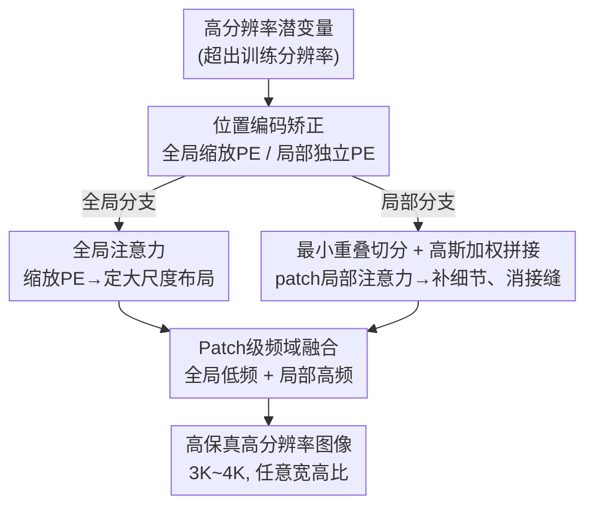

# ResDiT: Evoking the Intrinsic Resolution Scalability in Diffusion Transformers

**会议**: CVPR 2026  
**论文**: [CVF Open Access](https://openaccess.thecvf.com/content/CVPR2026/html/Ma_ResDiT_Evoking_the_Intrinsic_Resolution_Scalability_in_Diffusion_Transformers_CVPR_2026_paper.html)  
**代码**: 无  
**领域**: 扩散模型 / 图像生成  
**关键词**: 免训练高分辨率生成、Diffusion Transformer、位置编码、局部注意力、频域融合

## 一句话总结
ResDiT 通过机制分析发现 DiT 在超分辨率推理时「位置编码决定布局、注意力感受野决定细节」，据此把原始注意力拆成「缩放位置编码的全局分支 + patch 级局部分支」并在频域融合二者，免训练、不依赖低分图引导就能让 FLUX/SD3 直出 3K–4K 高保真图像。

## 研究背景与动机
**领域现状**：FLUX、SD3 这代文生图模型已经全面转向 Diffusion Transformer（DiT），靠全局注意力建模长程依赖、在训练分辨率上能出高保真图。但它们几乎只能在训练分辨率附近工作，一旦把推理分辨率拉到 3K、4K，画面就会明显退化甚至彻底崩坏。

**现有痛点**：直接在高分辨率上训练/微调要海量高清数据和算力，不现实。于是大量免训练方法被提出，但分两类各有问题：一类是为 U-Net 架构设计的（如 ScaleCrafter 用空洞卷积扩大感受野、PBC 用虚拟零填充边界），强依赖卷积结构，迁移不到 DiT；另一类专为 DiT 设计，但几乎都走「两阶段」路线——先生成一张基准分辨率图，再用它的去噪轨迹去引导高分辨率采样（I-Max、HiFlow 等）。

**核心矛盾**：两阶段方法本质上把高分辨率生成当成了「超分任务」——高分图被低分图的分布牢牢拽住，结构虽稳但细节常被抹平（HiFlow 在孩子脸、树干纹理、远山轮廓上都过度平滑）。它依赖外部引导，而非真正释放模型自身直接生成高分内容的能力，还平白增加了 pipeline 复杂度。

**切入角度**：作者不打补丁，而是回到机制层面问「DiT 高分崩坏到底坏在哪」。注意力是 DiT 里决定 token 空间交互的核心，于是他们对注意力里的两个空间因子——位置编码（PE）和注意力感受野范围——做受控干预实验（论文 Fig. 2）：(a) 基准分辨率全局注意力 + 原始 PE，布局细节都好；(b) 直接搬到高分辨率，主体被缩小、错位，发生「布局崩坏」，说明外推的 PE 和被放大的注意力场失配；(c) 换上缩放后的 PE，布局恢复了但细节模糊；(d) 给每个 patch 贴基准分辨率 PE，局部结构对了细节仍差；(e) 进一步用 patch 级局部注意力，细节才显著变好。

**核心 idea**：这串实验得出一个清晰的机制结论——**位置编码决定空间布局，注意力感受野尺度决定细节保真度**。顺着这个洞察，把注意力拆成「修布局的全局分支」和「补细节的局部分支」，再设法把两者的优点干净地合起来，就能免训练地直出高分图。

## 方法详解

### 整体框架
ResDiT 不改权重、不依赖基准分辨率图，只在推理时把 DiT 每个 block 里原本那一次「全分辨率全局注意力」重构成两条互补分支并行跑：**全局分支**用缩放后的位置编码做全局注意力，负责把整张图的大尺度布局摆正；**局部分支**把高分特征图切成与训练分辨率匹配的 patch，在每个 patch 内做局部注意力，负责恢复精细纹理。为了让局部分支切 patch 不留接缝，作者用「最小重叠切分 + 高斯加权拼接」保证 patch 边界平滑无网格伪影。最后用「patch 级频域融合」把两支的输出在频率域里合并——取全局分支的低频（布局结构）+ 局部分支的高频（细节），得到既结构连贯又细节丰富的高分输出。推理时还按「去噪由粗到细」的规律做时间步调度：前 10 步只用全局分支定结构、后 15 步只用局部分支抠细节、中间步用频域融合兼顾两者。

### 关键设计

**1. 位置编码矫正：双分支各用一套 PE，把布局先摆正**

布局崩坏的根因是原始 PE 外推到高分辨率时编码了错误的位置信息。作者针对两个分支给出两套 PE。全局分支用 **PE Scaling（插值）**：把高分特征图的位置索引等比缩回训练分辨率，让位置信息落在预训练模型「认识」的范围内，从而保住全局结构骨架。设高分特征图尺寸为 $H\times W$、训练分辨率为 $h\times w$，原始 2D 索引 $(p_h,p_w)\in\{0,\dots,H-1\}\times\{0,\dots,W-1\}$ 被缩放为

$$(p_h,p_w)\in\Big\{\tfrac{0}{s_h},\tfrac{1}{s_h},\dots,\tfrac{H-1}{s_h}\Big\}\times\Big\{\tfrac{0}{s_w},\dots,\tfrac{W-1}{s_w}\Big\},\quad s_h=H/h,\ s_w=W/w$$

缩放后的索引再去算位置编码（与 RoPE 等编码方案都兼容，因为只操作索引）。局部分支用 **Patch-wise Independent PE**：给每个 patch 配一套独立的、基准分辨率范围内的 PE，让每个 patch 内的局部结构都对，从而强化细节生成。一句话：全局分支靠缩放 PE 定「整张图怎么摆」，局部分支靠独立 PE 保「每块内部怎么长」。

**2. patch 切分与拼接：让局部注意力既补细节又不留接缝**

把全分辨率注意力硬塞进训练时没见过的尺度会模糊细节，最自然的解法是把注意力限制在和训练分辨率匹配的 patch 内；但简单按网格硬切会在 patch 边界留下可见接缝和网格伪影。作者用两招治这个病。**Minimum-Overlap Partitioning（最小重叠切分）**：让相邻 patch 略微重叠以共享边界上下文。沿长度为 $H$、patch 大小为 $h$ 的某一轴，取整数 $N>H/h$，第 $k$ 个 patch 起点为 $t_k=\frac{(k-1)(H-h)}{N-1}$，使首块从 0 开始、末块恰好结束于 $H$、相邻步长小于 $h$，从而用尽量少的分块数同时保证全覆盖和正重叠。**Gaussian Weighting Splicing（高斯加权拼接）**：拼接重叠区时不等权平均，而是按到 patch 中心的距离给高斯权重。对落在重叠区的 token $p$，覆盖它的窗口集 $W(p)$ 中第 $i$ 个 patch 权重为

$$w_i(p)=\exp\!\Big(-\frac{\lVert p-c_i\rVert_2^2}{2\sigma^2}\Big)$$

最终融合特征 $f(p)=\frac{\sum_{i\in W(p)}w_i(p)f_i(p)}{\sum_{i\in W(p)}w_i(p)}$（$c_i$ 为 patch 中心）。离哪个 patch 中心近就更信哪个，特征过渡更平滑，进一步压掉边界伪影。

**3. patch 级频域融合：在频率域里各取所长地合并两支**

全局分支贡献可靠的低频布局结构，局部分支擅长高频细节——这种互补性天然适合在频率域分离再重组。而且频率成分在空间上分布不均（纹理/边缘区高频多、平滑区低频多），所以融合按 patch 做、而非全局一刀切的频率滤波，才能逐区自适应。具体地，把全局输出特征 $x_g$ 用同样的最小重叠切分切成 $\{x_g^i\}$，与局部 patch 输出一一对应；对每对 $(x_g^i,x_l^i)$ 做 FFT 得 $\hat x_g^i=\mathcal F(x_g^i)$、$\hat x_l^i=\mathcal F(x_l^i)$，再用二值掩码 $M$ 在频谱上融合并逆变换回空间域：

$$x^i=\mathcal F^{-1}\big(M\odot\hat x_g^i+(1-M)\odot\hat x_l^i\big)$$

即保留全局分支的低频、保留局部分支的高频（归一化频率截止设为 0.2），实现布局级与细节级成分的干净分离与有效整合。

## 实验关键数据

### 主实验
基座为 FLUX.1-dev，采样 35 步、guidance scale 3.5，单卡 RTX 4090。收集 500 条高质量 caption 生成图像；KID 对 LAION-Aesthetics-v2 6.5+ 的 2K 真实高清图算，IS 看多样性/清晰度，CLIP Score 看文图对齐，并补充 patch 版 KID/IS 与 20 人用户研究（1–5 分）。对比对象 Demofusion / DiffuseHigh / I-Max / HiFlow 全是「先出基准图再外推」的两阶段法。

| 分辨率 | 方法 | KID↓ | KIDp↓ | IS↑ | ISp↑ | CLIP↑ | User↑ |
|--------|------|------|-------|-----|------|-------|-------|
| 3072² | Demofusion | 0.0211 | 0.0342 | 12.20 | 10.21 | 31.92 | 3.1 |
| 3072² | DiffuseHigh | 0.0195 | 0.0213 | 12.61 | 10.13 | 32.74 | 4.2 |
| 3072² | I-Max | 0.0192 | 0.0207 | 12.96 | 10.48 | 32.73 | 4.2 |
| 3072² | HiFlow | 0.0190 | 0.0194 | 12.87 | 10.67 | 32.76 | 4.6 |
| 3072² | **ResDiT** | **0.0189** | 0.0199 | 12.91 | **10.87** | **32.85** | **4.8** |
| 4096² | HiFlow | 0.0203 | 0.0245 | 11.65 | 10.12 | 32.74 | 4.3 |
| 4096² | **ResDiT** | 0.0217 | 0.0252 | 11.46 | 9.97 | 32.71 | 4.3 |

在 3072×3072 上 ResDiT 取得最佳 KID、最高 CLIP 与最高 ISp 和用户分（4.8），且不靠任何基准分辨率输入。4096×4096 上 KID/IS 略掉——作者归因于单阶段高分生成本身更难：两阶段法的输出紧贴自己生成的低分图分布，指标自然好看；ResDiT 直接在高分噪声空间采样，细节更真更丰富但和原模型生成分布有偏移，反映到 KID/IS 上略低。

### 消融实验
消融以定性图（论文 Fig. 6）为主，定量在附录。

| 配置 | 现象 | 说明 |
|------|------|------|
| Full（PES+PIPE+PSF） | 结构连贯 + 细节锐利 | 完整模型 |
| w/o PES | 结构完全崩坏 | 退回原始 PE，全局布局失控，证明 PES 是高分结构的根本 |
| w/o PIPE | 布局尚可但细节严重退化 | 去掉 patch 独立 PE，局部保真垮掉 |
| w/o PSF | 重复生成伪影 + 整体模糊 | 把频域融合换成空间域相加平均，无法各取所长 |
| w/o MOP & GWS | 明显边界/网格伪影 | 不重叠切分，patch 边界不连续 |
| 仅 MOP | 接近完整但局部仍有残留伪影 | 重叠缓解可见性但增加伪影数量、损伤细节 |

### 关键发现
- **三件套各管一段、缺一不可**：PES 管全局结构（去掉直接崩）、PIPE 管局部细节（去掉细节烂）、PSF 负责把两者在频域无损合并（去掉就出重复伪影+模糊）。
- **重叠切分不能只靠重叠**：单用 MOP 已接近完整效果，但必须配高斯加权拼接 GWS 才能真正消掉边界伪影、不伤细节。
- **单阶段的代价是分布偏移**：ResDiT 在 4K 上 KID/IS 略输两阶段法，是「直采高分空间」换来的真实细节与多样性的合理代价，而非方法缺陷——CLIP 与用户分仍有竞争力。
- **下游兼容**：可无缝接 ControlNet（depth/HED 边缘图）做结构可控的 3072² 生成，且原生支持任意宽高比（2048×4096、4096×2048）。

## 亮点与洞察
- **先做机制分析再设计方法**：Fig. 2 的受控干预把「PE 管布局 / 注意力感受野管细节」这个解耦结论钉死，后续每个模块都是这条洞察的直接产物，方法因此显得「该这么做」而非堆 trick。
- **频域分工很优雅**：低频=布局、高频=细节，本就是图像的天然分解，用 FFT + 二值掩码 patch 级融合比空间域相加干净得多，还能逐区自适应频率成分。
- **真·免训练、不依赖低分引导**：跳出「高分=超分」的两阶段框架，直接在高分噪声空间采样，是和现有 SOTA 最本质的区别，也解释了它指标与画质的取舍。
- **时间步调度可迁移**：前期全局定结构、后期局部抠细节、中段融合，这套「coarse-to-fine 分阶段切换注意力」的调度思路可复用到其他需要在不同尺度间切换的扩散推理任务。

## 局限与展望
- **4K 上指标略逊**：单阶段直采带来分布偏移，KID/IS 在 4096² 不及两阶段法；作者自己也点明这是设计取舍。若想兼顾分布相似度，可能需要轻量的分布对齐而非回到低分引导。
- **依赖人工超参**：频率截止 0.2、时间步分配（10/15/中间）、patch 数 $N$、高斯 $\sigma$ 等都是经验设定，跨基座/跨分辨率是否稳定、能否自适应未充分讨论。
- **评测偏主观**：核心证据大量靠定性图与用户研究，定量消融放在附录，难以严格量化各模块贡献幅度。
- **计算开销**：双分支并行 + patch 级 FFT 融合相比单次全局注意力会增加推理成本，正文只说延迟对比在附录，未在主文给出量化代价。

## 相关工作与启发
- **vs HiFlow / I-Max（两阶段 DiT 免训练法）**：它们先生成基准分辨率图再用其轨迹引导高分采样，本质把高分当超分、输出被低分分布拽住导致纹理过平滑；ResDiT 不要低分引导、直采高分空间，结构靠缩放 PE、细节靠局部注意力，画质更真但分布偏移使 KID/IS 在极高分时略低。
- **vs ScaleCrafter / PBC（U-Net 免训练法）**：它们靠空洞卷积/虚拟零填充扩大或修正卷积感受野，强绑定 U-Net，无法迁移到 DiT；ResDiT 直接面向 Transformer 的注意力与位置编码做手术。
- **vs 直接高分训练/微调**：后者要高清数据与大算力；ResDiT 零训练即插即用于现成 FLUX/SD3。

## 评分
- 新颖性: ⭐⭐⭐⭐⭐ 用机制分析把「PE 管布局、注意力感受野管细节」解耦，并据此重构注意力为双分支 + 频域融合，跳出两阶段超分范式。
- 实验充分度: ⭐⭐⭐⭐ 对比 4 个 SOTA、含 patch 指标与用户研究、消融覆盖全部模块，但定量消融与延迟对比都放附录、4K 指标偏弱。
- 写作质量: ⭐⭐⭐⭐⭐ 从受控实验到方法推导逻辑链清晰，机制叙事让每个设计都有据可依。
- 价值: ⭐⭐⭐⭐ 免训练直出 3K–4K、兼容 ControlNet 与任意宽高比，对 DiT 高分生成实用性强。

<!-- RELATED:START -->

## 相关论文

- [\[CVPR 2026\] Training-free Mixed-Resolution Latent Upsampling for Spatially Accelerated Diffusion Transformers](training-free_mixed-resolution_latent_upsampling_for_spatially_accelerated_diffu.md)
- [\[CVPR 2026\] Region-Adaptive Sampling for Diffusion Transformers](region-adaptive_sampling_for_diffusion_transformers.md)
- [\[CVPR 2026\] SpotEdit: Selective Region Editing in Diffusion Transformers](spotedit_selective_region_editing_in_diffusion_transformers.md)
- [\[CVPR 2026\] PixelDiT: Pixel Diffusion Transformers for Image Generation](pixeldit_pixel_diffusion_transformers_for_image_generation.md)
- [\[CVPR 2026\] ResCa: Residual Caching for Diffusion Transformers Acceleration](resca_residual_caching_for_diffusion_transformers_acceleration.md)

<!-- RELATED:END -->
