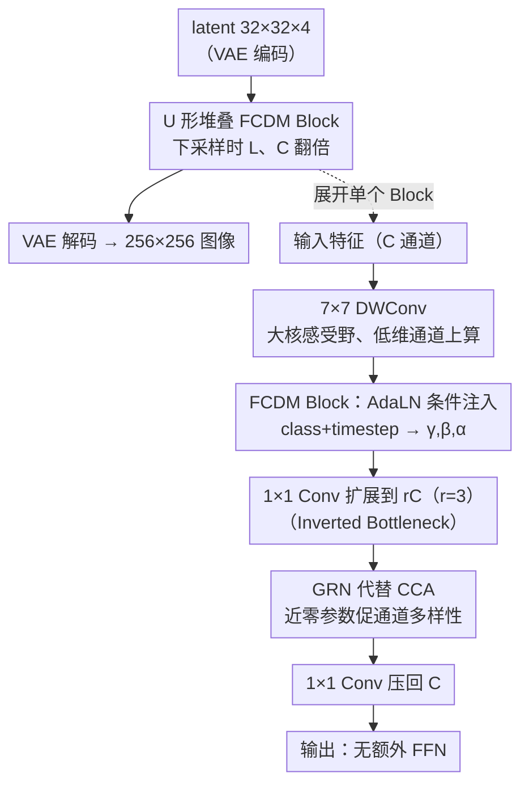

# Reviving ConvNeXt for Efficient Convolutional Diffusion Models

**会议**: CVPR 2026  
**arXiv**: [2603.09408](https://arxiv.org/abs/2603.09408)  
**代码**: 有（官方实现已公开）  
**领域**: 图像生成  
**关键词**: 扩散模型, ConvNeXt, 全卷积, 高效生成, 图像生成  
**机构**: KAIST, ETH Zürich, ISTI-CNR, University of Pisa

## 一句话总结
本文提出FCDM（Fully Convolutional Diffusion Model），将ConvNeXt架构适配为条件扩散模型backbone，仅用DiT-XL 50%的FLOPs即可在ImageNet上达到竞争性FID（2.03），且能在4块RTX 4090上训练XL模型，展示了全卷积架构在生成建模中被严重低估的效率优势。

## 研究背景与动机

**领域现状**: 扩散模型backbone经历了从卷积-注意力混合架构（DDPM、ADM、LDM）到全Transformer架构（DiT、SiT、FLUX）的演进。Transformer的可扩展性推动了FLUX、SD3等大规模模型的成功，但也带来了对GPU集群资源的强依赖。

**现有痛点**: DiT-XL/2需要7M步训练才能达到最佳FID，训练吞吐量仅80.5 it/s。Transformer的 $O(n^2)$ 计算复杂度在高分辨率下尤为严重——分辨率翻倍时DiT吞吐量下降约4×。这使得扩散模型的训练和推理成本成为主要瓶颈。

**核心矛盾**: 业界普遍认为"scaling Transformer = 更好的生成质量"，但ConvNet的局部性偏置、参数效率和硬件友好性在现代生成建模中几乎未被充分探索。ConvNeXt在分类任务上已展示与ViT匹配的性能，但在生成领域完全缺席。

**本文切入角度**: 将ConvNeXt改造为条件扩散模型的backbone，保持其核心设计（depthwise conv、inverted bottleneck、GRN），仅添加条件注入（AdaLN）和U-shaped布局，验证全卷积架构能否同时兼顾生成质量和计算效率。

## 方法详解

### 整体框架

FCDM 想回答一个被忽视的问题：在扩散模型 backbone 普遍倒向 Transformer 的当下，纯卷积架构（ConvNeXt）到底能不能在生成质量和算力之间同时占优？它在 latent space 工作（与 DiT 一致）：RGB 图像 $256 \times 256 \times 3$ 先经 VAE 编码为 $32 \times 32 \times 4$ 的 latent，过多个 FCDM block 后再由 VAE decoder 解回像素。这些 block 组织成一个简化的 U 形结构，encoder 与 decoder 通过 skip connection 相连。

与 DiT 需要 4 个超参数（层数 $L$、通道 $C$、attention heads、patch size）不同，FCDM 只需 **两个**——block 数 $L$ 和隐通道数 $C$，每次 2× 下采样时两者都翻倍。这条“Easy Scaling Law”把架构搜索空间压到极小，从 FCDM-S 扩到 FCDM-XL 只是改两个数字（$L$ 从 2→3，$C$ 从 128→512）。

下图展开单个 FCDM Block 的内部数据流，四个关键设计都落在这条链上：

### 关键设计

**1. FCDM Block：用最小改动把 ConvNeXt 接上条件扩散**

DiT 的成功让人默认生成必须靠 attention，但 ConvNeXt 在分类上早已追平 ViT、在生成里却完全缺席。FCDM 对 ConvNeXt block 做最小化改造：原始流程 $\text{Input} \to 7\times7 \text{ DWConv} \to \text{LN} \to 1\times1 \text{ Conv}(\uparrow r) \to \text{GRN} \to 1\times1 \text{ Conv}(\downarrow r) \to \text{Output}$ 基本保留，只把 LayerNorm 换成 Adaptive LayerNorm（AdaLN）注入条件——一个轻量 MLP 把 class embedding 和 timestep embedding 拼接后映射为 $(\gamma, \beta, \alpha)$，$\gamma,\beta$ 做仿射调制、$\alpha$ 作输出缩放。遵循 DiT 把 $\alpha$ 零初始化，使训练初期每个 block 近似恒等映射，深层网络更稳。保留 $7\times7$ 大核 depthwise conv 提供足够感受野，消融里 $7\times7$ 明显优于 $5\times5$、$3\times3$。

**2. Inverted Bottleneck：把 depthwise conv 放到通道扩展之前，省下一半算力**

FCDM 与最接近的竞争者 DiCo 最关键的差别在通道维度怎么处理，这也是它 FLOPs 只有 DiCo 75% 的根源。DiCo 在卷积模块里始终保持通道数不变，把通道扩展丢到额外的 feedforward 模块里完成。FCDM 改用 inverted bottleneck：先做 $7\times7$ depthwise conv（通道数 $C$，计算量 $\propto C$），再用 $1\times1$ pointwise conv 把通道扩到 $rC$（扩展比 $r=3$），过 GRN 后再用 $1\times1$ conv 压回 $C$。关键在于 depthwise conv 放在扩展**之前**——它的计算量只与输入通道数成正比、不涉及通道间交互，于是始终在低维通道上跑，算力不随扩展比增长，而扩展后的高维特征只交给更轻的 pointwise conv。结果是“算力几乎不变、表征能力增强”：

| 模型 | 参数量 | Blocks L | Channel C | FLOPs(G) | vs DiT | vs DiCo |
|------|--------|----------|-----------|----------|--------|---------|
| FCDM-S | 32.7M | 2 | 128 | 3.1 | 50.8% | 72.9% |
| FCDM-B | 127.7M | 2 | 256 | 12.2 | 53.0% | 72.3% |
| FCDM-L | 504.5M | 2 | 512 | 48.3 | 59.9% | 80.2% |
| FCDM-XL | 698.8M | 3 | 512 | 64.6 | 54.5% | 74.0% |

**3. 用 GRN 代替 CCA：几乎零参数地促进通道多样性**

DiCo 为缓解通道冗余引入了 Compact Channel Attention（CCA），本质是再加一个 $1\times1$ conv 学通道注意力权重。FCDM 直接复用 ConvNeXt V2 的 Global Response Normalization（GRN）：对每个通道算全局 L2 范数再做响应归一化，主体是无参数操作。两者目标一致（促进通道激活多样性、减少冗余），但 GRN 几乎不引入额外可学习参数。消融里 CCA 替换 GRN 会让 FID 从 19.97 涨到 23.85（+3.9），印证为分类设计的 GRN 在生成里反而更好。

**4. 去掉额外 Feedforward：通道扩展只做一次**

inverted bottleneck 已经在 block 内部完成了通道的扩展与压缩，所以 FCDM 不再需要 DiCo 那样额外的 feedforward 模块。消融给出反证：硬给 FCDM 加上额外 FFN 后 FID 从 19.97 暴涨到 28.52——通道扩展做两次反而有害。

### 训练策略

完全沿用 DiT/ADM 的设置，不加任何额外 trick：扩散过程 $t_{\max}=1000$ 步、线性 noise schedule（$\beta$ 从 $1\times10^{-4}$ 到 $2\times10^{-2}$）、iDDPM 协方差参数化；优化器 AdamW，lr $=1\times10^{-4}$（constant），无 weight decay；fp32 训练（未用混合精度）；EMA decay 0.9999；评估用 250 步 DDPM 采样、50K 样本算 FID，有指导时用 classifier-free guidance。

## 实验关键数据

### 主实验：ImageNet 256×256 多scale对比（400K步）

| 模型 | 架构类型 | FLOPs(G)↓ | 吞吐量(it/s)↑ | FID↓ | IS↑ |
|------|---------|-----------|---------------|------|-----|
| DiT-XL/2 | Transformer | 118.6 | 80.5 | 19.47 | - |
| DiG-XL/2 | Hybrid | 89.4 | 71.7 | 18.53 | 68.53 |
| DiCo-XL | Conv | 87.3 | 174.2 | 11.67 | 100.4 |
| DiC-H | Conv | 204.4 | 144.5 | 11.36 | 106.5 |
| **FCDM-XL** | **Conv** | **64.6** | **272.7** | **10.72** | **108.0** |

FCDM-XL在400K步FID最低（10.72），FLOPs最少（64.6G），吞吐量最高（272.7 it/s）。训练1M步后FID进一步降至7.91，而DiT-XL/2需要7M步才达到9.62。

### Benchmark结果（长训练 + Classifier-Free Guidance）

| 模型 | 训练epochs | FLOPs(G)↓ | 吞吐量↑ | FID↓ | IS↑ |
|------|-----------|-----------|---------|------|-----|
| DiT-XL/2 | 1400 | 118.6 | 80.5 | 2.27 | 278.2 |
| SiT-XL/2 | 1400 | 118.6 | 80.5 | 2.06 | 277.5 |
| DiCo-XL | 750 | 87.3 | 174.2 | 2.05 | 282.2 |
| **FCDM-XL** | **400** | **64.6** | **272.7** | **2.03** | **285.7** |

FCDM-XL用400 epochs达到FID 2.03（SOTA），训练epoch数比DiT少3.5×，比DiCo少1.9×。

### 512×512分辨率

FCDM-XL在512×512下1M步FID达7.46，优于DiT-XL/2 3M步的12.03（训练步数少7.5×）。值得关注的是分辨率翻倍时吞吐量变化：DiT下降约4×（全局attention的 $O(n^2)$ 效应），FCDM仅下降约2×（卷积的线性复杂度）。

### 消融实验（FCDM-L，200K步）

| 配置变化 | FLOPs(G) | FID↓ | IS↑ | 结论 |
|---------|----------|------|-----|------|
| Default (7×7 DWConv + GRN) | 48.3 | 19.97 | 69.19 | 基准 |
| → 5×5 DWConv | 48.2 | 20.48 | 66.69 | 感受野变小略降 |
| → 3×3 DWConv | 48.1 | 21.28 | 64.11 | 大核很重要（FID +1.3） |
| → CCA替换GRN | 48.3 | 23.85 | 61.60 | GRN远优于CCA（FID +3.9） |
| → 加Feedforward | 48.2 | 28.52 | 47.16 | 额外FFN有害（FID +8.5） |
| → 去Inverted Bottleneck | 48.3 | 28.76 | 52.20 | IB结构至关重要 |
| → ResNet block替换 | 48.4 | 31.14 | 49.10 | 现代ConvNeXt设计远优于经典ResNet |

### 计算资源

FCDM-XL可在4块RTX 4090（消费级GPU）上完成256×256 ImageNet训练，batch size 256，吞吐量约0.9 step/s。同样batch size可在单块A100 40GB上运行。相比之下，同规模DiT通常需要8块A100/H100。

## 亮点与洞察

- **两参数缩放法则**: L和C两个超参数定义整个网络，极简的设计空间大幅降低了架构搜索成本
- **Inverted Bottleneck的顺序重排**: depthwise conv放在通道扩展前是FLOPs节省25%（vs DiCo）的关键，这个trick可泛化到其他卷积生成架构
- **GRN的意外成功**: 原本为分类设计的ConvNeXt V2模块在生成任务中同样有效，且大幅优于专为扩散设计的CCA机制
- **分辨率友好性**: 卷积的线性计算复杂度使吞吐量随分辨率的衰减远小于Transformer，512×512场景优势更加显著
- **4块4090训练XL模型**: 对学术界和资源受限场景具有极大实用价值

## 局限性

- 尚未超越EDM-2和Simpler Diffusion等使用更先进训练框架（如改进noise schedule、预条件化）的SOTA方法
- 仅在ImageNet class-conditional上测试；text-to-image、video generation等复杂条件场景待验证
- 全卷积架构在超长距离依赖建模上理论弱于Transformer；全局语义一致性可能受限
- 仅使用fp32训练，混合精度训练下的效率提升和稳定性未探索

## 相关工作对比

- **vs DiT/SiT**: 完全用conv替代attention，参数量对齐时FLOPs减半，7×更少训练步达到同等FID。DiT的优势在于全局attention的理论建模能力和与文本条件的天然配合
- **vs DiCo**: 结构最相似的竞争者。FCDM通过inverted bottleneck重排和GRN替代CCA+FF实现25%的FLOPs节省，生成质量也略优
- **vs DiC**: DiC用标准3×3 conv，S/B scale硬件优化更好（throughput更高），但L/XL scale下FCDM全面领先

## 评分
- 新颖性: ⭐⭐⭐⭐ 将ConvNeXt引入扩散模型并非全新（DiC/DiCo在先），但inverted bottleneck的重排分析和与DiCo的系统对比有认知价值
- 实验充分度: ⭐⭐⭐⭐⭐ 4个scale × 多个训练步数、256/512双分辨率、详细消融和特征可视化、FLOPs/吞吐量/FID全面评估
- 写作质量: ⭐⭐⭐⭐ 结构清晰，Figure 4的DiCo vs FCDM对比非常直观，与DiCo的三点差异分析透彻
- 价值: ⭐⭐⭐⭐ 4块4090训练XL模型对资源受限场景极具吸引力；两参数缩放法则有实际工程价值

<!-- RELATED:START -->

## 相关论文

- [\[CVPR 2026\] Efficient and Training-Free Single-Image Diffusion Models](efficient_and_training-free_single-image_diffusion_models.md)
- [\[CVPR 2026\] Efficient Weighted Sampling via Score-based Generative Models](efficient_weighted_sampling_via_score-based_generative_models.md)
- [\[CVPR 2026\] Beyond Fixed Formulas: Data-Driven Linear Predictor for Efficient Diffusion Models](beyond_fixed_formulas_data-driven_linear_predictor_for_efficient_diffusion_model.md)
- [\[CVPR 2026\] DiT-IC: Aligned Diffusion Transformer for Efficient Image Compression](ditic_aligned_diffusion_transformer_for_efficient.md)
- [\[CVPR 2025\] DiG: Scalable and Efficient Diffusion Models with Gated Linear Attention](../../CVPR2025/image_generation/dig_scalable_and_efficient_diffusion_models_with_gated_linear_attention.md)

<!-- RELATED:END -->
