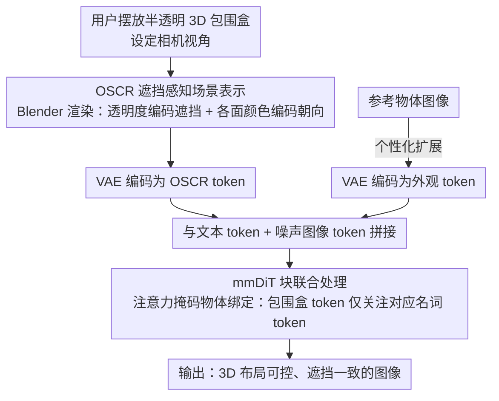

# SeeThrough3D: Occlusion Aware 3D Control in Text-to-Image Generation

**会议**: CVPR2026  
**arXiv**: [2602.23359](https://arxiv.org/abs/2602.23359)  
**代码**: [项目主页](https://seethrough3d.github.io)  
**领域**:图像生成  
**关键词**: 3D布局控制, 遮挡感知, 文本到图像生成, DiT, FLUX, 注意力掩码, LoRA

## 一句话总结

提出 SeeThrough3D，通过半透明 3D 包围盒渲染的遮挡感知场景表示（OSCR）来条件化 FLUX 模型，实现了精确的 3D 布局控制与遮挡一致的文本到图像生成。

## 研究背景与动机

**2D控制的局限**：现有可控生成方法大多基于 2D 空间控制（边界框、分割图），无法控制 3D 场景属性（物体排列、相机视角），难以满足设计、游戏、建筑可视化等领域的需求。

**遮挡推理被忽视**：遮挡是 3D 感知生成的核心能力，但现有 3D 布局方法（如 LooseControl、Build-A-Scene）基于深度图条件化，深度图无法表示被遮挡的物体，在多物体重叠场景中频繁失败。

**2D层分解不够精确**：LaRender、VODiff 等方法将场景分解为 2D 物体层来近似遮挡，但这种平面化表示丢失了真正的 3D 几何结构，导致遮挡关系违反 3D 透视规律。

**语义绑定缺失**：空间条件化无法将 3D 包围盒与对应的文本描述关联，容易出现物体属性混淆和位置错误。

**朝向控制不足**：深度图只能编码 180° 范围内的朝向信息，无法提供完整的 3D 朝向控制。

**合成数据泛化性挑战**：使用合成数据训练时容易过拟合到合成背景，需要有效的数据增强策略以保证对真实场景的泛化。

## 方法详解

### 整体框架

SeeThrough3D 要解决的是文本到图像生成里缺失的 3D 布局控制——尤其是遮挡：现有 3D 方法多用深度图条件化，而深度图根本表示不了被遮挡的物体，多物体重叠时频繁失败。它基于预训练的 FLUX（DiT 架构），把一种遮挡感知的场景表示（OSCR）编码成视觉 token 来条件化生成。

流程是：用户在虚拟环境里摆放半透明 3D 包围盒、设定相机视角 → Blender 渲染出 OSCR 图 → VAE 编码为 OSCR token → 与文本 token、噪声图像 token 拼接后送入 mmDiT 块联合处理。

### 关键设计

**1. OSCR 遮挡感知场景表示：用半透明带色包围盒把遮挡、朝向、视角一起编码进一张图**

深度图编码不了被遮挡物体，2D 层分解又丢掉真正的 3D 几何。OSCR 给每个物体一个**半透明 3D 包围盒**，透明度让被遮挡物体部分可见，为模型提供显式的遮挡推理线索。包围盒各面用**预定义颜色编码**（canonical color mapping），不同面对应不同颜色，直接在图像空间里编码 3D 朝向——这弥补了深度图只能编码 180° 范围朝向的不足；即便遮挡改变了部分面的表观颜色，面间相对色差仍可辨别，朝向线索依旧可靠。整张图从指定**相机视角**渲染，天然嵌入了相机位姿，实现精确视角控制。

**2. 注意力掩码物体绑定：把空间 token 和对应文本语义锁在一起**

光有空间条件还会出现物体属性混淆、位置错乱。SeeThrough3D 对 mmDiT 块里的自注意力施加掩码：属于包围盒 $b_i$ 区域的 OSCR token **只能关注**对应物体名词 token $\mathbf{p}_i$，从而把空间 token 与语义绑定；每个包围盒的空间范围由 Blender 渲染的 amodal 分割掩码 $\mathbf{s}_i$ 给出。当两个包围盒渲染区域重叠时，交集区域的 token 同时关注多个物体 token，实验发现模型能在潜空间里自然保持物体特征分离——注意力图本身就勾出了遮挡边界。同时阻断 OSCR token $\mathbf{z}$ 到图像 token $\mathbf{x}_t$ 的注意力，保护基础模型先验。

**3. 个性化扩展：复用同一套掩码做布局感知的指定物体生成**

给定参考物体图像 $v$，通过 VAE 编码为「外观 token」$\mathbf{v}$ 拼进序列，再复用上面的注意力掩码策略，让包围盒 $b_i$ 内的 OSCR token 去关注外观 token，就能在指定 3D 布局位置生成指定外观的物体。

### 训练策略

只训练 OSCR token 对应投影矩阵上的 **LoRA**（rank=128），冻住基础模型以保留文本到图像先验；学习率 $10^{-4}$，训练 30K 步。数据用 Blender 程序化放置 3D 资产、刻意控制位置与相机参数制造强遮挡，渲染出配对的真实图像与 OSCR 表示；再对渲染图提取深度后用 FLUX.1-Depth-dev 生成多样化写实增强图、并用 CLIP 过滤掉不符合原布局的样本，同时剔除物体重叠极少或可见度过低的简单场景（这步困难样本过滤对遮挡一致性至关重要），最终得到 25K 渲染图 + 25K 增强图。

## 实验

### 基准对比（3DOc-Bench，500 样本）

| 方法 | 深度顺序↑ | 物体得分↑ | 角度误差↓ | 文本对齐↑ | KID(×10⁻³)↓ |
|------|-----------|-----------|-----------|-----------|--------------|
| VODiff | 0.68 | 19.70 | 92.73 | 29.51 | 15.40 |
| LooseControl | 0.82 | 20.02 | 89.88 | 28.43 | 14.32 |
| Build-A-Scene | 0.89 | 21.0 | 91.62 | 28.05 | 20.12 |
| LaRender | 1.02 | 21.83 | 89.63 | 30.20 | 13.46 |
| **SeeThrough3D** | **1.46** | **22.86** | **47.92** | **31.87** | **5.43** |

SeeThrough3D 在全部五项指标上大幅领先现有方法。角度误差从约 90° 降至 48°，KID 从 13+ 降至 5.43。

### 消融实验

| 变体 | 深度顺序↑ | 物体得分↑ | 角度误差↓ | 文本对齐↑ | KID(×10⁻³)↓ |
|------|-----------|-----------|-----------|-----------|--------------|
| 无透明度 | 1.20 | 21.67 | **46.15** | 31.39 | 5.90 |
| 无颜色编码 | 1.36 | 22.23 | 88.77 | 31.57 | 5.93 |
| 无绑定掩码 | 0.98 | 20.45 | 57.44 | 31.61 | 6.35 |
| 无困难数据 | 1.24 | 21.89 | 49.73 | 31.32 | 6.34 |
| **完整模型** | **1.46** | **22.86** | 47.92 | **31.87** | **5.43** |

### 关键发现

- **透明度**是 OSCR 的核心设计：移除后深度顺序从 1.46 降至 1.20，证明其对遮挡推理的重要性。不透明包围盒在朝向准确度上略优（颜色信号更清晰），但牺牲了遮挡建模能力。
- **颜色编码**对朝向控制至关重要：移除后角度误差从 48° 飙升至 89°，几乎恢复到基线水平。
- **注意力绑定**对布局遵循不可或缺：移除后物体得分从 22.86 降至 20.45，物体出现在错误位置。
- **困难数据过滤**有效提升模型在复杂遮挡场景下的表现。
- 60 人用户研究中，SeeThrough3D 在图像真实感、布局遵循和文本对齐三项上均获得高偏好率。
- 尽管仅在最多 4 个物体的合成场景上训练，模型能泛化到多物体、未见类别（乐器、电子设备、透明物体等）、多样姿态（坐、骑行）和自然物体交互。

## 亮点

- **OSCR 表示设计精巧**：半透明 + 颜色编码的 3D 包围盒既简洁又富有表达力，同时编码遮挡、朝向和相机视角。
- **注意力掩码绑定**方案优雅地解决了空间-语义关联问题，避免了固定类别集的限制。
- **强泛化能力**：仅用 50K 合成数据训练（含增强），即可泛化到未见物体类别、复杂布局和多样背景。
- **保持基础模型先验**：LoRA 微调 + 注意力阻断设计使模型保留了透明物体渲染、文字生成等原始能力。
- 提出了 **3DOc-Bench** 基准，填补了遮挡感知 3D 控制评估的空白。

## 局限性

- 布局变化时**不保持图像一致性**，即改变布局会生成完全不同的图像，缺乏编辑连续性。
- 训练数据仅包含**刚性物体的标准姿态**，对非刚性物体和复杂姿态的控制可能有限。
- 依赖 Blender 渲染 OSCR 图和分割掩码，**用户交互链路较长**。
- 评估指标中 3D 布局遵循没有单一度量，而是用深度顺序 + 物体得分 + 角度误差三个代理指标组合评估。

## 相关工作

- **3D 布局控制**：LooseControl 用深度图条件化但无法表示被遮挡物体；Build-A-Scene 通过多轮生成-反转逐步添加物体但引入伪影；LACONIC 等将包围盒作为集合输入但局限于单一场景域。
- **遮挡控制**：LaRender 和 VODiff 基于 2D 层分解，缺乏 3D 感知；CObL 做无序层分解但仍无 3D 布局控制。
- **朝向控制**：Compass Control 和 ORIGEN 提供物体朝向控制但不支持 3D 位置放置。
- **3D 感知编辑**：Diffusion Handles、3D-FixUp 等利用深度做 3D 编辑但限于单物体。

## 评分

- 新颖性: ⭐⭐⭐⭐ — OSCR 表示和注意力掩码绑定的结合是新颖的，将遮挡推理显式建模到场景表示中
- 实验充分度: ⭐⭐⭐⭐ — 五项指标 + 消融 + 用户研究 + 个性化扩展，自建基准 3DOc-Bench
- 写作质量: ⭐⭐⭐⭐ — 结构清晰，图例丰富，注意力可视化分析深入
- 价值: ⭐⭐⭐⭐ — 填补了遮挡感知 3D 布局控制的空白，设计简洁实用，泛化能力令人印象深刻

<!-- RELATED:START -->

## 相关论文

- [\[CVPR 2026\] Layer-wise Instance Binding for Regional and Occlusion Control in Text-to-Image Diffusion Transformers](layer-wise_instance_binding_for_regional_and_occlusion_control_in_text-to-image_.md)
- [\[CVPR 2026\] 3D Space as a Scratchpad for Editable Text-to-Image Generation](3d_space_as_a_scratchpad_for_editable_text-to-image_generation.md)
- [\[ICCV 2025\] LaRender: Training-Free Occlusion Control in Image Generation via Latent Rendering](../../ICCV2025/image_generation/larender_training-free_occlusion_control_in_image_generation_via_latent_renderin.md)
- [\[CVPR 2026\] Camera Control for Text-to-Image Generation via Learning Viewpoint Tokens](camera_control_for_text-to-image_generation_via_learning_viewpoint_tokens.md)
- [\[CVPR 2026\] BiMotion: B-spline Motion for Text-guided Dynamic 3D Character Generation](bimotion_b-spline_motion_for_text-guided_dynamic_3d_character_generation.md)

<!-- RELATED:END -->
