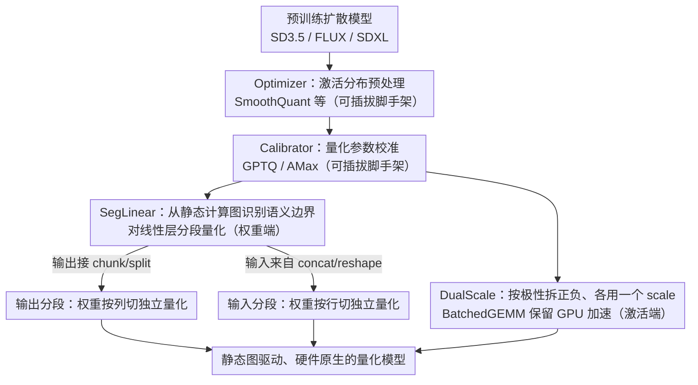

# SegQuant: A Semantics-Aware and Generalizable Quantization Framework for Diffusion Models

**会议**: CVPR2026  
**arXiv**: [2507.14811](https://arxiv.org/abs/2507.14811)  
**代码**: 无  
**领域**: 图像生成  
**关键词**: 扩散模型量化, 后训练量化, 语义感知分割, 极性保持, 部署友好

## 一句话总结

提出 SegQuant 框架，通过基于静态计算图的语义分割量化（SegLinear）和硬件原生的双尺度极性保持量化（DualScale），在不依赖手工规则或运行时动态信息的前提下，实现了跨架构通用、部署管线兼容的扩散模型高保真后训练量化。

## 研究背景与动机

**扩散模型部署瓶颈**：扩散模型（如 SD3.5、FLUX）在图像生成中表现优异，但多步去噪推理（通常 50 步）带来巨大计算负担。量化是降低模型体积和推理延迟的关键技术，而后训练量化（PTQ）因无需重训练、对预训练模型直接适用，成为工业部署首选方案。

**现有方法存在"编译器鸿沟"（Compiler Gap）**：这是本文核心洞察。现有扩散模型 PTQ 方法可分为两类，均与现代 AI 编译器不兼容：
   - **架构特定方法**（如 Q-Diffusion）：用手工硬编码规则处理 UNet skip-connection 的双峰分布，不可泛化到 DiT 等新架构。
   - **数据依赖方法**（如 PTQ4DiT）：依赖运行时动态信息（时间步变化的激活、显著通道），与 TensorRT 等基于静态图分析的编译器根本不兼容，无法实现自动化部署。

**线性层语义异构性被忽视**：DiT 架构中，AdaNorm、TimeEmbedding 等模块的线性层实际接收经 chunk/split/concat 操作拼接的多语义段输入。不同语义段具有截然不同的数据分布（如 Figure 4 所示 AdaNorm 权重呈现明显的分段模式）。对整个层统一量化会导致"量化干扰"——一段的数值特性损害另一段的精度。

**极性不对称激活的量化困境**：SiLU/GELU 等现代激活函数（在 DiT、SD3、FLUX 中广泛使用）与 ReLU 不同，会保留密集的低幅负值。其输出高度偏斜：正值范围可达 3.5，负值仅在 [-0.3, 0] 范围内。标准量化将有限 bin 均匀分布在整个范围上，导致语义关键的负值区域被严重压缩。实验可视化（Figure 7）清楚表明，负值激活承载高频细节和纹理一致性，量化损失直接导致图像质量退化。

**现有极性处理方案破坏 GPU 加速路径**：ViT 量化文献中的对数量化器、自定义位宽等方案重新定义了数据表示方式，破坏了 Tensor Core 的固定宽度 PTX 指令和 CUDA epilogue fusion 机制，无法在高吞吐 GPU 推理中使用。

## 方法详解

### 整体框架

SegQuant 的出发点是一个被作者称为“编译器鸿沟”（Compiler Gap）的痛点：现有扩散模型 PTQ 要么靠手工硬编码规则（如 Q-Diffusion 专门处理 UNet skip-connection 的双峰分布，换到 DiT 就失效），要么依赖运行时动态信息（如 PTQ4DiT 用时间步变化的激活），而后者与 TensorRT 这类基于静态图分析的编译器根本不兼容，没法自动化部署。SegQuant 因此走纯静态图、硬件原生的路线。

它是自顶向下的模块化设计，四个可插拔组件：

| 组件 | 角色 | 可选实现 |
|------|------|----------|
| **Optimizer** | 激活分布预处理，平滑量化难度 | SmoothQuant、SVDQuant、DMQ、SpinQuant |
| **Calibrator** | 量化参数校准（scale/zero-point） | GPTQ（Hessian 重建）、AMax（最大绝对值） |
| **SegLinear** ★ | 基于计算图的语义分割量化 | 自动图分析，无需手工配置 |
| **DualScale** ★ | 硬件原生的极性保持量化 | BatchedGEMM 实现，无自定义算子 |

默认组合是 SmoothQuant + GPTQ + SegLinear + DualScale，Optimizer 和 Calibrator 都可自由替换，使框架成为一个通用量化平台；★ 标的 SegLinear 和 DualScale 是两个核心贡献。

### 关键设计

**1. SegLinear：从计算图自动识别语义边界，对线性层分段量化**

DiT 里 AdaNorm、TimeEmbedding 等模块的线性层，输入其实是经 chunk/split/concat 拼起来的多语义段，不同段分布差异很大，对整层统一量化会让一段的数值特性损害另一段——这就是“量化干扰”。SegLinear 不靠人工指定，而是分析静态计算图（torch.fx DAG）里的 chunk/split/concat/reshape 模式自动找语义边界，对每段独立量化。

它分两种模式。当线性层输出后接 chunk/split（输出会流向语义不同的下游分支）时走**输出分段**：把权重 $\mathbf{W} \in \mathbb{R}^{k \times n}$ 按列切成 $[\mathbf{W}_1, \ldots, \mathbf{W}_N]$（$\mathbf{W}_i \in \mathbb{R}^{k \times d_i}$），各段独立量化后拼接，$\hat{\mathbf{Y}} = [\hat{\mathbf{X}}\hat{\mathbf{W}}_1, \cdots, \hat{\mathbf{X}}\hat{\mathbf{W}}_N]$，典型如 AdaNorm 输出经 chunk 拆成分布迥异的 shift/scale。当输入来自 concat/reshape（如 MHA 多头合并）时走**输入分段**：把权重按行切成 $[\mathbf{W}_1^T, \ldots, \mathbf{W}_N^T]^T$，各段独立量化后求和，$\hat{\mathbf{Y}} = \sum_{i=1}^{N} \hat{\mathbf{X}}_i \hat{\mathbf{W}}_i$，典型如 UNet skip-connection concat 后的线性层。这把 Q-Diffusion 的手工特例升级成了对 AdaNorm/MHA/TimeEmbedding 任意结构都适用的全自动算法；它捕捉的是计算图定义的通道间语义关系，与通道级量化互补。

**2. DualScale：按极性拆正负、各用一个 scale，且不破坏 GPU 加速路径**

SiLU/GELU 这类现代激活和 ReLU 不同，会保留密集的低幅负值，输出高度偏斜（正值范围可达 3.5，负值挤在 [-0.3, 0]），而这些负值恰恰承载高频细节和纹理一致性；以 SD3.5 的 AdaNorm 为例，95.5% 的通道以负值为主。标准量化把有限 bin 均匀铺在整个范围上，语义关键的负值区被严重压缩。DualScale 把激活按极性拆开 $\mathbf{X}_+ = \max(\mathbf{X}, 0)$、$\mathbf{X}_- = \min(\mathbf{X}, 0)$，各用独立 scale $s_- = |\min(x)|/q_{\min}$、$s_+ = \max(x)/q_{\max}$ 量化，输出线性组合重建：

$$\mathbf{Y} \approx s_+ s_w \cdot (\hat{\mathbf{X}}_+ \hat{\mathbf{W}}) + s_- s_w \cdot (\hat{\mathbf{X}}_- \hat{\mathbf{W}})$$

表面看这要两次矩阵乘，但关键设计在于 $\hat{\mathbf{X}}_+ \hat{\mathbf{W}}$ 和 $\hat{\mathbf{X}}_- \hat{\mathbf{W}}$ 用 CUTLASS 的 BatchedGEMM 在单次 kernel launch 里并行执行、两个缩放结果在 fused epilogue 中合并，完整保留标准整数 GEMM 路径、利用 Tensor Core 和 CUDA epilogue fusion，**不需要任何自定义算子**；它还避免了反向零点校正，只用固定的正/负 scale 即可重建。这正是 ViT 量化里对数量化器、自定义位宽方案做不到的——那些会破坏 Tensor Core 的固定宽度 PTX 指令和 epilogue fusion。

### 损失函数 / 训练策略

SegQuant 是纯 PTQ 框架，不引入额外训练损失，量化质量用逐层 Frobenius 范数误差 $\|\Delta \epsilon_t\|_F$ 衡量。校准阶段可选 GPTQ（基于 Hessian 的逐层重建，精度高但需校准数据：SD3/SDXL 用 256 张，FLUX 8-bit 用 64 张、4-bit 用 32 张）或 AMax（最大绝对值校准，更快）。所有实验用 50 步采样、默认调度器，在 Ada Lovelace 架构 GPU（24GB/48GB VRAM）上执行。

## 实验关键数据

### 主实验：MJHQ-30K 跨模型跨精度评测（Table 2）

| 模型 | 参数量 | W/A | 方法 | FID↓ | IR↑ | LPIPS↓ | PSNR↑ | SSIM↑ |
|------|--------|-----|------|------|-----|--------|-------|-------|
| SD3.5-DiT | 2B | FP16 | Baseline | 23.70 | 0.952 | - | - | - |
| SD3.5-DiT | 2B | W8A8 | PTQD | 36.84 | 0.309 | 0.520 | 10.20 | 0.417 |
| SD3.5-DiT | 2B | W8A8 | PTQ4DiT | 25.66 | 0.752 | 0.426 | 12.18 | 0.532 |
| SD3.5-DiT | 2B | W8A8 | Smooth+ | 24.10 | 0.851 | 0.404 | 12.16 | 0.552 |
| SD3.5-DiT | 2B | W8A8 | **SegQuant-A** | 24.33 | **0.924** | 0.384 | 12.78 | 0.563 |
| SD3.5-DiT | 2B | W8A8 | **SegQuant-G** | **23.94** | 0.859 | **0.383** | **12.83** | **0.564** |
| SD3.5-DiT | 2B | W4A8 | PTQ4DiT | 60.47 | -0.190 | 0.577 | 10.06 | 0.429 |
| SD3.5-DiT | 2B | W4A8 | SVDQuant | 27.95 | 0.725 | 0.456 | 11.76 | 0.523 |
| SD3.5-DiT | 2B | W4A8 | **SegQuant-G** | **27.30** | **0.762** | **0.453** | 11.69 | 0.521 |
| FLUX-DiT | 12B | BF16 | Baseline | 23.21 | 0.837 | - | - | - |
| FLUX-DiT | 12B | W8A8 | Q-Diffusion | 23.99 | 0.732 | 0.299 | 15.87 | 0.633 |
| FLUX-DiT | 12B | W8A8 | PTQ4DiT | 27.34 | 0.630 | 0.325 | 15.36 | 0.611 |
| FLUX-DiT | 12B | W8A8 | **SegQuant-G** | **23.07** | **0.822** | **0.138** | **20.32** | **0.782** |
| FLUX-DiT | 12B | W4A8 | SVDQuant | 23.61 | 0.783 | 0.232 | 17.29 | 0.697 |
| FLUX-DiT | 12B | W4A8 | **SegQuant-G** | **23.45** | **0.789** | **0.225** | **17.48** | **0.702** |
| SDXL-UNet | - | FP16 | Baseline | 17.10 | 0.910 | - | - | - |
| SDXL-UNet | - | W8A8(fp) | Q-Diffusion | 17.04 | 0.897 | 0.093 | 24.31 | 0.827 |
| SDXL-UNet | - | W8A8(fp) | **SegQuant-G** | **17.03** | **0.903** | **0.082** | **24.84** | **0.838** |

### 消融实验（SD3.5 W8A8，MJHQ-30K，SmoothQuant+AMax，Table 4）

| 配置 | FID↓ | IR↑ | LPIPS↓ | PSNR↑ | SSIM↑ |
|------|------|-----|--------|-------|-------|
| Baseline（无 Seg/Dual） | 23.35 | 0.877 | 0.419 | 11.93 | 0.536 |
| +SegLinear | 23.36 | 0.899 | 0.395 | 12.03 | 0.554 |
| +DualScale | 22.61 | 0.909 | 0.401 | 12.14 | 0.551 |
| +Seg.+Dual.（完整 SegQuant） | **22.54** | **0.952** | **0.377** | **12.50** | **0.567** |

### SegLinear 逐层误差削减（SD3.5，Table 3）

| 层名 | 校准方法 | 无 Seg. F-norm | 有 Seg. F-norm | 降幅 |
|------|----------|---------------|---------------|------|
| DiT.0.norm1 | SmoothQuant | 0.7041 | 0.5381 | -23.6% |
| DiT.0.norm1 | GPTQ | 0.8350 | 0.4441 | -46.8% |
| DiT.0.norm1_context | GPTQ | 1.5166 | 0.7441 | -50.9% |
| DiT.11.norm1_context | GPTQ | 3.0176 | 1.7637 | -41.6% |
| DiT.11.attn.out | SmoothQuant | 2273.3 | 1879.3 | -17.3% |
| DiT.11.attn.out | SVDQuant | 2031.6 | 1810.7 | -10.9% |

### 关键发现

- **FLUX 上改进最为惊人**：W8A8 下 LPIPS 从 Q-Diffusion 的 0.299 大幅降至 0.138（降 54%），PSNR 从 15.87 提升至 20.32（+4.45dB），说明 SegLinear 对大模型（12B）的语义异构性尤为有效。
- **SegLinear 与 DualScale 高度互补**：消融实验中，两者单独分别带来 Image Reward 从 0.877 到 0.899/0.909 的提升，联合使用直接跳至 0.952（超过 FP16 baseline），体现了"结构分段 + 极性保持"的正交互补。
- **SegLinear 对 norm 层效果最显著**：GPTQ 校准下 DiT.0.norm1_context 的 Frobenius 误差减半（-50.9%），验证了 AdaNorm 中 chunk 操作引入的语义异构性确实是量化退化的关键来源。
- **跨架构泛化**：同一套 SegQuant 在 DiT（SD3.5、FLUX）和 UNet（SDXL）上均为最优或近最优，无需针对架构做任何修改。
- **效率换质量**：INT8 模型大小约为 FP16 的一半（Figure 10），DualScale 引入的额外推理时间可控，质量提升显著超过开销。

## 亮点与洞察

- **"编译器鸿沟"问题定义精准**：将扩散模型量化的核心挑战从"精度"转向"部署兼容性"，是一个务实且重要的视角转换。现有方法在实验中表现好但无法自动集成到部署流水线中，SegQuant 首次系统性解决了这个工业痛点。
- **纯静态图驱动**：SegLinear 完全基于 torch.fx 计算图的结构分析，不依赖任何运行时数据（激活统计、时间步信息），天然兼容 TensorRT/TVM 等基于静态图优化的编译器。
- **DualScale 的硬件原生设计极为巧妙**：将极性分解 + 双 scale 量化转化为 BatchedGEMM + epilogue fusion，表面看是两次 GEMM，实际在单次 kernel launch 中完成并行，零自定义算子开销。这种"在已有硬件原语上做最大化利用"的思路值得借鉴。
- **模块化架构**：Optimizer/Calibrator 可插拔替换，使 SegQuant 不仅是一个方法，更是一个可扩展的量化平台，新的 PTQ 技术可以直接集成。

## 局限与展望

- **DualScale 理论 FLOPs 翻倍**：虽然通过 BatchedGEMM 并行化消除了延迟开销，但计算量仍是标准量化的 2 倍，对极端延迟敏感的推理场景可能仍有影响。可探索自适应策略——仅对极性不对称严重的层（如 AdaNorm）启用 DualScale。
- **低比特改进有限**：W4A8 下相比 SVDQuant 的优势不如 W8A8 显著，极低比特（W4A4）场景仍有挑战。原因可能是 4-bit 下权重本身的量化误差成为瓶颈，仅靠激活端的改进不足以弥补。
- **仅覆盖图像生成**：未在视频生成（ViDiT-Q、Q-VDiT 的时序 token 场景）和 3D 生成等任务上验证。SegLinear 的图分析理论上可泛化，但需要实验支撑。
- **校准数据需求**：GPTQ 变体仍需 32-256 张校准图像，完全零样本 PTQ 不可行。
- **SegLinear 搜索空间**：当前仅匹配已知图操作模式（chunk/split/concat/reshape），对更复杂的自定义算子图结构可能无法自动发现分段边界。

## 相关工作与启发

- **Q-Diffusion**：首次识别 UNet skip-connection 导致的双峰分布问题并用手工分割解决，是 SegLinear 思想的特例和启发来源。SegQuant 将其从手工规则升级为自动图分析。
- **PTQ4DiT**：利用时间步动态激活信息在 DiT 上取得好效果，但与静态图编译器不兼容——正是 SegQuant 定义的"编译器鸿沟"的典型。
- **SmoothQuant / SVDQuant**：激活分布平滑和低秩分解方法，被 SegQuant 作为可插拔 Optimizer 集成，验证了框架的兼容性。
- **GPTQ**：基于 Hessian 的逐层重建校准，作为 SegQuant 的默认 Calibrator。
- **ViDiT-Q / Q-VDiT**：视频扩散量化方法，利用时序冗余和 token 级适配。与 SegQuant 的通用计算图分析路线互补，理论上可作为 SegQuant 的 Calibrator 集成。
- **TFMQ-DM / TAC-Diffusion**：时序特征维护和时间感知校准方法，属于正交技术，可作为 SegQuant 的 Calibrator 组件集成。

## 评分

- 新颖性: ⭐⭐⭐⭐ — "编译器鸿沟"视角新颖且务实，纯静态图语义驱动量化独树一帜，DualScale 的硬件原生设计思路独到
- 实验充分度: ⭐⭐⭐⭐ — 三种架构（SD3.5-DiT/FLUX-DiT/SDXL-UNet）、三种精度（W8A8/W4A8/W8A8fp）、三个数据集、五个评估指标、完整消融
- 写作质量: ⭐⭐⭐⭐ — 框架层次清晰，问题定义（Compiler Gap）精准有力，公式推导简洁，图表信息量大
- 实用价值: ⭐⭐⭐⭐⭐ — 对工业部署有直接指导意义，模块化设计使其可作为统一量化平台使用

<!-- RELATED:START -->

## 相关论文

- [\[CVPR 2026\] GenErase: Generalizable and Semantically-Aware Concept Erasure in Diffusion Models](generase_generalizable_and_semantically-aware_concept_erasure_in_diffusion_model.md)
- [\[CVPR 2026\] SeaCache: Spectral-Evolution-Aware Cache for Accelerating Diffusion Models](seacache_spectral-evolution-aware_cache_for_accelerating_diffusion_models.md)
- [\[ECCV 2024\] MagicEraser: Erasing Any Objects via Semantics-Aware Control](../../ECCV2024/image_generation/magiceraser_erasing_any_objects_via_semantics-aware_control.md)
- [\[ICCV 2025\] DMQ: Dissecting Outliers of Diffusion Models for Post-Training Quantization](../../ICCV2025/image_generation/dmq_dissecting_outliers_of_diffusion_models_for_post-training_quantization.md)
- [\[CVPR 2026\] CSF: Black-box Fingerprinting via Compositional Semantics for Text-to-Image Models](csf_black-box_fingerprinting_via_compositional_semantics_for_text-to-image_model.md)

<!-- RELATED:END -->
