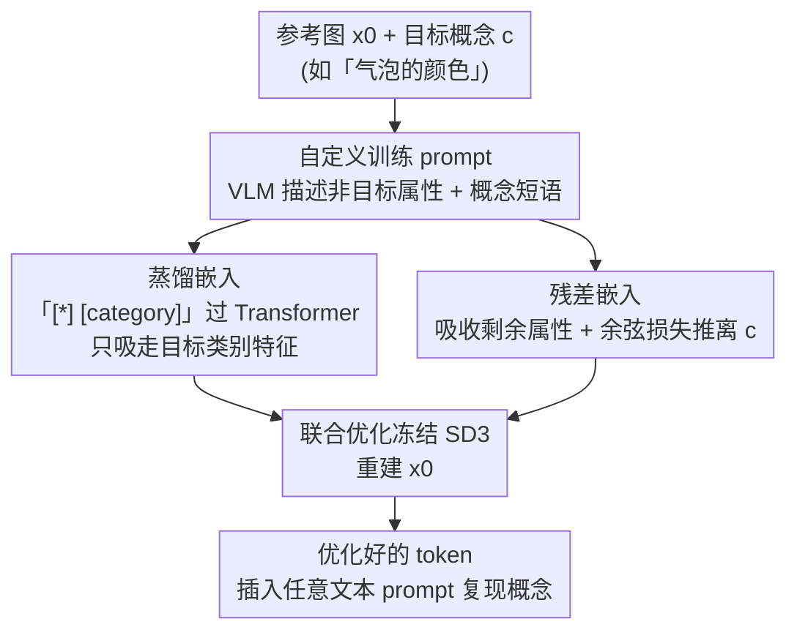

# Selectively Extracting and Injecting Visual Attributes into Text-to-Image Models

**会议**: CVPR 2026  
**论文**: [CVF Open Access](https://openaccess.thecvf.com/content/CVPR2026/html/Choi_Selectively_Extracting_and_Injecting_Visual_Attributes_into_Text-to-Image_Models_CVPR_2026_paper.html)  
**代码**: 待确认  
**领域**: 扩散模型 / 文生图 / 概念学习  
**关键词**: 文生图、视觉属性提取、概念注入、Textual Inversion、蒸馏嵌入

## 一句话总结
这篇论文提出从**单张参考图**里只把「指定的某一种视觉属性」（如颜色、材质、姿态、拍摄角度）抽出来、再注入文生图模型的方法：通过 VLM 自动构造「描述非目标属性」的训练 prompt，配合两个新嵌入——**蒸馏嵌入**（借文本 Transformer 把目标特征从 token 里隔离出来）和**残差嵌入**（吸收剩余属性、稳定优化），让优化出的文本 token 只代表目标概念，在自建数据集上的属性选择性优于 TokenVerse、U-VAP、ProSpect 等方法。

## 研究背景与动机

**领域现状**：文生图模型已经深度嵌入设计工作流，设计师靠文本 prompt 指定形状、材质、颜色来快速出原型图。为增强可控性，又衍生出一批接受图像条件的变体——ControlNet、T2I-Adapter、StyleShot 走「改架构 + 额外视觉引导（草图 / 姿态图 / 风格图）」，InstructPix2Pix、Emu Edit 做图像编辑，Textual Inversion 一脉的 subject-driven generation 则把一个物体映射到文本 token 再换环境重建。

**现有痛点**：纯文本说不清细腻的设计意图——设计师常常手里有一张「想要这种感觉」的参考图，却要反复试 prompt 才能复现，甚至去编「prompt book」研究词与图的对应，结果仍然偏离目标。而图像条件类方法各有局限：ControlNet 系只覆盖形状或风格、还要边缘检测 / 姿态估计等预处理和成千上万张训练样本；编辑类擅长「改某属性」而非「复现某属性」；subject-driven 类只会重建**整个物体**，无法只取「物体的颜色」或「这张图的镜头角度」。

**核心矛盾**：真正想要的是**属性级**的概念学习——只把参考图里「某一种属性」抽出来。但一张参考图里多种属性是**纠缠**的（颜色、布局、镜头、材质混在一起），而 Textual Inversion 的优化目标会逼 token 去复现图里的**全部**属性，根本没有机制把目标属性从无关属性中隔离开。

**本文目标**：给定参考图 $x_0$ 和一个用文本表述的目标概念 $c$（如「气泡的颜色」），优化一个文本 token 嵌入 $e_*$，使它**只**代表 $c$，且无需任何额外数据集和预处理、只用单张图。

**切入角度**：作者借用了 subject-driven generation 里的一个观察——如果训练 prompt 把「背景等非目标内容」描述清楚，token 嵌入就会自动只去捕捉「剩下的前景」来降低损失。把这个思路推广：只要在训练 prompt 里描述清所有**非目标属性**，token 就被逼着只学目标属性。

**核心 idea**：用「自定义训练 prompt 排除非目标属性 + 蒸馏嵌入借 Transformer 结构性隔离目标特征 + 残差嵌入兜住剩余属性稳住训练」三件套，让一个文本 token 被**选择性**地优化到只代表目标概念。

## 方法详解

### 整体框架

整个方法建立在 Textual Inversion（TI）之上：冻结文生图模型参数，只优化一个能被插进任意 prompt 的文本 token 嵌入。TI 原版会让这个 token 复现参考图的**所有**属性，本文要做的是把它「裁剪」成只代表目标概念 $c$。

流程分三步、层层加固隔离效果：(1) 给定参考图 $x_0$ 和文本形式的目标概念 $c$，先用 **VLM 自动写一句「描述图中除 $c$ 以外所有属性」的描述**，再插入概念短语（如「in [*]」）拼成自定义训练 prompt $y_{\text{custom}}$，让 token 被动地只去学没被描述到的目标属性；同一个 VLM 还顺手挑一个语义接近 $c$ 的初始化 token，缩短优化迭代。(2) 但文本长度有限、描述不全，仍有非目标属性漏进 token，于是引入**蒸馏嵌入**：把「[*] [category]」过一遍文本编码器的 Transformer，利用「语义相关 token 互相 attend」的机制，让 [category] 的前向嵌入只「吸走」[*] 里属于该类别的特征，从结构上隔离目标。(3) 蒸馏嵌入被强行要求去重建所有未描述属性会和它的结构冲突、导致训练不稳，于是再加一个**残差嵌入**专门吸收剩余属性，并用余弦相似度损失把残差嵌入推离目标概念，最终稳住联合优化。优化完，把该 token 插进任意文本 prompt 即可把概念复现到新场景。

### 关键设计

**1. 自定义训练 prompt：用「描述非目标属性」反向逼 token 只学目标**

针对「TI 的 token 会复现全部属性」这个痛点，作者不直接约束 token，而是改造训练 prompt。原版 TI 用「A [*]」做 prompt，损失最小时 [*] 被迫代表 $x_0$ 的物体、背景乃至镜头角度等一切。本文借 subject-driven generation 的发现——训练 prompt 里描述得越全，token 越只去学「没被描述到」的部分。于是作者用 VLM 对 $x_0$ 生成一句「排除 $c$ 之外的一句话描述」，再把概念短语（如「in [*]」「made of [*]」「captured in [*]」）插进这句 caption，得到 $y_{\text{custom}}$。这样优化时，非目标属性已被文本兜住，[*] 只需补上目标概念就能把损失降下去。此外，VLM 还被用来自动选初始化 token：先让它推断 [*] 指代什么、给出几个近义候选，再把候选喂回 VLM 让它选最合适的一个作为优化起点，减少迭代量。

**2. 蒸馏嵌入：借 Transformer 的「同类相吸」结构性隔离目标特征**

文本长度有限，$y_{\text{custom}}$ 没法穷举所有非目标属性，残余的无关属性（布局、镜头焦点等）仍会渗进 $e_*$——根因是 $e_*$ 取值无任何约束，凡是没被描述的属性都会被塞进来以降损失。作者提出蒸馏嵌入 $h_{\text{[category]}\leftarrow *}$ 来从结构上堵住这个口子。核心观察是：Transformer 里语义相关的 token 会互相 attend，把「[*] color」过文本编码器，「color」这个 token 的输出嵌入就会从 [*] 里**只**抽取颜色相关特征——论文用 Fig. 5 验证：把 [*] 换成「red / green / blue」会显著改变「color」嵌入，换成「circular / stretching / aerial」这类与颜色无关的词则几乎不变，说明文本编码器确实能按类别隔离特征。于是作者把「[*] [category]」（[category] 是 $c$ 的粗类别描述词）过 Transformer，取 [category] 的前向嵌入作为蒸馏嵌入，配合去掉 [*] 的 prompt $\tilde y_{\text{custom}}$ 计算重建损失：

$$\mathbb{E}_{\boldsymbol{\epsilon}\sim\mathcal{N}(\mathbf{0},\mathbf{I}),t}\,\big\|x_\theta(\mathbf{x}_t,t,\text{Insert}(\tau(\tilde y_{\text{custom}}),\mathbf{h}_{\text{[category]}\leftarrow *}))-\mathbf{x}_0\big\|_2^2$$

其中 $\text{Insert}(\cdot)$ 把蒸馏嵌入插回已编码的 $\tilde y_{\text{custom}}$。相比让裸 token 自由取值，蒸馏嵌入把「只保留目标类别特征」写进了文本编码器的前向过程里，是结构性约束而非软提示。

**3. 残差嵌入 + 余弦损失：兜住剩余属性、稳住优化且不抢占目标**

光用蒸馏嵌入，式 (3) 仍逼 $h_{\text{[category]}\leftarrow *}$ 去重建那些未被描述的属性——嵌入的「只装目标类别」结构和损失的「重建全部」要求互相冲突，训练会朝意外方向跑偏、不稳定（Fig. 6 显示去掉残差嵌入会失败）。作者再加一个可学习的残差嵌入 $h_{\text{residual}}$，专门捕捉除 $c$ 外的剩余属性：同样把「[R] [category]」过 Transformer 取前向嵌入，但 [category] 固定用「image」这个通用词（不绑定具体类别）。有了它分担「重建剩余属性」的活，蒸馏嵌入就能专心只表示 $c$。但残差嵌入既然能装任意类别属性，就有可能反过来把 $c$ 也装走，于是加一个余弦相似度损失只更新残差嵌入，把它从蒸馏嵌入（即 $c$）的方向推开：

$$\mathcal{L}_{\text{cosine}}=\max\!\left(0,\ \frac{\mathbf{h}_{\text{residual}}\cdot\mathbf{h}_{\text{[category]}\leftarrow *}}{\|\mathbf{h}_{\text{residual}}\|\,\|\mathbf{h}_{\text{[category]}\leftarrow *}\|}\right)$$

### 损失函数 / 训练策略

最终重建损失把残差嵌入 $\text{Prepend}$ 到 prompt 前、蒸馏嵌入 $\text{Insert}$ 回概念位置，再过冻结模型 $x_\theta$ 重建 $x_0$：

$$\mathcal{L}_{\text{recon}}=\mathbb{E}_{\boldsymbol{\epsilon}\sim\mathcal{N}(\mathbf{0},\mathbf{I}),t}\big\|x_\theta\big(\mathbf{x}_t,t,\text{Insert}(\text{Prepend}(\tau(\tilde y_{\text{custom}}),\mathbf{h}_{\text{residual}}),\mathbf{h}_{\text{[category]}\leftarrow *})\big)-\mathbf{x}_0\big\|_2^2$$

$$\mathcal{L}_{\text{total}}=\mathcal{L}_{\text{recon}}+\lambda\,\mathcal{L}_{\text{cosine}}$$

实现基于 Stable Diffusion 3（SD3，含 3 个文本编码器，每个编码器优化 4 个 token 嵌入）；为保持句子结构，去掉 [*] 后用 dummy token「category」占位、再替换为蒸馏嵌入，残差嵌入则用 dummy token「image」占位。单张 RTX 3090、batch size = 1，每次优化平均约 5,000 步、学习率 0.001，余弦损失系数 $\lambda$ 取 0.01 或 0.001。

## 实验关键数据

评测全部在作者自建数据集上：把目标概念分成 **shape / material / color / pose / camera shot and angle / style 六大类**，收集 30 张真实图、60 条评测 prompt，特意包含偏心物体、多物体、以背景为主的复杂场景（区别于 subject-driven 数据集那种永远把物体居中的设置）。每个方法对每条 prompt 生成 6 张图，共 1,800 张。对比对象：概念学习方法 TokenVerse、U-VAP、ProSpect，统一文生图模型 OmniGen2，以及 Textual Inversion（TI）。其中 TokenVerse 无官方实现、作者基于论文在 SD3 上复现（论文连训练网络架构、学习率都没给，复现非易事）。

两项自动指标：**Concept Similarity（CS）**用 CLIP 算生成图与参考图的相似度衡量目标概念对齐度（先做预处理：shape/pose 用边缘检测、material/color 做背景去除；camera angle 和 style 因缺乏稳健预处理被排除在该指标外）；**Concept Exclusiveness（CE）**= 1 − CLIP 相似度，衡量「避免引入无关属性」的能力。Fig. 8 显示本文方法综合得分最高；TokenVerse、ProSpect 的 CE 虽更高，但那是因为它们基本忽略了目标概念（CS 很低），自然也不会带进多余属性。

### 主实验（用户研究，本文 vs 各 baseline）

下表为 28 人、540 条回答的用户研究结果。Concept Sim. / Concept Excl. 一行是「本文相对该 baseline 的偏好胜率（%）」（>50% 表示用户更偏好本文）；Prompt Fidelity 一行是各方法的保真度得分（本文同列给出）。

| 指标 | 本文 | TokenVerse | U-VAP | ProSpect | OmniGen2 | TI |
|------|------|-----------|-------|----------|----------|-----|
| Concept Sim.（vs 本文胜率 %） | — | 84.0 | 54.0 | 93.7 | 65.3 | 69.2 |
| Concept Excl.（vs 本文胜率 %） | — | 40.0 | 75.9 | 25.2 | 68.0 | 56.0 |
| Prompt Fidelity（得分） | **0.815** | 0.573 | 0.207 | <u>0.820</u> | 0.613 | 0.604 |

读法：CS 上本文几乎全面胜出（对 ProSpect 高达 93.7%、对 TokenVerse 84.0%），说明在「是否准确还原目标属性」上用户压倒性更认可本文；CE 上对 ProSpect / TokenVerse 反而低于 50%（25.2 / 40.0），正是因为这两者几乎不还原目标概念、自然也不会带入无关属性，属于「躺平式排他」。Prompt Fidelity 上本文 0.815 仅次于 ProSpect 的 0.820、明显高于 TokenVerse、U-VAP（0.207 极低）。

### 消融实验

| 配置 | CS | CE | 现象 |
|------|----|----|------|
| 完整方法（Ours） | 最高 | 高 | 既准确还原目标概念又排除无关属性 |
| w/o 残差嵌入（Ours w/o $h_{\text{residual}}$） | 下降 | 下降 | 训练不稳，蒸馏嵌入抓不住目标概念（Fig. 6） |
| 仅自定义 prompt（TI w/ $y_{\text{custom}}$） | — | 下降 | 未描述的非目标属性仍渗入 token，被一并生成 |

> ⚠️ Fig. 8 中 CS / CE 的精确坐标数值（CS 约 0.755–0.775、CE 约 0.32–0.44 区间）取自散点图、无表格列出精确值，以原文图为准；此处只表达「完整方法在 CS、CE 上同时显著优于两种消融变体」的趋势。

### 关键发现
- **残差嵌入是稳定优化的关键**：去掉它训练就跑偏、蒸馏嵌入抓不住目标概念，说明「让蒸馏嵌入专注目标、把剩余属性外包给残差嵌入」这一分工不可省。
- **「排他性高」不等于「方法好」**：TokenVerse、ProSpect 的 CE 更高，但只是因为它们几乎不还原目标概念，CS 极低——评判属性级概念学习必须 CS 和 CE 一起看。
- **对比通用大模型仍有价值**：和 GPT Image 1、Gemini 2.5 Flash Image（Nano Banana）相比，二者难以提取镜头角度这类隐式概念，材质示例里虽能反映目标却也会带进背景 / 颜色等非目标属性，凸显本文「选择性提取」任务的持续意义。

## 亮点与洞察
- **把 Transformer 的「同类相吸」当成隔离工具**：用「[*] [category]」过文本编码器、取 [category] 的前向嵌入来「蒸馏」目标特征，是个很巧的结构性约束——不改模型、不加正则，直接借文本编码器本身的注意力机制把目标类别特征从纠缠的 token 里挑出来，Fig. 5 的可视化（换颜色词变、换无关词不变）很有说服力。
- **「描述非目标 = 反向标注目标」的训练 prompt 思路可迁移**：与其正面约束「token 只能学什么」，不如用文本把「不想学的」全描述掉，让优化自动只去学剩下的。这个反向思路对其他「从纠缠表征里抽单一因子」的任务（属性编辑、概念解耦）都有借鉴价值。
- **单图、零数据集、零预处理**：相比 ControlNet 系动辄上千样本 + 边缘 / 姿态预处理，本文只需一张参考图就能学一个属性级概念，部署成本低。

## 局限与展望
- 作者承认：实验受 GPU 资源限制只用 SD3，生成质量和可应用上下文范围都被基座模型能力卡住——例如 SD3 对人体解剖理解有限，会降低复杂人体姿态的提取精度；换更大模型（如 FLUX）才能解锁更强能力（但方法本身不依赖 SD3）。
- 评测规模有限：聚焦六大类、每个概念参考图数量保持在可控范围，强调跨概念类型与上下文的多样性而非数量，作者呼吁后续工作在「难度」和「体量」两个方向扩展可扩展的评测工具。
- 自己看到的局限：CS 指标对 camera angle、style 两类因缺乏稳健预处理被排除在 CLIP 评测之外，主要靠用户研究和 VLM 评测补足，这两类的自动量化仍是空白；TokenVerse 因无官方实现需复现，跨方法比较存在复现不确定性。

## 相关工作与启发
- **vs Textual Inversion（TI）**：TI 把整个物体映射进一个 token、会复现全部属性；本文在 TI 之上加自定义 prompt + 蒸馏 / 残差嵌入，把目标缩小到「单一属性级概念」，是对 TI 的属性级精细化。
- **vs TokenVerse**：TokenVerse 优化文本 token 的调制参数来学任意视觉属性，但依赖特定架构（原基于 FLUX），迁到 SD3 后基本失效、并非 model-agnostic；本文方法不绑定特定调制结构。
- **vs U-VAP / ProSpect**：U-VAP 用 subject-driven 生成样本训练、倾向于近乎复制参考图；ProSpect 优化 timestep 相关 token 嵌入解耦布局 / 内容 / 风格 / 材质，但常常完全没抓到目标概念；本文在「准确还原目标 + 排除无关」两端取得更好平衡。
- **vs ControlNet / T2I-Adapter / 编辑类（InstructPix2Pix、Emu Edit）**：前者改架构 + 需大量样本和预处理、只覆盖形状 / 风格；编辑类擅长「改属性」而非「复现属性」；本文走「单图优化文本 token」路线，覆盖属性范围更广且无需预处理。

## 评分
- 新颖性: ⭐⭐⭐⭐ 「描述非目标反向逼学目标 + 借 Transformer 同类相吸做蒸馏隔离」的组合思路新颖且自洽
- 实验充分度: ⭐⭐⭐⭐ 自建六类数据集 + 5 个 baseline + 用户研究 + 消融，但 CS 指标排除了两类、Fig. 8 缺精确数值表
- 写作质量: ⭐⭐⭐⭐ 动机递进清晰，蒸馏机制用 Fig. 5 可视化讲得透
- 价值: ⭐⭐⭐⭐ 单图、零数据集地做属性级概念注入，对设计原型工作流实用性强

<!-- RELATED:START -->

## 相关论文

- [\[CVPR 2026\] When Anonymity Breaks: Identifying Models Behind Text-to-Image Leaderboards](when_anonymity_breaks_identifying_models_behind_text-to-image_leaderboards.md)
- [\[CVPR 2026\] CSF: Black-box Fingerprinting via Compositional Semantics for Text-to-Image Models](csf_black-box_fingerprinting_via_compositional_semantics_for_text-to-image_model.md)
- [\[CVPR 2026\] Visual Diffusion Models are Geometric Solvers](visual_diffusion_models_are_geometric_solvers.md)
- [\[CVPR 2026\] DCoAR: Deep Concept Injection into Unified Autoregressive Models for Personalized Text-to-Image Generation](dcoar_deep_concept_injection_into_unified_autoregressive_models_for_personalized.md)
- [\[CVPR 2026\] TINA: Text-Free Inversion Attack for Unlearned Text-to-Image Diffusion Models](tina_text-free_inversion_attack_for_unlearned_text-to-image_diffusion_models.md)

<!-- RELATED:END -->
