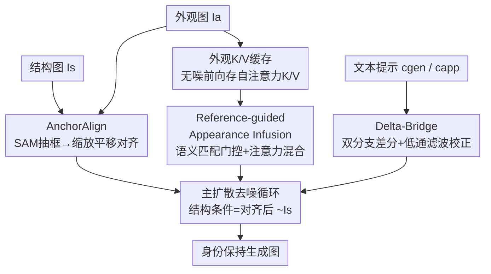

# Semantic Alignment for Pose-Invariant Identity Preserving Diffusion

**会议**: CVPR 2026  
**论文**: [CVF Open Access](https://openaccess.thecvf.com/content/CVPR2026/html/Kim_Semantic_Alignment_for_Pose-Invariant_Identity_Preserving_Diffusion_CVPR_2026_paper.html)  
**代码**: [项目主页 jwonkm.github.io/SeAl](https://jwonkm.github.io/SeAl/)  
**领域**: 图像生成 / 可控扩散  
**关键词**: 身份保持、训练自由、结构-外观可控生成、自注意力特征注入、姿态不变

## 一句话总结
SeAl 提出一个**训练自由**的文生图框架，用"几何预对齐 + 自注意力 K/V 特征注入 + 文本-外观差分校正"三个模块，把参考图的细粒度身份**注入（infuse）**到任意结构条件里，而不是像现有方法那样把主体"重新想象（re-imagine）"一遍，从而在动物纹理、人脸服饰等高难度场景把身份保持指标 DINO-I 大幅拉高。

## 研究背景与动机
**领域现状**：可控 T2I 生成希望同时控制三种信号——结构（姿态/布局）、外观（身份/风格）、文本提示。训练式方法（ControlNet 控结构、IP-Adapter 控外观）效果好但要为每种控制单独训练适配器；DreamBooth/Textual Inversion 这类个性化方法身份保真度高，但要逐主体微调，灵活性和可扩展性差。

**现有痛点**：训练自由方法（Ctrl-X、DRF、FreeControl）能即插即用地同时控结构和外观，但普遍陷入"**重新想象**"陷阱——扩散模型的强先验倾向于把外观图的特征**重新合成**去贴合给定结构，结果丢失外观图的细粒度细节和身份。这种"身份泄漏（identity leakage）"在非通用数据上尤其严重：独特人脸、复杂服饰、物种特异的动物花纹。更糟的是，这类方法对结构图与外观图之间的**空间错位**高度敏感，主体位置/尺度一旦不一致，就会在"重合成问题"之前先产生特征映射错误和结构伪影。

**核心矛盾**：现有研究存在一个三难权衡——要么付高昂训练成本换"高身份保真"，要么忍受多个控制信号互相冲突，要么选灵活的训练自由方案但牺牲真实身份。问题根源在于，主流 pipeline 把外观当成"待重绘的材料"，本质是**重画（re-imagining）**而非**搬运（infusion）**。

**本文目标**：在训练自由的框架内，同时满足结构、外观、文本三个约束，并把身份保持从"重画"问题中解放出来；同时解决空间错位带来的结构伪影。

**切入角度**：作者的关键观察是——身份信息其实就藏在外观图过 U-Net 时产生的**自注意力 K/V 特征**里。与其让模型从头合成主体，不如把这些原始 K/V **直接缓存下来、按语义匹配选择性地注入**到生成过程，让模型"搬运"而不是"重画"。

**核心 idea**：把任务从"re-imagine"改造成"infuse"——几何上先把结构对齐到外观锚点，再把缓存的外观自注意力 K/V 按语义相似度注入生成，最后用文本与外观的 guidance 差分（delta）来调和文本-外观冲突。

## 方法详解

### 整体框架
SeAl 在预训练 SDXL 上做**零训练**改造，分为**预处理阶段**和**主扩散阶段**。预处理阶段并行做两件事：AnchorAlign 用 SAM 抽主体框、把结构图缩放平移对齐到外观图锚点，得到对齐后的结构条件 $\tilde{I}_s$；同时让外观图 $I_a$ 过一次无噪前向，把各自注意力层的 Key/Value 缓存成 $CA_{app}$。主扩散阶段在每个去噪步里，U-Net 内部由 Reference-guided Appearance Infusion 按语义匹配把缓存的外观 K/V 混入自注意力；与此同时 Delta-Bridge 在外层算出经过文本校正的最终噪声预测 $\hat{\epsilon}_{final}$ 来更新潜变量。三个模块协同，把结构-外观-文本三难权衡一次性解开。

### 关键设计

**1. AnchorAlign：先几何对齐，给后续融合一个稳定地基**

训练自由方法对结构图与外观图的空间错位极其敏感——主体在两张图里位置/尺度不同，模型就映射错特征，产生结构伪影或身份泄漏。AnchorAlign 是一个自动化预处理步，用两步"缩放-平移"把结构图贴齐到外观锚点。先用 SAM 在外观图 $I_a$、结构图 $I_s$ 上分别抽出主体包围框 $B_a$、$B_s$，按两框高度比算统一缩放因子 $s_{scale} = h_a / h_s$，再以框底中心为锚点 $P_a$、$P_s$ 算平移向量 $\mathbf{t} = P_a - (s_{scale}\cdot P_s)$，把缩放后的结构图贴到新画布上得到 $\tilde{I}_s$：

$$\tilde{I}_s = \begin{cases} I^{scaled}_s(p-\mathbf{t}) & \text{if } p-\mathbf{t}\in\mathcal{D}_{scaled}\\ c_{bg} & \text{otherwise}\end{cases}$$

它有效的原因在于：把"对齐"从扩散模型的隐式负担中剥离出来，变成一个确定性的几何前置操作，于是后面的特征注入面对的总是已经摆正、尺度匹配的结构，避免了在重合成之前就先崩掉。这一步是可选的——输入本就对齐时可跳过以省时间。

**2. Reference-guided Appearance Infusion：缓存外观 K/V，按语义匹配选择性注入身份**

这是 SeAl 绕开"重新想象"的核心。它分三步。**缓存**：生成开始前让 $I_a$ 过一次无噪前向，把指定层集 $L_{app}$（只取 mid 和 up 块的 attn1，专注纹理/风格；故意排除 down 块以减小对结构的干扰）、指定时间步 $T_{app}$ 上的自注意力 K/V 存成 $CA_{app}$。**门控**：生成时用当前潜变量算 Query，对每个 query token $q_i$ 与缓存里所有外观 key 算最大余弦相似度 $\text{sim}(q_i, K^{(t,l)}_{app}) = \max_j \frac{q_i\cdot k_{app,j}}{\|q_i\|\|k_{app,j}\|}$，超过阈值 $\tau$ 才置有效掩码 $M_{valid,i}=1$。**混合调度**：算两路注意力——base 注意力 $A_{base}$ 用当前潜变量的 K/V，appearance 注意力 $A_{app}$ 用与 Q 最相似的 top-k（默认 $k=1$）外观 K/V $(\tilde{K}_{app},\tilde{V}_{app})$，再按强度 $\delta$ 和掩码融合：

$$A_{final} = (1-\delta\cdot M_{valid})\odot A_{base} + (\delta\cdot M_{valid})\odot A_{app}$$

掩码保证低相似度 token（$M_{valid,i}=0$）退回 base 注意力，守住结构骨架不被外观污染。$\tau$ 和 $\delta$ 还按去噪进度动态调度：早期保守（高 $\tau$、低 $\delta$）保结构稳定，后期激进（低 $\tau$、高 $\delta$）最大化细节注入。它有效是因为只把外观图里**真正语义对应**的局部特征搬到目标位置上去，而不是让模型凭先验重画整个主体——这正是"infuse vs re-imagine"的分水岭。

**3. Delta-Bridge：把文本-外观冲突当成可控的"差分校正信号"，而非噪声**

当外观图与文本提示出现语义分歧（比如外观是"蓝衬衫"、文本要"红衬衫"）时，朴素做法会让两者打架，要么文本被无视、要么身份被破坏。Delta-Bridge 把这种分歧**重新解释**成一个有用的方向向量 $\Delta$，代表"文本想要的改变方向"。它走双分支 guidance：分别算生成 guidance $g_{gen}=\epsilon_\theta(z_t,c_{gen})-\epsilon_\theta(z_t,\emptyset)$ 和外观 guidance $g_{app}=\epsilon_\theta(z_t,c_{app})-\epsilon_\theta(z_t,\emptyset)$，并且**只把"high quality"这类全局增强词加进 $c_{gen}$**，从而把角色分开：$g_{app}$ 专注维持身份，$g_{gen}$ 管新风格和整体质量，避免身份被污染。两者之差即语义差分 $\Delta = g_{gen} - g_{app}$，再用迭代 2D 平均池化做低通滤波，把宏观变化（如姿态/颜色）从高频身份细节里分离出来，最后加回主 guidance：

$$\hat{\epsilon}_{final} = \epsilon_\theta(z_t,\emptyset) + w\cdot g_{gen} + \lambda(\gamma)\cdot\Delta_{filtered}$$

强度 $\lambda(\gamma)$ 随采样进度 $\gamma$ 调度，主要在前-中期生效以强制文本控制和大形状，之后衰减到零，把最后的细节渲染交还给外观注入路径。这样设计有效，是因为它只沿"文本与外观之差"这一个方向施加修改、且滤掉了高频身份信息，于是能改"该改的"（红→蓝、姿态）而不动"不该动的"（脸、纹理）。

### 损失函数 / 训练策略
SeAl 完全**训练自由**，没有任何可训练参数和损失函数，直接在预训练 SDXL v1.0 上推理时改造自注意力与 CFG。核心可调超参为 top-k（默认 $k=1$）、语义匹配阈值 $\tau=0.15$、混合强度 $\delta=3.0$，其中 $\tau$、$\delta$ 在去噪过程中按 schedule 动态变化。

## 实验关键数据

### 主实验
外观数据集 256 张（81 人、133 动物、21 名人），配多种结构条件（Mesh/Pose/Depth/Canny 等）。指标：CLIP Score（文本对齐↑）、DINO-I（身份相似度↑）、DreamSim-str（结构对齐↑），外加 HPSv2、ImageReward 人类偏好奖励模型。下表节选 Animal-Pose 与 Human-Pose 两个高难设定：

| 设定 | 方法 | CLIP↑ | DINO-I↑ | DreamSim-str↑ |
|------|------|-------|---------|---------------|
| Animal-Pose | Ctrl-X | 0.2807 | 0.6174 | 0.7926 |
| Animal-Pose | DRF | 0.3268 | 0.6318 | 0.8397 |
| Animal-Pose | **SeAl** | 0.3281 | **0.7104** | **0.8450** |
| Human-Pose | Ctrl-X | 0.2863 | 0.5588 | 0.7830 |
| Human-Pose | DRF | 0.3099 | 0.5438 | 0.8144 |
| Human-Pose | **SeAl** | 0.3064 | **0.7465** | 0.8186 |

身份指标 DINO-I 在所有数据集和结构类型上都显著领先（Human-Pose 从 ~0.56 拉到 0.7465），同时 CLIP/DreamSim-str 在多数类别仍取最高或高度竞争，说明身份注入没有牺牲文本和结构对齐。HPSv2 与 ImageReward 也全面最高，表明结果不仅指标好、还更受人类偏好模型青睐。

### 消融实验

| 配置 | 关键现象 | 说明 |
|------|---------|------|
| w/o AnchorAlign | 主体几何错位、结构不连贯 | 极端尺度/姿态差时尤其崩，验证预对齐是稳定地基 |
| top-k：k=1 vs k>1 | k=1 锐利且身份清晰；k 增大渐糊、前后景不自然混叠 | 软匹配会平均掉多特征引入模糊，故默认 k=1 |
| 阈值 τ↑ | DINO-I 单调下降 | τ 越严，可注入的 token 越少，外观迁移减弱 |
| 强度 δ↑ | DINO-I 单调上升 | δ 越大，混合时外观分支权重越高，身份迁移越强 |

默认取 $\tau=0.15$、$\delta=3.0$，在身份保持与文本/结构对齐间取得稳健平衡。

### 关键发现
- 身份保持的主导模块是 Reference-guided Appearance Infusion：DINO-I 的大幅提升直接来自"缓存 K/V + 语义门控注入"，证明它是在"搬运"而非"重画"身份。
- AnchorAlign 在主体严重错位时贡献最大，去掉后会出现几何不连贯，是后续模块能正常工作的前提。
- $\tau$ 与 $\delta$ 对身份-文本-结构的三方平衡敏感且方向相反（严阈值削身份、强混合增身份），需要靠 schedule 协调。
- 计算成本：SeAl 训练自由，单张 512×512 推理 ≈34.83s（主去噪 ≈18s + AnchorAlign ≈10s + K/V 缓存 ≈6s），峰值显存 8.70 GiB，低于 ControlNet+IP-Adapter（13.88 GiB）和 DRF（14.44 GiB）；AnchorAlign 可在已对齐输入时跳过，省下约 10s。

## 亮点与洞察
- **"infuse 而非 re-imagine"的范式重述**：把身份保持的失败归因于"模型在重画主体"，并直接用缓存自注意力 K/V 把原始特征搬过来，思路简洁但切中要害，是全篇最"啊哈"的地方。
- **语义门控的 validity mask**：用 query-key 余弦相似度阈值决定每个 token 是否注入外观，让结构骨架（低相似区）自动退回 base 注意力，巧妙地把"哪里该保结构、哪里该上外观"交给语义自适应，而非手工 mask。
- **Delta-Bridge 把"冲突"变"信号"**：文本与外观的 guidance 差分本是麻烦，作者用低通滤波分离宏观改变与高频身份，使"改颜色/姿态但保脸"成为可控操作——这个差分+滤波技巧可迁移到任何需要"定向编辑但保身份"的扩散任务。
- **K/V 缓存只取 mid/up 块**：刻意排除 down 块以避免外观特征污染结构，体现了对 U-Net 各层职能（结构 vs 纹理）的精细利用。

## 局限与展望
- 作者承认引入了适度运行时开销（AnchorAlign ≈10s、K/V 缓存 ≈6s），虽训练自由但单图推理慢于 Ctrl-X、IP-Adapter 组合。
- AnchorAlign 依赖 SAM 抽出可靠的主体框，对单主体、可分割对象友好；多主体、严重遮挡或无清晰主体的场景下，框-缩放-平移的几何对齐假设可能失效（论文未充分讨论）。
- 数据集规模偏小（256 张外观图），且 τ/δ 的 schedule 是人工设定的；不同主体/结构上最优调度是否一致、能否自适应，仍待验证。
- top-k=1 的硬匹配保了锐度，但在外观图与目标语义差异大时可能出现可注入 token 稀少导致细节不足，介于硬/软匹配之间的自适应 k 是可探索方向。

## 相关工作与启发
- **vs Ctrl-X / DRF（训练自由）**：它们用空间归一化或 score guidance 把外观图特征重合成去贴结构，本质仍是"重画"，复杂主体上身份泄漏明显；SeAl 改为缓存并选择性注入原始 K/V，DINO-I 大幅领先，区别在"搬运 vs 重画"。
- **vs ControlNet + IP-Adapter（训练式组合）**：把结构控制与外观适配器拼起来，但两路信号常冲突导致身份被破坏或结构被无视，且需大规模训练；SeAl 零训练、用 Delta-Bridge 主动调和文本-外观冲突。
- **vs DreamBooth / Textual Inversion（个性化）**：逐主体微调身份保真高但不可扩展；SeAl 即插即用、无需为每个主体训练。

## 评分
- 新颖性: ⭐⭐⭐⭐⭐ "infuse 而非 re-imagine"的范式重述 + 缓存 K/V 语义门控注入 + Delta-Bridge 差分校正，组合很有想法。
- 实验充分度: ⭐⭐⭐⭐ 多结构类型 + 动物/人类双数据 + 人类偏好奖励 + 完整消融，但外观集仅 256 张、缺多主体/失败案例分析。
- 写作质量: ⭐⭐⭐⭐⭐ 三模块职责清晰、公式与图配合到位，痛点-机制-效果讲得连贯。
- 价值: ⭐⭐⭐⭐ 训练自由的高保真身份保持对可控生成实用价值高，差分校正等技巧可迁移到编辑类任务。

<!-- RELATED:START -->

## 相关论文

- [\[CVPR 2026\] CaricHarmony: Contrastive Diffusion Paths for Identity-Preserving Caricature Synthesis](caricharmony_contrastive_diffusion_paths_for_identity-preserving_caricature_synt.md)
- [\[CVPR 2026\] Identity-Preserving Image-to-Video Generation via Reward-Guided Optimization](identity-preserving_image-to-video_generation_via_reward-guided_optimization.md)
- [\[CVPR 2026\] Not All Birds Look The Same: Identity-Preserving Generation For Birds](not_all_birds_look_the_same_identity-preserving_generation_for_birds.md)
- [\[CVPR 2026\] MultiCrafter: High-Fidelity Multi-Subject Generation via Disentangled Attention and Identity-Aware Preference Alignment](multicrafter_high-fidelity_multi-subject_generation_via_disentangled_attention_a.md)
- [\[CVPR 2025\] StableAnimator: High-Quality Identity-Preserving Human Image Animation](../../CVPR2025/image_generation/stableanimator_high-quality_identity-preserving_human_image_animation.md)

<!-- RELATED:END -->
