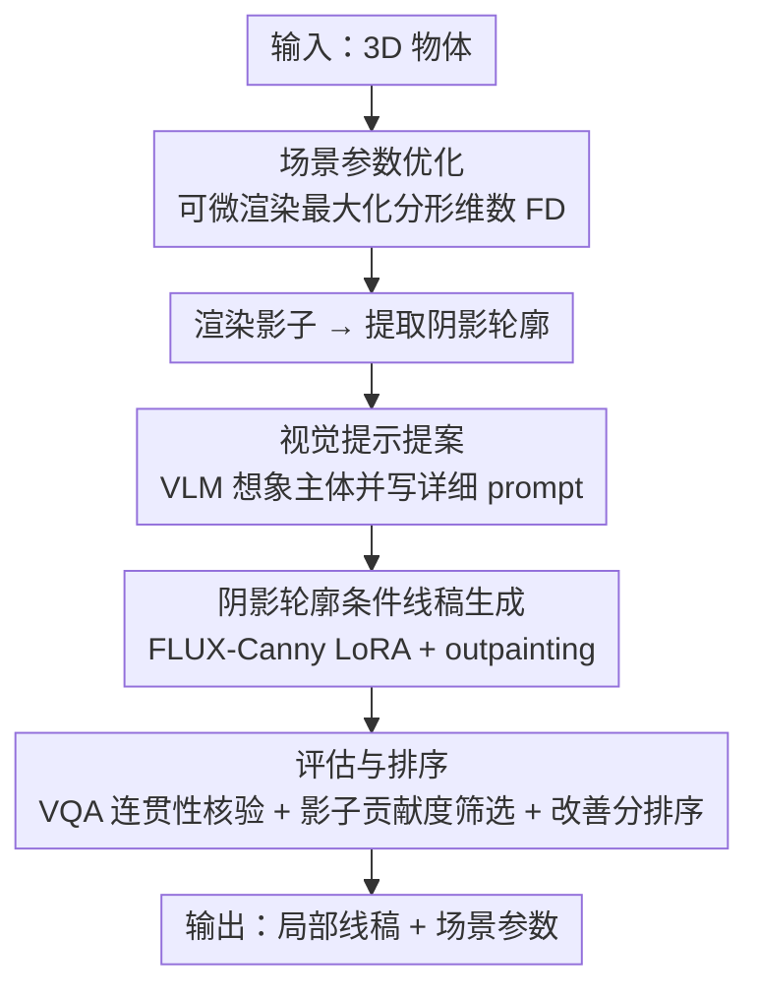

# ShadowDraw: From Any Object to Shadow-Drawing Compositional Art

**会议**: CVPR 2026  
**论文**: [CVF Open Access](https://openaccess.thecvf.com/content/CVPR2026/html/Luo_ShadowDraw_From_Any_Object_to_Shadow-Drawing_Compositional_Art_CVPR_2026_paper.html)  
**代码**: 无（仅有 project page）  
**领域**: 图像生成 / 计算视觉艺术  
**关键词**: 影子艺术、线稿生成、阴影轮廓、可微渲染、扩散模型

## 一句话总结
ShadowDraw 把任意 3D 物体变成"影子-线稿"合成艺术：系统联合优化光照/物体姿态以投出"有意思"的影子，再用阴影轮廓 + VLM 文本提示去条件化一个线稿扩散模型，让投影的影子刚好补全画家手绘的局部线稿成一幅完整图画，并用自动评估筛掉影子贡献不足的结果。

## 研究背景与动机
**领域现状**：计算视觉艺术里的"影子艺术"通常被建模成一个**逆向设计**问题——给定一个**事先确定的目标图案**，优化物体几何 [32,36]、材质 [2,31] 或光照 [33,39]，让投出的影子去逼近这个目标。影子是唯一的视觉媒介。

**现有痛点**：这类方法都假设你**先知道想要什么**（a priori target），再用参数优化去复现它；而且只用影子本身作画，表达空间受限，优化出来的几何往往怪异、难以在真实世界复现。

**核心矛盾**：本文想做的是受比利时艺术家 Vincent Bal 启发的另一种创作——日常物体的影子**意外地**补全了手绘线条，形成一幅连贯画面。这里**目标主体事先未知**，但生成模型偏偏需要详细 prompt 才能出好图；而且影子图/物体-影子合成图提供的**结构线索太弱**，直接拿去条件化生成，影子往往沦为画面里的小配角；再加上"影子-线稿"训练样本全网只有几十张，数据极度稀缺。

**本文目标**：给定一个 3D 物体，**联合预测**场景参数（光方向 + 物体姿态）和一张**局部线稿**，使得打光后物体的投影恰好把线稿补全成一幅可辨认的图。

**切入角度**：作者把问题**围绕"阴影轮廓"（shadow contour，影子的边界轮廓）重新表述**。一个原始灰度影子和它的轮廓编码了相同的几何，但经验上把影子降维成一条干净的二值闭合轮廓能提供**更强的条件信号**，让影子和线稿对齐得更紧；而且闭合轮廓还能从大量普通线稿里高效提取，天然支持**可扩展的数据合成**，并且能直接复用现成的"边缘条件"生成模型。

**核心 idea**：用"阴影轮廓 → 线稿"替代"原始影子 → 完整图"，把弱条件、数据稀缺、不可复用预训练模型三个难题一次性化解，再叠加"优化场景参数找有趣影子 + VLM 想象主体 + 自动评估排序"组成完整管线。

## 方法详解

### 整体框架
输入是一个 3D 物体模型，输出是 (i) 一张局部线稿，和 (ii) 场景参数（聚光灯的 3D 位置/方向 + 物体姿态），三者拼在一起、打光后影子补全线稿成画。场景设置上：画布在地面，光源是聚光灯（产生锐利影子），光到画布中心距离固定，只剩**仰角 + 方位角**两个自由度；物体可绕竖直轴自转、在地面两轴平移；线稿画成黑色，影子是灰色剪影。

整条管线分三步走，先在"姿态/光照固定、主体已知"的简化设定下训好线稿生成器，再放开假设去**搜索能投出有趣影子的场景参数**并用 VLM 想象主体，最后用自动评估**筛选+排序**留下少量高质量作品：

### 关键设计

**1. 阴影轮廓重表述：把"原始影子→完整图"换成"闭合轮廓→线稿"**

直接训一个以"影子图/物体-影子合成图"为条件的生成模型有两个致命伤：条件信号弱，模型很难让线稿对齐影子；数据稀缺，网上只有几十张真实样本。作者的破局点是把**原始灰度影子替换成它的 2D 二值边界轮廓**作为条件。虽然轮廓和原影子编码同样的几何，但在灰度影子上训练的模型常常"飘离"目标几何，而轮廓条件能做到更紧的对齐。这个重表述还顺手带来两个红利：(i) 可以**直接复用成熟的边缘条件生成模型**（如 FLUX.1-Canny）；(ii) 支持**可扩展的数据合成**——因为"影子状的闭合轮廓"可以从任意普通线稿里高效抠出来。基于此，作者先用 GPT-4o 生成线稿、只保留含"被笔画围出的闭合区域"的那些，训一个 FLUX-1-dev LoRA，再用它合成 1 万张线稿，从中抽闭合轮廓当作阴影轮廓条件，彻底绕开真实样本稀缺的问题。

**2. 阴影轮廓条件的线稿扩散生成 + outpainting 防遮挡**

有了数据后，作者以 FLUX.1-Canny 为底座训一个 LoRA 适配器 $\epsilon_\theta$，用标准 score-matching 目标同时吃**阴影轮廓 $c_i$** 和**文本 prompt $c_t$** 两个条件：

$$\min_{\theta}\ \mathbb{E}_{x_0,\epsilon,c_i,c_t,t}\ \big\|\omega(t)\big(\epsilon_\theta(x_t,c_i,c_t,t)-\epsilon\big)\big\|^2$$

其中 $x_0$ 是目标线稿的 latent，$x_t$ 是 $t$ 时刻加噪样本。推理时先按场景参数渲染影子、抠边界、连同文本一起喂进模型。为了**不让笔画压到物体本体上**，作者把生成当成 **outpainting** 问题：给一个二值物体 mask $m$，在去噪每一步都保留被遮区域

$$x_t = m\odot x_t^{mask} + (1-m)\odot \hat{x}_t,\qquad x_t^{mask}\sim\mathcal{N}(\sqrt{\bar\alpha_t}\,x_0^{mask},(1-\bar\alpha_t)I)$$

$\hat{x}_t$ 是模型在 $t$ 步的预测。最后把输入的阴影轮廓从生成线稿里擦掉、把 3D 物体放回去重渲，得到"影子补全线稿"的成画。

**3. 场景参数优化：用可微分形维数找"视觉上有趣"的影子**

简化设定靠人给姿态/光照，但要支持任意物体就得自动找出能投出**多样且语义丰富**影子的场景配置。作者参数化五个量：光方位角 $\theta$、仰角 $\phi$、物体极坐标位置 $(r,\gamma)$、绕竖直轴自转 $\alpha$；并约束 $\gamma=\theta$、$r=0.8\times$ 画布半径，让影子朝画布中心延伸，只剩三个自由度。衡量"影子好不好"用**分形维数 FD（fractal dimension）**——通过多粒度盒计数度量轮廓复杂度，FD 越高说明形状越不规则、越视觉丰富。为了能梯度优化，用 FD 的可微近似作损失：

$$L=-\mathrm{FD}(S),\qquad S=\mathrm{Renderer}(\theta,\phi,r,\gamma,\alpha)$$

$S$ 是用 PyTorch3D 可微剪影渲染出的二值影子。实现上从 48 个初始化（12 个方位角 ×4 个仰角，各配随机自转）出发，每个初始化只在其局部邻域内更新，避免不同初始化的搜索空间重叠、并保证参数物理可复现。

**4. 视觉提示提案：VLM 从影子"想象"出一个详细主体**

详细 prompt 能显著提升文生图质量，而"a man""a bird"这种泛泛描述根本撑不起连贯的影子-线稿合成。本文不像旧的计算艺术那样用一小撮手写 prompt，而是要支持任意输入、适配各种影子几何，于是用 **VLM 直接从影子本身生成场景特定的 prompt**：指示模型去想象一张"该阴影轮廓自然充当关键结构元素"的线稿，并写出详细描述（用户也可改 prompt 指定想要的主体）。为了让模型对笔画几何做推理、维持语义和视觉连贯，采用**思维链式（chain-of-thought）的提示模板**。

**5. 评估与排序：三维筛选 + 改善分挑 top-K**

跨所有候选场景生成一堆作品后，得回答"哪些值得留"。作者沿三个维度系统过滤：**(i) 影子-线稿连贯性**——用 VQA 核验：VLM 在提案阶段会指明阴影轮廓的预期角色（如"鱼的身体"），把轮廓用红色叠到生成线稿上，再问另一个 VLM 一个 yes/no 问题"高亮笔画是否勾勒了所描述的部件？"，答"no"直接丢。**(ii) 影子贡献度**——比较"完整线稿（full）"和"擦掉阴影轮廓的变体（partial）"，用 CLIP 相似度、ImageReward、HPS 评估；若 partial 反而拿到更高 IR 或 HPS，说明影子没起作用，丢弃。**(iii) 视觉质量与排序**——对剩余候选算每个指标的改善分：

$$\Delta_{\mathrm{CLIP}}=\mathrm{CLIP}^2_{full}/\mathrm{CLIP}^2_{partial},\quad \Delta_{\mathrm{IR}}=\Phi(\mathrm{IR}_{full})^2-\Phi(\mathrm{IR}_{partial})^2,\quad \Delta_{\mathrm{HPS}}=\mathrm{HPS}^2_{full}-\mathrm{HPS}^2_{partial}$$

$\Phi(\cdot)$ 是标准高斯 CDF（IR 分数已归一化）。总排序分 $R=\Delta_{\mathrm{CLIP}}\cdot\Delta_{\mathrm{IR}}\cdot\Delta_{\mathrm{HPS}}$，取 top-K 作为最终输出。

## 实验关键数据

### 主实验
由于没有现成方法专做"影子-线稿艺术"，作者用 SOTA 图像生成模型构造三个 baseline：Gemini（物体-影子合成图条件）、Gemini（阴影轮廓条件）、GPT-Image（阴影轮廓条件），都喂本文产出的 prompt。评估数据集是 200 个物体（26 个字母、20 个 YCB、87 个 Objaverse-LVIS、30 个 Objaverse 角色、20 个 Polycam 扫描的真实家居物、17 个 MeshLRM 生成资产），取各方法 top-4 排序输出做对比。

| 方法 | CLIP↑ | Conceal↑ | 用户偏好(Win/Draw/Lose %) |
|------|-------|----------|---------------------------|
| Gemini (object-shadow) | 31.28 | -0.2840 | 3.6 / 8.4 / 88.0 |
| Gemini (shadow contour) | 31.65 | 0.2421 | 6.0 / 23.7 / 70.3 |
| GPT-Image (shadow contour) | 31.15 | 0.0100 | 0.5 / 1.0 / 98.5 |
| **Ours** | **32.41** | **3.0059** | — |

其中 **concealment**（隐藏度，源自 [12]）定义为"完整线稿"与"去掉阴影轮廓版本"的 CLIP 分数之差——它直接量化影子对画面的贡献：baseline 的 concealment 接近 0 甚至为负，说明影子可有可无；本文 concealment 高达 3.0059，证明影子是关键结构元素而非冗余。用户研究里 70.4% 的对比中参与者更偏好本文（20.1% 标"都不偏好"）；另有 96.8% 的 top-4 结果至少含一张被用户判为满意。

### 消融实验
消融三个核心组件：阴影轮廓条件、合成训练数据、场景参数优化（IR=ImageReward，HPS=Human Preference Score）。

| 配置 | 条件类型 | 训练数据 | 场景优化 | CLIP↑ | Conceal↑ | IR↑ | HPS↑ |
|------|---------|---------|---------|-------|----------|-----|------|
| Ablation 1 | 物体-影子 | 艺术家源 | ✓ | 31.04 | 0.225 | -0.072 | 0.2244 |
| Ablation 2 | 阴影轮廓 | 艺术家源 | ✓ | 31.38 | 2.215 | 0.155 | 0.2269 |
| Ablation 3 | 阴影轮廓 | 合成 | ✗ | 32.08 | 2.606 | 0.418 | 0.2294 |
| **Ours** | 阴影轮廓 | 合成 | ✓ | **32.41** | **3.006** | **0.444** | **0.2373** |

### 关键发现
- **阴影轮廓条件贡献最大**：Ablation 1→2 仅把"物体-影子条件"换成"阴影轮廓条件"，concealment 就从 0.225 飙到 2.215（接近 10×），IR 从负转正，证明弱条件正是 baseline 影子沦为配角的根因。
- **合成数据进一步提升**：Ablation 2→3 用大规模合成数据替换 71 张艺术家源样本，CLIP/IR/HPS 全面上涨，验证数据稀缺确实是瓶颈。
- **场景参数优化锦上添花**：Ablation 3→Ours 加上 FD 驱动的优化拿到最强综合表现，说明"找到有趣影子"和"画好线稿"同等重要。
- **泛化与扩展**：管线对扫描得到的不完美几何鲁棒，且零额外训练就能扩到多物体堆叠（Blender 物理模拟出稳定堆叠后当单个复合物体处理）、动画物体（叠多帧轮廓 + mask 限制笔画在动态区域外）、以及只需一个物体 + 手机手电筒的真实部署。

## 亮点与洞察
- **"弱条件→强条件"的降维巧思**：把信息量相同的灰度影子降成二值闭合轮廓反而提升对齐——这反直觉但抓住了"生成模型更吃干净结构边缘"的本质，还顺带解锁了数据合成和预训练边缘模型复用，一石三鸟。
- **concealment 作为评测核心**：用"擦掉影子后画面质量是否下降"来量化影子的真实贡献，是这类"影子必须有用"任务的精准度量，比单纯 CLIP/美学分更切题。
- **目标主体未知下的生成**：把 VLM 当成"看影子说画面"的想象者，从弱结构线索里反推详细 prompt，把一个欠约束创作问题转成可控的条件生成，这套"先想象主体再生成"的思路可迁移到任何"只有局部线索、要补全语义"的创意生成任务。
- **极低部署门槛**：手机扫物体 + 一盏聚光灯就能复现算法设计，把计算影子艺术从实验室推向爱好者。

## 局限与展望
- 作者明确限定**单光源 + 无纹理材质**，多光源/彩色影子/半透明材质未覆盖。
- 整条管线重度依赖**外部大模型**（GPT-4o 造数据、VLM 想象主体与 VQA 核验、CLIP/ImageReward/HPS 排序），最终质量和这些模型的偏好对齐强绑定，存在评测指标自洽但未必符合人类审美的风险。
- **场景参数优化只用分形维数**衡量"有趣"，FD 高未必等于语义有趣，可能投出复杂但难以被想象成有意义主体的影子，靠后续筛选兜底而非源头保证。
- top-K 筛选意味着大量候选被丢弃，整体**生成-评估算力开销**不低；且 outpainting mask 把笔画挡在物体外，限制了影子与物体本体交织的更复杂构图。

## 相关工作与启发
- **vs 传统/计算影子艺术 [2,31,32,36]**：他们假设目标图案已知、优化物体几何/材质/光照去复现它，影子是唯一媒介；本文**目标主体未知**，联合估计场景参数 + 主体，且引入生成式线稿作为第二媒介，与物理影子交织成画，任务难度更高、表达空间更大。
- **vs 线稿生成 [11,22,24]**：以往把线稿当孤立模态（文生线稿、图转线稿、草图动画等）；本文显式把线稿与投影影子**绑定**，让二者互补成混合视觉作品。
- **vs 直接用大模型（Gemini/GPT-Image baseline）**：大模型即便给阴影轮廓也抓不住"影子-线稿"的微妙互补，concealment 接近 0；本文用"轮廓条件 + outpainting + 贡献度筛选"把影子钉成结构主角。

## 评分
- 新颖性: ⭐⭐⭐⭐⭐ 开辟"影子+生成线稿"的新创作范式，目标未知下联合估计场景与主体
- 实验充分度: ⭐⭐⭐⭐ 200 物体多源评测 + 双用户研究 + 三组件消融到位，但缺与更多生成基线的定量对比、且重度依赖主观/模型指标
- 写作质量: ⭐⭐⭐⭐⭐ 动机讲得清楚动人，方法三步管线层次分明，concealment 等指标定义明确
- 价值: ⭐⭐⭐⭐ 拓宽计算视觉艺术设计空间、部署门槛极低，实用且有趣，但偏创意应用、对核心技术推动有限

<!-- RELATED:START -->

## 相关论文

- [\[CVPR 2026\] Intrinsic Concept Extraction Based on Compositional Interpretability](intrinsic_concept_extraction_based_on_compositional_interpretability.md)
- [\[CVPR 2026\] Object-WIPER: Training-Free Object and Associated Effect Removal in Videos](object-wiper_training-free_object_and_associated_effect_removal_in_videos.md)
- [\[CVPR 2025\] MetaShadow: Object-Centered Shadow Detection, Removal, and Synthesis](../../CVPR2025/image_generation/metashadow_object-centered_shadow_detection_removal_and_synthesis.md)
- [\[CVPR 2026\] ViHOI: Human-Object Interaction Synthesis with Visual Priors](vihoi_human-object_interaction_synthesis_with_visual_priors.md)
- [\[CVPR 2026\] Precise Object and Effect Removal with Adaptive Target-Aware Attention](precise_object_and_effect_removal_with_adaptive_target-aware_attention.md)

<!-- RELATED:END -->
