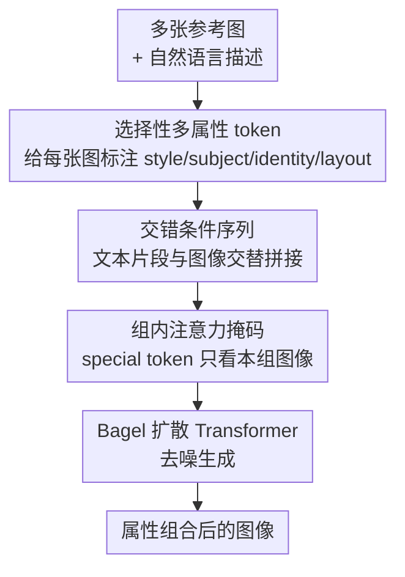

# SIGMA: Selective-Interleaved Generation with Multi-Attribute Tokens

**会议**: CVPR 2026  
**论文**: [CVF Open Access](https://openaccess.thecvf.com/content/CVPR2026/html/Zhang_SIGMA_Selective-Interleaved_Generation_with_Multi-Attribute_Tokens_CVPR_2026_paper.html)  
**代码**: https://github.com/auihund/SIGMA  
**领域**: 图像生成 / 扩散模型 / 可控生成  
**关键词**: 多条件生成、统一扩散 Transformer、属性 token、交错条件、注意力掩码

## 一句话总结
SIGMA 在统一扩散 Transformer（Bagel）上做后训练，给每张参考图打上「风格 / 主体 / 身份 / 布局」等专门的属性 token，把多张参考图和文本以「文本-图像交错」序列喂进模型，再用「组内注意力掩码」防止不同参考图之间串味，从而第一次让统一生成模型支持多条件、多参考图的组合式可控生成。

## 研究背景与动机
**领域现状**：以 Bagel 为代表的统一生成模型证明了「成对的图像-编辑数据」可以把生成、编辑、修复等多种视觉任务对齐进同一个扩散 Transformer，泛化能力很强。这条路线（OmniGen、PixArt-Σ、UniDiffuser 等）正在把「一个模型干所有可控生成」变成现实。

**现有痛点**：但这些统一模型几乎都只接受**单条件输入**——一张参考图、或一句 prompt。现实里的需求往往是「把这个人的身份 + 那只狗的形象 + 梵高的画风」三种异质条件揉进一张图，单条件模型根本表达不了这种组合。

**核心矛盾**：这其实是表示学习里的老问题——**binding（绑定）**：当多个来源的元素要融进一个统一表示时，模型怎么知道「身份从图 1 取、风格从图 2 取、布局从图 3 取」？过去要么用任务专属架构（内容编码器 / 风格编码器分开）硬绑，要么对单一编辑模态过拟合，在 Bagel 这种自回归 Transformer 上都不通用。一旦多张参考图同时进来，注意力会乱串，模型分不清哪个属性该绑到哪张图。

**本文目标**：在不重训 backbone 的前提下，让统一模型学会(1) 解析「多张参考图 + 文本」的混合输入；(2) 选择性地从每张图里抽取指定属性；(3) 避免参考图之间的属性泄漏。

**切入角度**：作者的观察是——binding 的关键不在于改架构，而在于**给每张参考图显式标注「它该贡献什么属性」**。如果把同一张梵高肖像放在 `<Style>` token 下，模型就抽笔触；放在 `<Identity>` token 下，模型就抽脸。属性的语义由 token 决定，而不是由图本身决定。

**核心 idea**：用「选择性多属性 token + 文本-图像交错序列 + 组内注意力掩码」三件套，把多条件 binding 显式编码进输入序列，让 Bagel 在后训练后获得多参考图组合生成能力。

## 方法详解

### 整体框架
SIGMA 是一套**后训练框架**，不改 Bagel 的扩散去噪目标，只改「条件的组织形式」。原 Bagel 是 $z_{t-1} = M_\theta(z_t, c, x_{src}, t)$，即单图 $x_{src}$ + 单 prompt $c$ 去噪。SIGMA 把条件换成一条**交错序列** $s$——里面混着文本片段、多张参考图、以及每张图绑定的属性 token，训练目标仍是预测干净 latent：$L_{SIGMA} = \mathbb{E}_{(s,x_{tgt}),t}\big[\lVert z_{t-1} - M_\theta(z_t, s, t)\rVert_2^2\big]$。

整条数据流是：用户给出若干参考图和一句自然语言描述 → 先把文本里的实体短语和对应图像占位符对齐（Text-Image Interleave）→ 在每个实体前注入专门的属性 token，把「该图该贡献什么属性」写死（Special Token Adding）→ 拼成交错序列送进扩散 Transformer，配合组内注意力掩码做去噪 → 输出组合好的图像。

### 关键设计

**1. 选择性多属性 token：用 token 决定一张图贡献哪个属性，而不是用图本身**

痛点是统一模型把所有参考图一视同仁，没法表达「这张图我只要风格、那张图我只要身份」。SIGMA 给每张参考图 $x_i$ 从一个固定属性词表 $T = \{\text{Style}, \text{Subject}, \text{Identity}, \text{Layout}, \dots\}$ 里挑一个 token $\tau_i$，让它去**调制特征抽取**——激活扩散 Transformer 里的哪个 latent 子空间。具体是把图像编码 $v_i = E_\phi(x_i)$ 和属性 token 经投影后相加，得到 token 条件化的嵌入：

$$t_i = v_i + W_\tau(\tau_i)$$

其中 $W_\tau$ 是可学习的属性投影矩阵。这样同一张梵高肖像，挂在 `<Style>` 下抽笔触、挂在 `<Identity>` 下保人脸——属性是**可选择**的。实际数据集里用了 14 个细粒度 token（identity / subject / clothing / style / layout / pose / lighting 等），并刻意造很多「属性密集」样本（同一张图同时挂 `<subject>`+`<clothing>`+`<background>`），逼模型学会**有选择地抽取**而非无脑融合。

**2. 文本-图像交错条件：让多参考图和文本按用户指定的时序对齐**

有了属性 token 还要解决「多张图怎么排进序列、怎么和文本对上」。SIGMA 让文本嵌入 $T_k$ 和带属性 token 的图像嵌入 $I_k$ **交替排列**，拼成最终输入序列：

$$H = [T_1; I_1; T_2; I_2; \dots; T_n; I_n]$$

$[\cdot]$ 是按用户书写顺序的时序拼接。例如「a photo of a man」+ 肖像图 +「with a dog」+ 狗图 +「in the style of Van Gogh」+ 风格图。这种交错结构让模型在去噪时**联合解析文本和视觉条件**，每个属性 token 紧挨着它要描述的实体短语和参考图，文本-图像、属性-图像的对应关系都局部绑定在一起。推理时用户可以任意顺序、任意组合多种条件，模型按 token 语义自适应解读。值得注意的是，作者强调这种对齐信号**不需要显式奖励模型**——它自然从去噪目标和交错结构里浮现出来。

**3. 组内注意力掩码：堵住参考图之间的属性泄漏**

交错条件带来一个新问题——**属性泄漏**：某张图的 special token 可能去注意到别的参考图的 patch，导致语义串味（要梵高风格结果把梵高的脸也搬过来了）。SIGMA 在 Bagel 原有的因果注意力之上，加一个二值组内掩码。每个 token $h_\ell$ 有类型 $\text{type} \in \{\text{special}, \text{text}, \text{image}, \text{plain}\}$，special 和 image 类型还带组号 $\text{grp}(h_\ell)$（每张参考图一组）。最终掩码由三部分合成：

$$B = (C \wedge M) \vee S, \quad A = (1 - B)\cdot(-\infty)$$

$A$ 在 softmax 前加到注意力 logits 上。三块各司其职：$C$ 是继承自 Bagel 的因果掩码（$C[q,k]=1 \iff k \le q$，保持自回归性）；$S$ 是图内掩码，让同一张图的 patch 之间**全连接双向注意力**（局部结构、几何、空间关系靠它）；$M$ 是组约束——当 query 是 special token、key 是图像 patch、且两者不同组时置 0，**禁止 special token 跨组去看别的参考图**。

$$M[q,k] = \begin{cases} 0, & \text{type}(h_q)=\text{special},\ \text{type}(h_k)=\text{image},\ \text{grp}(h_q)\neq\text{grp}(h_k) \\ 1, & \text{otherwise} \end{cases}$$

这套掩码只施加「最小但有效」的结构：special token 只连自己组的图像 patch，图像内部连通不受限，其余序列照旧走因果顺序。既挡住了跨条件漂移，又通过文本 token 和因果连接保留了全局依赖和关系推理能力。消融显示掩码主要提升结构和感知一致性（CLIP-I、DreamSim）。

**4. 700K 交错多条件数据集：把异质语料统一成可学习的「属性-图像绑定」监督**

光有机制还要有数据教模型「哪个属性该从哪张图取」。作者构建了 70 万条交错序列，覆盖六大任务族：组合生成（100K）、选择性内容抽取（226K）、风格化（153K）、关系迁移（41.6K）、图像编辑（70K）、条件布局生成（110K）。数据一部分用 GPT-4o 和 Nano-Banana 合成（人 / 物 / 场景组合），选择性抽取子集从 Echo-4o 反向构造（把组合输出当输入、用 GPT-4o 找抽取目标），布局子集用 canny/depth + MiDaS 几何线索；Nano-150K、X2Edit、ShareGPT-4o 等现成语料则通过**token 注入流水线**转成交错格式——在每个实体短语前插入 special token、紧跟参考图，把普通 caption 变成「指定每个视觉因子来自哪个源」的结构化多模态序列。

### 损失函数 / 训练策略
基于 Bagel 统一扩散 backbone，**只训生成分支、冻结 VAE**。每个任务族 95% 样本作训练集。50K 步、4×H200，token packing（每个打包 batch 最多 30K token），余弦学习率（峰值 $2\times10^{-5}$、最低 $10^{-7}$），AdamW（$\beta_1=0.9,\beta_2=0.95$）、梯度裁剪 1.0、FSDP 分片并行。损失就是 Bagel 的去噪 MSE（式 2），不引入额外奖励模型。

## 实验关键数据

### 主实验
组合生成（两个 benchmark，括号内为相对 Bagel 的提升）：

| Benchmark | 方法 | CLIP↑ | CLIP-I↑ | DINO↑ | DreamSim↑ |
|-----------|------|-------|---------|-------|-----------|
| XVerseBench | GPT-4o（闭源） | 32.94 | 77.74 | 66.42 | 68.11 |
| XVerseBench | XVerse | 33.94 | 67.53 | 45.24 | 66.25 |
| XVerseBench | Bagel | 24.32 | 66.32 | 56.13 | 53.31 |
| XVerseBench | **SIGMA** | 31.96 (+7.64) | 75.57 (+9.25) | 59.52 (+3.39) | 67.87 (+14.56) |
| Our Bench | GPT-4o（闭源） | 31.07 | 77.93 | 63.58 | 67.49 |
| Our Bench | XVerse | 32.33 | 44.15 | 42.76 | 54.63 |
| Our Bench | Bagel | 17.91 | 52.52 | 41.62 | 43.27 |
| Our Bench | **SIGMA** | 30.29 (+12.38) | 78.94 (+26.42) | 64.08 (+22.46) | 62.45 (+19.18) |

相对 Bagel 提升巨大（自有 benchmark 上 CLIP-I +26.42、DINO +22.46）；CLIP 略低于 XVerse，但 CLIP-I / DINO / DreamSim 全面更高，说明结构和感知对齐更好，整体逼近 GPT-4o / Nano-Banana 等闭源模型。

选择生成（CLIP-ES↓ 衡量「是否选错无关物体」，越低越好）：

| 方法 | CLIP↑ | CLIP-I↑ | CLIP-ES↓ | AES↑ |
|------|-------|---------|----------|------|
| GPT-4o（闭源） | 25.84 | 80.14 | 60.22 | 5.882 |
| Bagel | 23.49 | 70.61 | 67.90 | 5.209 |
| **SIGMA** | 25.90 (+2.41) | 80.26 (+9.65) | 58.02 (–9.88) | 5.849 (+0.64) |

SIGMA 拿到**所有 baseline 里最低的 CLIP-ES**，说明最不容易选错目标、属性排他性最强。布局生成上 F1 从 Bagel 的 0.10 提到 0.44（layout only），结构一致性显著改善。

### 消融实验
拆解多属性 token、组内掩码、以及全参微调 vs LoRA（"All"列有勾=全参微调，无勾=LoRA）：

| Special token | Mask | All | CLIP↑ | CLIP-I↑ | DreamSim↑ | AES↑ |
|:---:|:---:|:---:|------|---------|-----------|------|
| ✓ | | | 25.85 | 62.67 | 44.74 | 5.576 |
| ✓ | ✓ | | 29.25 | 74.26 | 57.11 | 5.561 |
| ✓ | ✓ | ✓ | 30.29 | 78.94 | 62.45 | 5.731 |

（注：原表还有一行「✓ token + ✓ All（无 mask）」给出 CLIP-I 72.64 / DreamSim 58.65。）

### 关键发现
- **属性 token 是地基**：去掉后 CLIP / CLIP-I 大幅下跌（CLIP-I 仅 62.67），模型彻底搞不清「该抽哪个属性、用到哪里」，定性上直接把物体角色搞混。
- **组内掩码主管一致性**：加上后 CLIP-I、DreamSim 进一步提升，结构和感知一致性变好；缺掩码时风格化会「塌缩成直接复制风格参考图」，说明掩码是把 style token 绑到内容图的关键。
- **全参 > LoRA**：LoRA 能用但在对齐和美学上都落后全参微调，受限的参数更新削弱了表达能力（LoRA 生成会漏掉电缆这类细节）。

## 亮点与洞察
- **把 binding 问题转成「输入序列工程」**：不改 backbone、不加奖励模型，仅靠 token 注入 + 交错排序 + 注意力掩码就让单条件统一模型获得多条件能力，思路非常工程友好且 model-agnostic，理论上可迁移到任意扩散 Transformer。
- **「属性由 token 决定而非由图决定」很巧妙**：同一张图挂不同 token 抽不同属性，这把「参考图」和「参考图的用途」解耦开，是多参考组合生成的关键认知。
- **组内掩码是低成本高收益的 trick**：只在 special↔image 的跨组连接上动刀，保留图内全连接和文本因果连接，最小干预却精准堵住属性泄漏——这种「只约束最该约束的地方」的掩码设计可复用到任何多源条件融合场景。
- **CLIP-ES 这个「排他性」指标**值得借鉴：多参考设定下，光看相似度不够，还要看「有没有把不该选的也选进来」。

## 局限与展望
- **强依赖 Bagel backbone 和合成数据**：700K 数据大量由 GPT-4o / Nano-Banana 合成，selective 子集靠 GPT-4o 反向标注，数据质量和偏置直接决定上限；属性词表（14 个 token）是固定的，遇到词表外的新属性需要重新设计。
- **CLIP 指标仍逊于 XVerse / 闭源**：作者也承认 CLIP 略低，文本-图像语义对齐不是强项，主要赢在结构和感知一致性。
- **benchmark 多为自建 held-out**：Our Bench 与训练同源，跨域泛化（真实用户的奇葩组合）未充分验证；评测大量依赖 CLIP 系自动指标，缺人评。
- **可改进**：属性词表可学习化 / 开放词表化；把组内掩码扩展成软掩码（允许受控的跨条件交互，做关系迁移可能更自然）；探索去掉合成数据依赖、用真实多参考数据训练。

## 相关工作与启发
- **vs Bagel**：Bagel 是单条件统一模型（一图一 prompt），SIGMA 在它上面做后训练，扩展成多条件、多参考图交错输入；几乎所有指标相对 Bagel 大幅提升，是直接的「能力补丁」。
- **vs XVerse / SSR**：同为统一扩散 Transformer，但 SIGMA 的 CLIP-I / DINO / DreamSim 更高，结构和感知对齐更好，定性上更少出现「选错属性、应用错误」的一致性问题（XVerse CLIP 分略高）。
- **vs IP-Adapter / ControlNet / T2I-Adapter**：这些是任务专属的条件注入模块（pose/depth/sketch），靠独立模块或专属微调，跨条件泛化差；SIGMA 用统一序列把多种异质条件揉进同一 backbone，无需为每种条件单独训模块。
- **vs 闭源 GPT-4o / Nano-Banana**：作为开源方案，SIGMA 在多个 benchmark 上逼近甚至局部反超（如 Our Bench 的 CLIP-I），证明显式 binding 机制能弥补一部分规模差距。

## 评分
- 新颖性: ⭐⭐⭐⭐ 「属性 token + 交错条件 + 组内掩码」组合解多参考 binding，思路清晰且实用，但每个组件单看都不算颠覆性。
- 实验充分度: ⭐⭐⭐⭐ 三大任务 + 多 baseline + 消融齐全，但 benchmark 多自建、几乎全靠自动指标、缺人评和跨域测试。
- 写作质量: ⭐⭐⭐⭐ 动机（binding 问题）讲得透，公式和图示清楚；部分细节（属性词表如何选 token）留在补充材料。
- 价值: ⭐⭐⭐⭐ model-agnostic 的多条件后训练方案 + 700K 数据集 + 代码开源，对统一可控生成社区实用价值高。

<!-- RELATED:START -->

## 相关论文

- [\[CVPR 2026\] TokenLight: Precise Lighting Control in Images using Attribute Tokens](tokenlight_precise_lighting_control_in_images_using_attribute_tokens.md)
- [\[CVPR 2026\] SpotEdit: Selective Region Editing in Diffusion Transformers](spotedit_selective_region_editing_in_diffusion_transformers.md)
- [\[CVPR 2026\] Omni-Attribute: Open-vocabulary Attribute Encoder for Visual Concept Personalization](omni-attribute_open-vocabulary_attribute_encoder_for_visual_concept_personalizat.md)
- [\[CVPR 2026\] Camera Control for Text-to-Image Generation via Learning Viewpoint Tokens](camera_control_for_text-to-image_generation_via_learning_viewpoint_tokens.md)
- [\[CVPR 2026\] LacTokGen: Latent Consistency Tokenizer for 1024-pixel Image Generation by 256 Tokens](lactokgen_latent_consistency_tokenizer_for_1024-pixel_image_generation_by_256_to.md)

<!-- RELATED:END -->
