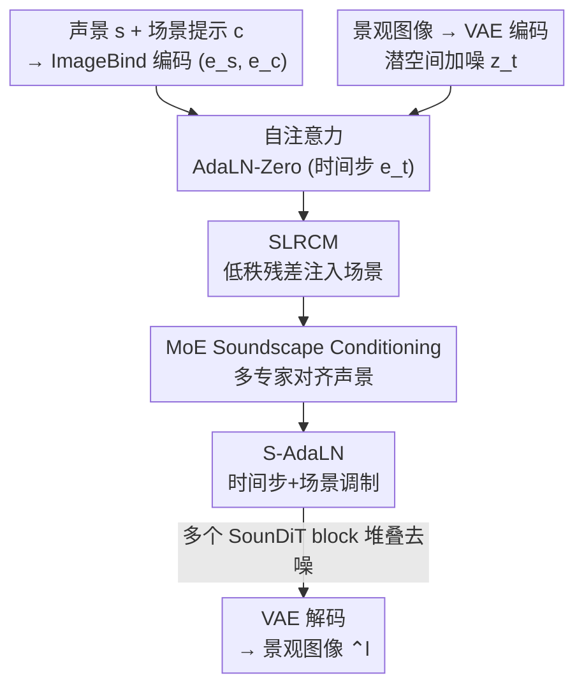

# SounDiT: Geo-Contextual Soundscape-to-Landscape Generation

**会议**: CVPR 2026  
**论文**: [CVF Open Access](https://openaccess.thecvf.com/content/CVPR2026/html/Wang_SounDiT_Geo-Contextual_Soundscape-to-Landscape_Generation_CVPR_2026_paper.html)  
**代码**: 项目页 https://gisense.github.io/SounDiT-Page/  
**领域**: 扩散模型 / 图像生成 / 跨模态生成  
**关键词**: 声景到景观生成、音频到图像、扩散 Transformer、混合专家、地理上下文

## 一句话总结
这篇论文提出了"地理情境下的声景到景观生成"（GeoS2L）这一新任务——从环境声景（而非单个发声物体）合成地理上真实的景观图像，并配套构建了两个大规模声景-景观配对数据集（SoundingSVI 16.9 万对、SonicUrban 23.7 万对）、一个在 DiT 基础上注入声景与场景上下文的 SounDiT 模型，以及一个衡量"地理一致性"的 Place Similarity Score（PSS）评测框架，在 FID 等指标上大幅超越现有音频到图像方法（FID 从 34→16、41→11）。

## 研究背景与动机
**领域现状**：音频到图像（Audio-to-Image, A2I）生成已经能根据声音合成对应物体的图像——听到鸟叫就画一只鸟，听到车声就画一辆车。主流做法（Sound2Scene、AudioToken、GlueGen、CoDi 等）依赖通用音视频数据集（物体音、人声、天气、有限场景类型），把音频信号映射到它的"声源"。

**现有痛点**：地理学、城市规划、环境心理学真正关心的不是"哪只鸟、哪辆车"，而是声音所处的**环境场景**——鸟叫意味着林间小径还是城市绿地、车声意味着繁忙街景还是某条具体街道。现有 A2I 模型把声音绑定到发声物体，丢掉了对实际应用至关重要的地理情境，常常生成风格化或不真实、与真实地理环境不一致的图像。即便有少数基于扩散的地理 A2I 探索，也只拿声景做唯一输入、不引入地理上下文。同时，DiT（Diffusion Transformer）这类近年在图像/视频生成上很强的架构，在 A2I 中几乎未被探索，更没有融入地理知识。

**核心矛盾**：声景天然信息不足以唯一确定视觉环境——一段鸟叫既可能发生在乡村公园也可能在城市公园。仅靠声音单模态无法稳定锁定"是哪一类地方"，而现有评测（FID、AIS、IIS）只看视觉/音频保真度，根本不衡量"生成图像是否和输入声景处在同一种地理场景里"。

**本文目标**：把 A2I 升级为带地理情境的 GeoS2L——给定环境声景 $s$、可选场景提示 $c$（如 park / beach / street），生成既视觉真实、又与真实景观地理一致的图像 $\hat{l}$；并提供能度量这种地理一致性的评测体系。

**切入角度**：声景与景观共处同一空间、共享相同的环境特征与场所设定，因此可以用一个**可选场景提示**补足声音的歧义，并用"场景上下文"作为额外的地理条件去引导扩散过程，同时把评测从"像不像图"改成"是不是同一类地方"。

**核心 idea**：在 DiT 主干的每个 block 内同时注入**声景条件**（用混合专家 MoE 做多层次声音特征对齐）和**场景条件**（用低秩混合器 SLRCM + 场景化 AdaLN 两处注入），并用地理语义对齐的 PSS 取代单纯视觉保真度评测。

## 方法详解

### 整体框架
SounDiT 是一个潜空间扩散 Transformer：景观图像先经 Stable Diffusion 的 VAE 编码器压进潜空间 $e_l = E_L(l)$，在潜空间做前向加噪 + 反向去噪，再由 VAE 解码器还原为图像。条件侧用预训练多模态编码器 ImageBind 把声景 $s$ 和场景提示 $c$ 编进共享潜空间，得到声景嵌入 $e_s$ 和场景嵌入 $e_c$。

关键在于每个 **SounDiT block 的四阶段流水**：① 先做以时间步嵌入 $e_t$ 为条件的多头自注意力（沿用 AdaLN-Zero，保持与预训练 DiT 主干兼容）；② 用轻量的 **SLRCM** 在 block 内开一条低秩残差路，把场景上下文注入 token；③ 用 **MoE Soundscape Conditioning** 通过多专家交叉注意力对齐多层次声景特征与视觉 token；④ 再用 **S-AdaLN** 把时间步与场景嵌入混合出 scale/shift，对 token 做场景化调制后过前馈网络、门控残差相加，输出噪声残差预测。场景条件被刻意安排在 MoE 声景条件**之前（SLRCM）和之后（S-AdaLN）各注入一次**，从而层级化地融合视觉、场景、声景三类线索。

### 关键设计

**1. MoE Soundscape Conditioning：用共享 K/V + 专家专属低秩 Query 对齐多层次声景**

声景信息是多层次的（鸟鸣的频段、车流的低频轰鸣可能各自对应不同视觉线索），单一交叉注意力难以同时照顾到。该模块用 $M$ 个专家**共享键 $K_s$ 与值 $V_s$**（$K_s = s W_K,\ V_s = s W_V$，只算一次），但每个专家维护一个**专属低秩 Query**：$Q_m = f(x)\,W^{(m)}_{q\downarrow} W^{(m)}_{q\uparrow}$（$f$ 是逐 token LayerNorm），各专家输出 $Z_m = \mathrm{MHA}(Q_m, K_s, V_s)\,W_O$（$W_O$ 跨专家共享）。路由权重由音频摘要与可学习原型 $P$ 的温度缩放点积给出，并注入时间步增强：$w = \mathrm{Softmax}\!\big(\tfrac{1}{\tau} e_s^\top (P + W_t e_t \mathbf{1}^\top)\big)$。最后用 top-$k$ 软混合聚合并加全局音频门：$x' = x + \gamma \sum_{m\in K} \mathrm{softmax}(w_m/\tau_m)\, Z_m$，其中 $\gamma = \tanh(e_s)$ 是零中心有界的标量门。共享 K/V 让计算预算固定，专家专属 Query 又允许"专家特化"去吃不同的声景子结构，从而在多样声景上提升地理一致性——消融里把专家数从 2 增到 8，FID 与场景一致性都单调变好。

**2. SLRCM（Scene Low-Rank Content Mixer）：在不破坏预训练注意力的前提下低成本注入场景先验**

直接把场景嵌入塞进注意力会扰动预训练 DiT 的结构。SLRCM 改为在每个 block 内开一条**低秩残差路**：给定 token $x$ 与场景嵌入 $e_c$，构造一个由 $e_c$ 参数化、秩为 $r$ 的线性算子 $A(e_c) = W_q\,\mathrm{Diag}(\tanh(\phi(e_c)))\,W_v$，其中 $W_q\in\mathbb{R}^{D\times r}$、$W_v\in\mathbb{R}^{r\times D}$ 是低秩投影，$\phi$ 把场景嵌入映成 $r$ 维门控向量，对角算子沿秩-$r$ 通道逐元素施门。再配一个**逐样本强度** $s(e_c) = g(e_c)\,\mu\,\tanh(\alpha)$（$g$ 经 softplus 给出正的逐样本尺度，$\mu$ 是全局引导标量，$\alpha$ 是有界可学习标量，初始化为 0 以从恒等映射稳起步）。token 更新为 $x' = x + s(e_c)\,\mathrm{LN}(x)\,A(e_c)$。这条对角门控的低秩通路计算开销小、又保留了预训练注意力结构，单独把它去掉 FID 从 19.2 升到 20.3、场景 PSS 从 0.734 降到 0.704。

**3. S-AdaLN（Scene AdaLN）：把场景信息在 block 末端再调制一次以巩固地理一致性**

仅在 block 前端注入场景容易被后续 MoE 声景条件冲淡。S-AdaLN 是 AdaLN-Zero 的扩展，从**时间步嵌入 $e_t$ 与场景嵌入 $e_c$** 通过可学习的有界混合导出 scale–shift 参数，对（经 MoE 声景条件后的）token 做调制，再过逐点前馈网络与门控残差相加输出。这等于把场景条件"夹"在 MoE 声景条件的前后各注入一次，让视觉、场景、声景被层级化地融合。消融显示它比 SLRCM 更关键：单独去掉 S-AdaLN，FID 升到 23.4、场景 PSS 掉到 0.572，明显大于去掉 SLRCM 的损失。

**4. Place Similarity Score（PSS）：从"像不像图"改成"是不是同一类地方"的三层地理评测**

FID/AIS/IIS 只看视觉或音频保真度，测不出地理语义对齐。PSS 从三个层级度量生成图与真值图所反映的"场所设定"是否一致：

- **元素级** $\mathrm{PSS}_{elem}$：用 ADE20K 上预训练的 DeepLabV3 分割 $K{=}150$ 类地理元素（树、天空、水体、交通标志、建筑等），取归一化元素占比向量 $e_i,\hat e_i$，算余弦相似度并对 $n$ 张图平均：$\mathrm{PSS}_{elem} = \tfrac{1}{n}\sum_i \tfrac{e_i^\top \hat e_i}{\lVert e_i\rVert_2 \lVert \hat e_i\rVert_2}$（越高越好）。
- **场景级** $\mathrm{PSS}_{scene}$：用 Places365 上预训练的 ResNet50 预测 365 类场景，判断生成图的 top-$k$ 场景集合与真值是否相交：$\mathrm{PSS}_{scene} = \tfrac{1}{n}\sum_i \mathbf{1}(P_i^k \cap T_i^k \neq \varnothing)$，$k=1$ 或 $5$（越高越好）。
- **人类感知级** $\mathrm{PSS}_{perc}$：用 MIT Place Pulse 预训练的 DenseNet121 给出六维主观感知分（safe/beautiful/depressing/lively/wealthy/boring），算真值与生成图感知向量的 $L_1$ 距离 $\mathrm{PSS}_{perc} = \tfrac{1}{n}\sum_i \lVert R(l_i) - R(\hat l_i)\rVert_1$（越低越好）。

三层合一，把评测从视觉质量扩展到"生成景观是否与输入声景的环境特征地理对齐"，这是本文支撑下游城市规划应用的关键评测贡献。

### 损失函数 / 训练策略
任务被形式化为让生成图与真值在相关性函数 $R(s,c,l)$ 上对齐：$\mathcal{L} = \mathbb{E}_{(s_i,c_i,l_i)\sim D}\big[R(s_i,c_i,l_i) - R(s_i,c_i,\hat l_i)\big]$，本质仍是潜空间扩散去噪。实现细节：VAE 取自 Stable Diffusion（COCO 上训），声景/场景用 ImageBind-Huge（200 万 AudioSet 片段上训）编码；学习率 $1\times10^{-4}$，声景引导标量 $\mu=1.0$，场景缩放参数 $\alpha$ 初始化为 0（从恒等映射稳起步）；推理时对声景与场景提示都用 scale=4.0 的 classifier-free guidance；训练在 H100/A100/A6000 上进行。

## 实验关键数据

### 主实验
在 SoundingSVI（16.9 万）与 SonicUrban（23.7 万）两个自建数据集上，对比 CoDi、Sound2Scene、AudioToken（含 SD1/SD2 变体）、GlueGen、PixArt+MHCA。指标含通用的 FID↓/AIS↑/IIS↑ 与本文 PSS（Element↑/Scene↑/Perception↓）。SounDiT 在两数据集上 FID 大幅领先（34.1→16.8、41.5→11.6），并在 PSS 各层级普遍最优。

| 数据集 | 方法 | FID↓ | AIS↑ | IIS↑ | Scene↑ | Perception↓ |
|--------|------|------|------|------|--------|-------------|
| SoundingSVI | PixArt+MHCA（此前最强基线） | 34.108 | 0.518 | 0.578 | 0.390 | 0.743 |
| SoundingSVI | **SounDiT（本文）** | **16.839** | **0.538** | **0.753** | **0.753** | **0.729** |
| SonicUrban | PixArt+MHCA（此前最强基线） | 41.456 | 0.517 | 0.592 | 0.396 | 0.796 |
| SonicUrban | **SounDiT（本文）** | **11.553** | 0.520 | **0.706** | **0.739** | **0.759** |

> 注：SonicUrban 上 SounDiT 的 Perception（0.759）略高于 PixArt+MHCA（0.796 更差、值越低越好实为 SounDiT 更优）；AIS 上与最优基线接近，整体在保真度与地理一致性上同时领先。⚠️ 个别单元格以原文表 2 为准。

用户研究：17 名参与者做两项匹配任务（选与声景最契合的生成图、选与真值最像的生成图），平均匹配准确率 **86.13%**，说明声景与其生成图之间有较强的感知对齐。

### 消融实验
在 SoundingSVI（MoE 设 2 专家）上验证两个场景条件模块。把 SLRCM 与 S-AdaLN 同时去掉退化最严重，单独去任一个都明显掉点，且 S-AdaLN 比 SLRCM 更关键。

| 配置 | FID↓ | AIS↑ | IIS↑ | PSS_Scene↑ | 说明 |
|------|------|------|------|-----------|------|
| Full Model | 19.195 | 0.538 | 0.750 | 0.734 | 完整模型 |
| w/o SLRCM + S-AdaLN | 25.375 | 0.511 | 0.539 | 0.428 | 两个场景模块全去，场景一致性崩塌 |
| w/o SLRCM | 20.335 | 0.534 | 0.728 | 0.704 | 去前端低秩注入，小幅退化 |
| w/o S-AdaLN | 23.435 | 0.529 | 0.629 | 0.572 | 去末端场景调制，退化更大 |

专家可扩展性：固定其他设置，把 MoE 声景条件的专家数 $M$ 从 2 增到 8，FID 与场景一致性单调变好。

| 专家数 $M$ | 2 | 4 | 6 | 8 |
|-----------|------|------|------|------|
| FID↓ | 19.195 | 18.304 | 17.278 | **16.839** |
| PSS_Scene↑ | 0.734 | 0.741 | 0.742 | **0.753** |

### 关键发现
- 两个场景条件模块里 **S-AdaLN 贡献更大**：单去它 FID +4.2、场景 PSS −0.162，远超单去 SLRCM 的损失，说明在 MoE 声景条件**之后**再注入一次场景比之前更重要。
- 把场景条件"前后各注入一次"（SLRCM 前、S-AdaLN 后）优于只注入一次，二者全去时场景 PSS 从 0.734 暴跌到 0.428。
- MoE 声景条件**随专家数增加单调变好**，共享 K/V + 专家专属低秩 Query 的设计能在固定预算下吃下更多样的声景结构。
- SounDiT 支持**同声景换场景提示**生成不同但声学一致的景观图，直接服务于声景引导的城市设计等下游应用。

## 亮点与洞察
- **把"声源识别"重新框成"地理场所推断"**：从画"那只鸟"转向画"鸟所在的那类环境"，这个任务重定义本身就打开了地理/城市规划的实际应用面，是最让人"啊哈"的地方。
- **场景条件的"夹心"注入很巧**：SLRCM（block 前端低秩残差）+ S-AdaLN（block 末端 AdaLN 调制）把场景信息夹在 MoE 声景条件两侧，既补足声音歧义、又防止场景被声景条件冲淡，消融数据强力支持这一安排。
- **共享 K/V 的 MoE 交叉注意力**是个可复用 trick：固定键值预算、只让 Query 低秩特化，既省算力又能特化——可迁移到任何"单条件多层次、想用多专家但怕涨显存"的交叉注意力场景。
- **PSS 把评测对齐到任务真实目标**：用现成分割/场景/感知模型组合出元素-场景-感知三层地理一致性度量，比单纯 FID 更贴近"是不是同一类地方"，这种"用领域知识重构 metric"的思路值得借鉴。

## 局限与展望
- **强依赖外部预训练模型**：VAE（SD/COCO）、ImageBind（AudioSet）、以及 PSS 用的 DeepLabV3/ResNet50/DenseNet121 都来自通用域，其偏置会传导到生成与评测；PSS 本质是"用一堆分类/分割模型代理地理一致性"，并非真值地理标注。
- **数据构造链条噪声**：SoundingSVI 用声源定位模型把声景片段匹配到最相关街景图、用 VLM（Qwen2.5-VL-7b）自动标场景提示，匹配/标注误差会进入训练，论文未量化其影响。⚠️ 以原文为准。
- **场景提示是可选但很关键**：消融显示去掉场景条件退化明显，意味着纯声景输入时性能上限受限；真实部署时若无人工场景提示，需依赖自动标注，可能不稳。
- **改进方向**：引入显式地理坐标/遥感先验、把 PSS 的代理模型换成地理标注监督、或让模型自动从声景推断场景提示而非依赖外部 VLM。

## 相关工作与启发
- **vs Sound2Scene / GAN 类 A2I**：它们把音频映到声源物体、用通用音视频数据，常生成风格化图；本文转向"声音所处环境"，用大规模地理配对数据 + DiT，地理一致性（PSS）显著更高。
- **vs AudioToken / GlueGen / CoDi（扩散类 A2I）**：同为扩散，但它们仅以声景为唯一输入、无地理上下文；SounDiT 在 DiT block 内显式注入场景条件（SLRCM+S-AdaLN）并用 MoE 对齐多层次声景，FID 与 PSS 全面领先。
- **vs PixArt+MHCA（最强 DiT 基线）**：仅靠多头交叉注意力接声景；本文的低秩场景注入 + 共享 K/V 的 MoE 声景条件更省算力且更稳，FID 从 34→16（SoundingSVI）。
- **vs SoundingEarth 等地理音视数据集**：SoundingEarth 配的是俯视遥感图（5 万）；本文 SoundingSVI/SonicUrban 是地面街景视角、规模更大（16.9 万 / 23.7 万）、覆盖 90+ 国家与 131 城，更贴合街景级声景-景观研究。

## 评分
- 新颖性: ⭐⭐⭐⭐⭐ 重定义 A2I 为地理情境的 GeoS2L，任务/数据/模型/评测四件套齐全
- 实验充分度: ⭐⭐⭐⭐ 两大数据集 + 6 基线 + 组件/专家双消融 + 用户研究，较扎实，但缺对数据构造噪声的量化
- 写作质量: ⭐⭐⭐⭐ 动机清晰、公式完整；个别表格列（如 Perception 方向）需对照原文确认
- 价值: ⭐⭐⭐⭐⭐ 数据集 + PSS 评测为声景-景观研究立了可复现基准，对地理/城市规划有实际意义

<!-- RELATED:START -->

## 相关论文

- [\[CVPR 2026\] Beyond Objects: Contextual Synthetic Data Generation for Fine-Grained Classification](beyond_objects_contextual_synthetic_data_generation_for_fine-grained_classificat.md)
- [\[CVPR 2026\] FailureAtlas: Mapping the Failure Landscape of T2I Models via Active Exploration](failureatlas_mapping_the_failure_landscape_of_t2i_models_via_active_exploration.md)
- [\[CVPR 2026\] CARE-Edit: Condition-Aware Routing of Experts for Contextual Image Editing](care-edit_condition-aware_routing_of_experts_for_contextual_image_editing.md)
- [\[NeurIPS 2025\] Contextual Thompson Sampling via Generation of Missing Data](../../NeurIPS2025/image_generation/contextual_thompson_sampling_via_generation_of_missing_data.md)
- [\[AAAI 2026\] MACS: Multi-source Audio-to-Image Generation with Contextual Significance and Semantic Alignment](../../AAAI2026/image_generation/macs_multi-source_audio-to-image_generation_with_contextual_significance_and_sem.md)

<!-- RELATED:END -->
