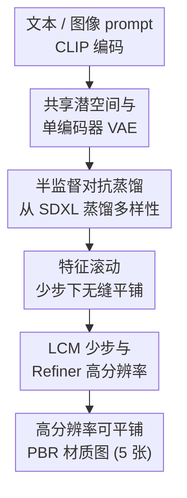

# StableMaterials: Enhancing Diversity in Material Generation via Semi-Supervised Learning

**会议**: CVPR 2026  
**论文**: [CVF Open Access](https://openaccess.thecvf.com/content/CVPR2026/html/Vecchio_StableMaterials_Enhancing_Diversity_in_Material_Generation_via_Semi-Supervised_Learning_CVPR_2026_paper.html)  
**代码**: https://gvecchio.com/stablematerials  
**领域**: 图像生成 / 扩散模型  
**关键词**: 材质生成, PBR, SVBRDF, 半监督学习, 对抗蒸馏, 潜在扩散模型

## 一句话总结
StableMaterials 是一个基于潜在扩散模型的 PBR 材质生成方法，通过"半监督对抗蒸馏"把大规模图像模型 SDXL 的多样性知识迁移进材质域——在只有约 6,200 个有标注材质的窘境下，用 SDXL 生成的无标注纹理补足训练分布，再配合少步 LCM 蒸馏、特征滚动平铺和扩散精修，做到了快速、可平铺、高分辨率且多样的材质生成。

## 研究背景与动机

**领域现状**：游戏/影视/建筑可视化需要大量物理基渲染（PBR）材质，传统手工制作门槛极高。近年学习方法分两条路——从单张图像估计 SVBRDF 反射参数（如 MatGen/ControlMat），或从文本/图像条件直接生成材质（如 MatFuse、TileGen、Substance 3D Sampler）。

**现有痛点**：这些方法的能力被训练数据卡死。即便有 MatSynth、OpenSVBRDF、Deschaintre 等"大规模"材质数据集，其多样性也远不及 LAION 这类自然图像数据集——材质标注（多张对齐的 reflectance map）天然稀缺且昂贵。数据多样性不足直接导致生成材质单调、对训练集外（out-of-domain）概念无能为力。

**核心矛盾**：想借助大规模预训练图像模型（SDXL）的丰富先验来补足多样性，但**图像和材质是两个不同的域**——一张纹理图 vs. 多张对齐的 SVBRDF 贴图（base color/normal/height/roughness/metallic）。LoRA 微调、Diff-Instruct 这类蒸馏只在**同域**内好用，跨域（image→material）直接蒸馏会失效：SDXL 生成的纹理没有对应的材质属性标注，无法做直接监督。

**本文目标**：① 把无标注（非 PBR）纹理纳入材质生成模型的训练；② 跨域地从 SDXL 蒸馏知识以提升多样性；③ 在少步快速生成的同时保持可平铺和高分辨率。

**切入角度**：既然 SDXL 纹理没法直接监督，那就**不要求逐像素对齐**，转而在共享潜空间里用对抗损失把"SDXL 纹理"的分布拉到"真实材质"的分布上——让判别器逼着生成器即使从无标注纹理出发，也输出"像材质"的潜在特征。

**核心 idea**：用"主监督 + 辅助对抗"的半监督训练，把对抗损失当作跨域蒸馏信号，从 SDXL 偷来多样性，同时用监督项锚住物理合理性，避免模式崩溃。

## 方法详解

### 整体框架
StableMaterials 建立在 MatFuse 的 LDM 范式之上：一个 VAE 把 5 张材质贴图压成一个解耦的潜在张量 $z$，一个时间条件 U-Net 扩散模型在 $z$ 上去噪生成。输入是文本或图像 prompt（CLIP 编码成单个特征向量），输出是 512×512 的 5 张 PBR 贴图，再经精修升到高分辨率。整条管线有四块关键改造：先把纹理和材质塞进**同一个共享潜空间**（并把多编码器 VAE 瘦身成单编码器），让 SDXL 纹理能进训练；训练时用**半监督对抗蒸馏**把 SDXL 的多样性灌进来；推理时用**特征滚动**解决少步生成下的平铺接缝，再用 **LCM 少步 + 扩散 Refiner** 实现 4 步快速、高分辨率输出。

### 关键设计

**1. 共享潜空间与单编码器 VAE：让无标注纹理和材质住进同一个潜空间**

要把 SDXL 纹理纳入训练，前提是纹理和材质能被压到**同一个**潜在表示里，否则对抗损失没有共同的"特征空间"可对齐。作者分三步搭建：先按 MatFuse 训练一个多编码器 VAE，每个编码器 $E_i$ 把第 $i$ 张贴图 $M_i$ 编成 $z_i$，拼接得 $z=\text{concat}(z_1,\dots,z_N)$，解码器重建 $\hat{M}=D(z)$，训练用像素 L2、LPIPS 感知、patch 对抗和渲染损失，再加 KL 正则。然后**冻结解码器，只训一个单编码器 $E'$** 把拼接后的贴图直接压到同一个 $z$——这把参数从 271M 砍到 101M，重建质量却基本不变（见 Tab. 2），同时保留了解耦的潜在表示。最后再**微调一个纹理自编码器**，把单张纹理（如 base color）压进同一个 $z$，解码器同样冻结。这第三个网络专门为半监督训练服务：它让 SDXL 的纹理与材质共享同一个潜空间，对抗损失才有意义。

**2. 半监督对抗蒸馏：用对抗损失当跨域蒸馏信号，从 SDXL 偷多样性**

这是全文核心。直接拿 SDXL 纹理做监督不可行（无材质标注、跨域），所以作者把训练拆成"主监督 + 辅助对抗"。监督损失保证有标注材质被正确重建、物理合理：

$$L_{sup} = \mathbb{E}_{t,z_0,\epsilon}\big[\|\epsilon_t-\epsilon_\theta(z_{t,mat},t)\|^2\big] + \alpha\,\mathbb{E}_{t,z_0,\epsilon}\big[\|\epsilon_t-\epsilon_\theta(z_{t,tex},t)\|^2\big]$$

其中 $z_{t,mat}$、$z_{t,tex}$ 分别是材质和纹理在第 $t$ 步的加噪潜变量，$\alpha=0.15$ 控制无标注纹理项的权重。对抗损失则逼生成器把纹理和材质映到同一个特征分布：

$$L_{adv} = -\mathbb{E}_{z\sim p(z)}\big[\,LD(z_{t-1})\,\big],\quad z_{t-1}=\text{concat}(z_{t-1,mat},\,z_{t-1,tex})$$

它作用在去噪后的潜变量 $z_{t-1}$ 上。这里引入了一个**潜在判别器（LD）**：它用 hinge loss 训练，把 VAE 编码出的真实材质潜变量当 real、生成器去噪出的当 fake，且**只有真实材质潜变量被当作 real 样本**。LD 是时间条件的（同样接收 $t$ 和 CLIP 嵌入），架构镜像扩散 U-Net 的编码器并用其权重初始化，借此理解潜空间、有效引导生成器。关键在于训练**以监督为主、对抗为辅**：对抗只当蒸馏信号，把 SDXL 纹理的多样性灌进来，又不会喧宾夺主导致模式崩溃；同时对抗项确保 SDXL 纹理被映成"真实材质"的潜变量，抵消纹理里的阴影伪影。和那些用对抗蒸馏做**快速生成**的工作（如 SD-Turbo）不同，这里对抗是用来**跨域弥合材质与纹理的鸿沟**。

**3. 特征滚动（Features Rolling）：在少步生成下也能无缝平铺**

材质生成必须可平铺（tileable）。此前的"噪声滚动（noise rolling）"通过迭代扩散实现平铺，但**步数一少就失效**——而本文为了快又恰恰要少步。作者把滚动操作从噪声输入挪到 U-Net 特征上：在每个卷积层和注意力层里，**随机滚动特征图、处理后再反向滚回**，从而在更少扩散步下也保持边缘连续性、消除接缝。对高度结构化的材质（如规则瓷砖），只在第一步扩散之后才开启特征滚动，以保留其全局布局。这是少步快速生成与可平铺之间矛盾的直接解法。

**4. LCM 少步生成与 Refiner 高分辨率：4 步出图 + 两阶段精修升分辨率**

为提速，作者蒸馏一个潜在一致性模型（LCM）：它对增广的概率流 ODE（PF-ODE）做单阶段引导蒸馏，用一致性函数 $f_\theta(z_t,c,t)\mapsto z_0$ 直接预测 $t=0$ 的解，并把引导尺度 $\omega$ 直接整合进 PF-ODE、配合 skip-step 策略保证相邻时间步一致，避免两阶段方法的对齐问题——最终把推理压到每阶段 4 步。高分辨率则走"先低后精"的两阶段管线（类似 SDXL）：先在 512×512 生成，再用 SDEdit 以 strength 0.5 精修升分辨率，平衡新高频细节与全局一致；Refiner 在 4K 材质的全分辨率 512×512 裁切（不下采样）上训练，专攻细表面细节。配合 patch-based diffusion 控制显存，先在 512×512 巩固各 patch 再升分辨率，避免单纯逐 patch 生成带来的跨块尺度/一致性伪影。

### 损失函数 / 训练策略
总目标为监督损失与对抗损失之和 $L_{sup}+L_{adv}$。训练分阶段：自编码器在单张 RTX4090（24GB）上用 Adam、batch 8 训 1,000,000 步（学习率 $4.5\times10^{-4}$，300,000 步后开启 $L_{adv}$）；扩散模型先纯监督训 400,000 步（AdamW，batch 16，学习率 $3.2\times10^{-5}$），再半监督微调 200,000 步（batch 8）；Refiner 微调 50,000 步；LCM 微调 10,000 步（$T=4$ 步采样）。条件方面，训练时随机丢弃模态——以 75% 概率丢文本、25% 概率丢图像，平衡两种条件。数据用 MatSynth + Deschaintre 共 6,198 个 PBR 材质，外加 SDXL 用 200 个 prompt（ChatGPT 建议）生成的 4,000 个纹理-文本对。

## 实验关键数据

### 主实验
材质质量难用 FID/IS 等标准图像指标衡量（材质分布与自然图像差异大），作者改用 CLIP 系指标：CLIP Score 评语义对齐、CLIP-IQA 评感知质量（用 "high-quality/low-quality" 对比对计算），在 80 个文本条件生成上比较。

| 方法 | 数据集 | CLIP Score ↑ | CLIP-IQA ↑ |
|------|--------|--------------|------------|
| MatFuse | 公开 | 26.2 | 0.52 |
| MatGen | 私有 | 28.8 | 0.66 |
| Substance 3D Sampler | 私有 | 24.9 | **0.71** |
| **StableMaterials** | 公开 | **29.6** | 0.70 |

StableMaterials 在 CLIP Score 上最高（29.6），CLIP-IQA（0.70）与用私有数据训练的 Sampler（0.71）持平，且大幅超过同样用公开数据的 MatFuse。

20 位领域专家、每人在 10 个 prompt 上做偏好选择 + 1–5 分打分的用户研究：

| 方法 | 被选偏好次数 | 平均评分 (1–5) |
|------|-------------|----------------|
| MatFuse | 4 | 1.85 |
| MatGen | 25 | 2.28 |
| Substance 3D Sampler | 66 | 2.71 |
| **StableMaterials** | **105** | **3.50** |

单因素 ANOVA 证实差异显著（$F=60.5$，$p<0.05$）；卡方拟合优度检验偏好计数 $\chi^2=120.44$，$p<0.001$，显著偏离随机；平均评分与偏好计数相关系数 $R=0.99$。

### 消融实验

| 配置 | 关键观察 | 说明 |
|------|---------|------|
| 单编码器 VAE (101M) | RMSE 与多编码器 (271M) 基本持平 | 参数砍 63%，重建质量不降（见下表） |
| w/o 半监督蒸馏 | out-of-domain 材质生成不稳定/失败 | 去掉蒸馏后无法可靠生成训练集外材质 |
| w/ 半监督蒸馏 | 多样性显著提升，能生成新材质 | 核心贡献，主要提升 OOD 与多样性 |
| 仅 patched diffusion | 跨 patch 出现尺度/一致性伪影 | 直接逐块生成不可取 |
| 两阶段 (base+refine) | 细节更锐、大幅面更连贯 | Refiner 显著提升质量与锐度 |

VAE 架构重建误差对比（RMSE↓）：

| 模型 | Albedo | Normal | Height | Rough. | Metal. |
|------|--------|--------|--------|--------|--------|
| Multi-E (271M) | 0.030 | 0.035 | 0.030 | 0.032 | 0.016 |
| Single-E (101M) | 0.028 | 0.037 | 0.030 | 0.032 | 0.015 |

推理速度（4 去噪步 + 2 精修步，LCM 采样，半精度并行 8 个 patch）：

| 分辨率 | StableMaterials | 显存 | LDM (DDIM 50+25 步) |
|--------|-----------------|------|---------------------|
| 512×512 | 0.6s | — | — |
| 1024×1024 | 1.5s | 6.5GB | — |
| 2048×2048 | 4.9s | 7.4GB | 20.6s |
| 4096×4096 | 18.6s | 12GB | 65.4s |

### 关键发现
- **半监督蒸馏贡献最大**：去掉它，纯监督 baseline 在 out-of-domain 材质上就垮——这正是数据稀缺问题的核心，也是本文最大卖点（Fig. 8）。
- **单编码器 VAE 是"白拿"的优化**：参数从 271M 降到 101M（约 −63%），五张贴图的 RMSE 几乎没变，证明解耦潜空间可以靠迁移学习压缩。
- **少步 + Refiner 带来数量级提速**：4096×4096 从 LDM 的 65.4s 降到 18.6s（约 3.5×），且显存可控（12GB）；这让高分辨率材质生成在单张 24GB 消费级卡上可行。
- **质量不靠堆数据**：用公开数据训练，CLIP-IQA 仍能追平用私有数据的 Sampler，说明从 SDXL 蒸馏多样性是有效替代。

## 亮点与洞察
- **把"对抗损失"重新定位成"跨域蒸馏信号"**：不追求逐像素对齐，而是在共享潜空间用判别器对齐分布，巧妙绕开了"SDXL 纹理无材质标注"的死结。这个"主监督锚物理、辅对抗灌多样性"的配方可迁移到任何"目标域数据稀缺、但存在大规模相邻域模型"的生成任务（如 3D、视频、医学影像）。
- **特征滚动**是一个干净的工程洞察：平铺需求与少步快速生成天然冲突，作者把滚动从噪声层挪到 U-Net 特征层，且对结构化材质延后一步开启以保全局布局——是少步扩散做无缝纹理的可复用 trick。
- **判别器架构复用扩散 U-Net 编码器并同权重初始化**：让判别器"天生懂"潜空间，省去从头学表示，是 GAN+扩散混合训练里值得借鉴的初始化技巧。

## 局限与展望
- **空间关系类自然语言 prompt 处理差**：描述位置/排布关系（如"被矩形瓷砖围住的方形瓷砖"）时容易失败，作者建议增加训练 prompt 多样性。
- **会幻觉错误反射属性**：对只在无标注数据里出现的材质类别，可能把材质误判为金属等；作者认为训练时加入描述表面属性的文本 prompt 可缓解。
- **多样性受无标注数据天花板限制**：虽能生成标注集外的材质，但仍局限于**无标注数据（SDXL 纹理）所覆盖的类别**——本质上是把数据瓶颈从"有标注材质"转移到了"SDXL 能生成的纹理"，并未真正无界。
- 评测依赖 CLIP 系代理指标（因 FID/IS 不适用材质），缺乏直接的物理准确性度量，对"反射属性是否物理正确"的量化评估偏弱。

## 相关工作与启发
- **vs MatFuse**：本文直接建立在 MatFuse 的 LDM 范式上，但把其多编码器 VAE 换成单编码器（参数减半多），并引入半监督蒸馏。MatFuse 限于 256×256、常生成模糊/简单输出且难处理复杂纹理；StableMaterials 输出高分辨率、可平铺、更多样。
- **vs MatGen/ControlMat**：MatGen 用私有数据、质量高但有过锐伪影、难跟复杂 prompt；StableMaterials 用公开数据即追平甚至更优，且无过锐问题。
- **vs Material Palette / Substance 3D Sampler**：二者走"先生成纹理再估计 SVBRDF"两步路，受 SVBRDF 预测偏差拖累（从光-面交互猜属性，易生成带透视的自然图而非表面）；Material Palette 还要为每个 prompt 微调一个 LoRA，开销大。StableMaterials 直接端到端输出 PBR 贴图，省掉额外估计步骤。
- **vs Diff-Instruct / LoRA 等同域蒸馏**：这些方法只在同一图像域内复用预训练知识，无法跨到非图像域；本文的半监督对抗蒸馏正是为跨域（image→material）设计的。

## 评分
- 新颖性: ⭐⭐⭐⭐⭐ 把对抗损失重定位为跨域蒸馏信号、用半监督绕开标注稀缺，思路干净且通用。
- 实验充分度: ⭐⭐⭐⭐ CLIP 指标 + 用户研究 + 多项消融较扎实，但缺直接的物理正确性量化。
- 写作质量: ⭐⭐⭐⭐ 动机到方法推导清晰，损失与训练细节交代完整。
- 价值: ⭐⭐⭐⭐⭐ 在单张 24GB 消费级卡上做到快速、可平铺、高分辨率的多样材质生成，工程落地价值高。

<!-- RELATED:START -->

## 相关论文

- [\[CVPR 2026\] Spatial-SSRL: Enhancing Spatial Understanding via Self-Supervised Reinforcement Learning](spatial-ssrl_enhancing_spatial_understanding_via_self-supervised_reinforcement_l.md)
- [\[CVPR 2026\] DiverseGRPO: Mitigating Mode Collapse in Image Generation via Diversity-Aware GRPO](diversegrpo_mitigating_mode_collapse_in_image_generation_via_diversity-aware_grp.md)
- [\[CVPR 2026\] MatPedia: A Universal Generative Foundation for High-Fidelity Material Synthesis](matpedia_a_universal_generative_foundation_for_high-fidelity_material_synthesis.md)
- [\[CVPR 2026\] Enhancing Spatial Understanding in Image Generation via Reward Modeling](enhancing_spatial_understanding_in_image_generation_via_reward_modeling.md)
- [\[CVPR 2026\] IDperturb: Enhancing Variation in Synthetic Face Generation via Angular Perturbations](idperturb_enhancing_variation_in_synthetic_face_generation_via_angular_perturbat.md)

<!-- RELATED:END -->
