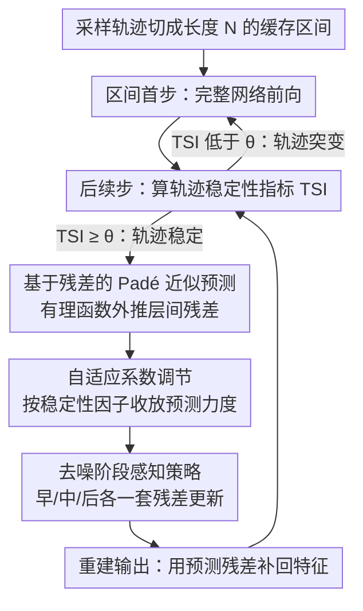

# TC-Padé: Trajectory-Consistent Padé Approximation for Diffusion Acceleration

**会议**: CVPR 2026  
**arXiv**: [2603.02943](https://arxiv.org/abs/2603.02943)  
**领域**: 图像生成  
**关键词**: 扩散模型加速, 特征缓存, Padé近似, 轨迹一致性, 残差预测  

## 一句话总结

提出基于 Padé 有理函数近似的特征残差预测框架 TC-Padé，通过自适应系数调节和分阶段感知策略，在低步数（20-30步）扩散采样场景下实现轨迹一致的加速（FLUX.1-dev 2.88×、Wan2.1 1.72×），显著优于基于 Taylor 展开的现有方法。

## 研究背景与动机

扩散模型（Diffusion Models）在图像和视频生成中取得了 SOTA 表现，但其迭代去噪过程需要数十到上百次网络前向传播，计算成本极高。现有加速手段可分为两大方向：

**减少采样步数**：如 DDIM、DPM-Solver 等求解器方法，以及蒸馏方法（一致性模型、对抗蒸馏）

**降低每步计算量**：如模型压缩（剪枝、量化）和特征缓存

特征缓存方法因其 **无需训练、即插即用** 的特性而受到关注。然而现有方法存在关键局限：

- **复用类方法**（ToCa、Δ-DiT、TeaCache）：在步数较多时（50步）效果尚可，但当步数降至 20-30 步时，相邻步之间时间间隔增大，特征相似度指数级衰减，直接复用导致严重轨迹偏移
- **预测类方法**（TaylorSeer）：基于 Taylor 级数展开做多项式外推，但 Taylor 展开存在有限收敛半径，间隔增大后近似误差急剧放大

作者通过 PCA 可视化证实，现有缓存方法在 20 步采样下的特征轨迹与真实轨迹存在显著偏差。

## 方法详解

### 整体框架

TC-Padé 要解决的是低步数（20-30 步）扩散采样下的特征缓存失效：步数一少，相邻步时间间隔变大，特征相似度指数衰减，复用类方法（ToCa、TeaCache）轨迹漂移，预测类方法（TaylorSeer）则因 Taylor 展开收敛半径有限而误差暴涨。TC-Padé 改用 Padé 有理函数来外推**残差**，并把采样轨迹切成长度 $\mathcal{N}$ 的缓存区间，每个区间只第一步算完整网络，之后每步由**轨迹稳定性指标（TSI）**自适应决定是跳过还是重算：
$$\text{TSI}(\mathcal{R}_{t+3}, \mathcal{R}_{t+2}, \mathcal{R}_{t+1}) = \frac{1}{2}\|\mathbf{u}_{t+1} - \mathbf{u}_{t+2}\|_2$$
其中 $\mathbf{u}_t = (\mathcal{R}_t - \mathcal{R}_{t+1}) / \|\mathcal{R}_t - \mathcal{R}_{t+1}\|_2$ 为归一化残差差分向量。$\text{TSI} \geq \theta$ 时跳过计算、用 Padé 预测残差；否则回退到完整计算保质量。

### 关键设计

**1. 基于残差的 Padé 近似预测：用有理函数替代多项式外推**

TaylorSeer 直接预测原始高维特征，间隔一大余弦相似度就跌破 0.5；TC-Padé 先把预测对象换成残差（层间增量 $\mathcal{R}_t^{l:r} = x_t^r - x_t^l$），因为残差在时间维上的相似度远高于原始特征。预测器则用 Padé 有理函数 $P_m(x)/Q_n(x)$ 取代 Taylor 多项式——多项式收敛半径有限、大间隔下发散，而有理函数能刻画渐近行为和非线性相变。具体取 $[2/1]$ 阶（$k=3, m=1$）：
$$\mathcal{R}_{Pad\acute{e},t} = \frac{b_0 \mathcal{R}_{t+3} + b_1 \mathcal{R}_{t+2}}{1 + a_1 \mathcal{R}_{t+1}}$$
预测出残差后重建输出 $\bar{x}_t = x_{t+1} + \mathcal{R}_{Pad\acute{e},t}$。

**2. 自适应系数调节：按残差稳定性收放预测力度**

经典 Padé 解析求系数，在轨迹突变时会过激。TC-Padé 改用稳定性因子动态调节：
$$\sigma_{stab} = \exp\left(-\lambda \frac{\|\mathcal{R}_{t+1} - \mathcal{R}_{t+2}\|}{\|\mathcal{R}_{t+1} + \mathcal{R}_{t+2}\|}\right)$$
残差剧变时 $\sigma_{stab} \to 0$、系数趋于保守，残差稳定时 $\sigma_{stab} \to 1$、放手预测，三个系数随之取 $b_0 = 2\sigma_{stab}$、$b_1 = -\sigma_{stab}$、$a_1 = \frac{1}{\lambda}\sigma_{stab}$。这样预测力度始终和当前轨迹的可信度挂钩。

**3. 去噪阶段感知策略：早中后各用一套残差更新**

扩散不同阶段的动力学不同，一套外推吃不下全程。TC-Padé 按阶段切换：早期（$t > 0.7T$）结构快速演化，直接加权最近两步残差 $\alpha_1 \mathcal{R}_{t+1} + \alpha_2 \mathcal{R}_{t+2}$（$\alpha_1 + \alpha_2 = 1$）；中期（$0.2T \leq t \leq 0.7T$）用完整 Padé 近似 $\mathcal{R}_{Pad\acute{e},t}$ 抓长程依赖；后期（$t < 0.2T$）在 Padé 上叠一阶差分项 $\beta(\mathcal{R}_{t+1} - \mathcal{R}_{t+2})$ 捕捉细微速度变化。

### 损失函数

无训练方法，不涉及损失函数设计。核心是在推理阶段用 Padé 有理函数近似替代完整网络计算。

## 实验关键数据

### 主实验：文本到图像生成（FLUX.1-dev, 20步, COCO 2017）

| 方法 | 加速比 | FID↓ | CLIP↑ | PSNR↑ | SSIM↑ | LPIPS↓ |
|------|--------|------|-------|-------|-------|--------|
| FLUX.1-dev（基线） | 1.00× | 23.38 | 32.10 | - | - | - |
| ToCa (N=5) | 1.81× | 24.18 | 31.48 | 17.29 | 0.613 | 0.481 |
| TeaCache (fast) | 2.15× | 24.11 | 31.50 | 18.02 | 0.690 | 0.419 |
| TaylorSeer (N=5) | 2.31× | †严重退化 | 31.52 | 17.46 | 0.525 | 0.616 |
| **TC-Padé (slow)** | **2.20×** | **23.85** | **31.90** | **24.67** | **0.861** | **0.144** |
| **TC-Padé (fast)** | **2.88×** | **24.14** | **31.82** | **21.96** | **0.782** | **0.290** |

### 主实验：文本到视频生成（Wan2.1-1.3B, 20步, VBench-2.0）

| 方法 | 加速比 | VBench-2.0↑ | PSNR↑ | SSIM↑ | LPIPS↓ |
|------|--------|-------------|-------|-------|--------|
| Wan2.1（基线） | 1.00× | 64.16% | - | - | - |
| TeaCache (slow) | 1.17× | 60.73% | 27.19 | 0.867 | 0.107 |
| TaylorSeer (N=4) | 1.66× | 54.50% | 14.93 | 0.353 | 0.586 |
| **TC-Padé (fast)** | **1.72×** | **60.38%** | **21.70** | **0.639** | **0.300** |

### 主实验：类条件图像生成（DiT-XL/2, 20步, ImageNet）

| 方法 | 加速比 | FID↓ | IS↑ | Precision↑ | Recall↑ |
|------|--------|------|-----|-----------|---------|
| DiT-XL/2（基线） | 1.00× | 3.56 | 221.27 | 0.78 | 0.58 |
| ToCa (N=3) | 1.35× | 10.72 | 164.40 | 0.69 | 0.49 |
| TaylorSeer (N=4) | 1.51× | 7.86 | 175.11 | 0.71 | 0.53 |
| **TC-Padé (fast)** | **1.46×** | **6.93** | **185.12** | **0.72** | **0.54** |

### 消融实验：缓存残差粒度（FLUX.1-dev）

| 粒度 | 加速比 | Aesthetic↑ | CLIP↑ | ImgRwd↑ |
|------|--------|-----------|-------|---------|
| Double-stream | 1.36× | 5.10 | 31.31 | 0.792 |
| Single-stream | 1.94× | 5.69 | 31.66 | 0.872 |
| **Entire Block** | **2.88×** | **5.76** | **31.83** | **0.918** |

### 消融实验：TSI 阈值 θ 的影响

| θ | 加速比 | Aesthetic↑ | CLIP↑ | ImgRwd↑ |
|---|--------|-----------|-------|---------|
| 1.3 | 1.63× | 5.80 | 32.02 | 0.956 |
| 1.0 | 2.20× | 5.77 | 31.97 | 0.924 |
| 0.7 | 2.88× | 5.76 | 31.83 | 0.918 |

### 部署效率：与量化叠加

| 配置 | FID↓ | CLIP↑ | Aesthetic↑ |
|------|------|-------|-----------|
| FLUX.1-dev | 23.38 | 32.10 | 6.25 |
| TC-Padé | 24.14 | 31.82 | 6.11 |
| TC-Padé + 量化 | 24.31 | 31.08 | 6.01 |

TC-Padé + 量化在 batch=1 时将生成延迟从 9s 降至 1.83s（约 6× 加速），吞吐量从 0.22 img/s 提升至 0.54-0.57 img/s。

### 关键发现

- TC-Padé 在 20 步设置下的 PSNR/SSIM/LPIPS 远优于所有对比方法，表明其生成结果与全步数基线高度一致
- TaylorSeer 在 20 步 FLUX.1-dev 上 FID 严重退化（标记为†），而 TC-Padé 仅产生约 3% 的 FID 损失
- 与量化技术叠加可实现约 6× 延迟降低，且质量损失极小

## 亮点与洞察

1. **数学基础扎实**：用 Padé 有理函数代替 Taylor 多项式的动机清晰——有理函数可捕捉渐近行为和极点，而多项式展开在大间隔下发散。这是从数值分析迁移到深度学习的优雅设计
2. **残差而非原始特征**：预测残差（层间增量）比预测原始高维特征更稳定，这个观察本身就有独立价值
3. **分阶段策略有道理**：早期保守复用、中期 Padé 预测、后期叠加差分修正，符合扩散模型不同阶段的动力学特征
4. **自适应稳定性检测**：TSI 指标和自适应系数设计使方法能感知轨迹突变，在不稳定时回退到完整计算
5. **与量化正交可叠加**：证明可与量化等其他加速技术组合使用，实用性强

## 局限性

1. **超参数敏感**：λ、θ、α、β 等超参需要调整，不同模型和任务可能需要不同设置
2. **低阶近似限制**：为效率采用 [2/1] 阶 Padé，在特征剧烈变化区域精度可能不足
3. **仅验证 20 步**：虽然目标是低步数场景，但缺少对更极端低步数（如 8-10 步）的验证
4. **加速比受限**：在 DiT-XL/2 上仅 1.46×，视频生成上 1.72×，相比蒸馏方法差距仍大
5. **未与蒸馏方法正面对比**：仅在特征缓存类方法中对比，未展示与一致性模型等的差异
6. **步感知策略的阶段划分**（0.2T, 0.7T）是启发式的，缺乏理论依据

## 评分

⭐⭐⭐⭐ (4/5)

数学动机清晰、方法设计 elegant，实验充分覆盖图像和视频生成。在低步数特征缓存加速这一赛道上取得了明显进步。不过方法核心更偏工程优化层面改进，理论深度和通用性尚有提升空间。

<!-- RELATED:START -->

## 相关论文

- [\[CVPR 2026\] Denoising as Path Planning: Training-Free Acceleration of Diffusion Models with DPCache](dpcache_denoising_path_planning_diffusion_accel.md)
- [\[CVPR 2026\] ResCa: Residual Caching for Diffusion Transformers Acceleration](resca_residual_caching_for_diffusion_transformers_acceleration.md)
- [\[CVPR 2026\] LESA: Learnable Stage-Aware Predictors for Diffusion Model Acceleration](lesa_learnable_stage-aware_predictors_for_diffusion_model_acceleration.md)
- [\[CVPR 2026\] Adaptive Spectral Feature Forecasting for Diffusion Sampling Acceleration](adaptive_spectral_feature_forecasting_for_diffusion_sampling_acceleration.md)
- [\[CVPR 2026\] GeoRK2: Geometry-Guided Runge-Kutta Integration for Diffusion Transformer Acceleration](geork2_geometry-guided_runge-kutta_integration_for_diffusion_transformer_acceler.md)

<!-- RELATED:END -->
