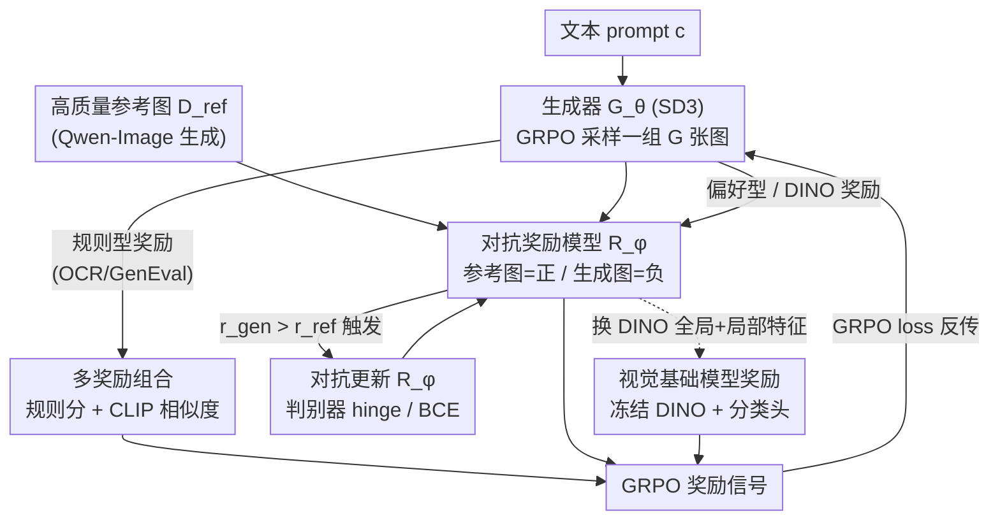

# The Image as Its Own Reward: Reinforcement Learning with Adversarial Reward for Image Generation

**会议**: CVPR 2026  
**论文**: [CVF Open Access](https://openaccess.thecvf.com/content/CVPR2026/html/Mao_The_Image_as_Its_Own_Reward_Reinforcement_Learning_with_Adversarial_CVPR_2026_paper.html)  
**代码**: https://github.com/showlab/Adv-GRPO  
**领域**: 图像生成 / 扩散模型 / 强化学习对齐  
**关键词**: 文生图、GRPO、对抗奖励、Reward Hacking、视觉基础模型

## 一句话总结
针对文生图 RL 里标量偏好奖励容易被「刷分」（reward hacking）的问题，本文提出 Adv-GRPO：把奖励模型当判别器、用高质量参考图当正样本与生成图对抗共训，并进一步把冻结的视觉基础模型（DINO）当作密集奖励，在不牺牲基准分的前提下显著提升画质、美学与文图对齐，人评胜率最高 85%+。

## 研究背景与动机
**领域现状**：在线 RL（尤其是 DeepSeek-R1 提出的 GRPO）在 LLM/MLLM 上很成功，最近被搬到文生图扩散模型上——DanceGRPO、Flow-GRPO 等把去噪过程当作 MDP，用一个预训练的偏好奖励模型（PickScore、HPS、Aesthetic）输出标量分数来引导生成器。

**现有痛点**：这些标量奖励模型并不能真正刻画人类感知，而且自带偏置——CLIP/PickScore 系偏好过饱和的颜色、OCR 类奖励则过度强调文字。生成器会去钻这些偏置的空子，拿到更高分却没有真的变好，这就是 **reward hacking**。论文 Fig.2 显示：用 PickScore 奖励训出来的 Flow-GRPO，画质反而低于基座模型；用 OCR 奖励则美学和质量双降。

**核心矛盾**：一边是「想用 RL 充分优化」，一边是「优化越狠越容易把奖励模型刷崩」。常见解法是加 KL 正则约束参数更新，但 KL 是把双刃剑——系数大了限制优化、小了又拦不住 hacking，本质上是在「优化强度」和「防 hacking」之间做妥协，治标不治本。

**本文目标**：在不靠脆弱 KL 正则的前提下抑制 reward hacking，并真正提升图像的感知质量；同时要能兼容偏好型和规则型两类奖励。

**切入角度**：作者观察到一个关键现象——很多高质量参考图在现有奖励模型下竟然得分很低。这说明奖励模型本身的分布偏了。于是与其约束生成器，不如**让奖励模型动起来**：把参考图当作"什么叫好图"的监督信号，逼奖励模型不断对齐到真实高质量分布。

**核心 idea**：把「奖励模型 ↔ 生成器」做成一对对抗的判别器与生成器（GAN 式 minimax），用参考图当正样本在线更新奖励模型；更进一步，干脆**把图像本身当奖励**——用冻结的视觉基础模型（DINO）抽取的密集特征替代单一标量，提供更全面、更难被钻空子的视觉信号。

## 方法详解

### 整体框架
Adv-GRPO 把标准 GRPO 扩展成一个**生成器与奖励模型联合优化的对抗系统**。生成器 $G_\theta$（基座是 SD3）照常用 GRPO loss 去最大化奖励；奖励模型 $R_\phi$ 不再是冻结的打分器，而是被当成**判别器**，用高质量参考图当正样本、生成图当负样本对抗训练，从而不断把"好图长什么样"的判据校回到真实分布上。整套方法沿三条线推进：①对人类偏好型奖励（PickScore/HPS）做对抗共训抑制 hacking；②对规则型奖励（OCR/GenEval，不可微、不能对抗）改用「规则分 + CLIP 相似度」多奖励组合稳住画质；③把视觉基础模型 DINO 当奖励，用全局+局部的密集特征替代标量，做最全面的画质提升。

### 关键设计

**1. 对抗奖励：把奖励模型当判别器，用参考图把它"拉回"高质量分布**

这一条直接打在 reward hacking 的痛点上。问题的根子是奖励模型固定不动，生成器有的是时间去找它的漏洞；KL 正则又只约束生成器、不修奖励模型本身。本文反过来让奖励模型 $R_\phi$ 充当 GAN 里的判别器：给定参考高质量图集 $D_{ref}$ 当正样本、生成图当负样本，按判别目标更新

$$J_{reward}(\phi) = -\mathbb{E}_{x_r \sim D_{ref}}[\log R_\phi(x_r)] - \mathbb{E}_{x_g \sim G_\theta(c)}[\log(1 - R_\phi(x_g))]$$

生成器仍用 Eq.(3) 的 clip 式 GRPO 目标 $J_{gen}(\theta)$ 去最大化 $R_\phi$ 给的奖励。两者构成动态均衡：生成器努力骗过判别器、判别器持续拿参考图对比生成图来纠偏。关键的**触发机制**是一个直观信号：监控生成图与参考图的平均奖励 $\bar r_{gen}=\mathbb{E}[R(x_g)]$、$\bar r_{ref}=\mathbb{E}[R(x_r)]$，一旦 $\bar r_{gen} > \bar r_{ref}$（生成图分数反超真·高质量图），就判定开始出现 hacking，立刻触发对奖励模型的对抗微调把它校正回来。和 KL 不同，这里的奖励是**通过视觉输出**直接引导生成器，而不是去硬卡参数更新，所以既能充分优化又不崩。

**2. 规则型奖励的多奖励组合：用 CLIP 相似度给不可微的 OCR/GenEval "兜底"**

偏好型奖励能对抗共训，但 OCR、GenEval 这类规则型奖励是确定性、不可微的，没法当判别器训练。硬用它们做 RL 会让生成器一味讨好"文字读得对/物体数得对"而牺牲整体画质。本文用一个简单但有效的多奖励组合把任务特异性和视觉真实感拉平：

$$R_{combined}(x_g, c) = \lambda R_{rule}(x_g, c) + (1-\lambda)\, \mathrm{sim}_{CLIP}(x_g, x_r)$$

其中 $\mathrm{sim}_{CLIP}$ 是生成图与参考图的 CLIP 相似度，$\lambda \in [0,1]$ 调权。这一项的作用是防止规则目标"一家独大"——参考图的 CLIP 相似度把生成结果钉在真实高质量分布附近，使 OCR 在拉文字准确率的同时不至于把美学带塌。

**3. 视觉基础模型当奖励：把图像本身当奖励，用 DINO 的全局+局部密集特征替代单一标量**

即便抑制了 hacking，偏好奖励的固有偏置还在（PickScore 牺牲画质、OCR 牺牲美学）。作者更彻底地"把图像当成它自己的奖励"：取一个冻结的视觉基础模型 $F_\psi$（DINOv2），在它的表征上挂一个轻量二分类头 $h_\phi$。对每张图同时抽全局 `[CLS]` 特征和 patch 级特征，奖励由全局+局部两部分组成：

$$R_{global}(x)=h_\phi(f_{cls}),\quad R_{local}(x)=\frac{1}{n}\sum_{j\in S} h_\phi(f_j),\quad R_\phi(x)=\lambda_g R_{global}(x)+\lambda_l R_{local}(x)$$

其中 $S$ 是随机采样的 $n$ 个 patch token（随机采样既鼓励关注多样的局部结构、又省算力）。分类头照样用参考图(正)/生成图(负)的对抗目标训练，但这里用 **hinge loss** 分别在全局和局部计算：

$$\mathcal{L}_{global}=\mathbb{E}_{x_r}[\max(0,1-h_\phi(f^r_{cls}))]+\mathbb{E}_{x_g}[\max(0,1+h_\phi(f^g_{cls}))]$$

局部项 $\mathcal{L}_{local}$ 同理在采样 patch 上取平均，总损失 $\mathcal{L}_{reward}=\lambda_g\mathcal{L}_{global}+\lambda_l\mathcal{L}_{local}$。为什么有效：全局 `[CLS]` 抓高层语义和结构一致性、局部 patch 抓纹理细节，二者互补，提供的是**密集视觉信号而非一个标量**——信息维度高，生成器很难像钻标量偏置那样把它整体刷崩，于是画质、美学、文图对齐能一起涨。

### 损失函数 / 训练策略
- 基座 SD3，每个 prompt 一组采 16 张样本；生成器学习率 $3\times10^{-4}$、奖励模型 $5\times10^{-6}$，只微调 PickScore 视觉分支最后两层，训 1000 步收敛。
- DINO 设定下只训分类头（学习率 $1\times10^{-4}$）。OCR 设定下用 OCR + CLIP 相似度联合优化。
- 推理 10 步，从 50–100% 噪声区间随机采 2 个 timestep；每 prompt 用 Qwen-Image 生成 8 张参考图。8×H100。

## 实验关键数据

### 主实验
基座 SD3，对比 Flow-GRPO；用对应奖励独立优化并在对应指标上评测。

| 奖励/指标 | SD3 | Flow-GRPO | Adv-GRPO |
|-----------|-----|-----------|----------|
| PickScore ↑ | 21.70 | 22.82 | 22.78 |
| OCR Accuracy ↑ | 0.58 | 0.91 | 0.91 |

要点：Adv-GRPO 在**基准分上与 Flow-GRPO 基本持平**（PickScore≈22.8、OCR=0.91，都远超 SD3），说明对抗训练没有牺牲量化指标；真正的差距在人评——PickScore 奖励下画质胜率 70%、OCR 奖励下美学胜率 85.3%（对 Flow-GRPO）；对 SD3 则在 PickScore 下美学胜率 72.6%、OCR 下对齐胜率 77.6%。

DINO 奖励跨任务泛化（vs SD3）：

| Method | PickScore ↑ | OCR Acc ↑ | GenEval ↑ |
|--------|-------------|-----------|-----------|
| SD3 | 21.70 | 0.59 | 0.61 |
| Adv-GRPO (DINO) | 21.90 | 0.69 | 0.69 |

DINO 奖励对 SD3 全面提升（美学胜率 72.4%）；对 Flow-GRPO(DINO 相似度奖励) 画质胜率 66.3%、美学 75.2%；对 Flow-GRPO(PickScore) 画质胜率高达 93.5%。

### 消融实验

| 配置 | PickScore ↑ | OCR Acc ↑ | 说明 |
|------|-------------|-----------|------|
| SFT | 21.60 | 0.68 | 监督微调，无法定向优化具体目标 |
| Flow-GRPO (w/ KL) | 21.84 | 0.80 | KL 正则，分数与画质双降 |
| Multi-Reward | 21.60 | 0.91 | 多奖励组合，权重难平衡 |
| **Adv-GRPO** | **22.78** | **0.91** | 完整方法 |

参考图数量消融（DINO 相似度）：仅用 200 张参考图就能达到 0.621，与 500/1000 张几乎一致（0.618/0.621），而 SD3 只有 0.592——说明对参考图数据需求极低，**200 张足矣**。

### 关键发现
- **奖励模型"动起来"是关键**：固定奖励模型 + KL（Flow-GRPO w/ KL）反而掉分掉画质；让奖励模型当判别器在线对齐参考分布，才同时拿住量化分和感知质量。
- **密集 > 标量**：DINO 全局+局部特征当奖励的提升最全面（对 Flow-GRPO PickScore 画质胜率 93.5%），印证"标量奖励信息维度太低、易被钻空子"的判断。
- **数据效率高**：200 张参考图就够，对落地很友好；参考图由 Qwen-Image 自动生成，无需人工标注。
- **残余偏置仍在**：PickScore 优化仍略牺牲画质、OCR 仍略牺牲美学，作者诚实承认对抗训练只是缓解、未根除偏好奖励的固有偏置。

## 亮点与洞察
- **"把图像当成它自己的奖励"这个 framing 很漂亮**：与其费力训一个会被刷分的标量偏好模型，不如直接拿冻结视觉基础模型的密集表征当裁判——信息维度高、自带强视觉先验，天然抗 hacking。
- **用 $\bar r_{gen} > \bar r_{ref}$ 作 hacking 触发器很巧**：给"什么时候该更新奖励模型"一个可操作、可监控的量化信号，而不是凭经验调 KL，工程上好复现。
- **对抗共训的副产品是风格定制**：换一组风格化参考图（动漫/科幻），同一套 pipeline 就能把 SD3 迁到目标视觉域，是首个能做风格定制的 RL-based T2I 框架——这个"纯图像输入驱动 RL"的思路可迁移到其他可控生成任务。
- **可复用 trick**：随机采样 patch token 算局部奖励，既增强对多样局部结构的关注又省算力，可借鉴到其他需要密集特征监督的对齐场景。

## 局限与展望
- **偏好奖励的固有偏置未根除**：作者自己承认 PickScore/OCR 优化后仍有画质/美学的此消彼长，对抗只是缓解。
- **依赖参考图质量**：整套方法的"高质量"定义来自参考图分布，参考图由 Qwen-Image 生成，若参考分布本身有偏，奖励模型会被带偏（GAN 式训练的常见隐患）。
- **人评为主、客观指标有限**：核心结论高度依赖 12 位专家的成对人评（共 12,000 次判断），缺少 FID/CMMD 等分布级客观画质指标佐证，胜率类结论难与其他论文横向比。
- **只验证了 SD3 单一基座**：是否在更大/不同架构的扩散模型（如 FLUX、SDXL）上同样有效未知。
- **改进方向**：把对抗奖励与多个视觉基础模型（SAM2、CLIP、DINO）集成成多视角奖励、或引入分布级客观指标做训练监控，可能进一步压住残余偏置。

## 相关工作与启发
- **vs Flow-GRPO**：Flow-GRPO 把 ODE 换成 SDE 提采样多样性、奖励模型固定 + 可选 KL；本文保留 GRPO 主体但让奖励模型变成在线对抗的判别器。优势是在持平基准分的同时显著提升人评感知质量、且不需脆弱的 KL；代价是引入参考图依赖和对抗训练的稳定性风险。
- **vs SFT**：SFT 只能模仿参考图、无法针对具体奖励目标（如文字可读性）定向优化；本文 RL 框架能定向优化且人评画质/美学胜率 >70%。
- **vs 多奖励组合 / 改进奖励设计（SRPO 等）**：这些工作靠手工调奖励权重或语义正负样本提升可靠性，权重难平衡；本文用对抗共训自动让奖励模型对齐参考分布，省去人工调权。
- **vs KL 正则路线**：KL 约束生成器参数更新、系数敏感；本文通过视觉输出直接引导，避开了"优化强度 vs 防 hacking"的妥协。

## 评分
- 新颖性: ⭐⭐⭐⭐ 「图像即奖励 + 对抗共训奖励模型」的 framing 清晰且有效，并首次做到 RL 风格定制。
- 实验充分度: ⭐⭐⭐⭐ 三类奖励 + 多消融 + 数据效率验证较全，但偏重人评、缺分布级客观画质指标。
- 写作质量: ⭐⭐⭐⭐ 动机—方法—实验逻辑顺，公式与图示清楚，对残余偏置诚实。
- 价值: ⭐⭐⭐⭐ 直击文生图 RL 的 reward hacking 痛点，方法简洁、数据需求低、代码开源，易被后续工作复用。

<!-- RELATED:START -->

## 相关论文

- [\[CVPR 2026\] PaCo-RL: Advancing Reinforcement Learning for Consistent Image Generation with Pairwise Reward Modeling](paco-rl_advancing_reinforcement_learning_for_consistent_image_generation_with_pa.md)
- [\[CVPR 2026\] PromptEnhancer: Taming Your Rewriter for Text-to-Image Generation via Fine-Grained Reward](promptenhancer_taming_your_rewriter_for_text-to-image_generation_via_fine-graine.md)
- [\[CVPR 2026\] Enhancing Spatial Understanding in Image Generation via Reward Modeling](enhancing_spatial_understanding_in_image_generation_via_reward_modeling.md)
- [\[CVPR 2026\] Goal-Driven Reward by Video Diffusion Models for Reinforcement Learning](goal-driven_reward_by_video_diffusion_models_for_reinforcement_learning.md)
- [\[CVPR 2026\] UniGen-1.5: Enhancing Image Generation and Editing through Reward Unification in RL](unigen-15_enhancing_image_generation_and_editing_through_reward_unification_in_r.md)

<!-- RELATED:END -->
