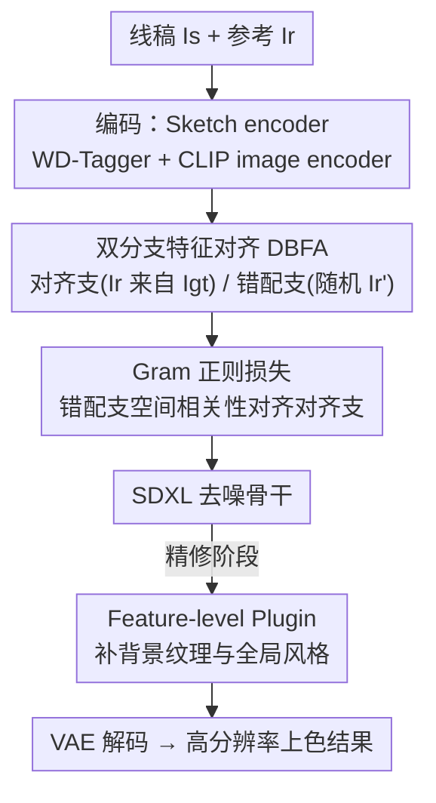

# Towards High-resolution and Disentangled Reference-based Sketch Colorization

**会议**: CVPR 2026  
**论文**: [CVF Open Access](https://openaccess.thecvf.com/content/CVPR2026/html/Yan_Towards_High-resolution_and_Disentangled_Reference-based_Sketch_Colorization_CVPR_2026_paper.html)  
**代码**: https://github.com/tellurionkanata/ColorizeDiffusionXL  
**领域**: 扩散模型 / 图像生成  
**关键词**: 参考图上色, 空间纠缠, Gram 正则, 分布偏移, SDXL

## 一句话总结
针对"参考图引导线稿上色"中训练/推理分布不一致导致的**空间纠缠**（模型把参考图的空间结构错误地搬进结果），本文用一个共享权重的**双分支特征对齐（DBFA）** 架构显式建模训练态和推理态，并用一个**Gram 正则损失**强制两支的空间相关性一致，从根上把"几何来自线稿、颜色风格来自参考"解耦；再配合 anime 专用 WD-Tagger 编码器和低层 Plugin 模块，在 1024~1280px 高分辨率下做到 SOTA 的上色质量与可控性。

## 研究背景与动机

**领域现状**：线稿上色（sketch colorization）是动画/插画自动化的核心任务，主流范式已经从 GAN 转向扩散模型。其中"参考图引导上色"最贴近真实动画生产流程——给一张线稿和一张色彩参考图，模型把参考的配色/纹理迁移到线稿上。

**现有痛点**：这类方法长期受**分布偏移（distribution shift）** 困扰。训练时用的是"语义对齐三元组"——线稿 $I_s$ 和参考 $I_r$ 都从同一张真值图 $I_{gt}$ 派生，二者天然空间对齐；但推理时用户给的线稿和参考是**任意配对、内容可能毫不相干**的。这种系统性错配让结果出现冗余物体、肢体扭曲、颜色越界（color bleeding）等结构性伪影。

**核心矛盾**：作者把根因刻画为一种**条件独立性失效**。理想情况下结果的空间结构 $X_{spatial}$ 应该**只依赖线稿** $I_s$，即 $P(X_{spatial}\mid I_r, I_s)=P(X_{spatial}\mid I_s)$；但模型在对齐训练数据上会偷学一条捷径——"参考图能预测输出空间结构"，于是 $P(X_{spatial}\mid I_r, I_s)\neq P(X_{spatial}\mid I_s)$，这就是作者命名的**空间纠缠（spatial entanglement）**。更糟的是随训练推进（25K→50K→75K 步），模型越来越依赖这条虚假关联，纠缠越发严重。

**已有方案的不足**：先前工作（用相邻动画帧、或对真值做形变增强当参考）都只是在**缓解伪影的表象**，没碰分布问题本身；即便有 split cross-attention 这种机制能压住背景纠缠，前景区域的纠缠和精确控制仍解决不了。

**核心 idea**：与其修补伪影，不如**直接最小化分布偏移**——用两个分支分别模拟"训练态（对齐）"和"推理态（错配）"，再逼着错配分支的内部空间相关性向对齐分支看齐，从而强制网络的几何信息只从线稿来。

## 方法详解

### 整体框架
方法以 SDXL 为去噪骨干（权重从 anime 专用的 AnimagineXL 初始化），整条 pipeline 解决一个核心问题：**让结果的几何/分割只听线稿的，颜色风格只听参考的**。它由三件事拼成——(1) 一个**双分支特征对齐 + Gram 正则**的训练机制，从根上解耦几何与风格；(2) 把 SDXL 原本的 CLIP-L 文本编码器换成 anime 专用 **WD-Tagger**，提供更精细的属性控制；(3) 一个低层 **Plugin 模块**，在精修阶段补足背景纹理和全局风格。训练分两阶段：第一阶段训骨干 + DBFA + Gram 损失；精修阶段冻结其余参数，只训 Plugin 模块和骨干里的 split cross-attention。

### 关键设计

**1. 双分支特征对齐 DBFA：把"训练态"和"推理态"同时塞进一次训练步**

痛点直接来自分布偏移：训练只见过"参考与线稿对齐"的情况，推理却全是错配，模型没机会学会"无视参考的空间结构"。DBFA 用**两个共享权重的分支**显式建模这两种分布：**语义对齐支**输入从真值派生的对齐参考 $I_r$（模拟训练态），**语义错配支**输入从数据集里**随机采样**的不相干参考 $I'_r$（模拟推理态）。关键巧思是"**自锚定（self-anchoring）**"——对同一张线稿和同一个噪声潜变量 $z_t$，只把参考图换掉做两次前向，不需要 VGG、DINOv3 或旧 checkpoint 这类外部网络当老师。因为两支共享同一线稿，强制它们的特征一致，本质上就逼网络承认"我的几何只能来自线稿、对任何颜色参考保持不变"，几何与风格的解耦因此被结构性地写进训练里。

**2. Gram 正则损失：用空间相关性而非像素对齐来度量"几何是否被参考污染"**

光有两支还不够，得有个量度告诉网络"两支的空间结构差在哪"。作者借鉴 DINOv3 的观察——**特征图的 Gram 矩阵 $G(x)=xx^\top$ 在语义层面刻画了不同 patch 之间的空间相关性**（即注意力意义下的"哪块和哪块相关"）。既然空间纠缠的本质是参考支错误地引入了语义关联，那只要把两支特征的 Gram 矩阵拉齐，就能消掉这种错误关联：

$$L_{gram}=\sum_{l\in L}\left\|\,\mathrm{stop\_grad}\!\left(G(x^{(l)}_{aligned})\right)-G(x^{(l)}_{misaligned})\,\right\|_F^2$$

其中 $L$ 是参与计算的层（出于效率只取 U-Net 编/解码器**最低分辨率**的末尾 transformer block），$\|\cdot\|_F$ 是 Frobenius 范数。`stop_grad` 是点睛之笔：它把对齐支的 Gram 矩阵**冻成锚点**，只让错配支接收梯度——否则两支会互相妥协、锚点漂移塌缩到错配表征上。这样错配支被牢牢拉向"只看线稿"的固定参照，优化稳定。总目标为 $L=L_{diff}+\lambda L_{gram}$，并且 $\lambda$ 在前 33% 训练步保持 0、之后才升到 1（因为早期纠缠很轻，过早施加正则没必要）。代价是训练慢约 30%、显存多约 10%。

**3. WD-Tagger 精确属性控制：用 anime 专用标签编码器替掉泛化 CLIP-L**

SDXL 原本用 OpenCLIP-bigG 和 CLIP-L 双文本编码器，二者语义高度重叠、还共享风格偏置，对 anime 细粒度属性（发色、服装、背景主题）的控制不够准。作者把其中的 **CLIP-L 换成 WD-Tagger**——一个基于 Swin Transformer v2、在大规模 anime 图上做多标签分类预训练的网络。它把视觉特征投影到**与标签对齐的 embedding**，语义锚定更强、聚类更干净，因此骨干从线稿里捕捉语义的能力显著提升。同时保留 OpenCLIP-bigG（用其 image encoder 提供更底层、更利于跨风格泛化的视觉表征）。这种"WD-Tagger 管类别化精确控制 + OpenCLIP 管宽泛视觉迁移"的双编码设计，给骨干一套互补的控制信号。消融里 WD-Tagger 把 FID 从 15.68（Dual CLIP）降到 13.79。

**4. Feature-level Plugin：精修阶段补回背景纹理与全局风格**

embedding 级的参考注入丢细节，背景区域尤其容易纹理糊、风格不一致；而且 Gram 正则在参考图缺背景内容时反而会增大背景的随机性（模型乱生成背景）。Plugin 是一个**独立编码器**，在精修阶段学习非线稿区域（背景）的特征级表征，专门搬运全局风格特征。它只在精修阶段训练、推理时只在 $t=0$ 跑一次，因此几乎不增推理负担。它把上色从"前景能控、背景失控"补成了前后景都稳定。

### 损失函数 / 训练策略
- 扩散损失：$L_{diff}=\mathbb{E}_{\mathcal{E}(y),\epsilon,t,s,c}\left[\|\epsilon-\epsilon_\theta(z_t,t,s,c)\|_2^2\right]$。
- 总损失：$L=L_{diff}+\lambda L_{gram}$，$\lambda$ 在前 33% 步为 0、之后线性升到 1。
- 两阶段：① 训骨干 + DBFA + Gram（70K 步）；② 精修，只训 Plugin 模块 + split cross-attention，冻其余（10K 步）。
- 硬件/数据：8×H100（80GB）+ DeepSpeed ZeRO-2，batch 128，lr 1e-5，总训 72 小时；数据集为 6M 张高分辨率人物/场景插画，线稿用 4 种 edge/line 提取器联合生成。

## 实验关键数据

### 主实验
在 50K 三元组验证集上，以 FID 为主指标（FID 不要求语义/空间对齐，最契合本任务），对比近期 SOTA。除 MangaNinja 固定 512² 外，其余均在 1024² 评测，Plugin 默认关闭。

| 方法 | FID ↓ | PSNR ↑ | MS-SSIM ↑ | CLIP score ↑ |
|------|-------|--------|-----------|--------------|
| **Ours** | **8.28** | 28.83 | **0.70** | **0.912** |
| Yan et al. [44] | 12.09 | 28.44 | 0.61 | 0.896 |
| ColorizeDiff [45] | 13.42 | 28.04 | 0.57 | 0.891 |
| IP-Adapter-XL | 36.61 | 28.23 | 0.44 | 0.758 |
| IP-Adapter | 94.53 | 27.94 | 0.50 | 0.762 |
| T2I-Adapter | 94.98 | 27.97 | 0.28 | 0.613 |
| MangaNinja (512²) | 42.85 | **29.64** | 0.67 | 0.892 |

本文在 FID / MS-SSIM / CLIP score 全面领先。PSNR 上 MangaNinja 最高、本文第二——作者解释这是因为 MangaNinja 生成能力和分辨率受限，画不出复杂背景和鲜艳色彩，输出"贴近平均"反而在 PSNR（对 MSE 敏感）上占便宜，并非真更好。

用户研究（30 人、25 组图、每组本文 vs 6 个对手 + 4 组对手互比）显示本文在全部 6 项对比中均被显著偏好（卡方检验 $p<0.01$），偏好率约 62%~80%。

### 消融实验
以"SDXL + 双 OpenCLIP + 仅扩散损失"为基线，逐步叠加组件。

| 配置 | FID ↓ | 说明 |
|------|-------|------|
| Dual CLIP（基线） | 15.68 | 眼睛上色错、整体分割引导弱 |
| + WD-Tagger | 13.79 | 属性控制和分割引导变好 |
| + WD-Tagger + Gram loss | 见图（更低） | 消除草图内外的纠缠伪影 |
| + Plugin | — | 背景纹理/全局风格一致性提升 |

注：Gram loss 的增益主要通过注意力图/Gram 矩阵可视化 + 局部 FID 展示（图 6 报告 5K-FID 从 12.14 降到 10.48），而非主表数字；为隔离 WD-Tagger 的效果，作者在评 WD-Tagger 时刻意关掉 Gram loss（因其解耦特性会抑制 WD-Tagger 引入的 embedding 聚类、干扰观测）。

### 关键发现
- **Gram loss 是解耦的主力**：可视化显示加了它之后，草图引导区域内的语义不再漂移、草图外的伪影被清除；这是把"几何只听线稿"从口号变成可验证现象的关键。
- **WD-Tagger 在参考眼睛小且配色不匹配时优势最明显**：基线会把眼睛颜色搞错，换上 WD-Tagger 后能正确还原参考的眼色和纹理。
- **PSNR 高不等于质量好**：MangaNinja 的 PSNR 反超恰恰暴露了"生成能力弱、输出趋于平均"的局限，提醒此任务上 PSNR 是有误导性的次要指标。

## 亮点与洞察
- **从"修伪影"到"对分布"的视角切换**：把空间纠缠形式化成条件独立性失效，再用两个分支显式装下训练态和推理态——这是本文最"啊哈"的地方，把一个长期被当作工程伪影的问题升级成可优化的分布对齐问题。
- **self-anchoring 省掉外部老师**：用同一步内"只换参考图的两次前向"互为锚点，配 `stop_grad` 防塌缩，不需要 VGG/DINO/旧 checkpoint，既轻量又稳定，这套思路可迁移到任何"想让输出对某个条件保持不变"的解耦场景。
- **Gram 矩阵当空间相关性探针**：借 DINOv3 的洞察把 Gram 矩阵从"风格度量"复用成"空间结构一致性度量"，是个很巧的工具复用。
- **领域专用编码器替通用 CLIP**：在 anime 这种有成熟标签体系的垂直域，用 WD-Tagger 这类多标签分类器当条件编码器，比泛化 CLIP 更精准——对其他有专用 tagger 的垂直生成任务有借鉴价值。

## 局限与展望
- **强 anime 领域绑定**：骨干来自 AnimagineXL、控制依赖 anime 专用 WD-Tagger、数据是 6M anime 插画，方法对真实照片/其他画风的迁移性存疑。
- **Gram loss 的副作用要靠 Plugin 兜底**：当参考缺背景内容时 Gram 正则会增大背景随机性，需要额外的 Plugin 模块补救，说明解耦还不是"免费午餐"。
- **训练成本不低**：8×H100 训 72 小时、Gram loss 再加 30% 训练时长 + 10% 显存，复现门槛高。
- **PSNR 评测的固有局限**：作者自己也承认 PSNR 在此任务上会奖励"平庸输出"，评测体系仍偏向 FID/用户研究，缺乏更贴合"可控性/解耦度"的量化指标。

## 相关工作与启发
- **vs Yan et al. [44]（split cross-attention）**：他们用 split cross-attention 压住**背景**纠缠，但前景纠缠和精确控制解决不了；本文用 DBFA + Gram loss 从分布层面统一解决前后景，FID 8.28 vs 12.09。
- **vs MangaNinja [21]**：专为干净背景的人物上色设计、分辨率固定 512²、训练数据是切碎的动画帧，处理复杂背景和高分辨率乏力；本文支持 1024~1280px 且能处理复杂背景。它仅在 PSNR 上占优，原因是生成能力受限导致输出趋平均。
- **vs IP-Adapter / T2I-Adapter 等 adapter 类**：在高分辨率下纹理和配色都做不像参考、背景伪影严重（FID 36~95），本文在生成能力上全面碾压。
- **vs Cobra [54]**：对线稿风格变化非常敏感，换风格后明显劣化（作者还得用自家结果反提线稿才能公平比较），凸显本文对多样输入风格的鲁棒性。

## 评分
- 新颖性: ⭐⭐⭐⭐⭐ 把空间纠缠形式化为分布偏移 + 自锚定双分支 + Gram 正则，是对该任务问题本质的重新定义而非补丁
- 实验充分度: ⭐⭐⭐⭐ 主表/消融/用户研究/跨内容验证齐全，但量化指标偏 FID、缺直接衡量解耦度的指标
- 写作质量: ⭐⭐⭐⭐ 动机推导清晰、公式与机制讲得透，理论刻画到位
- 价值: ⭐⭐⭐⭐ 对 anime 上色是实打实的 SOTA + 开源，解耦思路可迁移；但领域绑定较强、训练成本高

<!-- RELATED:START -->

## 相关论文

- [\[CVPR 2026\] From Sketch to Fresco: Efficient Diffusion Transformer with Progressive Resolution](from_sketch_to_fresco_efficient_diffusion_transformer_with_progressive_resolutio.md)
- [\[CVPR 2026\] Low-Resolution Editing is All You Need for High-Resolution Editing](low-resolution_editing_is_all_you_need_for_high-resolution_editing.md)
- [\[CVPR 2025\] Image Referenced Sketch Colorization Based on Animation Creation Workflow](../../CVPR2025/image_generation/image_referenced_sketch_colorization_based_on_animation_creation_workflow.md)
- [\[CVPR 2026\] Garments2Look: A Multi-Reference Dataset for High-Fidelity Outfit-Level Virtual Try-On with Clothing and Accessories](garments2look_a_multi-reference_dataset_for_high-fidelity_outfit-level_virtual_t.md)
- [\[CVPR 2026\] MultiCrafter: High-Fidelity Multi-Subject Generation via Disentangled Attention and Identity-Aware Preference Alignment](multicrafter_high-fidelity_multi-subject_generation_via_disentangled_attention_a.md)

<!-- RELATED:END -->
