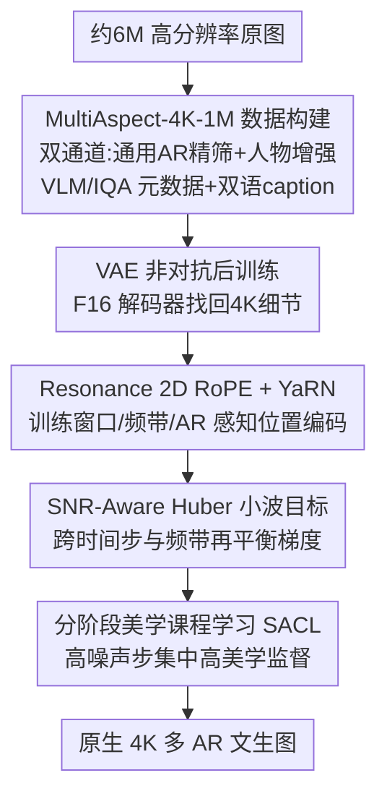

# UltraFlux: Data-Model Co-Design for High-quality Native 4K Text-to-Image Generation across Diverse Aspect Ratios

**会议**: CVPR 2026  
**论文**: [CVF Open Access](https://openaccess.thecvf.com/content/CVPR2026/html/Ye_UltraFlux_Data-Model_Co-Design_for_High-quality_Native_4K_Text-to-Image_Generation_across_CVPR_2026_paper.html)  
**代码**: 项目页 https://w2genai-lab.github.io/UltraFlux/ （承诺开源数据/权重/训练与推理代码）  
**领域**: 图像生成 / 扩散模型  
**关键词**: 原生4K生成, 多宽高比, 扩散Transformer, 2D RoPE外推, 数据-模型协同设计

## 一句话总结
UltraFlux 从"数据-模型协同设计"角度把 Flux DiT 原生训到 4K：先造一个百万级、覆盖多宽高比、带 VLM/IQA 元数据的 4K 数据集 MultiAspect-4K-1M，再在模型侧同时改造位置编码（Resonance 2D RoPE + YaRN）、VAE（非对抗后训练）、训练目标（SNR-Aware Huber 小波损失）和训练课程（分阶段美学课程学习），从而在 Aesthetic-Eval@4096 等基准上稳定超过开源 4K 基线，配上 LLM 提示词改写器后逼近甚至部分超过闭源 Seedream 4.0。

## 研究背景与动机

**领域现状**：扩散 Transformer（DiT，如 Flux、PixArt-Σ、Sana）在 1K 分辨率附近已能产出很高质量的文生图，靠的是高效骨干、token 压缩和精心调过的训练流程。

**现有痛点**：把这些系统直接放大到原生 4096×4096 并支持各种宽高比（AR），并不是简单地把分辨率拉大。作者实证地观察到三个**互相耦合**的失效：(i) 位置表示与 AR 外推——在单一训练窗口上标定的 2D 旋转位置编码，在分辨率/AR 大幅变化时会出现相位漂移和混叠，表现为鬼影、漂移、条纹；(ii) VAE 压缩下的高频保真——更高的下采样倍数提升吞吐，但容易抹掉主导 4K 观感的细结构；(iii) 4K 感知优化——梯度在不同时间步和频带上严重失衡，标准训练目标与 4K 隐空间的统计特性不匹配。

**核心矛盾**：这三个因素并不是相互正交、可以各自单独解决的工程选项，而是**联合**决定模型能否在原生 4K、多 AR 下既稳定又保细节。位置方案、VAE 压缩率、训练目标的选择会互相牵制——单独改任何一个都"把大量质量留在桌上"。此外数据本身也是瓶颈：公开 4K 语料规模普遍只有 $10^4$–$10^5$ 张、严重偏向近方形 AR 与风景类内容、且用早期 CLIP 美学预测器筛过，缺少现代 4K 训练所需的结构化元数据。

**本文目标**：构建一个统一框架，同时给齐四样东西——(i) 大规模、多 AR、内容多样、VLM 精筛、带丰富元数据的 4K 语料；(ii) 高效、非对抗、改善 4K 重建的 VAE 后训练；(iii) 匹配 4K 统计特性的 SNR 感知小波目标 + 分阶段美学课程；(iv) 训练窗口感知、频带感知、AR 感知的位置编码。

**切入角度**：既然失效是耦合的，就不要"头痛医头"，而是把数据侧和模型侧当成一个**协同设计空间**一起优化，并刻意区分"原生 4K 训练"与"低分辨率生成 + 后置超分上采"两种 regime——后者把高频保真和位置外推混在一起，前者才逼着骨干直接学长程依赖和跨 AR 空间对齐。

**核心 idea**：用一句话概括——**保持 Flux 架构不动，靠"一份对的数据 + 四个针对 4K 瓶颈的轻量但定点改造"把它升级成原生 4K 多 AR 生成器**。

## 方法详解

### 整体框架
UltraFlux 的主线是"数据-模型协同设计"：左边先用一条双通道流水线，从约 6M 高分辨率图里筛出 100 万张原生/近 4K、AR 分布均衡、带双语 caption 和 VLM/IQA 元数据的语料 **MultiAspect-4K-1M**；右边**不重新设计 DiT 架构**，保留 Flux Transformer 核心，只针对卡住 4K 性能的三个部位（VAE、位置表示、训练目标与策略）做定点手术。具体地，模型侧串起四个组件：先后训一个 F16 VAE 把细节找回来（同时保住强压缩的效率），再引入 Resonance 2D RoPE + YaRN 让注意力在不同分辨率/AR 下稳定，最后用 SNR 感知 Huber 小波损失 + 分阶段美学课程把学习集中到高频结构和高美学样本上。这些改动各自轻量，合起来把 Flux 变成既高保真又实用高效的 4K 生成器。

### 关键设计

**1. MultiAspect-4K-1M：用双通道流水线 + VLM 元数据补齐"多 AR、高质量、人物不缺席"的 4K 语料**

针对公开 4K 数据规模小、AR 偏方形、内容偏风景、只有 CLIP 美学分这三个缺口，作者构建了一条双通道流水线。先过 NSFW 安全筛，再做分辨率筛——要求像素总量至少 $3840\times2160$ 且**不做任何缩放**、保留原生 AR，这样天然保留 1:1、16:9、3:2、4:3、9:16 等宽谱 AR，方便透明审计。然后把"质量"和"美学"解耦：质量用基于大模型的打分器 Q-Align，美学用能给数值+专家式解释的 MLLM 评估器 ArtiMuse；同时用两个可解释的经典信号——平坦度（flatness）和信息熵（Shannon entropy）——当护栏，压掉 VLM 可能放过的低纹理/过平滑图，保住高频。第二条通道专门补人物：用人相关检索拉候选，过同样的 Q-Align/ArtiMuse 并用信息熵加强筛低纹理肖像，关键是用可提示开放词表检测器 YOLOE 要求"结构化的人物存在证据"，召回和精度都比固定类别检测器好，通过的子集打上 character 标志并入主池。最后用 Gemini-2.5-Flash 生成详细英文 caption、再用 Hunyuan-MT-7B 翻成中文，得到双语 caption。最终 100 万张图每张都带分辨率/AR、Q-Align、ArtiMuse、平坦度/熵、中英 caption 和人物标签——这些字段既能当分析标签，也能当分层采样键，直接支撑"按训练 regime 取数据切片"（如取高细节或高美学子集）。规模上它把语料从 1.2 万（Aesthetic-4K）拉到 100.7 万张，平均 caption 长度从 31 token 升到 125.1 token，并且唯一提供双语 caption。

**2. Resonance 2D RoPE + YaRN：把旋转位置编码做成训练窗口、频带、AR 三重感知，消除多 AR 4K 外推的鬼影与条纹**

官方 Flux 沿高/宽两轴各自分配旋转频谱，频率只由一个全局 NTK 因子调整，既不随推理尺寸 $H\times W$ 自适应、也没有频带级处理，相位随位置纯线性增长，在原生 2K/4K 多 AR 下会失稳。作者借鉴 LLM 里的 Resonance RoPE 思路，把 2D 旋转频谱放到**有限训练窗口**上重新解释。设训练窗口沿某轴长度为 $L_a$（以 patch 计）、第 $k$ 个分量的频率为 $\omega^{(a)}_k$，定义它在窗口内完成的周期数 $r^{(a)}_k = L_a \omega^{(a)}_k / (2\pi)$，再把它**吸附到最近的非零整数** $\hat r^{(a)}_k = \max(1, \lfloor r^{(a)}_k + \tfrac12\rfloor)$，并用整周期投影替换频率 $\hat\omega^{(a)}_k = 2\pi \hat r^{(a)}_k / L_a$。这样每个旋转频带在 $[0, L_a]$ 上变成一个完成整数个周期的"驻波"，在 $p_a=0$ 与 $p_a=L_a$ 处相位匹配；而原始 Flux 频谱里很多频带在训练窗口内走的是分数个周期，放大分辨率或换 AR 时会累积半周期相位误差，表现为空间漂移和细条纹。在此之上再叠 YaRN 让外推**频带感知**：给定推理长度 $L'_a$ 和外推尺度 $s_a = L'_a/L_a \ge 1$，用线性斜坡 $\gamma(r;\alpha,\beta)$ 把每个频带在"位置插值缩放"和"不缩放"之间插值，

$$\omega^{(a)}_{k,\text{yarn}} = \big(1 - \gamma(\hat r^{(a)}_k;\alpha,\beta)\big)\frac{\hat\omega^{(a)}_k}{s_a} + \gamma(\hat r^{(a)}_k;\alpha,\beta)\,\hat\omega^{(a)}_k.$$

即先把频率吸附到有限窗口的共振模，再用轴向周期数 $\hat r^{(a)}_k$ 决定每个频带在给定外推因子下缩放多少。相比 Flux 的"固定频谱 + 单一全局 NTK"，它让位置编码同时做到训练窗口感知、频带感知、AR 感知，几乎零额外开销就稳住了 2K/4K 多 AR 推理。

**3. SNR-Aware Huber 小波目标：在小波空间用 SNR 自适应的鲁棒损失，同时治"频率失衡、时间步失衡、跨尺度能量耦合"**

即便有小波目标（如 Diffusion-4K），原生 4K 下基于 VAE 隐空间的标准 L2 训练仍有三个耦合病症：(i) 频率失衡——自然图小波系数重尾，大的高频残差（纹理、边缘、微几何）被二次损失激进收缩，导致细节过平滑；(ii) 时间步失衡——梯度集中在极小或极大噪声水平，中间时间步利用低效；(iii) 跨尺度能量耦合——低频带主导隐空间范数，主导 4K 观感的高频误差反而拿到不成比例小的梯度。作者用一个目标同时具备四个性质：鲁棒且平滑（Pseudo-Huber 惩罚，零附近像 L2、尾部像 L1）、SNR 感知（自适应阈值 $c(t)$ 在高噪声时小、信号主导时增大）、频率感知（在正交小波空间度量残差，解耦高低频带）、时间再平衡（Min-SNR 加权强调中等 SNR 时间步）。在流匹配（FM）直线插值 $z_t = (1-t)z + t\varepsilon$ 下，模型预测速度场 $v_\theta$，数据预测 $\hat z_\theta = z_t - t\,v_\theta$；把直线路径因子和 Min-SNR 合成单一权重 $\omega(t) = \frac{t}{1-t}\min\{\mathrm{SNR}(t),\gamma\}^\beta$（其中 $\mathrm{SNR}(t)=(1-t)^2/t^2$）。用一级正交 DWT $W(\cdot)$ 在小波空间算残差 $R_\theta = W(\hat z_\theta) - W(z)$，阈值随 SNR 调度 $c(t) = c_{\min} + (c_{\max}-c_{\min})(\min\{\mathrm{SNR}(t),\gamma\}/\gamma)^\alpha$，最终目标为

$$L(\theta) = \mathbb{E}_{z,\varepsilon,t}\big[\omega(t)\,\ell_{\text{Huber}}(R_\theta; c(t))\big].$$

它是标准流匹配损失的即插即用替换——令 $c(t)\to\infty$ 且 $\beta=0$ 就退回原始 FM 目标。

**4. 分阶段美学课程学习（SACL）：把"高美学监督"精准灌到模型最依赖先验的高噪声步**

扩散不同时间步对应不同任务——高噪声步塑造全局结构、低噪声步精修局部细节；而以往美学后训练通常把高美学先验**均匀**铺到所有时间步，时间步课程又往往在固定数据分布下只调采样。SACL 把噪声轴和数据轴耦合成简单两阶段：阶段一在全量 MultiAspect-4K-1M 上、用覆盖整个扩散区间的标准时间步采样微调，让骨干获得跨 AR、跨内容、跨噪声的广泛 4K 先验；阶段二把训练**限制到高噪声带**（高于某阈值、模型最依赖生成先验的时间步）**且限制到 ArtiMuse 美学分排名前 5% 的图**，把剩余算力集中砸在"采样过程最欠定、最难"的 regime 上、用超高美学监督雕琢。直觉是阶段一学通用 4K 先验，阶段二在最不确定处把全局生成先验导向高美学模式，从而以适度额外训练成本换来明显的 4K 美学和对齐增益。

### 损失函数 / 训练策略
核心训练目标即上面的 SNR-Aware Huber 小波损失 $L(\theta)$。VAE 后训练阶段保留小波、感知、L2 三项损失、**去掉对抗判别器**（GAN 项很快饱和、引入不稳定、对感知质量无益），并用平坦度筛出高细节子集——约 4k 更新步、几十万张精筛细节图就能拿到大部分重建增益，避免多天 GAN 训练和数千万样本。整体训练按 SACL 两阶段推进，消融里 SNR-HW 在统一的"500K 数据 & 10K 步"微调日程下评估。

## 实验关键数据

### 主实验
在 Aesthetic-Eval@4096 基准、4096×4096 分辨率下，对比 ScaleCrafter、FouriScale（训练自由高分缩放）、Sana（原生 4K 基础模型）、Diffusion-4K（Flux 基、原生 4K 训练）。UltraFlux 在 FID、HPSv3、ArtiMuse、MUSIQ 上取得最好或并列最好。

| 方法 | FID ↓ | HPSv3 ↑ | PickScore ↑ | ArtiMuse ↑ | CLIP ↑ | Q-Align ↑ | MUSIQ ↑ |
|------|-------|---------|-------------|------------|--------|-----------|---------|
| ScaleCrafter | 164.02 | 6.83 | 21.68 | 67.88 | 33.36 | 4.30 | 38.21 |
| FouriScale | 164.71 | 11.19 | 21.86 | 65.87 | 33.11 | 4.50 | 38.96 |
| Sana | 144.17 | 10.83 | **23.18** | 63.72 | **35.49** | **4.89** | 45.08 |
| Diffusion-4K | 152.43 | 8.92 | 21.88 | 63.76 | 33.00 | 4.69 | 27.51 |
| **UltraFlux** | **143.11** | **11.47** | 22.69 | **68.36** | 34.62 | 4.85 | **46.13** |

非方形 AR 上（与 Sana 对比，2:1=4096×2048、1:2=2048×4096）UltraFlux 几乎全面占优：

| 设置 | FID ↓ | HPSv3 ↑ | ArtiMuse ↑ | Q-Align ↑ |
|------|-------|---------|------------|-----------|
| Sana (2:1) | 150.35 | 9.01 | 63.61 | 4.80 |
| UltraFlux (2:1) | **147.53** | **9.91** | **64.81** | **4.86** |
| Sana (1:2) | 149.41 | 11.40 | **66.95** | 4.85 |
| UltraFlux (1:2) | **143.71** | **12.51** | 66.41 | **4.89** |

更极端的宽幅（16:9=5120×2880、2.39:1=5952×2496）下，UltraFlux 在 FID、HPSv3、ArtiMuse 上大幅领先 Sana（如 16:9 的 ArtiMuse 67.22 vs 63.02、FID 142.43 vs 153.31）。在 Gemini-2.5-Flash 偏好评测中，UltraFlux 在视觉吸引力上被偏好 70–82%、在提示词对齐上被偏好 60–89%。

与闭源 Seedream 4.0 比（均配大模型提示词改写器，UltraFlux 用 GPT-4O 前端，4096×4096）：

| 方法 | FID ↓ | HPSv3 ↑ | PickScore ↑ | ArtiMuse ↑ | CLIP ↑ | Q-Align ↑ | MUSIQ ↑ |
|------|-------|---------|-------------|------------|--------|-----------|---------|
| Seedream 4.0 | **132.87** | 11.98 | **23.52** | **69.83** | **35.26** | 4.71 | 30.21 |
| UltraFlux w. Refiner | 147.06 | **12.03** | 23.25 | 68.75 | 34.50 | **4.93** | **45.93** |

UltraFlux 的 HPSv3 略高于 Seedream（12.03 vs 11.98），并在 Q-Align、MUSIQ（更反映语义对齐与感知质量）上明显胜出，说明一个仅用 100 万张训练的开源模型在配齐提示词改写后能紧贴甚至部分超过领先闭源 4K 生成器。

### 消融实验
从 Flux + 训练好的 F16 VAE 基线出发逐项叠加（统一 500K 数据 & 10K 步）：

| 配置 | FID ↓ | HPSv3 ↑ | ArtiMuse ↑ | 说明 |
|------|-------|---------|------------|------|
| Flux + F16 VAE (base) | 151.40 | 9.22 | 66.39 | 基线 |
| + SNR-HW | 148.81 | 9.70 | 67.23 | 换上 SNR 感知小波目标 |
| + SNR-HW + SACL | 147.32 | 10.30 | 67.31 | 再加分阶段美学课程 |
| + SNR-HW + SACL + Resonance 2D RoPE w. YaRN | **146.93** | **10.91** | **68.13** | 完整 UltraFlux |

### 关键发现
- 三个模型侧组件贡献**互补**而非互相挤兑：每叠加一项，FID 单调下降、HPSv3 与 ArtiMuse 单调上升，说明目标、对齐课程、位置编码各自补的是不同短板。
- SNR-HW 替换标准隐空间回归损失就能立刻在各指标上拿到一致增益，验证"SNR 感知小波监督"比纯 L2 更好地兼顾高频细节与稳定优化。
- SACL 主要拉动人类偏好和美学分（HPSv3 9.70→10.30），说明更强的图文对齐在原生 4K 上尤其有益。
- VAE 后训练的工程结论很实用：去掉 GAN 项、用平坦度筛高细节子集，约 4k 步、几十万张图即可拿到大部分重建增益，避免多天 GAN 训练。

## 亮点与洞察
- **"耦合失效 → 协同设计"的诊断很清醒**：作者明确指出位置编码、VAE 压缩、训练目标三者在 4K 是耦合的，单独治任何一个都浪费质量——这把一堆零散的 4K 技巧统一进一个 recipe，是本文最有价值的视角。
- **把 LLM 的长度外推技巧（Resonance RoPE / YaRN）迁移到 2D 图像网格**：用"整周期吸附 → 驻波 → 频带感知缩放"解释并消除多 AR 外推的鬼影/条纹，是个可直接复用到其他高分辨率 DiT 的 trick。
- **数据集元数据即"协同设计接口"**：每张图带 Q-Align/ArtiMuse/平坦度/熵/AR/双语 caption，使"按 regime 取数据切片"（高细节、高美学、特定 AR）成为可控操作，而不是事后碰运气——这是数据-模型协同设计能落地的关键。
- **SACL 把"噪声轴×数据轴"耦合**：只在高噪声步喂前 5% 高美学图，而不是把美学先验均匀铺满所有时间步，思路可迁移到任何"不同时间步承担不同任务"的扩散后训练。

## 局限与展望
- 与闭源 Seedream 4.0 的对比依赖各自的提示词改写器（UltraFlux 用 GPT-4O），FID/PickScore/CLIP 等多项指标仍落后，"逼近"主要体现在 HPSv3、Q-Align、MUSIQ；不同改写器和评测协议下结论可能波动 ⚠️ 以原文为准。
- 评测大量使用 VLM/LMM 作为评判者（ArtiMuse、Q-Align、Gemini 偏好），这类指标本身可能偏好特定风格，自动指标与人类真实偏好的一致性需谨慎看待。
- 方法以"保持 Flux 架构不动 + 定点改造"为前提，四个组件的增益是在 Flux F16 VAE 这一具体骨干上验证的，迁移到其他 DiT 骨干的普适性未充分展开。
- 多个超参（YaRN 的 $\alpha,\beta$、Huber 的 $c_{\min}/c_{\max}/\gamma/\beta$、SACL 的高噪声阈值与前 5% 比例）的敏感性正文未系统给出，复现可能需要调参。

## 相关工作与启发
- **vs 训练自由高分缩放（ScaleCrafter / FouriScale / HiDiffusion）**：它们改推理时计算（窗口注意力、Fourier 低通引导）来把 1K 模型放大到 4K，无需重训，但基本保留原位置方案，多 AR 外推稳定性只解决一半；UltraFlux 直接原生 4K 训练并改造位置编码，从根上治外推。
- **vs 轻量适配（LSRNA / Self-Cascade）**：它们用隐空间超分或自级联在固定骨干上事后锐化细节、降低高分迁移成本，但属后置适配器，没解决 VAE 压缩与 4K 重建保真之间的根本权衡；UltraFlux 用 VAE 后训练正面解决这一权衡。
- **vs 原生 4K 训练（Diffusion-4K / Sana / PixArt-Σ）**：它们证明精心设计的骨干能让 4K 训练可行，但多把位置鲁棒性、VAE 压缩、损失设计当作正交选项；UltraFlux 把它们联合优化，并配上更大、更多 AR、带元数据的语料。
- **vs Diffusion-4K 的小波损失**：本文在小波空间进一步引入 Pseudo-Huber 鲁棒性 + SNR 自适应阈值 + Min-SNR 时间再平衡，专门治高频重尾被二次损失过度收缩的问题。

## 评分
- 新颖性: ⭐⭐⭐⭐ 单个组件多为已有思路（YaRN、小波损失、美学后训练）的迁移与组合，但"数据-模型协同设计治耦合失效"的整体视角和把它们系统串通是真贡献。
- 实验充分度: ⭐⭐⭐⭐⭐ 方形/多 AR/极端宽幅多分辨率、开源与闭源双线对比、逐项消融、VLM 偏好评测都齐全，数字与表格自洽。
- 写作质量: ⭐⭐⭐⭐ 问题诊断清晰、公式完整、动机具体；少数符号（如下标）受 PDF 提取影响略乱，但逻辑链完整。
- 价值: ⭐⭐⭐⭐⭐ 承诺开源数据/权重/代码，对原生 4K 多 AR 文生图社区是稀缺的端到端可复现 recipe + 大规模数据集。

<!-- RELATED:START -->

## 相关论文

- [\[CVPR 2026\] PosterReward: Unlocking Accurate Evaluation for High-Quality Graphic Design Generation](posterreward_unlocking_accurate_evaluation_for_high-quality_graphic_design_gener.md)
- [\[CVPR 2026\] Frequency-Aware Flow Matching for High-Quality Image Generation](freqflow_frequency_aware_flow_matching.md)
- [\[CVPR 2026\] Mixture of Style Experts for Diverse Image Stylization](mixture_of_style_experts_for_diverse_image_stylization.md)
- [\[CVPR 2026\] Design Your Ad: Personalized Advertising Image and Text Generation with Unified Autoregressive Models](design_your_ad_personalized_advertising_image_and_text_generation_with_unified_a.md)
- [\[CVPR 2026\] DBMSolver: A Training-free Diffusion Bridge Sampler for High-Quality Image-to-Image Translation](dbmsolver_a_training-free_diffusion_bridge_sampler_for_high-quality_image-to-ima.md)

<!-- RELATED:END -->
