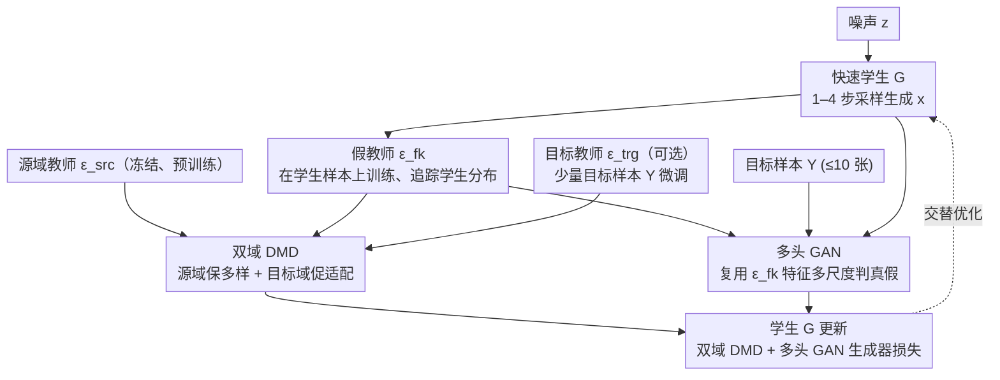

# Uni-DAD: Unified Distillation and Adaptation of Diffusion Models for Few-step Few-shot Image Generation

**会议**: CVPR 2026  
**arXiv**: [2511.18281](https://arxiv.org/abs/2511.18281)  
**代码**: [GitHub](https://github.com/yaramohamadi/uni-DAD)  
**领域**: 图像生成  
**关键词**: 扩散模型蒸馏, 少样本图像生成, 域适应, GAN, 分布匹配蒸馏  

## 一句话总结

提出 Uni-DAD，首个将扩散模型蒸馏（distillation）与域适应（adaptation）统一为单阶段流程的方法，通过双域 DMD 损失和多头 GAN 损失，在仅 1–4 步采样下实现少样本域的高质量多样生成。

## 研究背景与动机

扩散模型（DMs）在图像生成中表现卓越，但存在两大瓶颈：（1）采样需要数百至上千步迭代去噪，推理极慢；（2）将预训练模型适配到新域（如少样本场景）后，慢采样问题依然存在。
现有解决方案是两阶段流水线：

- **先蒸馏再适配（Distill-then-Adapt）**：先将教师蒸馏为少步学生，再微调到目标域。计算友好但学生适配能力饱和，产出过度平滑。
- **先适配再蒸馏（Adapt-then-Distill）**：先微调教师到目标域再蒸馏。质量更好但学生绑定于适配后教师的性能，且在少样本场景容易过拟合。

两种方案都非端到端，且在训练过程中容易丢失源域的多样性信息。作者提出：**蒸馏与适配不必分开**，可以在单阶段同时完成。

## 方法详解

### 整体框架

Uni-DAD 想把扩散模型的「蒸馏」和「域适配」合并成单阶段一次做完，而不是走传统的两阶段流水线。它把一个冻结的源域教师 $\epsilon^{\text{src}}$（在大规模源数据上预训练，$T \sim 1000$ 步）直接压成一个快速学生生成器 $G$（$1 \leq \text{NFE} \leq 4$），同时把它适配到只有少量样本 $Y$（$|Y| \leq 10$）表示的目标分布 $p^{\text{trg}}(y)$。训练时三组模型交替优化：学生 $G$ 用双域 DMD + 多头 GAN 生成器损失更新；假教师 $\epsilon^{\text{fk}}$ 和多头判别器 $D$ 负责追踪学生分布、区分真实目标样本与学生生成；可选的目标教师 $\epsilon^{\text{trg}}$ 在目标样本上微调、提供目标域分数引导。

### 关键设计

**1. 双域分布匹配蒸馏（Dual-domain DMD）：源域保多样、目标域促适配**

两阶段方案的通病是训练中容易丢掉源域的多样性信息，产出过度平滑。DMD 本身是最小化学生分布 $p^{\text{fk}}$ 与教师分布 $p^{\text{src}}$ 的 KL 散度，其梯度可用噪声估计形式近似：

$$\nabla_{\theta} \mathcal{L}_{\text{DMD}^{\text{src}}} \approx \mathbb{E}_{t,z}\left[\omega_t \left(\epsilon^{\text{fk}}(x_t) - \epsilon^{\text{src}}(x_t)\right) \frac{dG_\theta}{d\theta}\right]$$

其中 $x = G(z),\; z \sim \mathcal{N}(0,I)$，$t \sim \mathcal{U}\{0.02T, 0.98T\}$，$\epsilon^{\text{fk}}$ 是在线追踪学生输出的假教师、$\epsilon^{\text{src}}$ 是冻结的源域教师。Uni-DAD 把它扩成双域，同时对齐学生到源域和目标域：

$$\nabla_{\theta} \mathcal{L}_{\text{DMD}}^{\text{trg}+\text{src}} = (1-a)\nabla_{\theta}\mathcal{L}_{\text{DMD}^{\text{src}}} + a\nabla_{\theta}\mathcal{L}_{\text{DMD}^{\text{trg}}}$$

权重因子 $a \in [0,1]$ 控制两域影响比例：源域项保住姿态/背景/表情等多样性，目标域项引导结构适配——目标域与源域结构接近时用小 $a$（Babies 取 $a=0.25$），结构差异大时用大 $a$（MetFaces 取 $a=0.75$）。权重归一化用

$$\omega_t = \frac{\sigma_t \cdot H \cdot S}{\|\epsilon - \epsilon^{\text{fk}}(x_t)\|_1}$$

其中 $H$ 是通道数、$S$ 是空间位置数，确保不同时间步贡献均衡。

**2. 假教师与目标教师：一个追学生、一个盯目标域**

双域 DMD 要算两个分布的差，就需要两个「参照系」。假教师 $\epsilon^{\text{fk}}$ 从 $\epsilon^{\text{src}}$ 权重初始化，在学生生成样本上持续训练以追踪不断变化的学生分布：

$$\mathcal{L}_{\text{fk}}(\phi) = \mathbb{E}_{t,z}\left[\|\epsilon^{\text{fk}}_\phi(x_t) - \epsilon\|_2^2\right]$$

训练时不通过 $G$ 反传梯度、$x$ 视为固定。目标教师 $\epsilon^{\text{trg}}$（可选）则从 $\epsilon^{\text{src}}$ 初始化、在目标样本 $Y$ 上微调：

$$\mathcal{L}_{\text{trg}}(\eta) = \mathbb{E}_{t,\epsilon,y}\left[\|\epsilon^{\text{trg}}_\eta(y_t) - \epsilon\|_2^2\right]$$

当目标域与源域结构差异大时，它能补回目标域的结构信息；若已有预适配的检查点，可直接当作冻结目标教师使用。

**3. 多头 GAN 损失：复用假教师特征、多尺度判真假以抗少样本过拟合**

只靠分数蒸馏对目标域 $Y$ 的视觉保真度不够，且 $|Y| \leq 10$ 极易过拟合、模式塌缩。多头 GAN 复用假教师 $\epsilon^{\text{fk}}$ 的编码器和中间块当特征提取器，在每个编码块 $b \in \mathcal{B}$ 后挂一个线性分类头，让判别在多个特征尺度上同时进行：

$$D^b(\cdot) = \sigma\left(h^b(f^b(\cdot))\right)$$

$$\mathcal{L}_{\text{GAN}}^G(\theta) = -\mathbb{E}_{t,z}\sum_{b \in \mathcal{B}} \log\left(D^b_\theta(x_t)\right)$$

$$\mathcal{L}_{\text{GAN}}^D(\psi,\phi) = -\mathbb{E}_{t,y}\sum_{b \in \mathcal{B}} \log\left(D^b(y_t)\right) - \mathbb{E}_{t,z}\sum_{b \in \mathcal{B}} \log\left(1 - D^b(x_t)\right)$$

多尺度对比比单头在少样本下更稳，能有效缓解过拟合和模式塌缩，且不额外引入特征提取网络。

### 损失函数 / 训练策略

学生总损失把双域 DMD 和多头 GAN 生成器项加权相加：

$$\mathcal{L}_G(\theta) = \mathcal{L}_{\text{DMD}}^{\text{trg}+\text{src}}(\theta) + \lambda_{\text{GAN}}^G \mathcal{L}_{\text{GAN}}^G(\theta)$$

假教师 + 判别器一侧为：

$$\mathcal{L}_{\text{fk}+D}(\phi,\psi) = \mathcal{L}_{\text{fk}}(\phi) + \lambda_{\text{GAN}}^D \mathcal{L}_{\text{GAN}}^D(\psi,\phi)$$

每次迭代中 $\epsilon^{\text{fk}} + D$ 更新 5–10 次、$G$ 与 $\epsilon^{\text{trg}}$ 各更新 1 次，确保假教师跟得上学生持续变化的输出分布。其余超参：$\lambda_{\text{GAN}}^G = 0.01$、$\lambda_{\text{GAN}}^D = 0.03$、学习率 $2 \times 10^{-6}$、batch size 1、bf16 混合精度。

## 实验

### 主实验：少样本图像生成（FSIG）

源模型为在 FFHQ（70K 张多样人脸）上预训练的 guided-DDPM，适配到 10-shot 目标域，分辨率 256×256。

| 方法 | NFE↓ | 单阶段 | Babies FID↓ | Sunglasses FID↓ | MetFaces FID↓ | Cats FID↓ | Babies LPIPS↑ | Sunglasses LPIPS↑ |
|------|------|--------|-------------|-----------------|---------------|-----------|---------------|-------------------|
| DDPM-PA | 1000 | ✓ | 48.92 | 34.75 | — | — | 0.59 | 0.60 |
| CRDI | 25 | ✓ | 48.52 | 24.62 | 121.36 | 220.95 | 0.52 | 0.50 |
| FT | 25 | ✓ | 57.06 | 37.86 | 72.99 | 61.62 | 0.32 | 0.48 |
| DMD2-FT | 3 | ✗ | 140.27 | 77.49 | 129.26 | 89.32 | 0.08 | 0.20 |
| FT-DMD2 | 3 | ✗ | 57.11 | 41.85 | 63.25 | 51.85 | 0.42 | 0.42 |
| **Uni-DAD (no $\epsilon^{\text{trg}}$)** | **3** | **✓** | **47.38** | **22.57** | 72.18 | 199.91 | 0.45 | 0.51 |
| **Uni-DAD** | **3** | **✓** | **45.09** | **24.45** | **58.13** | **55.32** | 0.46 | 0.54 |

### 主实验：主体驱动个性化（SDP）

源模型为 SDv1.5，在 DreamBooth 基准（30 个主体，25 条提示语）上评估，分辨率 512×512。

| 方法 | NFE↓ | DINO↑ | CLIP-I↑ | CLIP-T↑ | Intra-LPIPS↑ | Inter-LPIPS↑ |
|------|------|-------|---------|---------|-------------|-------------|
| FT (DreamBooth) | 2×50 | 0.58 | 0.77 | 0.32 | 0.67 | 0.73 |
| Turbo-PSO (SDXL) | 4 | 0.50 | 0.70 | 0.30 | 0.42 | 0.60 |
| DMD2-FT | 1 | 0.20 | 0.61 | 0.26 | 0.58 | 0.70 |
| FT-DMD2 | 1 | 0.57 | 0.75 | 0.25 | 0.22 | 0.25 |
| **Uni-DAD** | **1** | **0.47** | **0.73** | **0.29** | **0.51** | **0.59** |

### 消融实验

**NFE 与目标集大小消融（FID↓，Babies / MetFaces）：**

| 方法 | NFE | 1-shot B | 1-shot M | 5-shot B | 5-shot M | 10-shot B | 10-shot M |
|------|-----|----------|----------|----------|----------|-----------|-----------|
| CRDI | 25 | 105.51 | 145.10 | 51.71 | 126.34 | 48.52 | 121.36 |
| Uni-DAD | 4 | 72.38 | 95.44 | 45.86 | 81.85 | 41.39 | 59.49 |
| Uni-DAD | 3 | 90.33 | 90.29 | 52.73 | 83.69 | 45.09 | 58.13 |
| Uni-DAD | 1 | 109.55 | 132.79 | 93.52 | 103.84 | 98.52 | 89.03 |

**组件消融（FID↓）：**

| 组合 | DMD$^{\text{src}}$ | DMD$^{\text{trg}}$ | GAN$^{\text{Mh}}$ | Babies | MetFaces |
|------|----|----|----|----|-----|
| GAN-only | — | — | ✓ | 56.90 | 80.14 |
| DMD-only (src) | ✓ | — | — | 110.39 | 68.05 |
| DMD$^{\text{src}}$ + GAN$^{\text{Mh}}$ | ✓ | — | ✓ | 47.38 | 64.13 |
| 全部组件 | ✓ | ✓ | ✓ | **45.09** | **58.13** |

### 关键发现

1. **单阶段优于两阶段**：Uni-DAD 在 3 步采样下 FID 优于需要 25–1000 步的非蒸馏方法，且多样性（Intra-LPIPS）可比。
2. **DMD2-FT 严重失效**：先蒸馏再微调会抵消蒸馏收益，FID 飙升到 140+，Intra-LPIPS 降至 0.08，产出严重过度平滑。
3. **多头 GAN 关键**：多头比单头在少样本下更稳定，FID 显著更低（Babies: 56.90 vs 130.34）。
4. **目标教师的作用**：对近域（Babies）不设目标教师即可（FID 47.38），对远域（MetFaces）加入后 FID 大幅改善（72.18→58.13）。
5. **推理加速 100×**：SDP 场景下 NFE 从 100 降至 1，质量仍保持可比。
6. **训练成本更低**：单阶段 2.2–2.8 GPU·h vs 两阶段 3.0 GPU·h；推理 5K 张图仅需 4.2 分钟 vs 35–63 分钟。

## 亮点

- **首个单阶段蒸馏+适配框架**：概念简洁，消除两阶段流水线的设计复杂性和信息丢失。
- **双域 DMD 设计巧妙**：源域项保多样性、目标域项促适配，权重因子 $a$ 提供灵活调控。
- **多头 GAN 复用假教师特征**：不引入额外特征提取网络，多尺度判别有效抑制少样本过拟合。
- **检查点无关性**：可直接使用预蒸馏学生或预适配教师初始化，灵活性极强。
- **跨基准跨骨干验证充分**：FSIG（guided-DDPM）+ SDP（SDv1.5），覆盖近域到远域。

## 局限

- GAN 训练的超参数敏感性和少样本过拟合风险仍然存在。
- 权重因子 $a$ 需要根据源-目标域距离手动设定，缺乏自适应调度机制。
- 训练成本仍高于纯适配方法（虽然低于两阶段流水线）。
- 仅在 256×256（FSIG）和 512×512（SDP）分辨率验证，未扩展到更大骨干（SDXL/DiT）。
- 未涉及视频、音频等其他模态的扩散模型。

## 评分

| 维度 | 分数 |
|------|------|
| 新颖性 | ⭐⭐⭐⭐ |
| 技术深度 | ⭐⭐⭐⭐ |
| 实验充分性 | ⭐⭐⭐⭐⭐ |
| 写作质量 | ⭐⭐⭐⭐ |
| 实用价值 | ⭐⭐⭐⭐ |
| 总评 | ⭐⭐⭐⭐ |

<!-- RELATED:START -->

## 相关论文

- [\[CVPR 2026\] LogCD: Local-to-global Consistency Distillation for Few-step Image Generation](logcd_local-to-global_consistency_distillation_for_few-step_image_generation.md)
- [\[CVPR 2026\] Flash-DMD: Towards High-Fidelity Few-Step Image Generation with Efficient Distillation and Joint Reinforcement Learning](flash-dmd_towards_high-fidelity_few-step_image_generation_with_efficient_distill.md)
- [\[CVPR 2026\] BiFM: Bidirectional Flow Matching for Few-Step Image Editing and Generation](bifm_bidirectional_flow_matching_for_few-step_image_editing_and_generation.md)
- [\[CVPR 2026\] InverFill: One-Step Inversion for Enhanced Few-Step Diffusion Inpainting](inverfill_one-step_inversion_for_enhanced_few-step_diffusion_inpainting.md)
- [\[CVPR 2026\] DUO-VSR: Dual-Stream Distillation for One-Step Video Super-Resolution](duo-vsr_dual-stream_distillation_for_one-step_video_super-resolution.md)

<!-- RELATED:END -->
