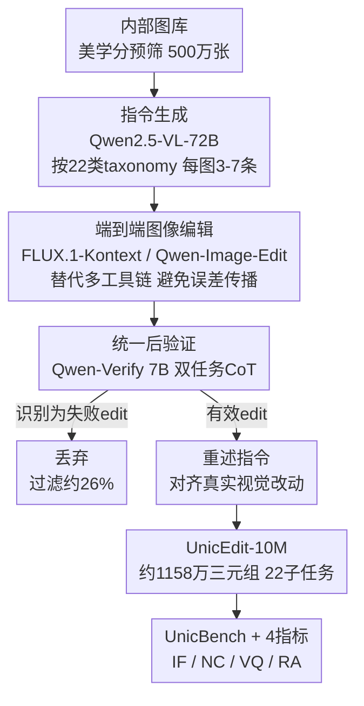

# UnicEdit-10M: A Dataset and Benchmark Breaking the Scale-Quality Barrier via Unified Verification for Reasoning-Enriched Edits

**会议**: CVPR 2026  
**论文**: [CVF Open Access](https://openaccess.thecvf.com/content/CVPR2026/html/Ye_UnicEdit-10M_A_Dataset_and_Benchmark_Breaking_the_Scale-Quality_Barrier_via_CVPR_2026_paper.html)  
**代码**: 有（论文给出 Project Page / GitHub，具体地址 ⚠️ 以原文为准）  
**领域**: 图像生成 / 指令式图像编辑 / 数据集与基准  
**关键词**: 指令式图像编辑、大规模数据集、后验证、专家验证模型、推理编辑基准

## 一句话总结
作者用「端到端编辑 + 统一后验证」的轻量管线造出 1000 万级（实际约 1158 万）指令式图像编辑数据集 UnicEdit-10M，并训练一个 7B 双任务专家模型 Qwen-Verify 在低成本下做失败过滤与指令重述，同时配套提出覆盖基础编辑与复杂推理编辑的基准 UnicBench 及一组细粒度指标，系统诊断主流编辑模型的短板。

## 研究背景与动机

**领域现状**：指令式图像编辑（instruction-based image editing）靠扩散模型快速发展，闭源模型（GPT-4o、Nano Banana、Seedream 4.0）已能理解细腻指令并产出语义一致的编辑结果，定义了性能天花板；但开源与闭源的差距在持续拉大。

**现有痛点**：差距主要来自两块缺失——缺大规模高质量公开训练数据，缺能诊断模型在各类编辑行为上弱点的综合基准。现有开源数据集陷入「规模—质量」二选一：人工标注（如 MagicBrush）质量高但只有万级规模；自动化管线（SEED-Data-Edit、ImgEdit）能上百万千万级，却带入指令错配、编辑失败这类系统性噪声。

**核心矛盾**：作者把问题归因到三个技术根源——(1) **复杂工具链的误差传播**：多工具串联的自动管线，早期小误差会在下游放大成明显伪影；(2) **后验证不足或太窄**：有的方法只做简单失败检测却不纠正语义错配，有的只用 GPT-4o API 重写指令却忽略图像质量，且成本高昂；(3) **复杂编辑的评测盲区**：现有基准偏重物体/属性级改动，缺对空间推理、知识驱动编辑的系统测试，而且基于 VLM 的指标常忽视非编辑区域的意外改动、对风格变化过于敏感。

**本文目标**：分解为三件事——造一个既大又干净、还覆盖复杂编辑的数据集；让质量控制在千万级规模上「划得来」；建一个能照出复杂推理与空间能力短板的基准。

**切入角度**：与其继续堆叠工具链再事后补救，不如用单个端到端编辑模型直接出图（绕开误差传播），再用一个**统一**的后验证阶段同时完成「过滤失败 + 重述指令」，并把这一昂贵环节蒸馏进一个小专家模型。

**核心 idea**：用「端到端编辑 + 统一后验证 + 7B 专家模型 Qwen-Verify」替代「多工具链 + 一维后验证 + 大 API 调用」，在保持质量的同时把质量控制成本压到可规模化的程度，并用 UnicBench 把评测扩展到复杂推理编辑。

## 方法详解

### 整体框架

UnicEdit-10M 的数据管线是一个三阶段流水线：**(1) 数据准备/指令生成** → **(2) 图像编辑** → **(3) 后验证（失败过滤 + 指令重述）**。输入是一个经美学分预筛的大规模内部图库；中间为每张源图自动生成多条指令、再由端到端编辑模型合成编辑图，得到 ⟨原图, 指令, 编辑图⟩ 三元组；最后所有三元组过一遍统一后验证，由专家模型判定编辑是否有效、并把指令重写成与实际视觉改动精确对齐的版本，输出最终高质量数据集。质量控制的核心是把后验证这一步从「调 72B 大模型 / GPT-4o API」蒸馏成一个 7B 专家模型 Qwen-Verify。除数据集外，作者另起一套基准 UnicBench + 四个细粒度指标用于诊断模型。

### 关键设计

**1. 端到端编辑替代多工具链：从源头掐断误差传播**

现有自动管线（UltraEdit、ImgEdit、Step1X-Edit）把检测、分割、修复等视觉模块串成长链，早期模块一旦出错就会沿链放大成下游伪影。作者的做法是：指令生成后，每个 ⟨原图, 指令⟩ 对直接交给一个端到端编辑模型（FLUX.1-Kontext 与 Qwen-Image-Edit 两个开源 SOTA）一次出图，不再调用一堆中间工具。为适配不同输入分辨率，源图先经中心裁剪与缩放，并设质量检查——需要裁掉超过 20% 内容的图直接丢弃，避免内容大量丢失。这样把「多段误差累积」换成「单模型一次推理」，把失败集中到一个可被后验证捕获的环节，而不是散落在工具链各处。

**2. 统一后验证：一次 CoT 同时做失败过滤与指令重述**

自动出图必然有噪声，作者归纳出三类主要失败：**Edit Failure**（编辑图与源图几乎不变）、**Instruction-Image Misalignment**（执行了非预期编辑或没按指令做）、以及其他（质量退化、解剖结构错误等）。以往后验证往往「一维」——要么只检测失败不纠错，要么只重写指令不管图像质量。本文把两件事融进**一个由思维链（Chain-of-Thought）驱动的统一流程**：先分别给原图、编辑图生成 caption 以暴露细粒度差异；再据视觉差异判断是否发生了有效编辑；对有效编辑，把指令重写成精确匹配实际改动的版本；最后输出结构化 JSON，含一个布尔 `is_changed` 标志与重述后的指令。这样过滤与纠错共享同一套对图像差异的理解，避免「过滤说成功、指令却对不上」的脱节。

**3. Qwen-Verify：把昂贵的 72B/GPT-4o 后验证蒸馏成 7B 双任务专家**

直接用 Qwen2.5-VL-72B 做后验证虽有效，但算力昂贵且重述指令易幻觉。作者训练一个 7B 专家模型 Qwen-Verify 同时承担「失败检测 + 指令重述」两个任务，并用两阶段训练把它从普通 VLM 调成可靠验证器。训练数据按失败模式分三类：**Normal**（高质量、指令对齐的三元组）、**No Edit**（前后无可辨差异）、**Hallucination**（目标对但动作/属性描述错）。第一阶段用约 20 万 Normal+No Edit 样本做 SFT，赋予模型「区分失败 / 给成功样本写准指令」的基本能力；第二阶段用三类共约 2 万样本做偏好对齐——其中 Hallucination 集先用 GPT-4o 生成候选纠正、再经人工审定，构成偏好对。其关键创新是 **D2PO（Differential Direct Preference Optimization）**：传统 DPO 把视觉输入当静态上下文，而 D2PO 让策略条件于一个动态计算的**视觉差分上下文**——定义视觉编码器 $V$ 抽取编辑前后的潜在表示 $c_v = V(I_o, I_e)$，它编码了从 $I_o$ 到 $I_e$ 的变换。在偏好集 $D = \{(I_o, I_e, p_w, p_l)\}$ 上（$p_w$ 为纠正后的优选指令、$p_l$ 为幻觉指令），假设潜在奖励 $r(p, c_v)$，Bradley-Terry 给出 $P(p_w \succ p_l \mid c_v) = \sigma(r(p_w, c_v) - r(p_l, c_v))$。D2PO 不显式建奖励，而是用策略概率重参数化，定义策略优势函数：

$$A_{\pi_\theta, \pi_{ref}}(p, c_v) = \beta \log \frac{\pi_\theta(p \mid c_v)}{\pi_{ref}(p \mid c_v)}$$

其中 $\pi_\theta$ 是可训练策略、$\pi_{ref}$ 是冻结的 SFT 副本、$\beta$ 控制偏离程度。优化目标是最大化优势间隔：

$$L_{D2PO} = -\mathbb{E}_{(c_v, p_w, p_l) \sim D}\big[\log \sigma\big(A_{\pi_\theta, \pi_{ref}}(p_w, c_v) - A_{\pi_\theta, \pi_{ref}}(p_l, c_v)\big)\big]$$

让模型把「视觉到底改了什么」纳入打分，从而对齐人类对「精确忠实的编辑描述」的判断。⚠️ 公式符号转写自原文 OCR，以原文为准。

**4. UnicBench 与细粒度指标：把评测从基础编辑扩到复杂推理编辑**

为补评测盲区，作者基于真实+合成图、用「VLM 出候选 + 人工复核重写」的混合流程建 UnicBench，沿用与训练数据相同的 22 类 taxonomy，每类 50 个测试样本，显式覆盖空间视角变换、多物体协同、知识驱动推理等复杂编辑。指标上，他们指出 VIEScore 的缺陷（SC 对非编辑区域的意外改动不敏感、PQ 偏好自然度而低估风格化输出，且都不擅长推理类/几何复杂编辑），提出四个专门指标：**IF（Instruction Following）** 用 VLM 跨模态对齐分衡量满足指令的程度；**NC（Non-edit Consistency）** 惩罚编辑区域之外的意外改动；**VQ（Visual Quality）** 做指令条件下的自然度/连贯度评估；**RA（Reasoning Accuracy）** 针对知识密集编辑——先由 VLM 从指令与原图推出「应得结果」规格（每个样本提供 targets/operations/expected changes 的 reasoning-points 引导验证器注意力），再核对编辑图是否实现。每个指标 0–10，总分取所有相关指标的**几何平均**：

$$\text{Score} = \Big(\prod_{m \in M} m\Big)^{1/|M|}$$

基础编辑 $M=\{IF, NC, VQ\}$、复杂编辑 $M=\{IF, NC, VQ, RA\}$；几何平均保证任一维度的严重失败（含 0 分）都会拉低总分，比算术平均更能反映「一票否决」式失败。

### 损失函数 / 训练策略
Qwen-Verify 基于 Qwen2.5-VL-7B 两阶段训练：① SFT（约 200k Normal+No Edit）打底；② D2PO 偏好对齐（约 20k，三类样本），目标即上文 $L_{D2PO}$。数据全部经人工筛查校正以保真。

## 实验关键数据

### 数据集质量对比（Table 2）
用 X2Edit 协议、GPT-4o 对 1K 随机三元组打分（三次平均）：

| 数据集 | VIEScore-SC ↑ | VIEScore-PQ ↑ | Overall ↑ | 美学-源图 ↑ | 美学-编辑图 ↑ |
|--------|------|------|------|------|------|
| SEED-Data-Edit | 5.79 | 6.34 | 5.00 | 5.72 | 5.74 |
| ImgEdit | 6.32 | 7.88 | 6.25 | 6.49 | 7.03 |
| X2Edit | 7.35 | 7.28 | 6.87 | 7.52 | 7.54 |
| NHR-Edit | **8.32** | 7.94 | 7.78 | 7.35 | 7.42 |
| GPT-Image-Edit-1.5M | 8.68 | 7.16 | 7.75 | 6.23 | 7.59 |
| Nano-consistent-150k | 7.92 | 8.00 | 7.75 | 6.81 | 7.40 |
| **Ours (UnicEdit-10M)** | 8.45 | **8.20** | **8.08** | **8.00** | **7.76** |

UnicEdit-10M 拿下最高 PQ 与 Overall，美学分大幅领先所有对手。SC 上与 GPT-Image-Edit-1.5M 都高（都有指令重述步骤），但人脸一致性差异显著：UnicEdit 0.89 vs GPT-Image-Edit-1.5M 0.3025，说明本文管线更能保住关键主体细节。

### 管线各阶段数据量（Table 3）

| 处理阶段 | 方法 | 变化率(%) | 数据量 |
|------|------|------|------|
| 初始图像 | 内部图库 | - | 5,001,199 |
| 指令生成 | Qwen2.5-VL-72B | +447.26 | 22,368,563 |
| 编辑生成 | FLUX / Qwen | −30.03 | 15,651,530 |
| 失败过滤 | Qwen-Verify | −25.97 | 11,586,583 |
| 指令重述 | Qwen-Verify | - | 11,586,583 |
| 最终数据 | - | - | 11,586,583 |

后验证过滤掉约 26% 的失败编辑。⚠️ 数据集名为「10M」，但最终量约 1158 万（四大类：场景 3.063M / 属性 3.529M / 物体 3.242M / 推理 1.746M），名称是约数，以原文为准。

### UnicBench 模型评测（Table 4，节选 Overall-EN）

| 模型 | IF | NC | VQ | RA | Overall |
|------|------|------|------|------|------|
| Instruct-Pix2Pix | 2.85 | 4.10 | 3.97 | 1.96 | 2.92 |
| OmniGen2 | 6.25 | 7.50 | 6.49 | 5.12 | 6.12 |
| FLUX.1-Kontext | 6.78 | **8.47** | 7.36 | 5.50 | 6.80 |
| Qwen-Image-Edit（开源最佳） | **8.21** | 8.03 | **8.07** | **6.45** | **7.73** |
| Nano Banana | 7.98 | 8.98 | 8.20 | 6.87 | 7.88 |
| Seedream 4.0 | 8.38 | 8.72 | 8.07 | 7.60 | 8.04 |
| GPT-Image-1（整体最佳） | **9.16** | 7.84 | **8.68** | **8.34** | **8.35** |

闭源整体压过开源，GPT-Image-1 最强、Seedream 4.0 次之（NC 突出）；开源里 Qwen-Image-Edit 最强。几乎所有模型在 RA 上明显掉分——复杂推理与知识密集编辑是普遍短板，这也反过来论证了本文数据集与管线针对性生成此类数据的价值。

### 专家模型对比（Table 5）

| 模型 | Normal Acc.↑ | No Edit Acc.↑ | Hallucination Acc.↑ |
|------|------|------|------|
| Qwen2.5-VL-7B | 4.39 | 4.84 | 3.95 |
| Qwen2.5-VL-72B | 5.25 | 9.60 | 6.12 |
| Qwen2.5-VL-7B + SFT | 5.62 | 9.40 | 5.47 |
| **Qwen-Verify** | **6.32** | **9.80** | **6.22** |

Qwen-Verify 在三项上全面超越所有基线，包括 10 倍参数的 72B。SFT 已把 7B 拉到接近 72B，D2PO 再把三项尤其 Hallucination（5.47→6.22）顶上去。

### 关键发现
- **RA 是普遍瓶颈**：基础指令大家都做得不错，复杂推理/知识编辑（RA）全线掉分，是开源闭源共同短板。
- **双任务设计有效**：联合优化失败检测与指令重写，让模型抓住细粒度语义差异；7B 专家以远低成本超过 72B。
- **SSIM 不适合语义后验证**：传统 SSIM 对「语义有意义但视觉细微」的改动不敏感，又对生成固有的微小像素抖动过敏，远逊 Qwen-Verify。
- **NC 指标补上 VIEScore 盲区**：在「误删人物 / 误改文字」等案例里，VIEScore 仍给高 SC，而本文把评测拆成 IF + NC 后，NC 能正确识别并惩罚非编辑区域的意外改动。

## 亮点与洞察
- **把「后验证」当一等公民**：不是出完图就算完，而是把失败过滤与指令重述统一进一个 CoT 流程，并蒸馏成 7B 专家——这让千万级规模的质量控制第一次「划得来」，是规模与质量兼得的关键。
- **D2PO 的差分条件**：把 DPO 的条件从静态图像换成「编辑前后差分表示」$c_v$，让偏好优化直接对齐「到底改了什么」，对指令重述这种强依赖视觉差异的任务很对症，思路可迁移到任何「描述一对图像之间变化」的偏好学习。
- **指令重述 = 用结果反写指令**：先编辑、再让验证器把指令改写成与实际改动对齐的版本，等于用「输出」校准「输入」，天然提升指令-图像对齐度（SC 高的来源），是合成数据降噪的巧招。
- **几何平均当总分**：用几何平均而非算术平均，让任一维度 0 分直接拖垮总分，逼模型在 IF/NC/VQ/RA 上都不能有明显短板，比平均分更难「偏科刷分」。

## 局限与展望
- **「10M」是约数**：实际最终约 1158 万，命名与统计需读者留意；四大类分布不均（推理类仅 1.746M，恰是最稀缺也最需要的复杂编辑）。
- **质量上限受限于上游模型**：编辑由 FLUX.1-Kontext / Qwen-Image-Edit 出，指令由 Qwen2.5-VL-72B 出，数据天花板被这些开源模型的能力锁定；端到端合成也可能带来与真实编辑的分布偏移。
- **评测仍靠 VLM 当裁判**：IF/NC/VQ/RA 均由 VLM（gpt-4.1）打分，裁判模型自身偏置与对风格的敏感性未必完全消除；RA 依赖人工提供的 reasoning-points，扩展到新任务有标注成本。
- **Qwen-Verify 训练依赖人工**：SFT/DPO 数据均经人工筛查校正、Hallucination 纠正还要 GPT-4o + 人工，专家模型本身的「廉价」建立在一次性的人工投入上。

## 相关工作与启发
- **vs 多工具链管线（UltraEdit / ImgEdit / Step1X-Edit）**：它们靠拼接视觉模块上规模但易误差传播；本文用端到端编辑 + 统一后验证，从源头减少累积误差并集中纠错。
- **vs 端到端合成（InstructPix2Pix / HQ-Edit）**：它们避免了误差累积但缺显式质量验证、易分布偏移；本文补上一个专门的后验证专家模型。
- **vs 一维后验证（NHR-Edit 只过滤 / GPT-Image-Edit-1.5M 只重述且靠 GPT-4o）**：本文把过滤与重述统一、并蒸馏到 7B 降本，人脸一致性 0.89 vs 0.30 体现细节保真优势。
- **vs 现有基准（GEdit-Bench / ImgEditBench / KRIS-Bench）**：前两者偏基础编辑、对非编辑区改动不敏感，KRIS-Bench 专测推理却缺基础编辑；UnicBench 同时覆盖基础+复杂，并用 NC/RA 补盲区。

## 评分
- 新颖性: ⭐⭐⭐⭐ 端到端+统一后验证+D2PO 专家模型组合扎实，单点创新（D2PO）中等但工程整合度高
- 实验充分度: ⭐⭐⭐⭐⭐ 数据集质量、管线各阶段、专家模型、12+ 模型基准评测、指标对比一应俱全
- 写作质量: ⭐⭐⭐⭐ 动机三因归纳清晰、图表完整；部分公式 OCR 转写需对照原文
- 价值: ⭐⭐⭐⭐⭐ 10M 级开源数据集 + 诊断型基准 + 可复用的低成本验证模型，对缩小开源-闭源差距有直接实用价值

<!-- RELATED:START -->

## 相关论文

- [\[CVPR 2026\] Pico-Banana-400K: A Large-Scale Dataset for Text-Guided Image Editing](pico-banana-400k_a_large-scale_dataset_for_text-guided_image_editing.md)
- [\[CVPR 2026\] UniVerse: Empower Unified Generation with Reasoning and Knowledge](universe_empower_unified_generation_with_reasoning_and_knowledge.md)
- [\[CVPR 2026\] BioVITA: Biological Dataset, Model, and Benchmark for Visual-Textual-Acoustic Alignment](biovita_biological_dataset_model_and_benchmark_for_visual-textual-acoustic_align.md)
- [\[AAAI 2026\] Breaking the Modality Barrier: Generative Modeling for Accurate Molecule Retrieval from Mass Spectra](../../AAAI2026/image_generation/breaking_the_modality_barrier_generative_modeling_for_accurate_molecule_retrieva.md)
- [\[CVPR 2026\] VINS-120K: Ultra High-Resolution Image Editing with A Large-Scale Dataset](vins-120k_ultra_high-resolution_image_editing_with_a_large-scale_dataset.md)

<!-- RELATED:END -->
