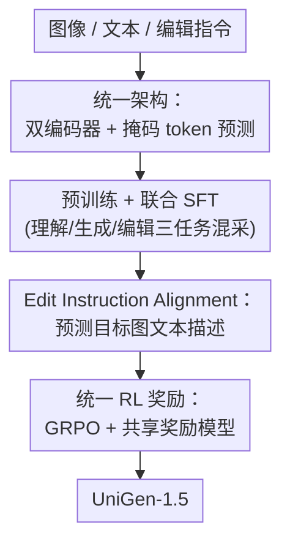

# UniGen-1.5: Enhancing Image Generation and Editing through Reward Unification in RL

**会议**: CVPR 2026  
**论文**: [CVF Open Access](https://openaccess.thecvf.com/content/CVPR2026/html/Tian_UniGen-1.5_Enhancing_Image_Generation_and_Editing_through_Reward_Unification_in_CVPR_2026_paper.html)  
**代码**: 待确认  
**领域**: 图像生成 / 统一多模态模型  
**关键词**: 统一MLLM, 图像编辑, GRPO, 奖励统一, 掩码token预测

## 一句话总结
UniGen-1.5 把图像理解、文生图和图像编辑塞进同一个 7B 多模态大模型，关键创新是把"图像编辑"重写成"普通图像生成"，从而让文生图和编辑共用同一套奖励模型做统一 RL（GRPO），再配一个轻量的 Edit Instruction Alignment 阶段补齐指令理解，最终在 GenEval（0.89）、DPG-Bench（86.83）和 ImgEdit（4.31）上超过 BAGEL 等开源模型、逼近 GPT-Image-1。

## 研究背景与动机

**领域现状**：统一多模态大模型（unified MLLM）想用一个模型同时干"看图（理解）"和"画图（生成）"。前作 UniGen 用一套以数据为中心的流水线把模型从预训练带到后训练，并在后训练用 chain-of-thought verification（CoT-V）——让模型先用自己的理解能力去验证生成结果——来提升文生图质量。

**现有痛点**：UniGen 有两个硬伤。其一，CoT-V 是一种 test-time scaling，推理时要反复验证，带来巨大的推理开销。其二，UniGen 根本不会做图像编辑，而编辑恰恰是衡量"细粒度可控生成"的核心能力。

**核心矛盾**：用 RL（而非 test-time 验证）来提升生成质量是更省推理成本的路子，文生图领域已有不少工作证明 GRPO 有效。但把 RL 用到图像编辑上几乎没人成功，根本障碍是**奖励建模太难**：编辑的变化跨度极大——小到删除/替换一个小物体，大到整张图改风格，奖励模型要在像素空间稳定区分"编辑对不对"非常困难；而专门训练编辑奖励模型又需要海量人工标注、覆盖各类编辑类型，成本不可接受。

**本文目标**：(1) 设计一个单模型架构，同时支持理解、生成、编辑；(2) 让 RL 能同时、稳定地提升生成和编辑两个任务。

**切入角度**：作者的关键观察是——如果给定了"期望输出图的文本描述"，那么编辑任务和文生图任务本质上是同一件事：都是"让生成图和一段文本描述对齐"。于是不必为编辑单独造奖励模型。

**核心 idea**：把图像编辑**重写为一般图像生成**，用"生成图 ↔ 目标文本描述"的语义一致性作为统一奖励，让稳定成熟的文生图奖励模型（CLIP、HPSv2 等）被直接复用到编辑上，从而把两个任务装进同一套 GRPO 训练里联合优化。

## 方法详解

### 整体框架
UniGen-1.5 以预训练 LLM（Qwen2.5-7B）为骨干，配两个**独立的视觉编码器**：理解用连续编码器 SigLIP2（支持任意分辨率/宽高比），生成用离散视觉 tokenizer MAGViTv2（把图编码成离散 token）。同一个 LLM 通过三种前向方式覆盖三类任务：理解时输入 SigLIP2 连续 token + 文本，做 next-token 预测出文字；文生图时把目标图编成离散 token、随机掩码一部分换成 `[MASK]`，让 LLM 在文本条件下预测被掩码的视觉 token（masked token prediction）；编辑时同时用两个编码器抽条件图的**语义特征**（SigLIP2）和**低层特征**（MAGViTv2），按"语义视觉 emb + 文本 emb + 低层视觉 emb"顺序拼成条件序列喂给 LLM，再以掩码 token 预测生成输出图的离散 token。

训练分四个阶段串行推进：**预训练**（用对齐良好的图文对打底，理解+文生图，按 3:2:1 采样生成/理解/纯文本）→ **联合 SFT**（加入合成高质量数据与编辑数据，按 3:4:1 采样生成/理解/纯文本，并用 round-robin 在文生图和编辑间交替以稳住训练，此阶段解锁编辑能力）→ **Edit Instruction Alignment**（轻量 Post-SFT，补齐编辑指令理解）→ **统一 RL**（GRPO + 共享奖励模型，联合提升生成与编辑）。本文的三处真正贡献是统一架构、Edit Instruction Alignment 和统一 RL 奖励，预训练/SFT 属于沿用前作的脚手架。

### 关键设计

**1. 统一架构：双编码器 + 掩码 token 预测把理解/生成/编辑装进一个 LLM**

痛点是 UniGen 只会理解和生成、不会编辑，而要让一个 LLM 同时胜任三件事，核心难点在"编辑"要既看懂条件图的语义、又保留它的像素细节。作者的做法是用**任务解耦的双编码器**而非单一 tokenizer：理解走 SigLIP2 连续编码器（保留原图任意分辨率的原生信息），生成/编辑走 MAGViTv2 离散 tokenizer（适配掩码 token 预测）。编辑时两个编码器同时上——条件图 $X_C$ 同时得到语义特征 $X^U_C=\mathrm{Enc}_U(X_C)$ 和低层特征 $X^G_C=\mathrm{Enc}_G(X_C)$，经各自 MLP 投影后与编辑文本 $T_C$ 拼成 $[X^U_C,\,T_C,\,X^G_C]$ 作为条件，让 LLM 用掩码 token 预测生成输出图 $X^G_O$。生成和编辑统一用 384×384 分辨率与 MaskGIT 式的余弦掩码调度，三种任务因此共享同一个骨干和同一套生成机制，而不是拼三个独立模型。两个视觉编码器在所有训练阶段都**冻结**，只训 LLM 与投影层。

**2. Edit Instruction Alignment：先教会模型"看懂编辑指令"，RL 才有有效信号**

这一步针对的是一个很具体的训练失败现象：在 RL 的初步实验里，遇到复杂编辑指令时，模型采样出的一组候选**全都满足不了指令**，导致这一组奖励的标准差极小。而 GRPO 的优势是按组归一化算的——$A_i=\dfrac{R_i-\mathrm{mean}\{R_1,\dots,R_N\}}{\mathrm{std}\{R_1,\dots,R_N\}}$，分母（std）一旦趋近 0，学习信号就被淹没，策略学不动。作者把根因归结为"模型没真正理解编辑指令、推不出目标图该长什么样"。

解法是插入一个轻量的 Post-SFT 阶段：对每个编辑输入 $(X_C, T_C)$，先用强 teacher 模型合成一段"期望输出图的文本描述" $T_O$，然后让 UniGen-1.5 以标准 next-token 预测去**从条件图+指令预测出 $T_O$**。这等于强迫模型把"编辑意图"翻译成对目标图语义的准确刻画，训完后模型能给出语义连贯又彼此有差异的候选，从而让 RL 拿到信息量更大的奖励信号。消融显示这一步在 RL 之前就能涨点，且在 RL 中被显著放大（见下文）。

**3. 统一 RL 奖励：把编辑重写为"测目标文本一致性"，文生图奖励模型直接复用**

这是全文的题眼，针对的就是"编辑奖励难造"这一核心矛盾。作者不再为编辑单独训奖励模型，而是把两个任务都用同一个奖励函数 $R(\tilde{X}^G_O, T_O)$ 评分——$\tilde{X}^G_O$ 是像素空间的生成图，$T_O$ 是期望输出的文本描述：文生图直接用 ground-truth prompt 当 $T_O$，编辑则用前一步合成的 caption 当 $T_O$。其底层假设是"一个足够强的 LLM 能可靠地刻画各种修改幅度下编辑图的视觉差异"。这样一来，原本为文生图打磨成熟、稳定的奖励模型就能**原封不动地搬到编辑上**，奖励设计被极大简化，也让单模型的联合优化变得可扩展。

具体优化用 GRPO：从 Post-SFT 模型初始化策略 $\pi_\theta$，对每个输入采样 $N$ 个候选 $\{\hat{X}^G_{O_1},\dots,\hat{X}^G_{O_N}\}$，各赋标量奖励 $R_i$，按上式算组归一化优势 $A_i$，再优化 $J(\theta)=\frac{1}{N}\sum_i \min\!\big(\rho_i A_i,\ \mathrm{clip}(\rho_i,1-\varepsilon,1+\varepsilon)A_i\big)-\beta\,D_{KL}(\pi_\theta\|\pi_{\text{ref}})$（实现上跟随 T2I-R1 去掉 ratio clipping、只用显式 KL 惩罚约束更新）。奖励 $R(\cdot)$ 用一组多样的视觉专家集成：CLIP-H、HPSv2、Unified-Reward-7B 和 ORM。训练数据上，文生图用 T2I-R1 的 6,786 条 prompt；编辑自建 Edit-RL（10,568 条），条件图用 Qwen-Image 生成、指令用 Qwen2.5-VL-72B 按模板造、目标描述用 Qwen2.5-72B 合成。⚠️ 公式中各符号（如重要性采样比 $\rho_i$、KL 系数 $\beta$）以原文为准。

### 损失函数 / 训练策略
预训练除两个视觉编码器外全部解冻；SFT 联合三任务、用 round-robin 在文生图/编辑间交替提升稳定性。Edit Instruction Alignment 在自建 Edit-Align 数据上训 500 步（8×H100，batch 64，lr 1e-5，cosine）。GRPO 训 1500 步（8×B200，batch 32，lr 3e-6，KL 系数 $\beta=0.01$，每输入采 $N=8$ 个候选；为加速每个候选仅用 16 步解码并关掉 CFG）。推理时文生图 CFG 尺度 5.0、生成 50 步；编辑用双尺度 CFG（指令尺度 $s_T=3$、条件图尺度 $s_I=1.5$）。

## 实验关键数据

### 主实验

图像编辑（ImgEdit benchmark，overall 越高越好）：UniGen-1.5 在不借助任何外部 diffusion 模型的前提下拿到最高 overall 4.31，超过同体量开源模型，甚至略胜 GPT-Image-1。

| 模型 | #Params | Extract | Replace | Remove | Overall |
|------|---------|---------|---------|--------|---------|
| BAGEL | 7B MoT | 1.70 | 3.30 | 2.62 | 3.20 |
| OmniGen2 | 7B | 1.77 | 3.74 | 3.20 | 3.44 |
| FLUX.1 Kontext [Pro] | - | 2.35 | 4.56 | 3.57 | 4.00 |
| GPT Image 1 [High] | - | 2.90 | 4.35 | 3.66 | 4.20 |
| Qwen-Image | 7B | 3.43 | 4.66 | 4.14 | 4.27 |
| **UniGen-1.5** | 7B | **3.86** | **4.78** | **4.57** | **4.31** |

文生图（GenEval / DPG-Bench，越高越好）：UniGen-1.5 取得 0.89 / 86.83，相比前作 UniGen 在 GenEval 上 +0.11、DPG-Bench 上 +1.6，并在 GenEval overall 上分别超过 Show-o2、BLIP3-o、BAGEL 0.13/0.05/0.07 点，"Position" 类目优势尤其明显。

| 模型 | #Params | GenEval Overall | DPG-Bench Overall |
|------|---------|------|------|
| GPT Image 1 [High] | - | 0.84 | 85.15 |
| UniGen | 1.5B | 0.78 | 85.19 |
| BAGEL | 7B MoT | 0.82 | - |
| Show-o2 | 7B | 0.76 | 86.14 |
| BLIP3-o | 8B | 0.84 | 81.60 |
| **UniGen-1.5** | 7B | **0.89** | **86.83** |

图像理解上 UniGen-1.5 全面超过前作 UniGen（AI2D 67.4→77.4、ScienceQA 79.4→86.3、Seedbench 70.8→76.5 等），与 Show-o2 等同体量强模型相当，作者归因于扩到 7B、提高输入分辨率并保原始宽高比、以及加入了基于理解的预训练。

### 消融实验

统一 RL 的作用（Table 4，T2I=文生图、I-Edit=编辑，报告 overall）：两个任务都进 RL 才能整体最好；只留一个任务做 RL 会让另一个任务明显掉点。

| T2I in RL | I-Edit in RL | GenEval | DPG-Bench | ImgEdit |
|-----------|--------------|---------|-----------|---------|
| ✗ | ✗（无 RL） | 0.85 | 84.19 | 3.93 |
| ✓ | ✗ | 0.90 | 86.62 | 4.01 |
| ✗ | ✓ | 0.85 | 86.39 | 4.32 |
| ✓ | ✓ | **0.89** | **86.83** | **4.31** |

Edit Instruction Alignment 的作用（Table 5，报告 overall）：该阶段在 RL 之前就能让三项都涨；更关键的是它对 RL 的"放大"作用——没有它时 RL 只把 ImgEdit 抬 0.21（3.87→4.08），有它时 RL 把 ImgEdit 抬 0.38（3.93→4.31）。

| Edit Align | Unified RL | GenEval | DPG-Bench | ImgEdit |
|------------|-----------|---------|-----------|---------|
| ✗ | ✗ | 0.83 | 83.92 | 3.87 |
| ✓ | ✗ | 0.85 | 84.19 | 3.93 |
| ✗ | ✓ | 0.90 | 86.96 | 4.08 |
| ✓ | ✓ | 0.89 | 86.83 | **4.31** |

### 关键发现
- **统一 RL 是双赢但不可偏废**：单独对文生图做 RL 会让编辑停在 4.01、单独对编辑做 RL 会让 GenEval 卡在 0.85，只有联合训练才在三项上整体最优——证明"把编辑重写成生成、共享奖励"确实让两任务互相受益。
- **Edit Instruction Alignment 的价值主要体现在"喂养 RL"**：它单独的涨幅有限，但能把编辑候选的奖励方差撑起来，使 GRPO 拿到有效梯度，所以 RL 阶段的编辑增益几乎翻倍（0.21→0.38）。
- **有趣的取舍**：加入 Edit Alignment 后 GenEval（0.90→0.89）和 DPG-Bench（86.96→86.83）略降，但 ImgEdit 大涨（4.08→4.31）——这一步是偏向编辑的，作者选择用文生图上微不足道的损失换编辑上的显著提升。
- **不靠外部 diffusion 也能拿 SOTA 编辑**：UniGen-1.5 全程用轻量离散 tokenizer 重建，证明"统一奖励 + GRPO"这条路本身就能把编辑做到逼近 GPT-Image-1。

## 亮点与洞察
- **"重写任务"比"造新奖励"更聪明**：把编辑套进"生成图 ↔ 目标文本一致"的统一 schema，绕开了编辑奖励模型需要海量人工标注的死结，直接复用成熟的文生图奖励——这个"任务归一化"的思路可迁移到任何"难造奖励但能描述目标"的生成子任务。
- **诊断驱动设计**：Edit Instruction Alignment 不是凭空加的阶段，而是从"RL 时编辑候选奖励 std≈0、GRPO 学不动"这个具体故障倒推出来的，把"补齐指令理解"精准定位为 RL 的前置条件。
- **双编码器解耦**：语义（SigLIP2 连续）与低层（MAGViTv2 离散）特征分工，让同一个 LLM 在编辑时既懂"改什么"又留住"原图细节"，是统一模型支持编辑的关键工程点。

## 局限与展望
- **不擅长渲染文字**：模型聚焦语义对齐+离散 token，只用轻量 detokenizer 重建，生成图中的文字（依赖精细结构细节）质量差；作者建议引入 diffusion 组件来补。
- **视觉一致性仍是短板**：编辑时存在 visual inconsistency（编辑区域之外的内容会有不必要变化），根因是统一奖励只测"与目标描述的语义一致"、没专门约束"未编辑区域保持不变"，需要一个专门的一致性奖励模型，留作未来工作。
- **奖励上限受限于 caption 质量**：编辑奖励依赖 teacher 合成的目标描述与"强 LLM 能可靠刻画视觉差异"的假设，描述不准或忽略局部细节时，奖励信号会有偏。

## 相关工作与启发
- **vs UniGen（前作）**：UniGen 用 test-time 的 CoT-V 提升文生图，推理开销大且不会编辑；UniGen-1.5 改用 RL（无额外推理开销）并解锁编辑，把"验证式提升"换成"探索式提升"。
- **vs 专门训编辑奖励的工作**：他们为编辑单独造奖励模型、需大规模标注；本文用"统一文本一致性奖励"复用文生图奖励模型，省掉编辑奖励的标注成本。
- **vs T2I-R1**：本文沿用其 GRPO 配置（去 ratio clipping、显式 KL）与奖励集成思路，但把适用范围从纯文生图扩展到"文生图 + 编辑"的统一优化。
- **vs 解耦 LLM-diffusion 路线（如 OmniGen2/BLIP3-o）**：那类方法把生成外包给 diffusion 解码器；UniGen-1.5 走 AR + 掩码 token 预测的统一序列建模，不依赖外部 diffusion 也拿到 SOTA 编辑分。

## 评分
- 新颖性: ⭐⭐⭐⭐ "把编辑重写成生成以统一奖励"是简洁而有效的视角转换，工程整合度高
- 实验充分度: ⭐⭐⭐⭐ 理解/生成/编辑三类 benchmark 全覆盖，统一 RL 与 Edit Alignment 两个消融都做得清楚
- 写作质量: ⭐⭐⭐⭐ 动机由具体故障（RL 奖励 std≈0）驱动，逻辑链清晰
- 价值: ⭐⭐⭐⭐ 为统一 MLLM 提供了一个不依赖外部 diffusion、可扩展的强 baseline

<!-- RELATED:START -->

## 相关论文

- [\[CVPR 2026\] Enhancing Spatial Understanding in Image Generation via Reward Modeling](enhancing_spatial_understanding_in_image_generation_via_reward_modeling.md)
- [\[CVPR 2026\] PaCo-RL: Advancing Reinforcement Learning for Consistent Image Generation with Pairwise Reward Modeling](paco-rl_advancing_reinforcement_learning_for_consistent_image_generation_with_pa.md)
- [\[CVPR 2026\] The Image as Its Own Reward: Reinforcement Learning with Adversarial Reward for Image Generation](the_image_as_its_own_reward_reinforcement_learning_with_adversarial_reward_for_i.md)
- [\[CVPR 2026\] Leveraging Verifier-Based Reinforcement Learning in Image Editing](leveraging_verifier-based_reinforcement_learning_in_image_editing.md)
- [\[CVPR 2026\] Meta-CoT: Enhancing Granularity and Generalization in Image Editing](meta-cot_enhancing_granularity_and_generalization_in_image_editing.md)

<!-- RELATED:END -->
