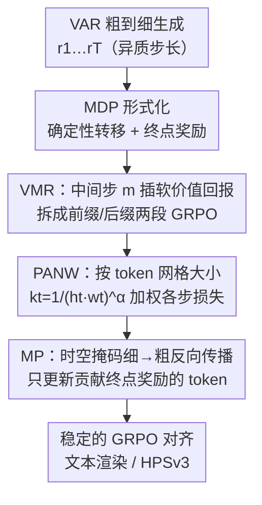

# VAR RL Done Right: Tackling Asynchronous Policy Conflicts in Visual Autoregressive Generation

**会议**: CVPR 2026  
**论文**: [CVF Open Access](https://openaccess.thecvf.com/content/CVPR2026/html/Sun_VAR_RL_Done_Right_Tackling_Asynchronous_Policy_Conflicts_in_Visual_CVPR_2026_paper.html)  
**代码**: https://github.com/ByteVisionLab/NextFlow  
**领域**: 图像生成 / 强化学习对齐  
**关键词**: 视觉自回归(VAR)、GRPO、文本渲染、信用分配、KL正则RL  

## 一句话总结
针对视觉自回归（VAR）模型逐尺度生成时各步「query token 数量」剧烈波动、直接套 GRPO 会产生异步策略冲突的问题，本文用「中间回报分段（VMR）+ 按 token 数归一化加权（PANW）+ 时空掩码传播（MP）」三件套改造 GRPO，在文本渲染任务上把 Nextflow 的词准确率从 0.55 拉到 0.78，并在扩散类基线中拿到 HPSv3 SOTA。

## 研究背景与动机
**领域现状**：视觉生成有三大范式——自回归（AR，光栅扫描逐 token）、扩散、以及视觉自回归（VAR）。VAR 走的是「next-scale prediction」：把图像表示成一串从粗到细的离散 token 网格 $r_1, r_2, \dots, r_T$，第 $t$ 步并行吐出一整张分辨率为 $h_t \times w_t$ 的 token 网格，逐级细化。这种粗到细设计对齐高分辨率骨干、采样快，但用 RL 对齐时会出大问题。

**现有痛点**：VAR 各生成步的输入结构是**异质**的——如论文 Figure 1 所示，从粗尺度到细尺度，单步要预测的 query token 数能跨数量级地波动（比如几十个 token 到几千个 token）。RL 阶段本来样本就比预训练少得多，这种步间巨大差异会让训练不稳、收敛慢、对齐效果差。论文还观察到一个反常现象（Figure 2）：在「部分前缀」尺度上做监督 RL，居然比在「全尺度」上做更好——说明全序列直接优化反而被异质性拖累了。

**核心矛盾**：作者把它命名为**异步策略冲突（asynchronous policy conflict）**。香草 GRPO 是 bandit 式的（只有终点一个奖励、把整条序列当一个动作），但 VAR 是「多尺度、每步并行出一大片 token」的结构。当不同步的任务相似度差异巨大、且高分辨率步的梯度天然量级更大时，把所有步塞进同一个 bandit 目标会让高分辨率步主导更新、信用分配混乱。

**本文目标**：拆成三个子问题——（1）如何给早期（粗尺度）决策更密、更低方差的反馈；（2）如何平衡不同步之间的梯度量级；（3）如何把信用精确分配到真正影响最终奖励的 token 上。

**切入角度**：作者先把 VAR 生成形式化成一个**确定性 MDP**（状态=已生成的部分序列、动作=生成下一尺度网格、转移确定、只有终点奖励），再借 KL 正则 RL 的经典最优解理论来设计「结构保持」的奖励塑形——既缓解冲突又**不改变最优策略**。

**核心 idea**：用「在中间步插一个软价值回报，把全程 RL 拆成前缀/后缀两段优化」替代「整条序列一个 bandit 奖励」，再配 token 数归一化加权和时空掩码传播，让 GRPO 在 VAR 上稳下来。

## 方法详解

### 整体框架
方法建立在一个把 VAR 形式化为确定性 MDP 的基础上：动作空间 $a_t = r_{t+1}$（生成下一尺度网格），状态 $s_t = (r_1, \dots, r_t)$，转移确定，环境只在终点给一个返回 $R(s_T)$。在 KL 正则 RL 下，最优策略形如 $\pi^*(a_t \mid s_t) \propto \pi_{\text{old}}(a_t\mid s_t)\exp\big(\tfrac{1}{\beta}Q^*(s_t,a_t)\big)$，而由于转移确定，最优 $Q$ 函数可写成 $Q^*(s_t,a_t)=\beta\ln\mathbb{E}_{\pi_{\text{old}}}[\exp(\tfrac{1}{\beta}R(s_T))\mid s_t,a_t]$。这套理论是后面三个组件「能这么做且不破坏最优性」的依据。

在此之上，作者用三个协同组件改造 GRPO：**VMR** 在中间步 $m$ 插一个软价值回报，把全程优化拆成前缀、后缀两段分别用 GRPO 训（解决稀疏/高方差反馈与跨步冲突）；**PANW** 给每步损失乘上一个按 token 网格大小归一化的权重（平衡步间梯度量级）；**MP** 维护一张时空掩码、从细尺度往粗尺度反向传播，只把奖励/梯度作用在真正贡献最终回报的 token 上（精化时空信用分配）。三者落在同一条 GRPO 训练流水线里。

### 关键设计

**1. VMR（Value as Middle Return）：在中间步插一个软价值，把全程 RL 拆成不破坏最优性的前缀/后缀两段**

香草 GRPO 把整条 VAR 序列当成一次 bandit 动作，只有终点一个奖励——这对动辄几十步、且步间长度差异巨大的 VAR 来说，早期粗尺度决策拿到的反馈又稀疏又高方差，冲突最严重。VMR 的做法是：在某个中间步 $m$ 定义一个**中间步软价值** $V^*_m(s_m)=\beta\log\mathbb{E}_{\pi_{\text{old}}}\big[\exp(\tfrac{1}{\beta}R(s_T))\mid s_m\big]$，然后把目标拆成两段，各带一个局部 KL 惩罚分别优化：后缀段 $\max_{\pi_{m:T-1}}\mathbb{E}[R(s_T)\mid s_m]-\beta\,\mathrm{KL}(\pi_{m:T-1}\Vert\pi_{\text{old}})$，前缀段则把 $V^*_m(s_m)$ 当作**唯一奖励** $\max_{\pi_{1:m-1}}\mathbb{E}[V^*_m(s_m)]-\beta\,\mathrm{KL}(\pi_{1:m-1}\Vert\pi_{\text{old}})$。

这么拆的关键好处是：每段内 token 长度更接近，前缀段拿到的是密集、低方差的反馈；而作者用 Theorem 2（两阶段不变性）证明，在 VAR 策略族 $\mathcal{M}_\theta$ 内，分别解出的前缀最优 $\pi^\dagger_{1:m-1}$ 和后缀最优 $\pi^\dagger_{m:T-1}$ 拼接起来，**唯一地**最大化全程目标 $J(\pi)$——也就是说这是一种「结构保持的奖励塑形」，它让最优解更容易达到，却不改变最优解本身。实现上不像 PPO 那样去拟合一个 step-wise critic，而是直接用 on-policy 终点奖励做风险敏感估计：采 $K$ 条 rollout，$V_m(s_m)=\beta\log\big(\tfrac{1}{K}\sum_k\exp(\tfrac{1}{\beta}R^{(k)}(s_T))\big)$，论文里取 $\beta=1, K=2$ 就够稳。训练时按 Eq.(5) 交替：每三次前缀 GRPO 更新配一次后缀 GRPO 更新。

**2. PANW（Per-Action Normalization Weighting）：按 token 网格大小归一化各步损失，压住高分辨率步的梯度主导**

异步冲突的另一面是梯度量级失衡：高分辨率步一次要预测几千个 token，其损失/梯度天然比粗尺度步大得多，会主导整个更新、淹没早期决策。PANW 给每步 $t$ 的损失乘一个归一化权重 $k_t=\dfrac{1}{(h_t w_t)^\alpha}$，其中 $h_t\times w_t$ 是该步 token 网格大小，$\alpha$ 是衰减指数，乘完再做 step-level 归一化。这样 token 多的步不会按比例放大地影响学习，KL 预算和梯度尺度在各步间被拉平。$\alpha$ 不能太猛——太大会把高分辨率更新过度压制；实验里 $\alpha\in[0.6,0.8]$ 最稳，$\alpha=0.6$ 词准确率/NED 最好、$\alpha=0.8$ CLIPScore 最高。

**3. MP（Mask Propagation）：构建时空掩码并从细尺度反向传到粗尺度，把信用只分给真正决定奖励的 token**

即使分了段、平衡了梯度，奖励（比如 OCR 识别文本质量）其实只由图里一小片区域（如包含文字的 bounding box）决定，对全图所有 token 一视同仁地更新会引入大量无关方差。MP 先从「直接决定奖励的输出成分」（如预测的文本框）构造一张初始掩码，再沿模型的多尺度层级**从细到粗反向传播**这张掩码（论文 Figure 4），用它去门控中间奖励和梯度。结果是：信用分配聚焦到因果相关的区域，跨空间、跨时间地降方差，同时顺带改善了跨尺度平衡。消融里去掉 MP 会让训练曲线变差，说明它对收敛质量有实打实的贡献。

### 损失函数 / 训练策略
基座为 Nextflow（7B），1024×1024 生成。on-policy 训练，group size=16（每个 prompt 16 个候选）、batch size=16（每次更新 16 个 prompt），最多 1200 次更新（约 19,200 个唯一 prompt/任务）。AdamW，学习率 $10^{-5}$，$\beta_1=0.9,\beta_2=0.95$，weight decay=0.05。按 Eq.(5) 交替：每 3 次前缀 GRPO 更新做 1 次后缀更新；训练时不用 CFG，采样时用 CFG=5、top-k=2、top-p=0.9。文本渲染奖励由 PaddleOCRv5 识别后组合而成：$\text{Reward}=\text{Comp}+\text{Sim}-\text{Pen}$，其中 Comp 是置信度感知的完整度（对重复预测取最小置信度以抑制灌水）、Sim 是用归一化 Levenshtein 分 $\mathrm{LD}(x,y)=1-\tfrac{\mathrm{EditDist}(x,y)}{\max\{|x|,|y|\}+\epsilon}$ 加权匹配置信度的相似度、Pen 是惩罚过/欠生成的多集长度失配项（系数 0.6）。

## 实验关键数据

### 主实验
文本渲染任务在 CVTG-2K 上（Table 1），Nextflow-RL 全面超过 Nextflow 基座，并在扩散类模型里取得领先：

| 模型 | #Params | Word Acc.↑ | NED↑ | CLIPScore↑ |
|------|---------|-----------|------|-----------|
| FLUX.1 dev | 12B | 0.4965 | 0.6879 | 0.7401 |
| SD3.5 Large | 8B | 0.6548 | 0.8470 | 0.7797 |
| TextCrafter (SD3.5) | 8B | 0.7600 | 0.9038 | 0.8023 |
| Qwen-Image | 20B | 0.8288 | 0.9116 | 0.8017 |
| GPT Image 1 [High]（闭源） | - | 0.8569 | 0.9478 | 0.7982 |
| Nextflow（基座） | 7B | 0.5536 | 0.7816 | 0.8068 |
| **Nextflow-RL（本文）** | 7B | **0.7841** | **0.9081** | **0.8224** |

词准确率 +0.2305 绝对（+41.6% 相对）、NED +0.1265（+16.2% 相对），CLIPScore 也从 0.8068 升到 0.8224——说明在大幅提升字级保真度的同时没有牺牲语义对齐。

人类偏好（HPSv3，Table 2）上，All 总分从 8.43 提到 10.64（+2.21），并在 All / Architecture / Animals / Natural Scenery / Plants / Food / Others 等多列拿到扩散类 SOTA，Characters（11.72）仅次于 Kolors（11.79）。

### 消融实验

| 配置 | 关键指标 | 说明 |
|------|---------|------|
| $m=128$ | Word Acc. 0.6677 / NED 0.8501 / CLIP 0.8142 | 分数略高 |
| $m=256$（默认） | 0.6565 / 0.8429 / 0.8133 | 与 128 接近，但估 VMR 算力更省、与掩码机制更兼容 |
| $m=512/1024$ | 明显下降 | $m$ 太靠后，方差大、早期信用分配差 |
| $\alpha=0.6$ | Word Acc./NED 最佳 | PANW 衰减指数甜区下界 |
| $\alpha=0.8$ | CLIPScore 最佳 | 甜区上界 |
| w/o MP | 训练曲线变差 | 去掉掩码传播后收敛/质量下降 |

### 关键发现
- **增益主要来自对前缀（早期粗尺度）做 RL**，所以中间步 $m$ 的选择很关键；$m$ 落在 128×128 / 256×256 对应步是甜区，太靠后（512/1024）反而变差，印证「VMR 越早插、方差越小、早期信用分配越好」。
- PANW 的衰减指数 $\alpha$ 有稳健甜区 $[0.6,0.8]$：太大过度压制高分辨率更新，太小则压不住高分辨率步主导。
- Figure 2 的反常现象（部分前缀监督 RL 优于全尺度）正是异步冲突的直接证据，也是 VMR 分段设计的动机来源。

## 亮点与洞察
- **把「VAR 步间异质」这个被忽视的结构问题点破并形式化成确定性 MDP**：以往把 GRPO 当 bandit 直接套到生成模型，本文指出 VAR 的「多尺度并行动作」让 bandit 假设失效，这个诊断本身就有价值。
- **VMR 是「结构保持的奖励塑形」**：最妙的是它用 KL 正则 RL 的最优解理论证明了「插中间回报不改变最优策略」（Theorem 2），既拿到密集低方差反馈又不偏移目标——这比经验性的 reward shaping 更可靠，思路可迁移到其他长程、分段的生成式 RL。
- **三件套各打一个痛点且正交**：VMR 治反馈稀疏/冲突、PANW 治梯度失衡、MP 治信用弥散，组合起来而非互相替代，工程上容易复用。
- MP 把「奖励其实只由局部区域决定」这一观察转成掩码反传，是降方差的实用 trick，可推广到任何「终点奖励由空间局部决定」的视觉 RL（如检测框奖励、局部编辑）。

## 局限与展望
- 主要在**文本渲染**单一任务上做了详尽消融，HPSv3 用来验证泛化，但奖励大多依赖可显式定义的目标（OCR、偏好分），对更主观/开放的生成目标是否同样稳定还需验证。
- VMR 中间步 $m$、PANW 指数 $\alpha$ 都是需要扫的超参，甜区虽稳但仍是任务相关的，换基座/分辨率可能要重调。
- MP 依赖「能从输出反推出决定奖励的成分」（如 bounding box），当奖励是全局且无法定位到局部区域时，掩码如何构造并不显然。
- 实验绑定 Nextflow（7B）单一 VAR 基座，跨不同 VAR 实现（如 Infinity 等）的可迁移性未充分展开。

## 相关工作与启发
- **vs 香草 GRPO（bandit 式）**：GRPO 把整条序列当一次动作、只有终点奖励；本文指出这对 VAR 的多尺度并行结构会产生异步冲突，用 VMR 两段化 + PANW + MP 显式管理冲突，稳定性和对齐质量都大幅提升。
- **vs AR-GRPO / SimpleAR / T2I-R1（光栅扫描 AR 的 RL）**：这些工作把 GRPO 接到逐 token 的 AR 采样上，没有 VAR 的「单步并行出一大片 token、步间长度跨数量级」问题；本文是据其所知**首个系统性研究 text-to-image VAR 的 RL** 框架。
- **vs PPO 式 critic**：不去拟合 step-wise 价值网络，而是直接用 on-policy 终点奖励做风险敏感的 VMR 估计（$K=2$ 即可），省去 critic 训练与其偏差。
- **vs 扩散类对齐（flow/diffusion + GRPO）**：扩散每步结构同质、不存在 VAR 的步间异质冲突；本文的贡献正是把 RL 对齐这件事「搬到」结构异质的 VAR 上并解决其独有失败模式。

## 评分
- 新颖性: ⭐⭐⭐⭐⭐ 首个系统性的 text-to-image VAR RL 框架，并把异步策略冲突形式化、给出结构保持的理论保证
- 实验充分度: ⭐⭐⭐⭐ 文本渲染消融详尽、HPSv3 验证泛化，但任务面偏窄、绑定单一基座
- 写作质量: ⭐⭐⭐⭐ 动机—诊断—理论—方法链条清晰，三件套定位明确；部分符号在 PDF 转写中略乱
- 价值: ⭐⭐⭐⭐⭐ 给 VAR 这一快速生成范式补齐了 RL 对齐这块拼图，三件套正交可复用

<!-- RELATED:START -->

## 相关论文

- [\[CVPR 2026\] Seeing What Matters: Visual Preference Policy Optimization for Visual Generation](seeing_what_matters_visual_preference_policy_optimization_for_visual_generation.md)
- [\[CVPR 2026\] VA-π: Variational Policy Alignment for Pixel-Aware Autoregressive Generation](va-p_variational_policy_alignment_for_pixel-aware_autoregressive_generation.md)
- [\[CVPR 2025\] Panorama Generation From NFoV Image Done Right](../../CVPR2025/image_generation/panorama_generation_from_nfov_image_done_right.md)
- [\[CVPR 2026\] UniGen-1.5: Enhancing Image Generation and Editing through Reward Unification in RL](unigen-15_enhancing_image_generation_and_editing_through_reward_unification_in_r.md)
- [\[CVPR 2026\] Mirai: Autoregressive Visual Generation Needs Foresight](mirai_autoregressive_visual_generation_needs_foresight.md)

<!-- RELATED:END -->
