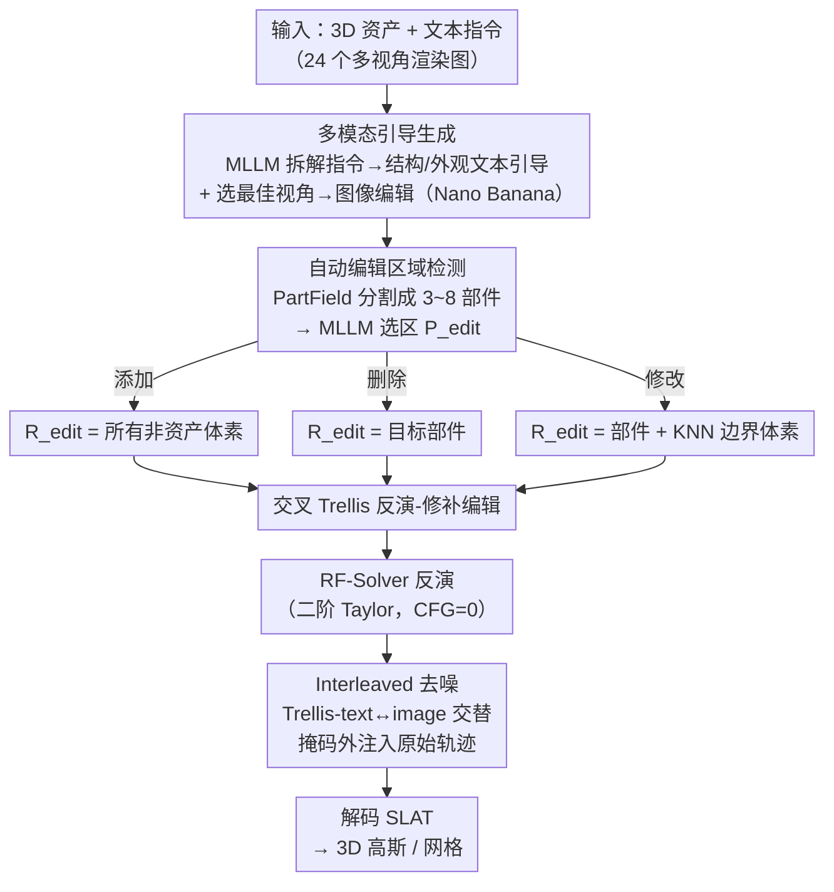

# Vinedresser3D: Agentic Text-guided 3D Editing

**会议**: CVPR 2026  
**arXiv**: [2602.19542](https://arxiv.org/abs/2602.19542)  
**领域**: 图像生成  
**关键词**: 3D编辑, 文本引导, 智能体, Trellis, 流模型反演  

## 一句话总结

提出 Vinedresser3D，一个以多模态大语言模型（MLLM）为核心的 3D 编辑智能体，无需用户提供 3D 掩码，通过自动解析编辑意图、定位编辑区域、生成多模态引导，并在原生 3D 生成模型（Trellis）的潜空间中执行基于反演的修补编辑，实现高质量文本引导的 3D 资产编辑。

## 研究背景与动机

文本引导的 3D 编辑是 3D 计算机视觉中的基础问题，广泛应用于数字内容创作、VR/AR 和机器人等领域。尽管 3D 生成已取得巨大进展，高质量 3D 编辑仍高度依赖专业艺术家和手动工具，效率低、门槛高。

现有 3D 编辑方法面临三大挑战：

**语义理解不足**：难以准确理解复杂的编辑请求

**自动定位困难**：无法仅从文本自动检测精确的 3D 编辑区域

**编辑保真度差**：难以在紧密遵循编辑指令的同时保持未编辑区域不变

现有方法主要分三类，各有缺陷：

- **SDS 类方法**（Score Distillation Sampling）：通过 2D 扩散模型梯度优化 3D 表示。计算昂贵，需逐场景优化，易产生全局非预期变化
- **"2D 编辑 + 3D 重建"流水线**：先编辑多视角图像再重建。受限于多视角不一致和遮挡导致的信息丢失
- **原生 3D 编辑**（如 VoxHammer）：在 3D 潜空间直接编辑，但仍需用户手动提供 3D 掩码，且无法理解复杂编辑请求

作者认为下一步的自然方向是：构建一个能**理解高层文本指令、自动定位编辑区域、协调多个工具**的 3D 编辑智能体。

## 方法详解

### 整体框架

Vinedresser3D 要解决的是「一句文本指令就能编辑 3D 资产，且不用人工画 3D 掩码」。它让一个 MLLM（Gemini-2.5-flash）当大脑，去协调图像编辑、3D 分割、3D 生成等一堆现成工具，整条流水线分四步：MLLM 先解析编辑意图、生成文本与图像引导，再自动定位 3D 资产中需编辑的区域，然后在 Trellis 的潜空间里执行基于反演的修补式编辑，最后把编辑后的 SLAT 解码成 3D 高斯或网格。

### 关键设计

**1. 基于 MLLM 的多模态引导生成：把模糊指令拆成结构 + 外观的可执行引导**

3D 编辑的第一道坎是看懂复杂指令。Vinedresser3D 用多步提示让 MLLM 逐层拆解：第 1 步分析多视角渲染图 + 编辑指令，生成原始资产描述、识别目标部件、分类编辑类型（添加/修改/删除）；第 2 步预测编辑后的完整描述（并约束 MLLM 尽量保留非编辑区域的描述）；第 3 步抽出新增/修改部件的独立描述；第 4 步再把描述分成结构相关（对应 Trellis Stage 1 几何）和外观相关（Stage 2 特征）两路。图像引导则让 MLLM 从 24 个多视角候选中挑出编辑目标最可见的视角，送进图像编辑模型（Nano Banana）生成参考图。

**2. 自动编辑区域检测：不用人画 3D 掩码，靠分割 + MLLM 选区**

省掉人工 3D 掩码是相对已有方法（如 VoxHammer）的核心优势。流程是先用 PartField（3D 分割模型）把资产分成 $S \in [3,8]$ 个语义部件，再把渲染图 + 分割着色图 + 目标文本喂给 MLLM 选出编辑区域 $P_{\text{edit}}$，最后按编辑类型定出真正要动的体素：

$$R_{\text{edit}} = \begin{cases} C \backslash A & \text{添加（所有非资产体素）} \\ P_{\text{edit}} & \text{删除（直接移除目标部件）} \\ P_{\text{edit}} \cup (C \backslash bbox_{\text{pres}}) \cup V & \text{修改（含 KNN 边界判定）} \end{cases}$$

其中 $V = \{v \mid v \in bbox_{\text{pres}} \backslash A, \text{PropKNN}(v) > \tau\}$。修改操作之所以要加 KNN 比例阈值判断保留包围盒内空体素的归属，是为了防止 Trellis 顺手改掉保留区域上方那层不该动的体素。

**3. 交叉 Trellis 反演-修补编辑：text 管语义、image 管细节，掩码外原样注入**

要「改得准又不动其余部分」，先得把原资产无损地反演回结构化噪声。反演阶段用 RF-Solver（二阶 Taylor 展开提升反演精度），并把 CFG 强度设为 0 稳定轨迹、最小化重建误差：

$$X_{i-1} = X_i + (t_{i-1} - t_i) v_\theta(X_i, t_i) + \frac{1}{2}(t_{i-1} - t_i)^2 v_\theta^{(1)}(X_i, t_i)$$

编辑阶段提出 Interleaved Trellis 编辑模块，交替用 Trellis-text（语义对齐、指令遵循强）和 Trellis-image（细节保真高但受单视角遮挡限制）去噪，逐步互补两者优势；每个去噪步里，编辑掩码外（未编辑区域）的潜特征都从原始反演轨迹注入，实现掩码引导的修补。掩码处理上还有几处细节：Stage 1 掩码从 $64^3$ 下采到 $16^3$ 潜空间；Stage 2 用软掩码，对保留区域边界体素按距离加权混合去噪与反演特征、消除边界浮动伪影；删除操作跳过 Stage 1、直接移除后用 Stage 2 平滑边界。

### 损失函数 / 训练策略

本方法是纯推理时方法、不涉及训练。Agent 自主探索不同的正/负提示组合、择优输出，并支持多轮迭代编辑。

## 实验关键数据

### 主实验：定量对比（57个3D资产，涵盖添加/修改/删除）

| 方法 | 需人工掩码 | CLIP-T↑ | CD↓ | PSNR↑ | SSIM↑ | LPIPS↓ | FID↓ |
|------|:------:|---------|-----|-------|-------|--------|------|
| Instant3dit | ✓ | 0.227 | 0.027 | 20.86 | 0.851 | 0.153 | 80.35 |
| VoxHammer | ✓ | 0.235 | 0.027 | 24.36 | 0.890 | 0.087 | 34.95 |
| Trellis | ✓ | 0.247 | 0.010 | 37.35 | 0.984 | 0.017 | 31.10 |
| **Ours（自动掩码）** | **✗** | **0.252** | 0.016 | 29.45 | 0.953 | 0.045 | **29.49** |
| **Ours + 人工掩码** | ✓ | **0.252** | **0.008** | **37.69** | **0.984** | **0.015** | **27.38** |

### 用户研究（人类偏好）

| 对比方法 | 文本对齐胜率 | 未编辑保持胜率 | 3D质量胜率 |
|----------|:-----------:|:-------------:|:---------:|
| vs. Trellis | 92.5% | 82.0% | 90.8% |
| vs. VoxHammer | 89.8% | 79.3% | 90.2% |

### 消融实验

| 方法 | PSNR↑ | SSIM↑ | LPIPS↓ | FID↓ |
|------|-------|-------|--------|------|
| **完整方法** | **29.45** | **0.953** | **0.045** | **29.49** |
| 去掉 Trellis-text（仅 image） | 28.06 | 0.943 | 0.054 | 30.59 |
| 去掉编辑区域掩码 | 25.65 | 0.921 | 0.068 | 33.95 |

### 关键发现

- 即使不使用人工 3D 掩码，Vinedresser3D 的 CLIP-T（文本对齐 0.252）和 FID（29.49）仍为全场最佳
- 使用人工掩码后，所有指标均达到最优，尤其 PSNR 从 29.45 提升至 37.69
- 用户研究中以 ~90% 的压倒性胜率超越所有基线
- 交叉 Trellis 设计和编辑区域检测均对最终质量有显著贡献（消融证实）
- 仅用 Trellis-image 时，遮挡区域出现扭曲或不合理输出

## 亮点与洞察

1. **智能体范式的创新**：首次将 MLLM 作为 3D 编辑的"大脑"，协调图像编辑模型、3D 分割模型和 3D 生成模型，实现端到端文本引导 3D 编辑。这种方法论层面的创新比单一模型改进更有借鉴价值
2. **2D MLLM 也能做 3D 推理**：尽管 MLLM 仅在 2D 图像-文本数据上训练，通过多视角渲染输入能隐式理解 3D 空间语义（如准确定位编辑区域、理解空间关系）
3. **自动掩码 vs 人工掩码的差距可控**：自动检测已超越使用人工掩码的基线方法，在文本对齐和整体质量上表现最优
4. **交叉去噪策略简单有效**：Trellis-text 和 Trellis-image 各有短板，交替使用互补优缺
5. **统一框架处理三种编辑**：添加、修改、删除通过不同的 $R_{\text{edit}}$ 定义在同一框架内处理

## 局限性

1. **MLLM 不接受原生 3D 输入**：依赖多视角渲染传递 3D 信息，存在信息损失
2. **外部工具不完美**：PartField 有时产生不合理的分割结果，影响编辑区域的准确性
3. **推理成本较高**：需调用 MLLM 多次、渲染多视角、运行 3D 分割、执行图像编辑，整体延迟和开销较大
4. **数据集规模有限**：仅用 57 个 3D 资产评估（24 生成 + 33 人工创建），规模偏小
5. **与 Trellis 深度耦合**：迁移到其他 3D 生成模型需重新设计反演和编辑模块
6. **单一最佳视角可能不够**：对结构复杂的对象，一个视角的图像引导可能无法覆盖所有编辑细节

## 评分

⭐⭐⭐⭐ (4/5)

将 MLLM 智能体用于 3D 编辑是一个有吸引力的方向，方法设计合理，实验结果在文本对齐和用户偏好上明显领先。自动掩码检测消除了用户手动标注的需求，显著提升了易用性。不足在于评估规模较小、与 Trellis 耦合较深、推理成本未充分讨论。

<!-- RELATED:START -->

## 相关论文

- [\[CVPR 2026\] Agentic Retoucher for Text-To-Image Generation](agentic_retoucher_for_texttoimage_generation.md)
- [\[CVPR 2026\] OctoT2I: A Self-Evolving Agentic Text-to-Image Router](octot2i_a_self-evolving_agentic_text-to-image_router.md)
- [\[CVPR 2026\] BiMotion: B-spline Motion for Text-guided Dynamic 3D Character Generation](bimotion_b-spline_motion_for_text-guided_dynamic_3d_character_generation.md)
- [\[CVPR 2025\] InterEdit: Navigating Text-Guided Multi-Human 3D Motion Editing](../../CVPR2025/image_generation/interedit_navigating_text-guided_multi-human_3d_motion_editing.md)
- [\[CVPR 2026\] Pico-Banana-400K: A Large-Scale Dataset for Text-Guided Image Editing](pico-banana-400k_a_large-scale_dataset_for_text-guided_image_editing.md)

<!-- RELATED:END -->
