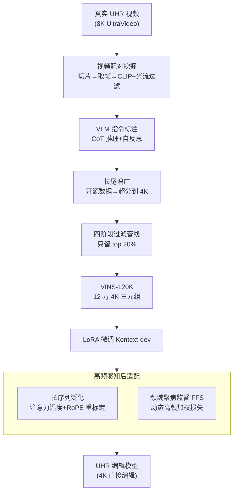

# VINS-120K: Ultra High-Resolution Image Editing with A Large-Scale Dataset

**会议**: CVPR 2026  
**论文**: [CVF Open Access](https://openaccess.thecvf.com/content/CVPR2026/html/Chen_VINS-120K_Ultra_High-Resolution_Image_Editing_with_A_Large-Scale_Dataset_CVPR_2026_paper.html)  
**代码**: 无  
**领域**: 图像编辑 / 扩散模型  
**关键词**: 超高分辨率编辑、指令编辑数据集、高频监督、长序列注意力、后适配

## 一句话总结
本文构建了首个面向 4K 超高分辨率（UHR）指令式图像编辑的大规模数据集 VINS-120K（12 万条来自真实 UHR 视频的「指令-原图-编辑图」三元组），并提出一套「高频感知后适配」策略——用分辨率感知的注意力/RoPE 重标定稳住长序列、再用频域聚焦损失补回高频细节——把只在 1K 分辨率预训练的编辑模型（FLUX.1-Kontext）扩展到 4K，pFID 相比商用 Seedream 4.0 降低 28%。

## 研究背景与动机
**领域现状**：当前指令式图像编辑模型（InstructPix2Pix、各类 DiT+MLLM/MoE 方案）在指令遵循和精确编辑上都已很强，但它们几乎全部是为「非高分辨率」（NHR，≤1024×1024）设计和训练的。

**现有痛点**：把这些模型直接喂 4096×4096 的 UHR 图，输出会退化成类似噪声的扭曲图像。业界的折中做法是「下采样→在低分辨率编辑→超分辨率上采样」（论文称之为 Kontext+SR）：下采样那一步丢掉的高频纹理，后面超分根本补不回来，结果就是模糊 + 指令遵循变弱。

**核心矛盾**：UHR 编辑的真正瓶颈有两层。其一是**数据**——没有任何公开数据集支持 1.5K 以上分辨率的编辑（见下方对比表），4K 数据的高频细节爆炸式增长使采集与清洗都极难；其二是**模型**——NHR 预训练模型既没有表达 UHR 纹理的容量，自注意力在超长 token 序列上又会失稳。

**本文目标**：(1) 造出第一份大规模、高质量的 4K 指令编辑数据集；(2) 找到一条低成本路径，把现成 NHR 编辑模型「后适配」到 UHR，而不是从头重训。

**切入角度**：作者的关键观察是——**真实世界的 UHR 视频本身就是天然的高保真编辑配对来源**。视频是对现实的连续观测，相邻帧之间天然包含细粒度的视觉变化（物体移动、光照变化、视角平移），且分辨率不受任何 image-to-image pipeline 的上限限制。

**核心 idea**：「从视频里挖配对 + 多阶段过滤造数据集」+「分辨率感知重标定 + 频域聚焦监督做后适配」，用最小代价让 NHR 模型胜任 UHR 编辑。

## 方法详解

### 整体框架
本文是「数据集 + 适配方法」双贡献。前半部分是 **VINS-120K 数据构建流水线**：从真实 UHR 视频切片取帧、组成候选配对，用 CLIP 相似度和光流分数滤掉「几乎相同」或「运动过大无语义对应」的对，再用 Gemini-2.5-Pro 做结构化推理生成编辑指令；长尾编辑类型（文字/风格/属性）视频里少见，就从开源数据集补充并超分到 4K；最后过一套四阶段过滤管线（文件检查→图像质量→指令遵循→美学评估），只留下质量最高的 20%。后半部分是 **高频感知后适配**：以 FLUX.1-Kontext-dev 为底座、LoRA 微调，针对 UHR 带来的两大障碍——长序列退化、高频细节丢失——分别做注意力/RoPE 重标定和频域聚焦损失。

### 关键设计

**1. 从真实 UHR 视频挖掘高保真编辑配对：绕开 image-to-image pipeline 的分辨率天花板**

以往编辑数据集用固定的 image-to-image pipeline 造配对，结果质量被管线里分辨率最低的那个模型（如 FLUX）卡死，根本到不了 4K。本文换思路：把真实 UHR 视频当作配对来源。具体三步——先用 PySceneDetect 把视频切成内容一致的片段，再从每段抽帧组成候选图像对，最后用 CLIP Score 衡量语义相似度、用光流估计衡量运动幅度，把「几乎相同」（CLIP 太高、无变化）和「运动过大却无语义对应」（光流太高，如文中例子光流 173.1）的对都剔掉。这样保留下来的配对既有真实的视觉变化、又保住了视频原生的细粒度纹理，从源头上突破了 4K 的数据天花板。

**2. 结构化 CoT + 自反思的 VLM 指令标注：把无约束的视频转换翻译成精确编辑指令**

视频里的帧间变化是高度无约束的（什么都可能在变），直接让 VLM 描述会得到含糊或错误的指令。作者用 Gemini-2.5-Pro 做标注，但强制它走一条结构化的思维链：先对图像对做全面视觉分析 → 再系统推理「发生了什么变换」→ 最后才输出精确的编辑指令；同时定义了一个具体的动作空间（颜色/色调、相机或主体运动、物体修改等），引导模型从全局结构走到局部细节。最后再加一道自反思机制，对生成结果做视觉一致性复核并修正，降低误判。最终覆盖 13 种编辑类型、归为局部编辑/全局编辑/相机运动/个性化生成四大类。

**3. 四阶段质量过滤 + 长尾增广：只留 top 20%，并补齐视频里稀缺的编辑类型**

视频里某些编辑类型（文字修改、风格转换、属性编辑）天然稀缺，分布不均会损害泛化。作者一边从 X2Edit、Nano-Consistent 等开源数据补长尾样本（先过同一套过滤、再超分到 4K，避免学到超分伪影），一边对全部三元组跑一条四阶段过滤管线：① 初步检查（去损坏文件、MD5 去重、剔除异常宽高比）；② 图像质量（用 Tenengrad 梯度测清晰度、亮度测曝光、HSV 饱和度测色彩真实性、GLCM 测纹理丰富度）；③ 指令遵循过滤；④ 美学评估（LAION Aesthetic + Artimuse 双模型）。整条管线只保留最高质量的 20%，最终 VINS-120K 平均分辨率达 4656×4138，ImageJudge 质量分 4.45 居所有数据集之首。其中指令遵循过滤用了一个**级联方案**：先用 VLM 解析出编辑涉及的源/目标物体，再用检测分割工具定位生成掩码，把图像对拆成「编辑区」和「非编辑区」——在编辑区算 CLIP 相似度衡量指令遵循度，在非编辑区算 L2 距离衡量内容保持，两者联合判定，避免单纯依赖不可靠的 VLM 打分。

**4. 长序列泛化：分辨率感知的注意力温度 + RoPE 重标定，稳住 UHR 的超长 token**

UHR 编辑最直接的冲击是 token 序列暴增，同时压垮注意力和 RoPE。其一是**熵漂移**：序列越长，注意力分布越平滑、判别性响应越弱。作者引入一个分辨率感知的温度 $\tau>1$ 对注意力分数重标定：

$$w'_{m,n}=\frac{\exp\!\big(\tau\cdot q_m^T k_n/\sqrt{d}\big)}{\sum_{j=1}^{N}\exp\!\big(\tau\cdot q_m^T k_j/\sqrt{d}\big)},\quad \tau=\log\sqrt{N_{\text{UHR}}/N_{\text{NHR}}}$$

其中 $N_{\text{UHR}}$、$N_{\text{NHR}}$ 分别是 UHR 与原生分辨率的序列长度，温度随序列变长而增大，把被拉平的注意力重新「锐化」回去（⚠️ $\tau$ 的具体取值表达式以原文为准）。其二是 **RoPE 外推**：序列变长会让 RoPE 产生训练时没见过的旋转角，模型无法外推。作者借鉴 NTK-aware scaled RoPE，把旋转基 $b$ 重标定为 $b'=b\cdot\sqrt{N_{\text{UHR}}/N_{\text{NHR}}}$，相当于把更长序列的旋转角「压缩」回原生范围，保住位置可判别性。消融显示去掉 RoPE 重标定会出现语义漂移或严重的局部重复。

**5. 频域聚焦监督（FFS）：在频谱上动态加权高频，补回标准扩散损失忽略的细节**

标准扩散/flow-matching 损失把高频和低频一视同仁，而高频纹理恰恰是 UHR 真实感的来源。FFS 是一个加在主损失之上的辅助项：对预测编辑图 $\hat y$ 和真值 $y$ 做正交 2D 离散傅里叶变换，算频谱差 $\Delta F=|\text{DFT}(\hat y)-\text{DFT}(y)|$，再用一个动态频率加权函数放大高频：

$$W(\Delta F,\alpha_t)=\frac{(\Delta F+\varepsilon)^{\alpha_t}}{\max(\Delta F+\varepsilon)^{\alpha_t}},\quad \alpha_t=\alpha_{\min}+(\alpha_{\max}-\alpha_{\min})(1-t)^{\gamma}$$

关键在于聚焦强度 $\alpha_t$ 随噪声水平动态变化——去噪越接近干净图（$t$ 越小），$\alpha_t$ 越大、对高频的强调越强，正好对应「细节在后期去噪才浮现」的特性。频域损失为 $L_{\text{freq}}=\frac{1}{UV}\sum_{u,v}W(\Delta F_{uv},\alpha_t)\cdot\Delta F_{uv}$，总目标 $L=L_{\text{FM}}+\lambda L_{\text{freq}}$。

### 损失函数 / 训练策略
底座为 FLUX.1-Kontext-dev，用 rank 32 的 LoRA 微调，全部训练图按 4096×4096 处理，AdamW，学习率 $5\times10^{-6}$。flow-matching 主损失为 $L_{\text{FM}}=\|\nu(z_t,c,t)-(\epsilon-y)\|_2^2$（rectified flow 形式，$z_t=(1-t)x+t\epsilon$）。频域损失超参 $\gamma=2$、$\alpha_{\min}=0.2$、$\alpha_{\max}=1.2$、$\lambda=1$。

## 实验关键数据

### 数据集对比（VINS-120K vs 现有编辑数据集）

| 数据集 | 规模 | 类型数 | 宽×高 | ImageJudge-Avg |
|--------|------|--------|-------|----------------|
| OmniEdit | 5.2M | 7 | 1374×982 | 4.19 |
| ImgEdit | 1.2M | 13 | 1800×1200 | 4.35 |
| X2Edit | 3.7M | 14 | 1096×1088 | 3.98 |
| **VINS-120K** | 120K | 13 | **4656×4138** | **4.45** |

规模虽小，但分辨率和质量都是第一档：是唯一突破 4K 的编辑数据集，质量分也最高。

### 主实验（VINS-4KEval，509 个 4K 测试样本）

| 方法 | ImageJudge↑ | VIEScore↑ | pFID↓ |
|------|-------------|-----------|-------|
| Seedream 4.0（商用，原生 4K） | 4.70 | 8.03 | 12.82 |
| Kontext-dev | 4.41 | 7.43 | 12.66 |
| **Kontext-dev + 后适配（本文）** | **4.47** | 7.44 | **9.15** |
| AnyEdit | 3.57 | 5.71 | 18.44 |
| Omnigen2 | 4.34 | 7.29 | 18.73 |

后适配在保住甚至略提编辑能力的同时，把 pFID 从 12.66 降到 9.15；相比商用 Seedream 4.0（pFID 12.82）降低约 28%，在纹理保真度上显著领先（编辑能力略逊，作者归因于训练数据规模差距）。

### 消融与泛化（VINS-4KEval）

| 配置 | ImageJudge↑ | VIEScore↑ | pFID↓ | 说明 |
|------|-------------|-----------|-------|------|
| Kontext + 后适配 | 4.47 | 7.44 | 9.15 | 完整模型 |
| w/o 后适配 | 3.98 | 5.15 | 15.01 | 朴素微调，编辑与保真双崩 |
| w/o 数据精选 | 4.33 | 7.29 | 13.17 | 同规模无精选 UHR 数据 |
| 仅真实视频帧 | 4.39 | 7.30 | 8.96 | pFID 最优但任务覆盖窄 |
| Qwen + SR | 4.67 | 7.93 | 18.33 | 换底座 + 超分两阶段 |
| Qwen + 后适配 | 4.69 | 7.97 | 11.38 | 后适配迁移到 Qwen 底座 |

### 关键发现
- **后适配是必需的**：朴素微调（w/o 后适配）让 ImageJudge 从 4.47 掉到 3.98、pFID 从 9.15 涨到 15.01，证明直接 UHR 微调不可行——必须靠注意力/RoPE 重标定稳住长序列。
- **细节是注意力锐化 + RoPE 重标定共同保住的**：注意力分数重标定让注意力图在目标编辑区呈现更判别性的响应；去掉 RoPE 重标定则出现语义漂移和严重局部重复。
- **质量来自「精选 + 真实视频」的平衡而非堆规模**：仅真实视频帧 pFID 最低（8.96）但任务覆盖窄；混合精选数据牺牲一点 pFID（9.15）换来更好的编辑能力（4.47/7.44 vs 4.39/7.30），是更优的权衡。
- **方法不绑底座**：不调超参直接迁移到 QwenImage-Edit，pFID 从 18.33（Qwen+SR）降到 11.38，说明后适配是通用策略。

## 亮点与洞察
- **「视频即天然编辑配对」这个数据视角很巧**：它一举绕开了「合成 pipeline 分辨率被卡死」的死结——视频原生就是高分辨率、帧间变化又真实，比任何 image-to-image 生成的配对都更保真。
- **频域聚焦损失把「细节晚出现」写进了权重调度**：$\alpha_t$ 随去噪推进而增大，恰好契合扩散后期才合成高频的物理直觉，是个可迁移到任何「需要保高频」的扩散任务的 trick。
- **后适配而非重训**：用 rank-32 LoRA + 两个轻量改动就把 1K 模型推到 4K，工程成本极低，对算力有限的团队很友好。
- **指令遵循的级联过滤思路可复用**：先 VLM 解析物体 → 检测分割出掩码 → 编辑区算 CLIP / 非编辑区算 L2，把「指令是否被执行」和「无关区域是否被破坏」解耦量化，比单一 VLM 打分更可靠。

## 局限与展望
- **编辑能力仍逊于商用 Seedream 4.0**（ImageJudge 4.47 vs 4.70），作者归因于训练数据规模，UHR 数据进一步 scale-up 是显而易见的方向。
- **依赖多个外部大模型**：标注靠 Gemini-2.5-Pro、美学评估靠 LAION+Artimuse、长尾增广靠超分模型，整条数据管线的质量上限受这些组件牵制，且复现门槛高。
- **后适配上限受底座束缚**：本质是 LoRA 适配，底座（Kontext/Qwen）本身没见过的 UHR 纹理分布仍可能补不全；从头预训练 UHR 编辑模型是否更优尚未验证。
- **温度/RoPE 重标定的缩放因子是启发式推导**（$\sqrt{N_{\text{UHR}}/N_{\text{NHR}}}$），不同分辨率/底座下是否最优缺乏系统扫描。

## 相关工作与启发
- **vs Kontext+SR（下采样-编辑-超分）**：两者都想做 UHR 编辑，但 SR 路线在下采样时永久丢掉高频、超分补不回来，导致模糊+指令遵循变弱；本文直接在 4K 空间编辑，纹理真实感显著更好（pFID 9.15 vs 12.66）。
- **vs UltraEdit / OmniEdit / ImgEdit 等编辑数据集**：它们靠 scale 和多样性取胜但分辨率封顶在 ~1.5K；VINS-120K 是首个突破 4K 的编辑数据集，走「小而精 + 真实视频源」路线。
- **vs Seedream 4.0（商用原生 4K）**：本文是开源可复现方案，纹理保真度（pFID）反超商用模型，但编辑能力受限于数据规模仍有差距，定位是「低成本把开源 NHR 模型推上 UHR」。

## 评分
- 新颖性: ⭐⭐⭐⭐ 「视频挖配对造 4K 数据集」+「分辨率感知重标定 + 频域监督」组合实用且切题，单项创新偏工程整合
- 实验充分度: ⭐⭐⭐⭐ 主表 + 多维消融 + 跨底座泛化齐备，但部分细节消融下放到补充材料
- 写作质量: ⭐⭐⭐⭐ 数据管线与适配方法都讲得清楚，公式完整，图表支撑充分
- 价值: ⭐⭐⭐⭐⭐ 填补了 UHR 指令编辑的数据空白，数据集 + benchmark + 低成本适配方法对社区都有直接价值

<!-- RELATED:START -->

## 相关论文

- [\[CVPR 2026\] Pico-Banana-400K: A Large-Scale Dataset for Text-Guided Image Editing](pico-banana-400k_a_large-scale_dataset_for_text-guided_image_editing.md)
- [\[CVPR 2026\] Low-Resolution Editing is All You Need for High-Resolution Editing](low-resolution_editing_is_all_you_need_for_high-resolution_editing.md)
- [\[CVPR 2026\] PixelRush: Ultra-Fast, Training-Free High-Resolution Image Generation via One-step Diffusion](pixelrush_ultrafast_trainingfree_highresolution_im.md)
- [\[CVPR 2026\] HierEdit: Region-Aware Hierarchical Diffusion for Efficient High-Resolution Editing](hieredit_region-aware_hierarchical_diffusion_for_efficient_high-resolution_editi.md)
- [\[NeurIPS 2025\] UltraHR-100K: Enhancing UHR Image Synthesis with A Large-Scale High-Quality Dataset](../../NeurIPS2025/image_generation/ultrahr-100k_enhancing_uhr_image_synthesis_with_a_large-scale_high-quality_datas.md)

<!-- RELATED:END -->
