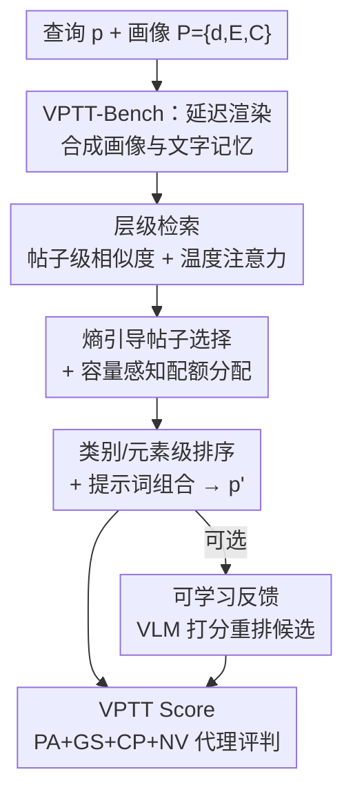

# Visual Personalization Turing Test

**会议**: CVPR 2026  
**论文**: [CVF Open Access](https://openaccess.thecvf.com/content/CVPR2026/html/Abdal_Visual_Personalization_Turing_Test_CVPR_2026_paper.html)  
**代码**: https://snap-research.github.io/vptt (项目页)  
**领域**: 扩散模型 / 个性化生成 / 评测基准  
**关键词**: 视觉个性化、图灵测试、检索增强生成、隐私安全基准、感知代理指标

## 一句话总结
本文把"视觉个性化"从"复刻身份"重新定义为"图灵测试式的不可区分"——一个模型生成的图像/视频/3D 内容如果让人类或校准过的 VLM 裁判误以为是某个特定用户本人会创作或分享的，就算通过 VPTT；并配套给出 1 万人画像的隐私安全基准 VPTT-Bench、免训练的检索增强生成引擎 VPRAG，以及与人类判断高度相关（Spearman ρ≈0.68）的纯文本代理指标 VPTT Score。

## 研究背景与动机
**领域现状**：现有的视觉生成个性化（DreamBooth、LoRA、IP-Adapter 等）几乎都聚焦于"身份复刻"——给几张某人/某物的参考图，优化模型让它在不同场景里都能重现这个主体的外观。

**现有痛点**：这类方法一方面计算昂贵（per-user 微调要分钟到小时级），另一方面只抓住了"长什么样"，却漏掉了个性化更宽的内涵——一个人**如何感知、如何审美、如何风格化并分享自己的世界**。换句话说，它们能复制一张脸，却复制不了一个人的"视觉语言"。

**核心矛盾**：要研究"内容是否真的像某个人会做的"，需要成千上万个文化/风格各异的真实用户画像及其创作历史；但真实用户数据因隐私问题根本拿不到，这从根上卡死了学术界的研究。此外也缺一个能在大规模下衡量"这像不像某人"的评测协议。

**本文目标**：把问题拆成三个子问题——(1) 怎么造出隐私安全、可扩展的画像数据；(2) 怎么免训练地从用户历史里解读其多面风格并迁移到新生成；(3) 怎么大规模、低成本地评测"个性化是否成功"。

**切入角度**：作者借用图灵测试的思路——不去问"复刻得像不像"，而是问"人类/VLM 裁判能不能把模型生成的内容和这个人真会分享的内容区分开"。这把目标从死记外观，升级成模拟一个人的视角。

**核心 idea**：用"感知不可区分"取代"身份复刻"来定义个性化成功，并用一套 simulation → generation → judgment → optimization 的闭环框架（基准 + 免训练 RAG + 代理指标）把它在万人规模上落地。

## 方法详解

### 整体框架
VPTT Framework 是一个把"模拟—生成—评判—优化"串成闭环的统一系统，由四个互相咬合的部件组成：一个万人级模拟画像基准（VPTT-Bench）、一个检索增强生成引擎（VPRAG）、一个可选的可学习反馈回路，以及一个可微的代理指标（VPTT Score）。

形式上，每个画像被定义为 $P=\{d, E, C\}$：人口统计学信息 $d$、结构化元素库 $E$、以及描述其历史创作的文字记忆 $C$。给定查询 $p$，系统要产出一个个性化提示词 $p'$，使其生成图 $G(p')$ 在感知上最贴合这个人。这一目标被写成一个把三种诉求加权折中的代理目标：

$$J(p';P)=\lambda_1\,\text{Align}(p',P)+\lambda_2\,\text{Fidelity}(p',C)+\lambda_3\,\text{Novelty}(p',C),\quad \sum_i\lambda_i=1.$$

理想系统要同时做到高对齐、高保真、高新颖，而这三者对当前模型是一个无法兼得的 trade-off——本文不奢求最优解，而是提出一个免重训、能高效逼近该目标的方法。下图是 VPRAG 引擎（框架的生成核心）的多阶段流向：

### 关键设计

**1. VPTT 任务形式化：把个性化重定义为"感知不可区分"**

针对"身份复刻漏掉了个人视觉语言"这个根本痛点，本文不再用像素/外观相似度作为目标，而是定义：当模型输出（图像/视频/3D 资产）让人类或校准 VLM 裁判无法把它和"这个人本来可能创作或分享的内容"区分开时，模型即通过 VPTT。配套的代理目标式 (1) 把成功分解成三个互相拉扯的量——**对齐**（$p'$ 是否符合画像整体语境）、**保真**（是否落在用户资产构成的语义子空间内）、**新颖**（是否避免逐字照搬历史）。正是因为它显式承认这三者是个 trade-off，后续才能用一个统一指标去衡量"谁取得了最好的平衡"，而不是片面追求某一项。

**2. VPTT-Bench：用"延迟渲染"造出 1 万隐私安全合成画像**

针对"真实用户数据拿不到"的数据壁垒，本文用 Qwen2.5-72B-Instruct 生成 1 万个合成画像，每个表示为三元组 $P_i=\{d_i, E_i, C_i\}$，并借鉴图形学里 G-buffer 的思路把每个人的视觉世界**完全用文本表达为"延迟渲染"**——即光照、材质、环境、动作、前/背景、外观等结构化、富属性的中间表示，把真正的像素生成"推迟"。流水线分四步：从 PersonaHub 的公开文字种子采样多元文化背景 $d_i$；基于 $d_i$ 采样并聚类原子视觉词（穿着、光照、姿态等）成结构化词表 $E_i$；在 $\{d_i, E_i\}$ 条件下先生成场景再产出 30 条富元素描述 $C_i$（用 text-embedding-3-small 嵌入）；并把其中 1000 个画像真正渲染成图库（每人 30 张）。这套"纯文本为主 + 配对图像为辅"的语料既能在无隐私约束下做密集监督，又能跨不同算力预算（纯文本到多模态）做受控研究——这是它比直接收集真实用户数据更可扩展、可复现的关键。

**3. VPRAG：白盒、可控、免训练的层级检索增强生成**

针对"免训练地解读并迁移用户多面风格"的需求，VPRAG 在推理时只加几百毫秒开销（对比 per-user 微调要分钟到小时），把生成 condition 在画像的结构化记忆上。它做**两级层级检索**：帖子级捕捉整体语义意图、元素级捕捉原子风格。帖子级先算查询与每条记忆 caption 的余弦相似度 $s_i=q^\top v_i$，再用温度 softmax 归一化成权重 $w_i=\frac{\exp(s_i/\tau)}{\sum_j\exp(s_j/\tau)}$——这是温度约束下"期望语义对齐"的最大熵解，既平滑又避免脆弱的硬截断。接着用熵 $H=-\sum_i w_i\log w_i$、$n_{\text{eff}}=\exp(H)$ 度量查询的"有效相关帖子数"：宽泛 prompt（如"in the park"）熵高、鼓励多样检索，狭窄 prompt（如"in Kashmiri traditional dress"）熵低、聚焦选择，并按 $K=\min(\lfloor n_{\text{eff}}\rfloor, 2Q)$ 截断防止过检索。然后做**容量感知的配额分配**，给类别 $c'$ 的每个帖子分配 $q_i^{(c')}=\big\lfloor \frac{w_i\cdot n_i^{(c')}}{\sum_j w_j\cdot n_j^{(c')}}\cdot Q_{c'}\big\rfloor$，余数给最大小数部分的帖子——保证高权重帖子多采样、低权重帖子仍贡献多样性（比例公平）。元素级再用轻量 MiniLM 编码器按 prompt 对类别和元素排序、取 top-$q_i^{(k)}$，最后把选中元素 $E_p$ 与画像摘要 $S_p$ 在长度预算 $L$ 下组合成 $p'$。整条流水线是**白盒、LLM 可选**的，相比 BRAG 那种把原始历史一股脑丢给黑盒 LLM 的做法，它在每一步都可控、可解释，因而能做细粒度控制而不至于"照抄 caption"。

**4. VPTT Score：与人类高相关的可微纯文本代理指标**

针对"大规模评测又贵又难"的痛点，本文设计了一个**纯文本、可微、便宜**的代理指标，作为式 (1) 个性化目标的凸替代，由四个可解释分量组成：**Persona Alignment (PA)** 测 $p'$ 与画像描述的语义余弦相似 $\text{PA}=\cos(\text{Emb}(p'),\text{Emb}(P))$；**GS Reconstruction (GS)** 把画像的 caption 嵌入做 Gram–Schmidt 正交化成基 $B$，用 $\text{GS}=\cos(v_p, B(B^\top v_p))$ 衡量生成是否落在用户资产张成的语义子空间里（子空间保真，而非简单两两相似）；**Cluster Proximity (CP)** 在 GS 基里对资产 caption 聚类得主题质心 $\{c_k\}$，用 $\text{CP}=\exp(-\min_k\|v'_p-c_k\|^2)$ 测主题一致性（评测用硬 min，可微版用温度 softmin）；**Novelty (NV)** 用三元组重叠 $\text{NV}=1-\max_i\frac{|\text{Tri}(p')\cap\text{Tri}(c_i)|}{|\text{Tri}(p')|}$ 惩罚逐字照搬。综合分为凸加权 $\text{VPTTscore}=0.20\,\text{PA}+0.30\,\text{GS}+0.30\,\text{CP}+0.20\,\text{NV}$（GS、CP 与人类视觉保真最相关故权重最高）。在"三短语预算"等受限场景下 NV 意义变弱，改用 $\text{VPTTscore-c}=\frac13(\text{PA}+\text{GS}+\text{CP})$。可微变体让该指标还能当未来个性化流水线的可学习目标用。

### 损失函数 / 训练策略
框架主体免训练。唯一可学习的是**可选反馈回路**：给定画像 $P$ 与生成提示 $p'$，VLM 裁判输出对齐分 $s_{\text{VLM}}\in[0,1]$；训练一个交叉注意力预测器 $f_\theta$ 估计 $\hat s_{\text{VLM}}=f_\theta(\text{Emb}(p'),\text{Emb}(P))$，并据此对候选重排 $p'^*=\arg\max_m f_\theta(\text{Emb}(p'_m),\text{Emb}(P))$。这只是一个小规模概念验证，用来鼓励未来把 VPTT 推向闭环个性化。

## 实验关键数据

实验围绕三个递进问题展开：Q1 指标可信吗？Q2 更好的 prompt 能否产出更好的图？Q3 架构在大规模下稳健吗？覆盖从开源 Qwen2.5-7B 到 GPT-4o-mini 再到 Gemini-2.5-Pro 的多种算力，同时含生成与编辑两类任务。

### 主实验
Q1 用约 6000 条人类标注（4 方法 × 3 类 LLM 生成 × 2 任务，20 名标注者）对齐三层评判。文本级 VPTTscore-c、视觉级 VLM、感知级 Human 三者上，本文 VPRAG 全面领先：

| 方法 | VPTTscore-c (Text) Avg./Acc. | VLM (0-5) Avg./Acc. | Human (0-5) Avg./Acc. |
|------|------|------|------|
| Baseline（无任何资产） | 0.329 / 0.0% | 2.41 / 4.6% | 1.64 / 0.7% |
| Persona Only（仅人口统计） | 0.400 / 7.3% | 3.32 / 19.2% | 2.51 / 16.0% |
| BRAG（可访问全部 caption） | 0.420 / 19.3% | 3.52 / 21.6% | 2.69 / 21.3% |
| **VPRAG (Ours)** | **0.464 / 73.3%** | **4.32 / 54.6%** | **3.34 / 62.0%** |

标注者一致性较高（生成 Kendall's W=0.651±0.141，编辑 0.564±0.209）。指标校准上，VPTTscore-c 与人类的 Spearman ρ 综合 0.68、生成任务 0.78，Top-2 一致准确率 99%；VLM 与人类综合 ρ=0.67、生成 0.75；编辑任务相关性偏低（ρ≈0.5，因局部编辑粒度更细且下采样有感知损失）。这印证了纯文本 VPTTscore-c 是可靠的人类感知代理。

### 大规模与消融分析

Q3 在全量 1 万画像 × 4 任务、共 12 万次 prompt 评测上（prompt 限 150 词、预算 3、τ=0.1），报告新颖度调整后的 VPTTscore（V）与相对每行最优方法的 Cohen's d 效应量：

| 模型 | Baseline V/d | Persona Only V/d | BRAG V/d | VPRAG V/d | Comb. V/d |
|------|------|------|------|------|------|
| Qwen（生成） | 0.316 / 11.9 | 0.389 / 8.3 | 0.581 / 1.1 | **0.631 / —** | 0.602 / 0.7 |
| 4o-mini（生成） | 0.316 / 12.6 | 0.402 / 8.4 | 0.628 / 0.5 | 0.640 / 0.1 | **0.644 / —** |
| Gemini（生成） | 0.316 / 9.8 | 0.379 / 7.1 | 0.616 / 0.3 | 0.625 / 0.2 | **0.632 / —** |
| Qwen（编辑） | 0.306 / 12.0 | 0.378 / 8.7 | 0.583 / 1.1 | **0.626 / —** | 0.586 / 1.0 |
| 4o-mini（编辑） | 0.306 / 12.0 | 0.384 / 8.8 | 0.596 / 0.9 | **0.626 / —** | 0.610 / 0.5 |
| Gemini（编辑） | 0.306 / 10.7 | 0.372 / 8.1 | 0.583 / 0.6 | 0.605 / 0.0 | **0.606 / —** |

### 关键发现
- **BRAG 的失败模式是"过拟合 caption"**：它能拿到全部历史 caption，却倾向逐字照搬，对齐分高但新颖度低，综合分因此落后——这正是 NV 项要惩罚的，也说明"白盒可控检索"相比"黑盒 LLM 吞原始历史"的价值。
- **VPRAG 取得最佳"对齐—新颖"折中**：在所有 LLM backbone 上综合 VPTTscore 最优，且随规模线性扩展、跨模型泛化、免重训仍保持感知真实性。
- **VPRAG 与 Comb. 各有所长**：Comb.（BRAG+VPRAG）在 4o-mini/Gemini 上略好，VPRAG 在 Qwen 上更强；Cohen's d 显示 persona 类方法与 baseline 间差距属中到大效应（d≥0.5）。⚠️ Q2 在 200 画像、三短语预算下 V-c 相关性 ρ=0.53（生成 0.66），细节以原文为准。
- **反馈模拟可行性**：在 200 画像/1 万标注上，一个 128 维、4 头的紧凑交叉注意力回归器达到 73.8% 总体准确率（MAE 0.1259）、对齐偏好预测 91.6%，验证—测试差仅 0.7%，说明小模型也能学到画像感知偏好并泛化到新用户。

## 亮点与洞察
- **重定义任务的视角很"狠"**：把个性化从"复刻外观"升级成"图灵测试式不可区分"，一句话点破了现有方法的天花板——能复制脸，复制不了"一个人的视觉语言"。这种把评测目标本身重做的工作，往往比刷点更有长期价值。
- **"延迟渲染"是绕过隐私墙的巧解**：用文本结构化中间表示（类比 G-buffer）代替真实用户图像，既隐私安全又可扩展到万人级，还能在纯文本/多模态间灵活切换算力——这个数据构造思路可迁移到任何"想研究真人行为却拿不到真人数据"的场景。
- **熵引导检索很优雅**：用 $n_{\text{eff}}=\exp(H)$ 让宽泛 query 自动多检、狭窄 query 自动聚焦，把"该取几条历史"变成由查询特异性自适应决定，而非拍一个固定 top-k。
- **纯文本代理指标省钱又靠谱**：VPTTscore-c 不渲染图就能与人类感知 ρ≈0.7+ 对齐，让 12 万次大规模评测成为可能；GS 用子空间重构而非两两相似来测"是否落在用户语义流形内"的设计尤其值得借鉴。

## 局限与展望
- **作者承认**：可学习反馈只是小规模概念验证，未进入主评测；闭环优化留待未来。
- **合成画像的真实性边界**：VPTT-Bench 基于 PersonaHub 文字种子 + LLM 生成，"合成的人"是否真能代表"真实用户的视觉语言"存在 gap；30 张资产/人的规模也有限。
- **编辑任务评测偏弱**：编辑相关性 ρ≈0.5 明显低于生成，局部编辑的细粒度一致性仍难被纯文本/VLM 可靠捕捉。
- **横向可比性的 caveat**：⚠️ 不同表（6000 标注 / 200 画像 / 1 万画像）的预算、任务、模型集合不同，V 与 V-c 的绝对数值不可直接跨表比大小；本文 V 是新颖度调整后的版本，与 Table 1 的 V-c 口径不同。
- **改进思路**：把可微的 VPTTscore 真正接成 VPRAG/扩散模型的可学习目标做端到端优化；把"延迟渲染"扩展到视频/3D 资产以兑现"图像/视频/3D 不可区分"的完整承诺。

## 相关工作与启发
- **vs DreamBooth / LoRA / InstantBooth**: 他们做 per-subject 身份复刻、需微调且只管外观保真；本文做的是免训练、隐式从用户历史提取偏好/文化/视觉熟悉度，目标是整体视觉语境对齐而非复刻某个主体。
- **vs ViPer / PPD / POET / Instant Preference Alignment**: 这些个性化偏好方法依赖显式反馈、成对比较或单张参考图；本文从用户历史创作（VPTT-Bench 模拟、源自真实 PersonaHub）**隐式**提取并应用对齐，并把 VPTT 作为超越简单偏好分的整体视觉语境一致性度量。
- **vs Tailored Visions / RealRAG / RAPO（视觉 RAG）**: 他们多在原始 prompt 历史上用黑盒 LLM 改写或检索外部真实图像；VPRAG 的区别在于 (1) 跑在结构化合成的 VPTT-Bench 上实现隐私安全研究，(2) 用有原则、更透明的检索与组合架构做细粒度控制，而非纯黑盒。

## 评分
- 新颖性: ⭐⭐⭐⭐⭐ 把个性化重定义为图灵测试、配套基准+引擎+指标三件套，是范式级而非刷点级贡献
- 实验充分度: ⭐⭐⭐⭐ 跨 3 类 LLM、生成/编辑双任务、12 万次评测 + 6000 人类标注，但编辑评测偏弱、反馈回路仅概念验证
- 写作质量: ⭐⭐⭐⭐ 动机清晰、公式完整；多张表口径不一需读者自行甄别
- 价值: ⭐⭐⭐⭐⭐ 隐私安全的延迟渲染数据构造 + 纯文本感知代理指标，对个性化生成的可扩展评测有长期借鉴意义

<!-- RELATED:START -->

## 相关论文

- [\[CVPR 2026\] Omni-Attribute: Open-vocabulary Attribute Encoder for Visual Concept Personalization](omni-attribute_open-vocabulary_attribute_encoder_for_visual_concept_personalizat.md)
- [\[CVPR 2026\] A Training-Free Style-Personalization via SVD-Based Feature Decomposition](a_training-free_style-personalization_via_svd-based_feature_decomposition.md)
- [\[CVPR 2026\] From Scale to Speed: Adaptive Test-Time Scaling for Image Editing](from_scale_to_speed_adaptive_test-time_scaling_for_image_editing.md)
- [\[CVPR 2026\] Progress by Pieces: Test-Time Scaling for Autoregressive Image Generation](progress_by_pieces_test-time_scaling_for_autoregressive_image_generation.md)
- [\[CVPR 2026\] InstructMix2Mix: Consistent Sparse-View Editing Through Multi-View Model Personalization](instructmix2mix_consistent_sparse-view_editing_through_multi-view_model_personal.md)

<!-- RELATED:END -->
