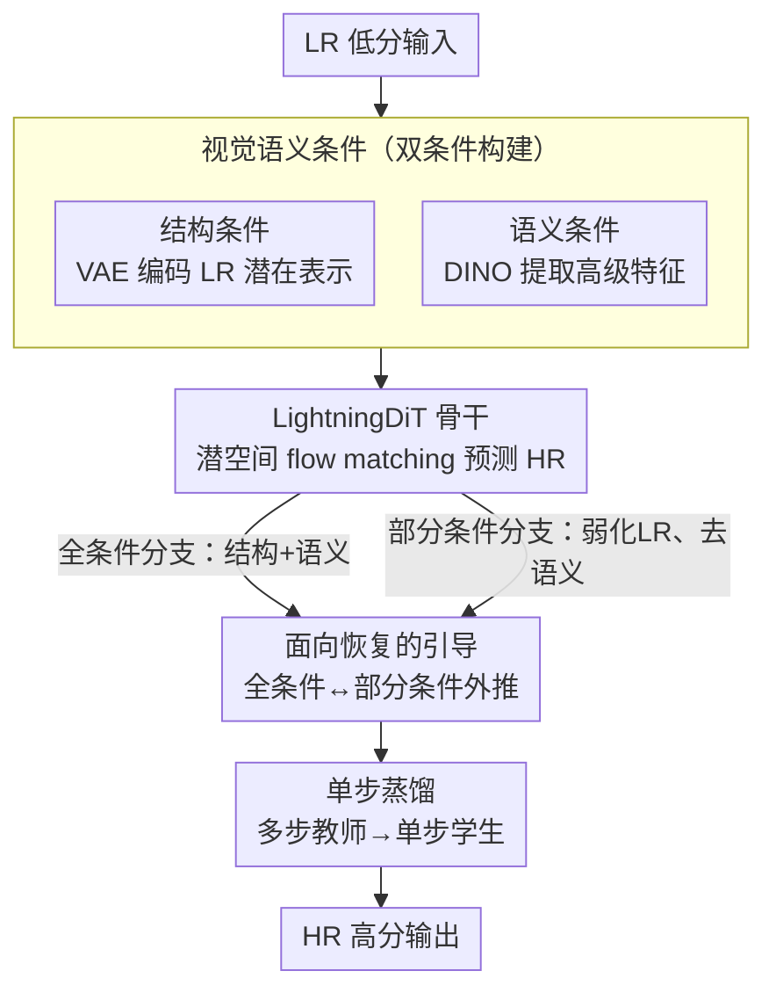

# VOSR: A Vision-Only Generative Model for Image Super-Resolution

**会议**: CVPR 2026  
**arXiv**: [2604.03225](https://arxiv.org/abs/2604.03225)  
**代码**: [https://github.com/cswry/VOSR](https://github.com/cswry/VOSR)  
**领域**: 图像生成  
**关键词**: super-resolution, vision-only, diffusion model, classifier-free guidance, one-step distillation

## 一句话总结

提出 VOSR，首个证明纯视觉训练的生成式超分模型可以媲美甚至超越基于 T2I 预训练方法的工作，通过视觉语义条件和面向恢复的引导策略实现高质量 SR，训练成本仅为 T2I 方法的 1/10。

## 研究背景与动机

当前生成式图像超分领域被基于 Text-to-Image (T2I) 扩散模型（如 Stable Diffusion）的方法主导，它们通过适配预训练 T2I 生成器来进行超分恢复。然而作者指出这种范式存在根本性矛盾：SR 是一个以低分辨率输入为条件的图像恢复任务，而 T2I 方法从通用生成器出发，通过文本或文本对齐表示引入语义，增加了细节幻觉（hallucination）的风险。

核心问题：一个纯视觉训练的生成式模型，不依赖多模态预训练，能否匹敌 T2I-based SR 方法？

作者通过 VOSR 给出了肯定回答。VOSR 需要的训练成本仅约为代表性 T2I-based SR 方法的 1/10，却在感知质量和保真度上达到有竞争力甚至更优的结果。

## 方法详解

### 整体框架

VOSR 要质疑的是「生成式超分必须站在 T2I 预训练的肩膀上」这个默认前提。它走纯视觉路线：以 LightningDiT 为骨干、在潜空间里做 flow matching 训练，给定 LR 图像后构建两个互补条件——结构条件（VAE 编码的 LR 潜在表示）和视觉语义条件（DINO 编码器提取的高级特征），一起注入 DiT 来预测 HR；推理时用面向恢复的引导外推，再把多步教师蒸馏成单步学生加速。整条管线不碰任何文本/多模态预训练，训练成本只有代表性 T2I-based SR 方法的约 1/10。

### 关键设计

**1. 视觉语义条件：语义完全在视觉域内取，绕开文本对齐的空间粗粒度**

以往 vision-only SR 只给 LR 结构条件，缺高级语义、容易在模糊处犯歧义；而 T2I 方法靠文本引语义又带来细节幻觉风险。VOSR 的折中是引入 DINO 预训练视觉编码器提语义特征：结构条件通过空间对齐的潜在注入保住保真度，语义条件通过交叉注意力补上高级上下文，两者一个保真、一个解歧义。关键在于语义全程留在视觉域内，避免了文本对齐条件那种空间上的粗粒度问题。

**2. 面向恢复的引导策略（Restoration-Oriented Guidance）：用「部分条件分支」替掉无条件分支**

作者重新审视 CFG 在从头训练的 vision-only SR 上的表现，发现标准的无条件分支太难学、引导方向也不适合恢复任务。改法是把无条件分支换成部分条件分支——保留弱化的 LR 结构线索、但去掉语义条件，让两个分支都锚定在输入上，引导方向从「弱锚定」指向「强锚定」。由此带来一个有趣的行为反转：增大引导尺度会更靠近全条件分支、保真度更高，减小引导尺度则更靠近部分条件分支、生成能力更强。

**3. 单步蒸馏：把多步教师压成单步、接口与引导不变**

多步采样仍嫌慢。VOSR 把多步 VOSR 教师蒸馏成单步学生，保持同样的条件接口和面向恢复的引导，只改采样效率；具体采用递归一致性蒸馏的变体，在感知质量与结构保真度之间取得最佳平衡。

### 损失函数 / 训练策略

多步模型使用标准 velocity 参数化的扩散训练目标，训练时在全条件模式与部分条件模式之间随机切换。数据为约 1 亿网页图像，用 Real-ESRGAN 退化管线合成 LR-HR 对；提供 0.5B 和 1.4B 两个尺寸变体。

## 实验关键数据

### 主实验

| 数据集 | 设置 | 本文 (VOSR-1.4B-ms) | T2I SOTA (SeeSR) | 说明 |
|--------|------|-------------------|-----------------|------|
| RealSR | 多步 | 感知指标竞争力强 | 对比方法之一 | VOSR 在保真度指标上更优 |
| ScreenSR | 多步 | 多项指标最优 | — | 新构建的真实世界测试集 |
| LSDIR | 单步 | 超越 OSEDiff 等 | — | 单步推理效率与 T2I 单步方法相当 |

### 消融实验

| 配置 | 关键指标 | 说明 |
|------|---------|------|
| 无视觉语义条件 | 感知质量下降 | 语义条件对解决歧义至关重要 |
| 标准 CFG（全无条件） | 效果差 | 无条件分支太难学，引导方向不适合恢复 |
| 面向恢复的引导 | 最优 | 部分条件分支保持输入锚定 |

### 关键发现

- 视觉-only 框架首次在感知质量上可与 T2I-based SR 竞争，同时保真度更优、幻觉更少
- 多步模型效率远高于现有 T2I-based SR 系统，单步模型与最新单步 T2I 系统效率相当
- 训练成本仅约 T2I 代表方法的 1/10

## 亮点与洞察

- 从根本上质疑 T2I 预训练对于 SR 的必要性，给出了有力的反面论证
- 面向恢复的引导策略设计巧妙，引导尺度语义反转现象（大尺度→保真，小尺度→生成）非常有趣
- 首次构建 ScreenSR 真实世界配对测试集，为 SR 评估提供更高质量参考
- 证明强语义可以完全在视觉域内获取，无需文本中介

## 局限与展望

- 仍需大规模数据和算力训练（虽然比 T2I 方法少得多）
- 在某些极端退化下可能仍不如 T2I 方法的强先验
- 视觉编码器（DINO）本身的预训练也需要大量数据

## 相关工作与启发

- 与 ResShift、SinSR 等先前视觉-only SR 方法相比，VOSR 显著提升了感知质量
- 面向恢复的引导策略可推广到其他图像恢复任务

## 评分

- 新颖性：⭐⭐⭐⭐⭐ — 首次证明 vision-only 可媲美 T2I-based SR
- 技术深度：⭐⭐⭐⭐⭐ — 引导策略设计精巧，理论分析深入
- 实验充分度：⭐⭐⭐⭐⭐ — 多尺度、多步/单步、新测试集，非常全面
- 实用价值：⭐⭐⭐⭐⭐ — 低训练成本高效率，实用性强

<!-- RELATED:START -->

## 相关论文

- [\[NeurIPS 2025\] Image Super-Resolution with Guarantees via Conformalized Generative Models](../../NeurIPS2025/image_generation/image_super-resolution_with_guarantees_via_conformalized_generative_models.md)
- [\[CVPR 2026\] DTG-Restore: Training-Free Diffusion Refinement for Generative Video Super-Resolution](dtg-restore_training-free_diffusion_refinement_for_generative_video_super-resolu.md)
- [\[CVPR 2026\] EMR-Diff: Edge-aware Multimodal Residual Diffusion Model for Hyperspectral Image Super-resolution](emr-diff_edge-aware_multimodal_residual_diffusion_model_for_hyperspectral_image_.md)
- [\[AAAI 2026\] GEWDiff: Geometric Enhanced Wavelet-based Diffusion Model for Hyperspectral Image Super-resolution](../../AAAI2026/image_generation/gewdiff_geometric_enhanced_wavelet-based_diffusion_model_for_hyperspectral_image.md)
- [\[CVPR 2026\] Bridging Fidelity-Reality with Controllable One-Step Diffusion for Image Super-Resolution](bridging_fidelity-reality_with_controllable_one-step_diffusion_for_image_super-r.md)

<!-- RELATED:END -->
