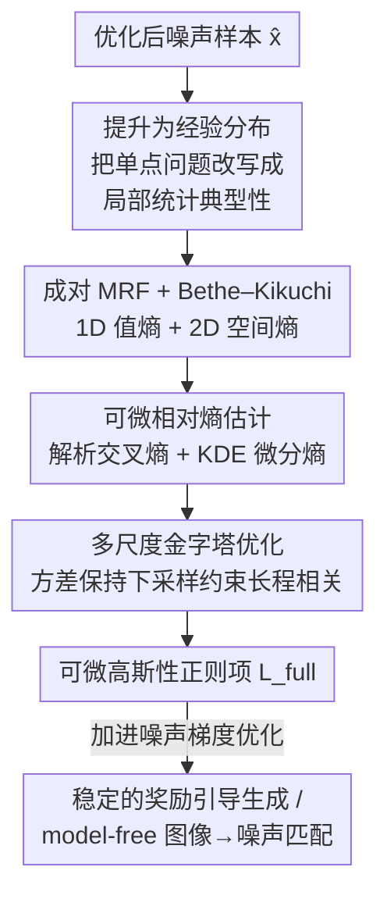

# What Is It Like to Be a Noise? An Entropy-based Gaussian Noise Regularization for Diffusion Models

**会议**: CVPR 2026  
**论文**: [CVF Open Access](https://openaccess.thecvf.com/content/CVPR2026/html/Chang_What_Is_It_Like_to_Be_a_Noise_An_Entropy-based_CVPR_2026_paper.html)  
**代码**: 无  
**领域**: 扩散模型 / 图像生成  
**关键词**: 噪声正则化, 推理时优化, 马尔可夫随机场, KL 散度, 奖励引导

## 一句话总结
针对"推理时优化扩散初始噪声会让 latent 偏离真实高斯统计、引发伪影与 reward hacking"的问题，本文把"一个样本到底像不像高斯噪声"重新定义为分布匹配问题：把单个样本提升为由其局部统计诱导的经验分布、用成对马尔可夫随机场（MRF）建模，再用 Bethe–Kikuchi 近似得到一个可微的高斯性正则项（含 1D 边缘熵 + 2D 空间熵 + 多尺度项），显著提升了 latent 优化的稳定性与生成质量。

## 研究背景与动机

**领域现状**：标准图像扩散模型把高维高斯噪声作为"最大熵起点"——一个不含信息的先验，从这里学习去噪到数据分布。近年大量**推理时（inference-time）方法**复用预训练扩散管线来实现后验目标：奖励引导、提升生成质量、可控合成等。最常见的策略是直接对初始噪声 latent 做梯度优化，使最终去噪结果更满足目标。

**现有痛点**：一旦优化把 latent 推离"真实高斯噪声的统计特征"，模型就被迫去噪它从未在训练中见过的样本，结果是**伪影、行为脆弱、以及 reward hacking**（优化器钻奖励空子而非真正改善生成）。于是优化后 latent 的正则化变成一个走钢丝的平衡问题：样本既要保留目标带来的改变，又要仍然是一个合法的噪声 realization。

**核心矛盾**：要约束"高斯性"，最自然的度量是数据分布 $P$ 与高斯先验 $G$ 之间的 KL 散度 $D_{KL}(P \| G)$。但这正是作者所称的**高斯性的"难问题"（hard problem）**——它恰好刻画了我们想测的东西，却在实践中不可得，因为 $P$ 未知、且无法从单个样本推断出来。现有正则项（$\ell_2$/MAP、KL、norm-guided）其实都只是把 $P$ 粗暴近似成 Dirac delta、各向同性高斯、或均匀超球壳，只匹配了选定的**全局**特征，而忽略了样本的**局部联合统计**。

**本文目标**：在"难问题"不可解的前提下，找到一个既可计算又抓住高斯本质的高斯性度量，把它做成可微正则项插进噪声优化里。

**切入角度**：与其问"这个点属不属于高斯分布"，不如问"这个样本携带的**局部统计**是否与一个典型高斯 draw 一致"。把问题从单点似然转移到局部统计的典型性（typicality）上。

**核心 idea**：把单个样本"提升"为一个经验分布 $P_{\hat{x}}$（由它自身统计诱导），用成对 MRF 建模并做 Bethe–Kikuchi 近似，从而得到一个**从单样本就能算、且端到端可微**的高斯性正则项。

## 方法详解

### 整体框架
方法解决的是"如何从单个优化后的样本 $\hat{x}$ 算出一个可微的、刻画它高斯性的标量正则项"。整体流程是一条计算链：先做**概念转换**——把 $\hat{x}$ 提升为由其局部统计诱导的经验分布 $P_{\hat{x}}$，目标改写为 $D_G(\hat{x}) = D_{KL}(P_{\hat{x}} \| G)$（公式 3）；再用**成对 MRF**把 $P_{\hat{x}}$ 在像素格上因子化为节点（一元）与边（成对）势函数，并用 **Bethe–Kikuchi 近似**把不可解的全局熵拆成"1D 值熵 + 2D 空间熵"两项（公式 5）；每一项的 KL 都通过**可微估计**算出（解析交叉熵 + KDE 微分熵）；最后把该目标在一个**多尺度金字塔**上分别评估并加权求和（公式 11），以约束更长程的相关性。整个 $L_{full}(\hat{x})$ 对 $\hat{x}$ 的像素端到端可微，可以直接作为正则项加进任意噪声梯度优化里。

### 关键设计

**1. 把单样本提升为经验分布：从"点属于谁"转向"局部统计像不像"**

高斯性的"难问题"在于真分布 $P$ 未知、无法从单样本推断，所以直接算 $D_{KL}(P \| G)$ 不可行。作者的第一个贡献是做一个概念转换：给每个优化后样本 $\hat{x}$ 关联一个由它自身携带统计诱导的经验分布 $P_{\hat{x}}$，并定义

$$D_G(\hat{x}) = D_{KL}(P_{\hat{x}} \| G).$$

这一步（公式 3）是全文的核心思想转折——不再问"单个点 $\hat{x}$ 是否属于高斯先验"，而是问"$\hat{x}$ 携带的局部统计是否与一个典型高斯 realization 一致"。它的高明之处在于：把一个不可得的全局似然问题，换成了一个可以从单样本就估计的"典型性"问题。论文在附录中还指出，标准 $\ell_2$（MAP）、KL、norm-guided 正则其实分别对应把 $P_{\hat{x}}$ 限制成 Dirac delta、拟合的各向同性高斯、均匀超球壳——也就是说它们都是这个框架的退化特例，只匹配了全局特征而非局部联合统计。

**2. 成对 MRF + Bethe–Kikuchi 近似：把不可解的全局熵拆成 1D 值熵 + 2D 空间熵**

有了 $P_{\hat{x}}$ 的定义，还得回答"怎么从单样本写出 $P_{\hat{x}}$"。作者借鉴经典计算机视觉里的 MRF，把 $\hat{x}$ 视作一个**遍历（ergodic）的空间过程**：遍历性 + 局部邻域系统 + 有限阶 clique，使得密度可以在像素格 $V$ 上因子化为一元势 $\psi_i$ 与成对势 $\psi_{ij}$ 的乘积（公式 4）：

$$p_{\hat{x}}(x) = \frac{1}{Z}\prod_{i\in V}\psi_i(x_i)\prod_{(i,j)\in E}\psi_{ij}(x_i, x_j).$$

但配分函数 $Z$ 一般无法解析求出，目标仍不可解。关键的破局点是：同一个 MRF 结构本身也提供了一个有原则的近似——**Bethe–Kikuchi cluster expansion**，它用局部 cluster（一元 + 成对 clique）的熵之和来近似不可解的全局熵（从而近似 KL），并对它们的重叠做校正。把展开限制到节点与边（即标准 Bethe 近似）就得到最终目标（公式 5）：

$$D_{KL}(P_{\hat{x}} \| G) \approx \underbrace{D_{KL}(P_{\hat{x},S^{(2)}} \| G_{S^{(2)}})}_{\text{空间熵项}} + \gamma\,\underbrace{D_{KL}(P_{\hat{x},S^{(1)}} \| G_{S^{(1)}})}_{\text{值熵项}},$$

其中 $\gamma$ 是 Bethe 近似规定的过计数校正项（因为一个像素会同时属于多个成对 clique）。两项互补：**值熵项 $S^{(1)}$** 比对 1D 像素强度的经验分布与目标 $\mathcal{N}(0,1)$，对齐边缘值统计；**空间熵项 $S^{(2)}$** 比对相邻像素对的 2D 联合经验分布与目标 $\mathcal{N}(0, I_2)$，惩罚理想高斯场中本不该有的局部统计依赖——这一项是抓住"典型性"的核心。

**3. 可微相对熵估计：解析交叉熵 + KDE 微分熵，并用分箱降到线性复杂度**

公式 5 的两项 KL 都需要可微地估出来。作者把每个 $D_{KL}(P_{\hat{x}} \| G)$ 拆成交叉熵减微分熵（公式 6）：$D_{KL} = H(P_{\hat{x}}, G) - H(P_{\hat{x}})$。对于从样本里抽出的 $N$ 个 $d$ 维向量 $V=\{v_i\}$（$S^{(1)}$ 取像素值 $d=1$，$S^{(2)}$ 取相邻像素对 $d=2$）：

- **交叉熵**好算，因为目标 $G=\mathcal{N}(0,I_d)$ 解析，$\log G(v) = -\frac{d}{2}\log(2\pi) - \frac{1}{2}\|v\|_2^2$，直接用 Monte Carlo 在 $N$ 个元素上平均即可（公式 7–8），对每个 $v_i$ 的分量完全可微。
- **微分熵**更棘手，因为 $P_{\hat{x}}$ 只由样本集 $V$ 隐式定义。作者先用**高斯核 KDE** 近似连续密度 $\hat{p}(v)=\frac{1}{N}\sum_j K_\sigma(v - v_j)$（带宽 $\sigma$ 用 Scott 规则等启发式设定），再对 $\log\hat{p}(v_i)$ 做 Monte Carlo 平均得到 $H(P_{\hat{x}})$（公式 9–10，加小常数 $\epsilon$ 保数值稳定）。

两者相减就是端到端可微（对原始像素值）的 KL。朴素实现是 $O(N^2)$（每对样本向量都要算距离），但作者指出可以把成对距离改成对一组**固定的 bin（如 128 个）**计算，从而做到**线性复杂度**且几乎无质量损失（Table 1 即用此版本）。由于这个开销只发生在逐样本优化时、而非大规模训练时，所以完全可接受。

**4. 多尺度金字塔优化：方差保持下采样，约束长程相关性**

成对 MRF 只约束相邻像素间的局部依赖，因此即便局部统计已与 $G$ 匹配，$\hat{x}$ 里仍可能残留**长程相关**。作者用一个多层方案补这个洞：构造样本金字塔 $\{\hat{x}_k\}_{k=0}^{L-1}$，$\hat{x}_0=\hat{x}$ 为全分辨率，每一层对前一层做 $2\times 2$ 块均值池化、再乘 $\sqrt{n}$（聚合像素数）以**保持方差**——$2\times 2$ 池化对应乘 $\sqrt{4}=2$。这个方差保持变换保证每一层目标分布仍是标准正态 $\mathcal{N}(0,I)$，于是公式 6 的 KL 目标可以在每个尺度上评估，得到最终目标（公式 11）：

$$L_{full}(\hat{x}) = \sum_{k=0}^{L-1}\alpha_k\, D_{KL}(P_{\hat{x}_k} \| G),$$

其中 $\alpha_k$ 是平衡各尺度 KL 的权重。在更粗的分辨率上评估，等于把局部成对约束施加到逐渐更大的邻域上，从而惩罚更大尺度的空间相关，让 $\hat{x}$ 成为高斯典型集里更忠实的代表。文中所有例子都用三层（$L=3$）。

## 实验关键数据

> ⚠️ 本文主结果（reward-guided 生成的质量/FID 对比、奖励曲线）在原文中主要以图（Figure 2–6）呈现，CVF 文本版未能完整抽取数值表；下表中可得的定量结果为各方法的单步耗时（Table 1）。其余以定性结论为主，具体数值以原文图表为准。

### 主实验

各方法单步耗时（Table 1，单位 ms，越低越快）：

| 方法 | Time/step (ms) |
|------|----------------|
| KL | 0.4063 ± 0.0227 |
| Pix2Pix-Zero | 2.6374 ± 0.1207 |
| ReNO | 0.4553 ± 0.0025 |
| ReNoise | 3.0938 ± 0.2804 |
| Hwang et al. | 0.7148 ± 0.0075 |
| **Ours** | 15.0191 ± 0.1053 |

可以看到本文正则项的单步开销明显高于简单 KL/norm 类基线（主要来自 KDE 微分熵估计），是方法的主要代价；但因为它只在逐样本推理时优化、不进训练，作者认为对目标应用仍可接受。

### 消融实验

在一个结构化棋盘格输入上做**累积消融**（Figure 2），逐步加入各项并分别看"有/无多尺度"：

| 配置 | 现象 |
|------|------|
| + 1D 值熵 | 成功矫正 1D 边缘直方图、匹配所有一阶统计；但无法处理输入强烈的空间相关 |
| + 2D 空间熵 | 在全分辨率上开始打散局部相关 |
| + Bethe 校正 | 校正成对 clique 的过计数，组成完整目标 |
| + 多尺度 | 把局部约束推广到更大邻域，进一步压制长程相关 |

### 关键发现
- **值熵项管一阶统计、空间熵项管局部相关**：单靠 1D 项只能把直方图掰成高斯形状，但棋盘格那种强空间结构纹丝不动，必须靠 2D 空间熵项才开始瓦解局部相关——这印证了"典型性"主要藏在空间联合统计里。
- **多尺度是补长程相关的关键**：成对 MRF 天生只看相邻像素，长程结构会漏掉；金字塔通过在粗分辨率上施加同一目标，把约束扩展到更大邻域。
- **model-free 图像→噪声匹配**（Figure 5）：以与目标图像的 Pearson 相关作为奖励、配上本文正则项，可以在**完全不查询去噪器**的情况下，从随机初始化恢复出能生成与目标图像布局/结构高度相似图像的高斯 latent；且该 latent 不是对源图过拟合——换一个 prompt（如"a photo of a bird"）仍能生成高质量的对应图像，说明它仍是通用高斯 latent。恢复出的噪声还能在 SD1.5 / SD2.1 / SD-Turbo 间迁移。作者称这是首次展示此效应。

## 亮点与洞察
- **把"是不是高斯噪声"重述为分布匹配问题**：最让人"啊哈"的是 $D_G(\hat{x}) = D_{KL}(P_{\hat{x}} \| G)$ 这一步——不再纠结单点似然，而是把单样本提升成经验分布去比统计。这个视角直接把多种已有正则（$\ell_2$、KL、norm-guided）统一成它的退化特例（对应 Dirac/各向同性高斯/球壳），框架感很强。
- **用经典 MRF + Bethe–Kikuchi 解可微近似**：把一个看似不可解的全局熵问题，借遍历性假设 + 成对 clique + Bethe 展开拆成可算的 1D/2D 熵项，是把统计物理工具搬进扩散噪声正则的漂亮迁移。
- **方差保持的金字塔下采样**：$2\times 2$ 池化后乘 $\sqrt{n}$ 让每层目标都保持标准正态，这个小技巧使得"同一个高斯性目标"能无缝复用到所有尺度，可直接迁移到任何需要多尺度统计匹配的任务。
- **分箱把 $O(N^2)$ 降到线性**：对固定 bin 算成对距离而非样本两两算，是个实用的工程取舍。

## 局限与展望
- **KDE 估微分熵贵**：依赖 KDE 算微分熵虽然给出平滑估计，但计算开销大——Table 1 里本文单步 15ms 远高于其他基线，是主要瓶颈。
- **成对 MRF 仍是局部近似**：尽管多尺度 MRF 比简单先验强很多，其底层成对假设仍只是局部近似，可能无法彻底消除全局长程依赖。Figure 6 的失败案例显示：从一个纯净 latent、用较低学习率优化时，多层 MRF 仍可能解不掉复杂的长程结构，导致退化的扩散输出（不过作者指出实际应用中输入很少离目标噪声分布这么远）。
- **奖励权重需逐样本调**：model-free 匹配里正则权重 $\lambda$ 要按样本调，距离一个数学上忠实、高保真的反演技术还有距离。
- **展望**：探索成对 MRF 之外更高级/高效的隐式分布，以及替代 KDE 的微分熵估计以提升性能。

## 相关工作与启发
- **vs 正态性检验（KS / Anderson–Darling / Shapiro–Wilk / Jarque–Bera）**：这些经典检验通过 CDF 对齐、分位数相关或矩匹配来评 1D 高斯性，但假设 i.i.d.、忽略高阶与空间相关——而空间相关恰是扩散噪声结构的核心，本文用 2D 空间熵项正面建模它。
- **vs Gaussianization / 基于 KL 或 kurtosis 的分布对齐损失**：它们要么做迭代的全局旋转 + 边缘 CDF 匹配，要么只对齐选定的全局矩；本文强调局部联合统计，并把这些方法解释为自身框架的退化特例。
- **vs Hwang et al.（并行工作）**：他们提出基于空间与谱域矩匹配的高斯性度量；本文走的是经验分布 + MRF + Bethe 近似的熵路线。
- **vs 梯度噪声优化的 norm-aware / 噪声平均 / 局部矩匹配正则（ReNO 等）**：这些是为防止无约束梯度把 latent 推离高斯先验而加的各类保高斯性约束，本文提供了一个更有原则、统一了它们的分布匹配视角。
- **vs 种子选择 / 采样式噪声优化**：后者通过评估、挑选、重采样候选种子隐式探索噪声空间，天然不偏离高斯先验、无需显式正则，但代价是计算昂贵且精度有限；本文走显式梯度路线 + 正则保高斯性。

## 评分
- 新颖性: ⭐⭐⭐⭐⭐ 把"样本像不像高斯噪声"重述为单样本经验分布的 KL 匹配，并用 MRF + Bethe–Kikuchi 给出可算正则，统一了多种已有正则为特例，视角独到。
- 实验充分度: ⭐⭐⭐⭐ 有累积消融、耗时对比、奖励引导与 model-free 匹配等应用，且跨多个 SD 模型验证；但主结果多以图呈现、缺系统化的定量质量表（CVF 文本未抽到）。
- 写作质量: ⭐⭐⭐⭐⭐ 从"hard problem"到"soft problem"的概念推进清晰，公式推导分层（提升→MRF→Bethe→可微估计→多尺度）易跟，连标题与引言都带巧思。
- 价值: ⭐⭐⭐⭐ 为推理时噪声优化提供了即插即用、有原则的高斯性正则，能缓解伪影与 reward hacking；主要代价是 KDE 带来的较高单步开销。

<!-- RELATED:START -->

## 相关论文

- [\[CVPR 2026\] It's Never Too Late: Noise Optimization for Collapse Recovery in Trained Diffusion Models](its_never_too_late_noise_optimization_for_collapse_recovery_in_trained_diffusion.md)
- [\[CVPR 2026\] Elucidating the Design Space of Arbitrary-Noise-Based Diffusion Models](eda_arbitrary_noise_diffusion_design_space.md)
- [\[CVPR 2026\] Resolving Endpoint Underfitting in Diffusion Bridges via Noise Alignment](resolving_endpoint_underfitting_in_diffusion_bridges_via_noise_alignment.md)
- [\[CVPR 2026\] Bidirectional Normalizing Flow: From Data to Noise and Back](bidirectional_normalizing_flow_from_data_to_noise_and_back.md)
- [\[CVPR 2026\] Pixel Motion Diffusion Is What We Need for Robot Control](pixel_motion_diffusion_is_what_we_need_for_robot_control.md)

<!-- RELATED:END -->
