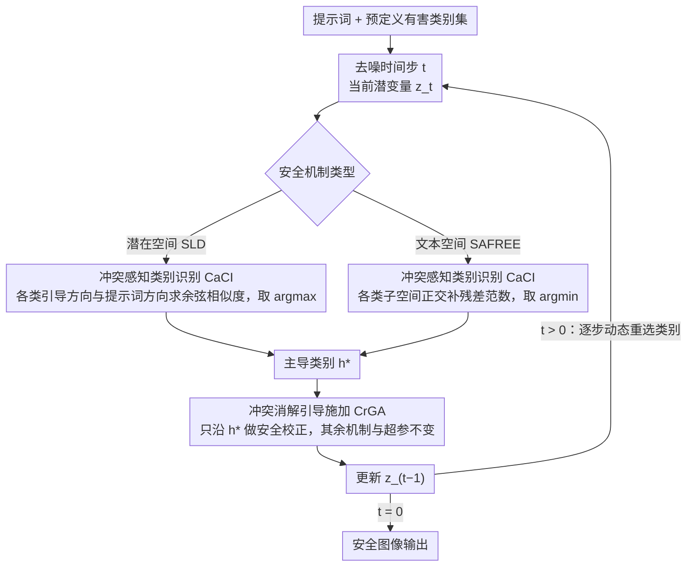

# When Safety Collides: Resolving Multi-Category Harmful Conflicts in Text-to-Image Diffusion via Adaptive Safety Guidance

## 基本信息

- **会议**: CVPR 2026
- **arXiv**: [2602.20880](https://arxiv.org/abs/2602.20880)
- **代码**: [GitHub](https://github.com/tmllab/2026_CVPR_CASG)
- **领域**: 图像生成 / T2I安全
- **关键词**: 扩散模型安全, 有害内容缓解, 安全引导, 多类别冲突, 无训练框架

## 一句话总结

提出 Conflict-aware Adaptive Safety Guidance (CASG)，一种无训练的即插即用框架，通过动态识别与当前生成状态最对齐的有害类别并仅沿该方向施加安全引导，解决了现有安全引导方法在多类别聚合时因方向冲突导致的安全性退化问题。

## 研究背景与动机

文本到图像（T2I）扩散模型（如 Stable Diffusion、Hunyuan-DiT）在生成高质量图像方面取得了巨大进展，但也带来了生成有害内容（仇恨、色情、暴力、违法等）的安全风险。现有的安全引导方法（如 SLD、SAFREE）通过在潜在空间或文本空间中施加安全方向来引导生成远离有害区域，是一类无需修改模型的轻量化安全方案。

**核心问题**：现有安全引导方法在处理多类别有害内容时，简单地将所有有害关键词拼接为一个聚合集，从中导出一个统一的安全方向。这种类别无关的设计隐含假设不同类型的害处是兼容的。然而作者通过大量实验发现，这一假设不成立——不同有害类别定义了各自独特且往往不兼容的安全方向，强行聚合会产生 **有害冲突（Harmful Conflict）**，反而降低安全性能。

有害冲突体现为两种形式：

**方向不一致（Directional Inconsistency）** → 安全错位退化（Safety Misalignment Degradation）：不同类别的安全方向指向不兼容甚至相反的方向。例如对色情提示词施加"仇恨"方向的安全引导，有害率反而从 67.2% 升至 72.4%，远高于正确使用"色情"方向的 3.2%。

**方向衰减（Directional Attenuation）** → 安全平均退化（Safety Averaging Degradation）：多类别聚合导致异质方向部分抵消，削弱净安全信号。"色情"方向单独应用有害率为 3.2%，加入"仇恨"后升至 5.8%，聚合全部类别后升至 48.8%。

## 方法详解

### 整体框架

CASG 想解决的是一件很具体的事：当一个提示词可能同时触碰多种有害类别时，现有安全引导把所有类别的关键词拼成一个集合、求出一个统一的「安全方向」，结果不同类别的方向互相打架，安全性不升反降。CASG 的思路是不再用聚合方向，而是在去噪的每一个时间步，先判断当前生成轨迹最像哪一类有害内容，再只沿这一个主导类别施加安全校正。整个流程分两步——先用 CaCI（Conflict-aware Category Identification）挑出主导类别，再用 CrGA（Conflict-resolving Guidance Application）只沿它做校正——而且这套机制对潜在空间（CASG+SLD）和文本空间（CASG+SAFREE）两类安全机制都能即插即用。

### 关键设计

**1. 冲突感知的类别识别（CaCI）：每个时间步只锁定与当前生成最对齐的那一个有害类别**

聚合所有类别会把不兼容的安全方向混在一起，所以第一步是把「当前到底在生成哪一类有害内容」判断准。在潜在空间里，CASG 先对每个有害类别 $h_i$ 算出它的有害引导方向 $g_i = \epsilon_\theta(z_t, c_{h_i}) - \epsilon_\theta(z_t)$，再算提示词自身的引导方向 $g_p = \epsilon_\theta(z_t, c_p) - \epsilon_\theta(z_t)$，然后用余弦相似度 $\cos\theta_i = \frac{g_i \cdot g_p}{\|g_i\|\|g_p\|}$ 衡量哪一类与当前轨迹最贴合，取 $h^* = h_{\arg\max_i \cos\theta_i}$ 作为主导类别。在文本空间里换一个等价判据：SAFREE 用子空间投影矩阵 $P_{h_i}$ 表示每个有害概念，CASG 计算提示词嵌入在该子空间正交补上的残差 $p_{h_i}^\perp = (I - P_{h_i})p$，残差范数 $\|p_{h_i}^\perp\|$ 越小说明提示词与该类越对齐，于是取 $h^* = h_{\arg\min_i \|p_{h_i}^\perp\|}$。两种实现殊途同归，都是用「对齐度」把唯一一个真正相关的类别挑出来。

**2. 冲突消解的引导施加（CrGA）：只沿主导类别校正，其余机制原封不动**

第二个痛点是方向衰减——多类别平均会让异质方向部分抵消，净安全信号被稀释（色情方向单独用有害率 3.2%，聚合全部类别后飙到 48.8%）。CrGA 的做法很克制：拿到 $h^*$ 之后，潜在空间就只用 $h^*$ 的方向走原始 SLD 校正，文本空间就只用 $P_{h^*}$ 做正交投影，SLD/SAFREE 原有的全部机制和超参数都保持不变。因为不再混入其它类别的方向，安全信号不会被平均掉，也不会出现「用错方向反而把有害率推高」的退化。

**3. 逐步动态、基于生成状态而非一次性文本预分类**

一个自然的替代方案是先用 LLM 把提示词分好类再做安全引导，但有害语义在去噪过程中是动态演变的，开局定死的类别跟不上这种变化，而且 LLM 对混合/模糊提示词本身就容易分错。CASG 把判断放在生成轨迹上、且每个时间步都重新更新主导类别，因此能追踪冲突的动态变化——这也解释了它为什么明显优于 GPT-4o+SLD、QwenGuard+SLD 这类静态预分类方案。

## 实验

### 主实验结果

| 方法 | Conflict-Aware | I2P ↓ | T2VSafetyBench ↓ | Unsafe Diffusion ↓ | CoProv2 ↓ | FID ↓ | CLIP ↑ |
|:---|:---:|:---:|:---:|:---:|:---:|:---:|:---:|
| SD-v1.5 | - | 42.2 | 58.3 | 52.3 | 28.2 | - | 31.43 |
| ESD | ✗ | 42.0 | 57.4 | 50.6 | 28.1 | 38.15 | 31.35 |
| UCE | ✗ | 26.7 | 28.2 | 33.0 | 19.4 | 77.41 | 29.12 |
| RECE | ✗ | 21.5 | 18.9 | 22.3 | 8.6 | 67.35 | 27.67 |
| SafetyDPO | ✗ | 13.7 | 24.0 | 16.7 | 4.2 | 49.64 | 30.61 |
| SAFREE | ✗ | 20.0 | 41.5 | 24.2 | 14.2 | 43.78 | 30.53 |
| **CASG+SAFREE** | ✓ | **18.9** | **37.5** | **17.5** | **11.8** | 46.25 | 30.35 |
| SLD | ✗ | 12.7 | 25.2 | 15.7 | 7.1 | 52.11 | 29.22 |
| **CASG+SLD** | ✓ | **10.2** | **9.8** | **9.8** | **3.9** | 52.00 | 29.36 |

CASG+SLD 在所有四个基准上达到 SOTA，有害率最高降低 15.4%（T2VSafetyBench 上从 25.2% 降至 9.8%）。同时 FID 和 CLIP 分数几乎不变，说明不损害生成质量。

### LLM辅助 vs CASG 消融对比

| 方法 | I2P ↓ | T2VSafetyBench ↓ | UD ↓ |
|:---|:---:|:---:|:---:|
| SLD | 12.7 | 25.2 | 15.7 |
| GPT-4o+SLD | 11.6 | 12.3 | 20.1 |
| QwenGuard+SLD | 14.0 | 21.1 | 23.3 |
| **CASG+SLD** | **10.2** | **9.8** | **9.8** |

LLM 辅助方案（GPT-4o、QwenGuard 预分类后接 SLD）效果有限甚至更差，原因有二：(1) LLM 对混合/模糊提示词分类出错；(2) 类别在生成开始时固定，无法适应去噪过程中动态演变的冲突。CASG 在每个时间步动态更新，大幅优于 LLM 辅助方案。

### 关键发现

1. **多类别聚合不等于更安全**：这是本文最核心的发现。聚合更多有害类别可能反而削弱安全性（如全类别聚合在色情提示上有害率 48.8%，远高于单类别的 3.2%）
2. **冲突是系统性的**：跨不同基础模型、安全机制、有害关键词定义均存在一致的退化模式
3. **动态识别优于静态分类**：基于生成轨迹的逐步识别比基于 LLM 的一次性文本分类更有效
4. **即插即用提升显著**：CASG 对 SLD 和 SAFREE 均带来一致提升，且不引入额外训练成本

## 亮点

- 提出了一个被广泛忽视但影响深远的问题——多类别有害冲突，首次系统地揭示安全引导方向间的不一致性
- 方法设计极其优雅简洁：仅通过余弦相似度/残差范数选择主导类别，无需训练、无需外部模型
- 通用性强：同时适用于潜在空间（SLD）和文本空间（SAFREE）两类安全机制
- 实验严谨全面：四个安全基准 + 良性生成质量评估 + LLM 辅助对比 + 多模型验证

## 局限性

- 每个时间步需对所有有害类别分别计算噪声预测/投影残差，计算开销随类别数线性增长
- 仅在 SD v1.5 上验证，对更新架构（如 DiT、FLUX 系列）的适用性未充分验证
- 依赖预定义有害关键词集，若关键词覆盖不全或定义不当，可能遗漏某些有害类型
- 每步仅选择一个主导类别，对同时包含多种有害语义的提示词可能存在遗漏

## 评分

⭐⭐⭐⭐ (4/5)

- **创新性**: ⭐⭐⭐⭐⭐ — 「有害冲突」问题的发现极有价值，挑战了"聚合更多类别=更安全"的领域直觉
- **技术深度**: ⭐⭐⭐⭐ — 对冲突机制的分析（方向不一致 + 方向衰减）系统深入，CDRR 分析有说服力
- **实验**: ⭐⭐⭐⭐⭐ — 四个基准、多基线、LLM对比、消融分析，非常全面
- **写作**: ⭐⭐⭐⭐⭐ — 问题引入清晰，PCA方向可视化和CDRR热力图极具说服力
- **影响力**: ⭐⭐⭐⭐ — T2I 安全领域的即插即用增强方案，实用价值高但应用场景相对垂直

<!-- RELATED:START -->

## 相关论文

- [\[CVPR 2026\] TAP: A Token-Adaptive Predictor Framework for Training-Free Diffusion Acceleration](tap_a_token-adaptive_predictor_framework_for_training-free_diffusion_acceleratio.md)
- [\[CVPR 2025\] Multi-party Collaborative Attention Control for Image Customization](../../CVPR2025/image_generation/multi-party_collaborative_attention_control_for_image_customization.md)
- [\[CVPR 2025\] Fine-Grained Erasure in Text-to-Image Diffusion-based Foundation Models](../../CVPR2025/image_generation/fine-grained_erasure_in_text-to-image_diffusion-based_foundation_models.md)
- [\[ICCV 2025\] TRCE: Towards Reliable Malicious Concept Erasure in Text-to-Image Diffusion Models](../../ICCV2025/image_generation/trce_towards_reliable_malicious_concept_erasure_in_text-to-image_diffusion_model.md)
- [\[ICCV 2025\] DynamicID: Zero-Shot Multi-ID Image Personalization with Flexible Facial Editability](../../ICCV2025/image_generation/dynamicid_zero-shot_multi-id_image_personalization_with_flexible_facial_editabil.md)

<!-- RELATED:END -->
