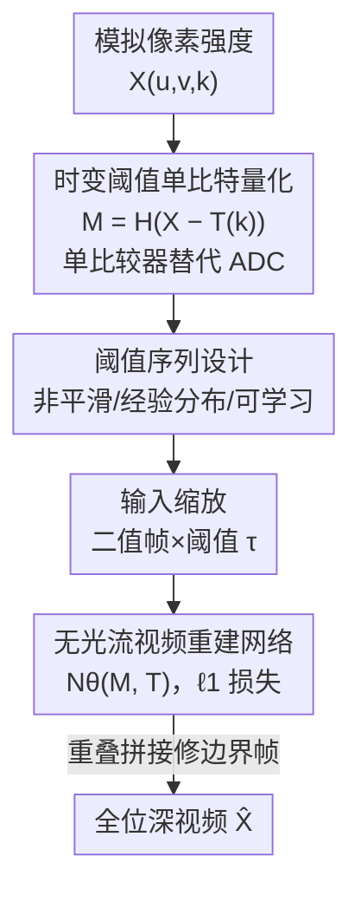

# A Bit is All You Need! Efficient Video Capture via Single Bit Imaging

**会议**: CVPR 2026  
**论文**: [CVF Open Access](https://openaccess.thecvf.com/content/CVPR2026/html/Gandikota_A_Bit_is_All_You_Need_Efficient_Video_Capture_via_CVPR_2026_paper.html)  
**代码**: 无  
**领域**: 图像恢复 / 计算成像  
**关键词**: 单比特成像, 计算视频, 时变阈值, 视频重建, 低功耗传感器

## 一句话总结
传感器端每个像素只采 1 比特、靠逐帧变化的阈值把强度信息"编码"进二值流，再用不含光流的视频重建网络把全比特深度视频恢复回来——既砍掉了功耗最大的高精度 ADC，又在 GoPro 上拿到 32.77 dB PSNR 的高保真重建。

## 研究背景与动机

**领域现状**：常规相机为了拿到 8–24 bit 的强度，必须在传感器上用高精度模数转换器（ADC）做均匀量化。为了减少传感器输出，已有路线要么靠复杂光学前端做压缩感知 / 单像素成像，要么靠 ROI、binning、子采样在高帧率下牺牲分辨率。

**现有痛点**：这些方案绕不开一个根本瓶颈——ADC 阶段本身。位深每线性增加一位，采样率就指数级下降，而 ADC + 芯片 I/O 又占了传感器总功耗的 70%–85%。也就是说，只要还在做高位深量化，海量数据吞吐就摆在那里，对超低功耗、高分辨率或极高速场景是禁止性的。

**核心矛盾**：要省功耗/省带宽/提帧率，就得砍位深；但砍位深通常意味着丢信息、重建质量崩。如何在"位深压到极限"的同时"几乎不丢可恢复的信息"，是两难。

**本文目标**：把传感器位深直接压到 **1 比特/像素**，同时还能恢复出全比特深度（8–14 bit）的高保真视频；并且不引入任何复杂光学，反而要让传感器硬件更简单。

**切入角度**：固定阈值的 1-bit 量化只能给出"亮/暗"二值、显然丢光信息；但作者观察到，如果**阈值随时间变化**、并配合视频里天然的时空相关性，那么不同帧的二值测量其实在不同强度层级上对场景做了切片，多帧合起来就把强度信息"摊"进了时间维度。

**核心 idea**：用"时变阈值的单比特量化 + 神经网络重建"替代"高位深 ADC"，把硬件压缩直接做进物理采样过程，再把恢复负担整体外包给深度网络。

## 方法详解

### 整体框架
方法分两段：**采集端**用一个比较器把模拟像素强度与一个逐帧变化的阈值 $T(k)$ 比较，输出 1 比特测量 $M$；**恢复端**用一个视频重建网络 $\mathcal{N}_\theta$，吃进二值测量序列和对应阈值，直接回归出全比特深度视频。中间最关键的是"用什么样的阈值序列"——这决定了二值流里到底编进了多少可恢复的时空信息。整条链路的核心转换是：高位深 ADC → 单比较器 + 时变阈值 → 二值流 → 神经网络 → 全位深视频。

### 关键设计

**1. 时变阈值的单比特采集：用一个比较器换掉整条 ADC**

痛点直白：固定阈值的 1-bit 量化只能区分"亮/暗"，没法承载高位深强度。作者的做法是让阈值 $T(k)$ 在每个离散时刻 $k$ 都不同、并扫过传感器的整个动态范围，测量值定义为

$$M(u,v,k) = H\big(X(u,v,k) - T(k)\big),$$

其中 $H(\cdot)$ 是 Heaviside 阶跃函数（$\tau \ge 0$ 取 1，否则取 0）。直白说，第 $k$ 帧里某像素强度高于当帧阈值就记 1、否则记 0。硬件上这正好对应 CMOS 里 ramp ADC 的比较器：但本文一整帧只用**单一阈值**（对整个阵列施加同一个 DC 参考电压、帧间在外部调整），因此可以把完整 ADC 直接换成一个比较器，放在每列甚至每像素。由于帧内参考阈值不变，比较器的动态指标要求也大幅降低。它有效在于：把"位深"从空间维（每像素多 bit）挪到了时间维（多帧各 1 bit），不同阈值的帧在不同强度层级上切片，时空相关性让这些切片可被联合反演。

**2. 把重建写成欠定可行性问题、再交给无光流网络求解**

对静止图像，用 $2^m$ 个时变阈值（对应 m-bit ramp 的台阶）可以在每像素解一个**超定**不等式组、精确恢复 m-bit 强度；但视频里像素强度因运动逐帧变化，每帧每像素只剩**一条**不等式，恢复退化成一个解不唯一的线性可行性问题：

$$\hat{X} = \arg\min_X R(X)\ \text{ s.t. }\ H(X - T) = M,$$

需要靠视频先验 $R(X)$ 收敛。作者不去显式解这个正则化优化，而是直接训练一个网络

$$\hat{X} = \mathcal{N}_\theta(M, T)$$

用网络输出与真值之间的 $\ell_1$ 损失监督。一个关键取舍是**故意不用带光流的重建网络**：很多视频重建网络靠学习光流做时间对齐，但这里阈值逐帧变，同一个运动补偿后的像素在不同帧可能被二值化成 0 或 1，光流估计的像素对应关系会失效。所以作者选用 Aswin、EfficientSCI++、Res2former、Shiftnet 这类**不含光流**的网络。

**3. 阈值序列的选择：非平滑排列是质量分水岭**

阈值怎么排，直接决定二值流编码了多少时间信息，作者系统比较了四类：① **均匀间隔、平滑变化**——单帧误差最小，但阈值平滑递增时一个像素相对阈值的关系在相邻帧大概率不变（0 区维持 0、1 区维持 1），时间分辨率几乎丢光，效果最差；② **均匀间隔但排列成最大非平滑**——求一个让相邻阈值最小间距最大化的排列，制造更频繁的"阈值穿越"，从而保住时间分辨率，相比平滑序列 PSNR 直接涨 1.4–1.8 dB，是质量的分水岭；③ **非均匀非平滑**——真实像素强度分布非均匀，于是用逆变换采样 $T_2(k) = \Phi^{-1}(T_1(k))$（$\Phi^{-1}$ 为目标分布逆 CDF）把均匀阈值映到拟合的 Beta 分布或经验分位点，再做非平滑排列；④ **可学习阈值**——把阈值和网络权重一起端到端优化，由于量化不可导，反向传播时用连续 sigmoid 近似阈值操作。实验里经验分布的非平滑阈值略胜，而可学习阈值从非平滑初始化出发训练后几乎没怎么变，说明非平滑均匀阈值已接近最优。重要的是：阈值函数及其优化与传感器阵列/数据转换器设计无关，同一套硬件能跑任意阈值序列。

**4. 重叠拼接修边界 + 输入缩放：把可用信息榨干**

两条工程化但显著有效的设计。其一**重叠（overlap）**：把 10 个唯一阈值重复一遍得到 20 帧输入网络，但边界帧上下文信息少、重建质量低；作者再用"整体平移 10 帧"后的另一段重建，把初始重建的边界帧替换成平移版里对应的中心帧，从而修补边界。其二**输入缩放**：不把二值帧原样喂网络，而是用当帧阈值 $\tau$ 给二值帧加权（0→0、1→$\tau$），或对称地把 0→$\tau/2$、1→$(1+\tau)/2$ 让量化误差围绕映射值对称分布；直接喂二值最差，两种缩放都明显提升且彼此差不多。

### 损失函数 / 训练策略
重建网络用输出与全位深真值之间的 $\ell_1$ 损失训练。8-bit 实验用 GoPro（22 训练视频、250 fps、8 bit）训练并在 11 个测试视频上评估；RAW 实验用 Real-RawVSR（14 bit、25 fps）、ReCRVD（12 bit）等，RAW 帧先线性归一到 [0,1] 近似模拟传感器线性响应，并以 $\gamma=1.6$ 的 gamma 映射做色调映射、阈值也按 $\tau^{1/\gamma}$ 缩放。所有实验固定随机种子保证可复现与公平对比。

## 实验关键数据

### 主实验
在 GoPro 测试集上对比不同重建网络（从模拟 1-bit 测量恢复 8-bit 灰度视频）：

| 网络 | PSNR/SSIM（overlap） | PSNR/SSIM（no-overlap） |
|------|----------------------|--------------------------|
| Aswin | **32.77 / 0.9239** | **32.24 / 0.9174** |
| EfficientSCI++ | 32.17 / 0.9207 | 31.78 / 0.9142 |
| Shiftnet | 30.69 / 0.8930 | — |
| Res2former | 30.26 / 0.8808 | 29.82 / 0.8729 |

Aswin 重建保真度最高；overlap 边界修补普遍带来约 0.4–0.5 dB 增益。

### 消融实验

阈值序列选择（Tab. 2，10 阈值重复）：

| 阈值策略 | PSNR/SSIM（no-overlap） | PSNR/SSIM（overlap） |
|----------|--------------------------|------------------------|
| 均匀-平滑 | 30.32 / 0.8828 | 31.31 / 0.9132 |
| 均匀-非平滑 | 32.20 / 0.9171 | 32.75 / 0.9236 |
| 经验分布-非平滑 | **32.24 / 0.9174** | **32.77 / 0.9239** |
| Beta 分布-非平滑 | 31.15 / 0.9096 | 31.66 / 0.9138 |
| 可学习 | 32.15 / 0.9162 | 32.68 / 0.9230 |

阈值序列长度（均匀平滑递增）：

| 配置 | PSNR/SSIM |
|------|-----------|
| n = 8 | 29.23 / 0.8710 |
| n = 10 | 29.29 / 0.8712 |
| n = 20 | 26.50 / 0.8043 |
| n = 10（重复2次→20帧） | **30.32 / 0.8828** |

输入缩放（非平滑均匀阈值）：

| 缩放方式 | PSNR/SSIM（overlap） |
|----------|------------------------|
| 不缩放 | 31.74 / 0.9168 |
| 0→0, 1→τ | **32.75 / 0.9236** |
| 0→τ/2, 1→(1+τ)/2 | 32.73 / 0.9235 |

### 关键发现
- **非平滑排列是最大功臣**：把同一组阈值从平滑改成最大非平滑，PSNR 涨 1.4–1.8 dB，远超换分布（Beta 甚至比均匀非平滑还差）；说明保住"时间分辨率"比"匹配强度分布"更要紧。
- **阈值不是越多越好**：n 从 8→10 仅微涨，但直接拉到 20 反而掉 2.5+ dB（相邻阈值太密、跨帧关系不变、时间分辨率丢失）；而把 10 个阈值重复成 20 帧却能涨，因为网络能利用同阈值帧间的运动信息。
- **强泛化**：GoPro（250 fps）训练的 Aswin 直接测 XVFI（1000 fps）得 35.09 dB、QUIVER（2000 fps）得 34.76 dB，覆盖 250–5000 fps、多种高速相机；灰度模型逐通道喂 RGB 即可恢复彩色视频。
- **运动是主要难点**：光流分析显示重建质量在运动范围内整体稳定（>27.85 dB），失败案例集中在 Real-RawVSR 的极端运动样本（最差 18.27 dB，最好 37.45 dB）。
- **抗噪与非理想比较器**：微调后在 σ∈[0,0.1] 噪声下表现稳定，硬件比较器抖动下仍达 30.77 dB。

## 亮点与洞察
- **把空间位深换成时间维**：核心洞见是"1 bit/像素/帧 × 多帧时变阈值"在时间上重建出强度信息，这个视角让"砍到 1 bit 还能恢复全位深"从反直觉变得自洽——可迁移到任何能用比较器替代 ADC 的低功耗成像系统。
- **非平滑阈值这个反常识结论很巧**：直觉上平滑阈值更"温和"，但正因为它跨帧不变才丢时间信息；作者用"最大化相邻阈值最小间距的排列"显式制造阈值穿越，是个干净可复现的设计。
- **重建端故意不用光流**：一般视频任务都靠光流对齐，这里作者反过来论证阈值变化会破坏像素对应、光流反而有害——是个值得记住的"任务特性决定架构取舍"案例。
- **系统级收益讲得扎实**：把功耗（ADC 占 70–85%）、内存（1/m）、读出速度（256 次比较→1 次）、硅面积/成本都量化分析了一遍，不是只报 PSNR。

## 局限与展望
- **作者承认**：恢复负担整体外包给外部深度网络，网络推理功耗高于传统高位深采集；只是相比"高帧率下高位深采集"的根本瓶颈，1-bit 采集的整体收益仍更划算。
- **强运动是软肋**：低帧率 + 大帧间运动（Real-RawVSR）下可行性问题约束太松，出现 18.27 dB 的失败案例；方法更适合高帧率、帧间运动小的场景。
- **全部基于模拟 1-bit 测量验证**：虽做了硬件 proof-of-concept（数字帧转模拟电压再用高速比较器二值化），但大规模真实传感器采集、真实噪声/比较器抖动下的端到端验证仍有限。
- **改进思路**：把运动信息更显式地注入重建（在不破坏二值对应的前提下）、针对极端运动设计自适应阈值序列、以及在真实低功耗传感器流片上验证。

## 相关工作与启发
- **vs 压缩感知 / 单像素视频成像**：他们靠复杂光学前端做多路复用压缩、再算法反演；本文不动光学、只把 ADC 换成比较器，在传感器电路层做压缩，硬件更简单。
- **vs 视频位深扩展 / HDR 重建**：已有位深扩展只处理中等位深的均匀量化输入、HDR 靠多曝光低动态范围序列，都不为 1-bit 输入设计；本文直面 1-bit 极端量化。
- **vs 量子/光子计数传感器、Spike/Event 相机**：它们也记 1-bit 高时间分辨率，但需要特殊的数字光子计数或异步硬件、且常要配一台常规帧率相机才能恢复全视频；本文在**常规传感器全部像素**上记 1 bit、无需额外传感器即可计算恢复。
- **vs 一比特压缩感知 / dither 方案**：已有工作靠固定阈值取符号测量、或加随机抖动改善恢复，但未在视频恢复上验证；本文系统化研究了时变阈值序列对视频重建的影响。

## 评分
- 新颖性: ⭐⭐⭐⭐⭐ 把视频传感位深压到 1 bit 还能高保真恢复，是相机流水线层面的范式级新思路
- 实验充分度: ⭐⭐⭐⭐ 多网络/多阈值/多帧长/缩放/噪声/OOD/RAW 消融齐全，但全为模拟测量、真实硬件采集验证有限
- 写作质量: ⭐⭐⭐⭐⭐ 动机、阈值设计权衡和系统级收益分析都讲得清楚扎实
- 价值: ⭐⭐⭐⭐⭐ 直指超低功耗、高速、gigapixel 成像的核心瓶颈，对传感器与计算成像有现实意义

<!-- RELATED:START -->

## 相关论文

- [\[CVPR 2026\] DetectSCI: Toward Object-Guided ROI Reconstruction for High-Resolution Video Snapshot Compressive Imaging](detectsci_toward_object-guided_roi_reconstruction_for_high-resolution_video_snap.md)
- [\[CVPR 2026\] LRDUN: A Low-Rank Deep Unfolding Network for Efficient Spectral Compressive Imaging](lrdun_a_low-rank_deep_unfolding_network_for_efficient_spectral_compressive_imagi.md)
- [\[CVPR 2026\] Retrieve-to-Restore: Efficient All-in-One Image Restoration with a Retrieval-Based Degradation Bank](retrieve-to-restore_efficient_all-in-one_image_restoration_with_a_retrieval-base.md)
- [\[CVPR 2025\] Proximal Algorithm Unrolling: Flexible and Efficient Reconstruction Networks for Single-Pixel Imaging](../../CVPR2025/image_restoration/proximal_algorithm_unrolling_flexible_and_efficient_reconstruction_networks_for_.md)
- [\[CVPR 2026\] Time-Specialized Event-Image Alignment for Blur-to-Video Decomposition](time-specialized_event-image_alignment_for_blur-to-video_decomposition.md)

<!-- RELATED:END -->
