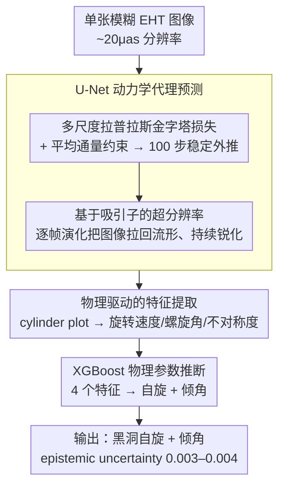

# BHCast: Unlocking Black Hole Plasma Dynamics from a Single Blurry Image with Long-Term Forecasting

**会议**: CVPR 2026  
**arXiv**: [2603.26777](https://arxiv.org/abs/2603.26777)  
**代码**: 无  
**领域**: 图像修复/科学成像  
**关键词**: 黑洞成像, 超分辨率, 长期时序预测, 物理推断, 动力学建模

## 一句话总结
BHCast从单张模糊的EHT黑洞图像出发，通过U-Net动力学代理模型进行超分辨率+长期自回归预测（100步稳定），从预测的等离子体动力学中提取物理特征（旋转速度、螺旋角等），再通过XGBoost推断黑洞自旋和倾角，在真实M87*观测图像上也展示了有效性。

## 研究背景与动机
**领域现状**：事件视界望远镜（EHT）实现了首张黑洞图像的拍摄，但受限于~20μas分辨率，仅能获得静态模糊图像，无法直接观测等离子体动力学。

**解读瓶颈**：理解EHT图像需要与GRMHD（广义相对论磁流体动力学）模拟比对，但单次模拟需超级计算机运行数周，大规模参数空间搜索不可行。

**双重挑战**：(1) 从分辨率受限的图像中恢复丢失的高频信息（超分辨率）；(2) 关键动力学指标需要稳定的**长时预测**（300 $GM c^{-3}$+）以精确测量。

**核心idea**：将不适定的天体物理逆问题重构为"预测+推断"框架——用神经代理模型替代昂贵GRMHD模拟，通过耗散动力学系统的吸引子理论实现自修正超分辨率。

## 方法详解

### 整体框架

BHCast 把一个不适定的天体物理逆问题重构成「预测 + 推断」两段式：与其用超级计算机跑数周的 GRMHD 模拟去比对，不如训练一个神经代理模型来替代模拟。具体流程是，从单张模糊的 EHT 图像出发，用 U-Net 自回归地逐帧预测等离子体动力学（稳定外推到 100 步），再从预测序列里构造 cylinder plot、提取旋转速度/螺旋角等物理特征，最后用 XGBoost 从这些特征推断黑洞的自旋和倾角。三级流水线各自独立、可分别改进。

### 关键设计

**1. 多尺度拉普拉斯金字塔损失：用平均通量约束撑住长时预测**

自回归预测最大的风险是误差累积、几十步后就发散。本文的损失在多个空间频率上分层监督，$\mathcal{L}_{total} = \mathcal{L}_{Lap_0} + \tfrac{1}{2}\mathcal{L}_{Lap_1} + \tfrac{1}{4}\mathcal{L}_{Lap_2} + \tfrac{1}{8}\mathcal{L}_{\Phi}$，其中各 $Lap_k$ 项分别管细节、中间尺度到粗结构，每个尺度用 $\ell_1 + \ell_2$ 兼顾异常值鲁棒性和优化容易性。真正的关键是最后那一项平均通量 $\Phi(I) = \frac{1}{HW}\sum I(i,j)$（光变曲线的核心物理量）：消融显示只有多尺度损失时预测只能稳定约 20 步，加入平均通量约束后能稳定到 100 步——因为它约束了整个系统的能量输出，给长时演化提供了全局物理一致性。

**2. 基于吸引子的超分辨率：靠动力学演化把图像「拉回」流形**

EHT 图像分辨率受限，丢失了高频细节。本文不把超分当作单步操作，而是借助耗散动力学系统的吸引子理论：GRMHD 模拟在状态空间里构成一个低维全局吸引子，模糊输入因为缺高频而偏离这个吸引子流形，U-Net 学到的动力学映射会在逐帧演化中把预测「拉回」流形——第一步就更清晰，后续步持续锐化（PSD 功率谱密度分析显示约 6 步后高频成分即恢复到与 GT 匹配）。这也是它区别于传统超分的地方：不是凭空生成细节，而是动力学系统的自修正。

**3. 物理驱动的特征提取：用天体物理学定义的可观测量做信息瓶颈**

要让推断可解释，中间表示就不能是黑箱特征。本文从预测帧构造 cylinder plot $T(\theta, t)$（角度-时间的 2D 函数），从中提取 4 个由天体物理学家定义的关键可观测量：Pattern Speed $\Omega_p$（旋转速率）、旋转曲线斜率、螺旋角 $\Phi$（螺旋臂松紧度）和不对称度。这一步把高维预测压缩成物理上有意义的低维特征，等于在管线中插入了一个物理驱动的信息瓶颈。

**4. XGBoost 物理参数推断：用可解释的表格模型替代深度分类器**

最后一级要从 4 个特征推断自旋和倾角。这里选 XGBoost 而非深度模型有三点考虑：它给出特征重要性分数、让推断可追溯；它天然适合异构的表格数据；且对尺度不变。输入 4 个等离子体特征、输出自旋与倾角的分类，集成还顺带给出极低的 epistemic uncertainty（0.003–0.004），让预测的可靠性可量化。

### 训练数据

32 部 Sgr A* 的 GRMHD 模拟电影，每部 1000 帧、100×100 分辨率，按 800/100/100 帧划分训练/验证/测试。

## 实验关键数据

### 主实验（等离子体特征提取MAE）

| 特征 | BHCast | ResNet基线 | 说明 |
|------|--------|-----------|------|
| Pattern Speed $\Omega_p$ | **0.46±0.05** | 0.64±0.07 | BHCast显著更优 |
| Pitch Angle $\Phi$ | **0.13±0.01** | 0.14±0.02 | 持平 |
| Asymmetry | 0.30±0.03 | **0.23±0.02** | 基线略好 |
| Rotation Curve Slope | **0.24±0.03** | 0.25±0.03 | 持平 |

### 消融实验（黑洞参数推断准确率）

| 模糊程度 | 模型 | 倾角准确率 | 自旋准确率 |
|---------|------|-----------|-----------|
| 20μas(标准) | BHCast | **56.41%** | **69.22%** |
| | ResNet | 47.19% | 67.66% |
| 25μas | BHCast | 56.72%(+0.31) | 71.09%(+1.87) |
| | ResNet | 31.41%(**-15.78**) | 54.53%(-13.13) |
| 30μas | BHCast | 53.44%(-2.97) | 65.78%(-3.44) |
| | ResNet | 25.47%(**-21.72**) | 44.37%(-23.29) |

### 关键发现
- **鲁棒性差异巨大**：模糊增加时BHCast性能几乎不变（-2~3%），ResNet急剧崩溃（-15~23%）
- Pattern speed相关性高达0.927，能正确区分顺/逆时针旋转
- XGBoost集成的epistemic uncertainty仅0.003-0.004，预测高度可靠
- **真实M87*图像验证**：用April 6 EHT图像预测3步后，成功捕获April 11图像的逆时针亮度偏移

## 亮点与洞察
- 将天体物理逆问题优雅地分解为"预测→特征→推断"三级流水线，每级可独立改进
- 吸引子理论为超分辨率提供了物理解释：不是幻觉生成，而是动力学系统自修正
- 多尺度金字塔+平均通量损失是实现100步稳定预测的关键
- 模块化设计带来完全的可解释性：推断结果可追溯到视觉线索

## 局限与展望
- 仅离散自旋/倾角值的分类，连续值回归更有价值
- U-Net容量有限，Transformer/FNO可能进一步提升
- M87*训练数据极为有限，跨系统泛化仍是挑战
- 未直接处理EHT visibility域数据

## 相关工作与启发
- 与Deep Horizon等直接推断方法互补：BHCast通过动力学中间表示实现更鲁棒推断
- 多尺度损失+平均通量约束的组合可推广到其他科学模拟的代理建模
- 为分辨率受限科学数据的分析提供了"先预测动力学再推断参数"的新范式

## 评分
- 新颖性: ⭐⭐⭐⭐⭐ 跨学科创新，将CV技术与天体物理深度结合，框架设计独特
- 实验充分度: ⭐⭐⭐⭐ Sgr A*详尽评估+M87*泛化验证，消融完整
- 写作质量: ⭐⭐⭐⭐⭐ 背景铺垫充分，物理直觉与方法设计呼应紧密
- 价值: ⭐⭐⭐⭐⭐ 为科学成像逆问题提供了可复制的范式，真实数据验证有说服力

<!-- RELATED:START -->

## 相关论文

- [\[CVPR 2026\] UniLDiff: Unlocking the Power of Diffusion Priors for All-in-One Image Restoration](unildiff_unlocking_the_power_of_diffusion_priors_for_all-in-one_image_restoratio.md)
- [\[NeurIPS 2025\] Elucidated Rolling Diffusion Models for Probabilistic Forecasting of Complex Dynamics](../../NeurIPS2025/image_restoration/elucidated_rolling_diffusion_models_for_probabilistic_forecasting_of_complex_dyn.md)
- [\[CVPR 2026\] LightRR: A Lightweight Network for Single Image Reflection Removal](lightrr_a_lightweight_network_for_single_image_reflection_removal.md)
- [\[CVPR 2026\] Reflection Separation from a Single Image via Joint Latent Diffusion](reflection_separation_from_a_single_image_via_joint_latent_diffusion.md)
- [\[CVPR 2026\] GFRRN: Explore the Gaps in Single Image Reflection Removal](gfrrn_explore_the_gaps_in_single_image_reflection_removal.md)

<!-- RELATED:END -->
