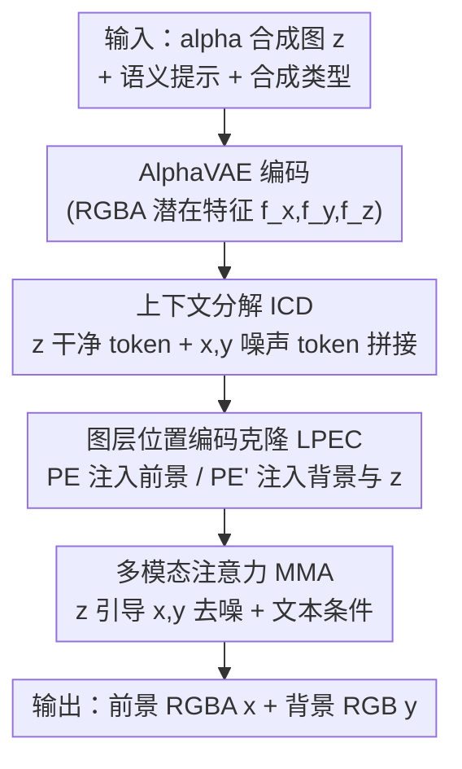

# DiffDecompose: Layer-Wise Decomposition of Alpha-Composited Images via Diffusion Transformers

**会议**: CVPR 2026  
**论文**: [CVF Open Access](https://openaccess.thecvf.com/content/CVPR2026/html/Wang_DiffDecompose_Layer-Wise_Decomposition_of_Alpha-Composited_Images_via_Diffusion_Transformers_CVPR_2026_paper.html)  
**代码**: https://github.com/Wangzt1121/DiffDecompose  
**领域**: 图像恢复 / 扩散模型  
**关键词**: 图层分解, alpha 合成, 扩散 Transformer, 半透明去除, 上下文分解

## 一句话总结
针对玻璃、雾气、水印、X 光等半透明/透明遮挡场景，这篇论文把"从单张合成图里拆出前景层和背景层"重新定义成一个生成式后验推断问题，配套发布了首个大规模 AlphaBlend 数据集，并用扩散 Transformer 框架 DiffDecompose（核心是"上下文分解 ICD"+"图层位置编码克隆 LPEC"）实现无需掩码的多层分解，在多个去除/分解子任务上 RMSE 平均比次优方法低约 36%。

## 研究背景与动机

**领域现状**：图层式分解（layer-wise decomposition）是结构化图像分解的有力工具——把一张图拆成若干层，每层含前景物体、对应的 alpha matte 以及可能的深度顺序，从而对单层做精细控制，服务于视频生成、场景理解、图像编辑等下游任务。在扩散模型时代，这类可控生成/编辑能力被大量研究。

**现有痛点**：现有方法在半透明/透明场景下有两个硬伤。其一，**层级图像 inpainting 的局限**——基于掩码（mask）的方法只能处理"物体级"信息，一旦遇到需要"整图级掩码"的场景（如挡在整张图上的雨雾、镜头光晕、水印），它们彻底失效，因为根本框不出一个局部待修复区域。其二，**处理非线性图层的局限**——以往工作（如对象移除）大多面向不透明/实心物体，把合成简化成"像素覆盖"，忽视了透明玻璃、半透明细胞这类**非线性混合**：被遮挡区域的像素不是简单替换，而是多层的复杂非线性混叠，直接删掉"遮挡像素"再用邻域信息补画在物理上就是错的。

**核心矛盾**：作者把新任务命名为 **LDAC（Layer-Wise Decomposition of Alpha-Composited Images）**，要从单张合成图 $z$ 直接恢复背景层 $y$ 和带 alpha 的前景层 $x$，且不用任何掩码先验。但这个反问题**本质上是病态的**：颜色和透明度在层间高度纠缠，同一张 alpha 合成图通常对应多种"看起来都合理"的分解方式。两大具体挑战是——(1) **图层歧义 + 颜色与透明度耦合**：前景背景占据同一视觉平面，没有深度或边缘对比可供分离；(2) **缺大规模数据集**：现有数据多由 AI 生成，合成图与原始前景/背景存在像素级差异，导致分解从源头就学不准。

**本文目标 / 切入角度**：既然分解天然多解，就不要去"硬回归"一个唯一的 alpha matte，而是**承认它的多解性**——学习"给定观测合成图后，所有合理分解的后验分布"。

**核心 idea**：用一句话概括——**把图层分解从"确定性回归 alpha"改写成"条件扩散下的后验采样"**，再用上下文 token 拼接（ICD）让模型一次预测一层或多层、用位置编码克隆（LPEC）锁住层间像素对应关系。

## 方法详解

### 整体框架

DiffDecompose 要解决的是：输入一张 alpha 合成的 RGBA 图 $z\in\mathbb{R}^{H\times W\times 4}$，输出一对合理的分解——带 alpha 通道的前景 RGBA 图 $x$ 和 RGB 背景图 $y$，使得它们经某个（可能未知的）合成函数 $\mathcal{G}$ 还原后 $\mathcal{G}(x,y)\approx z$。和传统 inpainting 不同（后者靠掩码删像素再补像素），DiffDecompose 不需要显式掩码，而是把前景背景**作为一个整体联合预测**出来。

形式上，传统掩码 inpainting 建模的是 $p_\theta(\mathbf{y}\mid\mathbf{z},\mathbf{m})$（$\mathbf{m}$ 是待修复掩码），本质退化为"预测掩码区域内的像素"。本文则训练一个条件扩散模型，学习前景与背景的**联合后验**：

$$p_\theta(\mathbf{x},\mathbf{y}\mid\mathbf{z},\tau)=\int p(\mathbf{x},\mathbf{y}\mid\mathbf{z}_0)\,p_\theta(\mathbf{z}_0\mid\mathbf{z},\tau)\,d\mathbf{z}_0,$$

其中 $\tau$ 表示不确定的合成方式（blending type）。训练时假设有三元组 $(\mathbf{x},\mathbf{y},\mathbf{z})$，$\mathbf{z}=\mathcal{G}(\mathbf{x},\mathbf{y})$，模型学着采样出既语义合理、又在 $\mathcal{G}$ 下合成一致的分解对。

整个 pipeline 分两步走：**先**用 AlphaBlend 数据集微调 AlphaVAE，让它具备提取 RGBA（含 alpha 通道）潜在特征的能力；**再**用这个 AlphaVAE 分别编码前景 $x$、背景 $y$、合成图 $z$ 得到各自潜在特征 $f_x,f_y,f_z$，文本提示经冻结的 T5XXL 抽成文本特征 $f_t$。分解过程由 **ICD（上下文分解）** 实现——把 $z$ 的"干净条件 token"和 $x$、$y$ 的"噪声 token"沿序列维拼接，用双向注意力做条件生成；过程中 **LPEC（图层位置编码克隆）** 保证特定层与原图的像素级一致，**MMA（多模态注意力）** 负责图像/文本不同模态间的交互。推理时直接把观测图 $z$ 喂进模型，输出分解后的 $x$ 和 $y$。

### 关键设计

**1. 后验分解重构：把"回归 alpha"改成"采样合理分解"**

针对的痛点是 LDAC 的病态性——颜色和透明度纠缠，一张合成图有多种合理分解，强行回归唯一 alpha matte 既学不准也不符合物理。作者的做法是放弃确定性回归，转而训练条件扩散模型去逼近联合后验 $p_\theta(\mathbf{x},\mathbf{y}\mid\mathbf{z},\tau)$（见上式），让模型在给定观测图、语义提示、合成类型的条件下，**采样**出一对在合成函数 $\mathcal{G}$ 下自洽的前景/背景。这样做的好处是：合成函数 $\mathcal{G}$ 在实践中常常未知且非线性（从简单 alpha 混合到加法/屏幕模式都有），与其去逆推那个未知算子，不如让扩散模型从数据里学到"什么样的分解既语义合理又能合回原图"。这是全文的方法基调，后面两个设计都是为它服务的具体机制。

**2. 上下文分解 ICD：用 token 拼接 + 双向注意力一次拆出多层**

针对的痛点是——既要无掩码、又要能一次预测单层或多层，还不能给每一层都准备显式监督。ICD 把分解当成"上下文感知的空间分离"问题：把合成图 $z$ 的**干净条件 token** 和前景 $x$、背景 $y$ 的**噪声 token** 沿序列维拼接，用双向（bidirectional）注意力做条件生成，使干净的 $z$ token 去引导 $x$、$y$ 噪声 token 的生成，同时噪声 token 又能依据上下文被反复精修。具体由 MMA 实现，对拼接序列 $[\tilde{c}_z;\tilde{c}_x;\tilde{c}_y;c_T]$ 做联合注意力：

$$\mathrm{MMA}\big([\tilde{c}_z;\tilde{c}_x;\tilde{c}_y;c_T]\big)=\mathrm{softmax}\!\Big(\frac{QK^\top}{\sqrt{d}}\Big)V,$$

其中 $Q,K,V$ 是拼接序列的投影，$c_T$ 是任务提示词抽出的文本 token（提示里会显式描述"三张子图：<image-1> 透明玻璃、<image-2> 餐厅场景、<image-3> 前两者的叠加"，引导模型理解层间关系）。关键巧思在于把背景 $y$ 维持在**无噪声状态**，从而保留原图的高频纹理和细节、避免迭代去噪过程中的退化。这种"每个 token 同时看前后 token"的互注意力，让分解出的各层在语义上与输入条件保持一致，且不需要对每一层单独打监督标签——这正是"in-context"的含义：靠上下文 token 而非逐层 GT 来驱动分解。

**3. 图层位置编码克隆 LPEC：用正交位置编码切断层间纠缠**

针对的痛点是——透明/半透明合成里前景背景**空间上重叠**但语义和透明度不同，若不加约束，注意力会把两层特征混在一起（实验里表现为人脸颜色串到车身、玻璃层串色）。LPEC 的做法是从合成图 $z$ 生成两套位置编码 $\mathrm{PE}$ 和 $\mathrm{PE}'$，分别注入不同层的 token：

$$\tilde{c}_x=c_x+\mathrm{PE},\quad \tilde{c}_y=c_y+\mathrm{PE}',\quad \tilde{c}_z=c_z+\mathrm{PE}'.$$

也就是前景 $x$ 用 $\mathrm{PE}$，背景 $y$ 和合成图 $z$ 共用 $\mathrm{PE}'$。这样背景与合成图共享同一坐标系，满足 $\forall(i,j)$，$\tilde{c}^{(i,j)}_y-\tilde{c}^{(i,j)}_z=c^{(i,j)}_y-c^{(i,j)}_z$，即在注意力计算中**保持背景相对合成图的相对位置结构不变**；而前景被分到一个独立的位置编码空间，且让两套编码正交 $\mathrm{PE}\perp\mathrm{PE}'$。"克隆"的含义就是把 $z$ 的位置编码复制给 $y$，让背景去对齐原始观测的像素坐标；前景则被推到一个不同的位置子空间，从而被鼓励保持自己语义和空间的独立性。这一招直接缓解了层间特征串扰，是消融里掉点最猛的模块（去掉后 X 光分解 RMSE 从 3.89 暴涨到 16.54）。

### 损失函数 / 训练策略

实现上分两段训练：先以预训练 AlphaVAE 为初始化，用 AlphaBlend 的前景数据微调 30,000 步，让 VAE 学会编码带 alpha 的 RGBA 特征；再用整套 AlphaBlend 数据、以 LoRA（rank=128）微调 Flux 架构 30,000 步，batch size=1、学习率 $10^{-4}$，单张 H20 GPU。T5XXL 文本编码器全程冻结。

## 实验关键数据

### 主实验

在自建 AlphaBlend 数据集（每个 LDAC 子任务 500 张测试图）和公开 LOGO 数据集（LOGO-H/L/G 三个基准）上对比。下表为 LOGO 三基准的主结果（部分代表性指标）：

| 数据集 | 指标 | Inpaint Anything | SDXL-inpainting | 本文 (DiffDecompose) |
|--------|------|------------------|------------------|----------------------|
| LOGO-H | RMSE↓ | 4.8252 | 8.1936 | **3.2321** |
| LOGO-H | SSIM↑ | 0.9849 | 0.9781 | **0.9923** |
| LOGO-H | LPIPS↓ | 0.0143 | 0.0302 | **0.0092** |
| LOGO-L | RMSE↓ | 3.0461 | 4.9184 | **2.1655** |
| LOGO-G | RMSE↓ | 3.8823 | 6.3711 | **2.7940** |

AlphaBlend 六个真实子任务（前景/背景恢复，代表性指标 RMSE↓ / FID↓）：

| 子任务 | 指标 | 次优 (Inpaint Anything) | 本文 |
|--------|------|--------------------------|------|
| 半透明水印去除 | RMSE↓ | 11.5273 | **2.9976** |
| 半透明水印去除 | FID↓ | 34.58 | **10.89** |
| 半透明细胞分解 | RMSE↓ | 3.3028 | **2.4467** |
| X 光违禁品分解 | RMSE↓ | 4.8260 | **3.8903** |
| 透明光晕去除 (Flare) | FID↓ | 462.58 | **23.15** |
| 半透明遮挡去除 | FID↓ | 477.38 | **43.12** |

综合来看，本文相对次优方法平均 RMSE 降低 36.3%、SSIM 提升 1.2%、LPIPS 降低 52.8%；在 X 光违禁品、整图半透明遮挡这类难场景上 RMSE 可低至基线的约 1/4、LPIPS 约 1/3。唯一略逊的是 LOGO-L 的 FID（24.20 vs 23.71），作者解释为 LOGO-L 高度结构化、对掩码友好，但本文是**无掩码**且结构精度（RMSE/SSIM/LPIPS）仍全面更优。尤其在雨/光这类"挡满整张图"的全局遮挡上，掩码类 inpainting 基本失效，本文无需掩码仍能拆开。

### 消融实验

两个核心模块各做一组消融（前景看 AlphaBlend/AlphaVAE 微调，背景看 LPEC）：

| 配置 | 子任务 | RMSE↓ | SSIM↑ | LPIPS↓ |
|------|--------|-------|-------|--------|
| w/o LPEC | X 光违禁品 | 16.5379 | 0.7922 | 0.0489 |
| **Full** | X 光违禁品 | **3.8903** | **0.9882** | **0.0049** |
| w/o LPEC | 透明玻璃 | 24.6044 | 0.7361 | 0.0694 |
| **Full** | 透明玻璃 | **7.9938** | **0.9759** | **0.0130** |
| w/o AlphaBlend 微调 | 透明光晕 | 46.2439 | 0.3464 | 0.5840 |
| **Full** | 透明光晕 | **21.2585** | **0.6260** | **0.3988** |
| w/o AlphaBlend 微调 | 透明玻璃(前景) | 14.3666 | 0.9357 | 0.0579 |
| **Full** | 透明玻璃(前景) | **13.5008** | **0.9495** | **0.0578** |

### 关键发现

- **LPEC 贡献最大**：去掉它，难度最高的 X 光违禁品分解 RMSE 从 3.89 飙到 16.54、透明玻璃从 7.99 飙到 24.60，并伴随明显的层间串色（人脸颜色串到车身）。说明正交位置编码确实是切断颜色/透明度纠缠的关键。
- **ICD 决定能不能"分解"**：完全去掉 ICD 后，框架退化成普通 inpainting，只能补背景、无法输出多层。对整图级的雨/光遮挡，掩码类方法无论怎么调强度/改提示都改不动，ICD 的联合分解是质变。
- **AlphaVAE 微调对"带色前景"尤其重要**：物体级遮挡上 RMSE 仅改善约 0.39~0.87，但迁移到图像级遮挡时，纯色前景（雾）改善 9.47、带色前景（光晕）改善高达 24.99——印证 alpha 通道里的颜色纠缠会显著加大分解难度。未微调时分解层出现明显色偏、饱和度下降（小透明物整体发青、光晕带发灰）。

## 亮点与洞察

- **把"病态分解"正面当成生成问题**：不去和未知非线性合成算子 $\mathcal{G}$ 死磕逆运算，而是学后验、采样合理解，这个视角转换是全文最优雅的一步，可迁移到其他多解性强的逆问题（去反射、去阴影、本征图像分解）。
- **位置编码克隆是个轻量却高杠杆的 trick**：仅靠让背景"克隆" $z$ 的位置编码、前景用正交编码，就在注意力层面把两层空间解耦，几乎零额外参数却带来最大消融落差，思路可复用到任何"空间重叠但语义需分离"的多层生成任务。
- **保持背景层无噪声**：在去噪过程里让条件分支始终干净，从而锁住高频细节，这个细节对避免迭代退化很实用。
- **数据集本身是贡献**：AlphaBlend 覆盖六类半透明/透明场景、每域约 5k–10k 训练 + 300–500 测试图，且每个子任务给出明确的物理合成公式（X 光的累积变暗、玻璃的折射高光、细胞的加法叠加等），填补了该方向真实数据的空白。

## 局限与展望

- **依赖合成数据的物理保真度**：AlphaBlend 由前景 alpha 图与背景按各子任务公式合成，虽比 AI 生成数据更接近真实物理，但和真实拍摄的透明/半透明场景仍可能有域差，论文未充分评估真实采集图上的泛化。
- **结构化、掩码友好场景非其强项**：LOGO-L 上 FID 略逊于掩码类方法，说明在前景边界清晰、可精确框选的场景，无掩码生成式分解未必占优。
- **合成类型 $\tau$ 需作为条件给定**：方法以 blending type 作为条件输入，对完全未知合成方式的真实图像，如何自动推断 $\tau$ 仍是开放问题。
- **计算成本与采样不确定性**：基于扩散 Transformer + LoRA 微调 Flux，推理是多步去噪；且后验采样意味着同一输入可能得到不同分解，下游若需确定性输出还需额外约束。⚠️ 论文未报告推理耗时，以原文为准。

## 相关工作与启发

- **vs 掩码 inpainting（SDXL-inpainting / Inpaint Anything / ClipAway）**：它们靠掩码删区域再补像素，擅长物体级、局部、不透明遮挡，但遇到整图级半透明（雨、光、水印）就框不出区域、彻底失效；本文无掩码、把前景背景联合分解出来，整图级场景上 RMSE/LPIPS 大幅领先。
- **vs 不透明物体的图层分解（如以往 layer decomposition 工作）**：以往把合成简化成像素覆盖、面向实心物体，忽略非线性混合；本文显式建模非线性 alpha 合成的后验，能处理透明玻璃、半透明细胞这类颜色透明度耦合的难例。
- **vs OminiControl 等无噪声条件方法**：受其"无噪声条件注入"启发，本文把对象遮挡和图层分解统一改写成"给定合成图的层后验"概率生成问题，从而既能处理物体级/通道级遮挡，也能啃下更难的层级半透明。
- **vs 视觉 In-Context Learning（物体编辑/区域操作）**：以往上下文学习用于物体插入、风格迁移，没人做过图层分解；本文首次把 in-context 思路用于"无逐层监督的多层推断"，并加 LPEC 保证层间空间对齐。

## 评分
- 新颖性: ⭐⭐⭐⭐⭐ 提出全新 LDAC 任务 + 后验分解视角 + 首个大规模 AlphaBlend 数据集，三者都是从 0 到 1。
- 实验充分度: ⭐⭐⭐⭐ 六子任务 + LOGO 三基准 + LPEC/ICD/AlphaVAE 三组消融较充分，但缺真实采集图泛化与效率分析。
- 写作质量: ⭐⭐⭐⭐ 任务动机和方法脉络清晰，公式与图配合到位；个别合成公式排版有 OCR 噪声需对照原文。
- 价值: ⭐⭐⭐⭐⭐ 同时给出新任务、新数据、新方法，对透明/半透明编辑与图层分解方向有较强奠基意义。

<!-- RELATED:START -->

## 相关论文

- [\[ICLR 2026\] Analyzing the Training Dynamics of Image Restoration Transformers: A Revisit to Layer Normalization](../../ICLR2026/image_restoration/analyzing_the_training_dynamics_of_image_restoration_transformers_a_revisit_to_l.md)
- [\[CVPR 2026\] Life-IQA: Boosting Blind Image Quality Assessment through GCN-enhanced Layer Interaction and MoE-based Feature Decoupling](life-iqa_boosting_blind_image_quality_assessment_through_gcn-enhanced_layer_inte.md)
- [\[CVPR 2025\] DPIR: Dual Prompting Image Restoration with Diffusion Transformers](../../CVPR2025/image_restoration/dpir_dual_prompting_restoration_dit.md)
- [\[CVPR 2026\] HDW-SR: High-Frequency Guided Diffusion Model based on Wavelet Decomposition for Image Super-Resolution](hdw-sr_high-frequency_guided_diffusion_model_based_on_wavelet_decomposition_for_.md)
- [\[CVPR 2026\] Disentanglement-wise Image Dehazing through Cross-Domain Manifold Consensus](disentanglement-wise_image_dehazing_through_cross-domain_manifold_consensus.md)

<!-- RELATED:END -->
