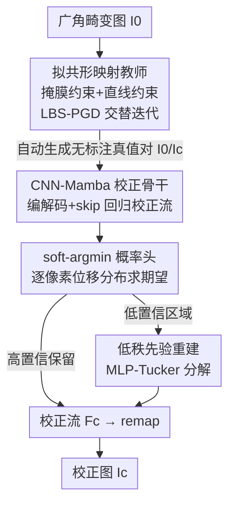

# Distilling Quasi-Conformal Mapping: A Generalizable and Efficient Solution for Wide-Angle Correction

**会议**: CVPR 2026  
**论文**: [CVF Open Access](https://openaccess.thecvf.com/content/CVPR2026/html/Liu_Distilling_Quasi-Conformal_Mapping_A_Generalizable_and_Efficient_Solution_for_Wide-Angle_CVPR_2026_paper.html)  
**代码**: 无  
**领域**: 图像恢复 / 低层视觉  
**关键词**: 广角畸变校正, 拟共形映射, 几何知识蒸馏, 人体畸变, Mamba  

## 一句话总结
用拟共形映射（QC mapping）作"教师"自动生成无标注的广角校正流真值，再蒸馏给一个 CNN-Mamba 学生网络 QDWC-Net 直接预测校正流，既摆脱人工标注、又把单图推理从 26.33s 压到 0.81s（32× 加速），在人体畸变校正上取得 SOTA。

## 研究背景与动机
**领域现状**：智能手机广角镜头能拍下更大场景，但会把直线拍弯、把画面边缘的人拍得不自然地拉伸。已有校正方法分两类——几何变换类（径向函数拟合、立体投影、透视投影、最小二乘共形映射 LSCM）和深度学习类（Tan 等的首个监督 CNN、Zhu 等的半监督 Transformer）。

**现有痛点**：几何类方法**可解释、数学严谨，但畸变模式僵硬且计算极慢**——例如共形映射（LSCM）刚性太强，对复杂图像处理效果不佳；深度学习类方法**快，但被高质量标注的稀缺性卡死**——人工把直线和人像逐张校正"昂贵、繁琐、还容易标不准"，真值一旦不精确就直接拖垮校正效果。更关键的是，**绝大多数方法只盯着人脸畸变，人体（身体比例）畸变几乎没人碰**。

**核心矛盾**：几何方法的"高保真但慢" 与 深度方法的"快但缺标注" 是一对天然 trade-off；而拟共形映射相比刚性的共形映射，恰好提供了一个"覆盖所有有界局部畸变的同胚映射"的柔性几何工具，可解释又灵活，但单独用它太慢。

**本文目标**：(1) 不要人工标注就能得到高质量校正真值；(2) 把几何方法的高保真"装"进一个快网络里；(3) 把没人解决好的人体畸变也校正好。

**切入角度**：作者主张——把传统几何变换和深度网络**组合**起来能兼得两者之长。具体地：让慢但精确的 QC 映射当"教师"自动造数据，再把它的几何知识"蒸馏"给一个快网络当"学生"。

**核心 idea**：把广角校正首次形式化为"带直线约束与人体掩膜约束的最优拟共形映射求解"，用 Beltrami 系数度量几何畸变场；用这个无标注教师批量生成真值图像对，蒸馏出端到端的 QDWC-Net 直接从畸变图回归校正流。

## 方法详解

### 整体框架
整个方法是一个清晰的两阶段教师–学生蒸馏管线。**第一阶段（教师，慢但精确）**：把校正建模成约束优化下的拟共形映射，用 Linear Beltrami Solver（LBS）和 Proximal Gradient Descent（PGD）交替迭代求解，在直线结构与人体区域两类约束下最小化 Beltrami 光滑能量，自动得到"原图–校正图"对，作为无标注真值。**第二阶段（学生，快）**：用这批真值监督训练 QDWC-Net——一个 CNN-Mamba 编解码骨干 + soft-argmin 概率回归头 + 低秩先验重建模块，直接从畸变图预测校正流（correction flow），再用该流 remap 原图得到校正结果。推理时学生网络比教师几何计算快 32×，且鲁棒性反而更强。

### 关键设计

**1. 拟共形映射教师：把校正写成带约束的 Beltrami 能量最小化，无标注自动造真值**

这一步直接对应"标注稀缺"的痛点——与其雇人逐张校正，不如用一个可解释的几何求解器自动产出高质量真值。作者把校正建模为求一个拟共形映射 $f:\mathbf{D}_1\to\mathbf{D}_2$，它由 Beltrami 方程刻画：$\frac{\partial f}{\partial \bar z}(z)=\mu(z)\frac{\partial f}{\partial z}(z)$，其中复值函数 $\mu(z)$ 是 **Beltrami 系数**，度量该点的局部几何畸变（$|\mu|<1$ 保证映射不折叠）。优化目标是最小化 Beltrami 光滑能量，即系数模长的 Dirichlet 能量：

$$E_s(\mu)=\int_{\mathbf{D}_1}\big\|\nabla|\mu(z)|\big\|^2\,\mathrm{d}z$$

让畸变场空间上平滑、保持近共形、防止折叠。在此之上挂两类约束：**人体约束**——用 Mask-NN（YOLOv13 框喂给 SAM 2）分割出人体区域 $\mathbf{O}_i$，要求该区域内映射服从预先算好的立体投影 $f_{st}$ 加一个未知平移 $\mathbf{t}_i$，即 $f(\mathbf{v})=f_{st}(\mathbf{v})+\mathbf{t}_i$，从而把人体比例校正到自然；**直线约束**——用 Line-NN（L-CNN）检测背景直线，强制线段上每点 $\mathbf{v}^k_j$ 被映到首尾映射点连成的直线上（投影约束，式 (4)），把弯线拉直。

**2. LBS-PGD 交替迭代求解：把"求映射"和"更新系数"拆成两个可解子问题轮流做**

直接解式 (5) 的约束优化非常困难，作者用交替优化迭代 $K$ 次。**映射估计（LBS）**：固定上一步系数 $\mu^{i-1}$，用 Linear Beltrami Solver 在掩膜/直线约束下解出满足几何约束的映射 $f^i$；**系数更新（PGD）**：固定 $f^i$，用近端梯度下降最小化光滑能量来更新系数——只更新模长、保留相位：

$$\big|\mu^i\big|=\operatorname{prox}^{\mu}_{E_s,\sigma}(f^i),\qquad \arg(\mu^i)=\arg(\mu(f^i))$$

其中近端算子是 $\arg\min_{0\le x<1}\frac{1}{2\sigma}\big\||\mu|-x\big\|^2+E_s(x)$。从 $\mu^0=0$ 出发反复迭代直到收敛，得到最终映射 $f^K$（即"校正流"），remap 原图得到校正图。这一对慢但精确的求解器（单图约 26.33s）正是后面学生要蒸馏的"老师"。

**3. CNN-Mamba 编解码骨干 + soft-argmin 概率头：用分布期望而非单点回归校正流**

学生网络要把上述几何知识学进一个快网络。骨干是对称的 CNN-Mamba 编解码器：输入图先下采样、卷积提特征、展平成 token 序列并加可学习位置编码，再过层数递减的 Mamba 堆叠（编码 ×16→×8→×4→×2、解码对称），中间层经 skip 融合高层语义与低层细节，最终卷积输出稠密 logit $\mathcal{P}_{Logit}\in\mathbb{R}^{H_0\times W_0\times 2D}$。关键之处在于**输出头不是直接回归一个位移值，而是为每个像素预测水平/垂直位移上的一个概率分布**（沿位移维 softmax 得 $\mathcal{P}_x,\mathcal{P}_y$），再对预定义位移坐标取期望得到流分量：

$$\hat{\mathbf{F}}_x=\mathbb{E}_{X\sim\mathcal{P}_x}[X]=\mathcal{P}_x\times_3\mathbf{x}_0,\qquad \hat{\mathbf{F}}_y=\mathcal{P}_y\times_3\mathbf{y}_0$$

这种"从样本位移频率估概率"的 soft-argmin 设计，让网络能显式建模校正流估计的内在不确定性——尤其对几何对应模糊、视觉线索不足的区域格外有用，也为下一步的低秩重建提供了置信度依据。

**4. 低秩先验重建：推理期对低置信区域用 Tucker 分解兜底，提升泛化**

仅在推理阶段加入。先用分布峰值算出置信图 $\mathbf{C}=[c_x,c_y]$（$c_x=\max_i\mathcal{P}_x[:,:,i]$）。对高置信区域直接保留 $\hat{\mathbf{F}}$ 的原始估计；对低置信区域，作者利用一个关键观察——**校正流真值本身是低秩的**（前 4 个奇异值就占了 99.24% 的总能量，相邻位移强相关）。于是用 MLP-based Tucker 分解重建低置信区域，优化目标为

$$\min_{\theta_h,\theta_w,\mathcal{G}}\big\|\mathbf{C}\odot\big(\mathbf{F}_{\text{lowr}}(\theta_h,\theta_w,\mathcal{G})-\hat{\mathbf{F}}\big)\big\|_1$$

在高置信区保持与原估计一致、在低置信区允许柔性调整，整体维持流场的低秩结构。这一步是学生"鲁棒性反超教师"的来源：它用全局低秩先验把网络在难区域的乱猜拉回到平滑合理的解上。

### 损失函数 / 训练策略
混合多级监督，总损失（式 15）由三部分组成：

$$L_{\text{total}}=\underbrace{\gamma_1\mathcal{L}_{\text{flow},\mathcal{S}}+\gamma_2\mathcal{L}_{\text{flow},2}}_{L_{\text{flow}}}+\underbrace{\gamma_3\mathcal{L}_{\text{img},\mathcal{S}}+\gamma_4\mathcal{L}_{\text{img},2}}_{L_{\text{img}}}+\underbrace{\gamma_5\big(1-\operatorname{SSIM}(\hat I_c,I_c^*)\big)}_{L_{\text{ssim}}}$$

- **Flow loss**：直接监督校正流，含 Sobel 梯度 L1 损失（$\mathcal{L}_{\text{flow},\mathcal{S}}$）与逐像素 L2 损失（$\mathcal{L}_{\text{flow},2}$）。
- **Image loss**：监督 remap 后的校正图，同样是 Sobel L1 + 像素 L2。
- **SSIM loss**：监督校正结果的结构相似度。

权重 $\{\gamma_1..\gamma_5\}=\{0.3,0.45,0.6,4.0,0.3\}$。训练用 5000 顶点三角网格离散、$\sigma=0.16$、$K=5$ 次 LBS-PGD 迭代生成真值；网络在 4×RTX 3090 上训 15 epoch（前 10 epoch lr=2e-4，后 5 epoch 线性衰减到 0），Adam 优化，$H_0=W_0=488$、$D=50$、Mamba 状态维 16、扩张因子 2。

## 实验关键数据

### 主实验
在 Tan 的测试集（129 张、5 款手机）上对比已有方法（LineAcc 评直线平直度↑、FaceAcc 评人脸形状一致性↑、BodyAcc 为本文新提人体形状一致性↑、Latency 单图延迟↓）：

| 方法 | LineAcc ↑ | FaceAcc ↑ | BodyAcc ↑ | Latency ↓ |
|------|-----------|-----------|-----------|-----------|
| Original（未校正） | 67.092 | 97.455 | 97.434 | – |
| Carroll [3]（TOG'09，用户引导优化） | 69.197 | 96.944 | 95.933 | 48.84 s |
| Shih [27]（TOG'19，立体+透视） | 68.316 | 97.935 | 97.637 | 11.56 s |
| Yao [35]（ECCV'24，生成+几何先验，需 FFHQ/CelebA-HQ 额外训练） | **70.721** | 98.536 | 97.081 | 22.30 s |
| **QDWC-Net（本文，无标注）** | 70.299 | **98.619** | **97.843** | **0.81 s** |

FaceAcc、BodyAcc 双第一，LineAcc 第二（仅次于用了额外人脸数据集的 Yao），而延迟只有 Yao 的 1/27。从蒸馏角度看，学生把推理延迟相对教师几何计算降低 96.92%（0.81s vs 26.33s）。

在 Zhu 数据集上验证泛化（5000 张未标注、4 款不同手机，作者手标 204 张做测试）：

| 方法 | LineAcc ↑ | FaceAcc ↑ | BodyAcc ↑ |
|------|-----------|-----------|-----------|
| Shih [27] | 88.127 | **99.428** | 92.239 |
| Yao [35] | 88.563 | 98.794 | 92.009 |
| **QDWC-Net（本文）** | **88.627** | 98.972 | **92.499** |

在完全未见过的数据集上仍 LineAcc/BodyAcc 双第一，说明把求解器用在 Tan 数据集上捕获的真实畸变模式能迁移到未见域；定性上本文人体比例更自然，别的方法常出现"一条腿比另一条粗"的不一致。

### 消融实验
作者在补充材料 C 给出定量消融，正文给出结论汇总：

| 配置 | 关键结论 | 说明 |
|------|----------|------|
| Full model | 最优精度+泛化、无额外计算开销 | 16 层 Mamba + 三损失 + 混合输出头 |
| 改 Mamba 层数 | 16 层为最佳折中 | 层数过少表达不足 |
| w/o 三损失之一（$L_{\text{flow}}/L_{\text{img}}/L_{\text{ssim}}$） | 三个定向损失各有贡献 | 多级监督提升精度与鲁棒 |
| w/o 输出头设计（soft-argmin + 低秩重建） | 泛化能力下降 | 混合头是泛化关键 |
| w/o 直线/人体约束（教师侧） | 定性变差（补充 C1） | 验证 QC 先验 + 两类约束的必要性 |

### 关键发现
- **学生反超教师**：蒸馏出的网络鲁棒性比慢速几何教师更强，得益于低秩先验重建对难区域的兜底——这是"快"之外的意外收益。
- **校正流的低秩性**是核心实验观察：前 4 个奇异值占 99.24% 能量，直接支撑了 Tucker 低秩重建的合理性。
- **人体畸变是本文主战场**：BodyAcc 在两个数据集上都第一，弥补了既有方法只顾人脸的空白。

## 亮点与洞察
- **用经典几何算法当"免费标注机"**：把昂贵的人工真值替换成可解释的拟共形求解器自动产出，思路可迁移到任何"有精确但慢的传统解法、却缺深度学习标注"的低层视觉任务。
- **soft-argmin 概率头 + 置信度驱动的低秩重建**配合巧妙：前者显式吐出不确定性，后者据此只在难区域动手并用低秩先验约束，避免破坏已经对的区域。
- **Beltrami 系数把"局部畸变"变成一个可优化的复值场**，让"直线约束+人体立体投影约束"能统一进同一个能量最小化框架里，这是几何建模的优雅之处。
- 新指标 **BodyAcc** 用 Fréchet 距离度量校正后人体轮廓与真值轮廓的一致性（式 16），填补了人体畸变缺乏量化指标的空白。

## 局限与展望
- 作者承认：校正质量受**直线/人体掩膜检测精度**影响，检测出错会传导到结果；未来想用更鲁棒的学习策略缓解检测误差。
- 面向手机端部署，计划探索剪枝、量化、MobileMamba 类架构以在极端资源约束下提速。
- 自己发现的局限：教师真值的"上限"取决于立体投影模板与 LBS-PGD 的几何假设，对那些立体投影本身就不适配的极端构图，学生学到的也只是教师的近似；消融大量放在补充材料、正文只给定性结论，定量幅度不够透明。

## 相关工作与启发
- **vs LSCM / 共形映射（Lévy、Zhang）**：他们用刚性共形映射，保角但畸变模式僵硬、慢；本文改用更柔的拟共形映射 + 蒸馏，既灵活又快。
- **vs Tan [30]（首个监督 CNN）**：Tan 需要人工逐张校正建数据集，昂贵难扩展；本文用 QC 教师无标注自动造数据。
- **vs Zhu [39]（半监督 Transformer）**：Zhu 仍需带标数据初始化，且对多样畸变类型泛化有限；本文全程无人工标注，泛化到未见手机数据集。
- **vs Yao [35]（ECCV'24，生成+几何先验）**：Yao 额外用 FFHQ/CelebA-HQ 训人脸校正网，本文不用任何额外标注就在 FaceAcc/BodyAcc 上反超，且快 27×。

## 评分
- 新颖性: ⭐⭐⭐⭐⭐ 首次把广角校正形式化为带直线/人体约束的最优拟共形映射，并以"几何教师蒸馏深度学生"的范式落地。
- 实验充分度: ⭐⭐⭐⭐ 两个数据集 + 多基线 + 新指标，但关键定量消融大多放补充材料，正文略显单薄。
- 写作质量: ⭐⭐⭐⭐ 两阶段动机—方法—实验衔接清晰，公式记号规范。
- 价值: ⭐⭐⭐⭐⭐ 无标注 + 32× 加速 + 人体畸变 SOTA，对手机广角校正落地很有吸引力。

<!-- RELATED:START -->

## 相关论文

- [\[CVPR 2026\] FastGaMer: Efficient GainMap Learning for Practical Inverse Tone Mapping](fastgamer_efficient_gainmap_learning_for_practical_inverse_tone_mapping.md)
- [\[CVPR 2026\] Towards Universal Computational Aberration Correction in Photographic Cameras: A Comprehensive Benchmark Analysis](unicac_universal_computational_aberration_correction_benchmark.md)
- [\[CVPR 2026\] VEMamba: Efficient Isotropic Reconstruction of Volume Electron Microscopy with Axial-Lateral Consistent Mamba](vemamba_efficient_isotropic_reconstruction_of_volume_electron_microscopy_with_ax.md)
- [\[ICLR 2026\] SoFlow: Solution Flow Models for One-Step Generative Modeling](../../ICLR2026/image_restoration/soflow_solution_flow_models_for_one-step_generative_modeling.md)
- [\[CVPR 2026\] IAFMNet: Information-Aware Feature Modulation for Efficient Super-Resolution](iafmnet_information-aware_feature_modulation_for_efficient_super-resolution.md)

<!-- RELATED:END -->
