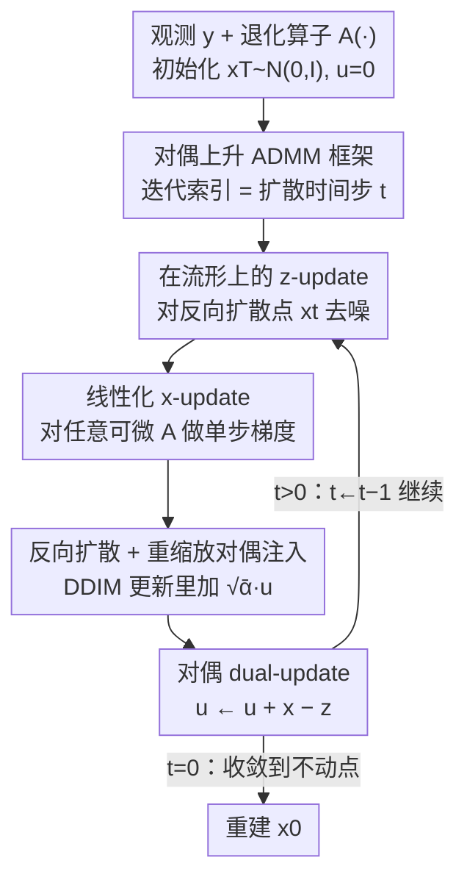

# Dual Ascent Diffusion for Inverse Problems

**会议**: CVPR 2026  
**论文**: [CVF Open Access](https://openaccess.thecvf.com/content/CVPR2026/html/Kim_Dual_Ascent_Diffusion_for_Inverse_Problems_CVPR_2026_paper.html)  
**代码**: 无  
**领域**: 图像复原 / 扩散模型  
**关键词**: 逆问题, 扩散先验, MAP, ADMM, 对偶上升

## 一句话总结
DDiff 把求解逆问题的 MAP 优化重新组织成 ADMM 式的对偶上升框架，用一个「停留在扩散流形上」的去噪步替换掉朴素 plug-and-play 的离流形去噪，让预训练扩散先验既保住数据一致性又不引入幻觉，在超分/去模糊/相位恢复等 8 类任务上比 SOTA 更准、更抗噪、更快。

## 研究背景与动机

**领域现状**：逆问题（从带噪、退化的观测 $y$ 反推干净信号 $x$）在天文、医学成像、相位恢复里无处不在。给定退化算子 $A(\cdot)$ 和噪声模型，求解器要么找最大后验解（MAP），要么从后验 $p(x|y)\propto p(y|x)p(x)$ 采样。由于问题严重欠定，先验 $p(x)$ 是成败关键。预训练扩散模型作为强先验，是近两年的主流选择。

**现有痛点**：两条主流路线各有硬伤。① **后验采样**（DPS、DAPS 等）必须近似条件得分 $\nabla_x\log p(y|x_t)$，而 $p(y|x_t)=\mathbb{E}_{x_0\sim p(x_0|x_t)}[p(y|x_0)]$ 这个条件期望蒙特卡洛估计计算上不可行，只能用 Dirac delta 之类粗糙近似，误差沿采样轨迹累积；DAPS 虽然加 MCMC 平衡步缓解，但仍受限于近似 $p(x_0|x_t)$ 和有限 MCMC 步数。② **MAP 优化**（DiffPIR、DCDP、PnP-DM）大多建在半二次分裂（HQS）上，**缺少对偶变量**，无法跨迭代累积「约束违背量」，在测量一致性吃紧的难任务上残差大、容易幻觉。

**核心矛盾**：扩散先验只在**对应时刻的扩散流形上**才准确——score 网络 $s_\theta(x,t)$ 只在 $p_t$ 上采样的点训练过，一旦输入离流形（$p_t(x)\approx 0$）就给出糟糕的得分。而经典 ADMM 的 z-update 要去噪 $x+u$，这个点几乎一定不在流形上。于是「想用 ADMM 的对偶变量提升数据一致性」和「扩散去噪器只在流形上可靠」直接打架。

**本文目标**：(1) 在 MAP 框架里引入对偶变量来提升测量一致性、压低幻觉；(2) 同时让每次喂给扩散去噪器的输入都落在流形上；(3) 让 x-update 对任意可微前向模型（线性/非线性都行）通用。

**核心 idea**：把 MAP 求解写成 ADMM 对偶上升，但把 z-update 从「去噪离流形的 $x+u$」改成「在标准反向扩散得到的流形点 $x_t$ 上去噪，并把对偶变量 $u$ 重新缩放后注入反向扩散更新」——对偶变量带来的约束信息保留了，但去噪器始终在它擅长的流形上工作。作者把这个方法称为 DDiff。

## 方法详解

### 整体框架
DDiff 求解 $x_{\text{MAP}}=\arg\min_x \frac{1}{2\sigma^2}\|y-A(x)\|_2^2 - \log p(x)$。沿用 ADMM 的变量分裂：引入松弛变量 $z$ 和约束 $x=z$，把数据保真项 $-\log p(y|x)$ 与对数先验项 $-\log p(z)$ 拆开，再引入对偶变量 $u$ 构造增广拉格朗日。整个算法在每一步迭代里交替做**三件事**——x-update（数据匹配）、z-update（扩散去噪）、dual-update（更新对偶变量），并且**让 ADMM 迭代索引和扩散时间步绑定相等**：$t$ 从 $T$ 一路降到 $0$，迭代结束就得到重建 $x_0$。随着迭代推进，原始变量 $x$ 与 $z$ 逐渐对齐、对偶变量 $u$ 衰减趋零，收敛到不动点 $(x^*,z^*,u^*)$——作者证明了这是扩散后验优化方法里**首个不动点收敛证明**（Theorem 1，不要求先验凸）。

### 关键设计

**1. 对偶上升取代半二次分裂：让约束违背量跨迭代累积**

现有扩散 MAP 方法（DiffPIR、DCDP、PnP-DM）都建在 HQS 上，只有 $x$、$z$ 两个原始变量、没有对偶变量，因此每次迭代里「测量约束 $x=z$ 没满足多少」这个信息当场丢掉、不往后传。DDiff 改用 ADMM：从增广拉格朗日
$$\mathcal{L}_\rho(x,z,u)=\tfrac{1}{2\sigma^2}\|y-A(x)\|_2^2 - \log p(z) + \tfrac{\rho}{2}\|x-z+u\|_2^2 - \tfrac{\rho}{2}\|u\|_2^2$$
出发，对 $x,z,u$ 交替优化，其中对偶变量 $u\leftarrow u + x - z$ 正是 Lagrange 乘子，会把历次约束违背量 $(x-z)$ 累加起来反复施压。作者明确点出：**把 DDiff 的对偶更新去掉，就退化成 DiffPIR**（在合适的 $\sigma_t,\zeta_t$ 下，见原文 Appendix E）。这一步是「为什么在测量一致性吃紧的难任务上更好」的根因——对偶变量逼着解去更忠实地解释观测，残差 $\|y-A(x)\|_2^2$ 更接近零，幻觉更少。

**2. 在流形上的 z-update：对偶信息保留、去噪器不离流形**

这是本文最核心的方法贡献。朴素做法（作者命名 Diff-PnP-ADMM）是把扩散模型当一步去噪器，用 Tweedie 公式直接去噪 $x+u$：$z\leftarrow \frac{1}{\sqrt{\bar\alpha_t}}(x+u+(1-\bar\alpha_t)s_\theta(x+u,t))$。问题在于 $x+u$ 几乎一定**不在 $t$ 时刻的扩散流形上**，而 score 网络只在流形点上训练过，离流形时 $s_\theta$ 就是个坏估计，会注入高频伪影。DDiff 的修法是把去噪对象换成一个**显式构造在流形上的 $x_t$**：
$$z\leftarrow \tfrac{1}{\sqrt{\bar\alpha_t}}\big(x_t+(1-\bar\alpha_t)s_\theta(x_t,t)\big)$$
而 $x_t$ 由递归定义——以「预测的 $x_0$ 就是当前 $x$」做一次 DDIM 更新，**再把对偶变量 $u$ 重新缩放后加进去**：
$$x_{t-1}\leftarrow \underbrace{\sqrt{\bar\alpha_{t-1}}\,x+\sqrt{1-\bar\alpha_{t-1}-\sigma_t^2}\,\hat\epsilon+\sigma_t\epsilon}_{\text{DDIM 更新}}+\underbrace{\sqrt{\bar\alpha_{t-1}}\,u}_{\text{重缩放的 }u}$$
其中 $\hat\epsilon=(x_t-\sqrt{\bar\alpha_t}x)/\sqrt{1-\bar\alpha_t}$。这样一来，对偶变量带来的约束信息照样注入了系统，但喂给去噪器的点 $x_t$ 始终落在扩散流形上、$s_\theta$ 始终在它擅长的区域工作。把 $u$ 乘 $\sqrt{\bar\alpha_{t-1}}$ 是为了让它的信号幅度和 $x_{t-1}$ 对齐。

**3. 线性化 x-update：对任意可微前向模型通用**

原始 ADMM 的 x-update 是个最小二乘子问题 $\arg\min_x \frac{1}{2\sigma^2}\|y-A(x)\|_2^2+\frac{\rho}{2}\|x-z+u\|_2^2$，只有 $A$ 线性时才有闭式解。为了让方法对**非线性** $A$（相位恢复、非线性去模糊）也直接可用，DDiff 把它替换成对数据保真项的**单步梯度下降**（即 linearized ADMM）：
$$x\leftarrow v-\zeta\nabla_v\|y-A(v)\|_2^2,\quad v=z-u$$
$\zeta$ 是每步可调的步长。只要 $A$ 可微就能算梯度，于是同一套算法无缝覆盖超分、inpainting、高斯/运动去模糊这些线性任务，以及相位恢复、非线性去模糊、HDR 这些非线性任务——这也是 DiffPIR/DDRM 这类方法做不到非线性任务的地方。

**4. 噪声步与对偶变量必须成对出现**

这不是独立模块，而是 (1)(2) 能成立的关键约束，也是消融的核心结论。单独加对偶变量（Diff-PnP-ADMM，有 $u$、无噪声步）反而比无对偶基线（Diff-PnP-HQS）更差：没有把去噪对象拉回流形时，$u$ 引入的高频伪影会破坏扩散去噪器。只有当对偶变量与 z-update 里的反向扩散噪声步（Eq. 12 把 $x_t$ 构造在流形上）**一起用**时，$u$ 才转为正向收益。换句话说，「对偶上升」和「在流形上去噪」是一个不可拆的组合——这是 DDiff 区别于「简单地给 PnP-ADMM 套个扩散去噪器」的本质。

### 损失函数 / 训练策略
DDiff **不训练任何网络**，直接复用预训练扩散模型（像素空间用 DPS/EDM 的预训练权重，latent 空间用 LDM-VQ4），整个方法是推理期优化。算法（Algorithm 1）每步顺序为：z-update（去噪）→ x-update（测量梯度步）→ 重算 $\hat\epsilon$ → 反向扩散得 $x_{t-1}$（$t>t_0$ 时加噪声、否则不加）→ dual-update。关键超参是每步步长 $\{\zeta_t\}$、噪声调度 $\{\sigma_t\}$ 和停止加噪时刻 $t_0$。作者还把框架扩到 latent 扩散得到 **LatentDDiff**，在压缩特征空间上交替做数据保真与去噪、保持对偶上升结构，进一步省显存/算力。

## 实验关键数据

### 主实验
FFHQ 256×256 与 ImageNet 256×256 各取 100 张验证图，噪声 $\sigma=0.05$，对比 DAPS / DMPlug / DCDP / RED-diff / DDRM / DPS / DiffPIR。指标含 PSNR↑、SSIM↑、LPIPS↓、Residual↓（残差 $\|y-A(x)\|_2^2-\sigma^2$，衡量数据一致性）。下表摘录 FFHQ 上几个代表任务（本文 vs 最强基线 DAPS）：

| 任务 (FFHQ) | 指标 | DDiff (本文) | DAPS | DPS |
|--------|------|------|------|------|
| 超分 4× | PSNR / Residual | **30.07** / **0.0028** | 29.34 / 0.0029 | 24.42 / 0.0050 |
| 随机 inpainting | PSNR / LPIPS | **33.08** / **0.050** | 30.76 / 0.156 | 30.79 / 0.083 |
| 相位恢复 | PSNR / LPIPS | **29.94** / **0.120** | 29.60 / 0.182 | 22.24 / 0.307 |
| 非线性去模糊 | PSNR / LPIPS | **31.48** / **0.120** | 28.45 / 0.188 | 25.39 / 0.258 |

DDiff 在绝大多数任务上领先，尤其在**感知相似度（LPIPS）和残差**上优势明显——说明它既好看又忠实于观测。少数任务（如 FFHQ 高斯/运动去模糊、HDR）PSNR 略逊 DAPS，但 Residual 普遍更低。

### 消融实验
对偶变量 $u$ 与噪声步（Eq. 12）的拆解，FFHQ 10 张图，统一 DDIM 调度公平对比：

| 配置 | 有噪声步 | 有对偶 u | 超分 4× PSNR | 随机 inpaint PSNR | 说明 |
|------|:---:|:---:|------|------|------|
| **DDiff (完整)** | ✓ | ✓ | **30.10** | **33.21** | 两者齐备，最优 |
| DDiff-HQS | ✓ | ✗ | 25.45 | 15.37 | 有流形去噪但无对偶 |
| Diff-PnP-ADMM | ✗ | ✓ | 13.79 | 16.79 | 有对偶但离流形去噪 |
| Diff-PnP-HQS | ✗ | ✗ | 14.04 | 15.85 | 朴素基线 |

**关键发现**：
- **对偶变量单独加反而有害**：Diff-PnP-ADMM（13.79）甚至不如无对偶的 Diff-PnP-HQS（14.04）——没有流形约束时，$u$ 注入高频伪影、毒化去噪器。
- **两个组件必须同用**：从 Diff-PnP-HQS（14.04）跳到完整 DDiff（30.10）才有质变，证明「对偶上升 + 流形去噪」是不可拆的整体。
- **抗噪性是亮点**：随测量噪声 $\sigma$ 增大，DDiff 的 PSNR 衰减比 DAPS 慢；在 $\sigma=0.3$ 的相位恢复极端噪声下，DDiff 把 LPIPS 压到 DAPS 的 1/3，仍能恢复出连贯的全局结构和人脸语义。
- **更快**：同样 NFE（神经函数评估次数）下 DDiff 感知质量更好且更快——省掉了 DAPS 里的 MCMC 平衡步，也减少了梯度反传需求。

## 亮点与洞察
- **「离流形」这个诊断切中要害**：把 PnP-ADMM 失败的原因精确归到「去噪器输入 $x+u$ 离流形」，再用「显式构造流形点 $x_t$ + 重缩放注入 $u$」对症下药，是很干净的因果分析，比单纯调参有解释力。
- **退化关系给得很诚实**：明确说「去掉对偶更新就退化成 DiffPIR」「DDiff-HQS 是另一种消融」，把自己摆进已有方法谱系里，让读者一眼看清贡献边界。
- **残差作为幻觉指标**：用 $\log p(y|x)$ / 残差度量生成先验引入的幻觉程度，这个视角可迁移——任何「拿生成模型当先验做重建」的任务都能用残差体检忠实度。
- **首个不动点收敛证明**：在不要求先验凸的前提下证明三条迭代序列都是 Cauchy 列，为扩散后验优化补上了理论缺口。

## 局限与展望
- **仍是 MAP 而非真采样**：作者明说不追求可证明地从后验采样，只解 MAP 单点解；需要后验多样性/不确定性量化的场景这套不直接给。
- **绑定 ADMM 步数 = 扩散时间步**：迭代索引与时间步设为相等是设计假设，步数预算被扩散调度长度框住，不同任务的最优步数怎么解耦没展开。
- **相位恢复仍不稳**：该任务要「5 次取最好」才报告，说明非线性难任务的稳定性仍是痛点。
- **超参较多**：$\{\zeta_t\}$、$\{\sigma_t\}$、$t_0$ 都要调，论文把细节塞进附录，复现成本不低。
- **展望**：作者点名扩到 3D / 视频等更高维数据，那里前向模型更复杂、显存更紧，正好检验 LatentDDiff 的价值。

## 相关工作与启发
- **vs DAPS**：DAPS 走后验采样路线，用 MCMC 平衡步缓解轨迹误差累积，但受限于近似 $p(x_0|x_t)$ 和有限 MCMC 步；DDiff 走 MAP 优化，无 MCMC、无须近似条件期望，因此同 NFE 更快、抗噪更强、残差更低，代价是不提供后验采样。
- **vs DiffPIR / DCDP / PnP-DM**：它们都是 HQS 式 MAP，无对偶变量；DDiff 把它们升级到 ADMM/对偶上升，去掉对偶更新就精确退化成 DiffPIR，是「自然超集」式扩展。
- **vs DPS**：DPS 用 Dirac delta 近似条件分布、沿轨迹一次性走完，误差累积明显（表中 PSNR 普遍落后 5+ dB）；DDiff 的迭代对偶校正显著改善忠实度。
- **vs DDRM / DiffPIR（线性专用）**：这两者未被证明能处理非线性任务，而 DDiff 的线性化 x-update 只要 $A$ 可微就通用，天然覆盖相位恢复、非线性去模糊。

## 评分
- 新颖性: ⭐⭐⭐⭐⭐ 把扩散 MAP 求解从 HQS 升级到对偶上升，并用「流形上去噪 + 重缩放注入对偶」化解离流形难题，思路干净且补上首个不动点收敛证明。
- 实验充分度: ⭐⭐⭐⭐ 8 任务 × 2 数据集 × 7 基线 + 像素/latent 双设定 + 抗噪与时效消融，较全；但每任务仅 100 图、相位恢复需取最好。
- 写作质量: ⭐⭐⭐⭐⭐ 从 ADMM 推导到失败诊断再到修法层层递进，退化关系和消融讲得很透。
- 价值: ⭐⭐⭐⭐ 即插即用、无需训练、对非线性任务通用、抗噪强，对医学/天文等高噪逆问题实用性高。

<!-- RELATED:START -->

## 相关论文

- [\[CVPR 2026\] PnP-CM: Consistency Models as Plug-and-Play Priors for Inverse Problems](pnp-cm_consistency_models_as_plug-and-play_priors_for_inverse_problems.md)
- [\[CVPR 2026\] Outlier-Robust Diffusion Solvers for Inverse Problems](outlier-robust_diffusion_solvers_for_inverse_problems.md)
- [\[CVPR 2026\] GSNR: Graph Smooth Null-Space Representation for Inverse Problems](gsnr_graph_smooth_null_space_representation_for_inverse_problems.md)
- [\[ICML 2026\] Triadic Dynamics Aware Diffusion Posterior Sampling for Inverse Problems: Optimizing Guidance and Stochasticity Schedules](../../ICML2026/image_restoration/triadic_dynamics_aware_diffusion_posterior_sampling_for_inverse_problems_optimiz.md)
- [\[CVPR 2025\] Variational Garrote for Sparse Inverse Problems](../../CVPR2025/image_restoration/variational_garrote_for_sparse_inverse_problems.md)

<!-- RELATED:END -->
