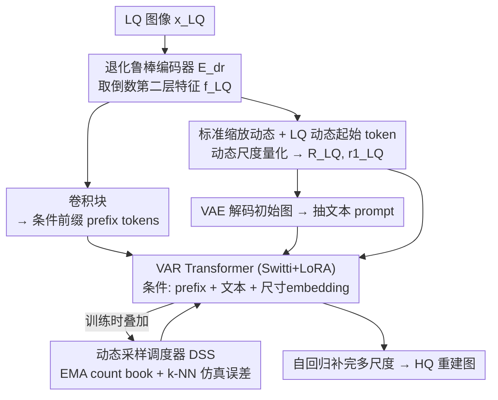

# DVAR: Dynamic Visual Autoregressive Modeling for Image Super-Resolution

**会议**: CVPR 2026  
**论文**: [CVF Open Access](https://openaccess.thecvf.com/content/CVPR2026/html/Zheng_DVAR_Dynamic_Visual_Autoregressive_Modeling_for_Image_Super-Resolution_CVPR_2026_paper.html)  
**代码**: https://github.com/YuZheng9/DVAR  
**领域**: 图像恢复 / 超分辨率 / 视觉自回归  
**关键词**: 视觉自回归(VAR), 真实图像超分(Real-ISR), 尺寸无关, next-scale prediction, 曝光偏差

## 一句话总结
DVAR 把视觉自回归（VAR）超分模型从「一个分辨率一套权重」的死板设计中解放出来：用一套**相对比例的标准缩放序列（canonical scaling dynamic）+ 由 LQ 图像导出的动态起始 token** 取代固定的 1×1 起点和绝对尺度表，再配一个几乎零开销的**动态采样调度器**缓解训练-推理失配，从而让单一模型处理任意尺寸输入，并在真实超分上取得 SOTA 的感知质量。

## 研究背景与动机
**领域现状**：真实世界图像超分（Real-ISR）目前由两大生成范式主导——GAN（Real-ESRGAN、BSRGAN）能合成锐利纹理但训练不稳、易出伪影；扩散模型（StableSR、SeeSR、SUPIR）靠强大生成先验合成逼真纹理，但多步迭代采样在全分辨率上反复跑、计算昂贵，加速采样又会丢纹理多样性。近期 VAR（视觉自回归，next-scale prediction）被视为第三条路：它先生成低频全局结构再补高频细节，天然保结构、且大多数生成步发生在低分辨率上，比扩散高效；VARSR 首次把 VAR 用于 ISR 并拿到 SOTA。

**现有痛点**：VARSR 继承了 vanilla VAR 的两个硬伤。其一是**尺寸依赖**——VAR 的生成过程永远从一个固定 1×1 起始 token 出发，但目标分辨率不同（256² vs 512²），就被迫为每个尺寸学一套**互不兼容**的缩放尺度表（比如中间尺度一个走 8²、一个走 13²），结果一套权重无法泛化到不同尺寸，每个分辨率都要单独训一个模型。其二是**曝光偏差**：训练用 teacher forcing（喂 ground-truth 前缀），推理却只能喂自己（可能有错）的预测，分布失配导致误差累积。

**核心矛盾**：作者点破——尺寸依赖的根源不在 VQ-VAE tokenizer（它的全卷积编解码器 + 最近邻量化本就尺寸自适应，不同 VAR 能共用同一套 VQ-VAE 权重就是证据），而在自回归生成过程**强行从 1×1 起步**。而 1×1 起步本身是从通用图像生成（text-to-image）继承来的「合成任务」遗产：从抽象信号「无中生有」造图，才需要从最小表示谨慎建内容。但 ISR 是**精炼任务**——把退化但信息丰富的图变好，LQ 输入本身就提供了大量结构和内容先验，硬塞一个信息稀缺的 1×1 起点不仅多余、而且次优。

**本文目标**：(1) 去掉 VAR 的尺寸绑定，让一个模型吃任意尺寸；(2) 在几乎不增开销的前提下缓解曝光偏差。

**核心 idea**：用「学一条相对缩放规则」代替「背一堆绝对尺度表」，并从 LQ 导出的动态 token 起步（而非 1×1），让早期尺度快速锁定全局结构、后期尺度专注精修纹理；同时利用视觉 token 在 codebook 里「几何邻近=语义相似」的特性，零成本模拟模型预测误差来弥合训练-推理鸿沟。

## 方法详解

### 整体框架
DVAR 的输入是 LQ 图像 $x_{\text{LQ}}$，输出是高质量重建图。流程是：先把 $x_{\text{LQ}}$ 过一个**退化鲁棒编码器** $E_{dr}$ 得到潜在特征 $f_{\text{LQ}}$；$f_{\text{LQ}}$ 一边经卷积块变成 VAR Transformer 的**条件前缀（prefix）token**，一边经**动态尺度量化**得到一串多尺度 token map $R^{\text{LQ}}=\{r_1^{\text{LQ}},\dots,r_K^{\text{LQ}}\}$，其中首图 $r_1^{\text{LQ}}$ 就充当生成的**动态起始 token**（而不是 vanilla VAR 的 1×1 静态起点）；$R^{\text{LQ}}$ 再经 VAE 解码出一张初始重建图，并从中抽出**文本 prompt** 作为额外语义条件。最后 VAR Transformer 在「prefix + 文本 prompt + 目标尺寸 embedding」的联合条件下，从 $r_1^{\text{LQ}}$ 起**自回归补完剩余尺度**。训练时这条链路再叠加**动态采样调度器**注入仿真误差以缓解曝光偏差。

### 关键设计

**1. 标准缩放动态 + LQ 导出的动态起始 token：用一条相对缩放规则换掉一堆绝对尺度表**

这是解尺寸依赖的核心。痛点在于 vanilla VAR 为每个目标分辨率背一套绝对的、互不兼容的尺度表，且总从 1×1 起步。DVAR 反过来：在一个基准分辨率 $(H_{\text{base}}, W_{\text{base}})=256\times256$ 上定义一条**标准尺度序列** $\{(h_k,w_k)\}_{k=1}^K$（论文取 $(1,2,3,4,5,6,8,10,13,16)$），对任意目标尺寸 $(H,W)$ 按比例缩放出该尺寸专属的调度：

$$\tilde{h}_k = \operatorname{round}\!\Big(\frac{H}{H_{\text{base}}}\cdot h_k\Big),\quad \tilde{w}_k = \operatorname{round}\!\Big(\frac{W}{W_{\text{base}}}\cdot w_k\Big).$$

这样**相邻尺度之间的相对放大比例在所有分辨率下保持一致**，单一模型就能泛化到可变甚至没见过的尺寸和长宽比。同时生成不再从 1×1 静态起点出发，而从 LQ 特征量化得到的 $r_1^{\text{LQ}}$ 起步——它已经编码了全局结构。两者合在一起重塑了每个尺度的角色：早期尺度快速稳定整体布局，后期尺度集中精修纹理边缘（论文 Fig.4 的多尺度可视化印证了这一点）。本质上是把「为每个分辨率学独立固定调度」的问题，重构成「学一条单一、可按比例适配的相对缩放规则」。

**2. 动态采样调度器（DSS）：用 codebook 的几何邻近零成本模拟预测误差**

这是缓解曝光偏差的设计。经典做法 Scheduled Sampling 需要一次完整前向才能拿到模型预测来替换 GT，开销高。DSS 抓住一个关键洞察：NLP 里的离散 token 没有内在语义拓扑，但**VQ-VAE 的视觉 token 嵌在一个特征空间里，几何邻近就意味着视觉相似**（最近邻量化保证了视觉相近的特征在 codebook 里也相近）。于是模型「最可能犯的错」就可以用 GT token 的 k 近邻来近似——这是一次近乎零成本的查表。

具体地，为每个生成尺度 $k$ 维护一本统计「计数书」$C_k\in\mathbb{R}^V$（$V$ 为 codebook 大小），记录模型历史上选中 GT token 第 $v$ 近邻的概率分布。每个训练步用 `RankCount` 算子统计「第 $v$ 近邻被选中」的频次并归一化，再用 EMA 更新：$C_k \leftarrow \beta\cdot C_k + (1-\beta)\cdot c_k$。前向时不再总喂 GT，而是按 $C_k$ 当前概率从 GT 的近邻集中**采样出一个「貌似合理的模型错误」token**，再以混合比例 $p$ 概率性地替换 GT 作为下一步输入。这等于在训练里注入了真实的、贴近推理分布的噪声，不需要额外前向就拉近了训练-推理差距。

**3. 退化鲁棒编码器 + Switti/LoRA 骨干 + 尺寸 embedding：让条件信号抗退化、改动非侵入、模型尺寸感知**

为了让条件信号对各种真实退化鲁棒，DVAR 沿用 SUPIR 的编码器适配策略微调 VAE 编码器得到 $E_{dr}$，但**取倒数第二层特征**而非最后一层（最后一层过度压缩、丢失了内容和退化相关信息）。$E_{dr}$ 用 L1 重建 + 特征 L2 一致 + LPIPS + GAN 的组合损失优化：

$$\|\mathcal{D}(\mathcal{E}_{dr}(x_{\text{LQ}})) - x_{\text{HQ}}\|_1 + \|f_{\text{LQ}}-\hat{f}_{\text{LQ}}\|_2 + \alpha\mathcal{L}_{\text{lpips}} + \beta\mathcal{L}_{\text{GAN}}.$$

主干选 SOTA 的 VAR 模型 Switti，用 LoRA（rank=16）参数高效微调。所有贡献都以**非侵入方式**实现：$f_{\text{LQ}}$ 作为 prefix token 注入条件，动态缩放调度通过生成**尺寸专属的注意力掩码**实现，再额外加一个编码目标输出尺寸的**尺寸 embedding**（借鉴 SDXL）进入 Transformer 交叉注意力，使模型显式尺寸感知。

### 损失函数 / 训练策略
两阶段训练：先用 VQGAN 同款损失只微调退化鲁棒编码器（AdamW，lr $1\times10^{-5}$）；再以预训练 Switti 为底用 LoRA 微调主 DVAR 模型，全程开启 DSS。为增强尺寸无关能力，用**随机裁剪增强**：HQ 随机裁到 256×256~512×512、对应 LQ 64×64~128×128。总 batch size 192，4 张 RTX 5880，AdamW，lr $5\times10^{-5}$，weight decay $5\times10^{-2}$。训练对用 Real-ESRGAN 退化管线合成；训练集为 LSDIR + FFHQ 前 1 万张。

## 实验关键数据

### 主实验
在 1 个合成基准（DIV2K-Val）+ 2 个真实基准（RealSR、DRealSR）上与 GAN / 扩散 / AR 三类 SOTA 对比。无参考感知指标（CLIPIQA、MANIQA、MUSIQ）是重点。

| 数据集 | 指标 | DVAR(本文) | VARSR(AR) | SeeSR(扩散) | 说明 |
|--------|------|-----------|-----------|------------|------|
| DIV2K-Val | CLIPIQA↑ | **0.7405** | 0.7347 | 0.6959 | 全场最高 |
| DIV2K-Val | MANIQA↑ | **0.5641** | 0.5340 | 0.5046 | 全场最高 |
| DIV2K-Val | MUSIQ↑ | 70.58 | 71.27 | 68.35 | 第二 |
| RealSR | CLIPIQA↑ | **0.7050** | 0.7006 | 0.6638 | 全场最高 |
| RealSR | MANIQA↑ | **0.5756** | 0.5570 | 0.5370 | 全场最高 |
| DRealSR | MANIQA↑ | **0.5653** | 0.5362 | 0.5077 | 全场最高 |
| DRealSR | CLIPIQA↑ | **0.7351** | 0.7240 | 0.6893 | 全场最高 |

DVAR 在三个基准上的 CLIPIQA、MANIQA 全部第一，MUSIQ 稳定第二，感知真实感强。参考类指标（PSNR/SSIM）上扩散方法和 AR–扩散混合的 VARSR 普遍更高，因为它们用连续 VAE 天然偏重建保真；DVAR 是纯 VQ 离散 AR，不可避免引入轻微 tokenization 误差，PSNR/SSIM 略低，但符合公认的感知-失真权衡，且 DVAR 在 LPIPS/DISTS/FID 上仍明显优于 VARSR。

### 消融实验

标准缩放动态 + 尺寸条件（RealLR200，含不同分辨率真实图）：

| 配置 | CLIPIQA↑ | MUSIQ↑ | MANIQA↑ | 说明 |
|------|---------|--------|---------|------|
| VARSR（vanilla 基线） | 0.7477 | 71.68 | 0.5758 | resize/resize-back 推理 |
| w/o size + 仅 512 训练 | 0.7531 | 71.89 | 0.5816 | 只在 512² 训仍超 VARSR |
| w/o size + 多分辨率训练 | 0.7621 | 72.59 | 0.5907 | 加多分辨率再涨 |
| w/ size（完整 DVAR） | **0.7767** | **73.17** | **0.6278** | 显式尺寸条件最强 |

动态采样调度器 DSS：

| 指标 | DIV2K w/o DSS | DIV2K Ours | RealSR w/o DSS | RealSR Ours |
|------|--------------|-----------|----------------|-------------|
| PSNR↑ | 22.34 | 22.49 | 23.65 | 23.72 |
| LPIPS↓ | 0.3295 | 0.3192 | 0.3305 | 0.3291 |
| MANIQA↑ | 0.5444 | 0.5641 | 0.5417 | 0.5756 |
| CLIPIQA↑ | 0.7152 | 0.7405 | 0.6756 | 0.7050 |

### 关键发现
- **标准缩放动态本身就有零样本泛化力**：哪怕只在 512² 上训、从没见过其他分辨率/长宽比，该变体也已超过 VARSR，说明「学相对缩放规则」而非「背绝对尺度表」是泛化的真正来源。
- **显式尺寸条件 > resize/resize-back**：完整 DVAR 在原生分辨率上直接更新特征并显式给尺寸线索，比 VARSR 那套先缩放再缩放回去的推理策略更有效。
- **DSS 对所有指标都正向**，尤其感知指标（MANIQA、CLIPIQA）提升明显，印证「用近邻仿真误差注入训练」确实缩小了 teacher forcing 的训练-推理失配、防止推理期误差累积。
- 多尺度可视化（Fig.4）显示 DVAR 在更早的尺度就建立了正确物体布局，剩余尺度「花在」精修纹理边缘，因此纯 AR 的 DVAR 比带扩散 MLP 的混合 VARSR 还更锐、更忠实。

## 亮点与洞察
- **「为什么必须从 1×1 起步」这一问的破题**很漂亮：把尺寸依赖归因到「自回归过程继承自图像合成范式的遗产」，而非 tokenizer，并用「不同 VAR 能共用 VQ-VAE 权重」反证，定位精准。生成 vs 恢复的「无中生有 vs 由次到好」之分，是整篇方法的哲学锚点。
- **用 codebook 几何邻近做零成本误差仿真**是个可迁移的 trick：任何带 VQ codebook 的自回归视觉模型，都能用 GT token 的 k-NN + EMA 计数书来模拟「模型会犯的错」，避免 Scheduled Sampling 的额外前向，思路可迁移到 VQ 系的视频/3D 自回归生成。
- **非侵入式改造**（prefix token + 尺寸专属注意力掩码 + 尺寸 embedding + LoRA）让方法能直接挂在现成 SOTA VAR 骨干（Switti）上，工程上很实用。

## 局限与展望
- **PSNR/SSIM 略逊**：纯 VQ 离散 AR 的 tokenization 误差让保真类指标低于连续 VAE 的扩散/混合方法，对追求像素保真的场景是劣势（作者归因于感知-失真权衡）。
- **依赖外部组件**：方法链路上挂了 LLM 抽文本 prompt、SUPIR 式编码器适配、Switti 骨干，整体系统较重，组件多带来的误差传播和复现成本未充分讨论。
- **canonical 序列是人工设定**：基准分辨率 256² 和尺度序列 $(1,2,3,4,5,6,8,10,13,16)$ 由经验给定，论文未消融不同 canonical 序列的影响，自动/自适应学习这条序列是可改进方向。
- **极端长宽比/超大尺寸**的外推边界没有充分压力测试，RealLR200 评测仍把长边压到 512 的受控范围内。

## 相关工作与启发
- **vs VARSR**: 同样用 VAR 做 ISR，但 VARSR 是 AR+扩散 MLP 的混合、仍固定尺寸、仍受曝光偏差困扰，推理靠 resize/resize-back；DVAR 是**纯 AR**、尺寸灵活、显式 DSS 抗曝光偏差，在 LPIPS/DISTS/FID 和感知指标上全面优于 VARSR，证明纯自回归路线可行。
- **vs 扩散类（StableSR/SeeSR/SUPIR/OSEDiff/PiSA-SR）**: 扩散从高斯噪声多步迭代、全分辨率采样，保真高但慢、加速掉质量；DVAR 大多数生成步在低分辨率、coarse-to-fine，效率更高，感知质量反超，但 PSNR/SSIM 让位于扩散的连续 VAE。
- **vs vanilla VAR / Switti**: 继承 next-scale prediction 的谱归纳偏置和效率，但把「固定 1×1 起点 + 绝对尺度表」换成「LQ 动态起点 + 相对缩放规则」，首次赋予 VAR 尺寸灵活性。

## 评分
- 新颖性: ⭐⭐⭐⭐⭐ 首个让 VAR 摆脱固定分辨率绑定的框架，对 1×1 起步的归因与破题有思想深度
- 实验充分度: ⭐⭐⭐⭐ 三基准 + 两组消融 + 尺寸泛化专项，但 canonical 序列、组件鲁棒性等消融缺
- 写作质量: ⭐⭐⭐⭐⭐ 动机推导（生成 vs 恢复）极清晰，图文对照到位
- 价值: ⭐⭐⭐⭐ 让纯 AR 超分变得尺寸实用，codebook 邻近误差仿真的 trick 可迁移

<!-- RELATED:START -->

## 相关论文

- [\[CVPR 2026\] Self-supervised Dynamic Heterogeneous Degradation Modeling for Unified Zero-Shot Image Restoration](self-supervised_dynamic_heterogeneous_degradation_modeling_for_unified_zero-shot.md)
- [\[CVPR 2026\] Toward Real-world Infrared Image Super-Resolution: A Unified Autoregressive Framework and Benchmark Dataset](real_iisr_infrared_image_super_resolution_autoregressive.md)
- [\[CVPR 2026\] Dynamic Exposure Burst Image Restoration](dynamic_exposure_burst_image_restoration.md)
- [\[CVPR 2026\] Task-Aware Image Signal Processor for Advanced Visual Perception](task-aware_image_signal_processor_for_advanced_visual_perception.md)
- [\[CVPR 2026\] Bridging the Perception Gap in Image Super-Resolution Evaluation](bridging_the_perception_gap_in_image_super-resolution_evaluation.md)

<!-- RELATED:END -->
