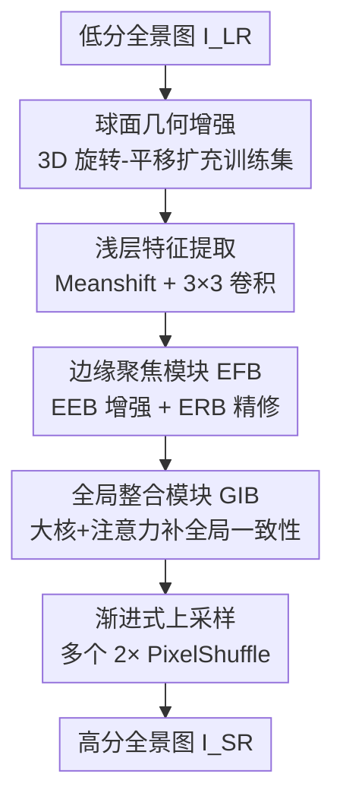

# Edge-Focused Super-Resolution for Omnidirectional Images with Spherical Geometric Augmentation

**会议**: CVPR 2026  
**论文**: [CVF Open Access](https://openaccess.thecvf.com/content/CVPR2026/html/Wang_Edge-Focused_Super-Resolution_for_Omnidirectional_Images_with_Spherical_Geometric_Augmentation_CVPR_2026_paper.html)  
**代码**: 待确认  
**领域**: 图像恢复 / 全景图像超分辨率  
**关键词**: 全景图像超分、边缘保持、球面几何增强、多尺度注意力、ERP

## 一句话总结
针对全景图像在 8×/16× 极端放大下「公开数据稀缺 + 边缘塌陷」两大痛点，本文提出一个端到端轻量网络 EAM：用边缘聚焦模块（EFB = 边缘增强 EEB + 边缘精修 ERB）和全局整合模块（GIB）强化边缘的捕获与全局一致性，并配一套基于球面投影的旋转-平移数据增强；在 ODI-SR / SUN360 上以约 2.0M 参数、38G FLOPs 取得超越现有 SOTA 的 WS-PSNR（ODI-SR 上比 FATO 高 1.15dB/1.13dB）。

## 研究背景与动机
**领域现状**：全景图像（ODI，常以等距柱状投影 ERP 存储）受存储、传输和带宽限制，往往是低分辨率的，但头显（HMD）用户需要高清细节，所以全景超分（ODISR）是刚需。单图超分（SISR）这些年靠 CNN（SRCNN/EDSR/RCAN）、GAN（SRGAN/ESRGAN）、ViT（IPT/SwinIR）、扩散模型（ResShift）一路推进；ODISR 则在此基础上额外处理投影畸变，主流两条路线是多投影融合（拼接球面/平面投影增大信息量）和区域自适应（用可变形卷积或按纬度分块来适配 ERP 的非均匀畸变）。

**现有痛点**：作者指出两个具体短板。第一，**数据稀缺**——ODISR 依赖的公开数据集只有约 1200 个样本，且缺乏能保持球面几何的增强手段；直接套用 2D 的旋转/平移会破坏球面拓扑，在赤道附近不自然拉伸、在两极压缩，产生边缘扭曲。第二，**边缘保持差**——现有方法没有专门的边缘聚焦设计，又因为网络结构复杂而普遍采用 patch / 区域级输入再拼接输出，导致 patch 之间出现明显接缝和边缘断裂（如 LAU-Net 的非重叠分块就会造成块间「faults」）。

**核心矛盾**：在 8×/16× 这种极端放大下，超分本质是从极少高频信息里恢复边界和轮廓，而 patch 拼接式架构和 2D 式增强都在系统性地损害边缘的连续性与几何一致性——放大倍率越高，这个损害越致命。

**本文目标**：(1) 在不破坏球面几何的前提下扩充训练数据多样性；(2) 设计一个端到端（不分块、不拼接）的轻量网络，把「边缘的局部修复」和「全局轮廓一致性」统一起来。

**切入角度**：全景图本质是 3D 球面场景的 2D 投影，像素遵循球面几何；因此增强应该回到 3D 球面坐标里做旋转/平移，而不是在 2D 平面上做。同时既然边缘是视觉语义的核心，就应该把网络设计的重心放在「边界保持与精修」。

**核心 idea**：用「球面 3D 旋转-平移增强」造数据 + 用「边缘聚焦的多尺度网络 EAM」端到端重建，避免分块拼接，专注修边缘。

## 方法详解

### 整体框架
方法由两块组成：**数据侧**的球面几何增强（离线扩充 ODI-SR 训练集），和**模型侧**的边缘感知多尺度网络 EAM（Edge-Aware Multi-Scale）。EAM 是一个端到端、不下采样的 pipeline：输入低分图 $I_{LR}\in\mathbb{R}^{3\times H\times W}$，先做浅层特征提取（去亮度偏置 + 3×3 卷积，保留原始空间结构和基础边缘）得到 $F_p$；再过级联的边缘聚焦模块 EFB（内部 = 边缘增强 EEB + 边缘精修 ERB）得到 $F_r$，把同尺度下的边缘从「局部修复」推到「细节精修」；接着用全局整合模块 GIB 扩大感受野、补全长程依赖得到 $F_l$，纠正级联 EFB 过度聚焦局部、缺乏全局关联的问题；最后用渐进式上采样（把目标倍率拆成多个 2× PixelShuffle + 3×3 卷积补高频）逐步放大并重建出 $I_{SR}\in\mathbb{R}^{3\times\alpha H\times\alpha W}$（$\alpha=8$ 或 $16$）。全程不做特征下采样，避免丢失对边界恢复至关重要的空间和边缘信息。

### 关键设计

**1. 球面几何旋转-平移增强：在 3D 球面里造数据，不破坏全景拓扑**

针对「数据稀缺 + 2D 增强破坏球面几何」这个痛点，作者不在 2D 平面上做旋转/平移，而是把 ERP 图先映射回 3D 球面再做几何变换。给定输入图 $I_i(u,v)$，按 ERP 性质把 2D 坐标转成方位角和极角 $\varphi_i=2\pi\frac{u}{W},\ \theta_i=\pi\frac{v}{H}$，再转为 3D 球面坐标 $x_p=\cos\varphi_i\sin\theta_i,\ y_p=\sin\varphi_i\sin\theta_i,\ z_p=\cos\theta_i$。然后用绕 X/Y/Z 轴的旋转矩阵 $R_x(\alpha),R_y(\beta),R_z(\gamma)$ 对整个场景做 3D 变换：

$$\begin{bmatrix}x_p'\\ y_p'\\ z_p'\end{bmatrix}=R\begin{bmatrix}x_p\\ y_p\\ z_p\end{bmatrix},\quad \varphi_i'=\operatorname{arctan2}(y_p',x_p'),\ \theta_i'=\arccos(z_p')$$

最后再映回 2D 图像空间 $u_p'=\frac{W}{2\pi}\varphi_i',\ v_p'=\frac{H}{\pi}\theta_i'$。设计上做了区分：**平移**实现为绕 Z 轴旋转 $\gamma\in[0,2\pi]$，**旋转**则只绕 X 轴 $\alpha$ 或 Y 轴 $\beta$ 且角度限制在 $[-\frac{\pi}{12},\frac{\pi}{12}]$ 的小范围。这样做之所以有效，是因为球面平移保留了 360° 环形结构、没有边缘截断或填充，球面旋转遵循球面几何、即便大角度旋转关键特征也不畸变；而传统 2D 平移/旋转会带来截断、padding、边缘扭曲和环形拓扑破坏。消融显示它把 ×8 的 WS-PSNR 从 24.70 提到 25.69。

**2. 边缘聚焦模块 EFB（EEB 增强 + ERB 精修）：先把模糊边缘「拉出来」再「修干净」**

针对「现有方法缺乏边缘聚焦设计」，EFB 把边缘处理拆成增强（EEB）和精修（ERB）两步级联，且全程保持同尺度特征。**EEB（Edge Enhanced Block）**解决低分图边缘模糊、普通卷积分不清真边缘的问题，用三条支路：多尺度特征提取支路用 3×3 卷积 + GELU 取基础特征，再用扩张率 1/2/3 的空洞卷积分别抓局部细边、物体轮廓、全局结构，拼接成 $X_{multi}$；边缘感知通道注意力支路把空间维池化到 1×1、聚焦通道维，算出 $A_c=\sigma(\text{Conv}_{1\times1}(\text{Conv}_{1\times1}(\text{Pool}(\text{Conv}_{3\times3}(X)))))$ 强化边缘相关通道；边缘感知空间注意力支路用 3×3 后接 7×7 大核把通道压到 1、聚焦空间维，得到 $A_s=\sigma(\text{Conv}_{7\times7}(\text{Conv}_{3\times3}(X)))$ 建模大范围的边缘连续性。三者经门控残差融合：$X_1=X+\text{BN}(\text{Conv}_{3\times3}(X_{multi})\otimes A_c\otimes A_s)$。**ERB（Edge Refined Block）**接着精修 $X_1$：一支用 7×7 深度卷积（groups=C）扩大感受野得 $X_d$，一支用 1×1/3×3/5×5 多路卷积覆盖点级/局部纹理/大结构得 $X_f$，还有一支生成单通道边缘可靠性图 $M_e\in[0,1]^{1\times H\times W}$，最后用可学习权重 $\alpha$ 自适应平衡原特征与精修特征：$X_2=(1-\alpha)\cdot X_1+\alpha\cdot(X_r\otimes M_e)$。这种「增强→精修 + 边缘可靠性加权」的组合，让网络只在真正的边缘区域加强、同时保留非边缘特征不被破坏。

**3. 全局整合模块 GIB：给级联 EFB 补上被忽略的长程一致性**

针对「多个级联 EFB 容易过度聚焦局部、缺全局关联」的问题，GIB 用多尺度大核卷积 + 注意力融合来扩感受野、补全局结构。它先用 1×1 卷积 + GELU 得 $X_{init}$，再走双支路上下文提取：支路 1 用 7×7 深度卷积抓中等范围上下文得 $X_{scale1}$，支路 2 用扩张率 2 的 9×9 深度卷积建更大感受野得 $X_{scale2}$（深度+逐点卷积组合，在扩感受野的同时保持算力可控）。然后做通道自适应注意力融合：$A=\sigma(\text{Conv}_{1\times1}(\text{Concat}(X_{scale1},X_{scale2})))$，再把权重与输入 $Y$ 逐元素相乘并经 1×1 卷积精修，输出 $X_{out}=\text{Conv}_{1\times1}(Y\otimes A)$。它之所以有效，是因为超分里全局语义和局部细节强相关，固定感受野的传统卷积难以兼顾，GIB 保证了局部边缘与整体轮廓的协调，避免局部失真或全局结构不一致。消融里去掉 GIB 掉点最多（WS-PSNR 25.69→24.95），说明全局一致性在极端放大下尤其关键。

### 损失函数 / 训练策略
EAM 用多目标联合损失，在像素、特征、结构三个层面协同优化：

$$L_{Total}=L_{L1}+0.01\times L_{Perceptual}+0.1\times(1-L_{SSIM})$$

其中 $L_{L1}$ 保证像素映射基础并加速收敛；感知损失（权重 0.01，基于预训练 VGG 提取多尺度高层特征）优化视觉感知质量；SSIM 损失（权重 0.1，由 SSIM 指标变换而来）驱动结构一致性、减少错位。三者权重取各损失函数的常用值。训练用 ODI-SR（1024×2048）并做球面增强，低分图由高分图直接 resize 生成（×8/×16），Adam 优化器，初始学习率 0.001，batch size 4。

## 实验关键数据

### 主实验
在 ODI-SR 和 SUN360 上评测 ×8/×16 超分，指标为 WS-PSNR / WS-SSIM（用 ODI-SR 官方度量代码，与 LAU-Net、OSRT 一致）。EAM 在所有 WS-PSNR 场景上都最优，ODI-SR 上比代表性的 FATO 方法分别高出 1.15dB（×8: 24.54→25.69）和 1.13dB（×16: 22.73→23.86）。

| 方法 | ODI-SR ×8 PSNR | ODI-SR ×16 PSNR | SUN360 ×8 PSNR | SUN360 ×16 PSNR |
|------|------|------|------|------|
| Bicubic | 19.64 | 17.12 | 19.72 | 17.56 |
| EDSR[14] | 23.97 | 22.24 | 23.79 | 21.83 |
| RCAN[37] | 24.26 | 22.49 | 23.88 | 21.86 |
| LAU-Net[7] | 24.36 | 22.52 | 24.24 | 22.05 |
| SphereSR[31] | 24.37 | 22.51 | 24.17 | 21.95 |
| OSRT[32] | 24.53 | 22.69 | 24.38 | 22.13 |
| BPOSR[22] | 24.61 | 22.72 | 24.47 | 22.16 |
| FATO[1] | 24.54 | 22.73 | 24.42 | 22.18 |
| LAPR[2] | 24.72 | 22.90 | 24.53 | 22.37 |
| GDGT-OSR[29] | 24.60 | 22.78 | **25.00** | **22.60** |
| MambaOSR[26] | 24.62 | 22.66 | 24.49 | 22.12 |
| **EAM (Ours)** | **25.69** | **23.86** | **25.81** | **23.49** |

效率上 EAM 也很轻量：在 ODI-SR ×16 上仅 38G FLOPs、2.0M 参数、0.022s 推理，远低于 SwinIR / LAU-Net / SphereSR / LAPR。

| 模型 | FLOPs | 参数量 | 推理时间 |
|------|-------|--------|----------|
| SwinIR[13] | 900 G | 11.5 M | 0.982 s |
| 360-SS[16] | 15 G | 1.6 M | 0.025 s |
| LAU-Net[7] | 685 G | 9.4 M | 0.443 s |
| SphereSR[31] | 587 G | 8.7 M | 0.401 s |
| LAPR[2] | 372 G | 7.8 M | 0.312 s |
| **EAM (Ours)** | **38 G** | **2.0 M** | **0.022 s** |

### 消融实验
三组消融均在 ODI-SR 上、按「一次只变一个组件」做。

| 消融对象 | 配置 | WS-PSNR (×8) | WS-SSIM (×8) |
|----------|------|------|------|
| 数据增强 | 原始数据 | 24.70 | 0.6529 |
| 数据增强 | 球面增强 | **25.69** | **0.6839** |
| 组件 | w/o EEB | 25.17 | 0.6691 |
| 组件 | w/o ERB | 25.17 | 0.6699 |
| 组件 | w/o GIB | 24.95 | 0.6539 |
| 组件 | 完整 EAM | **25.69** | **0.6839** |
| 损失 | w/o SSIM (L1+Perc) | 25.29 | 0.6665 |
| 损失 | w/o Perceptual (L1+SSIM) | 25.27 | 0.6690 |
| 损失 | 完整三损失 | **25.69** | **0.6839** |

### 关键发现
- **数据增强贡献最显著**：球面增强把 ×8 WS-PSNR 提了约 1.0dB（24.70→25.69），WS-SSIM 0.6529→0.6839，×16 也有类似增益；这是单项提升最大的一块，印证「在 3D 球面里造数据」是对路的。
- **GIB 是网络里掉点最多的模块**：去掉 GIB WS-PSNR 掉到 24.95（降约 0.74dB），比去掉 EEB/ERB（都掉到 25.17）更明显，说明全局一致性整合在极端放大下尤为关键。作者也强调 ODISR 里单模块去除常只带来「小数点后一位」级别的细微下降，但三个模块都不可或缺。
- **三个损失互补**：感知损失对几何细节约束弱，需 SSIM 精修结构；L1 在结构连贯性上有不足，需感知损失补；去掉任一损失 WS-PSNR 都从 25.69 掉到约 25.3。
- 一个值得注意的横向比较 caveat：在 SUN360 上，GDGT-OSR 的 WS-SSIM（×8 0.7068 等）在部分场景仍占优，EAM 的优势主要体现在 WS-PSNR 与边缘连续性，不同指标侧重不同，不宜只看单一数字下定论。

## 亮点与洞察
- **「增强回到 3D 球面」是最直接的洞察**：把旋转/平移搬回球面坐标，平移=绕 Z 轴旋转、旋转限制在小角度只绕 X/Y，既扩了数据又不破坏 360° 环形拓扑——这个思路可迁移到任何 ERP 全景任务（分割、检测、深度估计）的数据增强。
- **端到端不分块、不下采样**：直面 patch 拼接产生接缝/边缘断裂的老问题，全程同尺度处理，结构简单却把参数压到 2.0M、FLOPs 压到 38G，是「轻量 + 高质」难得的组合。
- **边缘可靠性图 $M_e$ 做加权**：ERB 用单通道 $M_e\in[0,1]$ 标注边缘可靠性再配可学习 $\alpha$ 自适应融合，让网络「只在该修的地方修」，是一个可复用的边缘感知 trick。

## 局限与展望
- **指标提升不均衡**：EAM 主打 WS-PSNR，但 WS-SSIM 在 SUN360 上未全面领先（部分被 GDGT-OSR 超过），说明结构相似性方面仍有空间；作者也承认 ODISR 里模块增益常是小数点后一位级别的细微改善。
- **增强角度受限**：旋转只允许 $[-\pi/12,\pi/12]$ 的小范围（绕 X/Y），大角度被排除，可能限制了视角多样性的进一步扩充。
- **低分图生成方式偏理想**：低分样本由高分图直接 resize 得到，没有像 OSRT 那样模拟鱼眼下采样等真实退化，真实场景鲁棒性有待验证。
- **未与扩散类方法系统对比**：相关工作提到扩散模型（ResShift），但主表里未纳入，极端放大下与生成式方法的差异未充分讨论。

## 相关工作与启发
- **vs LAU-Net[7]**：LAU-Net 按纬度把 ERP 分块学习不同纬度的畸变，但非重叠分块导致块间信息不连续、明显接缝；本文走端到端不分块路线，从根上规避拼接断裂。
- **vs SphereSR[31]**：SphereSR 构造连续球面表示 + 球面局部隐式函数（SLIF）支持任意投影超分，但计算复杂度高（587G FLOPs）；EAM 用轻量 CNN（38G）换取更高 WS-PSNR。
- **vs OSRT[32]**：OSRT 用鱼眼下采样造更真实低分样本、用畸变感知 Transformer 按纬度条件学习偏移，但在复杂边缘细节和极区边缘连续性上仍有欠缺；本文专门用 EFB+GIB 强化边缘连续性来补这一短板。
- **vs FATO[1] / LAPR[2] / MambaOSR[26]**：这些是近期 SOTA，本文在 ODI-SR 上 WS-PSNR 全面超过它们，且参数/FLOPs 显著更低，体现「边缘聚焦 + 球面增强」的性价比。

## 评分
- 新颖性: ⭐⭐⭐⭐ 球面 3D 旋转-平移增强 + 边缘聚焦双模块（EEB/ERB）+ GIB 的组合较为新颖，单点创新偏工程化。
- 实验充分度: ⭐⭐⭐⭐ 两数据集、两倍率、效率对比 + 三组消融齐全；但缺真实退化和扩散类方法对比。
- 写作质量: ⭐⭐⭐⭐ 公式清晰、动机明确、图文对应；个别 SSIM 不占优处披露略简。
- 价值: ⭐⭐⭐⭐ 轻量（2.0M/38G）且超 SOTA，对 HMD 等实际全景超分场景有直接价值。

<!-- RELATED:START -->

## 相关论文

- [\[NeurIPS 2025\] Implicit Augmentation from Distributional Symmetry in Turbulence Super-Resolution](../../NeurIPS2025/image_restoration/implicit_augmentation_from_distributional_symmetry_in_turbulence_super-resolutio.md)
- [\[CVPR 2025\] Progressive Focused Transformer for Single Image Super-Resolution](../../CVPR2025/image_restoration/progressive_focused_transformer_for_single_image_super-resolution.md)
- [\[CVPR 2026\] DiffDecompose: Layer-Wise Decomposition of Alpha-Composited Images via Diffusion Transformers](diffdecompose_layer-wise_decomposition_of_alpha-composited_images_via_diffusion_.md)
- [\[CVPR 2026\] Bridging the Perception Gap in Image Super-Resolution Evaluation](bridging_the_perception_gap_in_image_super-resolution_evaluation.md)
- [\[CVPR 2026\] TUDSR: Twice Upsampling-Diffusion for Higher Super-Resolution](tudsr_twice_upsampling-diffusion_for_higher_super-resolution.md)

<!-- RELATED:END -->
